# 레벨 설계 — 눈 속 돌무덤

> 이 문서는 `python tools/gen_level_doc.py cairn`가 만든다. 조각을 고치면 다시 돌린다. 그림과 표는 게임이 읽는 파일(`structure/cairn/*.nbt`, `worldgen/**`)에서 그대로 읽어 온 것이라 모드와 어긋날 수 없다. 설명 문장만 사람이 쓴다 (`tools/gen_level_doc.py`의 `INTRO`·`NOTES`).

## 1. 한눈에

**중소규모 던전**이다 (§2.8). 돌무덤. 쌓아 올린 돌 사이가 북쪽으로 뚫려 있다. 그 아래 21칸을 내려가면 짧은 미로와 상자 방이 있다.

보스도 시그니처도 없고, 한 판 십 분이다. 열 껍질이 같은 기계에서 나오며 이것은 그중 하나다.

바이옴: snowy_plains · ice_spikes · snowy_taiga · snowy_slopes · frozen_peaks · grove

| 항목 | 값 |
|---|---|
| 생성 단계 | `underground_structures` |
| 바이옴 | `#sydungeon:has_structure/cairn` |
| 간격 / 최소거리 | spacing 18 / separation 7 |
| 직소 깊이 | 6 ~ 10 (`sydungeon:ranged_jigsaw`) |
| 시작 풀 | `start` |
| 조각 / 풀 | 10개 / 6개 |

## 2. 조립 원리

### 하나의 기계, 바이옴마다 껍질

작은 던전은 십 분이다 — 입구, 사다리, 사다리가 닿는 방, 짧은 미로, 상자 한둘. 그건 지하감옥의
숫자를 줄인 것이고, 열 번 따로 쓰면 같은 버그를 고칠 자리가 열 개가 된다. 그래서 모양은
`tools/generate_small.py`에 한 번만 쓰여 있고, `SKINS` 표가 **무엇으로 지었는지 · 어디 서는지 ·
무엇이 사는지**만 말한다. 이 문서도 그 표에서 나온다.

### 보스도 시그니처도 없다

§2.8이다. 여기에 트라이얼 스포너를 달면 "마법 부여 장비는 보스당 한 조각"(§2.4)이 무너진다 —
300블록마다 하나씩 나오는 던전이니까. `generate_small.py`의 검사기가 **트라이얼 스포너를
거부한다.** 주는 것은 파밍 없는 세계의 첫날 밤에 실제로 필요한 것이다: 침대, 횃불, 음식,
그리고 움직일 만큼의 철.

### 큰 던전과 같은 바이옴에, 같은 자리에는 안 선다

각 껍질은 그 바이옴을 가진 대규모 던전과 자리를 나눠 쓰되, structure_set에 **exclusion_zone**을
걸어 두어 그 세트 근처 6청크 안에는 서지 않는다 (동굴 둘은 나눠 쓸 상대가 없어 그냥 선다). 큰 것은 찾아가는 하루고, 이건 가는 길에
빠지는 구멍이다.

### 상자 방은 반드시 나온다

허브의 북문은 **단일 원소 풀**(`store`)을 부른다. 미로가 어떻게 자라든 상자 하나는 확정이다 —
보스를 거는 방법과 같고(§7), 여기서 보장되는 것이 상자라는 점만 다르다.

### 나머지는 다른 던전과 같은 규칙

바닥 켜는 y=0에 있고 기초를 달지 않는다 (§30). 수직통로는 한 칸이고 둘레 여덟은 막혀 있다
(§33). 껍데기는 지형의 돌에 띠를 넣은 것이고 벽돌은 안쪽에만 쓴다 (§5.2). `terrain_adaptation`은
`none`이라 주변 땅을 깎지 않는다 (§31) — 대신 `level_ground_drop` 8로 급한 자리를 피한다 (§34).

## 3. 풀 배선

풀이 어떤 조각을 내놓는지(실선, 숫자는 가중치)와 그 조각의 직소가 다시 어떤 풀을 부르는지(점선)다. 직소 생성은 이 그래프를 깊이만큼 따라간다.

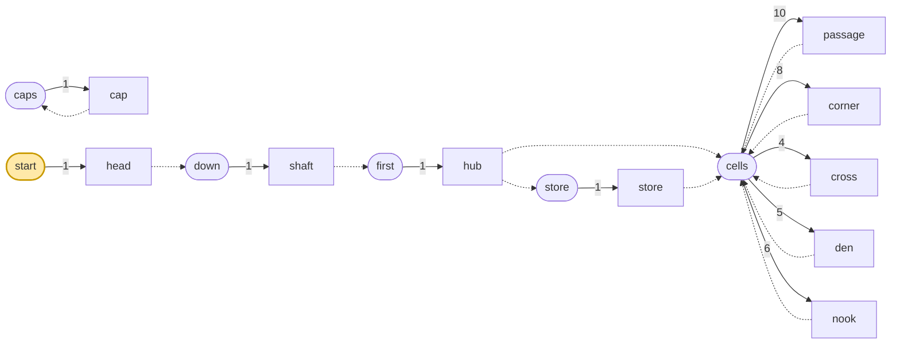

| 풀 | fallback | 원소 (가중치) |
|---|---|---|
| `caps` | `minecraft:empty` | `cap` 1 |
| `cells` | `caps` | `passage` 10, `corner` 8, `cross` 4, `den` 5, `nook` 6 |
| `down` | `minecraft:empty` | `shaft` 1 |
| `first` | `minecraft:empty` | `hub` 1 |
| `start` | `minecraft:empty` | `head` 1 |
| `store` | `caps` | `store` 1 |

## 4. 뼈대 — 반드시 이렇게 놓이는 부분

입구와 수직통로, 사다리가 닿는 허브, 그리고 허브가 반드시 부르는 상자 방. 미로는 판마다 다르다.

| 조각 | 놓이는 자리 (시작 조각 기준) | 누가 놓나 |
|---|---|---|
| `head` | (0, 0, 0) | 시작 풀 |
| `shaft` | (0, -21, 0) | head의 아래 cairn_down 직소 |
| `hub` | (0, -28, 0) | shaft의 아래 cairn_cell 직소 |
| `store` | (0, -28, -7) | hub의 북 cairn_cell 직소 |

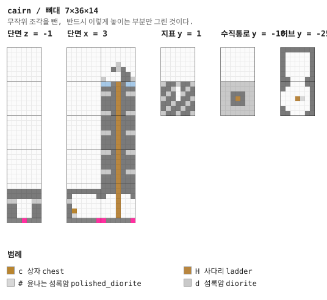

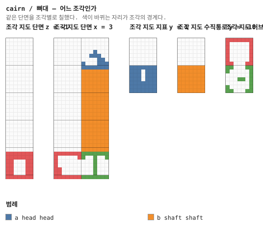

## 5. 조각


그림은 조각 하나를 **층마다 한 장씩** 블록 단위로 그린 것이다. 같은 층이 이어지면 `y = 2–5`처럼 묶었고, 마지막 두 장은 가운데를 자른 세로 단면이다. 분홍 점이 직소, 화살표가 그 직소가 보는 방향이다 — **마주 본 직소끼리만 붙는다.**

### `head` — 7×8×7

시작 조각. 돌무덤. 쌓아 올린 돌 사이가 북쪽으로 뚫려 있다. 기초는 없다 — 바닥 켜가 곧 지형의 맨 윗 블록이다 (§30).

**어느 풀에 있나** — `start` (가중치 1)

| 직소 위치 | 향 | name | target | pool |
|---|---|---|---|---|
| (4, 0, 3) | ◇ 아래 | `cairn_down` | `cairn_down` | `cairn/down` |

**뚫린 면** — 서: z 0–6, y 2–7 (42칸) / 동: z 0–6, y 2–7 (42칸) / 북: x 0–6, y 2–7 (42칸) / 남: x 0–6, y 2–7 (42칸) / 위: x 0–6, z 0–6 (49칸)

**블록** — 돌 50, 다진 얼음 40, 섬록암 28, 조약돌 7, 사다리 1, 직소 1

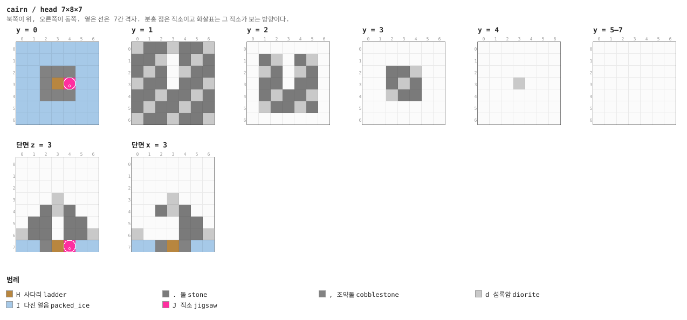

<details><summary>층별 지도 (텍스트)</summary>

```
y = 0   x →동, z ↓남
  IIIIIII
  IIIIIII
  II,,,II
  II,HJII
  II,,,II
  IIIIIII
  IIIIIII
y = 1   x →동, z ↓남
  d..d..d
  ..d..d.
  .d..d..
  d.....d
  ..d..d.
  .d..d..
  d..d..d
y = 2   x →동, z ↓남
  .......
  ..d..d.
  .d..d..
  .......
  ..d..d.
  .d..d..
  .......
y = 3   x →동, z ↓남
  .......
  .......
  ....d..
  ...d...
  ..d....
  .......
  .......
y = 4   x →동, z ↓남
  .......
  .......
  .......
  ...d...
  .......
  .......
  .......
y = 5–7   x →동, z ↓남
  .......
  .......
  .......
  .......
  .......
  .......
  .......
```

</details>

<details><summary>세로 단면 (텍스트)</summary>

```
단면 z = 3   x →동, y ↑하늘
  .......
  .......
  .......
  ...d...
  ...d...
  .......
  d.....d
  II,HJII
단면 x = 3   z →남, y ↑하늘
  .......
  .......
  .......
  ...d...
  ...d...
  .......
  d.....d
  II,H,II
```

</details>


### `shaft` — 7×21×7 — 1×3×1 셀

수직통로 21칸. 지형의 돌에 띠, 가운데 한 칸이 사다리 (§33).

**어느 풀에 있나** — `down` (가중치 1)

| 직소 위치 | 향 | name | target | pool |
|---|---|---|---|---|
| (4, 0, 3) | ◇ 아래 | `cairn_cell` | `cairn_cell` | `cairn/first` |
| (4, 20, 3) | ◆ 위 | `cairn_down` | `cairn_down` | `—` |

**블록** — 돌 806, 섬록암 200, 사다리 21, 직소 2

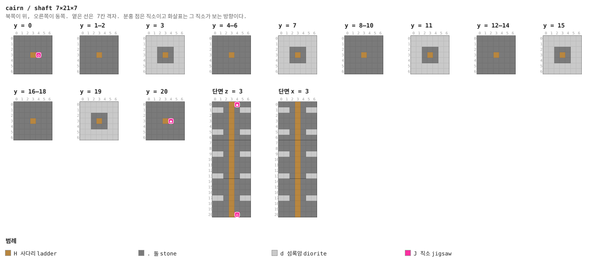

<details><summary>층별 지도 (텍스트)</summary>

```
y = 0   x →동, z ↓남
  .......
  .......
  .......
  ...HJ..
  .......
  .......
  .......
y = 1–2   x →동, z ↓남
  .......
  .......
  .......
  ...H...
  .......
  .......
  .......
y = 3   x →동, z ↓남
  ddddddd
  ddddddd
  dd...dd
  dd.H.dd
  dd...dd
  ddddddd
  ddddddd
y = 4–6   x →동, z ↓남
  .......
  .......
  .......
  ...H...
  .......
  .......
  .......
y = 7   x →동, z ↓남
  ddddddd
  ddddddd
  dd...dd
  dd.H.dd
  dd...dd
  ddddddd
  ddddddd
y = 8–10   x →동, z ↓남
  .......
  .......
  .......
  ...H...
  .......
  .......
  .......
y = 11   x →동, z ↓남
  ddddddd
  ddddddd
  dd...dd
  dd.H.dd
  dd...dd
  ddddddd
  ddddddd
y = 12–14   x →동, z ↓남
  .......
  .......
  .......
  ...H...
  .......
  .......
  .......
y = 15   x →동, z ↓남
  ddddddd
  ddddddd
  dd...dd
  dd.H.dd
  dd...dd
  ddddddd
  ddddddd
y = 16–18   x →동, z ↓남
  .......
  .......
  .......
  ...H...
  .......
  .......
  .......
y = 19   x →동, z ↓남
  ddddddd
  ddddddd
  dd...dd
  dd.H.dd
  dd...dd
  ddddddd
  ddddddd
y = 20   x →동, z ↓남
  .......
  .......
  .......
  ...HJ..
  .......
  .......
  .......
```

</details>

<details><summary>세로 단면 (텍스트)</summary>

```
단면 z = 3   x →동, y ↑하늘
  ...HJ..
  dd.H.dd
  ...H...
  ...H...
  ...H...
  dd.H.dd
  ...H...
  ...H...
  ...H...
  dd.H.dd
  ...H...
  ...H...
  ...H...
  dd.H.dd
  ...H...
  ...H...
  ...H...
  dd.H.dd
  ...H...
  ...H...
  ...HJ..
단면 x = 3   z →남, y ↑하늘
  ...H...
  dd.H.dd
  ...H...
  ...H...
  ...H...
  dd.H.dd
  ...H...
  ...H...
  ...H...
  dd.H.dd
  ...H...
  ...H...
  ...H...
  dd.H.dd
  ...H...
  ...H...
  ...H...
  dd.H.dd
  ...H...
  ...H...
  ...H...
```

</details>


### `hub` — 7×7×7 — 1×1×1 셀

사다리가 닿는 방. 서·남문이 미로로 가고 **북문이 상자 방**을 부른다 — 단일 원소 풀이라
반드시 나온다. 이 던전에서 불이 켜져 있는 곳은 여기뿐이다 (§6).

**어느 풀에 있나** — `first` (가중치 1)

| 직소 위치 | 향 | name | target | pool |
|---|---|---|---|---|
| (3, 0, 0) | ▲ 북 | `cairn_cell` | `cairn_cell` | `cairn/store` |
| (0, 0, 3) | ◀ 서 | `cairn_cell` | `cairn_cell` | `cairn/cells` |
| (3, 0, 6) | ▼ 남 | `cairn_cell` | `cairn_cell` | `cairn/cells` |
| (4, 6, 3) | ◆ 위 | `cairn_cell` | `cairn_cell` | `—` |

**뚫린 면** — 서: z 2–4, y 1–4 (12칸) / 북: x 2–4, y 1–4 (12칸) / 남: x 2–4, y 1–4 (12칸)

**블록** — 돌 116, 조약돌 46, 섬록암 15, 사다리 6, 윤나는 섬록암 5, 직소 4, 랜턴 1

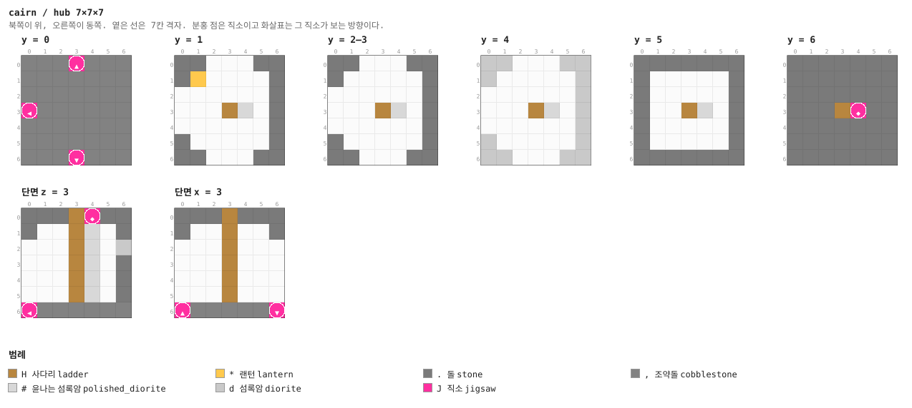

<details><summary>층별 지도 (텍스트)</summary>

```
y = 0   x →동, z ↓남
  ,,,J,,,
  ,,,,,,,
  ,,,,,,,
  J,,,,,,
  ,,,,,,,
  ,,,,,,,
  ,,,J,,,
y = 1   x →동, z ↓남
  .......
  .*.....
  .......
  ...H#..
  .......
  .......
  .......
y = 2–3   x →동, z ↓남
  .......
  .......
  .......
  ...H#..
  .......
  .......
  .......
y = 4   x →동, z ↓남
  dd...dd
  d.....d
  ......d
  ...H#.d
  ......d
  d.....d
  dd...dd
y = 5   x →동, z ↓남
  .......
  .......
  .......
  ...H#..
  .......
  .......
  .......
y = 6   x →동, z ↓남
  .......
  .......
  .......
  ...HJ..
  .......
  .......
  .......
```

</details>


### `store` — 7×7×7 — 1×1×1 셀

상자 방. 상자·통·랜턴. 허브가 반드시 부르므로 언제나 있다.

**어느 풀에 있나** — `store` (가중치 1)

| 직소 위치 | 향 | name | target | pool |
|---|---|---|---|---|
| (3, 0, 6) | ▼ 남 | `cairn_cell` | `cairn_cell` | `cairn/cells` |

**뚫린 면** — 남: x 2–4, y 1–4 (12칸)

**블록** — 돌 136, 조약돌 48, 섬록암 21, 윤나는 섬록암 4, 가문비나무 울타리 1, 랜턴 1, 직소 1, 상자 1

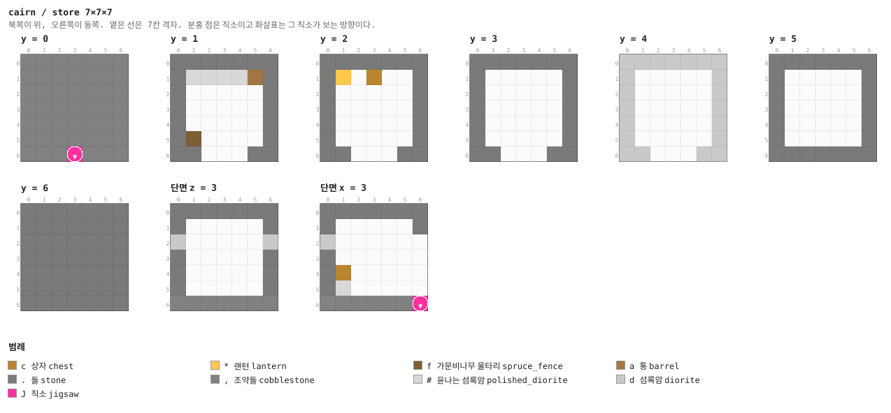

<details><summary>층별 지도 (텍스트)</summary>

```
y = 0   x →동, z ↓남
  ,,,,,,,
  ,,,,,,,
  ,,,,,,,
  ,,,,,,,
  ,,,,,,,
  ,,,,,,,
  ,,,J,,,
y = 1   x →동, z ↓남
  .......
  .####a.
  .......
  .......
  .......
  .f.....
  .......
y = 2   x →동, z ↓남
  .......
  .*.c...
  .......
  .......
  .......
  .......
  .......
y = 3   x →동, z ↓남
  .......
  .......
  .......
  .......
  .......
  .......
  .......
y = 4   x →동, z ↓남
  ddddddd
  d.....d
  d.....d
  d.....d
  d.....d
  d.....d
  dd...dd
y = 5   x →동, z ↓남
  .......
  .......
  .......
  .......
  .......
  .......
  .......
y = 6   x →동, z ↓남
  .......
  .......
  .......
  .......
  .......
  .......
  .......
```

</details>


### `passage` — 7×7×7 — 1×1×1 셀

미로의 기본 단위.

**어느 풀에 있나** — `cells` (가중치 10)

| 직소 위치 | 향 | name | target | pool |
|---|---|---|---|---|
| (0, 0, 3) | ◀ 서 | `cairn_cell` | `cairn_cell` | `cairn/cells` |
| (6, 0, 3) | ▶ 동 | `cairn_cell` | `cairn_cell` | `cairn/cells` |

**뚫린 면** — 서: z 2–4, y 1–4 (12칸) / 동: z 2–4, y 1–4 (12칸)

**블록** — 돌 127, 조약돌 47, 섬록암 18, 직소 2, 윤나는 섬록암 2

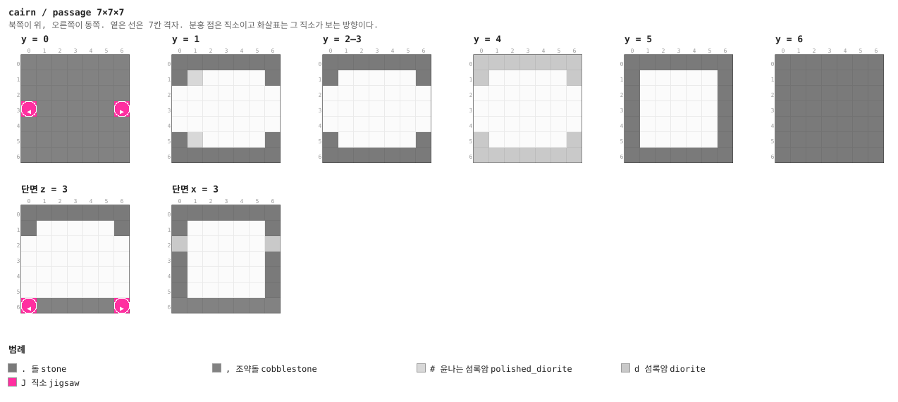

<details><summary>층별 지도 (텍스트)</summary>

```
y = 0   x →동, z ↓남
  ,,,,,,,
  ,,,,,,,
  ,,,,,,,
  J,,,,,J
  ,,,,,,,
  ,,,,,,,
  ,,,,,,,
y = 1   x →동, z ↓남
  .......
  .#.....
  .......
  .......
  .......
  .#.....
  .......
y = 2–3   x →동, z ↓남
  .......
  .......
  .......
  .......
  .......
  .......
  .......
y = 4   x →동, z ↓남
  ddddddd
  d.....d
  .......
  .......
  .......
  d.....d
  ddddddd
y = 5   x →동, z ↓남
  .......
  .......
  .......
  .......
  .......
  .......
  .......
y = 6   x →동, z ↓남
  .......
  .......
  .......
  .......
  .......
  .......
  .......
```

</details>


### `corner` — 7×7×7 — 1×1×1 셀

꺾이는 통로. 랜턴 하나.

**어느 풀에 있나** — `cells` (가중치 8)

| 직소 위치 | 향 | name | target | pool |
|---|---|---|---|---|
| (0, 0, 3) | ◀ 서 | `cairn_cell` | `cairn_cell` | `cairn/cells` |
| (3, 0, 6) | ▼ 남 | `cairn_cell` | `cairn_cell` | `cairn/cells` |

**뚫린 면** — 서: z 2–4, y 1–4 (12칸) / 남: x 2–4, y 1–4 (12칸)

**블록** — 돌 127, 조약돌 47, 섬록암 18, 직소 2, 윤나는 섬록암 1, 랜턴 1

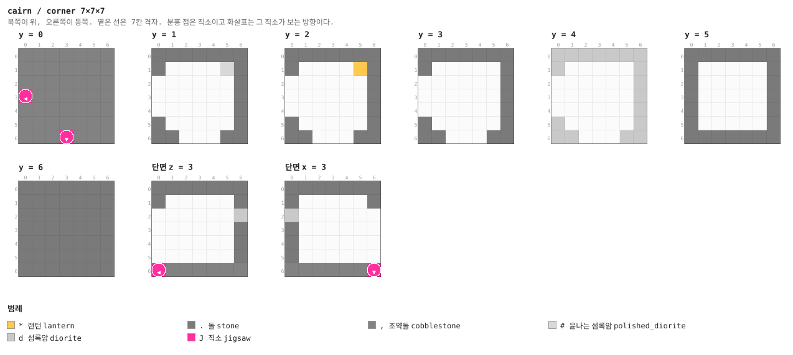

<details><summary>층별 지도 (텍스트)</summary>

```
y = 0   x →동, z ↓남
  ,,,,,,,
  ,,,,,,,
  ,,,,,,,
  J,,,,,,
  ,,,,,,,
  ,,,,,,,
  ,,,J,,,
y = 1   x →동, z ↓남
  .......
  .....#.
  .......
  .......
  .......
  .......
  .......
y = 2   x →동, z ↓남
  .......
  .....*.
  .......
  .......
  .......
  .......
  .......
y = 3   x →동, z ↓남
  .......
  .......
  .......
  .......
  .......
  .......
  .......
y = 4   x →동, z ↓남
  ddddddd
  d.....d
  ......d
  ......d
  ......d
  d.....d
  dd...dd
y = 5   x →동, z ↓남
  .......
  .......
  .......
  .......
  .......
  .......
  .......
y = 6   x →동, z ↓남
  .......
  .......
  .......
  .......
  .......
  .......
  .......
```

</details>


### `cross` — 7×7×7 — 1×1×1 셀

네거리. 네 구석에 기둥.

**어느 풀에 있나** — `cells` (가중치 4)

| 직소 위치 | 향 | name | target | pool |
|---|---|---|---|---|
| (3, 0, 0) | ▲ 북 | `cairn_cell` | `cairn_cell` | `cairn/cells` |
| (0, 0, 3) | ◀ 서 | `cairn_cell` | `cairn_cell` | `cairn/cells` |
| (6, 0, 3) | ▶ 동 | `cairn_cell` | `cairn_cell` | `cairn/cells` |
| (3, 0, 6) | ▼ 남 | `cairn_cell` | `cairn_cell` | `cairn/cells` |

**뚫린 면** — 서: z 2–4, y 1–4 (12칸) / 동: z 2–4, y 1–4 (12칸) / 북: x 2–4, y 1–4 (12칸) / 남: x 2–4, y 1–4 (12칸)

**블록** — 돌 109, 조약돌 45, 섬록암 12, 윤나는 섬록암 12, 직소 4

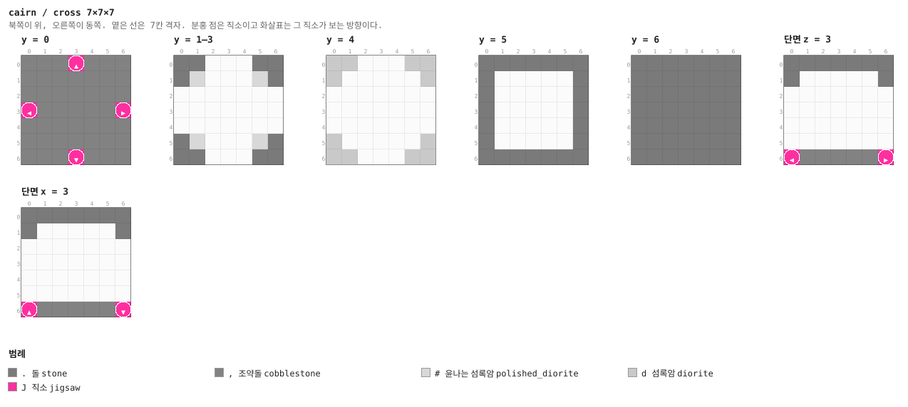

<details><summary>층별 지도 (텍스트)</summary>

```
y = 0   x →동, z ↓남
  ,,,J,,,
  ,,,,,,,
  ,,,,,,,
  J,,,,,J
  ,,,,,,,
  ,,,,,,,
  ,,,J,,,
y = 1–3   x →동, z ↓남
  .......
  .#...#.
  .......
  .......
  .......
  .#...#.
  .......
y = 4   x →동, z ↓남
  dd...dd
  d.....d
  .......
  .......
  .......
  d.....d
  dd...dd
y = 5   x →동, z ↓남
  .......
  .......
  .......
  .......
  .......
  .......
  .......
y = 6   x →동, z ↓남
  .......
  .......
  .......
  .......
  .......
  .......
  .......
```

</details>


### `den` — 7×7×7 — 1×1×1 셀

스포너 칸. stray가 나온다.

**어느 풀에 있나** — `cells` (가중치 5)

| 직소 위치 | 향 | name | target | pool |
|---|---|---|---|---|
| (0, 0, 3) | ◀ 서 | `cairn_cell` | `cairn_cell` | `cairn/cells` |
| (6, 0, 3) | ▶ 동 | `cairn_cell` | `cairn_cell` | `cairn/cells` |

**뚫린 면** — 서: z 2–4, y 1–4 (12칸) / 동: z 2–4, y 1–4 (12칸)

**블록** — 돌 127, 조약돌 38, 섬록암 18, 윤나는 섬록암 9, 직소 2, 거미줄 1, 몬스터 스포너 1

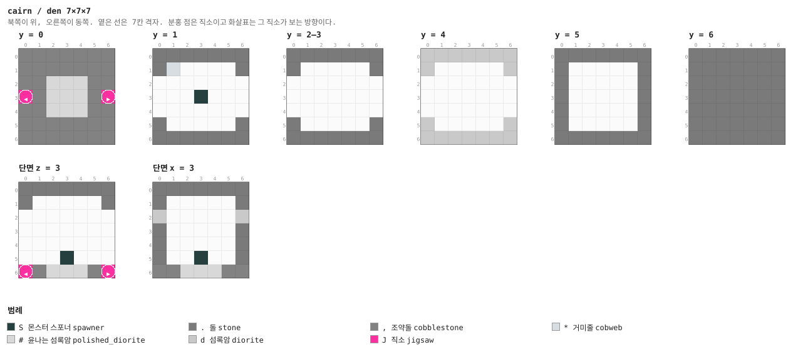

<details><summary>층별 지도 (텍스트)</summary>

```
y = 0   x →동, z ↓남
  ,,,,,,,
  ,,,,,,,
  ,,###,,
  J,###,J
  ,,###,,
  ,,,,,,,
  ,,,,,,,
y = 1   x →동, z ↓남
  .......
  .*.....
  .......
  ...S...
  .......
  .......
  .......
y = 2–3   x →동, z ↓남
  .......
  .......
  .......
  .......
  .......
  .......
  .......
y = 4   x →동, z ↓남
  ddddddd
  d.....d
  .......
  .......
  .......
  d.....d
  ddddddd
y = 5   x →동, z ↓남
  .......
  .......
  .......
  .......
  .......
  .......
  .......
y = 6   x →동, z ↓남
  .......
  .......
  .......
  .......
  .......
  .......
  .......
```

</details>


### `nook` — 7×7×7 — 1×1×1 셀

막다른 방. 상자 하나.

**어느 풀에 있나** — `cells` (가중치 6)

| 직소 위치 | 향 | name | target | pool |
|---|---|---|---|---|
| (0, 0, 3) | ◀ 서 | `cairn_cell` | `cairn_cell` | `cairn/cells` |

**뚫린 면** — 서: z 2–4, y 1–4 (12칸)

**블록** — 돌 136, 조약돌 48, 섬록암 21, 다진 얼음 4, 직소 1, 상자 1, 랜턴 1

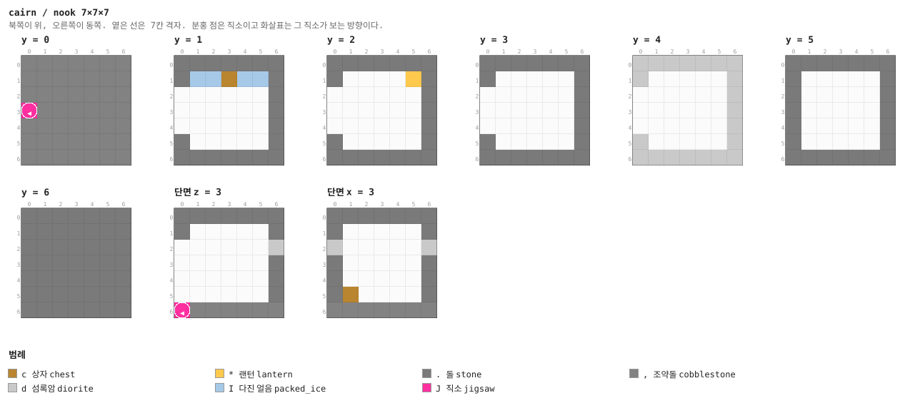

<details><summary>층별 지도 (텍스트)</summary>

```
y = 0   x →동, z ↓남
  ,,,,,,,
  ,,,,,,,
  ,,,,,,,
  J,,,,,,
  ,,,,,,,
  ,,,,,,,
  ,,,,,,,
y = 1   x →동, z ↓남
  .......
  .IIcII.
  .......
  .......
  .......
  .......
  .......
y = 2   x →동, z ↓남
  .......
  .....*.
  .......
  .......
  .......
  .......
  .......
y = 3   x →동, z ↓남
  .......
  .......
  .......
  .......
  .......
  .......
  .......
y = 4   x →동, z ↓남
  ddddddd
  d.....d
  ......d
  ......d
  ......d
  d.....d
  ddddddd
y = 5   x →동, z ↓남
  .......
  .......
  .......
  .......
  .......
  .......
  .......
y = 6   x →동, z ↓남
  .......
  .......
  .......
  .......
  .......
  .......
  .......
```

</details>


### `cap` — 1×7×7

두께 1의 마개. 미로 풀의 fallback (§4).

**어느 풀에 있나** — `caps` (가중치 1)

| 직소 위치 | 향 | name | target | pool |
|---|---|---|---|---|
| (0, 0, 3) | ◀ 서 | `cairn_cell` | `cairn_cell` | `cairn/caps` |

**블록** — 돌 35, 섬록암 13, 직소 1

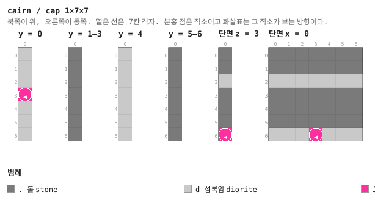

<details><summary>층별 지도 (텍스트)</summary>

```
y = 0   x →동, z ↓남
  d
  d
  d
  J
  d
  d
  d
y = 1–3   x →동, z ↓남
  .
  .
  .
  .
  .
  .
  .
y = 4   x →동, z ↓남
  d
  d
  d
  d
  d
  d
  d
y = 5–6   x →동, z ↓남
  .
  .
  .
  .
  .
  .
  .
```

</details>


## 다듬을 곳

- **조각이 열 개뿐이다.** 같은 문 배치의 방을 더 만들어 풀에 넣으면 그만큼 다양해지고,
  **배선은 안 건드려도 된다** (§16)
- **입구가 네 종류뿐이다.** `head`는 우물·둔덕·오두막·돌무덤 넷이고 여덟 껍질이 그걸 나눠
  쓴다. 구조물 블록 한계(48) 안이므로 손으로 지어 되가져올 수 있다
- **심층 어둠에는 아직 없다.** 러시·종유석은 들어왔지만 심층 어둠은 비어 있다 — 바닐라
  고대 도시가 이미 그 자리에 있어서, 넣는다면 그것과 어떻게 나눌지부터 정해야 한다
- **산·해변·벚꽃숲·버섯섬에 중소규모가 없다.** 표에 줄을 더하면 되는 일이다 (§35)
