# 레벨 설계 — 군벌의 진영

> 이 문서는 `python tools/gen_level_doc.py camp`가 만든다. 조각을 고치면 다시 돌린다. 그림과 표는 게임이 읽는 파일(`structure/camp/*.nbt`, `worldgen/**`)에서 그대로 읽어 온 것이라 모드와 어긋날 수 없다. 설명 문장만 사람이 쓴다 (`tools/gen_level_doc.py`의 `INTRO`·`NOTES`).

## 1. 한눈에

사바나와 악지에 선 49칸짜리 진영이다. 통나무 **목책**이 마당을 두르고 네 귀퉁이에 **감시탑**이
서고, 가운데 **대말움집**이 있다. 서쪽 목책의 문으로 들어간다. 움집 바닥의 구멍으로 사다리가
21칸 내려가면 나무로 받친 **갱도**고, 통로 셋 뒤에 **군벌**이 있다.

**한 판:** 문 → 마당(모닥불·상자·약탈자) → 감시탑 넷(궁수와 상자) → 움집 → 사다리 → 갱도
(무너진 곳·수상한 자갈·**라버저 우리**) → 군벌. 이기면 **다중 발사 또는 관통 석궁 + 불길한 병
2~3 + 에메랄드 10~18 + 파수꾼 장식 템플릿 2**가 확정이다. 불길한 병은 바닐라 트라이얼 챔버를
불길하게 여는 열쇠고, 이 모드에서 그것을 주는 곳은 여기뿐이다.

| 항목 | 값 |
|---|---|
| 생성 단계 | `surface_structures` |
| 바이옴 | `#sydungeon:has_structure/camp` |
| 간격 / 최소거리 | spacing 40 / separation 14 |
| 직소 깊이 | 14 ~ 22 (`sydungeon:ranged_jigsaw`) |
| 시작 풀 | `start` |
| 조각 / 풀 | 21개 / 14개 |

## 2. 조립 원리

### 얼음 성채의 기계를 아카시아로

고리는 성채와 똑같이 만든다 (`CLAUDE.md` §19). **대말움집이 시작 조각**이고 사방으로 목책
조각을 부르며, **북쪽과 남쪽 조각만** 제 양 끝에서 감시탑을 부른다 — 한 번만 부르면 회전이
하나로 정해지고, 거울 한 쌍으로 좌우를 맞춘다 (§13). 상자들이 진영 가운데를 비워 두므로
**아래로 내려가는 가지가 갇히지 않는다.**

성채와 다른 점은 **목책이 얇다**는 것이다. 성채의 벽은 일곱 칸 두께라 탑이 순찰로에서만
열렸지만, 목책은 두 칸이고 마당이 탑까지 닿아서 **탑 문이 땅 높이에 있다.**

### 악지가 기초를 요구한다

사바나는 평평한데 악지는 한 구조물 안에서 지형이 무너진다. 그래서 조각마다 **기초 일곱 켜**를
달고 있다 (§18). 시작 조각은 바닥이 지표에 고정되지만 자식은 직소 높이로만 놓이므로, 목책과
탑은 얼마든지 깊어도 된다.

### 사다리와 발판

세 곳에서 같은 문제를 만났고 셋 다 같은 규칙으로 풀었다 (§24).

- 움집 바닥의 3×3 구멍 — **사다리가 있는 줄을 바닥 켜에서 남긴다.** 걸어 나가서 올라탄다
- 갱도 허브 — 사다리가 방 한가운데라 걸 데가 없다. **통나무 기둥**을 세우고 그 안에 직소를 넣었다
- 감시탑 — 사다리가 발판 밑에서 끊기면 올라가도 설 자리가 없다. **발판을 뚫고 한 칸 더** 올라가고,
  난간 한 칸을 비워 그리로 내린다. 귀퉁이 기둥이 난간보다 한 칸 높은 이유도 그것이다 — 사다리의
  맨 윗칸이 걸릴 벽이 필요하다

### 트리거가 있는 함정은 없다

콘셉트의 라버저 우리는 **트리거가 아니라 선택**이다. 철창 안에 라버저 스포너가 있고, 깨는 것은
플레이어의 판단이다 — 몹은 철창을 깨지 않는다. 무너진 갱도와 수상한 자갈도 같다: 하나는 늘
거기 있는 위험이고, 하나는 솔질이 플레이어만 되는 것이다 (§12).

## 3. 풀 배선

풀이 어떤 조각을 내놓는지(실선, 숫자는 가중치)와 그 조각의 직소가 다시 어떤 풀을 부르는지(점선)다. 직소 생성은 이 그래프를 깊이만큼 따라간다.

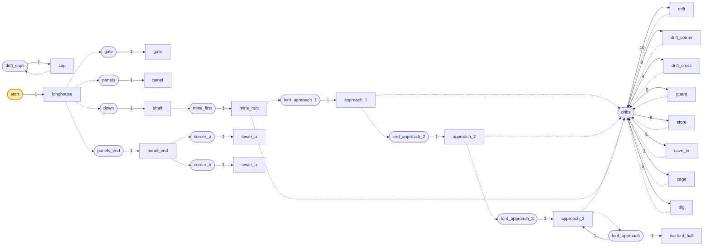

| 풀 | fallback | 원소 (가중치) |
|---|---|---|
| `corner_a` | `minecraft:empty` | `tower_a` 1 |
| `corner_b` | `minecraft:empty` | `tower_b` 1 |
| `down` | `minecraft:empty` | `shaft` 1 |
| `drift_caps` | `minecraft:empty` | `cap` 1 |
| `drifts` | `drift_caps` | `drift` 10, `drift_corner` 9, `drift_cross` 4, `guard` 5, `store` 8, `cave_in` 5, `cage` 3, `dig` 5 |
| `gate` | `minecraft:empty` | `gate` 1 |
| `lord_approach` | `drift_caps` | `warlord_hall` 1, `approach_3` 1 |
| `lord_approach_1` | `drift_caps` | `approach_1` 1 |
| `lord_approach_2` | `drift_caps` | `approach_2` 1 |
| `lord_approach_3` | `drift_caps` | `approach_3` 1 |
| `mine_first` | `minecraft:empty` | `mine_hub` 1 |
| `panels` | `minecraft:empty` | `panel` 1 |
| `panels_end` | `minecraft:empty` | `panel_end` 1 |
| `start` | `minecraft:empty` | `longhouse` 1 |

## 4. 뼈대 — 반드시 이렇게 놓이는 부분

움집과 그것이 부르는 목책·감시탑, 그리고 사다리 아래의 사슬. **원소가 하나뿐인 풀로 놓이는
것만** 그렸다. 갱도는 판마다 다르다. 지상 조각 여덟이 49×49를 빈틈없이 덮는다.

| 조각 | 놓이는 자리 (시작 조각 기준) | 누가 놓나 |
|---|---|---|
| `longhouse` | (0, 0, 0) | 시작 풀 |
| `gate` | (-14, -7, 0) | longhouse의 서 cmp_wall 직소 |
| `panel_end` | (0, -7, -14) | longhouse의 북 cmp_wall 직소 |
| `shaft` | (7, -35, 7) | longhouse의 아래 cmp_down 직소 |
| `panel_end` | (0, -7, 21) | longhouse의 남 cmp_wall 직소 |
| `panel` | (21, -7, 0) | longhouse의 동 cmp_wall 직소 |
| `tower_a` | (-14, -7, -14) | panel_end의 서 cmp_corner_a 직소 |
| `tower_b` | (21, -7, -14) | panel_end의 동 cmp_corner_b 직소 |
| `mine_hub` | (7, -42, 7) | shaft의 아래 cmp_drift 직소 |
| `tower_a` | (-14, -7, 21) | panel_end의 서 cmp_corner_a 직소 |
| `tower_b` | (21, -7, 21) | panel_end의 동 cmp_corner_b 직소 |
| `approach_1` | (7, -42, 14) | mine_hub의 남 cmp_drift 직소 |
| `approach_2` | (14, -42, 14) | approach_1의 동 cmp_drift 직소 |
| `approach_3` | (21, -42, 14) | approach_2의 동 cmp_drift 직소 |

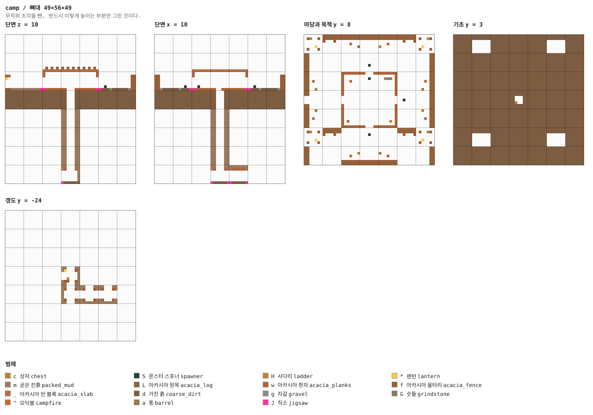

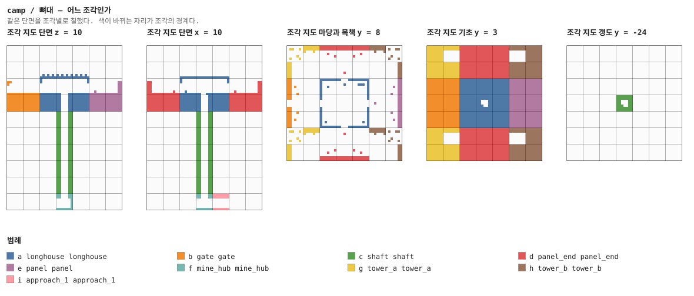

## 5. 조각


그림은 조각 하나를 **층마다 한 장씩** 블록 단위로 그린 것이다. 같은 층이 이어지면 `y = 2–5`처럼 묶었고, 마지막 두 장은 가운데를 자른 세로 단면이다. 분홍 점이 직소, 화살표가 그 직소가 보는 방향이다 — **마주 본 직소끼리만 붙는다.**

### `longhouse` — 21×14×21 — 3×2×3 셀

시작 조각. 21×21의 대말움집이고 사방에 문이 있어 **그 넷이 목책을 부른다.** 바닥의 3×3 구멍이
갱도로 가는 유일한 길이고, 사다리가 있는 줄은 바닥 켜에서 남겨 두어 걸어 나가 올라탈 수 있다.

안에 모닥불·전쟁 탁자(지도 제작대)·숫돌·상자·통, 그리고 변명자 스포너 하나.

**어느 풀에 있나** — `start` (가중치 1)

| 직소 위치 | 향 | name | target | pool |
|---|---|---|---|---|
| (10, 0, 0) | ▲ 북 | `cmp_wall` | `cmp_wall` | `camp/panels_end` |
| (0, 0, 10) | ◀ 서 | `cmp_wall` | `cmp_wall` | `camp/gate` |
| (20, 0, 10) | ▶ 동 | `cmp_wall` | `cmp_wall` | `camp/panels` |
| (10, 0, 11) | ◇ 아래 | `cmp_down` | `cmp_down` | `camp/down` |
| (10, 0, 20) | ▼ 남 | `cmp_wall` | `cmp_wall` | `camp/panels_end` |

**뚫린 면** — 서: z 0–20, y 1–13 (138칸) / 동: z 0–20, y 1–13 (138칸) / 북: x 0–20, y 1–13 (138칸) / 남: x 0–20, y 1–13 (138칸) / 위: x 0–20, z 0–20 (441칸)

**블록** — 아카시아 판자 835, 아카시아 반 블록 441, 아카시아 원목 34, 아카시아 다락문 8, 직소 5, 랜턴 4, 굳은 진흙 2, 통 1

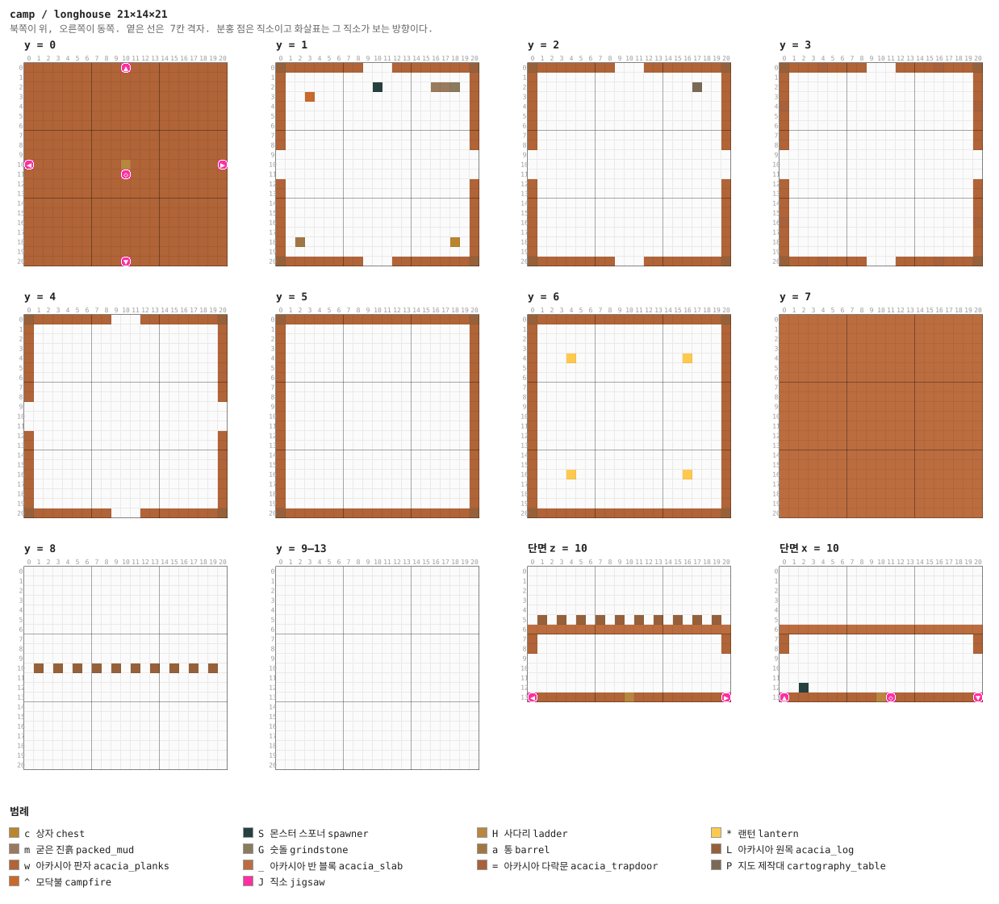

<details><summary>층별 지도 (텍스트)</summary>

```
y = 0   x →동, z ↓남
  wwwwwwwwwwJwwwwwwwwww
  wwwwwwwwwwwwwwwwwwwww
  wwwwwwwwwwwwwwwwwwwww
  wwwwwwwwwwwwwwwwwwwww
  wwwwwwwwwwwwwwwwwwwww
  wwwwwwwwwwwwwwwwwwwww
  wwwwwwwwwwwwwwwwwwwww
  wwwwwwwwwwwwwwwwwwwww
  wwwwwwwwwwwwwwwwwwwww
  wwwwwwwwwwwwwwwwwwwww
  JwwwwwwwwwHwwwwwwwwwJ
  wwwwwwwwwwJwwwwwwwwww
  wwwwwwwwwwwwwwwwwwwww
  wwwwwwwwwwwwwwwwwwwww
  wwwwwwwwwwwwwwwwwwwww
  wwwwwwwwwwwwwwwwwwwww
  wwwwwwwwwwwwwwwwwwwww
  wwwwwwwwwwwwwwwwwwwww
  wwwwwwwwwwwwwwwwwwwww
  wwwwwwwwwwwwwwwwwwwww
  wwwwwwwwwwJwwwwwwwwww
y = 1   x →동, z ↓남
  Lwwwwwwww...wwwwwwwwL
  w...................w
  w.........S.....mmG.w
  w..^................w
  w...................w
  w...................w
  w...................w
  w...................w
  w...................w
  .....................
  .....................
  .....................
  w...................w
  w...................w
  w...................w
  w...................w
  w...................w
  w...................w
  w.a...............c.w
  w...................w
  Lwwwwwwww...wwwwwwwwL
y = 2   x →동, z ↓남
  Lwwwwwwww...wwwwwwwwL
  w...................w
  w................P..w
  w...................w
  w...................w
  w...................w
  w...................w
  w...................w
  w...................w
  .....................
  .....................
  .....................
  w...................w
  w...................w
  w...................w
  w...................w
  w...................w
  w...................w
  w...................w
  w...................w
  Lwwwwwwww...wwwwwwwwL
y = 3   x →동, z ↓남
  Lwww=wwww...wwww=wwwL
  w...................w
  w...................w
  w...................w
  =...................=
  w...................w
  w...................w
  w...................w
  w...................w
  .....................
  .....................
  .....................
  w...................w
  w...................w
  w...................w
  w...................w
  =...................=
  w...................w
  w...................w
  w...................w
  Lwww=wwww...wwww=wwwL
y = 4   x →동, z ↓남
  Lwwwwwwww...wwwwwwwwL
  w...................w
  w...................w
  w...................w
  w...................w
  w...................w
  w...................w
  w...................w
  w...................w
  .....................
  .....................
  .....................
  w...................w
  w...................w
  w...................w
  w...................w
  w...................w
  w...................w
  w...................w
  w...................w
  Lwwwwwwww...wwwwwwwwL
y = 5   x →동, z ↓남
  LwwwwwwwwwwwwwwwwwwwL
  w...................w
  w...................w
  w...................w
  w...................w
  w...................w
  w...................w
  w...................w
  w...................w
  w...................w
  w...................w
  w...................w
  w...................w
  w...................w
  w...................w
  w...................w
  w...................w
  w...................w
  w...................w
  w...................w
  LwwwwwwwwwwwwwwwwwwwL
y = 6   x →동, z ↓남
  LwwwwwwwwwwwwwwwwwwwL
  w...................w
  w...................w
  w...................w
  w...*...........*...w
  w...................w
  w...................w
  w...................w
  w...................w
  w...................w
  w...................w
  w...................w
  w...................w
  w...................w
  w...................w
  w...................w
  w...*...........*...w
  w...................w
  w...................w
  w...................w
  LwwwwwwwwwwwwwwwwwwwL
y = 7   x →동, z ↓남
  _____________________
  _____________________
  _____________________
  _____________________
  _____________________
  _____________________
  _____________________
  _____________________
  _____________________
  _____________________
  _____________________
  _____________________
  _____________________
  _____________________
  _____________________
  _____________________
  _____________________
  _____________________
  _____________________
  _____________________
  _____________________
y = 8   x →동, z ↓남
  .....................
  .....................
  .....................
  .....................
  .....................
  .....................
  .....................
  .....................
  .....................
  .....................
  .L.L.L.L.L.L.L.L.L.L.
  .....................
  .....................
  .....................
  .....................
  .....................
  .....................
  .....................
  .....................
  .....................
  .....................
y = 9–13   x →동, z ↓남
  .....................
  .....................
  .....................
  .....................
  .....................
  .....................
  .....................
  .....................
  .....................
  .....................
  .....................
  .....................
  .....................
  .....................
  .....................
  .....................
  .....................
  .....................
  .....................
  .....................
  .....................
```

</details>

<details><summary>세로 단면 (텍스트)</summary>

```
단면 z = 10   x →동, y ↑하늘
  .....................
  .....................
  .....................
  .....................
  .....................
  .L.L.L.L.L.L.L.L.L.L.
  _____________________
  w...................w
  w...................w
  .....................
  .....................
  .....................
  .....................
  JwwwwwwwwwHwwwwwwwwwJ
단면 x = 10   z →남, y ↑하늘
  .....................
  .....................
  .....................
  .....................
  .....................
  .....................
  _____________________
  w...................w
  w...................w
  .....................
  .....................
  .....................
  ..S..................
  JwwwwwwwwwHJwwwwwwwwJ
```

</details>


### `gate` — 21×21×14 — 3×3×2 셀

서쪽 문. 통나무를 3×4로 뚫고 양옆에 목책보다 높은 문기둥을 세우고, 상인방 아래에 랜턴을
걸었다. 마당 쪽으로 굳은 진흙 길이 이어진다. 여기에는 스포너를 두지 않았다 — 들어서는 순간
석궁이 날아오는 것은 진영이 아니라 함정이다.

**어느 풀에 있나** — `gate` (가중치 1)

| 직소 위치 | 향 | name | target | pool |
|---|---|---|---|---|
| (10, 7, 13) | ▼ 남 | `cmp_wall` | `cmp_wall` | `—` |

**뚫린 면** — 서: z 0–13, y 8–20 (172칸) / 동: z 0–13, y 8–20 (172칸) / 북: x 0–20, y 8–20 (175칸) / 남: x 0–20, y 8–20 (273칸) / 위: x 0–20, z 0–13 (294칸)

**블록** — 거친 흙 2244, 아카시아 원목 198, 굳은 진흙 35, 아카시아 울타리 32, 자갈 30, 아카시아 판자 6, 모닥불 2, 통 1

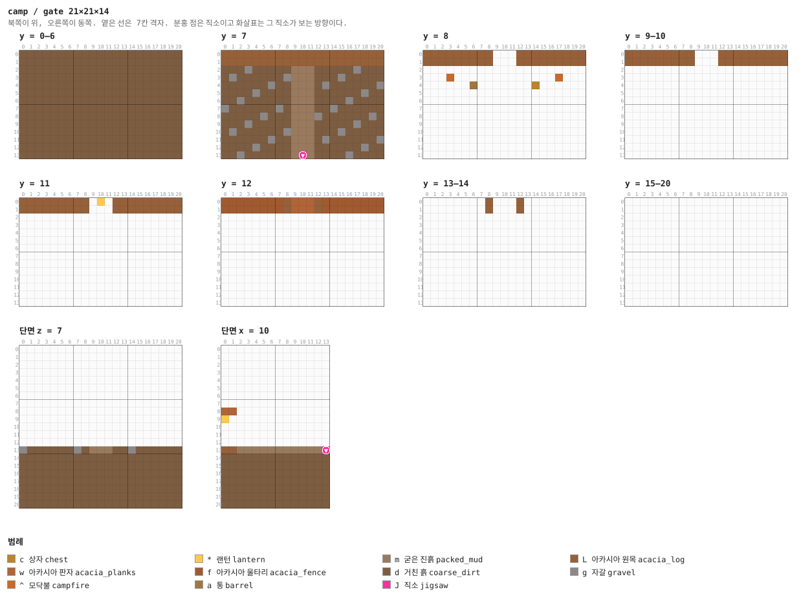

<details><summary>층별 지도 (텍스트)</summary>

```
y = 0–6   x →동, z ↓남
  ddddddddddddddddddddd
  ddddddddddddddddddddd
  ddddddddddddddddddddd
  ddddddddddddddddddddd
  ddddddddddddddddddddd
  ddddddddddddddddddddd
  ddddddddddddddddddddd
  ddddddddddddddddddddd
  ddddddddddddddddddddd
  ddddddddddddddddddddd
  ddddddddddddddddddddd
  ddddddddddddddddddddd
  ddddddddddddddddddddd
  ddddddddddddddddddddd
y = 7   x →동, z ↓남
  LLLLLLLLLLLLLLLLLLLLL
  LLLLLLLLLLLLLLLLLLLLL
  dddgdddddmmmdddddgddd
  dgddddddgmmmdddgddddd
  ddddddgddmmmdgddddddg
  ddddgddddmmmddddddgdd
  ddgddddddmmmddddgdddd
  gddddddgdmmmddgdddddd
  dddddgdddmmmgddddddgd
  dddgdddddmmmdddddgddd
  dgddddddgmmmdddgddddd
  ddddddgddmmmdgddddddg
  ddddgddddmmmddddddgdd
  ddgddddddmJmddddgdddd
y = 8   x →동, z ↓남
  LLLLLLLLL...LLLLLLLLL
  LLLLLLLLL...LLLLLLLLL
  .....................
  ...^.............^...
  ......a.......c......
  .....................
  .....................
  .....................
  .....................
  .....................
  .....................
  .....................
  .....................
  .....................
y = 9–10   x →동, z ↓남
  LLLLLLLLL...LLLLLLLLL
  LLLLLLLLL...LLLLLLLLL
  .....................
  .....................
  .....................
  .....................
  .....................
  .....................
  .....................
  .....................
  .....................
  .....................
  .....................
  .....................
y = 11   x →동, z ↓남
  LLLLLLLLL.*.LLLLLLLLL
  LLLLLLLLL...LLLLLLLLL
  .....................
  .....................
  .....................
  .....................
  .....................
  .....................
  .....................
  .....................
  .....................
  .....................
  .....................
  .....................
y = 12   x →동, z ↓남
  ffffffffLwwwLffffffff
  ffffffffLwwwLffffffff
  .....................
  .....................
  .....................
  .....................
  .....................
  .....................
  .....................
  .....................
  .....................
  .....................
  .....................
  .....................
y = 13–14   x →동, z ↓남
  ........L...L........
  ........L...L........
  .....................
  .....................
  .....................
  .....................
  .....................
  .....................
  .....................
  .....................
  .....................
  .....................
  .....................
  .....................
y = 15–20   x →동, z ↓남
  .....................
  .....................
  .....................
  .....................
  .....................
  .....................
  .....................
  .....................
  .....................
  .....................
  .....................
  .....................
  .....................
  .....................
```

</details>

<details><summary>세로 단면 (텍스트)</summary>

```
단면 z = 7   x →동, y ↑하늘
  .....................
  .....................
  .....................
  .....................
  .....................
  .....................
  .....................
  .....................
  .....................
  .....................
  .....................
  .....................
  .....................
  gddddddgdmmmddgdddddd
  ddddddddddddddddddddd
  ddddddddddddddddddddd
  ddddddddddddddddddddd
  ddddddddddddddddddddd
  ddddddddddddddddddddd
  ddddddddddddddddddddd
  ddddddddddddddddddddd
단면 x = 10   z →남, y ↑하늘
  ..............
  ..............
  ..............
  ..............
  ..............
  ..............
  ..............
  ..............
  ww............
  *.............
  ..............
  ..............
  ..............
  LLmmmmmmmmmmmJ
  dddddddddddddd
  dddddddddddddd
  dddddddddddddd
  dddddddddddddd
  dddddddddddddd
  dddddddddddddd
  dddddddddddddd
```

</details>


### `panel` — 21×21×14 — 3×3×2 셀

목책 한 변과 그 앞의 마당. 통나무 두 겹을 다섯 칸 높이로 세우고 위에 울타리로 끝을 뾰족하게
했다. 안쪽에 버팀대, 마당에 모닥불 둘과 상자·통, 그리고 약탈자 스포너 하나.

아래 일곱 켜는 기초다 — 악지에서 진영이 공중에 뜨지 않게 하는 것이 그것이다 (§18).

**어느 풀에 있나** — `panels` (가중치 1)

| 직소 위치 | 향 | name | target | pool |
|---|---|---|---|---|
| (10, 7, 13) | ▼ 남 | `cmp_wall` | `cmp_wall` | `—` |

**뚫린 면** — 서: z 0–13, y 8–20 (172칸) / 동: z 0–13, y 8–20 (172칸) / 북: x 0–20, y 13–20 (168칸) / 남: x 0–20, y 8–20 (273칸) / 위: x 0–20, z 0–13 (294칸)

**블록** — 거친 흙 2273, 아카시아 원목 210, 아카시아 울타리 42, 자갈 36, 모닥불 2, 통 1, 직소 1, 몬스터 스포너 1

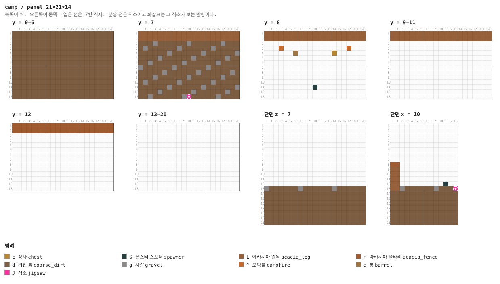

<details><summary>층별 지도 (텍스트)</summary>

```
y = 0–6   x →동, z ↓남
  ddddddddddddddddddddd
  ddddddddddddddddddddd
  ddddddddddddddddddddd
  ddddddddddddddddddddd
  ddddddddddddddddddddd
  ddddddddddddddddddddd
  ddddddddddddddddddddd
  ddddddddddddddddddddd
  ddddddddddddddddddddd
  ddddddddddddddddddddd
  ddddddddddddddddddddd
  ddddddddddddddddddddd
  ddddddddddddddddddddd
  ddddddddddddddddddddd
y = 7   x →동, z ↓남
  LLLLLLLLLLLLLLLLLLLLL
  LLLLLLLLLLLLLLLLLLLLL
  dddgddddddgddddddgddd
  dgddddddgddddddgddddd
  ddddddgddddddgddddddg
  ddddgddddddgddddddgdd
  ddgddddddgddddddgdddd
  gddddddgddddddgdddddd
  dddddgddddddgddddddgd
  dddgddddddgddddddgddd
  dgddddddgddddddgddddd
  ddddddgddddddgddddddg
  ddddgddddddgddddddgdd
  ddgddddddgJdddddgdddd
y = 8   x →동, z ↓남
  LLLLLLLLLLLLLLLLLLLLL
  LLLLLLLLLLLLLLLLLLLLL
  .....................
  ...^.............^...
  ......a.......c......
  .....................
  .....................
  .....................
  .....................
  .....................
  .....................
  ..........S..........
  .....................
  .....................
y = 9–11   x →동, z ↓남
  LLLLLLLLLLLLLLLLLLLLL
  LLLLLLLLLLLLLLLLLLLLL
  .....................
  .....................
  .....................
  .....................
  .....................
  .....................
  .....................
  .....................
  .....................
  .....................
  .....................
  .....................
y = 12   x →동, z ↓남
  fffffffffffffffffffff
  fffffffffffffffffffff
  .....................
  .....................
  .....................
  .....................
  .....................
  .....................
  .....................
  .....................
  .....................
  .....................
  .....................
  .....................
y = 13–20   x →동, z ↓남
  .....................
  .....................
  .....................
  .....................
  .....................
  .....................
  .....................
  .....................
  .....................
  .....................
  .....................
  .....................
  .....................
  .....................
```

</details>

<details><summary>세로 단면 (텍스트)</summary>

```
단면 z = 7   x →동, y ↑하늘
  .....................
  .....................
  .....................
  .....................
  .....................
  .....................
  .....................
  .....................
  .....................
  .....................
  .....................
  .....................
  .....................
  gddddddgddddddgdddddd
  ddddddddddddddddddddd
  ddddddddddddddddddddd
  ddddddddddddddddddddd
  ddddddddddddddddddddd
  ddddddddddddddddddddd
  ddddddddddddddddddddd
  ddddddddddddddddddddd
단면 x = 10   z →남, y ↑하늘
  ..............
  ..............
  ..............
  ..............
  ..............
  ..............
  ..............
  ..............
  ff............
  LL............
  LL............
  LL............
  LL.........S..
  LLgddddddgdddJ
  dddddddddddddd
  dddddddddddddd
  dddddddddddddd
  dddddddddddddd
  dddddddddddddd
  dddddddddddddd
  dddddddddddddd
```

</details>


### `panel_end` — 21×21×14 — 3×3×2 셀

북쪽과 남쪽 목책. `panel`과 같은데 **양 끝에 감시탑을 부르는 직소**가 하나씩 더 있다. 동·서에는
없다 — 탑을 두 방향에서 부르면 어느 쪽이 먼저 놓이느냐에 따라 회전이 갈린다 (§13).

**어느 풀에 있나** — `panels_end` (가중치 1)

| 직소 위치 | 향 | name | target | pool |
|---|---|---|---|---|
| (0, 7, 11) | ◀ 서 | `cmp_corner_a` | `cmp_corner_a` | `camp/corner_a` |
| (20, 7, 11) | ▶ 동 | `cmp_corner_b` | `cmp_corner_b` | `camp/corner_b` |
| (10, 7, 13) | ▼ 남 | `cmp_wall` | `cmp_wall` | `—` |

**뚫린 면** — 서: z 0–13, y 8–20 (172칸) / 동: z 0–13, y 8–20 (172칸) / 북: x 0–20, y 13–20 (168칸) / 남: x 0–20, y 8–20 (273칸) / 위: x 0–20, z 0–13 (294칸)

**블록** — 거친 흙 2272, 아카시아 원목 210, 아카시아 울타리 42, 자갈 35, 직소 3, 모닥불 2, 통 1, 몬스터 스포너 1


<details><summary>층별 지도 (텍스트)</summary>

```
y = 0–6   x →동, z ↓남
  ddddddddddddddddddddd
  ddddddddddddddddddddd
  ddddddddddddddddddddd
  ddddddddddddddddddddd
  ddddddddddddddddddddd
  ddddddddddddddddddddd
  ddddddddddddddddddddd
  ddddddddddddddddddddd
  ddddddddddddddddddddd
  ddddddddddddddddddddd
  ddddddddddddddddddddd
  ddddddddddddddddddddd
  ddddddddddddddddddddd
  ddddddddddddddddddddd
y = 7   x →동, z ↓남
  LLLLLLLLLLLLLLLLLLLLL
  LLLLLLLLLLLLLLLLLLLLL
  dddgddddddgddddddgddd
  dgddddddgddddddgddddd
  ddddddgddddddgddddddg
  ddddgddddddgddddddgdd
  ddgddddddgddddddgdddd
  gddddddgddddddgdddddd
  dddddgddddddgddddddgd
  dddgddddddgddddddgddd
  dgddddddgddddddgddddd
  JdddddgddddddgddddddJ
  ddddgddddddgddddddgdd
  ddgddddddgJdddddgdddd
y = 8   x →동, z ↓남
  LLLLLLLLLLLLLLLLLLLLL
  LLLLLLLLLLLLLLLLLLLLL
  .....................
  ...^.............^...
  ......a.......c......
  .....................
  .....................
  .....................
  .....................
  .....................
  .....................
  ..........S..........
  .....................
  .....................
y = 9–11   x →동, z ↓남
  LLLLLLLLLLLLLLLLLLLLL
  LLLLLLLLLLLLLLLLLLLLL
  .....................
  .....................
  .....................
  .....................
  .....................
  .....................
  .....................
  .....................
  .....................
  .....................
  .....................
  .....................
y = 12   x →동, z ↓남
  fffffffffffffffffffff
  fffffffffffffffffffff
  .....................
  .....................
  .....................
  .....................
  .....................
  .....................
  .....................
  .....................
  .....................
  .....................
  .....................
  .....................
y = 13–20   x →동, z ↓남
  .....................
  .....................
  .....................
  .....................
  .....................
  .....................
  .....................
  .....................
  .....................
  .....................
  .....................
  .....................
  .....................
  .....................
```

</details>

<details><summary>세로 단면 (텍스트)</summary>

```
단면 z = 7   x →동, y ↑하늘
  .....................
  .....................
  .....................
  .....................
  .....................
  .....................
  .....................
  .....................
  .....................
  .....................
  .....................
  .....................
  .....................
  gddddddgddddddgdddddd
  ddddddddddddddddddddd
  ddddddddddddddddddddd
  ddddddddddddddddddddd
  ddddddddddddddddddddd
  ddddddddddddddddddddd
  ddddddddddddddddddddd
  ddddddddddddddddddddd
단면 x = 10   z →남, y ↑하늘
  ..............
  ..............
  ..............
  ..............
  ..............
  ..............
  ..............
  ..............
  ff............
  LL............
  LL............
  LL............
  LL.........S..
  LLgddddddgdddJ
  dddddddddddddd
  dddddddddddddd
  dddddddddddddd
  dddddddddddddd
  dddddddddddddd
  dddddddddddddd
  dddddddddddddd
```

</details>


### `tower_a` — 14×28×14 — 2×4×2 셀

북서 귀퉁이. 14×14를 네 칸으로 나눠 **바깥 모서리에 감시탑, 두 팔은 목책, 안쪽은 마당**이다.
탑은 통나무 네 기둥 위에 판자 발판을 얹은 것이고, 사다리가 발판을 뚫고 올라가 난간의 빈
한 칸으로 내린다. 위에 약탈자 스포너와 상자.

**어느 풀에 있나** — `corner_a` (가중치 1)

| 직소 위치 | 향 | name | target | pool |
|---|---|---|---|---|
| (13, 7, 11) | ▶ 동 | `cmp_corner_a` | `cmp_corner_a` | `—` |

**뚫린 면** — 서: z 0–13, y 8–27 (245칸) / 동: z 0–13, y 0–27 (310칸) / 북: x 0–13, y 8–27 (245칸) / 남: x 0–13, y 8–27 (270칸) / 아래: x 7–13, z 2–6 (35칸) / 위: x 0–13, z 0–13 (196칸)

**블록** — 거친 흙 1248, 아카시아 원목 192, 아카시아 울타리 46, 아카시아 판자 24, 사다리 14, 자갈 11, 몬스터 스포너 1, 랜턴 1

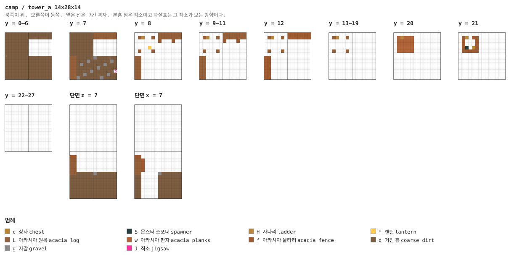

<details><summary>층별 지도 (텍스트)</summary>

```
y = 0–6   x →동, z ↓남
  dddddddddddddd
  dddddddddddddd
  ddddddd.......
  ddddddd.......
  ddddddd.......
  ddddddd.......
  ddddddd.......
  dddddddddddddd
  dddddddddddddd
  dddddddddddddd
  dddddddddddddd
  dddddddddddddd
  dddddddddddddd
  dddddddddddddd
y = 7   x →동, z ↓남
  dddddddLLLLLLL
  dddddddLLLLLLL
  ddddddd.......
  ddddddd.......
  ddddddd.......
  ddddddd.......
  ddddddd.......
  LLdddddgdddddd
  LLdddgddddddgd
  LLdgddddddgddd
  LLddddddgddddd
  LLddddgddddddJ
  LLddgddddddgdd
  LLgddddddgdddd
y = 8   x →동, z ↓남
  .......LLLLLLL
  .LH..L.LLLLLLL
  .......f...f..
  ..............
  ....*.........
  .L...L........
  ..............
  LL............
  LL............
  LL............
  LL............
  LL............
  LL............
  LL............
y = 9–11   x →동, z ↓남
  .......LLLLLLL
  .LH..L.LLLLLLL
  .......f...f..
  ..............
  ..............
  .L...L........
  ..............
  LL............
  LL............
  LL............
  LL............
  LL............
  LL............
  LL............
y = 12   x →동, z ↓남
  .......fffffff
  .LH..L.fffffff
  ..............
  ..............
  ..............
  .L...L........
  ..............
  ff............
  ff............
  ff............
  ff............
  ff............
  ff............
  ff............
y = 13–19   x →동, z ↓남
  ..............
  .LH..L........
  ..............
  ..............
  ..............
  .L...L........
  ..............
  ..............
  ..............
  ..............
  ..............
  ..............
  ..............
  ..............
y = 20   x →동, z ↓남
  ..............
  .wHwww........
  .wwwww........
  .wwwww........
  .wwwww........
  .wwwww........
  ..............
  ..............
  ..............
  ..............
  ..............
  ..............
  ..............
  ..............
y = 21   x →동, z ↓남
  ..............
  .LH.fL........
  .f...f........
  .f...f........
  .fS.cf........
  .LfffL........
  ..............
  ..............
  ..............
  ..............
  ..............
  ..............
  ..............
  ..............
y = 22–27   x →동, z ↓남
  ..............
  ..............
  ..............
  ..............
  ..............
  ..............
  ..............
  ..............
  ..............
  ..............
  ..............
  ..............
  ..............
  ..............
```

</details>

<details><summary>세로 단면 (텍스트)</summary>

```
단면 z = 7   x →동, y ↑하늘
  ..............
  ..............
  ..............
  ..............
  ..............
  ..............
  ..............
  ..............
  ..............
  ..............
  ..............
  ..............
  ..............
  ..............
  ..............
  ff............
  LL............
  LL............
  LL............
  LL............
  LLdddddgdddddd
  dddddddddddddd
  dddddddddddddd
  dddddddddddddd
  dddddddddddddd
  dddddddddddddd
  dddddddddddddd
  dddddddddddddd
단면 x = 7   z →남, y ↑하늘
  ..............
  ..............
  ..............
  ..............
  ..............
  ..............
  ..............
  ..............
  ..............
  ..............
  ..............
  ..............
  ..............
  ..............
  ..............
  ff............
  LLf...........
  LLf...........
  LLf...........
  LLf...........
  LL.....gdddddd
  dd.....ddddddd
  dd.....ddddddd
  dd.....ddddddd
  dd.....ddddddd
  dd.....ddddddd
  dd.....ddddddd
  dd.....ddddddd
```

</details>


### `tower_b` — 14×28×14 — 2×4×2 셀

북동 귀퉁이. `tower_a`를 x로 뒤집은 것이다. 바닐라는 돌려는 줘도 뒤집어 주지 않는다.

**어느 풀에 있나** — `corner_b` (가중치 1)

| 직소 위치 | 향 | name | target | pool |
|---|---|---|---|---|
| (0, 7, 11) | ◀ 서 | `cmp_corner_b` | `cmp_corner_b` | `—` |

**뚫린 면** — 서: z 0–13, y 0–27 (310칸) / 동: z 0–13, y 8–27 (245칸) / 북: x 0–13, y 8–27 (245칸) / 남: x 0–13, y 8–27 (270칸) / 아래: x 0–6, z 2–6 (35칸) / 위: x 0–13, z 0–13 (196칸)

**블록** — 거친 흙 1248, 아카시아 원목 192, 아카시아 울타리 46, 아카시아 판자 24, 사다리 14, 자갈 11, 직소 1, 랜턴 1

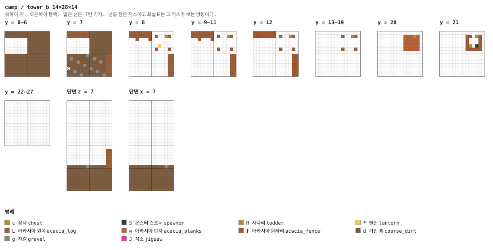

<details><summary>층별 지도 (텍스트)</summary>

```
y = 0–6   x →동, z ↓남
  dddddddddddddd
  dddddddddddddd
  .......ddddddd
  .......ddddddd
  .......ddddddd
  .......ddddddd
  .......ddddddd
  dddddddddddddd
  dddddddddddddd
  dddddddddddddd
  dddddddddddddd
  dddddddddddddd
  dddddddddddddd
  dddddddddddddd
y = 7   x →동, z ↓남
  LLLLLLLddddddd
  LLLLLLLddddddd
  .......ddddddd
  .......ddddddd
  .......ddddddd
  .......ddddddd
  .......ddddddd
  ddddddgdddddLL
  dgddddddgdddLL
  dddgddddddgdLL
  dddddgddddddLL
  JddddddgddddLL
  ddgddddddgddLL
  ddddgddddddgLL
y = 8   x →동, z ↓남
  LLLLLLL.......
  LLLLLLL.L..HL.
  ..f...f.......
  ..............
  .........*....
  ........L...L.
  ..............
  ............LL
  ............LL
  ............LL
  ............LL
  ............LL
  ............LL
  ............LL
y = 9–11   x →동, z ↓남
  LLLLLLL.......
  LLLLLLL.L..HL.
  ..f...f.......
  ..............
  ..............
  ........L...L.
  ..............
  ............LL
  ............LL
  ............LL
  ............LL
  ............LL
  ............LL
  ............LL
y = 12   x →동, z ↓남
  fffffff.......
  fffffff.L..HL.
  ..............
  ..............
  ..............
  ........L...L.
  ..............
  ............ff
  ............ff
  ............ff
  ............ff
  ............ff
  ............ff
  ............ff
y = 13–19   x →동, z ↓남
  ..............
  ........L..HL.
  ..............
  ..............
  ..............
  ........L...L.
  ..............
  ..............
  ..............
  ..............
  ..............
  ..............
  ..............
  ..............
y = 20   x →동, z ↓남
  ..............
  ........wwwHw.
  ........wwwww.
  ........wwwww.
  ........wwwww.
  ........wwwww.
  ..............
  ..............
  ..............
  ..............
  ..............
  ..............
  ..............
  ..............
y = 21   x →동, z ↓남
  ..............
  ........Lf.HL.
  ........f...f.
  ........f...f.
  ........fc.Sf.
  ........LfffL.
  ..............
  ..............
  ..............
  ..............
  ..............
  ..............
  ..............
  ..............
y = 22–27   x →동, z ↓남
  ..............
  ..............
  ..............
  ..............
  ..............
  ..............
  ..............
  ..............
  ..............
  ..............
  ..............
  ..............
  ..............
  ..............
```

</details>

<details><summary>세로 단면 (텍스트)</summary>

```
단면 z = 7   x →동, y ↑하늘
  ..............
  ..............
  ..............
  ..............
  ..............
  ..............
  ..............
  ..............
  ..............
  ..............
  ..............
  ..............
  ..............
  ..............
  ..............
  ............ff
  ............LL
  ............LL
  ............LL
  ............LL
  ddddddgdddddLL
  dddddddddddddd
  dddddddddddddd
  dddddddddddddd
  dddddddddddddd
  dddddddddddddd
  dddddddddddddd
  dddddddddddddd
단면 x = 7   z →남, y ↑하늘
  ..............
  ..............
  ..............
  ..............
  ..............
  ..............
  ..............
  ..............
  ..............
  ..............
  ..............
  ..............
  ..............
  ..............
  ..............
  ..............
  ..............
  ..............
  ..............
  ..............
  dddddddddddgdd
  dddddddddddddd
  dddddddddddddd
  dddddddddddddd
  dddddddddddddd
  dddddddddddddd
  dddddddddddddd
  dddddddddddddd
```

</details>


### `shaft` — 7×35×7 — 1×5×1 셀

움집 바닥에서 굳은 진흙을 뚫고 21칸. 움집과 x·z가 같아 사다리가 한 줄이다.

**어느 풀에 있나** — `down` (가중치 1)

| 직소 위치 | 향 | name | target | pool |
|---|---|---|---|---|
| (3, 0, 4) | ◇ 아래 | `cmp_drift` | `cmp_drift` | `camp/mine_first` |
| (3, 34, 4) | ◆ 위 | `cmp_down` | `cmp_down` | `—` |

**블록** — 돌 1398, 주황 테라코타 280, 사다리 35, 직소 2

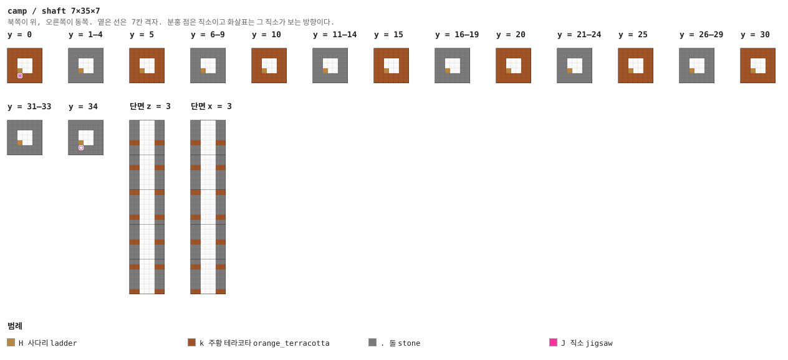

<details><summary>층별 지도 (텍스트)</summary>

```
y = 0   x →동, z ↓남
  kkkkkkk
  kkkkkkk
  kk...kk
  kk.H.kk
  kk.J.kk
  kkkkkkk
  kkkkkkk
y = 1–4   x →동, z ↓남
  .......
  .......
  .......
  ...H...
  .......
  .......
  .......
y = 5   x →동, z ↓남
  kkkkkkk
  kkkkkkk
  kk...kk
  kk.H.kk
  kk...kk
  kkkkkkk
  kkkkkkk
y = 6–9   x →동, z ↓남
  .......
  .......
  .......
  ...H...
  .......
  .......
  .......
y = 10   x →동, z ↓남
  kkkkkkk
  kkkkkkk
  kk...kk
  kk.H.kk
  kk...kk
  kkkkkkk
  kkkkkkk
y = 11–14   x →동, z ↓남
  .......
  .......
  .......
  ...H...
  .......
  .......
  .......
y = 15   x →동, z ↓남
  kkkkkkk
  kkkkkkk
  kk...kk
  kk.H.kk
  kk...kk
  kkkkkkk
  kkkkkkk
y = 16–19   x →동, z ↓남
  .......
  .......
  .......
  ...H...
  .......
  .......
  .......
y = 20   x →동, z ↓남
  kkkkkkk
  kkkkkkk
  kk...kk
  kk.H.kk
  kk...kk
  kkkkkkk
  kkkkkkk
y = 21–24   x →동, z ↓남
  .......
  .......
  .......
  ...H...
  .......
  .......
  .......
y = 25   x →동, z ↓남
  kkkkkkk
  kkkkkkk
  kk...kk
  kk.H.kk
  kk...kk
  kkkkkkk
  kkkkkkk
y = 26–29   x →동, z ↓남
  .......
  .......
  .......
  ...H...
  .......
  .......
  .......
y = 30   x →동, z ↓남
  kkkkkkk
  kkkkkkk
  kk...kk
  kk.H.kk
  kk...kk
  kkkkkkk
  kkkkkkk
y = 31–33   x →동, z ↓남
  .......
  .......
  .......
  ...H...
  .......
  .......
  .......
y = 34   x →동, z ↓남
  .......
  .......
  .......
  ...H...
  ...J...
  .......
  .......
```

</details>

<details><summary>세로 단면 (텍스트)</summary>

```
단면 z = 3   x →동, y ↑하늘
  ...H...
  ...H...
  ...H...
  ...H...
  kk.H.kk
  ...H...
  ...H...
  ...H...
  ...H...
  kk.H.kk
  ...H...
  ...H...
  ...H...
  ...H...
  kk.H.kk
  ...H...
  ...H...
  ...H...
  ...H...
  kk.H.kk
  ...H...
  ...H...
  ...H...
  ...H...
  kk.H.kk
  ...H...
  ...H...
  ...H...
  ...H...
  kk.H.kk
  ...H...
  ...H...
  ...H...
  ...H...
  kk.H.kk
단면 x = 3   z →남, y ↑하늘
  ...HJ..
  ...H...
  ...H...
  ...H...
  kk.H.kk
  ...H...
  ...H...
  ...H...
  ...H...
  kk.H.kk
  ...H...
  ...H...
  ...H...
  ...H...
  kk.H.kk
  ...H...
  ...H...
  ...H...
  ...H...
  kk.H.kk
  ...H...
  ...H...
  ...H...
  ...H...
  kk.H.kk
  ...H...
  ...H...
  ...H...
  ...H...
  kk.H.kk
  ...H...
  ...H...
  ...H...
  ...H...
  kk.HJkk
```

</details>


### `mine_hub` — 7×7×7 — 1×1×1 셀

사다리가 닿는 방. 서·북문이 갱도로, **남문 하나만** `cmp_lord`를 target으로 삼아 보스 사슬을
부른다. 사다리가 방 한가운데라 걸 데가 없으므로 **통나무 기둥**을 바닥부터 천장까지 세우고
직소를 그 안에 넣었다 (§24).

**어느 풀에 있나** — `mine_first` (가중치 1)

| 직소 위치 | 향 | name | target | pool |
|---|---|---|---|---|
| (3, 0, 0) | ▲ 북 | `cmp_drift` | `cmp_drift` | `camp/drifts` |
| (0, 0, 3) | ◀ 서 | `cmp_drift` | `cmp_drift` | `camp/drifts` |
| (3, 0, 6) | ▼ 남 | `cmp_drift` | `cmp_lord` | `camp/lord_approach_1` |
| (3, 6, 4) | ◆ 위 | `cmp_drift` | `cmp_drift` | `—` |

**뚫린 면** — 서: z 2–4, y 1–4 (12칸) / 북: x 2–4, y 1–4 (12칸) / 남: x 2–4, y 1–4 (12칸)

**블록** — 돌 107, 거친 흙 46, 주황 테라코타 24, 아카시아 판자 23, 아카시아 울타리 15, 사다리 6, 아카시아 원목 5, 직소 4

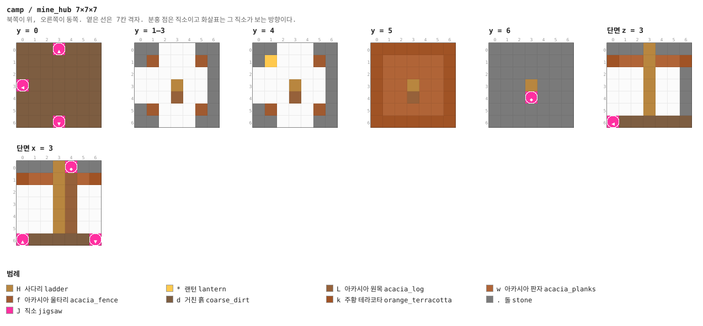

<details><summary>층별 지도 (텍스트)</summary>

```
y = 0   x →동, z ↓남
  dddJddd
  ddddddd
  ddddddd
  Jdddddd
  ddddddd
  ddddddd
  dddJddd
y = 1–3   x →동, z ↓남
  .......
  .f...f.
  .......
  ...H...
  ...L...
  .f...f.
  .......
y = 4   x →동, z ↓남
  .......
  .*...f.
  .......
  ...H...
  ...L...
  .f...f.
  .......
y = 5   x →동, z ↓남
  kkkkkkk
  kwwwwwk
  kwwwwwk
  kwwHwwk
  kwwLwwk
  kwwwwwk
  kkkkkkk
y = 6   x →동, z ↓남
  .......
  .......
  .......
  ...H...
  ...J...
  .......
  .......
```

</details>


### `drift` — 7×7×7 — 1×1×1 셀

갱도의 기본 단위. 네 귀퉁이에 울타리 기둥, 천장에 판자.

**어느 풀에 있나** — `drifts` (가중치 10)

| 직소 위치 | 향 | name | target | pool |
|---|---|---|---|---|
| (0, 0, 3) | ◀ 서 | `cmp_drift` | `cmp_drift` | `camp/drifts` |
| (6, 0, 3) | ▶ 동 | `cmp_drift` | `cmp_drift` | `camp/drifts` |

**뚫린 면** — 서: z 2–4, y 1–4 (12칸) / 동: z 2–4, y 1–4 (12칸)

**블록** — 돌 121, 거친 흙 47, 아카시아 판자 25, 주황 테라코타 24, 아카시아 울타리 16, 직소 2

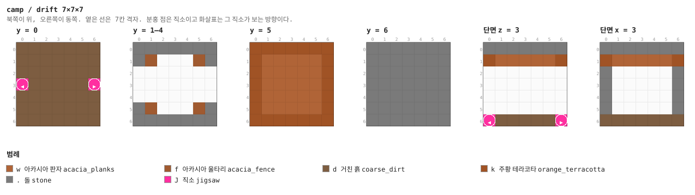

<details><summary>층별 지도 (텍스트)</summary>

```
y = 0   x →동, z ↓남
  ddddddd
  ddddddd
  ddddddd
  JdddddJ
  ddddddd
  ddddddd
  ddddddd
y = 1–4   x →동, z ↓남
  .......
  .f...f.
  .......
  .......
  .......
  .f...f.
  .......
y = 5   x →동, z ↓남
  kkkkkkk
  kwwwwwk
  kwwwwwk
  kwwwwwk
  kwwwwwk
  kwwwwwk
  kkkkkkk
y = 6   x →동, z ↓남
  .......
  .......
  .......
  .......
  .......
  .......
  .......
```

</details>


### `drift_corner` — 7×7×7 — 1×1×1 셀

꺾이는 갱도.

**어느 풀에 있나** — `drifts` (가중치 9)

| 직소 위치 | 향 | name | target | pool |
|---|---|---|---|---|
| (0, 0, 3) | ◀ 서 | `cmp_drift` | `cmp_drift` | `camp/drifts` |
| (3, 0, 6) | ▼ 남 | `cmp_drift` | `cmp_drift` | `camp/drifts` |

**뚫린 면** — 서: z 2–4, y 1–4 (12칸) / 남: x 2–4, y 1–4 (12칸)

**블록** — 돌 121, 거친 흙 47, 아카시아 판자 25, 주황 테라코타 24, 아카시아 울타리 16, 직소 2

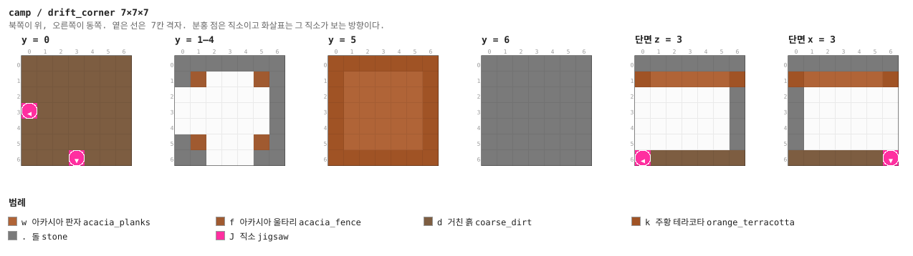

<details><summary>층별 지도 (텍스트)</summary>

```
y = 0   x →동, z ↓남
  ddddddd
  ddddddd
  ddddddd
  Jdddddd
  ddddddd
  ddddddd
  dddJddd
y = 1–4   x →동, z ↓남
  .......
  .f...f.
  .......
  .......
  .......
  .f...f.
  .......
y = 5   x →동, z ↓남
  kkkkkkk
  kwwwwwk
  kwwwwwk
  kwwwwwk
  kwwwwwk
  kwwwwwk
  kkkkkkk
y = 6   x →동, z ↓남
  .......
  .......
  .......
  .......
  .......
  .......
  .......
```

</details>


### `drift_cross` — 7×7×7 — 1×1×1 셀

갱도 네거리.

**어느 풀에 있나** — `drifts` (가중치 4)

| 직소 위치 | 향 | name | target | pool |
|---|---|---|---|---|
| (3, 0, 0) | ▲ 북 | `cmp_drift` | `cmp_drift` | `camp/drifts` |
| (0, 0, 3) | ◀ 서 | `cmp_drift` | `cmp_drift` | `camp/drifts` |
| (6, 0, 3) | ▶ 동 | `cmp_drift` | `cmp_drift` | `camp/drifts` |
| (3, 0, 6) | ▼ 남 | `cmp_drift` | `cmp_drift` | `camp/drifts` |

**뚫린 면** — 서: z 2–4, y 1–4 (12칸) / 동: z 2–4, y 1–4 (12칸) / 북: x 2–4, y 1–4 (12칸) / 남: x 2–4, y 1–4 (12칸)

**블록** — 돌 97, 거친 흙 45, 아카시아 판자 25, 주황 테라코타 24, 아카시아 울타리 16, 직소 4

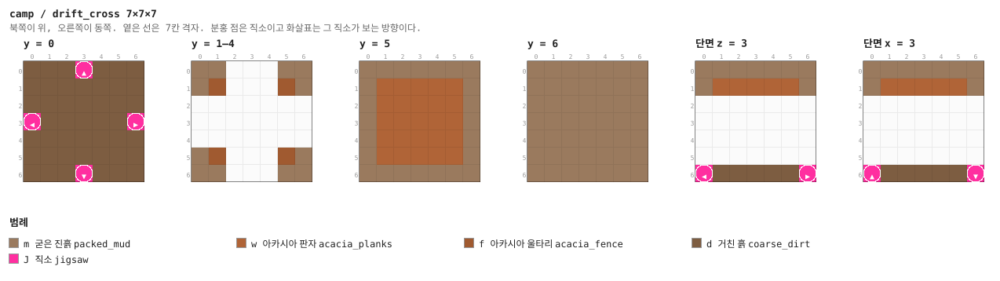

<details><summary>층별 지도 (텍스트)</summary>

```
y = 0   x →동, z ↓남
  dddJddd
  ddddddd
  ddddddd
  JdddddJ
  ddddddd
  ddddddd
  dddJddd
y = 1–4   x →동, z ↓남
  .......
  .f...f.
  .......
  .......
  .......
  .f...f.
  .......
y = 5   x →동, z ↓남
  kkkkkkk
  kwwwwwk
  kwwwwwk
  kwwwwwk
  kwwwwwk
  kwwwwwk
  kkkkkkk
y = 6   x →동, z ↓남
  .......
  .......
  .......
  .......
  .......
  .......
  .......
```

</details>


### `guard` — 7×7×7 — 1×1×1 셀

교차로 한가운데 약탈자 스포너.

**어느 풀에 있나** — `drifts` (가중치 5)

| 직소 위치 | 향 | name | target | pool |
|---|---|---|---|---|
| (3, 0, 0) | ▲ 북 | `cmp_drift` | `cmp_drift` | `camp/drifts` |
| (0, 0, 3) | ◀ 서 | `cmp_drift` | `cmp_drift` | `camp/drifts` |
| (6, 0, 3) | ▶ 동 | `cmp_drift` | `cmp_drift` | `camp/drifts` |
| (3, 0, 6) | ▼ 남 | `cmp_drift` | `cmp_drift` | `camp/drifts` |

**뚫린 면** — 서: z 2–4, y 1–4 (12칸) / 동: z 2–4, y 1–4 (12칸) / 북: x 2–4, y 1–4 (12칸) / 남: x 2–4, y 1–4 (12칸)

**블록** — 돌 97, 거친 흙 45, 아카시아 판자 25, 주황 테라코타 24, 아카시아 울타리 15, 직소 4, 통 1, 몬스터 스포너 1

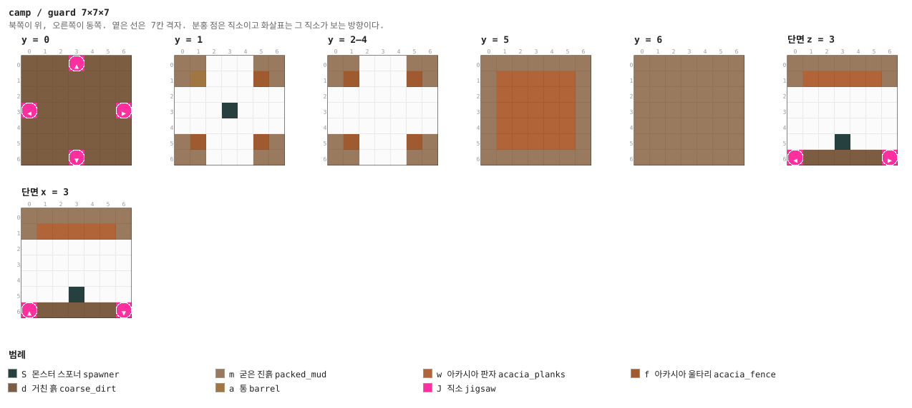

<details><summary>층별 지도 (텍스트)</summary>

```
y = 0   x →동, z ↓남
  dddJddd
  ddddddd
  ddddddd
  JdddddJ
  ddddddd
  ddddddd
  dddJddd
y = 1   x →동, z ↓남
  .......
  .a...f.
  .......
  ...S...
  .......
  .f...f.
  .......
y = 2–4   x →동, z ↓남
  .......
  .f...f.
  .......
  .......
  .......
  .f...f.
  .......
y = 5   x →동, z ↓남
  kkkkkkk
  kwwwwwk
  kwwwwwk
  kwwwwwk
  kwwwwwk
  kwwwwwk
  kkkkkkk
y = 6   x →동, z ↓남
  .......
  .......
  .......
  .......
  .......
  .......
  .......
```

</details>


### `store` — 7×7×7 — 1×1×1 셀

막다른 저장고. 상자와 통, 건초. 문이 하나면 상자를 준다.

**어느 풀에 있나** — `drifts` (가중치 8)

| 직소 위치 | 향 | name | target | pool |
|---|---|---|---|---|
| (0, 0, 3) | ◀ 서 | `cmp_drift` | `cmp_drift` | `camp/drifts` |

**뚫린 면** — 서: z 2–4, y 1–4 (12칸)

**블록** — 돌 133, 거친 흙 48, 아카시아 판자 25, 주황 테라코타 24, 아카시아 울타리 14, 직소 1, 통 1, 건초 더미 1

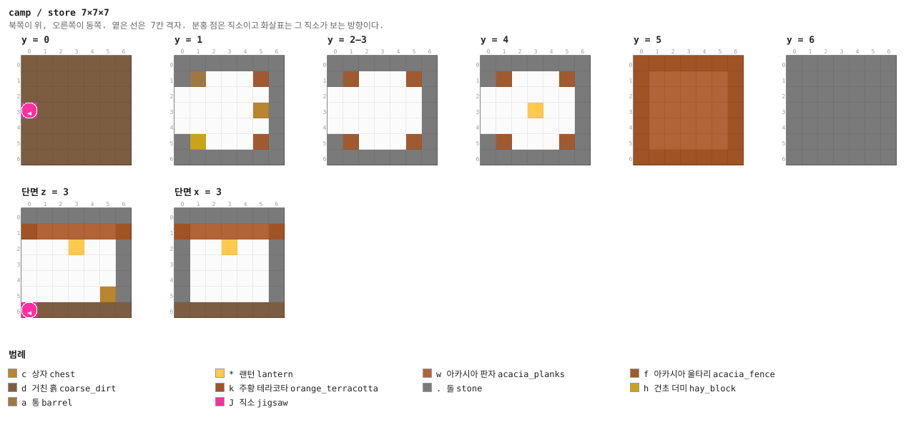

<details><summary>층별 지도 (텍스트)</summary>

```
y = 0   x →동, z ↓남
  ddddddd
  ddddddd
  ddddddd
  Jdddddd
  ddddddd
  ddddddd
  ddddddd
y = 1   x →동, z ↓남
  .......
  .a...f.
  .......
  .....c.
  .......
  .h...f.
  .......
y = 2–3   x →동, z ↓남
  .......
  .f...f.
  .......
  .......
  .......
  .f...f.
  .......
y = 4   x →동, z ↓남
  .......
  .f...f.
  .......
  ...*...
  .......
  .f...f.
  .......
y = 5   x →동, z ↓남
  kkkkkkk
  kwwwwwk
  kwwwwwk
  kwwwwwk
  kwwwwwk
  kwwwwwk
  kkkkkkk
y = 6   x →동, z ↓남
  .......
  .......
  .......
  .......
  .......
  .......
  .......
```

</details>


### `cave_in` — 7×7×7 — 1×1×1 셀

천장이 무너져 자갈이 절반을 메운 갱도. 거미줄이 남아 있다. 트리거가 없는 위험이다.

**어느 풀에 있나** — `drifts` (가중치 5)

| 직소 위치 | 향 | name | target | pool |
|---|---|---|---|---|
| (0, 0, 3) | ◀ 서 | `cmp_drift` | `cmp_drift` | `camp/drifts` |
| (6, 0, 3) | ▶ 동 | `cmp_drift` | `cmp_drift` | `camp/drifts` |

**뚫린 면** — 서: z 2–4, y 1–4 (12칸) / 동: z 2–4, y 1–4 (12칸)

**블록** — 돌 121, 거친 흙 47, 아카시아 판자 25, 주황 테라코타 24, 자갈 18, 아카시아 울타리 10, 거미줄 3, 직소 2

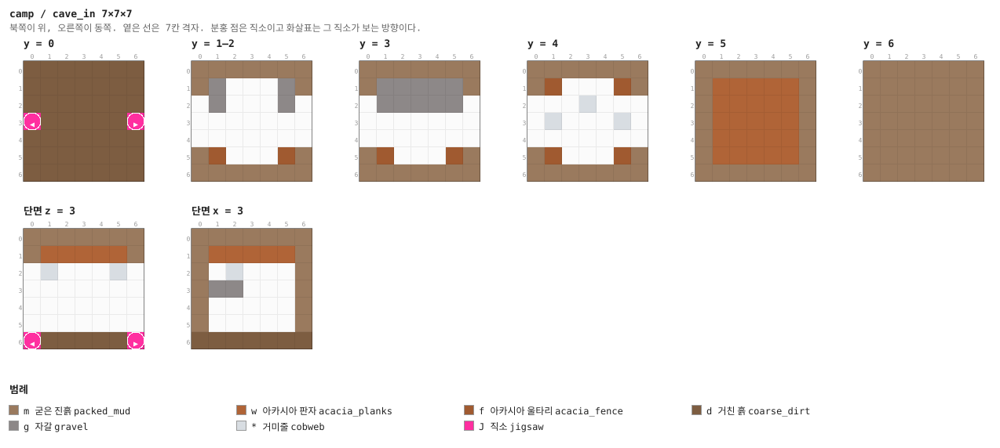

<details><summary>층별 지도 (텍스트)</summary>

```
y = 0   x →동, z ↓남
  ddddddd
  ddddddd
  ddddddd
  JdddddJ
  ddddddd
  ddddddd
  ddddddd
y = 1–2   x →동, z ↓남
  .......
  .g...g.
  .g...g.
  .......
  .......
  .f...f.
  .......
y = 3   x →동, z ↓남
  .......
  .ggggg.
  .ggggg.
  .......
  .......
  .f...f.
  .......
y = 4   x →동, z ↓남
  .......
  .f...f.
  ...*...
  .*...*.
  .......
  .f...f.
  .......
y = 5   x →동, z ↓남
  kkkkkkk
  kwwwwwk
  kwwwwwk
  kwwwwwk
  kwwwwwk
  kwwwwwk
  kkkkkkk
y = 6   x →동, z ↓남
  .......
  .......
  .......
  .......
  .......
  .......
  .......
```

</details>


### `cage` — 7×7×7 — 1×1×1 셀

철창 우리와 그 안의 라버저 스포너. **트리거가 아니라 선택이다** — 몹은 철창을 깨지 않으므로,
이 방이 위험해지는 것은 플레이어가 깨기로 마음먹을 때뿐이다 (§12).

**어느 풀에 있나** — `drifts` (가중치 3)

| 직소 위치 | 향 | name | target | pool |
|---|---|---|---|---|
| (0, 0, 3) | ◀ 서 | `cmp_drift` | `cmp_drift` | `camp/drifts` |

**뚫린 면** — 서: z 2–4, y 1–4 (12칸)

**블록** — 돌 133, 거친 흙 48, 철창 32, 아카시아 판자 25, 주황 테라코타 24, 아카시아 울타리 15, 직소 1, 건초 더미 1

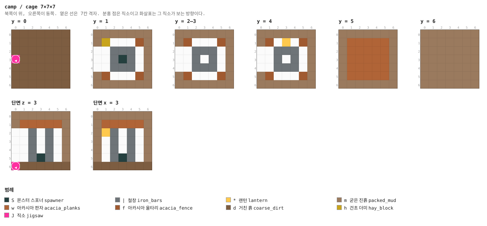

<details><summary>층별 지도 (텍스트)</summary>

```
y = 0   x →동, z ↓남
  ddddddd
  ddddddd
  ddddddd
  Jdddddd
  ddddddd
  ddddddd
  ddddddd
y = 1   x →동, z ↓남
  .......
  .h...f.
  ..|||..
  ..|S|..
  ..|||..
  .f...f.
  .......
y = 2–3   x →동, z ↓남
  .......
  .f...f.
  ..|||..
  ..|.|..
  ..|||..
  .f...f.
  .......
y = 4   x →동, z ↓남
  .......
  .f.*.f.
  ..|||..
  ..|.|..
  ..|||..
  .f...f.
  .......
y = 5   x →동, z ↓남
  kkkkkkk
  kwwwwwk
  kwwwwwk
  kwwwwwk
  kwwwwwk
  kwwwwwk
  kkkkkkk
y = 6   x →동, z ↓남
  .......
  .......
  .......
  .......
  .......
  .......
  .......
```

</details>


### `dig` — 7×7×7 — 1×1×1 셀

자갈 바닥에 수상한 자갈 셋. 솔질은 플레이어만 한다.

**어느 풀에 있나** — `drifts` (가중치 5)

| 직소 위치 | 향 | name | target | pool |
|---|---|---|---|---|
| (0, 0, 3) | ◀ 서 | `cmp_drift` | `cmp_drift` | `camp/drifts` |

**뚫린 면** — 서: z 2–4, y 1–4 (12칸)

**블록** — 돌 133, 거친 흙 48, 아카시아 판자 25, 주황 테라코타 24, 자갈 22, 아카시아 울타리 11, 수상한 자갈 3, 직소 1

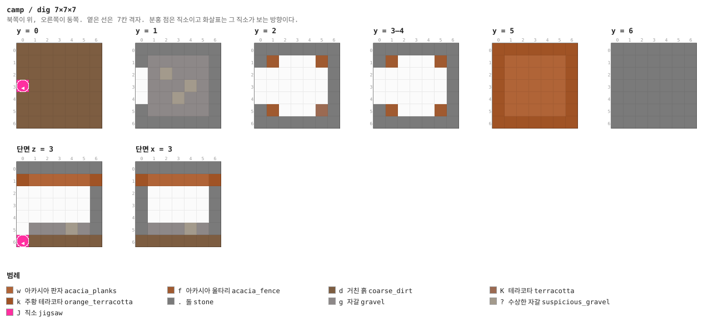

<details><summary>층별 지도 (텍스트)</summary>

```
y = 0   x →동, z ↓남
  ddddddd
  ddddddd
  ddddddd
  Jdddddd
  ddddddd
  ddddddd
  ddddddd
y = 1   x →동, z ↓남
  .......
  .ggggg.
  .g?ggg.
  .ggg?g.
  .gg?gg.
  .ggggg.
  .......
y = 2   x →동, z ↓남
  .......
  .f...f.
  .......
  .......
  .......
  .f...K.
  .......
y = 3–4   x →동, z ↓남
  .......
  .f...f.
  .......
  .......
  .......
  .f...f.
  .......
y = 5   x →동, z ↓남
  kkkkkkk
  kwwwwwk
  kwwwwwk
  kwwwwwk
  kwwwwwk
  kwwwwwk
  kkkkkkk
y = 6   x →동, z ↓남
  .......
  .......
  .......
  .......
  .......
  .......
  .......
```

</details>


### `cap` — 1×7×7

두께 1의 굳은 진흙 마개. 갱도 풀의 fallback (§4).

**어느 풀에 있나** — `drift_caps` (가중치 1)

| 직소 위치 | 향 | name | target | pool |
|---|---|---|---|---|
| (0, 0, 3) | ◀ 서 | `cmp_drift` | `cmp_drift` | `camp/drift_caps` |

**블록** — 돌 35, 주황 테라코타 13, 직소 1

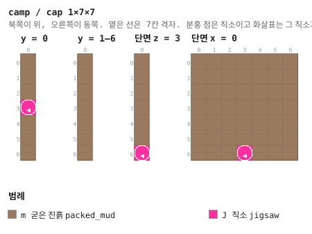

<details><summary>층별 지도 (텍스트)</summary>

```
y = 0   x →동, z ↓남
  k
  k
  k
  J
  k
  k
  k
y = 1–4   x →동, z ↓남
  .
  .
  .
  .
  .
  .
  .
y = 5   x →동, z ↓남
  k
  k
  k
  k
  k
  k
  k
y = 6   x →동, z ↓남
  .
  .
  .
  .
  .
  .
  .
```

</details>


### `approach_1` — 7×7×7 — 1×1×1 셀

보스 사슬의 1번째 칸. **서문만 이름이 `cmp_lord`**이고 동문의 target이 `cmp_lord`다. 부모는
서문으로만 들어올 수 있어 사슬이 거꾸로 흐르지 않는다. 북문은 평범한 갱도라 보스 가지도
갱도를 낳는다. 우선순위가 10이라 갱도보다 먼저 놓인다 (§7).

**어느 풀에 있나** — `lord_approach_1` (가중치 1)

| 직소 위치 | 향 | name | target | pool |
|---|---|---|---|---|
| (3, 0, 0) | ▲ 북 | `cmp_drift` | `cmp_drift` | `camp/drifts` |
| (0, 0, 3) | ◀ 서 | `cmp_lord` | `cmp_drift` | `camp/drifts` |
| (6, 0, 3) | ▶ 동 | `cmp_drift` | `cmp_lord` | `camp/lord_approach_2` |

**뚫린 면** — 서: z 2–4, y 1–4 (12칸) / 동: z 2–4, y 1–4 (12칸) / 북: x 2–4, y 1–4 (12칸)

**블록** — 돌 109, 거친 흙 46, 아카시아 판자 25, 주황 테라코타 24, 아카시아 울타리 16, 직소 3

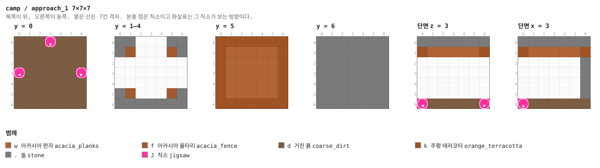

<details><summary>층별 지도 (텍스트)</summary>

```
y = 0   x →동, z ↓남
  dddJddd
  ddddddd
  ddddddd
  JdddddJ
  ddddddd
  ddddddd
  ddddddd
y = 1–4   x →동, z ↓남
  .......
  .f...f.
  .......
  .......
  .......
  .f...f.
  .......
y = 5   x →동, z ↓남
  kkkkkkk
  kwwwwwk
  kwwwwwk
  kwwwwwk
  kwwwwwk
  kwwwwwk
  kkkkkkk
y = 6   x →동, z ↓남
  .......
  .......
  .......
  .......
  .......
  .......
  .......
```

</details>


### `approach_2` — 7×7×7 — 1×1×1 셀

보스 사슬의 2번째 칸. **서문만 이름이 `cmp_lord`**이고 동문의 target이 `cmp_lord`다. 부모는
서문으로만 들어올 수 있어 사슬이 거꾸로 흐르지 않는다. 북문은 평범한 갱도라 보스 가지도
갱도를 낳는다. 우선순위가 10이라 갱도보다 먼저 놓인다 (§7).

**어느 풀에 있나** — `lord_approach_2` (가중치 1)

| 직소 위치 | 향 | name | target | pool |
|---|---|---|---|---|
| (3, 0, 0) | ▲ 북 | `cmp_drift` | `cmp_drift` | `camp/drifts` |
| (0, 0, 3) | ◀ 서 | `cmp_lord` | `cmp_drift` | `camp/drifts` |
| (6, 0, 3) | ▶ 동 | `cmp_drift` | `cmp_lord` | `camp/lord_approach_3` |

**뚫린 면** — 서: z 2–4, y 1–4 (12칸) / 동: z 2–4, y 1–4 (12칸) / 북: x 2–4, y 1–4 (12칸)

**블록** — 돌 109, 거친 흙 46, 아카시아 판자 25, 주황 테라코타 24, 아카시아 울타리 16, 직소 3


<details><summary>층별 지도 (텍스트)</summary>

```
y = 0   x →동, z ↓남
  dddJddd
  ddddddd
  ddddddd
  JdddddJ
  ddddddd
  ddddddd
  ddddddd
y = 1–4   x →동, z ↓남
  .......
  .f...f.
  .......
  .......
  .......
  .f...f.
  .......
y = 5   x →동, z ↓남
  kkkkkkk
  kwwwwwk
  kwwwwwk
  kwwwwwk
  kwwwwwk
  kwwwwwk
  kkkkkkk
y = 6   x →동, z ↓남
  .......
  .......
  .......
  .......
  .......
  .......
  .......
```

</details>


### `approach_3` — 7×7×7 — 1×1×1 셀

보스 사슬의 3번째 칸. **서문만 이름이 `cmp_lord`**이고 동문의 target이 `cmp_lord`다. 부모는
서문으로만 들어올 수 있어 사슬이 거꾸로 흐르지 않는다. 북문은 평범한 갱도라 보스 가지도
갱도를 낳는다. 우선순위가 10이라 갱도보다 먼저 놓인다 (§7).

**어느 풀에 있나** — `lord_approach` (가중치 1), `lord_approach_3` (가중치 1)

| 직소 위치 | 향 | name | target | pool |
|---|---|---|---|---|
| (3, 0, 0) | ▲ 북 | `cmp_drift` | `cmp_drift` | `camp/drifts` |
| (0, 0, 3) | ◀ 서 | `cmp_lord` | `cmp_drift` | `camp/drifts` |
| (6, 0, 3) | ▶ 동 | `cmp_drift` | `cmp_lord` | `camp/lord_approach` |

**뚫린 면** — 서: z 2–4, y 1–4 (12칸) / 동: z 2–4, y 1–4 (12칸) / 북: x 2–4, y 1–4 (12칸)

**블록** — 돌 109, 거친 흙 46, 아카시아 판자 25, 주황 테라코타 24, 아카시아 울타리 16, 직소 3


<details><summary>층별 지도 (텍스트)</summary>

```
y = 0   x →동, z ↓남
  dddJddd
  ddddddd
  ddddddd
  JdddddJ
  ddddddd
  ddddddd
  ddddddd
y = 1–4   x →동, z ↓남
  .......
  .f...f.
  .......
  .......
  .......
  .f...f.
  .......
y = 5   x →동, z ↓남
  kkkkkkk
  kwwwwwk
  kwwwwwk
  kwwwwwk
  kwwwwwk
  kwwwwwk
  kkkkkkk
y = 6   x →동, z ↓남
  .......
  .......
  .......
  .......
  .......
  .......
  .......
```

</details>


### `warlord_hall` — 21×14×21 — 3×2×3 셀

21×14×21. 가장 깊은 채굴장이고 통나무를 통째로 세워 받쳤다. 가운데 테라코타 단상에 군벌
(약탈자, 체력 100, 관통 III 석궁) 트라이얼 스포너가 서고, 사분면마다 경비 스포너 넷
(약탈자·변명자, 드물게 라버저).

확정 보상: **다중 발사 또는 관통 석궁 + 불길한 병 2~3 + 에메랄드 10~18 + 파수꾼 장식 템플릿 2.**
불길한 병은 바닐라 트라이얼 챔버를 불길하게 여는 열쇠다.

**어느 풀에 있나** — `lord_approach` (가중치 1)

| 직소 위치 | 향 | name | target | pool |
|---|---|---|---|---|
| (0, 0, 10) | ◀ 서 | `cmp_lord` | `cmp_drift` | `—` |

**뚫린 면** — 서: z 9–11, y 1–4 (12칸)

**블록** — 돌 1229, 거친 흙 440, 아카시아 판자 361, 아카시아 원목 176, 주황 테라코타 160, 테라코타 49, 굳은 진흙 9, 트라이얼 스포너 5

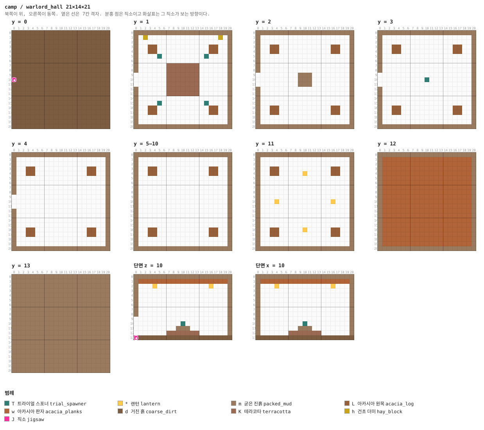

<details><summary>층별 지도 (텍스트)</summary>

```
y = 0   x →동, z ↓남
  ddddddddddddddddddddd
  ddddddddddddddddddddd
  ddddddddddddddddddddd
  ddddddddddddddddddddd
  ddddddddddddddddddddd
  ddddddddddddddddddddd
  ddddddddddddddddddddd
  ddddddddddddddddddddd
  ddddddddddddddddddddd
  ddddddddddddddddddddd
  Jdddddddddddddddddddd
  ddddddddddddddddddddd
  ddddddddddddddddddddd
  ddddddddddddddddddddd
  ddddddddddddddddddddd
  ddddddddddddddddddddd
  ddddddddddddddddddddd
  ddddddddddddddddddddd
  ddddddddddddddddddddd
  ddddddddddddddddddddd
  ddddddddddddddddddddd
y = 1   x →동, z ↓남
  .....................
  ..h...............h..
  .....................
  ...LL...........LL...
  ...LL...........LL...
  .....T.........T.....
  .....................
  .......KKKKKKK.......
  .......KKKKKKK.......
  .......KKKKKKK.......
  .......KKKKKKK.......
  .......KKKKKKK.......
  .......KKKKKKK.......
  .......KKKKKKK.......
  .....................
  .....T.........T.....
  ...LL...........LL...
  ...LL...........LL...
  .....................
  .....................
  .....................
y = 2   x →동, z ↓남
  .....................
  .....................
  .....................
  ...LL...........LL...
  ...LL...........LL...
  .....................
  .....................
  .....................
  .....................
  .........mmm.........
  .........mmm.........
  .........mmm.........
  .....................
  .....................
  .....................
  .....................
  ...LL...........LL...
  ...LL...........LL...
  .....................
  .....................
  .....................
y = 3   x →동, z ↓남
  .....................
  .....................
  .....................
  ...LL...........LL...
  ...LL...........LL...
  .....................
  .....................
  .....................
  .....................
  .....................
  ..........T..........
  .....................
  .....................
  .....................
  .....................
  .....................
  ...LL...........LL...
  ...LL...........LL...
  .....................
  .....................
  .....................
y = 4   x →동, z ↓남
  .....................
  .....................
  .....................
  ...LL...........LL...
  ...LL...........LL...
  .....................
  .....................
  .....................
  .....................
  .....................
  .....................
  .....................
  .....................
  .....................
  .....................
  .....................
  ...LL...........LL...
  ...LL...........LL...
  .....................
  .....................
  .....................
y = 5   x →동, z ↓남
  kkkkkkkkkkkkkkkkkkkkk
  k...................k
  k...................k
  k..LL...........LL..k
  k..LL...........LL..k
  k...................k
  k...................k
  k...................k
  k...................k
  k...................k
  k...................k
  k...................k
  k...................k
  k...................k
  k...................k
  k...................k
  k..LL...........LL..k
  k..LL...........LL..k
  k...................k
  k...................k
  kkkkkkkkkkkkkkkkkkkkk
y = 6–9   x →동, z ↓남
  .....................
  .....................
  .....................
  ...LL...........LL...
  ...LL...........LL...
  .....................
  .....................
  .....................
  .....................
  .....................
  .....................
  .....................
  .....................
  .....................
  .....................
  .....................
  ...LL...........LL...
  ...LL...........LL...
  .....................
  .....................
  .....................
y = 10   x →동, z ↓남
  kkkkkkkkkkkkkkkkkkkkk
  k...................k
  k...................k
  k..LL...........LL..k
  k..LL...........LL..k
  k...................k
  k...................k
  k...................k
  k...................k
  k...................k
  k...................k
  k...................k
  k...................k
  k...................k
  k...................k
  k...................k
  k..LL...........LL..k
  k..LL...........LL..k
  k...................k
  k...................k
  kkkkkkkkkkkkkkkkkkkkk
y = 11   x →동, z ↓남
  .....................
  .....................
  .....................
  ...LL...........LL...
  ...LL.....*.....LL...
  .....................
  .....................
  .....................
  .....................
  .....................
  ....*...........*....
  .....................
  .....................
  .....................
  .....................
  .....................
  ...LL.....*.....LL...
  ...LL...........LL...
  .....................
  .....................
  .....................
y = 12   x →동, z ↓남
  .....................
  .wwwwwwwwwwwwwwwwwww.
  .wwwwwwwwwwwwwwwwwww.
  .wwwwwwwwwwwwwwwwwww.
  .wwwwwwwwwwwwwwwwwww.
  .wwwwwwwwwwwwwwwwwww.
  .wwwwwwwwwwwwwwwwwww.
  .wwwwwwwwwwwwwwwwwww.
  .wwwwwwwwwwwwwwwwwww.
  .wwwwwwwwwwwwwwwwwww.
  .wwwwwwwwwwwwwwwwwww.
  .wwwwwwwwwwwwwwwwwww.
  .wwwwwwwwwwwwwwwwwww.
  .wwwwwwwwwwwwwwwwwww.
  .wwwwwwwwwwwwwwwwwww.
  .wwwwwwwwwwwwwwwwwww.
  .wwwwwwwwwwwwwwwwwww.
  .wwwwwwwwwwwwwwwwwww.
  .wwwwwwwwwwwwwwwwwww.
  .wwwwwwwwwwwwwwwwwww.
  .....................
y = 13   x →동, z ↓남
  .....................
  .....................
  .....................
  .....................
  .....................
  .....................
  .....................
  .....................
  .....................
  .....................
  .....................
  .....................
  .....................
  .....................
  .....................
  .....................
  .....................
  .....................
  .....................
  .....................
  .....................
```

</details>

<details><summary>세로 단면 (텍스트)</summary>

```
단면 z = 10   x →동, y ↑하늘
  .....................
  .wwwwwwwwwwwwwwwwwww.
  ....*...........*....
  k...................k
  .....................
  .....................
  .....................
  .....................
  k...................k
  .....................
  ..........T..........
  .........mmm.........
  .......KKKKKKK.......
  Jdddddddddddddddddddd
단면 x = 10   z →남, y ↑하늘
  .....................
  .wwwwwwwwwwwwwwwwwww.
  ....*...........*....
  k...................k
  .....................
  .....................
  .....................
  .....................
  k...................k
  .....................
  ..........T..........
  .........mmm.........
  .......KKKKKKK.......
  ddddddddddddddddddddd
```

</details>


## 다듬을 곳

**코드가 지은 첫 판이다.** 전부 한 변 48 이하라 하나도 빠짐없이 손으로 다시 지을 수 있다 —
`python tools/workshop.py camp`로 깔고 `python tools/grab_workshop.py camp`로 가져온다.

- **목책이 통나무 두 겹뿐이다.** 문루·망대·깃대가 붙을 자리가 많다
- **마당이 넓고 비어 있다.** 천막·모루·우리·수레 같은 것이 들어가면 진영처럼 보인다
- **갱도가 지하감옥과 같은 모양이다.** 통로·교차로·막다른 방. 광차 선로나 수직 갱, 무너진
  천장으로 반쯤 막힌 길이 있으면 좋겠다
- **군벌의 홀이 단순하다.** 통나무 기둥 넷과 단상이 전부다
