# 레벨 설계 — 코러스 미궁

> 이 문서는 `python tools/gen_level_doc.py chorus`가 만든다. 조각을 고치면 다시 돌린다. 그림과 표는 게임이 읽는 파일(`structure/chorus/*.nbt`, `worldgen/**`)에서 그대로 읽어 온 것이라 모드와 어긋날 수 없다. 설명 문장만 사람이 쓴다 (`tools/gen_level_doc.py`의 `INTRO`·`NOTES`).

## 1. 한눈에

엔드 중지의 미로다. **지붕이 없다** — 엔드 돌 벽돌 담이 다섯 칸 높이로 서 있고 그 사이를
걷는다. 코러스가 자란 칸과 엔더마이트 둥지를 지나 통로 셋 뒤에 **엔더맨 무리**가 있다.

시그니처(확정): **엔더 진주 16 + 흑요석 8 + 마법 부여 다이아 1.** spacing 36 / separation 12.

| 항목 | 값 |
|---|---|
| 생성 단계 | `surface_structures` |
| 바이옴 | `#sydungeon:has_structure/chorus` |
| 간격 / 최소거리 | spacing 36 / separation 12 |
| 직소 깊이 | 8 ~ 16 (`sydungeon:ranged_jigsaw`) |
| 시작 풀 | `start` |
| 조각 / 풀 | 12개 / 7개 |

## 2. 조립 원리

### 지붕이 없는 미로는 엔드에서만 된다

비도 눈도 없고 위에서 내려다볼 것도 없다. 그래서 칸은 바닥과 담뿐이고, 천장을 안 쓰는 만큼
조각이 가볍다. 지붕이 있는 방은 하나뿐이다 — 보스 홀.

### 엔더맨은 지붕 밑에서만 잡힌다

트라이얼 스포너는 **제가 낸 몹이 다 죽어야** 끝난다 (§26). 하늘이 보이는 엔더맨은 순간이동할
곳이 많아서 영영 안 죽을 수 있다. 그래서 보스 홀만 지붕을 덮었다.

### 나머지는 지금까지의 규칙

바닥 켜는 y=0 (§30), 보스는 단일 원소 풀 사슬에 걸리고 우선순위가 높다 (§7), 마개는 담 한
장이다 (§4). 바닐라 엔드 도시와는 `exclusion_zone` 8청크로 떨어뜨린다.

## 3. 풀 배선

풀이 어떤 조각을 내놓는지(실선, 숫자는 가중치)와 그 조각의 직소가 다시 어떤 풀을 부르는지(점선)다. 직소 생성은 이 그래프를 깊이만큼 따라간다.

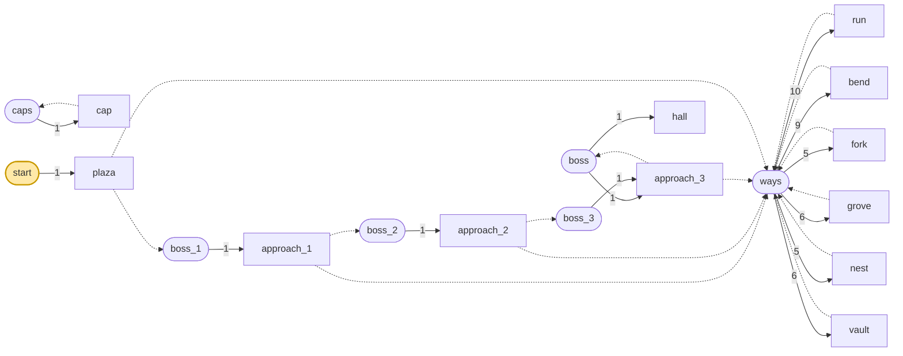

| 풀 | fallback | 원소 (가중치) |
|---|---|---|
| `boss` | `caps` | `hall` 1, `approach_3` 1 |
| `boss_1` | `caps` | `approach_1` 1 |
| `boss_2` | `caps` | `approach_2` 1 |
| `boss_3` | `caps` | `approach_3` 1 |
| `caps` | `minecraft:empty` | `cap` 1 |
| `start` | `minecraft:empty` | `plaza` 1 |
| `ways` | `caps` | `run` 10, `bend` 9, `fork` 5, `grove` 6, `nest` 5, `vault` 6 |

## 4. 뼈대 — 반드시 이렇게 놓이는 부분

광장과 그 남문이 부르는 보스 사슬. 미로는 판마다 다르다.

| 조각 | 놓이는 자리 (시작 조각 기준) | 누가 놓나 |
|---|---|---|
| `plaza` | (0, 0, 0) | 시작 풀 |
| `approach_1` | (7, 0, 21) | plaza의 남 chr_way 직소 |
| `approach_2` | (14, 0, 21) | approach_1의 동 chr_way 직소 |
| `approach_3` | (21, 0, 21) | approach_2의 동 chr_way 직소 |

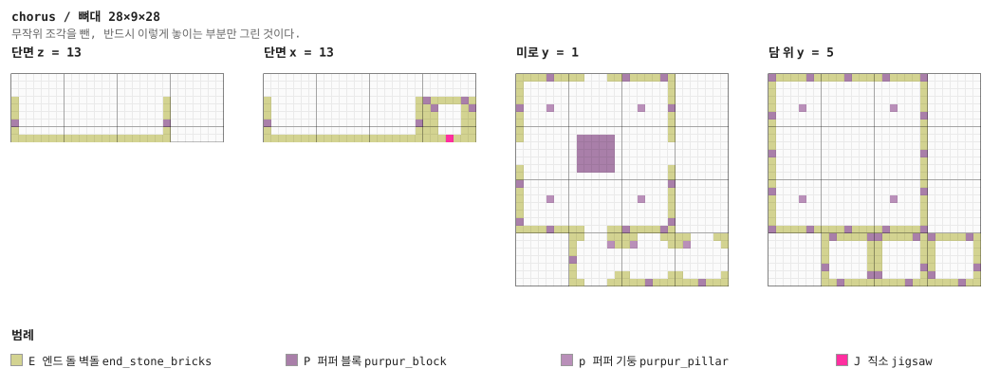

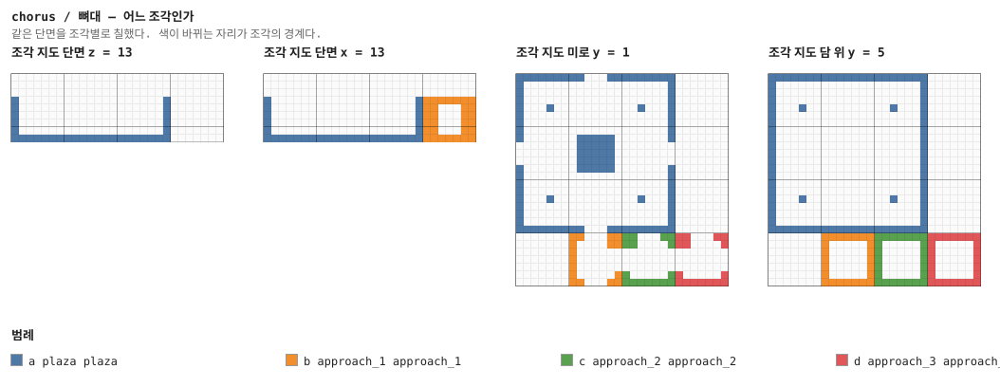

## 5. 조각


그림은 조각 하나를 **층마다 한 장씩** 블록 단위로 그린 것이다. 같은 층이 이어지면 `y = 2–5`처럼 묶었고, 마지막 두 장은 가운데를 자른 세로 단면이다. 분홍 점이 직소, 화살표가 그 직소가 보는 방향이다 — **마주 본 직소끼리만 붙는다.**

### `plaza` — 21×9×21

시작 조각. 21×21의 열린 광장이고 담이 다섯 칸이다. 서·북·동문이 미로로, **남문이 보스
사슬**로 간다. 가운데 단 위에 상자, 구석에 엔더맨 스포너.

**어느 풀에 있나** — `start` (가중치 1)

| 직소 위치 | 향 | name | target | pool |
|---|---|---|---|---|
| (10, 0, 0) | ▲ 북 | `chr_way` | `chr_way` | `chorus/ways` |
| (0, 0, 10) | ◀ 서 | `chr_way` | `chr_way` | `chorus/ways` |
| (20, 0, 10) | ▶ 동 | `chr_way` | `chr_way` | `chorus/ways` |
| (10, 0, 20) | ▼ 남 | `chr_way` | `chr_boss` | `chorus/boss_1` |

**뚫린 면** — 서: z 0–20, y 1–8 (75칸) / 동: z 0–20, y 1–8 (75칸) / 북: x 0–20, y 1–8 (75칸) / 남: x 0–20, y 1–8 (75칸) / 위: x 0–20, z 0–20 (441칸)

**블록** — 엔드 돌 벽돌 717, 퍼퍼 블록 97, 퍼퍼 기둥 20, 직소 4, 버섯광체 4, 몬스터 스포너 1, 상자 1

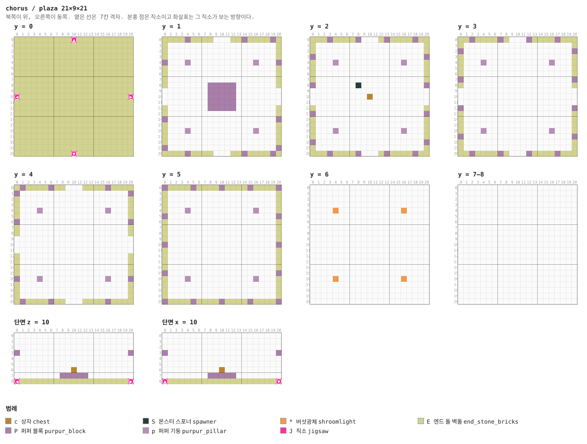

<details><summary>층별 지도 (텍스트)</summary>

```
y = 0   x →동, z ↓남
  EEEEEEEEEEJEEEEEEEEEE
  EEEEEEEEEEEEEEEEEEEEE
  EEEEEEEEEEEEEEEEEEEEE
  EEEEEEEEEEEEEEEEEEEEE
  EEEEEEEEEEEEEEEEEEEEE
  EEEEEEEEEEEEEEEEEEEEE
  EEEEEEEEEEEEEEEEEEEEE
  EEEEEEEEEEEEEEEEEEEEE
  EEEEEEEEEEEEEEEEEEEEE
  EEEEEEEEEEEEEEEEEEEEE
  JEEEEEEEEEEEEEEEEEEEJ
  EEEEEEEEEEEEEEEEEEEEE
  EEEEEEEEEEEEEEEEEEEEE
  EEEEEEEEEEEEEEEEEEEEE
  EEEEEEEEEEEEEEEEEEEEE
  EEEEEEEEEEEEEEEEEEEEE
  EEEEEEEEEEEEEEEEEEEEE
  EEEEEEEEEEEEEEEEEEEEE
  EEEEEEEEEEEEEEEEEEEEE
  EEEEEEEEEEEEEEEEEEEEE
  EEEEEEEEEEJEEEEEEEEEE
y = 1   x →동, z ↓남
  EEEEPEEEE...EEPEEEEPE
  E...................E
  E...................E
  E...................E
  P...p...........p...P
  E...................E
  E...................E
  E...................E
  E.......PPPPP.......E
  ........PPPPP........
  ........PPPPP........
  ........PPPPP........
  E.......PPPPP.......E
  E...................E
  P...................P
  E...................E
  E...p...........p...E
  E...................E
  E...................E
  P...................P
  EEEEPEEEE...EEPEEEEPE
y = 2   x →동, z ↓남
  EEEPEEEEP...EPEEEEPEE
  E...................E
  E...................E
  P...................P
  E...p...........p...E
  E...................E
  E...................E
  E...................E
  P.......S...........P
  .....................
  ..........c..........
  .....................
  E...................E
  P...................P
  E...................E
  E...................E
  E...p...........p...E
  E...................E
  P...................P
  E...................E
  EEEPEEEEP...EPEEEEPEE
y = 3   x →동, z ↓남
  EEPEEEEPE...PEEEEPEEE
  E...................E
  P...................P
  E...................E
  E...p...........p...E
  E...................E
  E...................E
  P...................P
  E...................E
  .....................
  .....................
  .....................
  P...................P
  E...................E
  E...................E
  E...................E
  E...p...........p...E
  P...................P
  E...................E
  E...................E
  EEPEEEEPE...PEEEEPEEE
y = 4   x →동, z ↓남
  EPEEEEPEE...EEEEPEEEE
  P...................P
  E...................E
  E...................E
  E...p...........p...E
  E...................E
  P...................P
  E...................E
  E...................E
  .....................
  .....................
  .....................
  E...................E
  E...................E
  E...................E
  E...................E
  P...p...........p...P
  E...................E
  E...................E
  E...................E
  EPEEEEPEE...EEEEPEEEE
y = 5   x →동, z ↓남
  PEEEEPEEEEPEEEEPEEEEP
  E...................E
  E...................E
  E...................E
  E...p...........p...E
  P...................P
  E...................E
  E...................E
  E...................E
  E...................E
  P...................P
  E...................E
  E...................E
  E...................E
  E...................E
  P...................P
  E...p...........p...E
  E...................E
  E...................E
  E...................E
  PEEEEPEEEEPEEEEPEEEEP
y = 6   x →동, z ↓남
  .....................
  .....................
  .....................
  .....................
  ....*...........*....
  .....................
  .....................
  .....................
  .....................
  .....................
  .....................
  .....................
  .....................
  .....................
  .....................
  .....................
  ....*...........*....
  .....................
  .....................
  .....................
  .....................
y = 7–8   x →동, z ↓남
  .....................
  .....................
  .....................
  .....................
  .....................
  .....................
  .....................
  .....................
  .....................
  .....................
  .....................
  .....................
  .....................
  .....................
  .....................
  .....................
  .....................
  .....................
  .....................
  .....................
  .....................
```

</details>

<details><summary>세로 단면 (텍스트)</summary>

```
단면 z = 10   x →동, y ↑하늘
  .....................
  .....................
  .....................
  P...................P
  .....................
  .....................
  ..........c..........
  ........PPPPP........
  JEEEEEEEEEEEEEEEEEEEJ
단면 x = 10   z →남, y ↑하늘
  .....................
  .....................
  .....................
  P...................P
  .....................
  .....................
  ..........c..........
  ........PPPPP........
  JEEEEEEEEEEEEEEEEEEEJ
```

</details>


### `run` — 7×7×7 — 1×1×1 셀

미로의 기본 단위. 지붕이 없다.

**어느 풀에 있나** — `ways` (가중치 10)

| 직소 위치 | 향 | name | target | pool |
|---|---|---|---|---|
| (0, 0, 3) | ◀ 서 | `chr_way` | `chr_way` | `chorus/ways` |
| (6, 0, 3) | ▶ 동 | `chr_way` | `chr_way` | `chorus/ways` |

**뚫린 면** — 서: z 0–6, y 1–6 (19칸) / 동: z 0–6, y 1–6 (19칸) / 북: x 0–6, y 6–6 (7칸) / 남: x 0–6, y 6–6 (7칸) / 위: x 0–6, z 0–6 (49칸)

**블록** — 엔드 돌 벽돌 124, 퍼퍼 블록 21, 직소 2

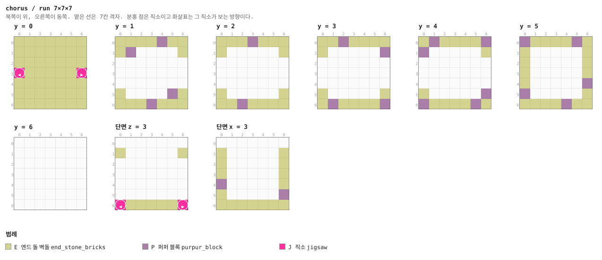

<details><summary>층별 지도 (텍스트)</summary>

```
y = 0   x →동, z ↓남
  EEEEEEE
  EEEEEEE
  EEEEEEE
  JEEEEEJ
  EEEEEEE
  EEEEEEE
  EEEEEEE
y = 1   x →동, z ↓남
  EEEEPEE
  EP....E
  .......
  .......
  .......
  E....PE
  EEEPEEE
y = 2   x →동, z ↓남
  EEEPEEE
  E.....E
  .......
  .......
  .......
  E.....E
  EEPEEEE
y = 3   x →동, z ↓남
  EEPEEEE
  E.....P
  .......
  .......
  .......
  E.....E
  EPEEEEP
y = 4   x →동, z ↓남
  EPEEEEP
  P.....E
  .......
  .......
  .......
  E.....P
  PEEEEPE
y = 5   x →동, z ↓남
  PEEEEPE
  E.....E
  E.....E
  E.....E
  E.....P
  P.....E
  EEEEPEE
y = 6   x →동, z ↓남
  .......
  .......
  .......
  .......
  .......
  .......
  .......
```

</details>


### `bend` — 7×7×7 — 1×1×1 셀

꺾이는 길.

**어느 풀에 있나** — `ways` (가중치 9)

| 직소 위치 | 향 | name | target | pool |
|---|---|---|---|---|
| (0, 0, 3) | ◀ 서 | `chr_way` | `chr_way` | `chorus/ways` |
| (3, 0, 6) | ▼ 남 | `chr_way` | `chr_way` | `chorus/ways` |

**뚫린 면** — 서: z 0–6, y 1–6 (19칸) / 동: z 0–6, y 6–6 (7칸) / 북: x 0–6, y 6–6 (7칸) / 남: x 0–6, y 1–6 (19칸) / 위: x 0–6, z 0–6 (49칸)

**블록** — 엔드 돌 벽돌 124, 퍼퍼 블록 19, 직소 2, 퍼퍼 기둥 1, 버섯광체 1

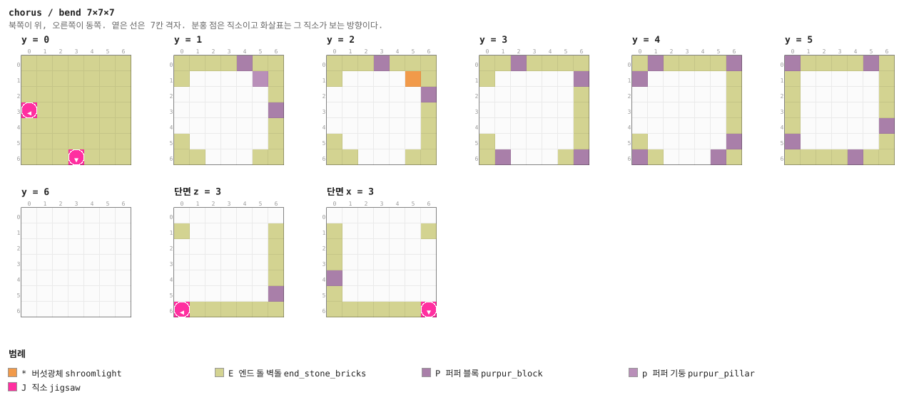

<details><summary>층별 지도 (텍스트)</summary>

```
y = 0   x →동, z ↓남
  EEEEEEE
  EEEEEEE
  EEEEEEE
  JEEEEEE
  EEEEEEE
  EEEEEEE
  EEEJEEE
y = 1   x →동, z ↓남
  EEEEPEE
  E....pE
  ......E
  ......P
  ......E
  E.....E
  EE...EE
y = 2   x →동, z ↓남
  EEEPEEE
  E....*E
  ......P
  ......E
  ......E
  E.....E
  EE...EE
y = 3   x →동, z ↓남
  EEPEEEE
  E.....P
  ......E
  ......E
  ......E
  E.....E
  EP...EP
y = 4   x →동, z ↓남
  EPEEEEP
  P.....E
  ......E
  ......E
  ......E
  E.....P
  PE...PE
y = 5   x →동, z ↓남
  PEEEEPE
  E.....E
  E.....E
  E.....E
  E.....P
  P.....E
  EEEEPEE
y = 6   x →동, z ↓남
  .......
  .......
  .......
  .......
  .......
  .......
  .......
```

</details>


### `fork` — 7×7×7 — 1×1×1 셀

네거리. 네 구석에 퍼퍼 기둥.

**어느 풀에 있나** — `ways` (가중치 5)

| 직소 위치 | 향 | name | target | pool |
|---|---|---|---|---|
| (3, 0, 0) | ▲ 북 | `chr_way` | `chr_way` | `chorus/ways` |
| (0, 0, 3) | ◀ 서 | `chr_way` | `chr_way` | `chorus/ways` |
| (6, 0, 3) | ▶ 동 | `chr_way` | `chr_way` | `chorus/ways` |
| (3, 0, 6) | ▼ 남 | `chr_way` | `chr_way` | `chorus/ways` |

**뚫린 면** — 서: z 0–6, y 1–6 (19칸) / 동: z 0–6, y 1–6 (19칸) / 북: x 0–6, y 1–6 (19칸) / 남: x 0–6, y 1–6 (19칸) / 위: x 0–6, z 0–6 (49칸)

**블록** — 엔드 돌 벽돌 103, 퍼퍼 블록 14, 퍼퍼 기둥 8, 직소 4

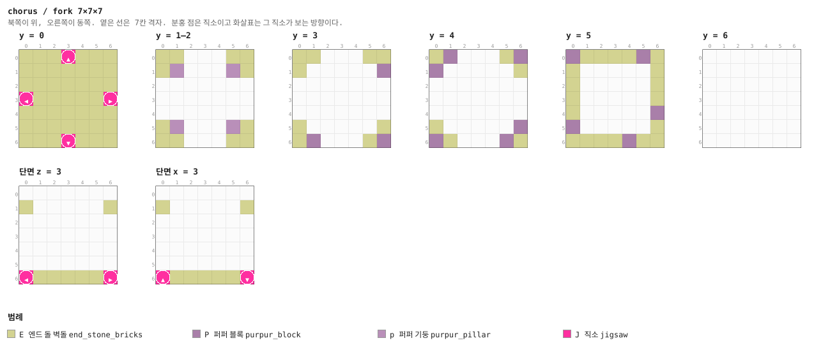

<details><summary>층별 지도 (텍스트)</summary>

```
y = 0   x →동, z ↓남
  EEEJEEE
  EEEEEEE
  EEEEEEE
  JEEEEEJ
  EEEEEEE
  EEEEEEE
  EEEJEEE
y = 1–2   x →동, z ↓남
  EE...EE
  Ep...pE
  .......
  .......
  .......
  Ep...pE
  EE...EE
y = 3   x →동, z ↓남
  EE...EE
  E.....P
  .......
  .......
  .......
  E.....E
  EP...EP
y = 4   x →동, z ↓남
  EP...EP
  P.....E
  .......
  .......
  .......
  E.....P
  PE...PE
y = 5   x →동, z ↓남
  PEEEEPE
  E.....E
  E.....E
  E.....E
  E.....P
  P.....E
  EEEEPEE
y = 6   x →동, z ↓남
  .......
  .......
  .......
  .......
  .......
  .......
  .......
```

</details>


### `grove` — 7×7×7 — 1×1×1 셀

코러스가 자란 칸. 엔드 돌 위에 줄기 셋과 꽃.

**어느 풀에 있나** — `ways` (가중치 6)

| 직소 위치 | 향 | name | target | pool |
|---|---|---|---|---|
| (0, 0, 3) | ◀ 서 | `chr_way` | `chr_way` | `chorus/ways` |
| (6, 0, 3) | ▶ 동 | `chr_way` | `chr_way` | `chorus/ways` |

**뚫린 면** — 서: z 0–6, y 1–6 (19칸) / 동: z 0–6, y 1–6 (19칸) / 북: x 0–6, y 6–6 (7칸) / 남: x 0–6, y 6–6 (7칸) / 위: x 0–6, z 0–6 (49칸)

**블록** — 엔드 돌 벽돌 122, 퍼퍼 블록 19, 코러스 줄기 6, 직소 2, 엔드 돌 2, 코러스 꽃 2

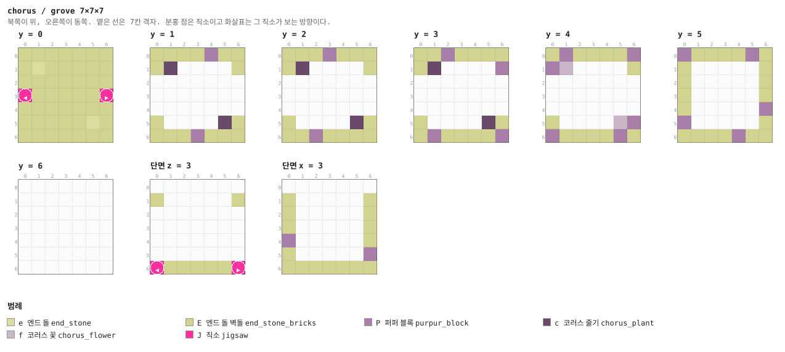

<details><summary>층별 지도 (텍스트)</summary>

```
y = 0   x →동, z ↓남
  EEEEEEE
  EeEEEEE
  EEEEEEE
  JEEEEEJ
  EEEEEEE
  EEEEEeE
  EEEEEEE
y = 1   x →동, z ↓남
  EEEEPEE
  Ec....E
  .......
  .......
  .......
  E....cE
  EEEPEEE
y = 2   x →동, z ↓남
  EEEPEEE
  Ec....E
  .......
  .......
  .......
  E....cE
  EEPEEEE
y = 3   x →동, z ↓남
  EEPEEEE
  Ec....P
  .......
  .......
  .......
  E....cE
  EPEEEEP
y = 4   x →동, z ↓남
  EPEEEEP
  Pf....E
  .......
  .......
  .......
  E....fP
  PEEEEPE
y = 5   x →동, z ↓남
  PEEEEPE
  E.....E
  E.....E
  E.....E
  E.....P
  P.....E
  EEEEPEE
y = 6   x →동, z ↓남
  .......
  .......
  .......
  .......
  .......
  .......
  .......
```

</details>


### `nest` — 7×7×7 — 1×1×1 셀

엔더마이트 둥지. 낮은 담 안에 스포너 하나. 처음엔 바닥을 판 구멍이었는데, 그 바닥이 조각의
맨 아랫면이라 밑에 받칠 것이 없었다.

**어느 풀에 있나** — `ways` (가중치 5)

| 직소 위치 | 향 | name | target | pool |
|---|---|---|---|---|
| (0, 0, 3) | ◀ 서 | `chr_way` | `chr_way` | `chorus/ways` |
| (6, 0, 3) | ▶ 동 | `chr_way` | `chr_way` | `chorus/ways` |

**뚫린 면** — 서: z 0–6, y 1–6 (19칸) / 동: z 0–6, y 1–6 (19칸) / 북: x 0–6, y 6–6 (7칸) / 남: x 0–6, y 6–6 (7칸) / 위: x 0–6, z 0–6 (49칸)

**블록** — 엔드 돌 벽돌 123, 퍼퍼 블록 25, 직소 2, 엔드 돌 1, 몬스터 스포너 1

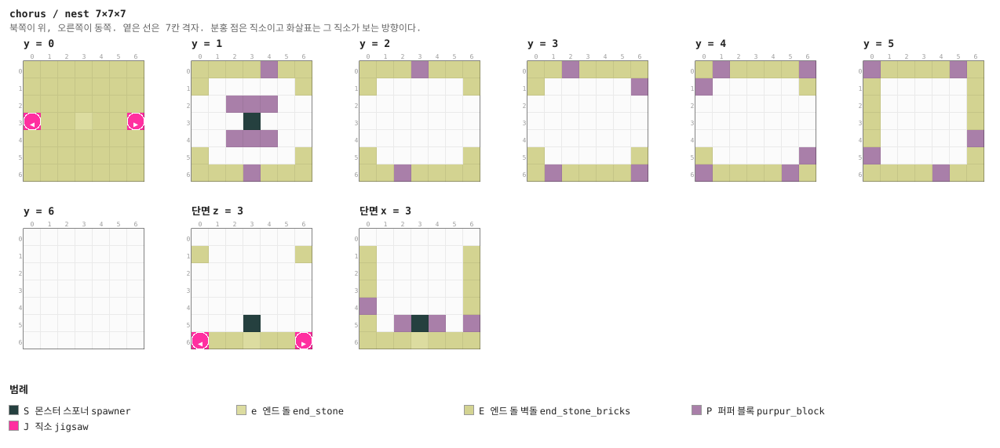

<details><summary>층별 지도 (텍스트)</summary>

```
y = 0   x →동, z ↓남
  EEEEEEE
  EEEEEEE
  EEEEEEE
  JEEeEEJ
  EEEEEEE
  EEEEEEE
  EEEEEEE
y = 1   x →동, z ↓남
  EEEEPEE
  E.....E
  ..PPP..
  ...S...
  ..PPP..
  E.....E
  EEEPEEE
y = 2   x →동, z ↓남
  EEEPEEE
  E.....E
  .......
  .......
  .......
  E.....E
  EEPEEEE
y = 3   x →동, z ↓남
  EEPEEEE
  E.....P
  .......
  .......
  .......
  E.....E
  EPEEEEP
y = 4   x →동, z ↓남
  EPEEEEP
  P.....E
  .......
  .......
  .......
  E.....P
  PEEEEPE
y = 5   x →동, z ↓남
  PEEEEPE
  E.....E
  E.....E
  E.....E
  E.....P
  P.....E
  EEEEPEE
y = 6   x →동, z ↓남
  .......
  .......
  .......
  .......
  .......
  .......
  .......
```

</details>


### `vault` — 7×7×7 — 1×1×1 셀

막다른 보물 칸. 상자 하나.

**어느 풀에 있나** — `ways` (가중치 6)

| 직소 위치 | 향 | name | target | pool |
|---|---|---|---|---|
| (0, 0, 3) | ◀ 서 | `chr_way` | `chr_way` | `chorus/ways` |

**뚫린 면** — 서: z 0–6, y 1–6 (19칸) / 동: z 0–6, y 6–6 (7칸) / 북: x 0–6, y 6–6 (7칸) / 남: x 0–6, y 6–6 (7칸) / 위: x 0–6, z 0–6 (49칸)

**블록** — 엔드 돌 벽돌 135, 퍼퍼 블록 26, 직소 1, 바다 랜턴 1, 상자 1

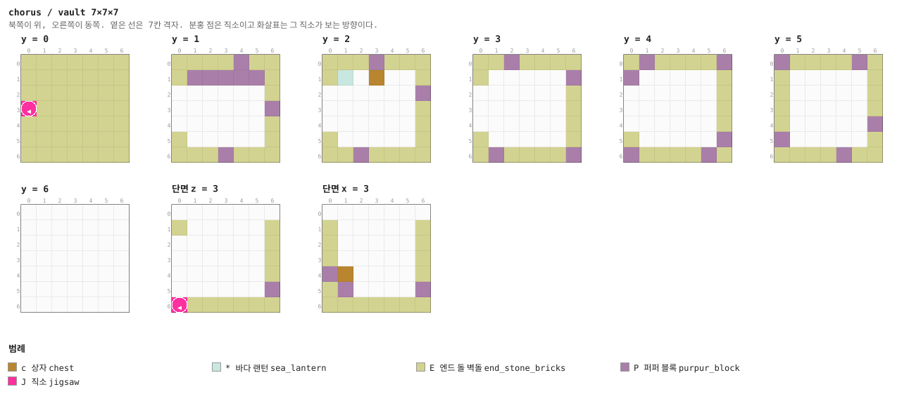

<details><summary>층별 지도 (텍스트)</summary>

```
y = 0   x →동, z ↓남
  EEEEEEE
  EEEEEEE
  EEEEEEE
  JEEEEEE
  EEEEEEE
  EEEEEEE
  EEEEEEE
y = 1   x →동, z ↓남
  EEEEPEE
  EPPPPPE
  ......E
  ......P
  ......E
  E.....E
  EEEPEEE
y = 2   x →동, z ↓남
  EEEPEEE
  E*.c..E
  ......P
  ......E
  ......E
  E.....E
  EEPEEEE
y = 3   x →동, z ↓남
  EEPEEEE
  E.....P
  ......E
  ......E
  ......E
  E.....E
  EPEEEEP
y = 4   x →동, z ↓남
  EPEEEEP
  P.....E
  ......E
  ......E
  ......E
  E.....P
  PEEEEPE
y = 5   x →동, z ↓남
  PEEEEPE
  E.....E
  E.....E
  E.....E
  E.....P
  P.....E
  EEEEPEE
y = 6   x →동, z ↓남
  .......
  .......
  .......
  .......
  .......
  .......
  .......
```

</details>


### `cap` — 1×7×7

담 한 장. 미로 풀의 fallback (§4).

**어느 풀에 있나** — `caps` (가중치 1)

| 직소 위치 | 향 | name | target | pool |
|---|---|---|---|---|
| (0, 0, 3) | ◀ 서 | `chr_way` | `chr_way` | `chorus/caps` |

**뚫린 면** — 서: z 0–6, y 6–6 (7칸) / 동: z 0–6, y 6–6 (7칸) / 북: x 0–0, y 6–6 (1칸) / 남: x 0–0, y 6–6 (1칸) / 위: x 0–0, z 0–6 (7칸)

**블록** — 엔드 돌 벽돌 41, 직소 1

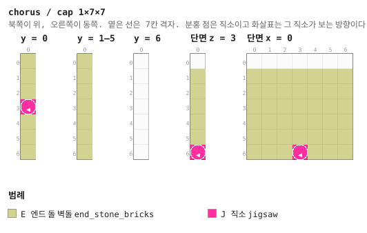

<details><summary>층별 지도 (텍스트)</summary>

```
y = 0   x →동, z ↓남
  E
  E
  E
  J
  E
  E
  E
y = 1–5   x →동, z ↓남
  E
  E
  E
  E
  E
  E
  E
y = 6   x →동, z ↓남
  .
  .
  .
  .
  .
  .
  .
```

</details>


### `approach_1` — 7×7×7 — 1×1×1 셀

보스 통로. 셋이 사슬로 이어진다 (§7).

**어느 풀에 있나** — `boss_1` (가중치 1)

| 직소 위치 | 향 | name | target | pool |
|---|---|---|---|---|
| (3, 0, 0) | ▲ 북 | `chr_way` | `chr_way` | `chorus/ways` |
| (0, 0, 3) | ◀ 서 | `chr_boss` | `chr_way` | `chorus/ways` |
| (6, 0, 3) | ▶ 동 | `chr_way` | `chr_boss` | `chorus/boss_2` |

**뚫린 면** — 서: z 0–6, y 1–6 (19칸) / 동: z 0–6, y 1–6 (19칸) / 북: x 0–6, y 1–6 (19칸) / 남: x 0–6, y 6–6 (7칸) / 위: x 0–6, z 0–6 (49칸)

**블록** — 엔드 돌 벽돌 114, 퍼퍼 블록 16, 직소 3, 퍼퍼 기둥 1, 버섯광체 1


<details><summary>층별 지도 (텍스트)</summary>

```
y = 0   x →동, z ↓남
  EEEJEEE
  EEEEEEE
  EEEEEEE
  JEEEEEJ
  EEEEEEE
  EEEEEEE
  EEEEEEE
y = 1   x →동, z ↓남
  EE...EE
  Ep....E
  .......
  .......
  .......
  E.....E
  EEEPEEE
y = 2   x →동, z ↓남
  EE...EE
  E*....E
  .......
  .......
  .......
  E.....E
  EEPEEEE
y = 3   x →동, z ↓남
  EE...EE
  E.....P
  .......
  .......
  .......
  E.....E
  EPEEEEP
y = 4   x →동, z ↓남
  EP...EP
  P.....E
  .......
  .......
  .......
  E.....P
  PEEEEPE
y = 5   x →동, z ↓남
  PEEEEPE
  E.....E
  E.....E
  E.....E
  E.....P
  P.....E
  EEEEPEE
y = 6   x →동, z ↓남
  .......
  .......
  .......
  .......
  .......
  .......
  .......
```

</details>


### `hall` — 21×14×21 — 3×2×3 셀

미로에서 **유일하게 지붕이 있는 방**. 21×14×21. 단상에 엔더맨 트라이얼 스포너, 네 구석에
경비. 이기면 **엔더 진주 16과 흑요석 8**이 나온다 — 엔더 상자 하나치다.

**어느 풀에 있나** — `boss` (가중치 1)

| 직소 위치 | 향 | name | target | pool |
|---|---|---|---|---|
| (0, 0, 10) | ◀ 서 | `chr_boss` | `chr_way` | `—` |

**뚫린 면** — 서: z 9–11, y 1–4 (12칸)

**블록** — 엔드 돌 벽돌 1488, 퍼퍼 반 블록 361, 퍼퍼 기둥 44, 퍼퍼 블록 42, 트라이얼 스포너 5, 버섯광체 4, 흑요석 3, 직소 1

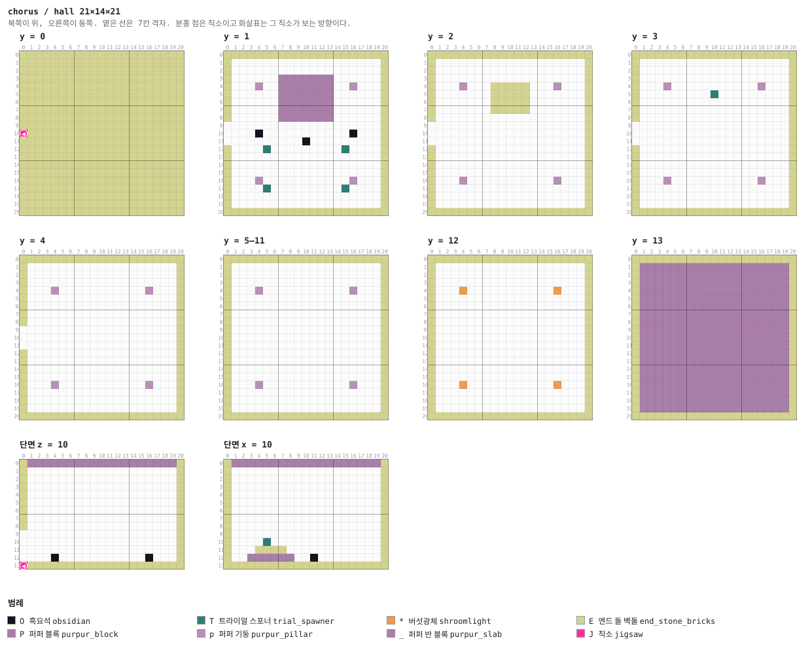

<details><summary>층별 지도 (텍스트)</summary>

```
y = 0   x →동, z ↓남
  EEEEEEEEEEEEEEEEEEEEE
  EEEEEEEEEEEEEEEEEEEEE
  EEEEEEEEEEEEEEEEEEEEE
  EEEEEEEEEEEEEEEEEEEEE
  EEEEEEEEEEEEEEEEEEEEE
  EEEEEEEEEEEEEEEEEEEEE
  EEEEEEEEEEEEEEEEEEEEE
  EEEEEEEEEEEEEEEEEEEEE
  EEEEEEEEEEEEEEEEEEEEE
  EEEEEEEEEEEEEEEEEEEEE
  JEEEEEEEEEEEEEEEEEEEE
  EEEEEEEEEEEEEEEEEEEEE
  EEEEEEEEEEEEEEEEEEEEE
  EEEEEEEEEEEEEEEEEEEEE
  EEEEEEEEEEEEEEEEEEEEE
  EEEEEEEEEEEEEEEEEEEEE
  EEEEEEEEEEEEEEEEEEEEE
  EEEEEEEEEEEEEEEEEEEEE
  EEEEEEEEEEEEEEEEEEEEE
  EEEEEEEEEEEEEEEEEEEEE
  EEEEEEEEEEEEEEEEEEEEE
y = 1   x →동, z ↓남
  EEEEEEEEEEEEEEEEEEEEE
  E...................E
  E...................E
  E......PPPPPPP......E
  E...p..PPPPPPP..p...E
  E......PPPPPPP......E
  E......PPPPPPP......E
  E......PPPPPPP......E
  E......PPPPPPP......E
  ....................E
  ....O...........O...E
  ..........O.........E
  E....T.........T....E
  E...................E
  E...................E
  E...................E
  E...p...........p...E
  E....T.........T....E
  E...................E
  E...................E
  EEEEEEEEEEEEEEEEEEEEE
y = 2   x →동, z ↓남
  EEEEEEEEEEEEEEEEEEEEE
  E...................E
  E...................E
  E...................E
  E...p...EEEEE...p...E
  E.......EEEEE.......E
  E.......EEEEE.......E
  E.......EEEEE.......E
  E...................E
  ....................E
  ....................E
  ....................E
  E...................E
  E...................E
  E...................E
  E...................E
  E...p...........p...E
  E...................E
  E...................E
  E...................E
  EEEEEEEEEEEEEEEEEEEEE
y = 3   x →동, z ↓남
  EEEEEEEEEEEEEEEEEEEEE
  E...................E
  E...................E
  E...................E
  E...p...........p...E
  E.........T.........E
  E...................E
  E...................E
  E...................E
  ....................E
  ....................E
  ....................E
  E...................E
  E...................E
  E...................E
  E...................E
  E...p...........p...E
  E...................E
  E...................E
  E...................E
  EEEEEEEEEEEEEEEEEEEEE
y = 4   x →동, z ↓남
  EEEEEEEEEEEEEEEEEEEEE
  E...................E
  E...................E
  E...................E
  E...p...........p...E
  E...................E
  E...................E
  E...................E
  E...................E
  ....................E
  ....................E
  ....................E
  E...................E
  E...................E
  E...................E
  E...................E
  E...p...........p...E
  E...................E
  E...................E
  E...................E
  EEEEEEEEEEEEEEEEEEEEE
y = 5–11   x →동, z ↓남
  EEEEEEEEEEEEEEEEEEEEE
  E...................E
  E...................E
  E...................E
  E...p...........p...E
  E...................E
  E...................E
  E...................E
  E...................E
  E...................E
  E...................E
  E...................E
  E...................E
  E...................E
  E...................E
  E...................E
  E...p...........p...E
  E...................E
  E...................E
  E...................E
  EEEEEEEEEEEEEEEEEEEEE
y = 12   x →동, z ↓남
  EEEEEEEEEEEEEEEEEEEEE
  E...................E
  E...................E
  E...................E
  E...*...........*...E
  E...................E
  E...................E
  E...................E
  E...................E
  E...................E
  E...................E
  E...................E
  E...................E
  E...................E
  E...................E
  E...................E
  E...*...........*...E
  E...................E
  E...................E
  E...................E
  EEEEEEEEEEEEEEEEEEEEE
y = 13   x →동, z ↓남
  EEEEEEEEEEEEEEEEEEEEE
  E___________________E
  E___________________E
  E___________________E
  E___________________E
  E___________________E
  E___________________E
  E___________________E
  E___________________E
  E___________________E
  E___________________E
  E___________________E
  E___________________E
  E___________________E
  E___________________E
  E___________________E
  E___________________E
  E___________________E
  E___________________E
  E___________________E
  EEEEEEEEEEEEEEEEEEEEE
```

</details>

<details><summary>세로 단면 (텍스트)</summary>

```
단면 z = 10   x →동, y ↑하늘
  E___________________E
  E...................E
  E...................E
  E...................E
  E...................E
  E...................E
  E...................E
  E...................E
  E...................E
  ....................E
  ....................E
  ....................E
  ....O...........O...E
  JEEEEEEEEEEEEEEEEEEEE
단면 x = 10   z →남, y ↑하늘
  E___________________E
  E...................E
  E...................E
  E...................E
  E...................E
  E...................E
  E...................E
  E...................E
  E...................E
  E...................E
  E....T..............E
  E...EEEE............E
  E..PPPPPP..O........E
  EEEEEEEEEEEEEEEEEEEEE
```

</details>


### `approach_2` — 7×7×7 — 1×1×1 셀

**어느 풀에 있나** — `boss_2` (가중치 1)

| 직소 위치 | 향 | name | target | pool |
|---|---|---|---|---|
| (3, 0, 0) | ▲ 북 | `chr_way` | `chr_way` | `chorus/ways` |
| (0, 0, 3) | ◀ 서 | `chr_boss` | `chr_way` | `chorus/ways` |
| (6, 0, 3) | ▶ 동 | `chr_way` | `chr_boss` | `chorus/boss_3` |

**뚫린 면** — 서: z 0–6, y 1–6 (19칸) / 동: z 0–6, y 1–6 (19칸) / 북: x 0–6, y 1–6 (19칸) / 남: x 0–6, y 6–6 (7칸) / 위: x 0–6, z 0–6 (49칸)

**블록** — 엔드 돌 벽돌 114, 퍼퍼 블록 16, 직소 3, 퍼퍼 기둥 1, 버섯광체 1

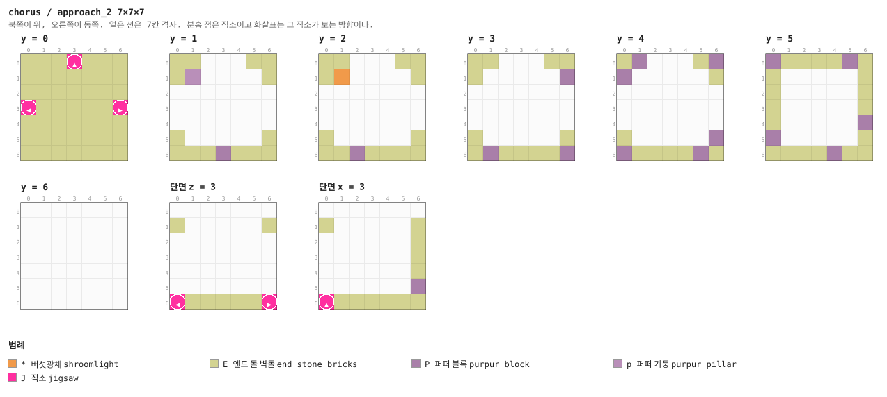

<details><summary>층별 지도 (텍스트)</summary>

```
y = 0   x →동, z ↓남
  EEEJEEE
  EEEEEEE
  EEEEEEE
  JEEEEEJ
  EEEEEEE
  EEEEEEE
  EEEEEEE
y = 1   x →동, z ↓남
  EE...EE
  Ep....E
  .......
  .......
  .......
  E.....E
  EEEPEEE
y = 2   x →동, z ↓남
  EE...EE
  E*....E
  .......
  .......
  .......
  E.....E
  EEPEEEE
y = 3   x →동, z ↓남
  EE...EE
  E.....P
  .......
  .......
  .......
  E.....E
  EPEEEEP
y = 4   x →동, z ↓남
  EP...EP
  P.....E
  .......
  .......
  .......
  E.....P
  PEEEEPE
y = 5   x →동, z ↓남
  PEEEEPE
  E.....E
  E.....E
  E.....E
  E.....P
  P.....E
  EEEEPEE
y = 6   x →동, z ↓남
  .......
  .......
  .......
  .......
  .......
  .......
  .......
```

</details>


### `approach_3` — 7×7×7 — 1×1×1 셀

**어느 풀에 있나** — `boss` (가중치 1), `boss_3` (가중치 1)

| 직소 위치 | 향 | name | target | pool |
|---|---|---|---|---|
| (3, 0, 0) | ▲ 북 | `chr_way` | `chr_way` | `chorus/ways` |
| (0, 0, 3) | ◀ 서 | `chr_boss` | `chr_way` | `chorus/ways` |
| (6, 0, 3) | ▶ 동 | `chr_way` | `chr_boss` | `chorus/boss` |

**뚫린 면** — 서: z 0–6, y 1–6 (19칸) / 동: z 0–6, y 1–6 (19칸) / 북: x 0–6, y 1–6 (19칸) / 남: x 0–6, y 6–6 (7칸) / 위: x 0–6, z 0–6 (49칸)

**블록** — 엔드 돌 벽돌 114, 퍼퍼 블록 16, 직소 3, 퍼퍼 기둥 1, 버섯광체 1


<details><summary>층별 지도 (텍스트)</summary>

```
y = 0   x →동, z ↓남
  EEEJEEE
  EEEEEEE
  EEEEEEE
  JEEEEEJ
  EEEEEEE
  EEEEEEE
  EEEEEEE
y = 1   x →동, z ↓남
  EE...EE
  Ep....E
  .......
  .......
  .......
  E.....E
  EEEPEEE
y = 2   x →동, z ↓남
  EE...EE
  E*....E
  .......
  .......
  .......
  E.....E
  EEPEEEE
y = 3   x →동, z ↓남
  EE...EE
  E.....P
  .......
  .......
  .......
  E.....E
  EPEEEEP
y = 4   x →동, z ↓남
  EP...EP
  P.....E
  .......
  .......
  .......
  E.....P
  PEEEEPE
y = 5   x →동, z ↓남
  PEEEEPE
  E.....E
  E.....E
  E.....E
  E.....P
  P.....E
  EEEEPEE
y = 6   x →동, z ↓남
  .......
  .......
  .......
  .......
  .......
  .......
  .......
```

</details>


## 다듬을 곳

- **담이 한 가지 무늬다.** 엔드 돌 벽돌에 퍼퍼가 섞인 것뿐이라 멀리서 보면 평평하다
- **코러스가 자라지 않는다.** 심은 그대로고, 자라게 두면 미로를 덮는다
- **텔레포트하는 벽이 없다.** 콘셉트의 기믹인데 Java가 필요하다 (§1)
