# 레벨 설계 — 지하감옥

> 이 문서는 `python tools/gen_level_doc.py dungeon`가 만든다. 조각을 고치면 다시 돌린다. 그림과 표는 게임이 읽는 파일(`structure/dungeon/*.nbt`, `worldgen/**`)에서 그대로 읽어 온 것이라 모드와 어긋날 수 없다. 설명 문장만 사람이 쓴다 (`tools/gen_level_doc.py`의 `INTRO`·`NOTES`).

## 1. 한눈에

숲과 평원의 지표에 돌벽돌 정자가 서 있고, 그 바닥 구멍으로 사다리가 내려간다. 수직통로를
두세 번 갈아타면 허브에 닿고, 거기서 미로가 시작된다. 미로는 7×7×7 칸을 격자처럼 이어
붙인 것이고, 통로 옆 철창 뒤에는 감방이, 막다른 방에는 경비실과 스포너가 있다. 허브의
남문 하나만은 미로가 아니라 **보스 가지**로, 통로를 다섯 개 지나야 21×21×21 보스방이 나온다.

**한 판:** 지표 정자 → 사다리 21~63칸 → 허브 → 미로(조각 300~1000개, 5~8층) →
어딘가의 보스방. 횃불과 침대는 상자에서 나온다 — 그게 이 던전이 처음으로 하는 약속이다.

| 항목 | 값 |
|---|---|
| 생성 단계 | `underground_structures` |
| 바이옴 | `#sydungeon:has_structure/dungeon` |
| 간격 / 최소거리 | spacing 30 / separation 10 |
| 직소 깊이 | 16 ~ 24 (`sydungeon:ranged_jigsaw`) |
| 시작 풀 | `start` |
| 조각 / 풀 | 20개 / 13개 |

## 2. 조립 원리

### 격자 하나, 커넥터 하나

지하감옥은 셋 중 **가장 단순한 원리**로 만들어져 있다. 지하에 있으니 **겉모양을 지킬 필요가
없다.** 미로가 어디로 자라든 위에서 보이지 않는다. 그래서 형태를 가두는 장치가 아예 없고,
조각은 그냥 사방으로 자란다.

그 대신 규칙은 둘뿐이다.

1. **모든 조각은 7×7×7의 배수**이고, 출입구는 면 중앙 3폭×4높이, 직소는 그 면 바닥 중앙에
   있다. 그래서 어느 조각이 어느 조각에 붙어도 문이 문에 맞는다.
2. **미로의 직소는 이름이 전부 `door` 하나**다. 무엇이 붙을지는 직소가 가리키는 **풀**이
   정한다 — `passages`를 가리키면 통로, `cells`를 가리키면 감방.

두 조각이 같은 칸으로 수렴하면 바닐라가 충돌을 잡아내고 그 가지를 **fallback 풀**로 넘긴다.
모든 풀의 fallback은 `caps`, 즉 **두께 1짜리 벽 한 장**이다. 두께가 1이라 거의 언제나 들어가고,
그래서 "허공으로 뚫린 문"이 남지 않는다. 벽으로 막힌 문은 그냥 **막아둔 문**처럼 보인다.

### 형태를 안 지키는 대신, 있어야 할 것을 사슬로 건다

무작위에 맡기면 안 되는 것이 둘 있다.

- **미로가 지표에 붙는 것** — 입구 바로 아래 직소는 `shaft_first`(수직통로만 든 풀)를 부른다.
  이게 없으면 40%는 입구 바로 밑이 허브여서 미로가 지표 높이에 생겼다.
- **보스방이 안 나오는 것** — 허브 남문이 `boss_approach_1`을 부르고, 그 풀의 유일한 원소인
  `boss_passage_1`의 동문이 `boss_approach_2`를 부르고… `boss_approach_5`까지 간 뒤에야
  보스방이 나올 수 있는 풀에 닿는다. **"최소 다섯 칸"을 강제하려면 같은 통로의 복사본이
  다섯 개 필요하다.** 그리고 보스 가지의 직소는 `placement_priority` 10이라 미로보다 먼저
  놓인다 — 3×3×3짜리 방은 미로가 먼저 자라면 놓을 자리를 잃는다.

### 왜 보스 조각만 커넥터 이름이 다른가

바닐라는 자식 조각의 **아무 직소나** 이름이 맞으면 입구로 쓰고, 회전 넷을 다 시도한다.
십자형인 `boss_passage`를 전부 `door`로 배선하면 부모가 "다음 보스 통로로 나가는 문"으로
들어와 버려서 사슬이 거꾸로 간다. 그래서 보스 조각의 **입구만** `boss_door`이고, 보스 가지를
잇는 직소의 target이 `boss_door`다. 이 규칙을 마법사의 성에서 잊었다가 갈아엎었다.

## 3. 풀 배선

풀이 어떤 조각을 내놓는지(실선, 숫자는 가중치)와 그 조각의 직소가 다시 어떤 풀을 부르는지(점선)다. 직소 생성은 이 그래프를 깊이만큼 따라간다.

```mermaid
flowchart LR
  P_boss_approach(["boss_approach"])
  P_boss_approach_1(["boss_approach_1"])
  P_boss_approach_2(["boss_approach_2"])
  P_boss_approach_3(["boss_approach_3"])
  P_boss_approach_4(["boss_approach_4"])
  P_boss_approach_5(["boss_approach_5"])
  P_caps(["caps"])
  P_cells(["cells"])
  P_passages(["passages"])
  P_shaft_caps(["shaft_caps"])
  P_shaft_first(["shaft_first"])
  P_shafts(["shafts"])
  P_start(["start"])
  E_boss_passage["boss_passage"]
  E_boss_passage_1["boss_passage_1"]
  E_boss_passage_2["boss_passage_2"]
  E_boss_passage_3["boss_passage_3"]
  E_boss_passage_4["boss_passage_4"]
  E_boss_passage_5["boss_passage_5"]
  E_boss_room["boss_room"]
  E_cap["cap"]
  E_cell["cell"]
  E_cross["cross"]
  E_cross_guard["cross_guard"]
  E_dead_end["dead_end"]
  E_entrance["entrance"]
  E_hub["hub"]
  E_passage["passage"]
  E_passage_cell["passage_cell"]
  E_passage_cells["passage_cells"]
  E_shaft["shaft"]
  E_shaft_cap["shaft_cap"]
  E_stair["stair"]
  P_boss_approach -- 2 --> E_boss_passage
  P_boss_approach -- 1 --> E_boss_room
  P_boss_approach_1 -- 1 --> E_boss_passage_1
  P_boss_approach_2 -- 1 --> E_boss_passage_2
  P_boss_approach_3 -- 1 --> E_boss_passage_3
  P_boss_approach_4 -- 1 --> E_boss_passage_4
  P_boss_approach_5 -- 1 --> E_boss_passage_5
  P_caps -- 1 --> E_cap
  P_cells -- 1 --> E_cell
  P_passages -- 10 --> E_passage
  P_passages -- 10 --> E_passage_cell
  P_passages -- 10 --> E_passage_cells
  P_passages -- 10 --> E_cross
  P_passages -- 5 --> E_stair
  P_passages -- 4 --> E_cross_guard
  P_passages -- 5 --> E_dead_end
  P_shaft_caps -- 1 --> E_shaft_cap
  P_shaft_first -- 1 --> E_shaft
  P_shafts -- 3 --> E_shaft
  P_shafts -- 2 --> E_hub
  P_start -- 1 --> E_entrance
  E_boss_passage -.-> P_passages
  E_boss_passage -.-> P_boss_approach
  E_boss_passage_1 -.-> P_passages
  E_boss_passage_1 -.-> P_boss_approach_2
  E_boss_passage_2 -.-> P_passages
  E_boss_passage_2 -.-> P_boss_approach_3
  E_boss_passage_3 -.-> P_passages
  E_boss_passage_3 -.-> P_boss_approach_4
  E_boss_passage_4 -.-> P_passages
  E_boss_passage_4 -.-> P_boss_approach_5
  E_boss_passage_5 -.-> P_passages
  E_boss_passage_5 -.-> P_boss_approach
  E_boss_room -.-> P_passages
  E_cap -.-> P_caps
  E_cell -.-> P_passages
  E_cross -.-> P_passages
  E_cross_guard -.-> P_passages
  E_dead_end -.-> P_passages
  E_entrance -.-> P_shaft_first
  E_hub -.-> P_passages
  E_hub -.-> P_boss_approach_1
  E_hub -.-> P_shafts
  E_passage -.-> P_passages
  E_passage_cell -.-> P_passages
  E_passage_cell -.-> P_cells
  E_passage_cells -.-> P_passages
  E_passage_cells -.-> P_cells
  E_shaft -.-> P_shafts
  E_shaft_cap -.-> P_shaft_caps
  E_stair -.-> P_passages
  P_start:::start
  classDef start fill:#ffe9a8,stroke:#c99a00,stroke-width:2px
```

| 풀 | fallback | 원소 (가중치) |
|---|---|---|
| `boss_approach` | `caps` | `boss_passage` 2, `boss_room` 1 |
| `boss_approach_1` | `caps` | `boss_passage_1` 1 |
| `boss_approach_2` | `caps` | `boss_passage_2` 1 |
| `boss_approach_3` | `caps` | `boss_passage_3` 1 |
| `boss_approach_4` | `caps` | `boss_passage_4` 1 |
| `boss_approach_5` | `caps` | `boss_passage_5` 1 |
| `caps` | `minecraft:empty` | `cap` 1 |
| `cells` | `caps` | `cell` 1 |
| `passages` | `caps` | `passage` 10, `passage_cell` 10, `passage_cells` 10, `cross` 10, `stair` 5, `cross_guard` 4, `dead_end` 5 |
| `shaft_caps` | `minecraft:empty` | `shaft_cap` 1 |
| `shaft_first` | `shaft_caps` | `shaft` 1 |
| `shafts` | `shaft_caps` | `shaft` 3, `hub` 2 |
| `start` | `minecraft:empty` | `entrance` 1 |

## 4. 조각


그림은 조각 하나를 **층마다 한 장씩** 블록 단위로 그린 것이다. 같은 층이 이어지면 `y = 2–5`처럼 묶었고, 마지막 두 장은 가운데를 자른 세로 단면이다. 분홍 점이 직소, 화살표가 그 직소가 보는 방향이다 — **마주 본 직소끼리만 붙는다.**

### `entrance` — 7×7×7 — 1×1×1 셀

유일하게 지표에 서는 조각이고, `project_start_to_heightmap`으로 지형 높이에 맞춰 놓인다.
지붕 있는 정자 — 동서남이 트여 있어 멀리서 보인다. 바닥의 3×3 구멍(x 2–4, z 1–3)이
사다리의 시작이고, **가운데가 아니다.** 사다리가 z=1에서 북벽에 걸려야 하기 때문이고,
그래서 수직통로 사슬의 모든 조각은 북벽이 막혀 있어야 한다.

**어느 풀에 있나** — `start` (가중치 1)

| 직소 위치 | 향 | name | target | pool |
|---|---|---|---|---|
| (3, 0, 2) | ◇ 아래 | `door` | `door` | `dungeon/shaft_first` |

**뚫린 면** — 서: z 0–6, y 1–6 (27칸) / 동: z 0–6, y 1–6 (27칸) / 북: x 0–6, y 6–6 (7칸) / 남: x 0–6, y 1–6 (27칸) / 아래: x 2–4, z 1–3 (8칸) / 위: x 0–6, z 0–6 (49칸)

**블록** — 돌벽돌 125, 사다리 4, 직소 1, 랜턴 1

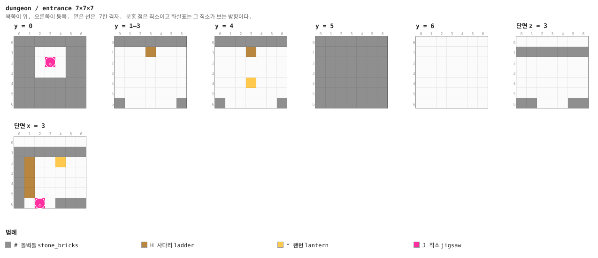

<details><summary>층별 지도 (텍스트)</summary>

```
y = 0   x →동, z ↓남
  #######
  ##...##
  ##.J.##
  ##...##
  #######
  #######
  #######
y = 1–3   x →동, z ↓남
  #######
  ...H...
  .......
  .......
  .......
  .......
  #.....#
y = 4   x →동, z ↓남
  #######
  ...H...
  .......
  .......
  ...*...
  .......
  #.....#
y = 5   x →동, z ↓남
  #######
  #######
  #######
  #######
  #######
  #######
  #######
y = 6   x →동, z ↓남
  .......
  .......
  .......
  .......
  .......
  .......
  .......
```

</details>


### `shaft` — 7×21×7 — 1×3×1 셀

7×21×7, 즉 **셀 세 칸 높이**의 사다리 기둥. 위아래 직소가 둘 다 `joint=aligned`라 회전하지
않고, 그래서 사다리가 내려가는 내내 같은 벽에 붙어 있다. `shaft_first` 풀에 혼자 들어가 있어서
입구 바로 아래에는 반드시 이 조각이 온다.

**어느 풀에 있나** — `shaft_first` (가중치 1), `shafts` (가중치 3)

| 직소 위치 | 향 | name | target | pool |
|---|---|---|---|---|
| (3, 0, 2) | ◇ 아래 | `door` | `door` | `dungeon/shafts` |
| (3, 20, 2) | ◆ 위 | `door` | `door` | `dungeon/shafts` |

**뚫린 면** — 아래: x 2–4, z 1–3 (7칸) / 위: x 2–4, z 1–3 (7칸)

**블록** — 돌벽돌 840, 사다리 21, 직소 2

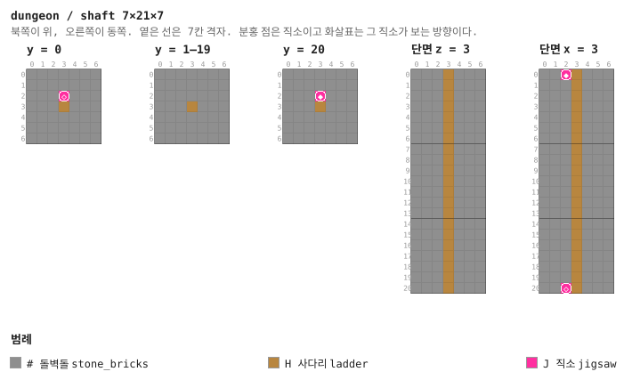

<details><summary>층별 지도 (텍스트)</summary>

```
y = 0   x →동, z ↓남
  #######
  ##.H.##
  ##.J.##
  ##...##
  #######
  #######
  #######
y = 1–19   x →동, z ↓남
  #######
  ##.H.##
  ##...##
  ##...##
  #######
  #######
  #######
y = 20   x →동, z ↓남
  #######
  ##.H.##
  ##.J.##
  ##...##
  #######
  #######
  #######
```

</details>

<details><summary>세로 단면 (텍스트)</summary>

```
단면 z = 3   x →동, y ↑하늘
  ##...##
  ##...##
  ##...##
  ##...##
  ##...##
  ##...##
  ##...##
  ##...##
  ##...##
  ##...##
  ##...##
  ##...##
  ##...##
  ##...##
  ##...##
  ##...##
  ##...##
  ##...##
  ##...##
  ##...##
  ##...##
단면 x = 3   z →남, y ↑하늘
  #HJ.###
  #H..###
  #H..###
  #H..###
  #H..###
  #H..###
  #H..###
  #H..###
  #H..###
  #H..###
  #H..###
  #H..###
  #H..###
  #H..###
  #H..###
  #H..###
  #H..###
  #H..###
  #H..###
  #H..###
  #HJ.###
```

</details>


### `shaft_cap` — 7×1×7

높이 1짜리 바닥. 수직통로가 깊이를 다 써서 허브에 못 닿았을 때 구멍을 막는다. 없으면
사다리가 허공에서 끝난다.

**어느 풀에 있나** — `shaft_caps` (가중치 1)

| 직소 위치 | 향 | name | target | pool |
|---|---|---|---|---|
| (3, 0, 2) | ◆ 위 | `door` | `door` | `dungeon/shaft_caps` |

**블록** — 돌벽돌 48, 직소 1

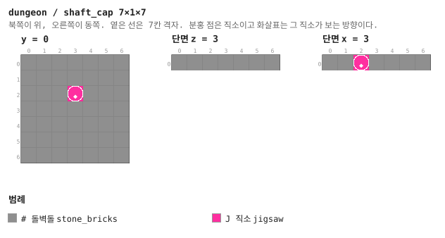

<details><summary>층별 지도 (텍스트)</summary>

```
y = 0   x →동, z ↓남
  #######
  #######
  ###J###
  #######
  #######
  #######
  #######
```

</details>


### `hub` — 7×7×7 — 1×1×1 셀

사다리가 닿는 방이고 미로의 시작점이다. **북문이 없다** — 북벽은 사다리가 걸리는 벽이라
비워 둘 수 없다. 서·동문이 미로로, 남문이 보스 가지로 간다. 남문 직소만
`placement_priority`·`selection_priority`가 10이라 보스방이 미로보다 먼저 자리를 잡는다.

**어느 풀에 있나** — `shafts` (가중치 2)

| 직소 위치 | 향 | name | target | pool |
|---|---|---|---|---|
| (0, 0, 3) | ◀ 서 | `door` | `door` | `dungeon/passages` |
| (6, 0, 3) | ▶ 동 | `door` | `door` | `dungeon/passages` |
| (3, 0, 6) | ▼ 남 | `door` | `boss_door` | `dungeon/boss_approach_1` |
| (3, 6, 2) | ◆ 위 | `door` | `door` | `dungeon/shafts` |

**뚫린 면** — 서: z 2–4, y 1–4 (12칸) / 동: z 2–4, y 1–4 (12칸) / 남: x 2–4, y 1–4 (12칸) / 위: x 2–4, z 1–3 (7칸)

**블록** — 돌벽돌 170, 사다리 6, 직소 4

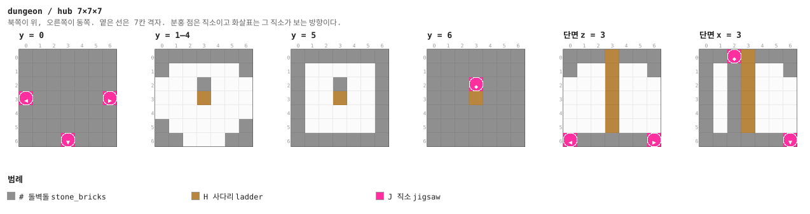

<details><summary>층별 지도 (텍스트)</summary>

```
y = 0   x →동, z ↓남
  #######
  #######
  #######
  J#####J
  #######
  #######
  ###J###
y = 1–4   x →동, z ↓남
  #######
  #..H..#
  .......
  .......
  .......
  #.....#
  ##...##
y = 5   x →동, z ↓남
  #######
  #..H..#
  #.....#
  #.....#
  #.....#
  #.....#
  #######
y = 6   x →동, z ↓남
  #######
  ##.H.##
  ##.J.##
  ##...##
  #######
  #######
  #######
```

</details>


### `passage` — 7×7×7 — 1×1×1 셀

미로의 기본 단위. 서-동 직선. 가중치 10으로 가장 흔하다.

**어느 풀에 있나** — `passages` (가중치 10)

| 직소 위치 | 향 | name | target | pool |
|---|---|---|---|---|
| (0, 0, 3) | ◀ 서 | `door` | `door` | `dungeon/passages` |
| (6, 0, 3) | ▶ 동 | `door` | `door` | `dungeon/passages` |

**뚫린 면** — 서: z 2–4, y 1–4 (12칸) / 동: z 2–4, y 1–4 (12칸)

**블록** — 돌벽돌 257, 직소 2

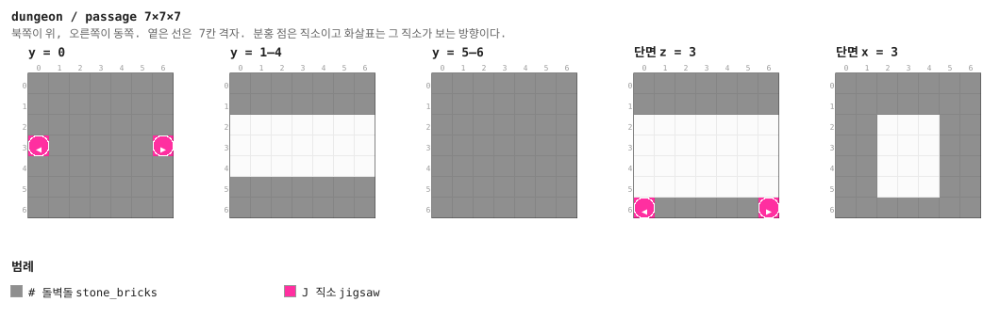

<details><summary>층별 지도 (텍스트)</summary>

```
y = 0   x →동, z ↓남
  #######
  #######
  #######
  J#####J
  #######
  #######
  #######
y = 1–4   x →동, z ↓남
  #######
  #######
  .......
  .......
  .......
  #######
  #######
y = 5–6   x →동, z ↓남
  #######
  #######
  #######
  #######
  #######
  #######
  #######
```

</details>


### `passage_cell` — 7×7×7 — 1×1×1 셀

남쪽 벽이 철창이고 그 너머 직소가 `cells` 풀을 부른다. **철창은 문이 아니다** — 감방에
들어가려면 깨야 한다. 상자를 공짜로 주지 않으려는 장치고, 이 던전에서 곡괭이의 쓸모는
사실상 이것뿐이다.

**어느 풀에 있나** — `passages` (가중치 10)

| 직소 위치 | 향 | name | target | pool |
|---|---|---|---|---|
| (0, 0, 3) | ◀ 서 | `door` | `door` | `dungeon/passages` |
| (6, 0, 3) | ▶ 동 | `door` | `door` | `dungeon/passages` |
| (3, 0, 6) | ▼ 남 | `door` | `door` | `dungeon/cells` |

**뚫린 면** — 서: z 2–4, y 1–4 (12칸) / 동: z 2–4, y 1–4 (12칸)

**블록** — 돌벽돌 225, 철창 11, 직소 3

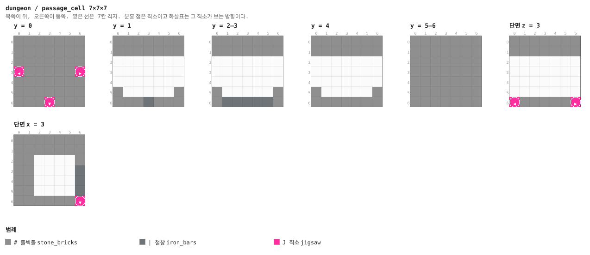

<details><summary>층별 지도 (텍스트)</summary>

```
y = 0   x →동, z ↓남
  #######
  #######
  #######
  J#####J
  #######
  #######
  ###J###
y = 1   x →동, z ↓남
  #######
  #######
  .......
  .......
  .......
  #.....#
  ###|###
y = 2–3   x →동, z ↓남
  #######
  #######
  .......
  .......
  .......
  #.....#
  #|||||#
y = 4   x →동, z ↓남
  #######
  #######
  .......
  .......
  .......
  #.....#
  #######
y = 5–6   x →동, z ↓남
  #######
  #######
  #######
  #######
  #######
  #######
  #######
```

</details>


### `passage_cells` — 7×7×7 — 1×1×1 셀

양쪽이 철창. 통로 하나로 감방 둘을 매단다.

**어느 풀에 있나** — `passages` (가중치 10)

| 직소 위치 | 향 | name | target | pool |
|---|---|---|---|---|
| (3, 0, 0) | ▲ 북 | `door` | `door` | `dungeon/cells` |
| (0, 0, 3) | ◀ 서 | `door` | `door` | `dungeon/passages` |
| (6, 0, 3) | ▶ 동 | `door` | `door` | `dungeon/passages` |
| (3, 0, 6) | ▼ 남 | `door` | `door` | `dungeon/cells` |

**뚫린 면** — 서: z 2–4, y 1–4 (12칸) / 동: z 2–4, y 1–4 (12칸)

**블록** — 돌벽돌 193, 철창 22, 직소 4

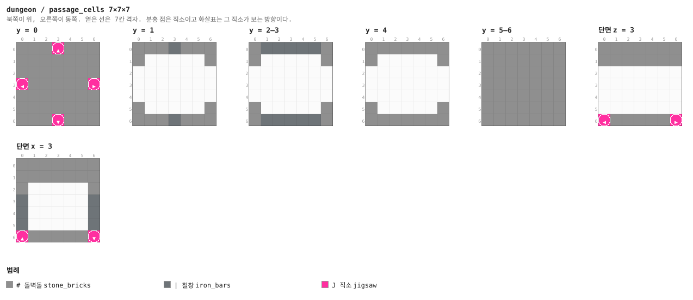

<details><summary>층별 지도 (텍스트)</summary>

```
y = 0   x →동, z ↓남
  ###J###
  #######
  #######
  J#####J
  #######
  #######
  ###J###
y = 1   x →동, z ↓남
  ###|###
  #.....#
  .......
  .......
  .......
  #.....#
  ###|###
y = 2–3   x →동, z ↓남
  #|||||#
  #.....#
  .......
  .......
  .......
  #.....#
  #|||||#
y = 4   x →동, z ↓남
  #######
  #.....#
  .......
  .......
  .......
  #.....#
  #######
y = 5–6   x →동, z ↓남
  #######
  #######
  #######
  #######
  #######
  #######
  #######
```

</details>


### `cell` — 7×7×7 — 1×1×1 셀

북쪽 면 **전체**가 열려 있다 (x 1–5, y 1–4, 20칸). 부모의 철창 벽에 그대로 붙는 면이라
문 규격(3폭)이 아니라 넓게 뚫려 있다. 안쪽 벽에 상자 하나 — `chests/dungeon_cell`.

**어느 풀에 있나** — `cells` (가중치 1)

| 직소 위치 | 향 | name | target | pool |
|---|---|---|---|---|
| (3, 0, 0) | ▲ 북 | `door` | `door` | `dungeon/passages` |

**뚫린 면** — 북: x 1–5, y 1–4 (20칸)

**블록** — 돌벽돌 222, 상자 1, 직소 1

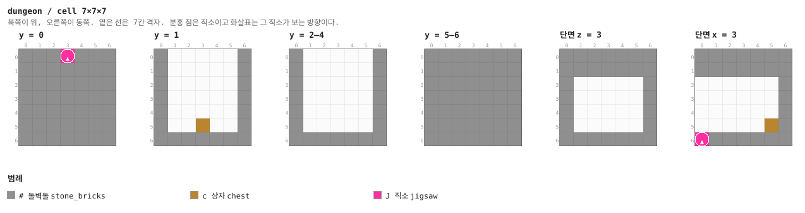

<details><summary>층별 지도 (텍스트)</summary>

```
y = 0   x →동, z ↓남
  ###J###
  #######
  #######
  #######
  #######
  #######
  #######
y = 1   x →동, z ↓남
  #.....#
  #.....#
  #.....#
  #.....#
  #.....#
  #..c..#
  #######
y = 2–4   x →동, z ↓남
  #.....#
  #.....#
  #.....#
  #.....#
  #.....#
  #.....#
  #######
y = 5–6   x →동, z ↓남
  #######
  #######
  #######
  #######
  #######
  #######
  #######
```

</details>


### `cross` — 7×7×7 — 1×1×1 셀

십자 교차로. 미로가 갈라지는 자리라 가중치가 통로와 같은 10이다.

**어느 풀에 있나** — `passages` (가중치 10)

| 직소 위치 | 향 | name | target | pool |
|---|---|---|---|---|
| (3, 0, 0) | ▲ 북 | `door` | `door` | `dungeon/passages` |
| (0, 0, 3) | ◀ 서 | `door` | `door` | `dungeon/passages` |
| (6, 0, 3) | ▶ 동 | `door` | `door` | `dungeon/passages` |
| (3, 0, 6) | ▼ 남 | `door` | `door` | `dungeon/passages` |

**뚫린 면** — 서: z 2–4, y 1–4 (12칸) / 동: z 2–4, y 1–4 (12칸) / 북: x 2–4, y 1–4 (12칸) / 남: x 2–4, y 1–4 (12칸)

**블록** — 돌벽돌 207, 직소 4

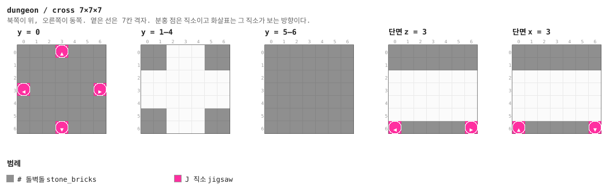

<details><summary>층별 지도 (텍스트)</summary>

```
y = 0   x →동, z ↓남
  ###J###
  #######
  #######
  J#####J
  #######
  #######
  ###J###
y = 1–4   x →동, z ↓남
  ##...##
  ##...##
  .......
  .......
  .......
  ##...##
  ##...##
y = 5–6   x →동, z ↓남
  #######
  #######
  #######
  #######
  #######
  #######
  #######
```

</details>


### `cross_guard` — 7×7×7 — 1×1×1 셀

교차로 한가운데 몬스터 스포너. 던전이 어둡기 때문에 이 스포너가 실제로 작동한다
(`custom_spawn_rules.block_light_limit 0..15`). 밝았다면 장식이었다.

**어느 풀에 있나** — `passages` (가중치 4)

| 직소 위치 | 향 | name | target | pool |
|---|---|---|---|---|
| (3, 0, 0) | ▲ 북 | `door` | `door` | `dungeon/passages` |
| (0, 0, 3) | ◀ 서 | `door` | `door` | `dungeon/passages` |
| (6, 0, 3) | ▶ 동 | `door` | `door` | `dungeon/passages` |
| (3, 0, 6) | ▼ 남 | `door` | `door` | `dungeon/passages` |

**뚫린 면** — 서: z 2–4, y 1–4 (12칸) / 동: z 2–4, y 1–4 (12칸) / 북: x 2–4, y 1–4 (12칸) / 남: x 2–4, y 1–4 (12칸)

**블록** — 돌벽돌 207, 직소 4, 몬스터 스포너 1

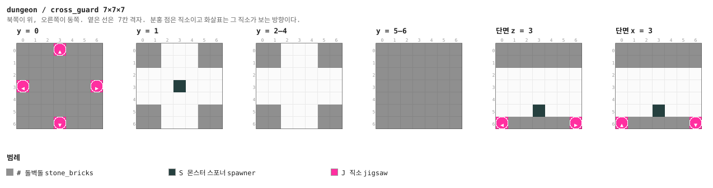

<details><summary>층별 지도 (텍스트)</summary>

```
y = 0   x →동, z ↓남
  ###J###
  #######
  #######
  J#####J
  #######
  #######
  ###J###
y = 1   x →동, z ↓남
  ##...##
  ##...##
  .......
  ...S...
  .......
  ##...##
  ##...##
y = 2–4   x →동, z ↓남
  ##...##
  ##...##
  .......
  .......
  .......
  ##...##
  ##...##
y = 5–6   x →동, z ↓남
  #######
  #######
  #######
  #######
  #######
  #######
  #######
```

</details>


### `stair` — 7×14×7 — 1×2×1 셀

7×14×7 — 셀 두 칸을 쓰면서 한 층(7칸)을 올린다. 층 간격이 정확히 7이라 위층도 같은 격자에
맞는다. **두 직소가 둘 다 서쪽 면**이라 부모가 어느 쪽으로 붙느냐에 따라 올라가는 계단도,
내려가는 계단도 된다. 가중치 5 — 던전이 5~8층이 되는 건 이 조각 하나 때문이다.

**어느 풀에 있나** — `passages` (가중치 5)

| 직소 위치 | 향 | name | target | pool |
|---|---|---|---|---|
| (0, 0, 3) | ◀ 서 | `door` | `door` | `dungeon/passages` |
| (0, 7, 3) | ◀ 서 | `door` | `door` | `dungeon/passages` |

**뚫린 면** — 서: z 2–4, y 1–11 (24칸)

**블록** — 돌벽돌 546, 돌벽돌 계단 8, 직소 2

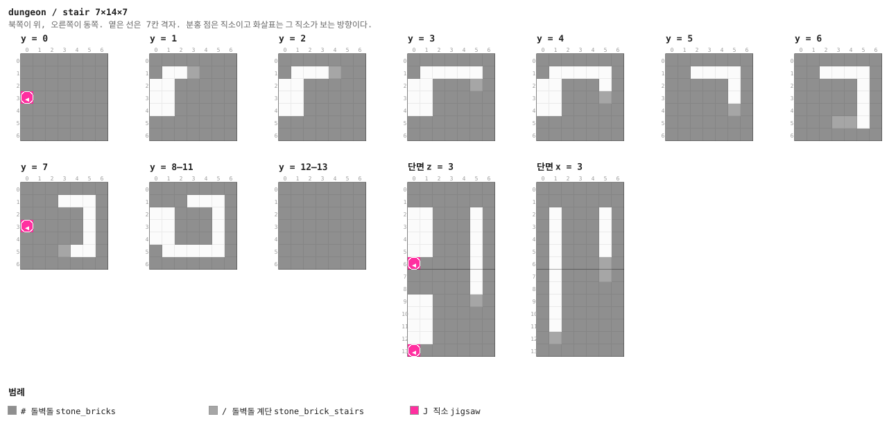

<details><summary>층별 지도 (텍스트)</summary>

```
y = 0   x →동, z ↓남
  #######
  #######
  #######
  J######
  #######
  #######
  #######
y = 1   x →동, z ↓남
  #######
  #../###
  ..#####
  ..#####
  ..#####
  #######
  #######
y = 2   x →동, z ↓남
  #######
  #.../##
  ..#####
  ..#####
  ..#####
  #######
  #######
y = 3   x →동, z ↓남
  #######
  #.....#
  ..###/#
  ..#####
  ..#####
  #######
  #######
y = 4   x →동, z ↓남
  #######
  #.....#
  ..###.#
  ..###/#
  ..#####
  #######
  #######
y = 5   x →동, z ↓남
  #######
  ##....#
  #####.#
  #####.#
  #####/#
  #######
  #######
y = 6   x →동, z ↓남
  #######
  ##....#
  #####.#
  #####.#
  #####.#
  ###//.#
  #######
y = 7   x →동, z ↓남
  #######
  ###...#
  #####.#
  J####.#
  #####.#
  ###/..#
  #######
y = 8–11   x →동, z ↓남
  #######
  ###...#
  ..###.#
  ..###.#
  ..###.#
  #.....#
  #######
y = 12–13   x →동, z ↓남
  #######
  #######
  #######
  #######
  #######
  #######
  #######
```

</details>

<details><summary>세로 단면 (텍스트)</summary>

```
단면 z = 3   x →동, y ↑하늘
  #######
  #######
  ..###.#
  ..###.#
  ..###.#
  ..###.#
  J####.#
  #####.#
  #####.#
  ..###/#
  ..#####
  ..#####
  ..#####
  J######
단면 x = 3   z →남, y ↑하늘
  #######
  #######
  #.###.#
  #.###.#
  #.###.#
  #.###.#
  #.###/#
  #.###/#
  #.#####
  #.#####
  #.#####
  #.#####
  #/#####
  #######
```

</details>


### `dead_end` — 7×7×7 — 1×1×1 셀

경비실. 가운데 스포너(좀비·스켈레톤·거미·동굴거미)와 구석에 상자 `chests/dungeon_guard`.
문이 하나뿐이라 들어가면 돌아 나와야 한다. **fallback으로는 쓰지 않는다** — 7칸을 통째로
쓰기 때문에 최대 깊이에서는 충돌해서 구멍이 남는다. 그 자리는 `cap`이 맡는다.

**어느 풀에 있나** — `passages` (가중치 5)

| 직소 위치 | 향 | name | target | pool |
|---|---|---|---|---|
| (0, 0, 3) | ◀ 서 | `door` | `door` | `dungeon/passages` |

**뚫린 면** — 서: z 2–4, y 1–4 (12칸)

**블록** — 돌벽돌 237, 상자 1, 몬스터 스포너 1, 직소 1

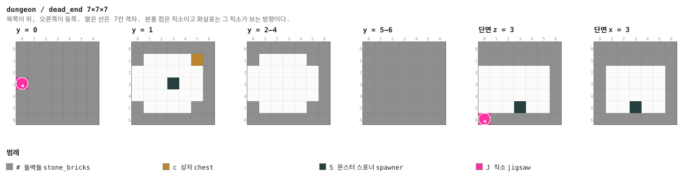

<details><summary>층별 지도 (텍스트)</summary>

```
y = 0   x →동, z ↓남
  #######
  #######
  #######
  J######
  #######
  #######
  #######
y = 1   x →동, z ↓남
  #######
  #....c#
  ......#
  ...S..#
  ......#
  #....##
  #######
y = 2–4   x →동, z ↓남
  #######
  #....##
  ......#
  ......#
  ......#
  #....##
  #######
y = 5–6   x →동, z ↓남
  #######
  #######
  #######
  #######
  #######
  #######
  #######
```

</details>


### `cap` — 1×7×7

**두께 1의 벽 한 장.** 모든 풀의 fallback이고, 던전에서 가장 자주 놓이는 조각이다.
얇아서 최대 깊이에서도 거의 항상 들어간다. 이 조각이 없으면 미로의 끝마다 흙과 동굴이
드러난다.

**어느 풀에 있나** — `caps` (가중치 1)

| 직소 위치 | 향 | name | target | pool |
|---|---|---|---|---|
| (0, 0, 3) | ◀ 서 | `door` | `door` | `dungeon/caps` |

**블록** — 돌벽돌 48, 직소 1

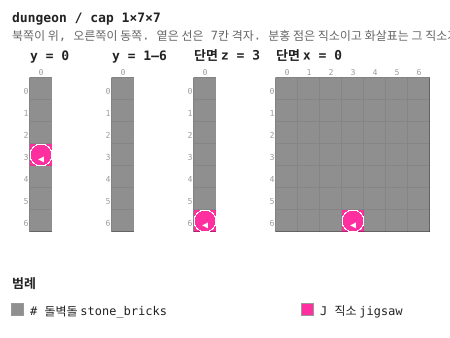

<details><summary>층별 지도 (텍스트)</summary>

```
y = 0   x →동, z ↓남
  #
  #
  #
  J
  #
  #
  #
y = 1–6   x →동, z ↓남
  #
  #
  #
  #
  #
  #
  #
```

</details>


### `boss_passage_1` — 7×7×7 — 1×1×1 셀

보스 가지의 1번째 칸. `cross`에서 파생했지만 **서문만 이름이 `boss_door`**이고, 동문의
target이 `boss_door`다. 부모는 서문으로만 들어올 수 있고 사슬은 서→동 한 방향으로만 흐른다.
동문이 부르는 풀은 `boss_approach_2` — 그 풀에 든 조각은 하나뿐이라 **반드시** 다음 칸이 온다.
북·남문은 평범한 `passages`라 보스 가지도 미로를 낳는다.

**어느 풀에 있나** — `boss_approach_1` (가중치 1)

| 직소 위치 | 향 | name | target | pool |
|---|---|---|---|---|
| (3, 0, 0) | ▲ 북 | `door` | `door` | `dungeon/passages` |
| (0, 0, 3) | ◀ 서 | `boss_door` | `door` | `dungeon/passages` |
| (6, 0, 3) | ▶ 동 | `door` | `boss_door` | `dungeon/boss_approach_2` |
| (3, 0, 6) | ▼ 남 | `door` | `door` | `dungeon/passages` |

**뚫린 면** — 서: z 2–4, y 1–4 (12칸) / 동: z 2–4, y 1–4 (12칸) / 북: x 2–4, y 1–4 (12칸) / 남: x 2–4, y 1–4 (12칸)

**블록** — 돌벽돌 207, 직소 4


<details><summary>층별 지도 (텍스트)</summary>

```
y = 0   x →동, z ↓남
  ###J###
  #######
  #######
  J#####J
  #######
  #######
  ###J###
y = 1–4   x →동, z ↓남
  ##...##
  ##...##
  .......
  .......
  .......
  ##...##
  ##...##
y = 5–6   x →동, z ↓남
  #######
  #######
  #######
  #######
  #######
  #######
  #######
```

</details>


### `boss_passage_2` — 7×7×7 — 1×1×1 셀

보스 가지의 2번째 칸. `cross`에서 파생했지만 **서문만 이름이 `boss_door`**이고, 동문의
target이 `boss_door`다. 부모는 서문으로만 들어올 수 있고 사슬은 서→동 한 방향으로만 흐른다.
동문이 부르는 풀은 `boss_approach_3` — 그 풀에 든 조각은 하나뿐이라 **반드시** 다음 칸이 온다.
북·남문은 평범한 `passages`라 보스 가지도 미로를 낳는다.

**어느 풀에 있나** — `boss_approach_2` (가중치 1)

| 직소 위치 | 향 | name | target | pool |
|---|---|---|---|---|
| (3, 0, 0) | ▲ 북 | `door` | `door` | `dungeon/passages` |
| (0, 0, 3) | ◀ 서 | `boss_door` | `door` | `dungeon/passages` |
| (6, 0, 3) | ▶ 동 | `door` | `boss_door` | `dungeon/boss_approach_3` |
| (3, 0, 6) | ▼ 남 | `door` | `door` | `dungeon/passages` |

**뚫린 면** — 서: z 2–4, y 1–4 (12칸) / 동: z 2–4, y 1–4 (12칸) / 북: x 2–4, y 1–4 (12칸) / 남: x 2–4, y 1–4 (12칸)

**블록** — 돌벽돌 207, 직소 4

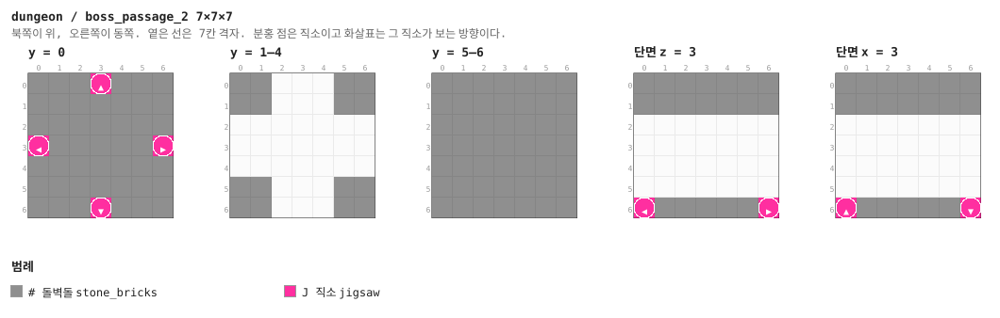

<details><summary>층별 지도 (텍스트)</summary>

```
y = 0   x →동, z ↓남
  ###J###
  #######
  #######
  J#####J
  #######
  #######
  ###J###
y = 1–4   x →동, z ↓남
  ##...##
  ##...##
  .......
  .......
  .......
  ##...##
  ##...##
y = 5–6   x →동, z ↓남
  #######
  #######
  #######
  #######
  #######
  #######
  #######
```

</details>


### `boss_passage_3` — 7×7×7 — 1×1×1 셀

보스 가지의 3번째 칸. `cross`에서 파생했지만 **서문만 이름이 `boss_door`**이고, 동문의
target이 `boss_door`다. 부모는 서문으로만 들어올 수 있고 사슬은 서→동 한 방향으로만 흐른다.
동문이 부르는 풀은 `boss_approach_4` — 그 풀에 든 조각은 하나뿐이라 **반드시** 다음 칸이 온다.
북·남문은 평범한 `passages`라 보스 가지도 미로를 낳는다.

**어느 풀에 있나** — `boss_approach_3` (가중치 1)

| 직소 위치 | 향 | name | target | pool |
|---|---|---|---|---|
| (3, 0, 0) | ▲ 북 | `door` | `door` | `dungeon/passages` |
| (0, 0, 3) | ◀ 서 | `boss_door` | `door` | `dungeon/passages` |
| (6, 0, 3) | ▶ 동 | `door` | `boss_door` | `dungeon/boss_approach_4` |
| (3, 0, 6) | ▼ 남 | `door` | `door` | `dungeon/passages` |

**뚫린 면** — 서: z 2–4, y 1–4 (12칸) / 동: z 2–4, y 1–4 (12칸) / 북: x 2–4, y 1–4 (12칸) / 남: x 2–4, y 1–4 (12칸)

**블록** — 돌벽돌 207, 직소 4


<details><summary>층별 지도 (텍스트)</summary>

```
y = 0   x →동, z ↓남
  ###J###
  #######
  #######
  J#####J
  #######
  #######
  ###J###
y = 1–4   x →동, z ↓남
  ##...##
  ##...##
  .......
  .......
  .......
  ##...##
  ##...##
y = 5–6   x →동, z ↓남
  #######
  #######
  #######
  #######
  #######
  #######
  #######
```

</details>


### `boss_passage_4` — 7×7×7 — 1×1×1 셀

보스 가지의 4번째 칸. `cross`에서 파생했지만 **서문만 이름이 `boss_door`**이고, 동문의
target이 `boss_door`다. 부모는 서문으로만 들어올 수 있고 사슬은 서→동 한 방향으로만 흐른다.
동문이 부르는 풀은 `boss_approach_5` — 그 풀에 든 조각은 하나뿐이라 **반드시** 다음 칸이 온다.
북·남문은 평범한 `passages`라 보스 가지도 미로를 낳는다.

**어느 풀에 있나** — `boss_approach_4` (가중치 1)

| 직소 위치 | 향 | name | target | pool |
|---|---|---|---|---|
| (3, 0, 0) | ▲ 북 | `door` | `door` | `dungeon/passages` |
| (0, 0, 3) | ◀ 서 | `boss_door` | `door` | `dungeon/passages` |
| (6, 0, 3) | ▶ 동 | `door` | `boss_door` | `dungeon/boss_approach_5` |
| (3, 0, 6) | ▼ 남 | `door` | `door` | `dungeon/passages` |

**뚫린 면** — 서: z 2–4, y 1–4 (12칸) / 동: z 2–4, y 1–4 (12칸) / 북: x 2–4, y 1–4 (12칸) / 남: x 2–4, y 1–4 (12칸)

**블록** — 돌벽돌 207, 직소 4


<details><summary>층별 지도 (텍스트)</summary>

```
y = 0   x →동, z ↓남
  ###J###
  #######
  #######
  J#####J
  #######
  #######
  ###J###
y = 1–4   x →동, z ↓남
  ##...##
  ##...##
  .......
  .......
  .......
  ##...##
  ##...##
y = 5–6   x →동, z ↓남
  #######
  #######
  #######
  #######
  #######
  #######
  #######
```

</details>


### `boss_passage_5` — 7×7×7 — 1×1×1 셀

보스 가지의 다섯 번째 칸. 동문이 부르는 `boss_approach`에는 `boss_passage` 2 : `boss_room` 1이
들어 있어서, 여기서부터는 방이 나올 수도 있고 통로가 더 이어질 수도 있다. 그래서 보스방은
허브에서 **최소 다섯, 보통 다섯~여덟 칸** 뒤다.

**어느 풀에 있나** — `boss_approach_5` (가중치 1)

| 직소 위치 | 향 | name | target | pool |
|---|---|---|---|---|
| (3, 0, 0) | ▲ 북 | `door` | `door` | `dungeon/passages` |
| (0, 0, 3) | ◀ 서 | `boss_door` | `door` | `dungeon/passages` |
| (6, 0, 3) | ▶ 동 | `door` | `boss_door` | `dungeon/boss_approach` |
| (3, 0, 6) | ▼ 남 | `door` | `door` | `dungeon/passages` |

**뚫린 면** — 서: z 2–4, y 1–4 (12칸) / 동: z 2–4, y 1–4 (12칸) / 북: x 2–4, y 1–4 (12칸) / 남: x 2–4, y 1–4 (12칸)

**블록** — 돌벽돌 207, 직소 4


<details><summary>층별 지도 (텍스트)</summary>

```
y = 0   x →동, z ↓남
  ###J###
  #######
  #######
  J#####J
  #######
  #######
  ###J###
y = 1–4   x →동, z ↓남
  ##...##
  ##...##
  .......
  .......
  .......
  ##...##
  ##...##
y = 5–6   x →동, z ↓남
  #######
  #######
  #######
  #######
  #######
  #######
  #######
```

</details>


### `boss_passage` — 7×7×7 — 1×1×1 셀

`boss_approach` 풀의 통로 쪽. 자기 자신을 다시 부르기 때문에 보스방까지의 거리가 매번 다르다.

**어느 풀에 있나** — `boss_approach` (가중치 2)

| 직소 위치 | 향 | name | target | pool |
|---|---|---|---|---|
| (3, 0, 0) | ▲ 북 | `door` | `door` | `dungeon/passages` |
| (0, 0, 3) | ◀ 서 | `boss_door` | `door` | `dungeon/passages` |
| (6, 0, 3) | ▶ 동 | `door` | `boss_door` | `dungeon/boss_approach` |
| (3, 0, 6) | ▼ 남 | `door` | `door` | `dungeon/passages` |

**뚫린 면** — 서: z 2–4, y 1–4 (12칸) / 동: z 2–4, y 1–4 (12칸) / 북: x 2–4, y 1–4 (12칸) / 남: x 2–4, y 1–4 (12칸)

**블록** — 돌벽돌 207, 직소 4


<details><summary>층별 지도 (텍스트)</summary>

```
y = 0   x →동, z ↓남
  ###J###
  #######
  #######
  J#####J
  #######
  #######
  ###J###
y = 1–4   x →동, z ↓남
  ##...##
  ##...##
  .......
  .......
  .......
  ##...##
  ##...##
y = 5–6   x →동, z ↓남
  #######
  #######
  #######
  #######
  #######
  #######
  #######
```

</details>


### `boss_room` — 21×21×21 — 3×3×3 셀

21×21×21 — **3×3×3 셀**. 미로가 먼저 자라면 놓을 자리가 없으므로 보스 가지 전체가
우선순위 10으로 먼저 놓인다. 입구는 서쪽 면 **정중앙**(z 9–11) 하나뿐이다.

단상 위에 간수장 트라이얼 스포너 하나, 사분면마다 경비 스포너 넷. **클리어 판정과 보상은
트라이얼 스포너가 한다** — 상자는 싸우지 않고 열 수 있지만 트라이얼 스포너는 웨이브를 다
잡아야 `loot_tables_to_eject`를 뱉고, 싸운 플레이어마다 따로 준다. 쿨다운이 사실상 무한이라
던전당 한 번이다. 랜턴이 있는 두 조각 중 하나다(다른 하나는 입구).

**어느 풀에 있나** — `boss_approach` (가중치 1)

| 직소 위치 | 향 | name | target | pool |
|---|---|---|---|---|
| (0, 0, 10) | ◀ 서 | `boss_door` | `door` | `dungeon/passages` |

**뚫린 면** — 서: z 9–11, y 1–4 (12칸)

**블록** — 돌벽돌 2229, 조각한 돌벽돌 522, 쇠사슬 24, 랜턴 8, 트라이얼 스포너 5, 영혼 랜턴 4, 직소 1

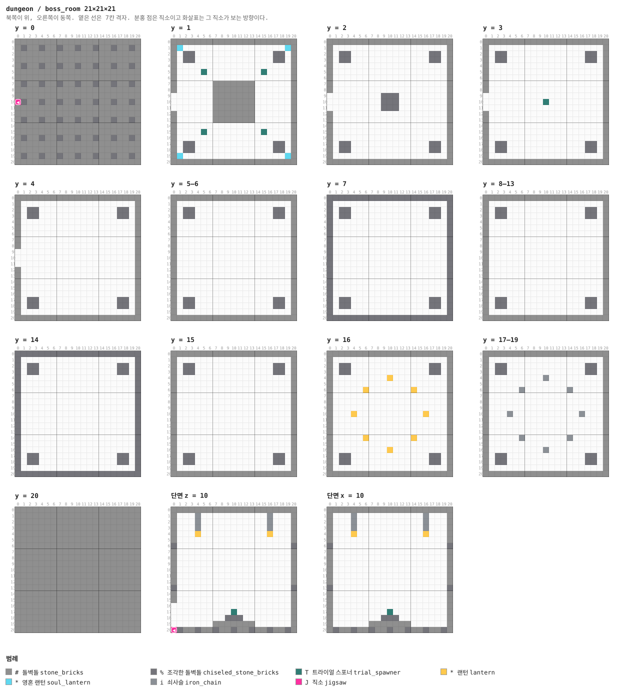

<details><summary>층별 지도 (텍스트)</summary>

```
y = 0   x →동, z ↓남
  #####################
  #%##%##%##%##%##%##%#
  #####################
  #####################
  #%##%##%##%##%##%##%#
  #####################
  #####################
  #%##%##%##%##%##%##%#
  #####################
  #####################
  J%##%##%##%##%##%##%#
  #####################
  #####################
  #%##%##%##%##%##%##%#
  #####################
  #####################
  #%##%##%##%##%##%##%#
  #####################
  #####################
  #%##%##%##%##%##%##%#
  #####################
y = 1   x →동, z ↓남
  #####################
  #s.................s#
  #.%%.............%%.#
  #.%%.............%%.#
  #...................#
  #....T.........T....#
  #...................#
  #......#######......#
  #......#######......#
  .......#######......#
  .......#######......#
  .......#######......#
  #......#######......#
  #......#######......#
  #...................#
  #....T.........T....#
  #...................#
  #.%%.............%%.#
  #.%%.............%%.#
  #s.................s#
  #####################
y = 2   x →동, z ↓남
  #####################
  #...................#
  #.%%.............%%.#
  #.%%.............%%.#
  #...................#
  #...................#
  #...................#
  #...................#
  #...................#
  .........%%%........#
  .........%%%........#
  .........%%%........#
  #...................#
  #...................#
  #...................#
  #...................#
  #...................#
  #.%%.............%%.#
  #.%%.............%%.#
  #...................#
  #####################
y = 3   x →동, z ↓남
  #####################
  #...................#
  #.%%.............%%.#
  #.%%.............%%.#
  #...................#
  #...................#
  #...................#
  #...................#
  #...................#
  ....................#
  ..........T.........#
  ....................#
  #...................#
  #...................#
  #...................#
  #...................#
  #...................#
  #.%%.............%%.#
  #.%%.............%%.#
  #...................#
  #####################
y = 4   x →동, z ↓남
  #####################
  #...................#
  #.%%.............%%.#
  #.%%.............%%.#
  #...................#
  #...................#
  #...................#
  #...................#
  #...................#
  ....................#
  ....................#
  ....................#
  #...................#
  #...................#
  #...................#
  #...................#
  #...................#
  #.%%.............%%.#
  #.%%.............%%.#
  #...................#
  #####################
y = 5–6   x →동, z ↓남
  #####################
  #...................#
  #.%%.............%%.#
  #.%%.............%%.#
  #...................#
  #...................#
  #...................#
  #...................#
  #...................#
  #...................#
  #...................#
  #...................#
  #...................#
  #...................#
  #...................#
  #...................#
  #...................#
  #.%%.............%%.#
  #.%%.............%%.#
  #...................#
  #####################
y = 7   x →동, z ↓남
  %%%%%%%%%%%%%%%%%%%%%
  %...................%
  %.%%.............%%.%
  %.%%.............%%.%
  %...................%
  %...................%
  %...................%
  %...................%
  %...................%
  %...................%
  %...................%
  %...................%
  %...................%
  %...................%
  %...................%
  %...................%
  %...................%
  %.%%.............%%.%
  %.%%.............%%.%
  %...................%
  %%%%%%%%%%%%%%%%%%%%%
y = 8–13   x →동, z ↓남
  #####################
  #...................#
  #.%%.............%%.#
  #.%%.............%%.#
  #...................#
  #...................#
  #...................#
  #...................#
  #...................#
  #...................#
  #...................#
  #...................#
  #...................#
  #...................#
  #...................#
  #...................#
  #...................#
  #.%%.............%%.#
  #.%%.............%%.#
  #...................#
  #####################
y = 14   x →동, z ↓남
  %%%%%%%%%%%%%%%%%%%%%
  %...................%
  %.%%.............%%.%
  %.%%.............%%.%
  %...................%
  %...................%
  %...................%
  %...................%
  %...................%
  %...................%
  %...................%
  %...................%
  %...................%
  %...................%
  %...................%
  %...................%
  %...................%
  %.%%.............%%.%
  %.%%.............%%.%
  %...................%
  %%%%%%%%%%%%%%%%%%%%%
y = 15   x →동, z ↓남
  #####################
  #...................#
  #.%%.............%%.#
  #.%%.............%%.#
  #...................#
  #...................#
  #...................#
  #...................#
  #...................#
  #...................#
  #...................#
  #...................#
  #...................#
  #...................#
  #...................#
  #...................#
  #...................#
  #.%%.............%%.#
  #.%%.............%%.#
  #...................#
  #####################
y = 16   x →동, z ↓남
  #####################
  #...................#
  #.%%.............%%.#
  #.%%.............%%.#
  #.........*.........#
  #...................#
  #.....*.......*.....#
  #...................#
  #...................#
  #...................#
  #...*...........*...#
  #...................#
  #...................#
  #...................#
  #.....*.......*.....#
  #...................#
  #.........*.........#
  #.%%.............%%.#
  #.%%.............%%.#
  #...................#
  #####################
y = 17–19   x →동, z ↓남
  #####################
  #...................#
  #.%%.............%%.#
  #.%%.............%%.#
  #.........i.........#
  #...................#
  #.....i.......i.....#
  #...................#
  #...................#
  #...................#
  #...i...........i...#
  #...................#
  #...................#
  #...................#
  #.....i.......i.....#
  #...................#
  #.........i.........#
  #.%%.............%%.#
  #.%%.............%%.#
  #...................#
  #####################
y = 20   x →동, z ↓남
  #####################
  #####################
  #####################
  #####################
  #####################
  #####################
  #####################
  #####################
  #####################
  #####################
  #####################
  #####################
  #####################
  #####################
  #####################
  #####################
  #####################
  #####################
  #####################
  #####################
  #####################
```

</details>

<details><summary>세로 단면 (텍스트)</summary>

```
단면 z = 10   x →동, y ↑하늘
  #####################
  #...i...........i...#
  #...i...........i...#
  #...i...........i...#
  #...*...........*...#
  #...................#
  %...................%
  #...................#
  #...................#
  #...................#
  #...................#
  #...................#
  #...................#
  %...................%
  #...................#
  #...................#
  ....................#
  ..........T.........#
  .........%%%........#
  .......#######......#
  J%##%##%##%##%##%##%#
단면 x = 10   z →남, y ↑하늘
  #####################
  #...i...........i...#
  #...i...........i...#
  #...i...........i...#
  #...*...........*...#
  #...................#
  %...................%
  #...................#
  #...................#
  #...................#
  #...................#
  #...................#
  #...................#
  %...................%
  #...................#
  #...................#
  #...................#
  #.........T.........#
  #........%%%........#
  #......#######......#
  #%##%##%##%##%##%##%#
```

</details>


## 다듬을 곳

플레이 테스트에서 이 던전은 "괜찮다"는 평을 받았다. 그래도 그림을 놓고 보면 남는 것들이 있다.

- **`stair`의 두 문이 같은 서쪽 면에 있다.** 어느 쪽으로 붙느냐가 무작위라 절반은 아래층으로
  이어진다. 의도한 것이긴 한데, 계단 위아래가 같은 방향이라 층을 옮겼다는 감각이 약하다.
- **감방(`cell`)은 상자 하나와 빈 바닥뿐이다.** 침상·사슬·낙서 같은 것이 없다. 7×7 칸이라
  자리는 있다.
- **`passage`는 완전히 비어 있다** (돌벽돌 257 + 직소 2). 미로의 대부분이 이 조각인데
  아무것도 없다. 바닥 무늬나 벽감 정도는 들어갈 만하다.
- **보스방 천장이 21칸으로 높지만 위쪽이 비어 있다.** 쇠사슬 랜턴 8개 말고는 공중에 아무것도
  없다.
