# 레벨 설계 — 드워프의 전당

> 이 문서는 `python tools/gen_level_doc.py dwarf`가 만든다. 조각을 고치면 다시 돌린다. 그림과 표는 게임이 읽는 파일(`structure/dwarf/*.nbt`, `worldgen/**`)에서 그대로 읽어 온 것이라 모드와 어긋날 수 없다. 설명 문장만 사람이 쓴다 (`tools/gen_level_doc.py`의 `INTRO`·`NOTES`).

## 1. 한눈에

산의 문이다. 뾰족한 봉우리와 바람 언덕에 심층암 문간이 서 있고, 그 바닥 구멍으로
**42칸을 내려가면** 돌을 파낸 전당이 나온다. 용광로, 광차 레일, 용암이 흐르는 구렁,
그리고 대장장이 왕.

시그니처(확정): **효율 IV·내구성 III 다이아 곡괭이 또는 도끼 1 + 갑옷 장식 템플릿 2 + 모루.**
파밍 없이 좋은 도구를 얻는 자리다 — 채굴은 안 하지만 도구는 던전 벽을 뚫는 데 쓴다.

| 항목 | 값 |
|---|---|
| 생성 단계 | `surface_structures` |
| 바이옴 | `#sydungeon:has_structure/dwarf` |
| 간격 / 최소거리 | spacing 40 / separation 14 |
| 직소 깊이 | 16 ~ 24 (`sydungeon:ranged_jigsaw`) |
| 시작 풀 | `start` |
| 조각 / 풀 | 18개 / 10개 |

## 2. 조립 원리

### 지상에 있는 것은 문 하나뿐이다

기계는 저주받은 묘지 그대로다 (`docs/levels/grave.md`) — 시작 조각, 사다리, 허브, 바위를
파낸 미로, 단일 원소 풀 사슬에 걸린 보스. **다른 것은 지상 조각이 하나뿐이라는 점이다.**

성채·진영은 고리를 닫고 묘지는 자리 있는 데로 퍼지는데, 봉우리는 게임에서 가장 급한
지형이라 그렇게 하면 조각이 기초 위에 죽마처럼 서거나 산에 파묻힌다. 그래서 퍼지지
않는다. 전당은 바위 속에 있고, 드워프의 전당이면 원래 그런 자리다.

### 사다리가 두 조각인 이유

산 지표는 y 110에서 200까지다. 미로는 **자기가 출발한 경사면과 확실히 떨어져 있어야**
하는데(§5.1), 수직통로 하나는 21칸이라 모자란다. 단일 원소 풀 둘로 엮어 42칸을 내리고,
**계단 조각을 아예 만들지 않았다** — 올라갈 길이 없으니 미로가 산 옆구리로 다시 솟지 못한다.

껍데기는 §5.2대로 **돌에 화강암 띠**다. 심층암 벽돌·철·용암은 전부 안쪽에 있다.

### 수직 사슬은 이름이 겹쳐도 안전하다

두 수직통로 모두 위아래에 직소가 있고 둘 다 `dwf_down`이다. §13이 경계하는 모양인데,
**수직 연결은 안전하다** — 회전이 Y축이라 아래를 보는 직소를 위로 돌릴 수 없어서 부모가
자식의 바닥 직소를 입구로 쓸 수가 없다.

### 발동시킬 수 없는 위험만 남긴다

§12다. 압력판도 철사도 없다. 대신 **용암 구렁**(`chasm`)이 있다 — 두 칸 높이 조각의
아래쪽이 용암이고, 건너는 다리는 문에서 3폭이다가 가운데서 1폭으로 좁아진다. 함정이
아니라 그냥 구멍이고, 누가 먼저 지나가든 똑같이 위험하다.

**용암은 새면 영원히 샌다.** 그래서 `lava_problems()`가 용암 블록마다 옆과 아래가
막혀 있는지 검사한다. 처음 쓴 용광로는 조각 **바닥면에** 용암을 깔아서 아래 조각으로
흘러내릴 것이었다 — 지금은 바닥 한 칸 위, 응회암 테두리 안에 있다.

### 광맥은 방이 아니라 돌이다

`vein`은 칸을 **돌로 되메우고** 짧은 굴만 판다. 처음엔 빈 방에 광석을 뿌렸는데, 검사기가
"광석이 공중에 떴다"를 네 개 찾아냈다 — 방 안에 뿌리면 광석은 떠 있는 것이 맞다.

## 3. 풀 배선

풀이 어떤 조각을 내놓는지(실선, 숫자는 가중치)와 그 조각의 직소가 다시 어떤 풀을 부르는지(점선)다. 직소 생성은 이 그래프를 깊이만큼 따라간다.

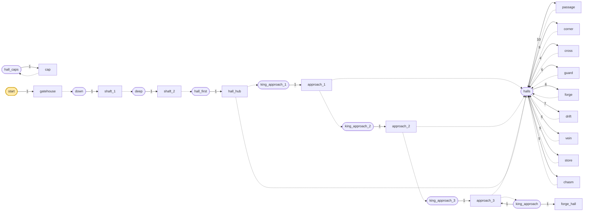

| 풀 | fallback | 원소 (가중치) |
|---|---|---|
| `deep` | `minecraft:empty` | `shaft_2` 1 |
| `down` | `minecraft:empty` | `shaft_1` 1 |
| `hall_caps` | `minecraft:empty` | `cap` 1 |
| `hall_first` | `minecraft:empty` | `hall_hub` 1 |
| `halls` | `hall_caps` | `passage` 10, `corner` 9, `cross` 4, `guard` 5, `forge` 6, `drift` 7, `vein` 5, `store` 5, `chasm` 5 |
| `king_approach` | `hall_caps` | `forge_hall` 1, `approach_3` 1 |
| `king_approach_1` | `hall_caps` | `approach_1` 1 |
| `king_approach_2` | `hall_caps` | `approach_2` 1 |
| `king_approach_3` | `hall_caps` | `approach_3` 1 |
| `start` | `minecraft:empty` | `gatehouse` 1 |

## 4. 뼈대 — 반드시 이렇게 놓이는 부분

문간과 수직통로 둘, 그리고 사다리가 닿는 허브. 미로와 보스 통로는 판마다 다르다.

| 조각 | 놓이는 자리 (시작 조각 기준) | 누가 놓나 |
|---|---|---|
| `gatehouse` | (0, 0, 0) | 시작 풀 |
| `shaft_1` | (7, -21, 7) | gatehouse의 아래 dwf_down 직소 |
| `shaft_2` | (7, -42, 7) | shaft_1의 아래 dwf_down 직소 |
| `hall_hub` | (7, -49, 7) | shaft_2의 아래 dwf_hall 직소 |
| `approach_1` | (7, -49, 14) | hall_hub의 남 dwf_hall 직소 |
| `approach_2` | (14, -49, 14) | approach_1의 동 dwf_hall 직소 |
| `approach_3` | (21, -49, 14) | approach_2의 동 dwf_hall 직소 |

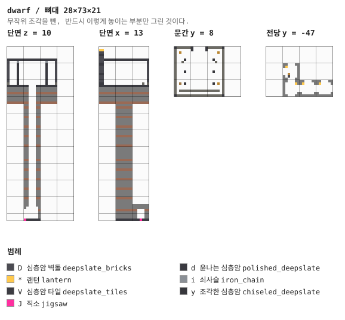

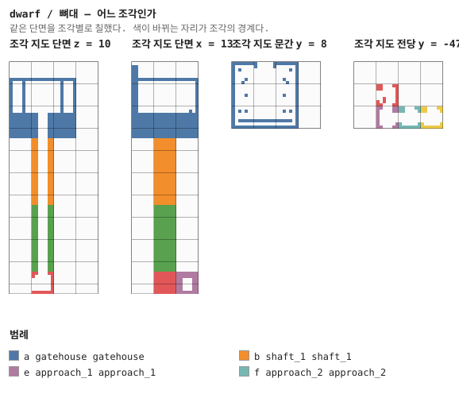

## 5. 조각


그림은 조각 하나를 **층마다 한 장씩** 블록 단위로 그린 것이다. 같은 층이 이어지면 `y = 2–5`처럼 묶었고, 마지막 두 장은 가운데를 자른 세로 단면이다. 분홍 점이 직소, 화살표가 그 직소가 보는 방향이다 — **마주 본 직소끼리만 붙는다.**

### `gatehouse` — 21×24×21

시작 조각이고, 이 던전에서 **해를 보는 유일한 조각**이다. 북면에 아치형 큰 문, 그 옆에
탑 둘, 안쪽에 기둥 두 줄과 남벽의 대장간(용광로 둘·모루·연마기), 그리고 바닥 가운데에
전당으로 내려가는 구멍이 있다. 구멍 둘레는 조각한 심층암 테두리다.

기초 일곱 켜는 띠가 들어간 돌이다 — 봉우리에서는 한쪽이 그냥 없어지므로 드러날 각오를
하고 짓는다 (§5.2).

**어느 풀에 있나** — `start` (가중치 1)

| 직소 위치 | 향 | name | target | pool |
|---|---|---|---|---|
| (9, 0, 12) | ◇ 아래 | `dwf_down` | `dwf_down` | `dwarf/down` |

**뚫린 면** — 서: z 0–20, y 13–23 (109칸) / 동: z 0–20, y 13–23 (109칸) / 북: x 0–20, y 8–23 (120칸) / 남: x 0–20, y 19–23 (105칸) / 아래: x 9–11, z 9–11 (8칸) / 위: x 0–20, z 0–20 (441칸)

**블록** — 돌 2160, 화강암 863, 심층암 벽돌 675, 윤나는 심층암 520, 심층암 타일 433, 응회암 벽돌 88, 조각한 심층암 29, 사다리 8

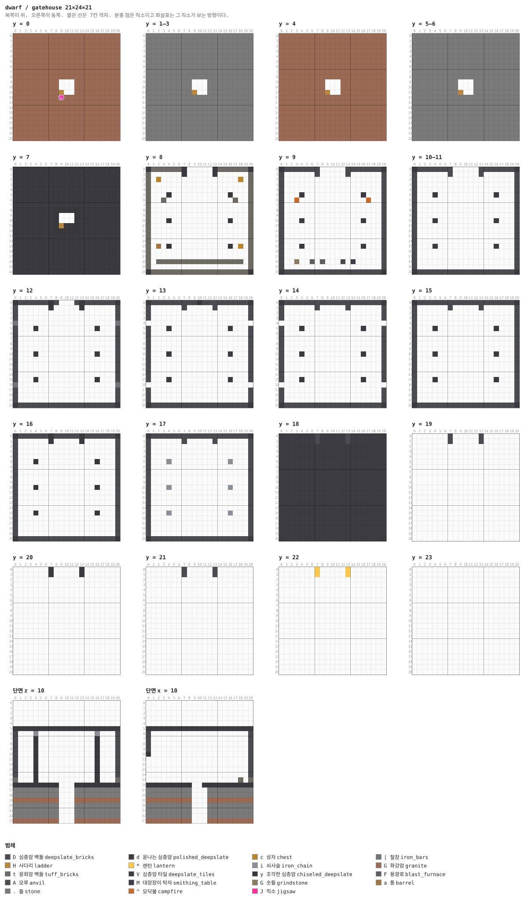

<details><summary>층별 지도 (텍스트)</summary>

```
y = 0   x →동, z ↓남
  GGGGGGGGGGGGGGGGGGGGG
  GGGGGGGGGGGGGGGGGGGGG
  GGGGGGGGGGGGGGGGGGGGG
  GGGGGGGGGGGGGGGGGGGGG
  GGGGGGGGGGGGGGGGGGGGG
  GGGGGGGGGGGGGGGGGGGGG
  GGGGGGGGGGGGGGGGGGGGG
  GGGGGGGGGGGGGGGGGGGGG
  GGGGGGGGGGGGGGGGGGGGG
  GGGGGGGGG...GGGGGGGGG
  GGGGGGGGG...GGGGGGGGG
  GGGGGGGGGH..GGGGGGGGG
  GGGGGGGGGJGGGGGGGGGGG
  GGGGGGGGGGGGGGGGGGGGG
  GGGGGGGGGGGGGGGGGGGGG
  GGGGGGGGGGGGGGGGGGGGG
  GGGGGGGGGGGGGGGGGGGGG
  GGGGGGGGGGGGGGGGGGGGG
  GGGGGGGGGGGGGGGGGGGGG
  GGGGGGGGGGGGGGGGGGGGG
  GGGGGGGGGGGGGGGGGGGGG
y = 1–3   x →동, z ↓남
  .....................
  .....................
  .....................
  .....................
  .....................
  .....................
  .....................
  .....................
  .....................
  .....................
  .....................
  .........H...........
  .....................
  .....................
  .....................
  .....................
  .....................
  .....................
  .....................
  .....................
  .....................
y = 4   x →동, z ↓남
  GGGGGGGGGGGGGGGGGGGGG
  GGGGGGGGGGGGGGGGGGGGG
  GGGGGGGGGGGGGGGGGGGGG
  GGGGGGGGGGGGGGGGGGGGG
  GGGGGGGGGGGGGGGGGGGGG
  GGGGGGGGGGGGGGGGGGGGG
  GGGGGGGGGGGGGGGGGGGGG
  GGGGGGGGGGGGGGGGGGGGG
  GGGGGGGGGGGGGGGGGGGGG
  GGGGGGGGG...GGGGGGGGG
  GGGGGGGGG...GGGGGGGGG
  GGGGGGGGGH..GGGGGGGGG
  GGGGGGGGGGGGGGGGGGGGG
  GGGGGGGGGGGGGGGGGGGGG
  GGGGGGGGGGGGGGGGGGGGG
  GGGGGGGGGGGGGGGGGGGGG
  GGGGGGGGGGGGGGGGGGGGG
  GGGGGGGGGGGGGGGGGGGGG
  GGGGGGGGGGGGGGGGGGGGG
  GGGGGGGGGGGGGGGGGGGGG
  GGGGGGGGGGGGGGGGGGGGG
y = 5–6   x →동, z ↓남
  .....................
  .....................
  .....................
  .....................
  .....................
  .....................
  .....................
  .....................
  .....................
  .....................
  .....................
  .........H...........
  .....................
  .....................
  .....................
  .....................
  .....................
  .....................
  .....................
  .....................
  .....................
y = 7   x →동, z ↓남
  ddddddddddddddddddddd
  ddddddddddddddddddddd
  ddddddddddddddddddddd
  ddddddddddddddddddddd
  ddddddddddddddddddddd
  ddddddddddddddddddddd
  ddddddddddddddddddddd
  ddddddddddddddddddddd
  ddddddddyyyyydddddddd
  ddddddddy...ydddddddd
  ddddddddy...ydddddddd
  ddddddddyHddydddddddd
  ddddddddyyyyydddddddd
  ddddddddddddddddddddd
  ddddddddddddddddddddd
  ddddddddddddddddddddd
  ddddddddddddddddddddd
  ddddddddddddddddddddd
  ddddddddddddddddddddd
  ddddddddddddddddddddd
  ddddddddddddddddddddd
y = 8   x →동, z ↓남
  dttttttd.....dttttttd
  t......d.....d......t
  t.c...............c.t
  t...................t
  t...................t
  t...y...........y...t
  t..t.............t..t
  t...................t
  t...................t
  t...................t
  t...y...........y...t
  t...................t
  t...................t
  t...................t
  t...................t
  t.a.y...........y.c.t
  t...................t
  t...................t
  t.ttttttttttttttttt.t
  t...................t
  dtttttttttttttttttttd
y = 9   x →동, z ↓남
  dDDDDDDD.....DDDDDDDd
  D......D.....D......D
  D...................D
  D...................D
  D...................D
  D...d...........d...D
  D..^.............^..D
  D...................D
  D...................D
  D...................D
  D...d...........d...D
  D...................D
  D...................D
  D...................D
  D...................D
  D...d...........d...D
  D...................D
  D...................D
  D..G..F.F...A.M.....D
  D...................D
  dDDDDDDDDDDDDDDDDDDDd
y = 10–11   x →동, z ↓남
  dDDDDDDD.....DDDDDDDd
  D......D.....D......D
  D...................D
  D...................D
  D...................D
  D...d...........d...D
  D...................D
  D...................D
  D...................D
  D...................D
  D...d...........d...D
  D...................D
  D...................D
  D...................D
  D...................D
  D...d...........d...D
  D...................D
  D...................D
  D...................D
  D...................D
  dDDDDDDDDDDDDDDDDDDDd
y = 12   x →동, z ↓남
  dDDDDDDdD...DdDDDDDDd
  D......d.....d......D
  D...................D
  D...................D
  |...................|
  D...d...........d...D
  D...................D
  D...................D
  D...................D
  D...................D
  D...d...........d...D
  D...................D
  D...................D
  D...................D
  D...................D
  D...d...........d...D
  |...................|
  D...................D
  D...................D
  D...................D
  dDDDDDDDDDDDDDDDDDDDd
y = 13   x →동, z ↓남
  dDDDDDDDDDyDDDDDDDDDd
  D......D.....D......D
  D...................D
  D...................D
  .....................
  D...d...........d...D
  D...................D
  D...................D
  D...................D
  D...................D
  D...d...........d...D
  D...................D
  D...................D
  D...................D
  D...................D
  D...d...........d...D
  .....................
  D...................D
  D...................D
  D...................D
  dDDDDDDDDDDDDDDDDDDDd
y = 14   x →동, z ↓남
  dDDDDDDDDDDDDDDDDDDDd
  D......D.....D......D
  D...................D
  D...................D
  .....................
  D...d...........d...D
  D...................D
  D...................D
  D...................D
  D...................D
  D...d...........d...D
  D...................D
  D...................D
  D...................D
  D...................D
  D...d...........d...D
  .....................
  D...................D
  D...................D
  D...................D
  dDDDDDDDDDDDDDDDDDDDd
y = 15   x →동, z ↓남
  dDDDDDDDDDDDDDDDDDDDd
  D......D.....D......D
  D...................D
  D...................D
  D...................D
  D...d...........d...D
  D...................D
  D...................D
  D...................D
  D...................D
  D...d...........d...D
  D...................D
  D...................D
  D...................D
  D...................D
  D...d...........d...D
  D...................D
  D...................D
  D...................D
  D...................D
  dDDDDDDDDDDDDDDDDDDDd
y = 16   x →동, z ↓남
  dDDDDDDdDDDDDdDDDDDDd
  D......d.....d......D
  D...................D
  D...................D
  D...................D
  D...y...........y...D
  D...................D
  D...................D
  D...................D
  D...................D
  D...y...........y...D
  D...................D
  D...................D
  D...................D
  D...................D
  D...y...........y...D
  D...................D
  D...................D
  D...................D
  D...................D
  dDDDDDDDDDDDDDDDDDDDd
y = 17   x →동, z ↓남
  dDDDDDDDDDDDDDDDDDDDd
  D......D.....D......D
  D...................D
  D...................D
  D...................D
  D...i...........i...D
  D...................D
  D...................D
  D...................D
  D...................D
  D...i...........i...D
  D...................D
  D...................D
  D...................D
  D...................D
  D...i...........i...D
  D...................D
  D...................D
  D...................D
  D...................D
  dDDDDDDDDDDDDDDDDDDDd
y = 18   x →동, z ↓남
  dVVVVVVDVVVVVDVVVVVVd
  VVVVVVVDVVVVVDVVVVVVV
  VVVVVVVVVVVVVVVVVVVVV
  VVVVVVVVVVVVVVVVVVVVV
  VVVVVVVVVVVVVVVVVVVVV
  VVVVVVVVVVVVVVVVVVVVV
  VVVVVVVVVVVVVVVVVVVVV
  VVVVVVVVVVVVVVVVVVVVV
  VVVVVVVVVVVVVVVVVVVVV
  VVVVVVVVVVVVVVVVVVVVV
  VVVVVVVVVVVVVVVVVVVVV
  VVVVVVVVVVVVVVVVVVVVV
  VVVVVVVVVVVVVVVVVVVVV
  VVVVVVVVVVVVVVVVVVVVV
  VVVVVVVVVVVVVVVVVVVVV
  VVVVVVVVVVVVVVVVVVVVV
  VVVVVVVVVVVVVVVVVVVVV
  VVVVVVVVVVVVVVVVVVVVV
  VVVVVVVVVVVVVVVVVVVVV
  VVVVVVVVVVVVVVVVVVVVV
  dVVVVVVVVVVVVVVVVVVVd
y = 19   x →동, z ↓남
  .......D.....D.......
  .......D.....D.......
  .....................
  .....................
  .....................
  .....................
  .....................
  .....................
  .....................
  .....................
  .....................
  .....................
  .....................
  .....................
  .....................
  .....................
  .....................
  .....................
  .....................
  .....................
  .....................
y = 20   x →동, z ↓남
  .......d.....d.......
  .......d.....d.......
  .....................
  .....................
  .....................
  .....................
  .....................
  .....................
  .....................
  .....................
  .....................
  .....................
  .....................
  .....................
  .....................
  .....................
  .....................
  .....................
  .....................
  .....................
  .....................
y = 21   x →동, z ↓남
  .......D.....D.......
  .......D.....D.......
  .....................
  .....................
  .....................
  .....................
  .....................
  .....................
  .....................
  .....................
  .....................
  .....................
  .....................
  .....................
  .....................
  .....................
  .....................
  .....................
  .....................
  .....................
  .....................
y = 22   x →동, z ↓남
  .......*.....*.......
  .......*.....*.......
  .....................
  .....................
  .....................
  .....................
  .....................
  .....................
  .....................
  .....................
  .....................
  .....................
  .....................
  .....................
  .....................
  .....................
  .....................
  .....................
  .....................
  .....................
  .....................
y = 23   x →동, z ↓남
  .....................
  .....................
  .....................
  .....................
  .....................
  .....................
  .....................
  .....................
  .....................
  .....................
  .....................
  .....................
  .....................
  .....................
  .....................
  .....................
  .....................
  .....................
  .....................
  .....................
  .....................
```

</details>

<details><summary>세로 단면 (텍스트)</summary>

```
단면 z = 10   x →동, y ↑하늘
  .....................
  .....................
  .....................
  .....................
  .....................
  VVVVVVVVVVVVVVVVVVVVV
  D...i...........i...D
  D...y...........y...D
  D...d...........d...D
  D...d...........d...D
  D...d...........d...D
  D...d...........d...D
  D...d...........d...D
  D...d...........d...D
  D...d...........d...D
  t...y...........y...t
  ddddddddy...ydddddddd
  .....................
  .....................
  GGGGGGGGG...GGGGGGGGG
  .....................
  .....................
  .....................
  GGGGGGGGG...GGGGGGGGG
단면 x = 10   z →남, y ↑하늘
  .....................
  .....................
  .....................
  .....................
  .....................
  VVVVVVVVVVVVVVVVVVVVV
  D...................D
  D...................D
  D...................D
  D...................D
  y...................D
  ....................D
  ....................D
  ....................D
  ....................D
  ..................t.t
  ddddddddy..dydddddddd
  .....................
  .....................
  GGGGGGGGG...GGGGGGGGG
  .....................
  .....................
  .....................
  GGGGGGGGG...GGGGGGGGG
```

</details>


### `shaft_1` — 7×21×7 — 1×3×1 셀

수직통로 위쪽 21칸. 돌과 화강암 띠, 사다리 한 줄.

**어느 풀에 있나** — `down` (가중치 1)

| 직소 위치 | 향 | name | target | pool |
|---|---|---|---|---|
| (2, 0, 5) | ◇ 아래 | `dwf_down` | `dwf_down` | `dwarf/deep` |
| (2, 20, 5) | ◆ 위 | `dwf_down` | `dwf_down` | `—` |

**뚫린 면** — 아래: x 2–4, z 2–4 (8칸) / 위: x 2–4, z 2–4 (8칸)

**블록** — 돌 638, 화강암 200, 사다리 21, 직소 2

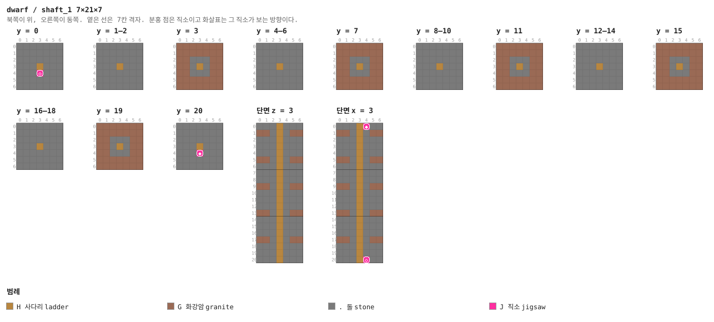

<details><summary>층별 지도 (텍스트)</summary>

```
y = 0   x →동, z ↓남
  .......
  .......
  .......
  .......
  ..H....
  ..J....
  .......
y = 1–2   x →동, z ↓남
  .......
  .......
  .......
  .......
  ..H....
  .......
  .......
y = 3   x →동, z ↓남
  GGGGGGG
  GGGGGGG
  GG...GG
  GG...GG
  GGH..GG
  GGGGGGG
  GGGGGGG
y = 4–6   x →동, z ↓남
  .......
  .......
  .......
  .......
  ..H....
  .......
  .......
y = 7   x →동, z ↓남
  GGGGGGG
  GGGGGGG
  GG...GG
  GG...GG
  GGH..GG
  GGGGGGG
  GGGGGGG
y = 8–10   x →동, z ↓남
  .......
  .......
  .......
  .......
  ..H....
  .......
  .......
y = 11   x →동, z ↓남
  GGGGGGG
  GGGGGGG
  GG...GG
  GG...GG
  GGH..GG
  GGGGGGG
  GGGGGGG
y = 12–14   x →동, z ↓남
  .......
  .......
  .......
  .......
  ..H....
  .......
  .......
y = 15   x →동, z ↓남
  GGGGGGG
  GGGGGGG
  GG...GG
  GG...GG
  GGH..GG
  GGGGGGG
  GGGGGGG
y = 16–18   x →동, z ↓남
  .......
  .......
  .......
  .......
  ..H....
  .......
  .......
y = 19   x →동, z ↓남
  GGGGGGG
  GGGGGGG
  GG...GG
  GG...GG
  GGH..GG
  GGGGGGG
  GGGGGGG
y = 20   x →동, z ↓남
  .......
  .......
  .......
  .......
  ..H....
  ..J....
  .......
```

</details>

<details><summary>세로 단면 (텍스트)</summary>

```
단면 z = 3   x →동, y ↑하늘
  .......
  GG...GG
  .......
  .......
  .......
  GG...GG
  .......
  .......
  .......
  GG...GG
  .......
  .......
  .......
  GG...GG
  .......
  .......
  .......
  GG...GG
  .......
  .......
  .......
단면 x = 3   z →남, y ↑하늘
  .......
  GG...GG
  .......
  .......
  .......
  GG...GG
  .......
  .......
  .......
  GG...GG
  .......
  .......
  .......
  GG...GG
  .......
  .......
  .......
  GG...GG
  .......
  .......
  .......
```

</details>


### `shaft_2` — 7×21×7 — 1×3×1 셀

아래쪽 21칸. 여기까지 내려오면 지표에서 42칸이다.

**어느 풀에 있나** — `deep` (가중치 1)

| 직소 위치 | 향 | name | target | pool |
|---|---|---|---|---|
| (2, 0, 5) | ◇ 아래 | `dwf_hall` | `dwf_hall` | `dwarf/hall_first` |
| (2, 20, 5) | ◆ 위 | `dwf_down` | `dwf_down` | `—` |

**뚫린 면** — 아래: x 2–4, z 2–4 (8칸) / 위: x 2–4, z 2–4 (8칸)

**블록** — 돌 638, 화강암 200, 사다리 21, 직소 2

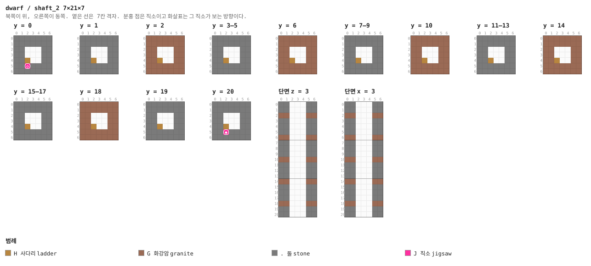

<details><summary>층별 지도 (텍스트)</summary>

```
y = 0   x →동, z ↓남
  .......
  .......
  .......
  .......
  ..H....
  ..J....
  .......
y = 1   x →동, z ↓남
  .......
  .......
  .......
  .......
  ..H....
  .......
  .......
y = 2   x →동, z ↓남
  GGGGGGG
  GGGGGGG
  GG...GG
  GG...GG
  GGH..GG
  GGGGGGG
  GGGGGGG
y = 3–5   x →동, z ↓남
  .......
  .......
  .......
  .......
  ..H....
  .......
  .......
y = 6   x →동, z ↓남
  GGGGGGG
  GGGGGGG
  GG...GG
  GG...GG
  GGH..GG
  GGGGGGG
  GGGGGGG
y = 7–9   x →동, z ↓남
  .......
  .......
  .......
  .......
  ..H....
  .......
  .......
y = 10   x →동, z ↓남
  GGGGGGG
  GGGGGGG
  GG...GG
  GG...GG
  GGH..GG
  GGGGGGG
  GGGGGGG
y = 11–13   x →동, z ↓남
  .......
  .......
  .......
  .......
  ..H....
  .......
  .......
y = 14   x →동, z ↓남
  GGGGGGG
  GGGGGGG
  GG...GG
  GG...GG
  GGH..GG
  GGGGGGG
  GGGGGGG
y = 15–17   x →동, z ↓남
  .......
  .......
  .......
  .......
  ..H....
  .......
  .......
y = 18   x →동, z ↓남
  GGGGGGG
  GGGGGGG
  GG...GG
  GG...GG
  GGH..GG
  GGGGGGG
  GGGGGGG
y = 19   x →동, z ↓남
  .......
  .......
  .......
  .......
  ..H....
  .......
  .......
y = 20   x →동, z ↓남
  .......
  .......
  .......
  .......
  ..H....
  ..J....
  .......
```

</details>

<details><summary>세로 단면 (텍스트)</summary>

```
단면 z = 3   x →동, y ↑하늘
  .......
  .......
  GG...GG
  .......
  .......
  .......
  GG...GG
  .......
  .......
  .......
  GG...GG
  .......
  .......
  .......
  GG...GG
  .......
  .......
  .......
  GG...GG
  .......
  .......
단면 x = 3   z →남, y ↑하늘
  .......
  .......
  GG...GG
  .......
  .......
  .......
  GG...GG
  .......
  .......
  .......
  GG...GG
  .......
  .......
  .......
  GG...GG
  .......
  .......
  .......
  GG...GG
  .......
  .......
```

</details>


### `hall_hub` — 7×7×7 — 1×1×1 셀

사다리가 닿는 방. 서·북문이 전당 미로로 가고 **남문이 보스 사슬**을 부른다. 사다리가 걸린
기둥은 심층암 벽돌이고, 천장 구멍 옆 한 줄은 발판으로 남겨 뒀다 (§24).

**어느 풀에 있나** — `hall_first` (가중치 1)

| 직소 위치 | 향 | name | target | pool |
|---|---|---|---|---|
| (3, 0, 0) | ▲ 북 | `dwf_hall` | `dwf_hall` | `dwarf/halls` |
| (0, 0, 3) | ◀ 서 | `dwf_hall` | `dwf_hall` | `dwarf/halls` |
| (3, 0, 6) | ▼ 남 | `dwf_hall` | `dwf_king` | `dwarf/king_approach_1` |
| (2, 6, 5) | ◆ 위 | `dwf_hall` | `dwf_hall` | `—` |

**뚫린 면** — 서: z 2–4, y 1–4 (12칸) / 북: x 2–4, y 1–4 (12칸) / 남: x 2–4, y 1–4 (12칸) / 위: x 2–4, z 2–4 (8칸)

**블록** — 돌 108, 심층암 타일 46, 화강암 15, 사다리 6, 심층암 벽돌 5, 직소 4, 윤나는 심층암 1, 랜턴 1

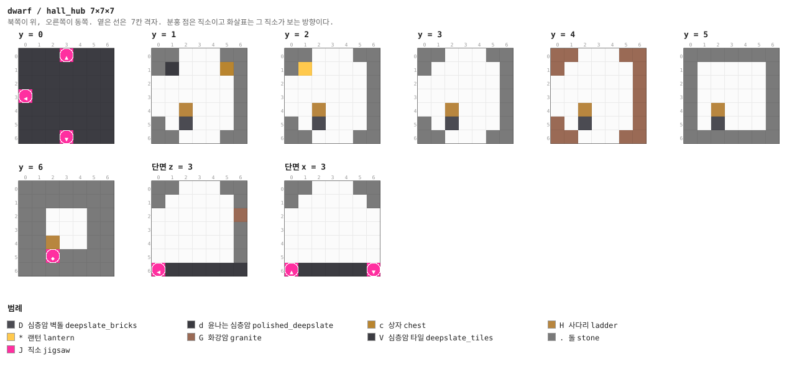

<details><summary>층별 지도 (텍스트)</summary>

```
y = 0   x →동, z ↓남
  VVVJVVV
  VVVVVVV
  VVVVVVV
  JVVVVVV
  VVVVVVV
  VVVVVVV
  VVVJVVV
y = 1   x →동, z ↓남
  .......
  .d...c.
  .......
  .......
  ..H....
  ..D....
  .......
y = 2   x →동, z ↓남
  .......
  .*.....
  .......
  .......
  ..H....
  ..D....
  .......
y = 3   x →동, z ↓남
  .......
  .......
  .......
  .......
  ..H....
  ..D....
  .......
y = 4   x →동, z ↓남
  GG...GG
  G.....G
  ......G
  ......G
  ..H...G
  G.D...G
  GG...GG
y = 5   x →동, z ↓남
  .......
  .......
  .......
  .......
  ..H....
  ..D....
  .......
y = 6   x →동, z ↓남
  .......
  .......
  .......
  .......
  ..H....
  ..J....
  .......
```

</details>


### `passage` — 7×7×7 — 1×1×1 셀

미로의 기본 단위. 벽에 랜턴 둘.

**어느 풀에 있나** — `halls` (가중치 10)

| 직소 위치 | 향 | name | target | pool |
|---|---|---|---|---|
| (0, 0, 3) | ◀ 서 | `dwf_hall` | `dwf_hall` | `dwarf/halls` |
| (6, 0, 3) | ▶ 동 | `dwf_hall` | `dwf_hall` | `dwarf/halls` |

**뚫린 면** — 서: z 2–4, y 1–4 (12칸) / 동: z 2–4, y 1–4 (12칸)

**블록** — 돌 127, 심층암 타일 47, 화강암 18, 심층암 벽돌 3, 직소 2, 윤나는 심층암 2, 랜턴 2

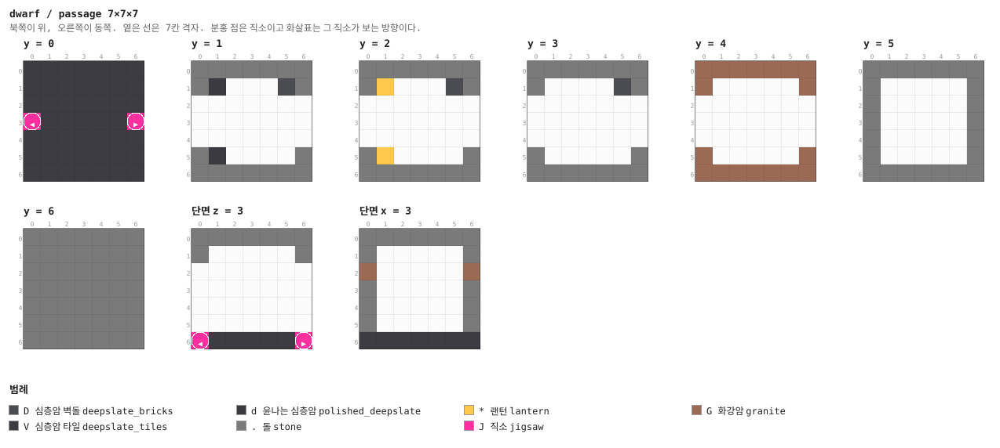

<details><summary>층별 지도 (텍스트)</summary>

```
y = 0   x →동, z ↓남
  VVVVVVV
  VVVVVVV
  VVVVVVV
  JVVVVVJ
  VVVVVVV
  VVVVVVV
  VVVVVVV
y = 1   x →동, z ↓남
  .......
  .d...D.
  .......
  .......
  .......
  .d.....
  .......
y = 2   x →동, z ↓남
  .......
  .*...D.
  .......
  .......
  .......
  .*.....
  .......
y = 3   x →동, z ↓남
  .......
  .....D.
  .......
  .......
  .......
  .......
  .......
y = 4   x →동, z ↓남
  GGGGGGG
  G.....G
  .......
  .......
  .......
  G.....G
  GGGGGGG
y = 5   x →동, z ↓남
  .......
  .......
  .......
  .......
  .......
  .......
  .......
y = 6   x →동, z ↓남
  .......
  .......
  .......
  .......
  .......
  .......
  .......
```

</details>


### `corner` — 7×7×7 — 1×1×1 셀

꺾이는 통로. 구석에 마그마 블록 하나가 빛을 낸다.

**어느 풀에 있나** — `halls` (가중치 9)

| 직소 위치 | 향 | name | target | pool |
|---|---|---|---|---|
| (0, 0, 3) | ◀ 서 | `dwf_hall` | `dwf_hall` | `dwarf/halls` |
| (3, 0, 6) | ▼ 남 | `dwf_hall` | `dwf_hall` | `dwarf/halls` |

**뚫린 면** — 서: z 2–4, y 1–4 (12칸) / 남: x 2–4, y 1–4 (12칸)

**블록** — 돌 127, 심층암 타일 47, 화강암 18, 직소 2, 마그마 블록 1, 윤나는 심층암 1, 랜턴 1

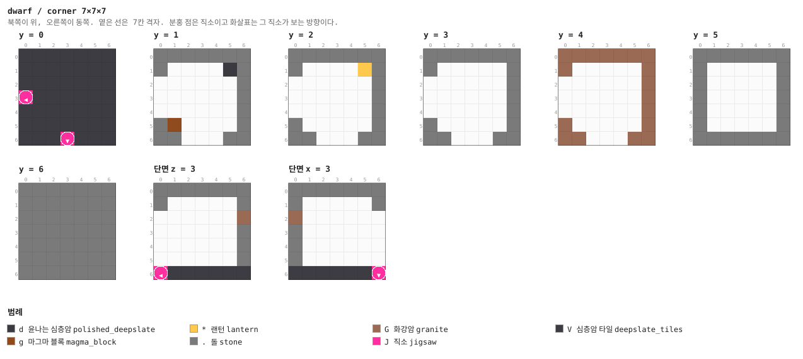

<details><summary>층별 지도 (텍스트)</summary>

```
y = 0   x →동, z ↓남
  VVVVVVV
  VVVVVVV
  VVVVVVV
  JVVVVVV
  VVVVVVV
  VVVVVVV
  VVVJVVV
y = 1   x →동, z ↓남
  .......
  .....d.
  .......
  .......
  .......
  .g.....
  .......
y = 2   x →동, z ↓남
  .......
  .....*.
  .......
  .......
  .......
  .......
  .......
y = 3   x →동, z ↓남
  .......
  .......
  .......
  .......
  .......
  .......
  .......
y = 4   x →동, z ↓남
  GGGGGGG
  G.....G
  ......G
  ......G
  ......G
  G.....G
  GG...GG
y = 5   x →동, z ↓남
  .......
  .......
  .......
  .......
  .......
  .......
  .......
y = 6   x →동, z ↓남
  .......
  .......
  .......
  .......
  .......
  .......
  .......
```

</details>


### `cross` — 7×7×7 — 1×1×1 셀

네거리. 네 구석에 심층암 기둥과 랜턴.

**어느 풀에 있나** — `halls` (가중치 4)

| 직소 위치 | 향 | name | target | pool |
|---|---|---|---|---|
| (3, 0, 0) | ▲ 북 | `dwf_hall` | `dwf_hall` | `dwarf/halls` |
| (0, 0, 3) | ◀ 서 | `dwf_hall` | `dwf_hall` | `dwarf/halls` |
| (6, 0, 3) | ▶ 동 | `dwf_hall` | `dwf_hall` | `dwarf/halls` |
| (3, 0, 6) | ▼ 남 | `dwf_hall` | `dwf_hall` | `dwarf/halls` |

**뚫린 면** — 서: z 2–4, y 1–4 (12칸) / 동: z 2–4, y 1–4 (12칸) / 북: x 2–4, y 1–4 (12칸) / 남: x 2–4, y 1–4 (12칸)

**블록** — 돌 109, 심층암 타일 36, 윤나는 심층암 17, 화강암 12, 직소 4, 조각한 심층암 4, 랜턴 4

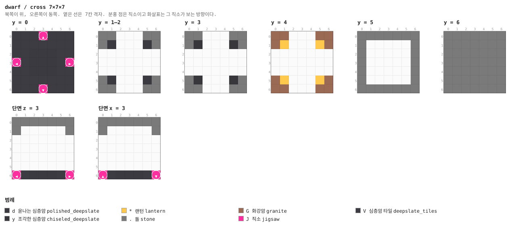

<details><summary>층별 지도 (텍스트)</summary>

```
y = 0   x →동, z ↓남
  VVVJVVV
  VVVVVVV
  VVdddVV
  JVdddVJ
  VVdddVV
  VVVVVVV
  VVVJVVV
y = 1–2   x →동, z ↓남
  .......
  .d...d.
  .......
  .......
  .......
  .d...d.
  .......
y = 3   x →동, z ↓남
  .......
  .y...y.
  .......
  .......
  .......
  .y...y.
  .......
y = 4   x →동, z ↓남
  GG...GG
  G*...*G
  .......
  .......
  .......
  G*...*G
  GG...GG
y = 5   x →동, z ↓남
  .......
  .......
  .......
  .......
  .......
  .......
  .......
y = 6   x →동, z ↓남
  .......
  .......
  .......
  .......
  .......
  .......
  .......
```

</details>


### `guard` — 7×7×7 — 1×1×1 셀

경비 칸. 응회암 판 위에 스켈레톤 스포너.

**어느 풀에 있나** — `halls` (가중치 5)

| 직소 위치 | 향 | name | target | pool |
|---|---|---|---|---|
| (3, 0, 0) | ▲ 북 | `dwf_hall` | `dwf_hall` | `dwarf/halls` |
| (0, 0, 3) | ◀ 서 | `dwf_hall` | `dwf_hall` | `dwarf/halls` |
| (6, 0, 3) | ▶ 동 | `dwf_hall` | `dwf_hall` | `dwarf/halls` |
| (3, 0, 6) | ▼ 남 | `dwf_hall` | `dwf_hall` | `dwarf/halls` |

**뚫린 면** — 서: z 2–4, y 1–4 (12칸) / 동: z 2–4, y 1–4 (12칸) / 북: x 2–4, y 1–4 (12칸) / 남: x 2–4, y 1–4 (12칸)

**블록** — 돌 109, 심층암 타일 36, 화강암 12, 응회암 벽돌 9, 직소 4, 철창 2, 몬스터 스포너 1

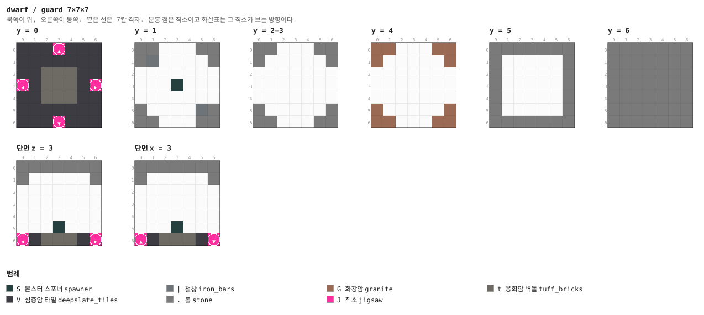

<details><summary>층별 지도 (텍스트)</summary>

```
y = 0   x →동, z ↓남
  VVVJVVV
  VVVVVVV
  VVtttVV
  JVtttVJ
  VVtttVV
  VVVVVVV
  VVVJVVV
y = 1   x →동, z ↓남
  .......
  .|.....
  .......
  ...S...
  .......
  .....|.
  .......
y = 2–3   x →동, z ↓남
  .......
  .......
  .......
  .......
  .......
  .......
  .......
y = 4   x →동, z ↓남
  GG...GG
  G.....G
  .......
  .......
  .......
  G.....G
  GG...GG
y = 5   x →동, z ↓남
  .......
  .......
  .......
  .......
  .......
  .......
  .......
y = 6   x →동, z ↓남
  .......
  .......
  .......
  .......
  .......
  .......
  .......
```

</details>


### `forge` — 7×7×7 — 1×1×1 셀

용광로 칸. 북벽을 따라 **용암 홈**이 바닥과 같은 높이로 흐르고, 응회암 테두리를 넘어야
닿는다. 남벽에 용광로 둘·모루·상자.

**어느 풀에 있나** — `halls` (가중치 6)

| 직소 위치 | 향 | name | target | pool |
|---|---|---|---|---|
| (0, 0, 3) | ◀ 서 | `dwf_hall` | `dwf_hall` | `dwarf/halls` |
| (6, 0, 3) | ▶ 동 | `dwf_hall` | `dwf_hall` | `dwarf/halls` |

**뚫린 면** — 서: z 2–4, y 1–4 (12칸) / 동: z 2–4, y 1–4 (12칸)

**블록** — 돌 127, 심층암 타일 47, 화강암 18, 용암 5, 응회암 벽돌 5, 직소 2, 용광로 2, 모루 1

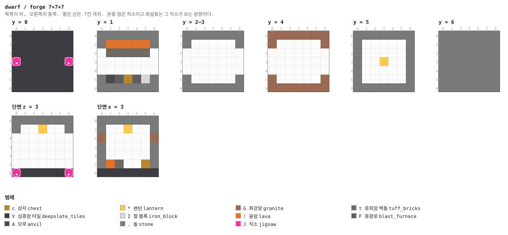

<details><summary>층별 지도 (텍스트)</summary>

```
y = 0   x →동, z ↓남
  VVVVVVV
  VVVVVVV
  VVVVVVV
  JVVVVVJ
  VVVVVVV
  VVVVVVV
  VVVVVVV
y = 1   x →동, z ↓남
  .......
  .!!!!!.
  .ttttt.
  .......
  .......
  .AFcFI.
  .......
y = 2–3   x →동, z ↓남
  .......
  .......
  .......
  .......
  .......
  .......
  .......
y = 4   x →동, z ↓남
  GGGGGGG
  G.....G
  .......
  .......
  .......
  G.....G
  GGGGGGG
y = 5   x →동, z ↓남
  .......
  .......
  .......
  ...*...
  .......
  .......
  .......
y = 6   x →동, z ↓남
  .......
  .......
  .......
  .......
  .......
  .......
  .......
```

</details>


### `drift` — 7×7×7 — 1×1×1 셀

광차 길. 레일 한 줄과 가문비 목재 지보, 상자 하나.

**어느 풀에 있나** — `halls` (가중치 7)

| 직소 위치 | 향 | name | target | pool |
|---|---|---|---|---|
| (0, 0, 3) | ◀ 서 | `dwf_hall` | `dwf_hall` | `dwarf/halls` |
| (6, 0, 3) | ▶ 동 | `dwf_hall` | `dwf_hall` | `dwarf/halls` |

**뚫린 면** — 서: z 2–4, y 1–4 (11칸) / 동: z 2–4, y 1–4 (11칸)

**블록** — 돌 127, 심층암 타일 47, 화강암 18, 가문비 판자 10, 레일 7, 가문비 원목 7, 직소 2, 랜턴 1

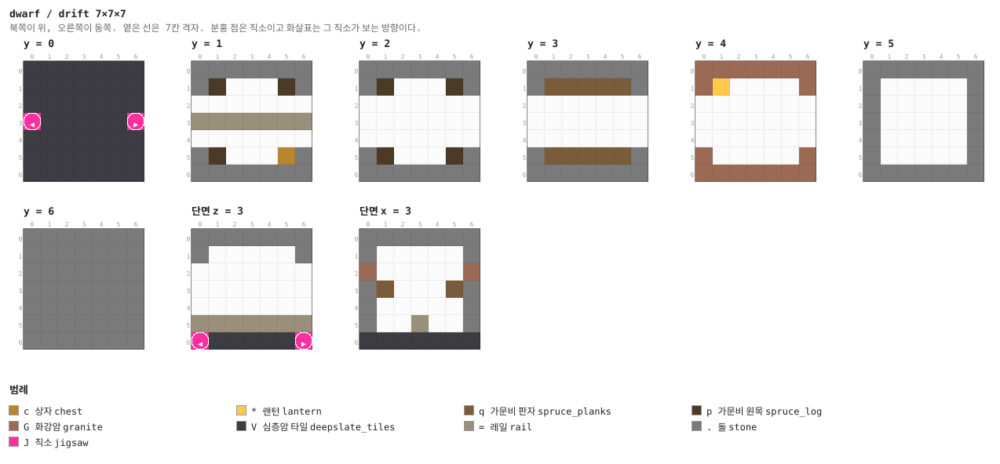

<details><summary>층별 지도 (텍스트)</summary>

```
y = 0   x →동, z ↓남
  VVVVVVV
  VVVVVVV
  VVVVVVV
  JVVVVVJ
  VVVVVVV
  VVVVVVV
  VVVVVVV
y = 1   x →동, z ↓남
  .......
  .p...p.
  .......
  =======
  .......
  .p...c.
  .......
y = 2   x →동, z ↓남
  .......
  .p...p.
  .......
  .......
  .......
  .p...p.
  .......
y = 3   x →동, z ↓남
  .......
  .qqqqq.
  .......
  .......
  .......
  .qqqqq.
  .......
y = 4   x →동, z ↓남
  GGGGGGG
  G*....G
  .......
  .......
  .......
  G.....G
  GGGGGGG
y = 5   x →동, z ↓남
  .......
  .......
  .......
  .......
  .......
  .......
  .......
y = 6   x →동, z ↓남
  .......
  .......
  .......
  .......
  .......
  .......
  .......
```

</details>


### `vein` — 7×7×7 — 1×1×1 셀

광맥. 칸이 돌로 메워져 있고 짧은 굴만 뚫려 있어서, 더 들어가려면 **곡괭이를 써야 한다** —
몹이 대신 해 줄 수 없는 유일한 상호작용이다 (§12).

**어느 풀에 있나** — `halls` (가중치 5)

| 직소 위치 | 향 | name | target | pool |
|---|---|---|---|---|
| (0, 0, 3) | ◀ 서 | `dwf_hall` | `dwf_hall` | `dwarf/halls` |

**뚫린 면** — 서: z 2–4, y 1–4 (12칸)

**블록** — 돌 202, 심층암 타일 48, 화강암 21, 철광석 16, 석탄 광석 7, 직소 1, 랜턴 1, 상자 1

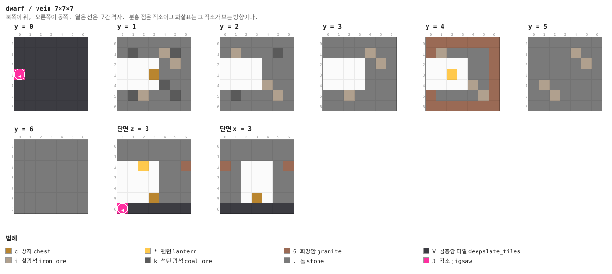

<details><summary>층별 지도 (텍스트)</summary>

```
y = 0   x →동, z ↓남
  VVVVVVV
  VVVVVVV
  VVVVVVV
  JVVVVVV
  VVVVVVV
  VVVVVVV
  VVVVVVV
y = 1   x →동, z ↓남
  .......
  .k..ik.
  .....i.
  ...c...
  ....k..
  .ki..k.
  .......
y = 2   x →동, z ↓남
  .......
  .i...k.
  .......
  .......
  ....i..
  .k...i.
  .......
y = 3   x →동, z ↓남
  .......
  ....i..
  .....i.
  .......
  .......
  ..i....
  .......
y = 4   x →동, z ↓남
  GGGGGGG
  Gi....G
  ......G
  ..*...G
  ....i.G
  G....iG
  GGGGGGG
y = 5   x →동, z ↓남
  .......
  ....i..
  .....i.
  .......
  .i.....
  ..i....
  .......
y = 6   x →동, z ↓남
  .......
  .......
  .......
  .......
  .......
  .......
  .......
```

</details>


### `store` — 7×7×7 — 1×1×1 셀

창고. 통 둘, 상자 둘, 용암 가마솥.

**어느 풀에 있나** — `halls` (가중치 5)

| 직소 위치 | 향 | name | target | pool |
|---|---|---|---|---|
| (0, 0, 3) | ◀ 서 | `dwf_hall` | `dwf_hall` | `dwarf/halls` |

**뚫린 면** — 서: z 2–4, y 1–4 (12칸)

**블록** — 돌 136, 심층암 타일 48, 화강암 21, 응회암 벽돌 5, 통 2, 상자 2, 직소 1, 용암 가마솥 1

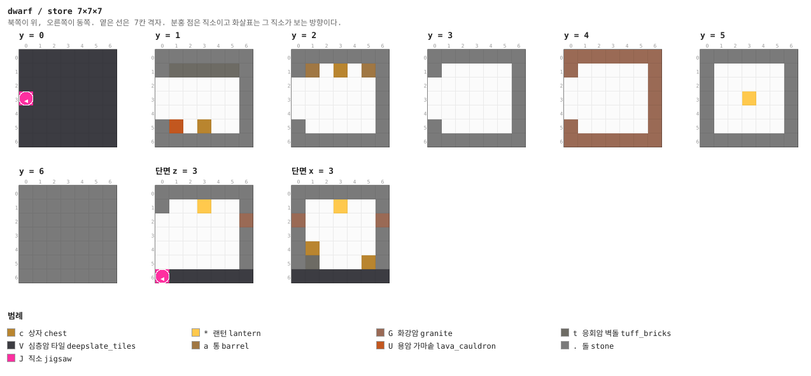

<details><summary>층별 지도 (텍스트)</summary>

```
y = 0   x →동, z ↓남
  VVVVVVV
  VVVVVVV
  VVVVVVV
  JVVVVVV
  VVVVVVV
  VVVVVVV
  VVVVVVV
y = 1   x →동, z ↓남
  .......
  .ttttt.
  .......
  .......
  .......
  .U.c...
  .......
y = 2   x →동, z ↓남
  .......
  .a.c.a.
  .......
  .......
  .......
  .......
  .......
y = 3   x →동, z ↓남
  .......
  .......
  .......
  .......
  .......
  .......
  .......
y = 4   x →동, z ↓남
  GGGGGGG
  G.....G
  ......G
  ......G
  ......G
  G.....G
  GGGGGGG
y = 5   x →동, z ↓남
  .......
  .......
  .......
  ...*...
  .......
  .......
  .......
y = 6   x →동, z ↓남
  .......
  .......
  .......
  .......
  .......
  .......
  .......
```

</details>


### `chasm` — 7×14×7 — 1×2×1 셀

용암 구렁. **두 칸 높이 조각**이고 위층이 통로, 아래가 용암이다. 다리는 문에서 3폭,
가운데서 1폭이다. 문과 직소는 위층 바닥 켜(y=7)에 있어서 평평한 미로와 그대로 이어진다.

**어느 풀에 있나** — `halls` (가중치 5)

| 직소 위치 | 향 | name | target | pool |
|---|---|---|---|---|
| (0, 7, 3) | ◀ 서 | `dwf_hall` | `dwf_hall` | `dwarf/halls` |
| (6, 7, 3) | ▶ 동 | `dwf_hall` | `dwf_hall` | `dwarf/halls` |

**뚫린 면** — 서: z 2–4, y 8–11 (12칸) / 동: z 2–4, y 8–11 (12칸)

**블록** — 돌 223, 화강암 115, 심층암 타일 31, 용암 25, 쇠사슬 8, 직소 2, 랜턴 1

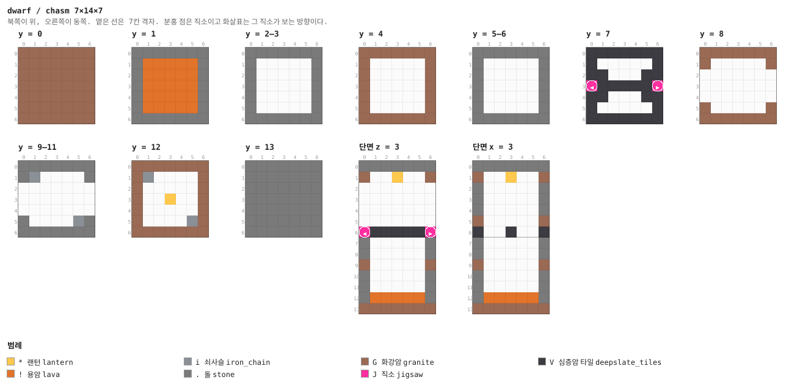

<details><summary>층별 지도 (텍스트)</summary>

```
y = 0   x →동, z ↓남
  GGGGGGG
  GGGGGGG
  GGGGGGG
  GGGGGGG
  GGGGGGG
  GGGGGGG
  GGGGGGG
y = 1   x →동, z ↓남
  .......
  .!!!!!.
  .!!!!!.
  .!!!!!.
  .!!!!!.
  .!!!!!.
  .......
y = 2–3   x →동, z ↓남
  .......
  .......
  .......
  .......
  .......
  .......
  .......
y = 4   x →동, z ↓남
  GGGGGGG
  G.....G
  G.....G
  G.....G
  G.....G
  G.....G
  GGGGGGG
y = 5–6   x →동, z ↓남
  .......
  .......
  .......
  .......
  .......
  .......
  .......
y = 7   x →동, z ↓남
  VVVVVVV
  V.....V
  VV...VV
  JVVVVVJ
  VV...VV
  V.....V
  VVVVVVV
y = 8   x →동, z ↓남
  GGGGGGG
  G.....G
  .......
  .......
  .......
  G.....G
  GGGGGGG
y = 9–11   x →동, z ↓남
  .......
  .i.....
  .......
  .......
  .......
  .....i.
  .......
y = 12   x →동, z ↓남
  GGGGGGG
  Gi....G
  G.....G
  G..*..G
  G.....G
  G....iG
  GGGGGGG
y = 13   x →동, z ↓남
  .......
  .......
  .......
  .......
  .......
  .......
  .......
```

</details>

<details><summary>세로 단면 (텍스트)</summary>

```
단면 z = 3   x →동, y ↑하늘
  .......
  G..*..G
  .......
  .......
  .......
  .......
  JVVVVVJ
  .......
  .......
  G.....G
  .......
  .......
  .!!!!!.
  GGGGGGG
단면 x = 3   z →남, y ↑하늘
  .......
  G..*..G
  .......
  .......
  .......
  G.....G
  V..V..V
  .......
  .......
  G.....G
  .......
  .......
  .!!!!!.
  GGGGGGG
```

</details>


### `cap` — 1×7×7

두께 1의 돌 마개. 전당 풀의 fallback (§4).

**어느 풀에 있나** — `hall_caps` (가중치 1)

| 직소 위치 | 향 | name | target | pool |
|---|---|---|---|---|
| (0, 0, 3) | ◀ 서 | `dwf_hall` | `dwf_hall` | `dwarf/hall_caps` |

**블록** — 돌 35, 화강암 13, 직소 1

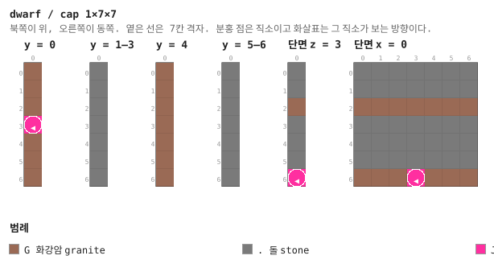

<details><summary>층별 지도 (텍스트)</summary>

```
y = 0   x →동, z ↓남
  G
  G
  G
  J
  G
  G
  G
y = 1–3   x →동, z ↓남
  .
  .
  .
  .
  .
  .
  .
y = 4   x →동, z ↓남
  G
  G
  G
  G
  G
  G
  G
y = 5–6   x →동, z ↓남
  .
  .
  .
  .
  .
  .
  .
```

</details>


### `approach_1` — 7×7×7 — 1×1×1 셀

보스 통로. 셋이 사슬로 이어져 있어서 왕의 홀은 허브에서 최소 세 칸 뒤에 놓인다 (§7).
서쪽 직소만 `dwf_king` 이름이라 사슬이 거꾸로 붙지 않는다.

**어느 풀에 있나** — `king_approach_1` (가중치 1)

| 직소 위치 | 향 | name | target | pool |
|---|---|---|---|---|
| (3, 0, 0) | ▲ 북 | `dwf_hall` | `dwf_hall` | `dwarf/halls` |
| (0, 0, 3) | ◀ 서 | `dwf_king` | `dwf_hall` | `dwarf/halls` |
| (6, 0, 3) | ▶ 동 | `dwf_hall` | `dwf_king` | `dwarf/king_approach_2` |

**뚫린 면** — 서: z 2–4, y 1–4 (12칸) / 동: z 2–4, y 1–4 (12칸) / 북: x 2–4, y 1–4 (12칸)

**블록** — 돌 118, 심층암 타일 46, 화강암 15, 직소 3, 윤나는 심층암 1, 랜턴 1

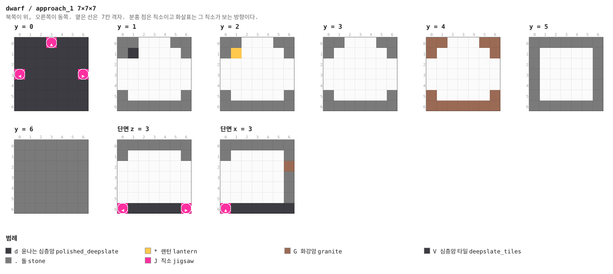

<details><summary>층별 지도 (텍스트)</summary>

```
y = 0   x →동, z ↓남
  VVVJVVV
  VVVVVVV
  VVVVVVV
  JVVVVVJ
  VVVVVVV
  VVVVVVV
  VVVVVVV
y = 1   x →동, z ↓남
  .......
  .d.....
  .......
  .......
  .......
  .......
  .......
y = 2   x →동, z ↓남
  .......
  .*.....
  .......
  .......
  .......
  .......
  .......
y = 3   x →동, z ↓남
  .......
  .......
  .......
  .......
  .......
  .......
  .......
y = 4   x →동, z ↓남
  GG...GG
  G.....G
  .......
  .......
  .......
  G.....G
  GGGGGGG
y = 5   x →동, z ↓남
  .......
  .......
  .......
  .......
  .......
  .......
  .......
y = 6   x →동, z ↓남
  .......
  .......
  .......
  .......
  .......
  .......
  .......
```

</details>


### `forge_hall` — 21×14×21 — 3×2×3 셀

대장장이 왕의 홀. 21×14×21. 기둥 넷, 벽을 따라 용광로 여섯, 남쪽에 응회암 테두리를 두른
용암 홈, 가운데 단상에 **왕의 트라이얼 스포너**, 네 구석에 대장장이(허스크가 아니라 곡괭이
든 좀비 광부 + 브리즈) 스포너 넷.

왕은 다이아 도끼(날카로움 III·화염 II)와 방패를 들고, 체력 110이다. 잡으면 곡괭이 또는
도끼 하나와 장식 템플릿 둘이 확정으로 나온다.

**어느 풀에 있나** — `king_approach` (가중치 1)

| 직소 위치 | 향 | name | target | pool |
|---|---|---|---|---|
| (0, 0, 10) | ◀ 서 | `dwf_king` | `dwf_hall` | `—` |

**뚫린 면** — 서: z 9–11, y 1–4 (12칸)

**블록** — 돌 1152, 심층암 타일 440, 화강암 237, 윤나는 심층암 164, 응회암 벽돌 64, 조각한 심층암 48, 용암 18, 용광로 6

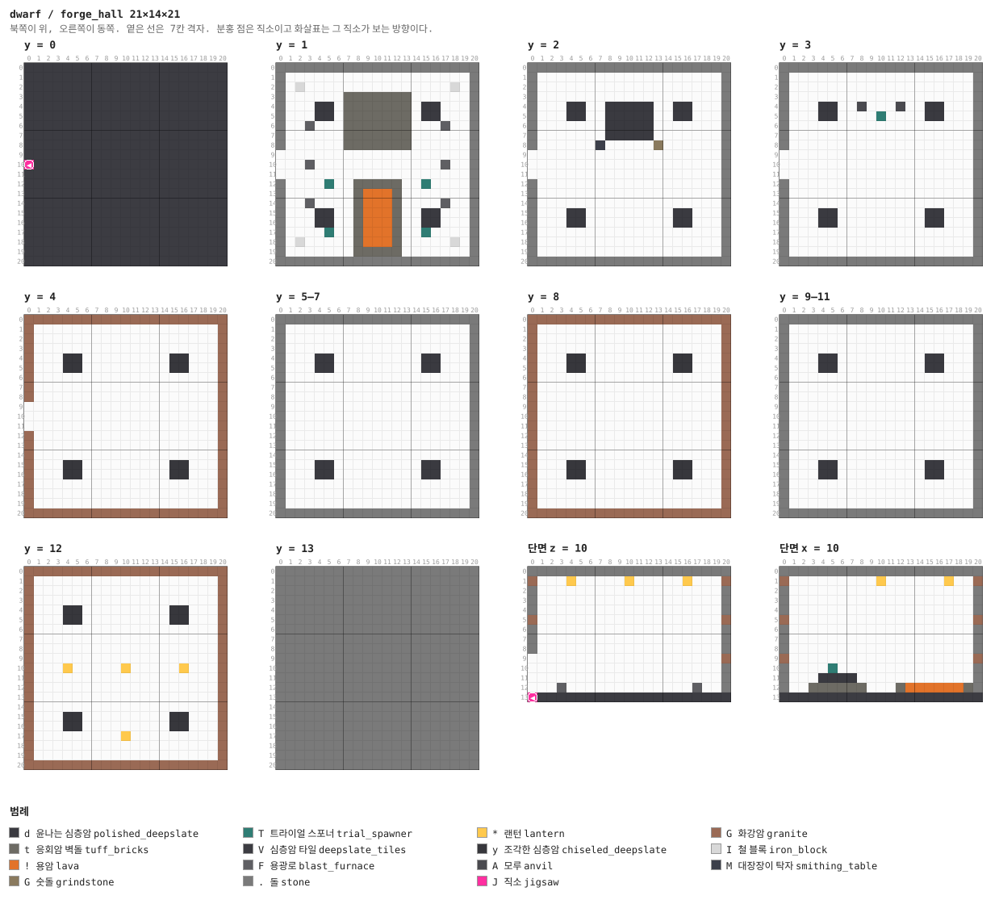

<details><summary>층별 지도 (텍스트)</summary>

```
y = 0   x →동, z ↓남
  VVVVVVVVVVVVVVVVVVVVV
  VVVVVVVVVVVVVVVVVVVVV
  VVVVVVVVVVVVVVVVVVVVV
  VVVVVVVVVVVVVVVVVVVVV
  VVVVVVVVVVVVVVVVVVVVV
  VVVVVVVVVVVVVVVVVVVVV
  VVVVVVVVVVVVVVVVVVVVV
  VVVVVVVVVVVVVVVVVVVVV
  VVVVVVVVVVVVVVVVVVVVV
  VVVVVVVVVVVVVVVVVVVVV
  JVVVVVVVVVVVVVVVVVVVV
  VVVVVVVVVVVVVVVVVVVVV
  VVVVVVVVVVVVVVVVVVVVV
  VVVVVVVVVVVVVVVVVVVVV
  VVVVVVVVVVVVVVVVVVVVV
  VVVVVVVVVVVVVVVVVVVVV
  VVVVVVVVVVVVVVVVVVVVV
  VVVVVVVVVVVVVVVVVVVVV
  VVVVVVVVVVVVVVVVVVVVV
  VVVVVVVVVVVVVVVVVVVVV
  VVVVVVVVVVVVVVVVVVVVV
y = 1   x →동, z ↓남
  .....................
  .....................
  ..I...............I..
  .......ttttttt.......
  ....dd.ttttttt.dd....
  ....dd.ttttttt.dd....
  ...F...ttttttt...F...
  .......ttttttt.......
  .......ttttttt.......
  .....................
  ...F.............F...
  .....................
  .....T..ttttt..T.....
  ........t!!!t........
  ...F....t!!!t....F...
  ....dd..t!!!t..dd....
  ....dd..t!!!t..dd....
  .....T..t!!!t..T.....
  ..I.....t!!!t.....I..
  ........ttttt........
  .....................
y = 2   x →동, z ↓남
  .....................
  .....................
  .....................
  .....................
  ....dd..ddddd..dd....
  ....dd..ddddd..dd....
  ........ddddd........
  ........ddddd........
  .......M.....G.......
  .....................
  .....................
  .....................
  .....................
  .....................
  .....................
  ....dd.........dd....
  ....dd.........dd....
  .....................
  .....................
  .....................
  .....................
y = 3   x →동, z ↓남
  .....................
  .....................
  .....................
  .....................
  ....dd..A...A..dd....
  ....dd....T....dd....
  .....................
  .....................
  .....................
  .....................
  .....................
  .....................
  .....................
  .....................
  .....................
  ....dd.........dd....
  ....dd.........dd....
  .....................
  .....................
  .....................
  .....................
y = 4   x →동, z ↓남
  GGGGGGGGGGGGGGGGGGGGG
  G...................G
  G...................G
  G...................G
  G...yy.........yy...G
  G...yy.........yy...G
  G...................G
  G...................G
  G...................G
  ....................G
  ....................G
  ....................G
  G...................G
  G...................G
  G...................G
  G...yy.........yy...G
  G...yy.........yy...G
  G...................G
  G...................G
  G...................G
  GGGGGGGGGGGGGGGGGGGGG
y = 5–7   x →동, z ↓남
  .....................
  .....................
  .....................
  .....................
  ....dd.........dd....
  ....dd.........dd....
  .....................
  .....................
  .....................
  .....................
  .....................
  .....................
  .....................
  .....................
  .....................
  ....dd.........dd....
  ....dd.........dd....
  .....................
  .....................
  .....................
  .....................
y = 8   x →동, z ↓남
  GGGGGGGGGGGGGGGGGGGGG
  G...................G
  G...................G
  G...................G
  G...yy.........yy...G
  G...yy.........yy...G
  G...................G
  G...................G
  G...................G
  G...................G
  G...................G
  G...................G
  G...................G
  G...................G
  G...................G
  G...yy.........yy...G
  G...yy.........yy...G
  G...................G
  G...................G
  G...................G
  GGGGGGGGGGGGGGGGGGGGG
y = 9–11   x →동, z ↓남
  .....................
  .....................
  .....................
  .....................
  ....dd.........dd....
  ....dd.........dd....
  .....................
  .....................
  .....................
  .....................
  .....................
  .....................
  .....................
  .....................
  .....................
  ....dd.........dd....
  ....dd.........dd....
  .....................
  .....................
  .....................
  .....................
y = 12   x →동, z ↓남
  GGGGGGGGGGGGGGGGGGGGG
  G...................G
  G...................G
  G...................G
  G...yy.........yy...G
  G...yy.........yy...G
  G...................G
  G...................G
  G...................G
  G...................G
  G...*.....*.....*...G
  G...................G
  G...................G
  G...................G
  G...................G
  G...yy.........yy...G
  G...yy.........yy...G
  G.........*.........G
  G...................G
  G...................G
  GGGGGGGGGGGGGGGGGGGGG
y = 13   x →동, z ↓남
  .....................
  .....................
  .....................
  .....................
  .....................
  .....................
  .....................
  .....................
  .....................
  .....................
  .....................
  .....................
  .....................
  .....................
  .....................
  .....................
  .....................
  .....................
  .....................
  .....................
  .....................
```

</details>

<details><summary>세로 단면 (텍스트)</summary>

```
단면 z = 10   x →동, y ↑하늘
  .....................
  G...*.....*.....*...G
  .....................
  .....................
  .....................
  G...................G
  .....................
  .....................
  .....................
  ....................G
  .....................
  .....................
  ...F.............F...
  JVVVVVVVVVVVVVVVVVVVV
단면 x = 10   z →남, y ↑하늘
  .....................
  G.........*......*..G
  .....................
  .....................
  .....................
  G...................G
  .....................
  .....................
  .....................
  G...................G
  .....T...............
  ....dddd.............
  ...tttttt...t!!!!!!t.
  VVVVVVVVVVVVVVVVVVVVV
```

</details>


### `approach_2` — 7×7×7 — 1×1×1 셀

**어느 풀에 있나** — `king_approach_2` (가중치 1)

| 직소 위치 | 향 | name | target | pool |
|---|---|---|---|---|
| (3, 0, 0) | ▲ 북 | `dwf_hall` | `dwf_hall` | `dwarf/halls` |
| (0, 0, 3) | ◀ 서 | `dwf_king` | `dwf_hall` | `dwarf/halls` |
| (6, 0, 3) | ▶ 동 | `dwf_hall` | `dwf_king` | `dwarf/king_approach_3` |

**뚫린 면** — 서: z 2–4, y 1–4 (12칸) / 동: z 2–4, y 1–4 (12칸) / 북: x 2–4, y 1–4 (12칸)

**블록** — 돌 118, 심층암 타일 46, 화강암 15, 직소 3, 윤나는 심층암 1, 랜턴 1


<details><summary>층별 지도 (텍스트)</summary>

```
y = 0   x →동, z ↓남
  VVVJVVV
  VVVVVVV
  VVVVVVV
  JVVVVVJ
  VVVVVVV
  VVVVVVV
  VVVVVVV
y = 1   x →동, z ↓남
  .......
  .d.....
  .......
  .......
  .......
  .......
  .......
y = 2   x →동, z ↓남
  .......
  .*.....
  .......
  .......
  .......
  .......
  .......
y = 3   x →동, z ↓남
  .......
  .......
  .......
  .......
  .......
  .......
  .......
y = 4   x →동, z ↓남
  GG...GG
  G.....G
  .......
  .......
  .......
  G.....G
  GGGGGGG
y = 5   x →동, z ↓남
  .......
  .......
  .......
  .......
  .......
  .......
  .......
y = 6   x →동, z ↓남
  .......
  .......
  .......
  .......
  .......
  .......
  .......
```

</details>


### `approach_3` — 7×7×7 — 1×1×1 셀

**어느 풀에 있나** — `king_approach` (가중치 1), `king_approach_3` (가중치 1)

| 직소 위치 | 향 | name | target | pool |
|---|---|---|---|---|
| (3, 0, 0) | ▲ 북 | `dwf_hall` | `dwf_hall` | `dwarf/halls` |
| (0, 0, 3) | ◀ 서 | `dwf_king` | `dwf_hall` | `dwarf/halls` |
| (6, 0, 3) | ▶ 동 | `dwf_hall` | `dwf_king` | `dwarf/king_approach` |

**뚫린 면** — 서: z 2–4, y 1–4 (12칸) / 동: z 2–4, y 1–4 (12칸) / 북: x 2–4, y 1–4 (12칸)

**블록** — 돌 118, 심층암 타일 46, 화강암 15, 직소 3, 윤나는 심층암 1, 랜턴 1


<details><summary>층별 지도 (텍스트)</summary>

```
y = 0   x →동, z ↓남
  VVVJVVV
  VVVVVVV
  VVVVVVV
  JVVVVVJ
  VVVVVVV
  VVVVVVV
  VVVVVVV
y = 1   x →동, z ↓남
  .......
  .d.....
  .......
  .......
  .......
  .......
  .......
y = 2   x →동, z ↓남
  .......
  .*.....
  .......
  .......
  .......
  .......
  .......
y = 3   x →동, z ↓남
  .......
  .......
  .......
  .......
  .......
  .......
  .......
y = 4   x →동, z ↓남
  GG...GG
  G.....G
  .......
  .......
  .......
  G.....G
  GGGGGGG
y = 5   x →동, z ↓남
  .......
  .......
  .......
  .......
  .......
  .......
  .......
y = 6   x →동, z ↓남
  .......
  .......
  .......
  .......
  .......
  .......
  .......
```

</details>


## 다듬을 곳

- **문간이 네모나다.** 콘셉트는 "절벽에 뚫린 거대한 문"이었는데, 절벽을 찾을 방법이 없어서
  지표에 서는 문간이 됐다. 구조물 블록 한계(48) 안이라 §16대로 사람이 다시 지어도 된다
- **광차가 굴러가지 않는다.** 레일은 장식이다. 엔티티는 조각에 저장하지 않으므로
  (`Piece.write`가 entities를 비운다) 광차를 놓으려면 다른 길이 필요하다
- **층이 하나다.** 계단을 뺐으므로 전당은 전부 같은 높이다. 위아래로 갈리는 구조를 넣고
  싶으면 §5.1처럼 한 방향만 뚫는 조각이 필요하다
