# 레벨 설계 — 불꽃 요새

> 이 문서는 `python tools/gen_level_doc.py fort`가 만든다. 조각을 고치면 다시 돌린다. 그림과 표는 게임이 읽는 파일(`structure/fort/*.nbt`, `worldgen/**`)에서 그대로 읽어 온 것이라 모드와 어긋날 수 없다. 설명 문장만 사람이 쓴다 (`tools/gen_level_doc.py`의 `INTRO`·`NOTES`).

## 1. 한눈에

네더의 대규모 던전이다. 바위 속 홀 하나에서 복도가 사방으로 뻗고, 통로 셋 뒤에 **화염의 군주**가 있다.

지표가 없으므로 입구도 사다리도 없다 — y 38~78 어딘가에 떨어진 시작 홀이 곧 입구다.

바이옴: nether_wastes · basalt_deltas · spacing 32 / separation 10

| 항목 | 값 |
|---|---|
| 생성 단계 | `underground_structures` |
| 바이옴 | `#sydungeon:has_structure/fort` |
| 간격 / 최소거리 | spacing 32 / separation 10 |
| 직소 깊이 | 12 ~ 18 (`sydungeon:ranged_jigsaw`) |
| 시작 풀 | `start` |
| 조각 / 풀 | 13개 / 7개 |

## 2. 조립 원리

### 네더에는 지표가 없다

`WORLD_SURFACE_WG`는 네더에서 **기반암 천장까지** 잰다. 거기에 시작 조각을 투영하면 던전이
천장에 매달린다. 바닐라 잔해(bastion)가 하는 유일한 방법이 답이다 — **`start_height`를 범위로
주고 heightmap을 아예 쓰지 않는다.** 시작 조각이 y 38~78 어딘가의 바위에 떨어지고, 조각들이
자기 방을 파낸다. 네더락 속에 묻힌 요새란 원래 그런 것이다.

### 하나의 기계, 셋의 껍질

`tools/generate_nether.py`의 `SKINS` 표가 재질·바이옴·몹·보스·간격만 말한다 (§35와 같은 수법).
모양은 한 번만 쓰여 있다: 시작 홀 하나(21³), 복도 일곱 종, 마개, 보스 사슬 셋, 보스 홀
21×14×21.

### 기존 구조물을 비껴 선다

네더에는 이미 요새와 잔해가 있다. 바닐라가 그 둘을 `minecraft:nether_complexes` 한 세트에
묶어 둔 이유가 이것이고, 우리 셋은 전부 그 세트에 **`exclusion_zone` 8청크**를 건다
(`docs/concepts.md` §5의 요구).

### 용암은 다섯 면이 막혀 있다

§28. `span`의 수로도, `forge`의 홈도, 보스 홀의 도랑도 전부 **바닥 켜 한 칸 위**에 테두리
안쪽으로 놓인다. 첫 판은 보스 홀의 도랑을 조각 바닥면에 깔았고, 검사기가 잡았다 — 그대로
뒀으면 월드가 사는 동안 아래로 흘러내렸을 것이다.

## 3. 풀 배선

풀이 어떤 조각을 내놓는지(실선, 숫자는 가중치)와 그 조각의 직소가 다시 어떤 풀을 부르는지(점선)다. 직소 생성은 이 그래프를 깊이만큼 따라간다.

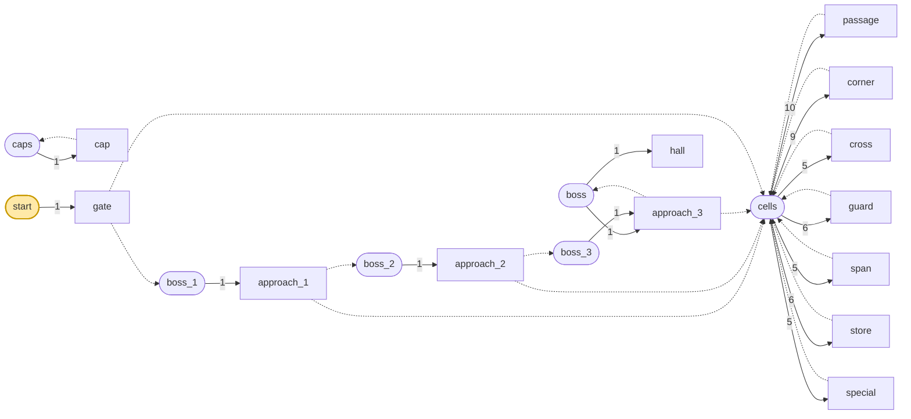

| 풀 | fallback | 원소 (가중치) |
|---|---|---|
| `boss` | `caps` | `hall` 1, `approach_3` 1 |
| `boss_1` | `caps` | `approach_1` 1 |
| `boss_2` | `caps` | `approach_2` 1 |
| `boss_3` | `caps` | `approach_3` 1 |
| `caps` | `minecraft:empty` | `cap` 1 |
| `cells` | `caps` | `passage` 10, `corner` 9, `cross` 5, `guard` 6, `span` 5, `store` 6, `special` 5 |
| `start` | `minecraft:empty` | `gate` 1 |

## 4. 뼈대 — 반드시 이렇게 놓이는 부분

시작 홀과 그 남문이 부르는 보스 사슬. 복도는 판마다 다르다.

| 조각 | 놓이는 자리 (시작 조각 기준) | 누가 놓나 |
|---|---|---|
| `gate` | (0, 0, 0) | 시작 풀 |
| `approach_1` | (7, 0, 21) | gate의 남 fort_door 직소 |
| `approach_2` | (14, 0, 21) | approach_1의 동 fort_door 직소 |
| `approach_3` | (21, 0, 21) | approach_2의 동 fort_door 직소 |

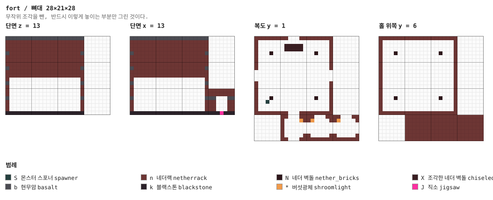

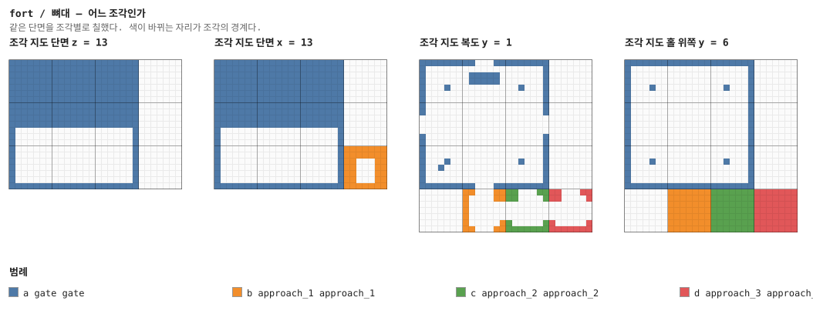

## 5. 조각


그림은 조각 하나를 **층마다 한 장씩** 블록 단위로 그린 것이다. 같은 층이 이어지면 `y = 2–5`처럼 묶었고, 마지막 두 장은 가운데를 자른 세로 단면이다. 분홍 점이 직소, 화살표가 그 직소가 보는 방향이다 — **마주 본 직소끼리만 붙는다.**

### `gate` — 21×21×21 — 3×3×3 셀

시작 조각. 21×21×21 홀이고 열 칸 높이다. 서·동·북문이 복도로 가고 **남문이 보스 사슬**을
부른다 — 지표가 없으니 이 방이 곧 입구다.

**어느 풀에 있나** — `start` (가중치 1)

| 직소 위치 | 향 | name | target | pool |
|---|---|---|---|---|
| (10, 0, 0) | ▲ 북 | `fort_door` | `fort_door` | `fort/cells` |
| (0, 0, 10) | ◀ 서 | `fort_door` | `fort_door` | `fort/cells` |
| (20, 0, 10) | ▶ 동 | `fort_door` | `fort_door` | `fort/cells` |
| (10, 0, 20) | ▼ 남 | `fort_door` | `fort_boss` | `fort/boss_1` |

**뚫린 면** — 서: z 9–11, y 1–4 (12칸) / 동: z 9–11, y 1–4 (12칸) / 북: x 9–11, y 1–4 (12칸) / 남: x 9–11, y 1–4 (12칸)

**블록** — 네더랙 4774, 현무암 749, 블랙스톤 437, 네더 벽돌 24, 조각한 네더 벽돌 18, 버섯광체 6, 직소 4, 몬스터 스포너 1

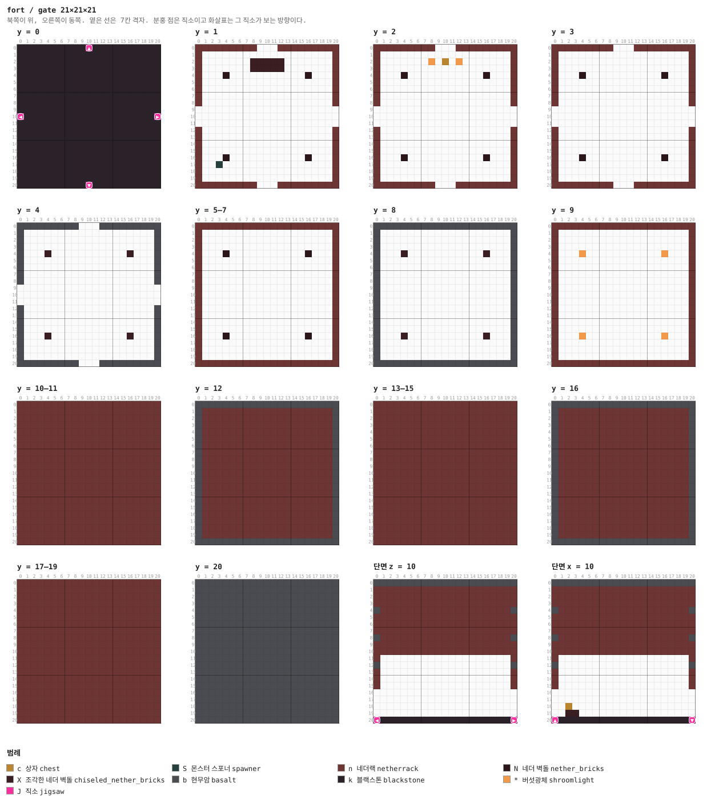

<details><summary>층별 지도 (텍스트)</summary>

```
y = 0   x →동, z ↓남
  kkkkkkkkkkJkkkkkkkkkk
  kkkkkkkkkkkkkkkkkkkkk
  kkkkkkkkkkkkkkkkkkkkk
  kkkkkkkkkkkkkkkkkkkkk
  kkkkkkkkkkkkkkkkkkkkk
  kkkkkkkkkkkkkkkkkkkkk
  kkkkkkkkkkkkkkkkkkkkk
  kkkkkkkkkkkkkkkkkkkkk
  kkkkkkkkkkkkkkkkkkkkk
  kkkkkkkkkkkkkkkkkkkkk
  JkkkkkkkkkkkkkkkkkkkJ
  kkkkkkkkkkkkkkkkkkkkk
  kkkkkkkkkkkkkkkkkkkkk
  kkkkkkkkkkkkkkkkkkkkk
  kkkkkkkkkkkkkkkkkkkkk
  kkkkkkkkkkkkkkkkkkkkk
  kkkkkkkkkkkkkkkkkkkkk
  kkkkkkkkkkkkkkkkkkkkk
  kkkkkkkkkkkkkkkkkkkkk
  kkkkkkkkkkkkkkkkkkkkk
  kkkkkkkkkkJkkkkkkkkkk
y = 1   x →동, z ↓남
  nnnnnnnnn...nnnnnnnnn
  n...................n
  n.......XXXXX.......n
  n.......XXXXX.......n
  n...N...........N...n
  n...................n
  n...................n
  n...................n
  n...................n
  .....................
  .....................
  .....................
  n...................n
  n...................n
  n...................n
  n...................n
  n...N...........N...n
  n..S................n
  n...................n
  n...................n
  nnnnnnnnn...nnnnnnnnn
y = 2   x →동, z ↓남
  nnnnnnnnn...nnnnnnnnn
  n...................n
  n.......*.c.*.......n
  n...................n
  n...N...........N...n
  n...................n
  n...................n
  n...................n
  n...................n
  .....................
  .....................
  .....................
  n...................n
  n...................n
  n...................n
  n...................n
  n...N...........N...n
  n...................n
  n...................n
  n...................n
  nnnnnnnnn...nnnnnnnnn
y = 3   x →동, z ↓남
  nnnnnnnnn...nnnnnnnnn
  n...................n
  n...................n
  n...................n
  n...N...........N...n
  n...................n
  n...................n
  n...................n
  n...................n
  .....................
  .....................
  .....................
  n...................n
  n...................n
  n...................n
  n...................n
  n...N...........N...n
  n...................n
  n...................n
  n...................n
  nnnnnnnnn...nnnnnnnnn
y = 4   x →동, z ↓남
  bbbbbbbbb...bbbbbbbbb
  b...................b
  b...................b
  b...................b
  b...X...........X...b
  b...................b
  b...................b
  b...................b
  b...................b
  .....................
  .....................
  .....................
  b...................b
  b...................b
  b...................b
  b...................b
  b...X...........X...b
  b...................b
  b...................b
  b...................b
  bbbbbbbbb...bbbbbbbbb
y = 5–7   x →동, z ↓남
  nnnnnnnnnnnnnnnnnnnnn
  n...................n
  n...................n
  n...................n
  n...N...........N...n
  n...................n
  n...................n
  n...................n
  n...................n
  n...................n
  n...................n
  n...................n
  n...................n
  n...................n
  n...................n
  n...................n
  n...N...........N...n
  n...................n
  n...................n
  n...................n
  nnnnnnnnnnnnnnnnnnnnn
y = 8   x →동, z ↓남
  bbbbbbbbbbbbbbbbbbbbb
  b...................b
  b...................b
  b...................b
  b...X...........X...b
  b...................b
  b...................b
  b...................b
  b...................b
  b...................b
  b...................b
  b...................b
  b...................b
  b...................b
  b...................b
  b...................b
  b...X...........X...b
  b...................b
  b...................b
  b...................b
  bbbbbbbbbbbbbbbbbbbbb
y = 9   x →동, z ↓남
  nnnnnnnnnnnnnnnnnnnnn
  n...................n
  n...................n
  n...................n
  n...*...........*...n
  n...................n
  n...................n
  n...................n
  n...................n
  n...................n
  n...................n
  n...................n
  n...................n
  n...................n
  n...................n
  n...................n
  n...*...........*...n
  n...................n
  n...................n
  n...................n
  nnnnnnnnnnnnnnnnnnnnn
y = 10–11   x →동, z ↓남
  nnnnnnnnnnnnnnnnnnnnn
  nnnnnnnnnnnnnnnnnnnnn
  nnnnnnnnnnnnnnnnnnnnn
  nnnnnnnnnnnnnnnnnnnnn
  nnnnnnnnnnnnnnnnnnnnn
  nnnnnnnnnnnnnnnnnnnnn
  nnnnnnnnnnnnnnnnnnnnn
  nnnnnnnnnnnnnnnnnnnnn
  nnnnnnnnnnnnnnnnnnnnn
  nnnnnnnnnnnnnnnnnnnnn
  nnnnnnnnnnnnnnnnnnnnn
  nnnnnnnnnnnnnnnnnnnnn
  nnnnnnnnnnnnnnnnnnnnn
  nnnnnnnnnnnnnnnnnnnnn
  nnnnnnnnnnnnnnnnnnnnn
  nnnnnnnnnnnnnnnnnnnnn
  nnnnnnnnnnnnnnnnnnnnn
  nnnnnnnnnnnnnnnnnnnnn
  nnnnnnnnnnnnnnnnnnnnn
  nnnnnnnnnnnnnnnnnnnnn
  nnnnnnnnnnnnnnnnnnnnn
y = 12   x →동, z ↓남
  bbbbbbbbbbbbbbbbbbbbb
  bnnnnnnnnnnnnnnnnnnnb
  bnnnnnnnnnnnnnnnnnnnb
  bnnnnnnnnnnnnnnnnnnnb
  bnnnnnnnnnnnnnnnnnnnb
  bnnnnnnnnnnnnnnnnnnnb
  bnnnnnnnnnnnnnnnnnnnb
  bnnnnnnnnnnnnnnnnnnnb
  bnnnnnnnnnnnnnnnnnnnb
  bnnnnnnnnnnnnnnnnnnnb
  bnnnnnnnnnnnnnnnnnnnb
  bnnnnnnnnnnnnnnnnnnnb
  bnnnnnnnnnnnnnnnnnnnb
  bnnnnnnnnnnnnnnnnnnnb
  bnnnnnnnnnnnnnnnnnnnb
  bnnnnnnnnnnnnnnnnnnnb
  bnnnnnnnnnnnnnnnnnnnb
  bnnnnnnnnnnnnnnnnnnnb
  bnnnnnnnnnnnnnnnnnnnb
  bnnnnnnnnnnnnnnnnnnnb
  bbbbbbbbbbbbbbbbbbbbb
y = 13–15   x →동, z ↓남
  nnnnnnnnnnnnnnnnnnnnn
  nnnnnnnnnnnnnnnnnnnnn
  nnnnnnnnnnnnnnnnnnnnn
  nnnnnnnnnnnnnnnnnnnnn
  nnnnnnnnnnnnnnnnnnnnn
  nnnnnnnnnnnnnnnnnnnnn
  nnnnnnnnnnnnnnnnnnnnn
  nnnnnnnnnnnnnnnnnnnnn
  nnnnnnnnnnnnnnnnnnnnn
  nnnnnnnnnnnnnnnnnnnnn
  nnnnnnnnnnnnnnnnnnnnn
  nnnnnnnnnnnnnnnnnnnnn
  nnnnnnnnnnnnnnnnnnnnn
  nnnnnnnnnnnnnnnnnnnnn
  nnnnnnnnnnnnnnnnnnnnn
  nnnnnnnnnnnnnnnnnnnnn
  nnnnnnnnnnnnnnnnnnnnn
  nnnnnnnnnnnnnnnnnnnnn
  nnnnnnnnnnnnnnnnnnnnn
  nnnnnnnnnnnnnnnnnnnnn
  nnnnnnnnnnnnnnnnnnnnn
y = 16   x →동, z ↓남
  bbbbbbbbbbbbbbbbbbbbb
  bnnnnnnnnnnnnnnnnnnnb
  bnnnnnnnnnnnnnnnnnnnb
  bnnnnnnnnnnnnnnnnnnnb
  bnnnnnnnnnnnnnnnnnnnb
  bnnnnnnnnnnnnnnnnnnnb
  bnnnnnnnnnnnnnnnnnnnb
  bnnnnnnnnnnnnnnnnnnnb
  bnnnnnnnnnnnnnnnnnnnb
  bnnnnnnnnnnnnnnnnnnnb
  bnnnnnnnnnnnnnnnnnnnb
  bnnnnnnnnnnnnnnnnnnnb
  bnnnnnnnnnnnnnnnnnnnb
  bnnnnnnnnnnnnnnnnnnnb
  bnnnnnnnnnnnnnnnnnnnb
  bnnnnnnnnnnnnnnnnnnnb
  bnnnnnnnnnnnnnnnnnnnb
  bnnnnnnnnnnnnnnnnnnnb
  bnnnnnnnnnnnnnnnnnnnb
  bnnnnnnnnnnnnnnnnnnnb
  bbbbbbbbbbbbbbbbbbbbb
y = 17–19   x →동, z ↓남
  nnnnnnnnnnnnnnnnnnnnn
  nnnnnnnnnnnnnnnnnnnnn
  nnnnnnnnnnnnnnnnnnnnn
  nnnnnnnnnnnnnnnnnnnnn
  nnnnnnnnnnnnnnnnnnnnn
  nnnnnnnnnnnnnnnnnnnnn
  nnnnnnnnnnnnnnnnnnnnn
  nnnnnnnnnnnnnnnnnnnnn
  nnnnnnnnnnnnnnnnnnnnn
  nnnnnnnnnnnnnnnnnnnnn
  nnnnnnnnnnnnnnnnnnnnn
  nnnnnnnnnnnnnnnnnnnnn
  nnnnnnnnnnnnnnnnnnnnn
  nnnnnnnnnnnnnnnnnnnnn
  nnnnnnnnnnnnnnnnnnnnn
  nnnnnnnnnnnnnnnnnnnnn
  nnnnnnnnnnnnnnnnnnnnn
  nnnnnnnnnnnnnnnnnnnnn
  nnnnnnnnnnnnnnnnnnnnn
  nnnnnnnnnnnnnnnnnnnnn
  nnnnnnnnnnnnnnnnnnnnn
y = 20   x →동, z ↓남
  bbbbbbbbbbbbbbbbbbbbb
  bbbbbbbbbbbbbbbbbbbbb
  bbbbbbbbbbbbbbbbbbbbb
  bbbbbbbbbbbbbbbbbbbbb
  bbbbbbbbbbbbbbbbbbbbb
  bbbbbbbbbbbbbbbbbbbbb
  bbbbbbbbbbbbbbbbbbbbb
  bbbbbbbbbbbbbbbbbbbbb
  bbbbbbbbbbbbbbbbbbbbb
  bbbbbbbbbbbbbbbbbbbbb
  bbbbbbbbbbbbbbbbbbbbb
  bbbbbbbbbbbbbbbbbbbbb
  bbbbbbbbbbbbbbbbbbbbb
  bbbbbbbbbbbbbbbbbbbbb
  bbbbbbbbbbbbbbbbbbbbb
  bbbbbbbbbbbbbbbbbbbbb
  bbbbbbbbbbbbbbbbbbbbb
  bbbbbbbbbbbbbbbbbbbbb
  bbbbbbbbbbbbbbbbbbbbb
  bbbbbbbbbbbbbbbbbbbbb
  bbbbbbbbbbbbbbbbbbbbb
```

</details>

<details><summary>세로 단면 (텍스트)</summary>

```
단면 z = 10   x →동, y ↑하늘
  bbbbbbbbbbbbbbbbbbbbb
  nnnnnnnnnnnnnnnnnnnnn
  nnnnnnnnnnnnnnnnnnnnn
  nnnnnnnnnnnnnnnnnnnnn
  bnnnnnnnnnnnnnnnnnnnb
  nnnnnnnnnnnnnnnnnnnnn
  nnnnnnnnnnnnnnnnnnnnn
  nnnnnnnnnnnnnnnnnnnnn
  bnnnnnnnnnnnnnnnnnnnb
  nnnnnnnnnnnnnnnnnnnnn
  nnnnnnnnnnnnnnnnnnnnn
  n...................n
  b...................b
  n...................n
  n...................n
  n...................n
  .....................
  .....................
  .....................
  .....................
  JkkkkkkkkkkkkkkkkkkkJ
단면 x = 10   z →남, y ↑하늘
  bbbbbbbbbbbbbbbbbbbbb
  nnnnnnnnnnnnnnnnnnnnn
  nnnnnnnnnnnnnnnnnnnnn
  nnnnnnnnnnnnnnnnnnnnn
  bnnnnnnnnnnnnnnnnnnnb
  nnnnnnnnnnnnnnnnnnnnn
  nnnnnnnnnnnnnnnnnnnnn
  nnnnnnnnnnnnnnnnnnnnn
  bnnnnnnnnnnnnnnnnnnnb
  nnnnnnnnnnnnnnnnnnnnn
  nnnnnnnnnnnnnnnnnnnnn
  n...................n
  b...................b
  n...................n
  n...................n
  n...................n
  .....................
  .....................
  ..c..................
  ..XX.................
  JkkkkkkkkkkkkkkkkkkkJ
```

</details>


### `passage` — 7×7×7 — 1×1×1 셀

복도의 기본 단위.

**어느 풀에 있나** — `cells` (가중치 10)

| 직소 위치 | 향 | name | target | pool |
|---|---|---|---|---|
| (0, 0, 3) | ◀ 서 | `fort_door` | `fort_door` | `fort/cells` |
| (6, 0, 3) | ▶ 동 | `fort_door` | `fort_door` | `fort/cells` |

**뚫린 면** — 서: z 2–4, y 1–4 (12칸) / 동: z 2–4, y 1–4 (12칸)

**블록** — 네더랙 127, 블랙스톤 47, 현무암 18, 직소 2, 네더 벽돌 2, 버섯광체 1

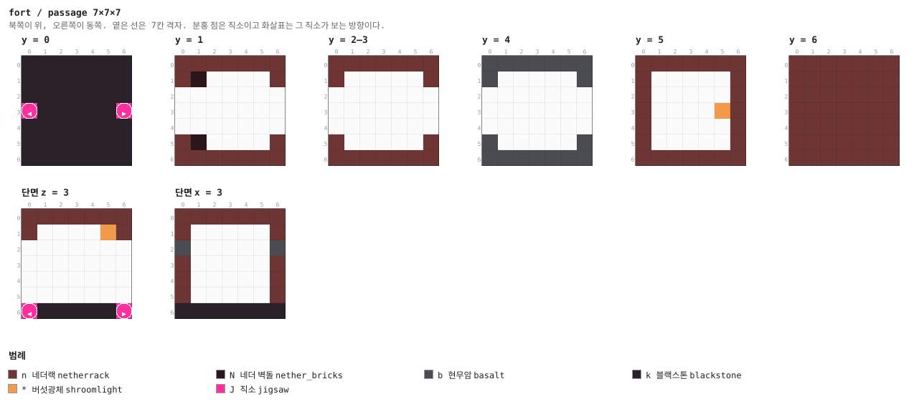

<details><summary>층별 지도 (텍스트)</summary>

```
y = 0   x →동, z ↓남
  kkkkkkk
  kkkkkkk
  kkkkkkk
  JkkkkkJ
  kkkkkkk
  kkkkkkk
  kkkkkkk
y = 1   x →동, z ↓남
  nnnnnnn
  nN....n
  .......
  .......
  .......
  nN....n
  nnnnnnn
y = 2–3   x →동, z ↓남
  nnnnnnn
  n.....n
  .......
  .......
  .......
  n.....n
  nnnnnnn
y = 4   x →동, z ↓남
  bbbbbbb
  b.....b
  .......
  .......
  .......
  b.....b
  bbbbbbb
y = 5   x →동, z ↓남
  nnnnnnn
  n.....n
  n.....n
  n....*n
  n.....n
  n.....n
  nnnnnnn
y = 6   x →동, z ↓남
  nnnnnnn
  nnnnnnn
  nnnnnnn
  nnnnnnn
  nnnnnnn
  nnnnnnn
  nnnnnnn
```

</details>


### `corner` — 7×7×7 — 1×1×1 셀

꺾이는 복도.

**어느 풀에 있나** — `cells` (가중치 9)

| 직소 위치 | 향 | name | target | pool |
|---|---|---|---|---|
| (0, 0, 3) | ◀ 서 | `fort_door` | `fort_door` | `fort/cells` |
| (3, 0, 6) | ▼ 남 | `fort_door` | `fort_door` | `fort/cells` |

**뚫린 면** — 서: z 2–4, y 1–4 (12칸) / 남: x 2–4, y 1–4 (12칸)

**블록** — 네더랙 127, 블랙스톤 47, 현무암 18, 직소 2, 조각한 네더 벽돌 1, 버섯광체 1

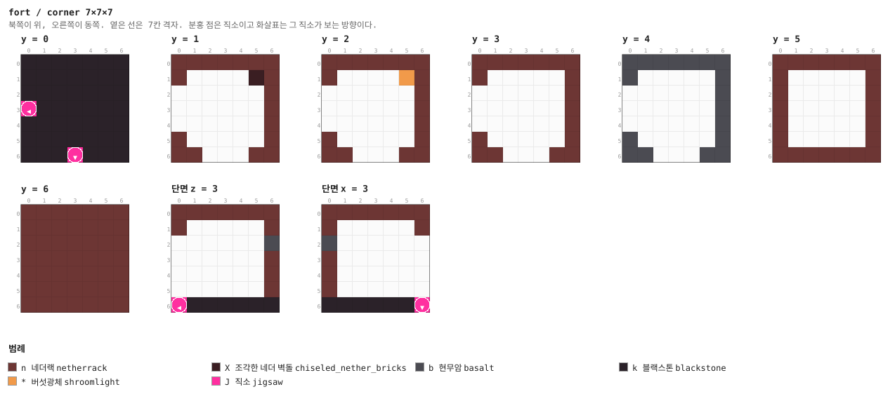

<details><summary>층별 지도 (텍스트)</summary>

```
y = 0   x →동, z ↓남
  kkkkkkk
  kkkkkkk
  kkkkkkk
  Jkkkkkk
  kkkkkkk
  kkkkkkk
  kkkJkkk
y = 1   x →동, z ↓남
  nnnnnnn
  n....Xn
  ......n
  ......n
  ......n
  n.....n
  nn...nn
y = 2   x →동, z ↓남
  nnnnnnn
  n....*n
  ......n
  ......n
  ......n
  n.....n
  nn...nn
y = 3   x →동, z ↓남
  nnnnnnn
  n.....n
  ......n
  ......n
  ......n
  n.....n
  nn...nn
y = 4   x →동, z ↓남
  bbbbbbb
  b.....b
  ......b
  ......b
  ......b
  b.....b
  bb...bb
y = 5   x →동, z ↓남
  nnnnnnn
  n.....n
  n.....n
  n.....n
  n.....n
  n.....n
  nnnnnnn
y = 6   x →동, z ↓남
  nnnnnnn
  nnnnnnn
  nnnnnnn
  nnnnnnn
  nnnnnnn
  nnnnnnn
  nnnnnnn
```

</details>


### `cross` — 7×7×7 — 1×1×1 셀

네거리. 네 구석에 기둥.

**어느 풀에 있나** — `cells` (가중치 5)

| 직소 위치 | 향 | name | target | pool |
|---|---|---|---|---|
| (3, 0, 0) | ▲ 북 | `fort_door` | `fort_door` | `fort/cells` |
| (0, 0, 3) | ◀ 서 | `fort_door` | `fort_door` | `fort/cells` |
| (6, 0, 3) | ▶ 동 | `fort_door` | `fort_door` | `fort/cells` |
| (3, 0, 6) | ▼ 남 | `fort_door` | `fort_door` | `fort/cells` |

**뚫린 면** — 서: z 2–4, y 1–4 (12칸) / 동: z 2–4, y 1–4 (12칸) / 북: x 2–4, y 1–4 (12칸) / 남: x 2–4, y 1–4 (12칸)

**블록** — 네더랙 109, 블랙스톤 45, 현무암 12, 네더 벽돌 12, 직소 4, 버섯광체 1

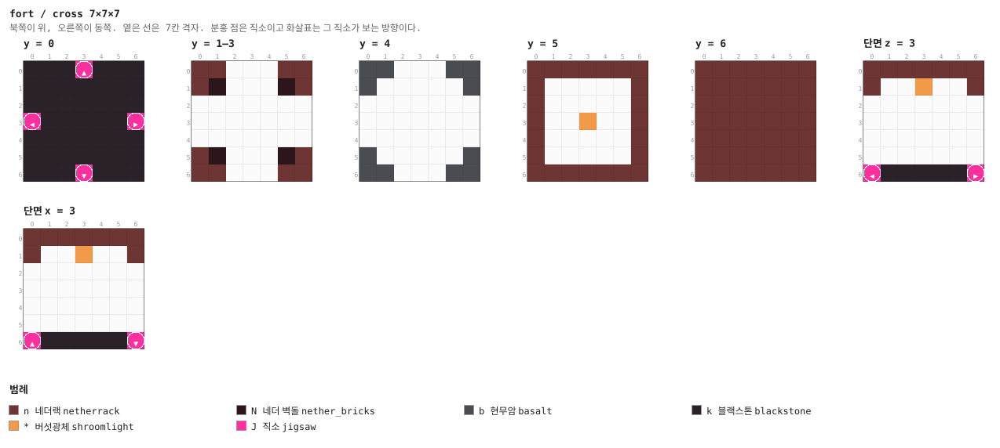

<details><summary>층별 지도 (텍스트)</summary>

```
y = 0   x →동, z ↓남
  kkkJkkk
  kkkkkkk
  kkkkkkk
  JkkkkkJ
  kkkkkkk
  kkkkkkk
  kkkJkkk
y = 1–3   x →동, z ↓남
  nn...nn
  nN...Nn
  .......
  .......
  .......
  nN...Nn
  nn...nn
y = 4   x →동, z ↓남
  bb...bb
  b.....b
  .......
  .......
  .......
  b.....b
  bb...bb
y = 5   x →동, z ↓남
  nnnnnnn
  n.....n
  n.....n
  n..*..n
  n.....n
  n.....n
  nnnnnnn
y = 6   x →동, z ↓남
  nnnnnnn
  nnnnnnn
  nnnnnnn
  nnnnnnn
  nnnnnnn
  nnnnnnn
  nnnnnnn
```

</details>


### `guard` — 7×7×7 — 1×1×1 셀

경비 칸. blaze 스포너.

**어느 풀에 있나** — `cells` (가중치 6)

| 직소 위치 | 향 | name | target | pool |
|---|---|---|---|---|
| (3, 0, 0) | ▲ 북 | `fort_door` | `fort_door` | `fort/cells` |
| (0, 0, 3) | ◀ 서 | `fort_door` | `fort_door` | `fort/cells` |
| (6, 0, 3) | ▶ 동 | `fort_door` | `fort_door` | `fort/cells` |
| (3, 0, 6) | ▼ 남 | `fort_door` | `fort_door` | `fort/cells` |

**뚫린 면** — 서: z 2–4, y 1–4 (12칸) / 동: z 2–4, y 1–4 (12칸) / 북: x 2–4, y 1–4 (12칸) / 남: x 2–4, y 1–4 (12칸)

**블록** — 네더랙 109, 블랙스톤 36, 현무암 12, 조각한 네더 벽돌 9, 직소 4, 철창 1, 몬스터 스포너 1

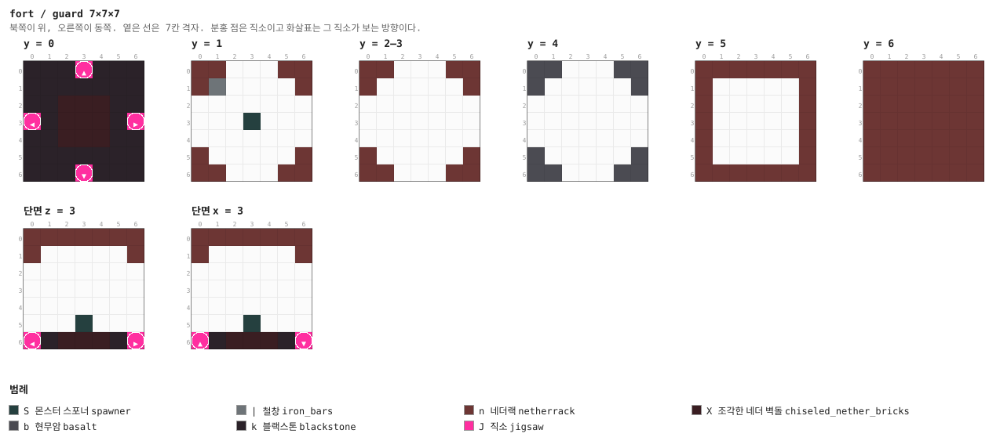

<details><summary>층별 지도 (텍스트)</summary>

```
y = 0   x →동, z ↓남
  kkkJkkk
  kkkkkkk
  kkXXXkk
  JkXXXkJ
  kkXXXkk
  kkkkkkk
  kkkJkkk
y = 1   x →동, z ↓남
  nn...nn
  n|....n
  .......
  ...S...
  .......
  n.....n
  nn...nn
y = 2–3   x →동, z ↓남
  nn...nn
  n.....n
  .......
  .......
  .......
  n.....n
  nn...nn
y = 4   x →동, z ↓남
  bb...bb
  b.....b
  .......
  .......
  .......
  b.....b
  bb...bb
y = 5   x →동, z ↓남
  nnnnnnn
  n.....n
  n.....n
  n.....n
  n.....n
  n.....n
  nnnnnnn
y = 6   x →동, z ↓남
  nnnnnnn
  nnnnnnn
  nnnnnnn
  nnnnnnn
  nnnnnnn
  nnnnnnn
  nnnnnnn
```

</details>


### `span` — 7×7×7 — 1×1×1 셀

용암 수로 둘 사이의 좁은 길. 트리거가 없는 위험이고, 먼저 지나가는 것이 몹이든 사람이든
똑같다 (§12). 용암은 바닥 켜 한 칸 위, 벽돌 테두리 안쪽이다 (§28).

**어느 풀에 있나** — `cells` (가중치 5)

| 직소 위치 | 향 | name | target | pool |
|---|---|---|---|---|
| (0, 0, 3) | ◀ 서 | `fort_door` | `fort_door` | `fort/cells` |
| (6, 0, 3) | ▶ 동 | `fort_door` | `fort_door` | `fort/cells` |

**뚫린 면** — 서: z 2–4, y 1–4 (12칸) / 동: z 2–4, y 1–4 (12칸)

**블록** — 네더랙 127, 블랙스톤 47, 현무암 18, 용암 10, 네더 벽돌 10, 직소 2, 버섯광체 1

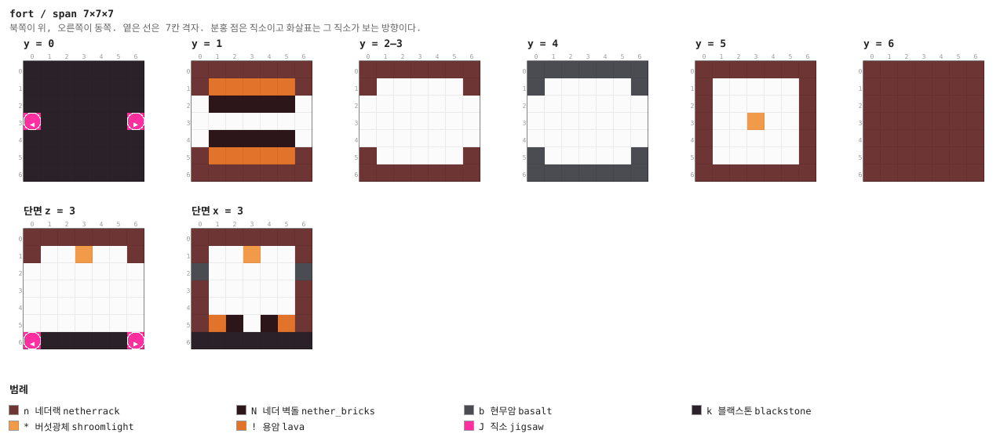

<details><summary>층별 지도 (텍스트)</summary>

```
y = 0   x →동, z ↓남
  kkkkkkk
  kkkkkkk
  kkkkkkk
  JkkkkkJ
  kkkkkkk
  kkkkkkk
  kkkkkkk
y = 1   x →동, z ↓남
  nnnnnnn
  n!!!!!n
  .NNNNN.
  .......
  .NNNNN.
  n!!!!!n
  nnnnnnn
y = 2–3   x →동, z ↓남
  nnnnnnn
  n.....n
  .......
  .......
  .......
  n.....n
  nnnnnnn
y = 4   x →동, z ↓남
  bbbbbbb
  b.....b
  .......
  .......
  .......
  b.....b
  bbbbbbb
y = 5   x →동, z ↓남
  nnnnnnn
  n.....n
  n.....n
  n..*..n
  n.....n
  n.....n
  nnnnnnn
y = 6   x →동, z ↓남
  nnnnnnn
  nnnnnnn
  nnnnnnn
  nnnnnnn
  nnnnnnn
  nnnnnnn
  nnnnnnn
```

</details>


### `store` — 7×7×7 — 1×1×1 셀

상자 방. 상자와 통.

**어느 풀에 있나** — `cells` (가중치 6)

| 직소 위치 | 향 | name | target | pool |
|---|---|---|---|---|
| (0, 0, 3) | ◀ 서 | `fort_door` | `fort_door` | `fort/cells` |

**뚫린 면** — 서: z 2–4, y 1–4 (12칸)

**블록** — 네더랙 136, 블랙스톤 48, 현무암 21, 조각한 네더 벽돌 5, 직소 1, 버섯광체 1, 상자 1, 통 1

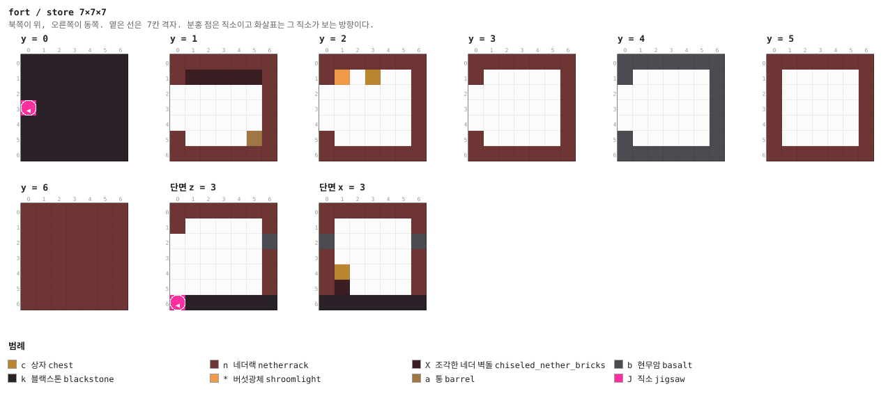

<details><summary>층별 지도 (텍스트)</summary>

```
y = 0   x →동, z ↓남
  kkkkkkk
  kkkkkkk
  kkkkkkk
  Jkkkkkk
  kkkkkkk
  kkkkkkk
  kkkkkkk
y = 1   x →동, z ↓남
  nnnnnnn
  nXXXXXn
  ......n
  ......n
  ......n
  n....an
  nnnnnnn
y = 2   x →동, z ↓남
  nnnnnnn
  n*.c..n
  ......n
  ......n
  ......n
  n.....n
  nnnnnnn
y = 3   x →동, z ↓남
  nnnnnnn
  n.....n
  ......n
  ......n
  ......n
  n.....n
  nnnnnnn
y = 4   x →동, z ↓남
  bbbbbbb
  b.....b
  ......b
  ......b
  ......b
  b.....b
  bbbbbbb
y = 5   x →동, z ↓남
  nnnnnnn
  n.....n
  n.....n
  n.....n
  n.....n
  n.....n
  nnnnnnn
y = 6   x →동, z ↓남
  nnnnnnn
  nnnnnnn
  nnnnnnn
  nnnnnnn
  nnnnnnn
  nnnnnnn
  nnnnnnn
```

</details>


### `special` — 7×7×7 — 1×1×1 셀

용광로. 북벽을 따라 용암 홈, 남벽에 용광로 둘과 상자.

**어느 풀에 있나** — `cells` (가중치 5)

| 직소 위치 | 향 | name | target | pool |
|---|---|---|---|---|
| (0, 0, 3) | ◀ 서 | `fort_door` | `fort_door` | `fort/cells` |
| (6, 0, 3) | ▶ 동 | `fort_door` | `fort_door` | `fort/cells` |

**뚫린 면** — 서: z 2–4, y 1–4 (12칸) / 동: z 2–4, y 1–4 (12칸)

**블록** — 네더랙 127, 블랙스톤 47, 현무암 18, 용암 5, 네더 벽돌 5, 직소 2, 용광로 2, 상자 1

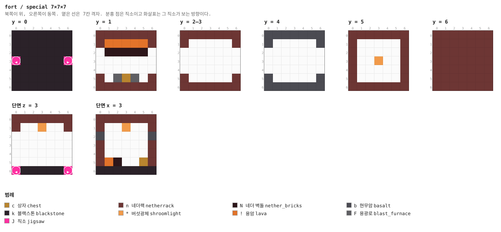

<details><summary>층별 지도 (텍스트)</summary>

```
y = 0   x →동, z ↓남
  kkkkkkk
  kkkkkkk
  kkkkkkk
  JkkkkkJ
  kkkkkkk
  kkkkkkk
  kkkkkkk
y = 1   x →동, z ↓남
  nnnnnnn
  n!!!!!n
  .NNNNN.
  .......
  .......
  n.FcF.n
  nnnnnnn
y = 2–3   x →동, z ↓남
  nnnnnnn
  n.....n
  .......
  .......
  .......
  n.....n
  nnnnnnn
y = 4   x →동, z ↓남
  bbbbbbb
  b.....b
  .......
  .......
  .......
  b.....b
  bbbbbbb
y = 5   x →동, z ↓남
  nnnnnnn
  n.....n
  n.....n
  n..*..n
  n.....n
  n.....n
  nnnnnnn
y = 6   x →동, z ↓남
  nnnnnnn
  nnnnnnn
  nnnnnnn
  nnnnnnn
  nnnnnnn
  nnnnnnn
  nnnnnnn
```

</details>


### `cap` — 1×7×7

두께 1의 마개. 복도 풀의 fallback (§4).

**어느 풀에 있나** — `caps` (가중치 1)

| 직소 위치 | 향 | name | target | pool |
|---|---|---|---|---|
| (0, 0, 3) | ◀ 서 | `fort_door` | `fort_door` | `fort/caps` |

**블록** — 네더랙 35, 현무암 13, 직소 1

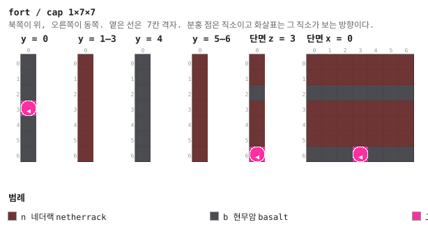

<details><summary>층별 지도 (텍스트)</summary>

```
y = 0   x →동, z ↓남
  b
  b
  b
  J
  b
  b
  b
y = 1–3   x →동, z ↓남
  n
  n
  n
  n
  n
  n
  n
y = 4   x →동, z ↓남
  b
  b
  b
  b
  b
  b
  b
y = 5–6   x →동, z ↓남
  n
  n
  n
  n
  n
  n
  n
```

</details>


### `approach_1` — 7×7×7 — 1×1×1 셀

보스 통로. 셋이 사슬로 이어져 보스 홀을 시작 홀에서 멀리 민다 (§7). 서쪽 직소만
`fort_boss` 이름이라 사슬이 거꾸로 붙지 않는다 (§13).

**어느 풀에 있나** — `boss_1` (가중치 1)

| 직소 위치 | 향 | name | target | pool |
|---|---|---|---|---|
| (3, 0, 0) | ▲ 북 | `fort_door` | `fort_door` | `fort/cells` |
| (0, 0, 3) | ◀ 서 | `fort_boss` | `fort_door` | `fort/cells` |
| (6, 0, 3) | ▶ 동 | `fort_door` | `fort_boss` | `fort/boss_2` |

**뚫린 면** — 서: z 2–4, y 1–4 (12칸) / 동: z 2–4, y 1–4 (12칸) / 북: x 2–4, y 1–4 (12칸)

**블록** — 네더랙 118, 블랙스톤 46, 현무암 15, 직소 3, 버섯광체 1


<details><summary>층별 지도 (텍스트)</summary>

```
y = 0   x →동, z ↓남
  kkkJkkk
  kkkkkkk
  kkkkkkk
  JkkkkkJ
  kkkkkkk
  kkkkkkk
  kkkkkkk
y = 1   x →동, z ↓남
  nn...nn
  n*....n
  .......
  .......
  .......
  n.....n
  nnnnnnn
y = 2–3   x →동, z ↓남
  nn...nn
  n.....n
  .......
  .......
  .......
  n.....n
  nnnnnnn
y = 4   x →동, z ↓남
  bb...bb
  b.....b
  .......
  .......
  .......
  b.....b
  bbbbbbb
y = 5   x →동, z ↓남
  nnnnnnn
  n.....n
  n.....n
  n.....n
  n.....n
  n.....n
  nnnnnnn
y = 6   x →동, z ↓남
  nnnnnnn
  nnnnnnn
  nnnnnnn
  nnnnnnn
  nnnnnnn
  nnnnnnn
  nnnnnnn
```

</details>


### `hall` — 21×14×21 — 3×2×3 셀

화염의 군주의 홀. 21×14×21. 기둥 넷, 단상 위 보스 트라이얼 스포너, 네 구석에 경비 스포너,
남쪽에 테두리를 두른 용암 도랑.

**어느 풀에 있나** — `boss` (가중치 1)

| 직소 위치 | 향 | name | target | pool |
|---|---|---|---|---|
| (0, 0, 10) | ◀ 서 | `fort_boss` | `fort_door` | `—` |

**뚫린 면** — 서: z 9–11, y 1–4 (12칸)

**블록** — 네더랙 1152, 블랙스톤 440, 현무암 237, 네더 벽돌 164, 조각한 네더 벽돌 108, 용암 12, 트라이얼 스포너 5, 버섯광체 4

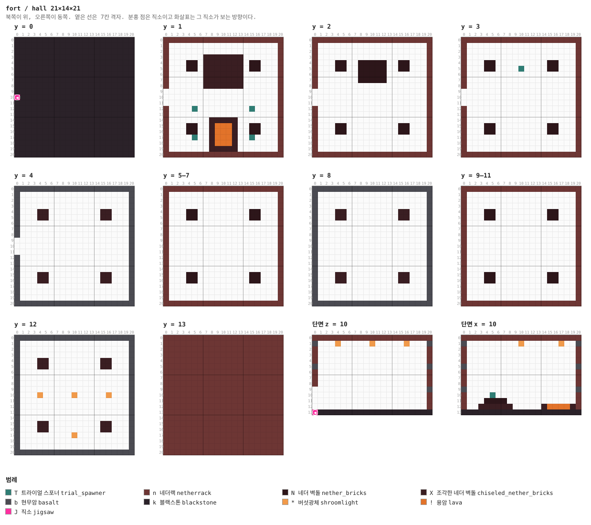

<details><summary>층별 지도 (텍스트)</summary>

```
y = 0   x →동, z ↓남
  kkkkkkkkkkkkkkkkkkkkk
  kkkkkkkkkkkkkkkkkkkkk
  kkkkkkkkkkkkkkkkkkkkk
  kkkkkkkkkkkkkkkkkkkkk
  kkkkkkkkkkkkkkkkkkkkk
  kkkkkkkkkkkkkkkkkkkkk
  kkkkkkkkkkkkkkkkkkkkk
  kkkkkkkkkkkkkkkkkkkkk
  kkkkkkkkkkkkkkkkkkkkk
  kkkkkkkkkkkkkkkkkkkkk
  Jkkkkkkkkkkkkkkkkkkkk
  kkkkkkkkkkkkkkkkkkkkk
  kkkkkkkkkkkkkkkkkkkkk
  kkkkkkkkkkkkkkkkkkkkk
  kkkkkkkkkkkkkkkkkkkkk
  kkkkkkkkkkkkkkkkkkkkk
  kkkkkkkkkkkkkkkkkkkkk
  kkkkkkkkkkkkkkkkkkkkk
  kkkkkkkkkkkkkkkkkkkkk
  kkkkkkkkkkkkkkkkkkkkk
  kkkkkkkkkkkkkkkkkkkkk
y = 1   x →동, z ↓남
  nnnnnnnnnnnnnnnnnnnnn
  n...................n
  n...................n
  n......XXXXXXX......n
  n...NN.XXXXXXX.NN...n
  n...NN.XXXXXXX.NN...n
  n......XXXXXXX......n
  n......XXXXXXX......n
  n......XXXXXXX......n
  ....................n
  ....................n
  ....................n
  n....T.........T....n
  n...................n
  n.......XXXXX.......n
  n...NN..X!!!X..NN...n
  n...NN..X!!!X..NN...n
  n....T..X!!!X..T....n
  n.......X!!!X.......n
  n.......XXXXX.......n
  nnnnnnnnnnnnnnnnnnnnn
y = 2   x →동, z ↓남
  nnnnnnnnnnnnnnnnnnnnn
  n...................n
  n...................n
  n...................n
  n...NN..NNNNN..NN...n
  n...NN..NNNNN..NN...n
  n.......NNNNN.......n
  n.......NNNNN.......n
  n...................n
  ....................n
  ....................n
  ....................n
  n...................n
  n...................n
  n...................n
  n...NN.........NN...n
  n...NN.........NN...n
  n...................n
  n...................n
  n...................n
  nnnnnnnnnnnnnnnnnnnnn
y = 3   x →동, z ↓남
  nnnnnnnnnnnnnnnnnnnnn
  n...................n
  n...................n
  n...................n
  n...NN.........NN...n
  n...NN....T....NN...n
  n...................n
  n...................n
  n...................n
  ....................n
  ....................n
  ....................n
  n...................n
  n...................n
  n...................n
  n...NN.........NN...n
  n...NN.........NN...n
  n...................n
  n...................n
  n...................n
  nnnnnnnnnnnnnnnnnnnnn
y = 4   x →동, z ↓남
  bbbbbbbbbbbbbbbbbbbbb
  b...................b
  b...................b
  b...................b
  b...XX.........XX...b
  b...XX.........XX...b
  b...................b
  b...................b
  b...................b
  ....................b
  ....................b
  ....................b
  b...................b
  b...................b
  b...................b
  b...XX.........XX...b
  b...XX.........XX...b
  b...................b
  b...................b
  b...................b
  bbbbbbbbbbbbbbbbbbbbb
y = 5–7   x →동, z ↓남
  nnnnnnnnnnnnnnnnnnnnn
  n...................n
  n...................n
  n...................n
  n...NN.........NN...n
  n...NN.........NN...n
  n...................n
  n...................n
  n...................n
  n...................n
  n...................n
  n...................n
  n...................n
  n...................n
  n...................n
  n...NN.........NN...n
  n...NN.........NN...n
  n...................n
  n...................n
  n...................n
  nnnnnnnnnnnnnnnnnnnnn
y = 8   x →동, z ↓남
  bbbbbbbbbbbbbbbbbbbbb
  b...................b
  b...................b
  b...................b
  b...XX.........XX...b
  b...XX.........XX...b
  b...................b
  b...................b
  b...................b
  b...................b
  b...................b
  b...................b
  b...................b
  b...................b
  b...................b
  b...XX.........XX...b
  b...XX.........XX...b
  b...................b
  b...................b
  b...................b
  bbbbbbbbbbbbbbbbbbbbb
y = 9–11   x →동, z ↓남
  nnnnnnnnnnnnnnnnnnnnn
  n...................n
  n...................n
  n...................n
  n...NN.........NN...n
  n...NN.........NN...n
  n...................n
  n...................n
  n...................n
  n...................n
  n...................n
  n...................n
  n...................n
  n...................n
  n...................n
  n...NN.........NN...n
  n...NN.........NN...n
  n...................n
  n...................n
  n...................n
  nnnnnnnnnnnnnnnnnnnnn
y = 12   x →동, z ↓남
  bbbbbbbbbbbbbbbbbbbbb
  b...................b
  b...................b
  b...................b
  b...XX.........XX...b
  b...XX.........XX...b
  b...................b
  b...................b
  b...................b
  b...................b
  b...*.....*.....*...b
  b...................b
  b...................b
  b...................b
  b...................b
  b...XX.........XX...b
  b...XX.........XX...b
  b.........*.........b
  b...................b
  b...................b
  bbbbbbbbbbbbbbbbbbbbb
y = 13   x →동, z ↓남
  nnnnnnnnnnnnnnnnnnnnn
  nnnnnnnnnnnnnnnnnnnnn
  nnnnnnnnnnnnnnnnnnnnn
  nnnnnnnnnnnnnnnnnnnnn
  nnnnnnnnnnnnnnnnnnnnn
  nnnnnnnnnnnnnnnnnnnnn
  nnnnnnnnnnnnnnnnnnnnn
  nnnnnnnnnnnnnnnnnnnnn
  nnnnnnnnnnnnnnnnnnnnn
  nnnnnnnnnnnnnnnnnnnnn
  nnnnnnnnnnnnnnnnnnnnn
  nnnnnnnnnnnnnnnnnnnnn
  nnnnnnnnnnnnnnnnnnnnn
  nnnnnnnnnnnnnnnnnnnnn
  nnnnnnnnnnnnnnnnnnnnn
  nnnnnnnnnnnnnnnnnnnnn
  nnnnnnnnnnnnnnnnnnnnn
  nnnnnnnnnnnnnnnnnnnnn
  nnnnnnnnnnnnnnnnnnnnn
  nnnnnnnnnnnnnnnnnnnnn
  nnnnnnnnnnnnnnnnnnnnn
```

</details>

<details><summary>세로 단면 (텍스트)</summary>

```
단면 z = 10   x →동, y ↑하늘
  nnnnnnnnnnnnnnnnnnnnn
  b...*.....*.....*...b
  n...................n
  n...................n
  n...................n
  b...................b
  n...................n
  n...................n
  n...................n
  ....................b
  ....................n
  ....................n
  ....................n
  Jkkkkkkkkkkkkkkkkkkkk
단면 x = 10   z →남, y ↑하늘
  nnnnnnnnnnnnnnnnnnnnn
  b.........*......*..b
  n...................n
  n...................n
  n...................n
  b...................b
  n...................n
  n...................n
  n...................n
  b...................b
  n....T..............n
  n...NNNN............n
  n..XXXXXX.....X!!!!Xn
  kkkkkkkkkkkkkkkkkkkkk
```

</details>


### `approach_2` — 7×7×7 — 1×1×1 셀

**어느 풀에 있나** — `boss_2` (가중치 1)

| 직소 위치 | 향 | name | target | pool |
|---|---|---|---|---|
| (3, 0, 0) | ▲ 북 | `fort_door` | `fort_door` | `fort/cells` |
| (0, 0, 3) | ◀ 서 | `fort_boss` | `fort_door` | `fort/cells` |
| (6, 0, 3) | ▶ 동 | `fort_door` | `fort_boss` | `fort/boss_3` |

**뚫린 면** — 서: z 2–4, y 1–4 (12칸) / 동: z 2–4, y 1–4 (12칸) / 북: x 2–4, y 1–4 (12칸)

**블록** — 네더랙 118, 블랙스톤 46, 현무암 15, 직소 3, 버섯광체 1


<details><summary>층별 지도 (텍스트)</summary>

```
y = 0   x →동, z ↓남
  kkkJkkk
  kkkkkkk
  kkkkkkk
  JkkkkkJ
  kkkkkkk
  kkkkkkk
  kkkkkkk
y = 1   x →동, z ↓남
  nn...nn
  n*....n
  .......
  .......
  .......
  n.....n
  nnnnnnn
y = 2–3   x →동, z ↓남
  nn...nn
  n.....n
  .......
  .......
  .......
  n.....n
  nnnnnnn
y = 4   x →동, z ↓남
  bb...bb
  b.....b
  .......
  .......
  .......
  b.....b
  bbbbbbb
y = 5   x →동, z ↓남
  nnnnnnn
  n.....n
  n.....n
  n.....n
  n.....n
  n.....n
  nnnnnnn
y = 6   x →동, z ↓남
  nnnnnnn
  nnnnnnn
  nnnnnnn
  nnnnnnn
  nnnnnnn
  nnnnnnn
  nnnnnnn
```

</details>


### `approach_3` — 7×7×7 — 1×1×1 셀

**어느 풀에 있나** — `boss` (가중치 1), `boss_3` (가중치 1)

| 직소 위치 | 향 | name | target | pool |
|---|---|---|---|---|
| (3, 0, 0) | ▲ 북 | `fort_door` | `fort_door` | `fort/cells` |
| (0, 0, 3) | ◀ 서 | `fort_boss` | `fort_door` | `fort/cells` |
| (6, 0, 3) | ▶ 동 | `fort_door` | `fort_boss` | `fort/boss` |

**뚫린 면** — 서: z 2–4, y 1–4 (12칸) / 동: z 2–4, y 1–4 (12칸) / 북: x 2–4, y 1–4 (12칸)

**블록** — 네더랙 118, 블랙스톤 46, 현무암 15, 직소 3, 버섯광체 1

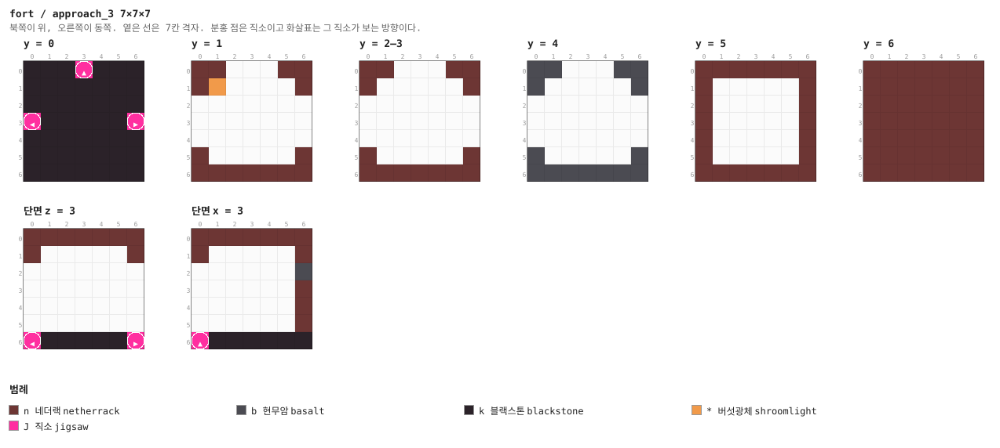

<details><summary>층별 지도 (텍스트)</summary>

```
y = 0   x →동, z ↓남
  kkkJkkk
  kkkkkkk
  kkkkkkk
  JkkkkkJ
  kkkkkkk
  kkkkkkk
  kkkkkkk
y = 1   x →동, z ↓남
  nn...nn
  n*....n
  .......
  .......
  .......
  n.....n
  nnnnnnn
y = 2–3   x →동, z ↓남
  nn...nn
  n.....n
  .......
  .......
  .......
  n.....n
  nnnnnnn
y = 4   x →동, z ↓남
  bb...bb
  b.....b
  .......
  .......
  .......
  b.....b
  bbbbbbb
y = 5   x →동, z ↓남
  nnnnnnn
  n.....n
  n.....n
  n.....n
  n.....n
  n.....n
  nnnnnnn
y = 6   x →동, z ↓남
  nnnnnnn
  nnnnnnn
  nnnnnnn
  nnnnnnn
  nnnnnnn
  nnnnnnn
  nnnnnnn
```

</details>


## 다듬을 곳

- **복도가 일곱 종뿐이다.** 같은 문 배치의 조각을 더 만들어 풀에 넣으면 그만큼 다양해지고
  배선은 안 건드려도 된다 (§16)
- **떨어지는 높이가 무작위다.** 바닐라 잔해와 같은 방식이라 가끔 용암 바다 위나 큰 동굴
  한복판에 걸린다. `beard_thin`이 밑을 받쳐 주지만 12칸까지다 (§31)
- **손으로 지은 조각이 하나도 없다.** 21×21×21까지는 구조물 블록 한 변 48 안이므로
  §16대로 다시 지어 `tools/handmade/`에 넣을 수 있다
