# 레벨 설계 — 저주받은 묘지

> 이 문서는 `python tools/gen_level_doc.py grave`가 만든다. 조각을 고치면 다시 돌린다. 그림과 표는 게임이 읽는 파일(`structure/grave/*.nbt`, `worldgen/**`)에서 그대로 읽어 온 것이라 모드와 어긋날 수 없다. 설명 문장만 사람이 쓴다 (`tools/gen_level_doc.py`의 `INTRO`·`NOTES`).

## 1. 한눈에

어두운숲과 창백한 정원에 있는 묘지다. 가운데 **예배당 폐허**에서 묘역이 사방으로 뻗고, 끝은
**철 울타리 한 장**으로 막힌다. 묘비와 파헤쳐진 무덤, 작은 석실, 창백한 죽은 나무가 섞여 있다.
예배당 바닥의 구멍으로 사다리가 **28칸** 내려가면 바위를 파낸 **납골당**이고, 통로 셋 뒤에
**기병대장**이 있다.

**한 판:** 예배당 → 묘역(스켈레톤·좀비·파헤쳐진 무덤의 스포너) → 사다리 → 납골당(관·영혼
흙·뼈 선반) → 대장. 이기면 **수선 책 + 안장**이 확정이고, 그의 홀에 **길들여진 스켈레톤말**이
서 있다. **수선은 이 모드에서 여기밖에 없다** — 마법 부여대는 보물 마법을 주지 않는다.

| 항목 | 값 |
|---|---|
| 생성 단계 | `surface_structures` |
| 바이옴 | `#sydungeon:has_structure/grave` |
| 간격 / 최소거리 | spacing 40 / separation 12 |
| 직소 깊이 | 14 ~ 22 (`sydungeon:ranged_jigsaw`) |
| 시작 풀 | `start` |
| 조각 / 풀 | 25개 / 11개 |

## 2. 조립 원리

### 고리가 아니라 퍼지는 쪽이다

얼음 성채와 군벌의 진영은 **고리**다 — 결정적인 조각들이 담을 둘러 닫는다. 묘지는 반대쪽이다.
예배당이 시작이고 묘역은 자리 있는 데로 뻗는다. 이 모드에서 직소를 가장 느슨하게 쓰는 방식이고
(늪의 널다리와 같다, §17), fallback은 **철 울타리 한 장**이라 묘역이 허공에서 끊기지 않는다 (§4).

### 지하는 바위를 파낸 것이다

납골당 조각의 껍질은 **돌과 안산암 띠**고, 돌벽돌·뼈·양초는 전부 안쪽에 있다 (§5.2). 어두운숲은
악지만큼 무너지지 않지만, 사면에 드러난 납골당이 석조 상자로 보이는 것은 마찬가지다. 수직통로도
**28칸** 내린다.

처음에는 벽을 두 겹으로 만들었다 — 바깥은 바위, 안쪽은 돌벽돌. 그러면 방이 3×3으로 줄고
**문(3×4)이 방보다 크다.** 그래서 벽은 한 겹이고, 바닥과 치장이 납골당을 만든다.

### 말을 주는 방법

콘셉트는 "보스를 잡으면 길들여진 스켈레톤말이 남는다"였다. 그런데 **트라이얼 스포너는 제가
낸 몹이 다 죽어야 끝난다** — 보스가 말을 타고 있으면 말도 죽여야 하고, 그 말이 보상이다.

그래서 대장은 걸어 나오고, 그의 홀 한쪽에 **평범한 몬스터 스포너**로 `Tame:1` 스켈레톤말을 둔다.
트라이얼이 세지 않는 몹이라 싸움이 끝나도 그대로 서 있고, 보상의 **안장**으로 타고 나갈 수 있다.
기병은 경비 웨이브에 있다 — 스켈레톤말에 스켈레톤을 태운 것(`Passengers`), 스켈레톤 트랩의 모양
그대로다. 그쪽 말은 싸움의 일부라 같이 죽는다.

### 트리거가 있는 함정은 없다

- **파헤쳐진 무덤** — 한 칸 파인 구덩이에 스켈레톤 스포너. 구덩이는 밟아서 생기는 것이 아니다
- **봉인된 관** — 깨서 여는 것은 플레이어뿐이다 (§12, 진영의 라버저 우리와 같다)
- **영혼 흙 바닥** — 느려지는 것이 위험이고 트리거가 아예 없다
- **삐걱 심장** — 창백한 죽은 나무 안에 있다. 창백한 참나무가 둘러야 깨어나므로 대개는 그냥
  나무의 옹이다. 깨어나면 그게 이 묘지의 밤이다

## 3. 풀 배선

풀이 어떤 조각을 내놓는지(실선, 숫자는 가중치)와 그 조각의 직소가 다시 어떤 풀을 부르는지(점선)다. 직소 생성은 이 그래프를 깊이만큼 따라간다.

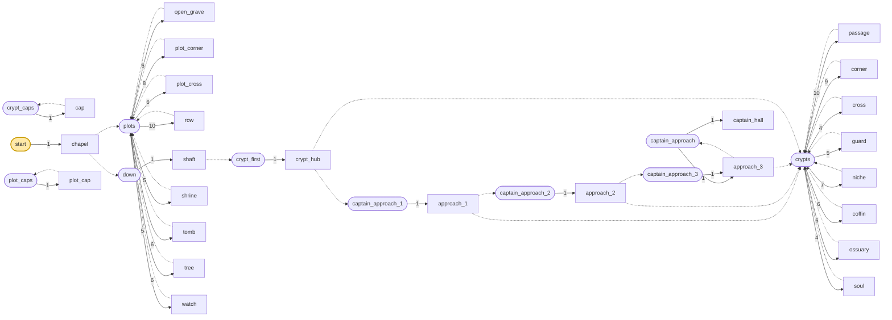
```mermaid
flowchart LR
  P_captain_approach(["captain_approach"])
  P_captain_approach_1(["captain_approach_1"])
  P_captain_approach_2(["captain_approach_2"])
  P_captain_approach_3(["captain_approach_3"])
  P_crypt_caps(["crypt_caps"])
  P_crypt_first(["crypt_first"])
  P_crypts(["crypts"])
  P_down(["down"])
  P_plot_caps(["plot_caps"])
  P_plots(["plots"])
  P_start(["start"])
  E_approach_1["approach_1"]
  E_approach_2["approach_2"]
  E_approach_3["approach_3"]
  E_cap["cap"]
  E_captain_hall["captain_hall"]
  E_chapel["chapel"]
  E_coffin["coffin"]
  E_corner["corner"]
  E_cross["cross"]
  E_crypt_hub["crypt_hub"]
  E_guard["guard"]
  E_niche["niche"]
  E_open_grave["open_grave"]
  E_ossuary["ossuary"]
  E_passage["passage"]
  E_plot_cap["plot_cap"]
  E_plot_corner["plot_corner"]
  E_plot_cross["plot_cross"]
  E_row["row"]
  E_shaft["shaft"]
  E_shrine["shrine"]
  E_soul["soul"]
  E_tomb["tomb"]
  E_tree["tree"]
  E_watch["watch"]
  P_captain_approach -- 1 --> E_captain_hall
  P_captain_approach -- 1 --> E_approach_3
  P_captain_approach_1 -- 1 --> E_approach_1
  P_captain_approach_2 -- 1 --> E_approach_2
  P_captain_approach_3 -- 1 --> E_approach_3
  P_crypt_caps -- 1 --> E_cap
  P_crypt_first -- 1 --> E_crypt_hub
  P_crypts -- 10 --> E_passage
  P_crypts -- 9 --> E_corner
  P_crypts -- 4 --> E_cross
  P_crypts -- 5 --> E_guard
  P_crypts -- 7 --> E_niche
  P_crypts -- 6 --> E_coffin
  P_crypts -- 6 --> E_ossuary
  P_crypts -- 4 --> E_soul
  P_down -- 1 --> E_shaft
  P_plot_caps -- 1 --> E_plot_cap
  P_plots -- 10 --> E_row
  P_plots -- 8 --> E_plot_corner
  P_plots -- 6 --> E_plot_cross
  P_plots -- 6 --> E_open_grave
  P_plots -- 6 --> E_tomb
  P_plots -- 6 --> E_tree
  P_plots -- 5 --> E_shrine
  P_plots -- 5 --> E_watch
  P_start -- 1 --> E_chapel
  E_approach_1 -.-> P_crypts
  E_approach_1 -.-> P_captain_approach_2
  E_approach_2 -.-> P_crypts
  E_approach_2 -.-> P_captain_approach_3
  E_approach_3 -.-> P_crypts
  E_approach_3 -.-> P_captain_approach
  E_cap -.-> P_crypt_caps
  E_chapel -.-> P_plots
  E_chapel -.-> P_down
  E_coffin -.-> P_crypts
  E_corner -.-> P_crypts
  E_cross -.-> P_crypts
  E_crypt_hub -.-> P_crypts
  E_crypt_hub -.-> P_captain_approach_1
  E_guard -.-> P_crypts
  E_niche -.-> P_crypts
  E_open_grave -.-> P_plots
  E_ossuary -.-> P_crypts
  E_passage -.-> P_crypts
  E_plot_cap -.-> P_plot_caps
  E_plot_corner -.-> P_plots
  E_plot_cross -.-> P_plots
  E_row -.-> P_plots
  E_shaft -.-> P_crypt_first
  E_shrine -.-> P_plots
  E_soul -.-> P_crypts
  E_tomb -.-> P_plots
  E_tree -.-> P_plots
  E_watch -.-> P_plots
  P_start:::start
  classDef start fill:#ffe9a8,stroke:#c99a00,stroke-width:2px
```

| 풀 | fallback | 원소 (가중치) |
|---|---|---|
| `captain_approach` | `crypt_caps` | `captain_hall` 1, `approach_3` 1 |
| `captain_approach_1` | `crypt_caps` | `approach_1` 1 |
| `captain_approach_2` | `crypt_caps` | `approach_2` 1 |
| `captain_approach_3` | `crypt_caps` | `approach_3` 1 |
| `crypt_caps` | `minecraft:empty` | `cap` 1 |
| `crypt_first` | `minecraft:empty` | `crypt_hub` 1 |
| `crypts` | `crypt_caps` | `passage` 10, `corner` 9, `cross` 4, `guard` 5, `niche` 7, `coffin` 6, `ossuary` 6, `soul` 4 |
| `down` | `minecraft:empty` | `shaft` 1 |
| `plot_caps` | `minecraft:empty` | `plot_cap` 1 |
| `plots` | `plot_caps` | `row` 10, `plot_corner` 8, `plot_cross` 6, `open_grave` 6, `tomb` 6, `tree` 6, `shrine` 5, `watch` 5 |
| `start` | `minecraft:empty` | `chapel` 1 |

## 4. 뼈대 — 반드시 이렇게 놓이는 부분

예배당과 사다리 아래의 사슬. **원소가 하나뿐인 풀로 놓이는 것만** 그렸다. 묘역과 납골당은
판마다 다르다. 사다리가 예배당 바닥에서 납골당까지 한 줄로 이어지는 것이 단면에 보인다.

| 조각 | 놓이는 자리 (시작 조각 기준) | 누가 놓나 |
|---|---|---|
| `chapel` | (0, 0, 0) | 시작 풀 |
| `shaft` | (7, -28, 7) | chapel의 아래 grv_down 직소 |
| `crypt_hub` | (7, -35, 7) | shaft의 아래 grv_crypt 직소 |
| `approach_1` | (7, -35, 14) | crypt_hub의 남 grv_crypt 직소 |
| `approach_2` | (14, -35, 14) | approach_1의 동 grv_crypt 직소 |
| `approach_3` | (21, -35, 14) | approach_2의 동 grv_crypt 직소 |

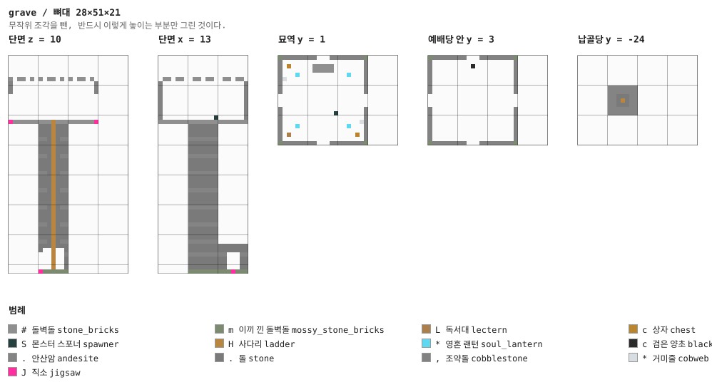

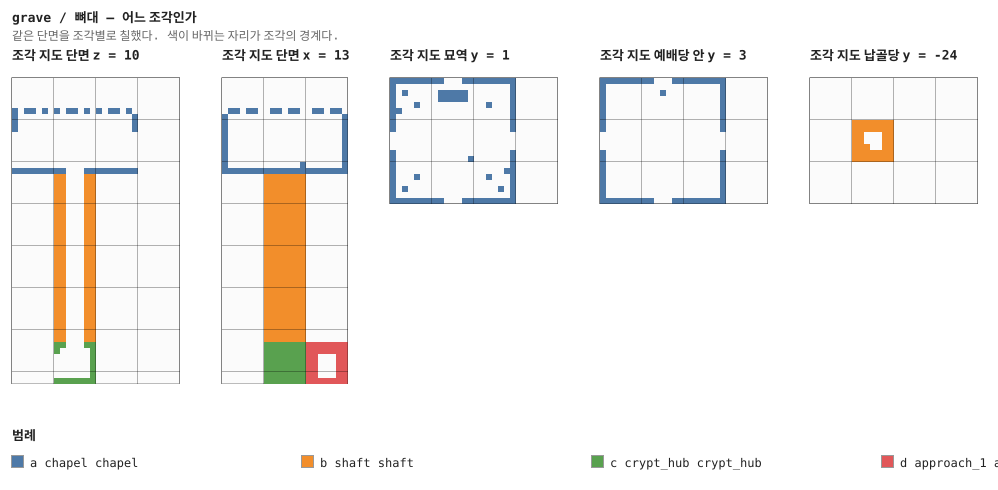

## 5. 조각


그림은 조각 하나를 **층마다 한 장씩** 블록 단위로 그린 것이다. 같은 층이 이어지면 `y = 2–5`처럼 묶었고, 마지막 두 장은 가운데를 자른 세로 단면이다. 분홍 점이 직소, 화살표가 그 직소가 보는 방향이다 — **마주 본 직소끼리만 붙는다.**

### `chapel` — 21×16×21

시작 조각. 21칸짜리 예배당 폐허고 사방에 문이 있어 **그 넷이 묘역을 부른다.** 바닥의 3×3
구멍이 납골당으로 가는 유일한 길이고, 사다리가 걸린 줄은 바닥 켜에서 남겨 두어 걸어 나가
올라탈 수 있다 (§24).

제단과 양초, 독서대, 상자 둘, 그리고 스켈레톤 스포너 하나. 지붕은 절반이 내려앉았다.

**어느 풀에 있나** — `start` (가중치 1)

| 직소 위치 | 향 | name | target | pool |
|---|---|---|---|---|
| (10, 0, 0) | ▲ 북 | `grv_path` | `grv_path` | `grave/plots` |
| (0, 0, 10) | ◀ 서 | `grv_path` | `grv_path` | `grave/plots` |
| (20, 0, 10) | ▶ 동 | `grv_path` | `grv_path` | `grave/plots` |
| (10, 0, 11) | ◇ 아래 | `grv_down` | `grv_down` | `grave/down` |
| (10, 0, 20) | ▼ 남 | `grv_path` | `grv_path` | `grave/plots` |

**뚫린 면** — 서: z 0–20, y 1–15 (132칸) / 동: z 0–20, y 1–15 (132칸) / 북: x 0–20, y 1–15 (132칸) / 남: x 0–20, y 1–15 (132칸) / 위: x 0–20, z 0–20 (441칸)

**블록** — 돌벽돌 697, 조약돌 604, 이끼 낀 돌벽돌 36, 철창 8, 직소 5, 영혼 랜턴 4, 검은 양초 3, 거미줄 2

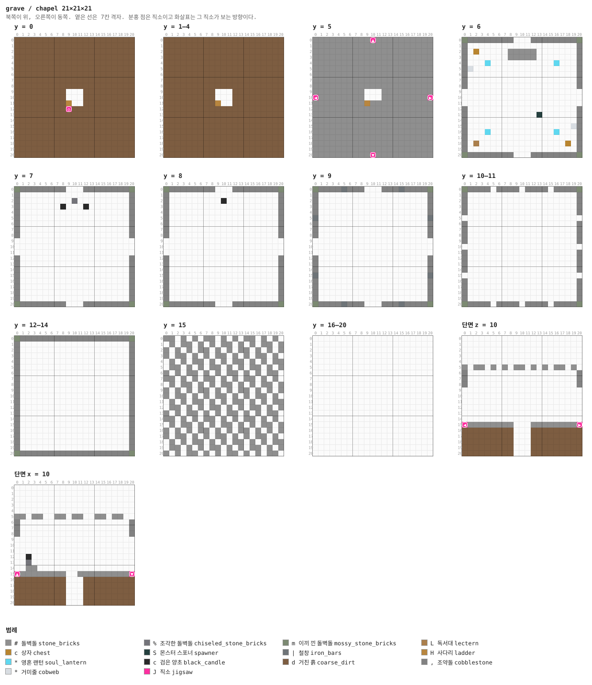

<details><summary>층별 지도 (텍스트)</summary>

```
y = 0   x →동, z ↓남
  ##########J##########
  #####################
  #####################
  #####################
  #####################
  #####################
  #####################
  #####################
  #####################
  #####################
  J#########H#########J
  ##########J##########
  #####################
  #####################
  #####################
  #####################
  #####################
  #####################
  #####################
  #####################
  ##########J##########
y = 1   x →동, z ↓남
  m,,,,,,,,...,,,,,,,,m
  ,...................,
  ,.c.....#####.......,
  ,.......#####.......,
  ,...*...........*...,
  ,*..................,
  ,...................,
  ,...................,
  ,...................,
  .....................
  .....................
  .....................
  ,...................,
  ,............S......,
  ,...................,
  ,..................*,
  ,...*...........*...,
  ,...................,
  ,.L...............c.,
  ,...................,
  m,,,,,,,,...,,,,,,,,m
y = 2   x →동, z ↓남
  m,,,,,,,,...,,,,,,,,m
  ,...................,
  ,.........%.........,
  ,.......c...c.......,
  ,...................,
  ,...................,
  ,...................,
  ,...................,
  ,...................,
  .....................
  .....................
  .....................
  ,...................,
  ,...................,
  ,...................,
  ,...................,
  ,...................,
  ,...................,
  ,...................,
  ,...................,
  m,,,,,,,,...,,,,,,,,m
y = 3   x →동, z ↓남
  m,,,,,,,,...,,,,,,,,m
  ,...................,
  ,.........c.........,
  ,...................,
  ,...................,
  ,...................,
  ,...................,
  ,...................,
  ,...................,
  .....................
  .....................
  .....................
  ,...................,
  ,...................,
  ,...................,
  ,...................,
  ,...................,
  ,...................,
  ,...................,
  ,...................,
  m,,,,,,,,...,,,,,,,,m
y = 4   x →동, z ↓남
  m,,,,|,,,...,,,|,,,,m
  ,...................,
  ,...................,
  ,...................,
  ,...................,
  |...................|
  ,...................,
  ,...................,
  ,...................,
  .....................
  .....................
  .....................
  ,...................,
  ,...................,
  ,...................,
  |...................|
  ,...................,
  ,...................,
  ,...................,
  ,...................,
  m,,,,|,,,...,,,|,,,,m
y = 5–6   x →동, z ↓남
  m,,,,.,,,,.,,,,.,,,,m
  ,...................,
  ,...................,
  ,...................,
  ,...................,
  .....................
  ,...................,
  ,...................,
  ,...................,
  ,...................,
  .....................
  ,...................,
  ,...................,
  ,...................,
  ,...................,
  .....................
  ,...................,
  ,...................,
  ,...................,
  ,...................,
  m,,,,.,,,,.,,,,.,,,,m
y = 7–9   x →동, z ↓남
  m,,,,,,,,,,,,,,,,,,,m
  ,...................,
  ,...................,
  ,...................,
  ,...................,
  ,...................,
  ,...................,
  ,...................,
  ,...................,
  ,...................,
  ,...................,
  ,...................,
  ,...................,
  ,...................,
  ,...................,
  ,...................,
  ,...................,
  ,...................,
  ,...................,
  ,...................,
  m,,,,,,,,,,,,,,,,,,,m
y = 10   x →동, z ↓남
  ##.#.#.##.#.#.##.#.#.
  .#.##.#.#.##.#.#.##.#
  #.#.#.##.#.#.##.#.#.#
  #.##.#.#.##.#.#.##.#.
  .#.#.##.#.#.##.#.#.##
  .##.#.#.##.#.#.##.#.#
  #.#.##.#.#.##.#.#.##.
  ##.#.#.##.#.#.##.#.#.
  .#.##.#.#.##.#.#.##.#
  #.#.#.##.#.#.##.#.#.#
  #.##.#.#.##.#.#.##.#.
  .#.#.##.#.#.##.#.#.##
  .##.#.#.##.#.#.##.#.#
  #.#.##.#.#.##.#.#.##.
  ##.#.#.##.#.#.##.#.#.
  .#.##.#.#.##.#.#.##.#
  #.#.#.##.#.#.##.#.#.#
  #.##.#.#.##.#.#.##.#.
  .#.#.##.#.#.##.#.#.##
  .##.#.#.##.#.#.##.#.#
  #.#.##.#.#.##.#.#.##.
y = 11–15   x →동, z ↓남
  .....................
  .....................
  .....................
  .....................
  .....................
  .....................
  .....................
  .....................
  .....................
  .....................
  .....................
  .....................
  .....................
  .....................
  .....................
  .....................
  .....................
  .....................
  .....................
  .....................
  .....................
```

</details>

<details><summary>세로 단면 (텍스트)</summary>

```
단면 z = 10   x →동, y ↑하늘
  .....................
  .....................
  .....................
  .....................
  .....................
  #.##.#.#.##.#.#.##.#.
  ,...................,
  ,...................,
  ,...................,
  .....................
  .....................
  .....................
  .....................
  .....................
  .....................
  J#########H#########J
단면 x = 10   z →남, y ↑하늘
  .....................
  .....................
  .....................
  .....................
  .....................
  ##.##..##.##..##.##..
  ,...................,
  ,...................,
  ,...................,
  .....................
  .....................
  .....................
  ..c..................
  ..%..................
  ..##.................
  J#########HJ########J
```

</details>


### `row` — 7×14×7 — 1×2×1 셀

묘비 넷과 흙무덤. 묘역의 기본 단위고, 길이 난 쪽만 울타리가 열린다.

**어느 풀에 있나** — `plots` (가중치 10)

| 직소 위치 | 향 | name | target | pool |
|---|---|---|---|---|
| (0, 5, 3) | ◀ 서 | `grv_path` | `grv_path` | `grave/plots` |
| (6, 5, 3) | ▶ 동 | `grv_path` | `grv_path` | `grave/plots` |

**뚫린 면** — 서: z 0–6, y 6–13 (52칸) / 동: z 0–6, y 6–13 (52칸) / 북: x 0–6, y 7–13 (49칸) / 남: x 0–6, y 7–13 (49칸) / 위: x 0–6, z 0–6 (49칸)

**블록** — 거친 흙 249, 포드졸 43, 철창 18, 이끼 조약돌 담장 4, 직소 2, 스켈레톤 머리 2

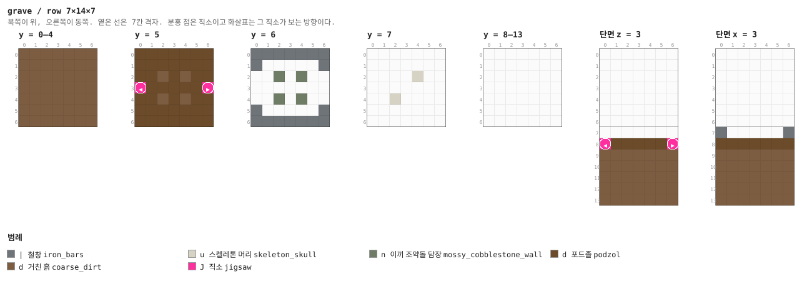

<details><summary>층별 지도 (텍스트)</summary>

```
y = 0–4   x →동, z ↓남
  ddddddd
  ddddddd
  ddddddd
  ddddddd
  ddddddd
  ddddddd
  ddddddd
y = 5   x →동, z ↓남
  ddddddd
  ddddddd
  ddddddd
  JdddddJ
  ddddddd
  ddddddd
  ddddddd
y = 6   x →동, z ↓남
  |||||||
  |.....|
  ..n.n..
  .......
  ..n.n..
  |.....|
  |||||||
y = 7   x →동, z ↓남
  .......
  .......
  ....u..
  .......
  ..u....
  .......
  .......
y = 8–13   x →동, z ↓남
  .......
  .......
  .......
  .......
  .......
  .......
  .......
```

</details>

<details><summary>세로 단면 (텍스트)</summary>

```
단면 z = 3   x →동, y ↑하늘
  .......
  .......
  .......
  .......
  .......
  .......
  .......
  .......
  JdddddJ
  ddddddd
  ddddddd
  ddddddd
  ddddddd
  ddddddd
단면 x = 3   z →남, y ↑하늘
  .......
  .......
  .......
  .......
  .......
  .......
  .......
  |.....|
  ddddddd
  ddddddd
  ddddddd
  ddddddd
  ddddddd
  ddddddd
```

</details>


### `plot_corner` — 7×14×7 — 1×2×1 셀

꺾이는 묘역. 묘비가 한 줄로 서 있다.

**어느 풀에 있나** — `plots` (가중치 8)

| 직소 위치 | 향 | name | target | pool |
|---|---|---|---|---|
| (0, 5, 3) | ◀ 서 | `grv_path` | `grv_path` | `grave/plots` |
| (3, 5, 6) | ▼ 남 | `grv_path` | `grv_path` | `grave/plots` |

**뚫린 면** — 서: z 0–6, y 6–13 (52칸) / 동: z 0–6, y 7–13 (49칸) / 북: x 0–6, y 7–13 (49칸) / 남: x 0–6, y 6–13 (52칸) / 위: x 0–6, z 0–6 (49칸)

**블록** — 거친 흙 245, 포드졸 47, 철창 18, 이끼 조약돌 담장 3, 직소 2, 죽은 나무 1

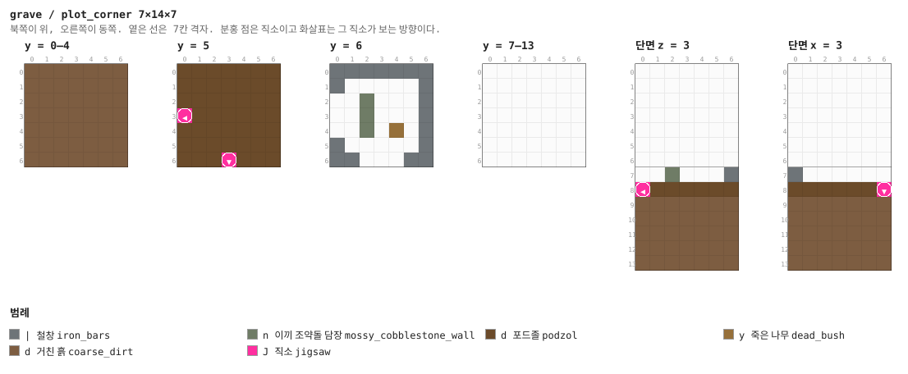

<details><summary>층별 지도 (텍스트)</summary>

```
y = 0–4   x →동, z ↓남
  ddddddd
  ddddddd
  ddddddd
  ddddddd
  ddddddd
  ddddddd
  ddddddd
y = 5   x →동, z ↓남
  ddddddd
  ddddddd
  ddddddd
  Jdddddd
  ddddddd
  ddddddd
  dddJddd
y = 6   x →동, z ↓남
  |||||||
  |.....|
  ..n...|
  ..n...|
  ..n.y.|
  |.....|
  ||...||
y = 7–13   x →동, z ↓남
  .......
  .......
  .......
  .......
  .......
  .......
  .......
```

</details>

<details><summary>세로 단면 (텍스트)</summary>

```
단면 z = 3   x →동, y ↑하늘
  .......
  .......
  .......
  .......
  .......
  .......
  .......
  ..n...|
  Jdddddd
  ddddddd
  ddddddd
  ddddddd
  ddddddd
  ddddddd
단면 x = 3   z →남, y ↑하늘
  .......
  .......
  .......
  .......
  .......
  .......
  .......
  |......
  ddddddJ
  ddddddd
  ddddddd
  ddddddd
  ddddddd
  ddddddd
```

</details>


### `plot_cross` — 7×14×7 — 1×2×1 셀

자갈 갈림길. 가운데 창백한 참나무 기둥 위에 영혼 랜턴.

**어느 풀에 있나** — `plots` (가중치 6)

| 직소 위치 | 향 | name | target | pool |
|---|---|---|---|---|
| (3, 5, 0) | ▲ 북 | `grv_path` | `grv_path` | `grave/plots` |
| (0, 5, 3) | ◀ 서 | `grv_path` | `grv_path` | `grave/plots` |
| (6, 5, 3) | ▶ 동 | `grv_path` | `grv_path` | `grave/plots` |
| (3, 5, 6) | ▼ 남 | `grv_path` | `grv_path` | `grave/plots` |

**뚫린 면** — 서: z 0–6, y 6–13 (52칸) / 동: z 0–6, y 6–13 (52칸) / 북: x 0–6, y 6–13 (52칸) / 남: x 0–6, y 6–13 (52칸) / 위: x 0–6, z 0–6 (49칸)

**블록** — 거친 흙 245, 자갈 25, 포드졸 20, 철창 12, 직소 4, 창백한 참나무 원목 2, 영혼 랜턴 1

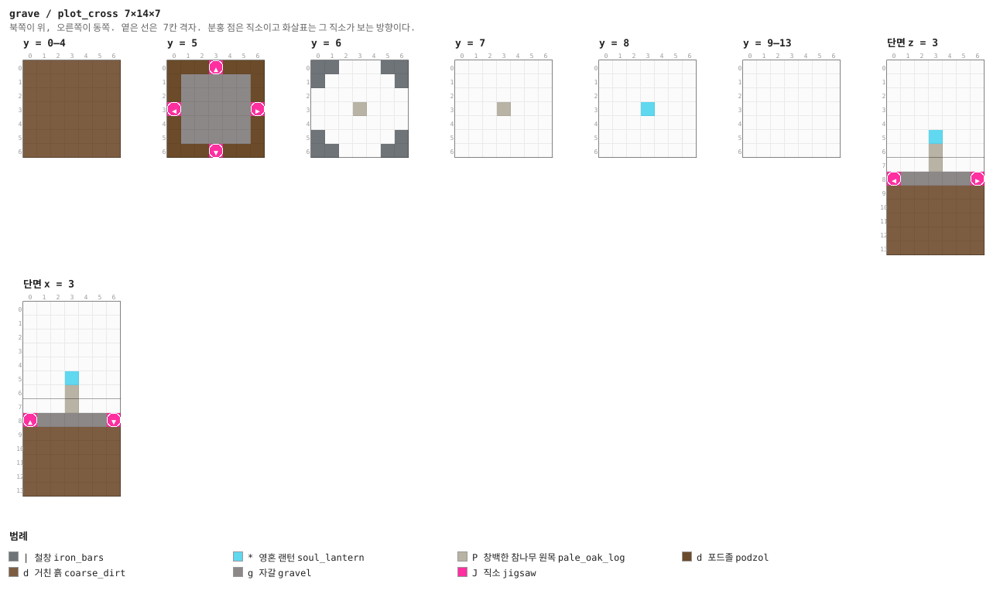

<details><summary>층별 지도 (텍스트)</summary>

```
y = 0–4   x →동, z ↓남
  ddddddd
  ddddddd
  ddddddd
  ddddddd
  ddddddd
  ddddddd
  ddddddd
y = 5   x →동, z ↓남
  dddJddd
  dgggggd
  dgggggd
  JgggggJ
  dgggggd
  dgggggd
  dddJddd
y = 6   x →동, z ↓남
  ||...||
  |.....|
  .......
  ...P...
  .......
  |.....|
  ||...||
y = 7   x →동, z ↓남
  .......
  .......
  .......
  ...P...
  .......
  .......
  .......
y = 8   x →동, z ↓남
  .......
  .......
  .......
  ...*...
  .......
  .......
  .......
y = 9–13   x →동, z ↓남
  .......
  .......
  .......
  .......
  .......
  .......
  .......
```

</details>

<details><summary>세로 단면 (텍스트)</summary>

```
단면 z = 3   x →동, y ↑하늘
  .......
  .......
  .......
  .......
  .......
  ...*...
  ...P...
  ...P...
  JgggggJ
  ddddddd
  ddddddd
  ddddddd
  ddddddd
  ddddddd
단면 x = 3   z →남, y ↑하늘
  .......
  .......
  .......
  .......
  .......
  ...*...
  ...P...
  ...P...
  JgggggJ
  ddddddd
  ddddddd
  ddddddd
  ddddddd
  ddddddd
```

</details>


### `open_grave` — 7×14×7 — 1×2×1 셀

파헤쳐진 무덤. 한 칸 파인 구덩이 안에 스켈레톤 스포너가 있다. **밟아서 터지는 것이 아니라
그냥 파여 있는 것**이라 §12에 걸리지 않는다.

**어느 풀에 있나** — `plots` (가중치 6)

| 직소 위치 | 향 | name | target | pool |
|---|---|---|---|---|
| (0, 5, 3) | ◀ 서 | `grv_path` | `grv_path` | `grave/plots` |
| (6, 5, 3) | ▶ 동 | `grv_path` | `grv_path` | `grave/plots` |

**뚫린 면** — 서: z 0–6, y 6–13 (52칸) / 동: z 0–6, y 6–13 (52칸) / 북: x 0–6, y 7–13 (49칸) / 남: x 0–6, y 7–13 (49칸) / 위: x 0–6, z 0–6 (49칸)

**블록** — 거친 흙 227, 포드졸 38, 철창 18, 조약돌 9, 직소 2, 죽은 나무 1, 몬스터 스포너 1, 이끼 조약돌 담장 1

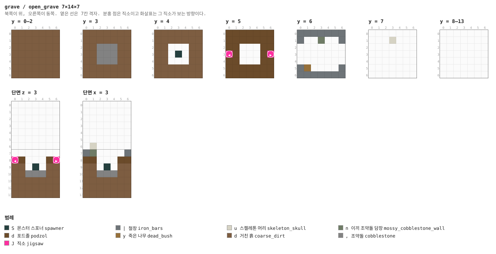

<details><summary>층별 지도 (텍스트)</summary>

```
y = 0–2   x →동, z ↓남
  ddddddd
  ddddddd
  ddddddd
  ddddddd
  ddddddd
  ddddddd
  ddddddd
y = 3   x →동, z ↓남
  ddddddd
  ddddddd
  dd,,,dd
  dd,,,dd
  dd,,,dd
  ddddddd
  ddddddd
y = 4   x →동, z ↓남
  ddddddd
  ddddddd
  dd...dd
  dd.S.dd
  dd...dd
  ddddddd
  ddddddd
y = 5   x →동, z ↓남
  ddddddd
  ddddddd
  dd...dd
  Jd...dJ
  dd...dd
  ddddddd
  ddddddd
y = 6   x →동, z ↓남
  |||||||
  |..n..|
  .......
  .......
  .......
  |y....|
  |||||||
y = 7   x →동, z ↓남
  .......
  ...u...
  .......
  .......
  .......
  .......
  .......
y = 8–13   x →동, z ↓남
  .......
  .......
  .......
  .......
  .......
  .......
  .......
```

</details>

<details><summary>세로 단면 (텍스트)</summary>

```
단면 z = 3   x →동, y ↑하늘
  .......
  .......
  .......
  .......
  .......
  .......
  .......
  .......
  Jd...dJ
  dd.S.dd
  dd,,,dd
  ddddddd
  ddddddd
  ddddddd
단면 x = 3   z →남, y ↑하늘
  .......
  .......
  .......
  .......
  .......
  .......
  .u.....
  |n....|
  dd...dd
  dd.S.dd
  dd,,,dd
  ddddddd
  ddddddd
  ddddddd
```

</details>


### `tomb` — 7×14×7 — 1×2×1 셀

작은 석실. 문이 하나뿐이니 상자를 준다(`chests/grave_tomb`).

**어느 풀에 있나** — `plots` (가중치 6)

| 직소 위치 | 향 | name | target | pool |
|---|---|---|---|---|
| (0, 5, 3) | ◀ 서 | `grv_path` | `grv_path` | `grave/plots` |

**뚫린 면** — 서: z 0–6, y 6–13 (52칸) / 동: z 0–6, y 7–13 (49칸) / 북: x 0–6, y 7–13 (49칸) / 남: x 0–6, y 7–13 (49칸) / 위: x 0–6, z 0–6 (49칸)

**블록** — 거친 흙 245, 조약돌 64, 포드졸 48, 돌벽돌 25, 철창 21, 직소 1, 뼈 블록 1, 검은 양초 1

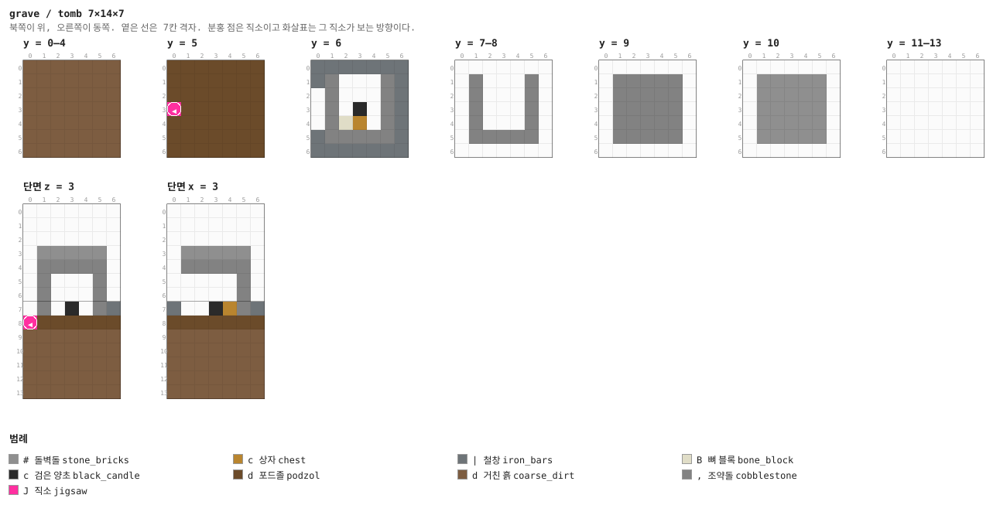

<details><summary>층별 지도 (텍스트)</summary>

```
y = 0–4   x →동, z ↓남
  ddddddd
  ddddddd
  ddddddd
  ddddddd
  ddddddd
  ddddddd
  ddddddd
y = 5   x →동, z ↓남
  ddddddd
  ddddddd
  ddddddd
  Jdddddd
  ddddddd
  ddddddd
  ddddddd
y = 6   x →동, z ↓남
  |||||||
  |,...,|
  .,...,|
  .,.c.,|
  .,Bc.,|
  |,,,,,|
  |||||||
y = 7–8   x →동, z ↓남
  .......
  .,...,.
  .,...,.
  .,...,.
  .,...,.
  .,,,,,.
  .......
y = 9   x →동, z ↓남
  .......
  .,,,,,.
  .,,,,,.
  .,,,,,.
  .,,,,,.
  .,,,,,.
  .......
y = 10   x →동, z ↓남
  .......
  .#####.
  .#####.
  .#####.
  .#####.
  .#####.
  .......
y = 11–13   x →동, z ↓남
  .......
  .......
  .......
  .......
  .......
  .......
  .......
```

</details>

<details><summary>세로 단면 (텍스트)</summary>

```
단면 z = 3   x →동, y ↑하늘
  .......
  .......
  .......
  .#####.
  .,,,,,.
  .,...,.
  .,...,.
  .,.c.,|
  Jdddddd
  ddddddd
  ddddddd
  ddddddd
  ddddddd
  ddddddd
단면 x = 3   z →남, y ↑하늘
  .......
  .......
  .......
  .#####.
  .,,,,,.
  .....,.
  .....,.
  |..cc,|
  ddddddd
  ddddddd
  ddddddd
  ddddddd
  ddddddd
  ddddddd
```

</details>


### `tree` — 7×14×7 — 1×2×1 셀

창백한 죽은 나무와 늘어진 이끼. 줄기 속에 **삐걱 심장**이 있다 — 창백한 참나무가 둘러야
깨어나므로 대개는 옹이지만, 깨어나면 이 묘지의 밤이 달라진다.

**어느 풀에 있나** — `plots` (가중치 6)

| 직소 위치 | 향 | name | target | pool |
|---|---|---|---|---|
| (0, 5, 3) | ◀ 서 | `grv_path` | `grv_path` | `grave/plots` |
| (6, 5, 3) | ▶ 동 | `grv_path` | `grv_path` | `grave/plots` |

**뚫린 면** — 서: z 0–6, y 6–13 (52칸) / 동: z 0–6, y 6–13 (52칸) / 북: x 0–6, y 7–13 (49칸) / 남: x 0–6, y 7–13 (49칸) / 위: x 0–6, z 0–6 (49칸)

**블록** — 거친 흙 245, 포드졸 47, 철창 18, 창백한 참나무 원목 8, 창백한 이끼 4, 직소 2, 삐걱 심장 1

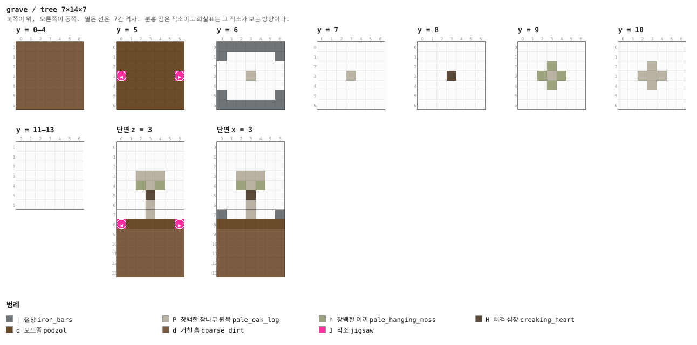

<details><summary>층별 지도 (텍스트)</summary>

```
y = 0–4   x →동, z ↓남
  ddddddd
  ddddddd
  ddddddd
  ddddddd
  ddddddd
  ddddddd
  ddddddd
y = 5   x →동, z ↓남
  ddddddd
  ddddddd
  ddddddd
  JdddddJ
  ddddddd
  ddddddd
  ddddddd
y = 6   x →동, z ↓남
  |||||||
  |.....|
  .......
  ...P...
  .......
  |.....|
  |||||||
y = 7   x →동, z ↓남
  .......
  .......
  .......
  ...P...
  .......
  .......
  .......
y = 8   x →동, z ↓남
  .......
  .......
  .......
  ...H...
  .......
  .......
  .......
y = 9   x →동, z ↓남
  .......
  .......
  ...h...
  ..hPh..
  ...h...
  .......
  .......
y = 10   x →동, z ↓남
  .......
  .......
  ...P...
  ..PPP..
  ...P...
  .......
  .......
y = 11–13   x →동, z ↓남
  .......
  .......
  .......
  .......
  .......
  .......
  .......
```

</details>

<details><summary>세로 단면 (텍스트)</summary>

```
단면 z = 3   x →동, y ↑하늘
  .......
  .......
  .......
  ..PPP..
  ..hPh..
  ...H...
  ...P...
  ...P...
  JdddddJ
  ddddddd
  ddddddd
  ddddddd
  ddddddd
  ddddddd
단면 x = 3   z →남, y ↑하늘
  .......
  .......
  .......
  ..PPP..
  ..hPh..
  ...H...
  ...P...
  |..P..|
  ddddddd
  ddddddd
  ddddddd
  ddddddd
  ddddddd
  ddddddd
```

</details>


### `shrine` — 7×14×7 — 1×2×1 셀

작은 제단과 상자. 구석에 거미줄.

**어느 풀에 있나** — `plots` (가중치 5)

| 직소 위치 | 향 | name | target | pool |
|---|---|---|---|---|
| (0, 5, 3) | ◀ 서 | `grv_path` | `grv_path` | `grave/plots` |

**뚫린 면** — 서: z 0–6, y 6–13 (52칸) / 동: z 0–6, y 7–13 (49칸) / 북: x 0–6, y 7–13 (49칸) / 남: x 0–6, y 7–13 (49칸) / 위: x 0–6, z 0–6 (49칸)

**블록** — 거친 흙 245, 포드졸 48, 철창 21, 돌벽돌 9, 직소 1, 거미줄 1, 조각한 돌벽돌 1, 검은 양초 1

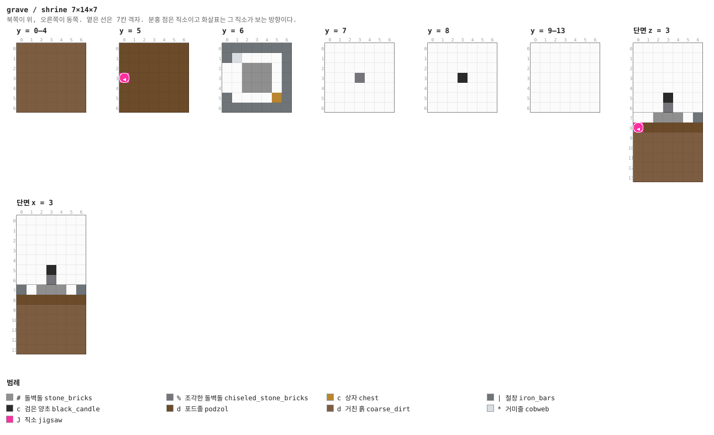

<details><summary>층별 지도 (텍스트)</summary>

```
y = 0–4   x →동, z ↓남
  ddddddd
  ddddddd
  ddddddd
  ddddddd
  ddddddd
  ddddddd
  ddddddd
y = 5   x →동, z ↓남
  ddddddd
  ddddddd
  ddddddd
  Jdddddd
  ddddddd
  ddddddd
  ddddddd
y = 6   x →동, z ↓남
  |||||||
  |*....|
  ..###.|
  ..###.|
  ..###.|
  |....c|
  |||||||
y = 7   x →동, z ↓남
  .......
  .......
  .......
  ...%...
  .......
  .......
  .......
y = 8   x →동, z ↓남
  .......
  .......
  .......
  ...c...
  .......
  .......
  .......
y = 9–13   x →동, z ↓남
  .......
  .......
  .......
  .......
  .......
  .......
  .......
```

</details>

<details><summary>세로 단면 (텍스트)</summary>

```
단면 z = 3   x →동, y ↑하늘
  .......
  .......
  .......
  .......
  .......
  ...c...
  ...%...
  ..###.|
  Jdddddd
  ddddddd
  ddddddd
  ddddddd
  ddddddd
  ddddddd
단면 x = 3   z →남, y ↑하늘
  .......
  .......
  .......
  .......
  .......
  ...c...
  ...%...
  |.###.|
  ddddddd
  ddddddd
  ddddddd
  ddddddd
  ddddddd
  ddddddd
```

</details>


### `watch` — 7×14×7 — 1×2×1 셀

자갈이 깔린 갈림길 가운데 좀비 스포너. 지나가는 자리다.

**어느 풀에 있나** — `plots` (가중치 5)

| 직소 위치 | 향 | name | target | pool |
|---|---|---|---|---|
| (3, 5, 0) | ▲ 북 | `grv_path` | `grv_path` | `grave/plots` |
| (0, 5, 3) | ◀ 서 | `grv_path` | `grv_path` | `grave/plots` |
| (6, 5, 3) | ▶ 동 | `grv_path` | `grv_path` | `grave/plots` |
| (3, 5, 6) | ▼ 남 | `grv_path` | `grv_path` | `grave/plots` |

**뚫린 면** — 서: z 0–6, y 6–13 (52칸) / 동: z 0–6, y 6–13 (52칸) / 북: x 0–6, y 6–13 (52칸) / 남: x 0–6, y 6–13 (52칸) / 위: x 0–6, z 0–6 (49칸)

**블록** — 거친 흙 245, 자갈 25, 포드졸 20, 철창 12, 직소 4, 이끼 조약돌 담장 2, 몬스터 스포너 1

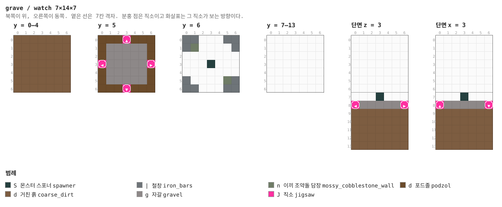

<details><summary>층별 지도 (텍스트)</summary>

```
y = 0–4   x →동, z ↓남
  ddddddd
  ddddddd
  ddddddd
  ddddddd
  ddddddd
  ddddddd
  ddddddd
y = 5   x →동, z ↓남
  dddJddd
  dgggggd
  dgggggd
  JgggggJ
  dgggggd
  dgggggd
  dddJddd
y = 6   x →동, z ↓남
  ||...||
  |n....|
  .......
  ...S...
  .......
  |....n|
  ||...||
y = 7–13   x →동, z ↓남
  .......
  .......
  .......
  .......
  .......
  .......
  .......
```

</details>

<details><summary>세로 단면 (텍스트)</summary>

```
단면 z = 3   x →동, y ↑하늘
  .......
  .......
  .......
  .......
  .......
  .......
  .......
  ...S...
  JgggggJ
  ddddddd
  ddddddd
  ddddddd
  ddddddd
  ddddddd
단면 x = 3   z →남, y ↑하늘
  .......
  .......
  .......
  .......
  .......
  .......
  .......
  ...S...
  JgggggJ
  ddddddd
  ddddddd
  ddddddd
  ddddddd
  ddddddd
```

</details>


### `plot_cap` — 1×14×7

**철 울타리 한 장.** 묘역 풀의 fallback이다. 두께가 1이라 최대 깊이에서도 거의 항상 들어가고,
그래서 허공에서 끊기는 묘역이 없다 (§4).

**어느 풀에 있나** — `plot_caps` (가중치 1)

| 직소 위치 | 향 | name | target | pool |
|---|---|---|---|---|
| (0, 5, 3) | ◀ 서 | `grv_path` | `grv_path` | `grave/plot_caps` |

**뚫린 면** — 서: z 0–6, y 7–13 (49칸) / 동: z 0–6, y 7–13 (49칸) / 북: x 0–0, y 7–13 (7칸) / 남: x 0–0, y 7–13 (7칸) / 위: x 0–0, z 0–6 (7칸)

**블록** — 거친 흙 35, 철창 7, 포드졸 6, 직소 1

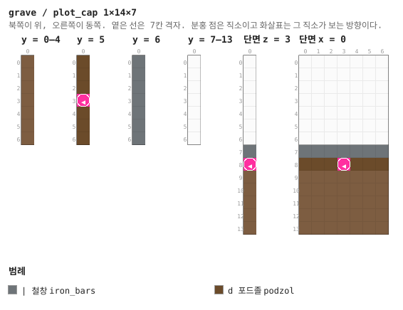

<details><summary>층별 지도 (텍스트)</summary>

```
y = 0–4   x →동, z ↓남
  d
  d
  d
  d
  d
  d
  d
y = 5   x →동, z ↓남
  d
  d
  d
  J
  d
  d
  d
y = 6   x →동, z ↓남
  |
  |
  |
  |
  |
  |
  |
y = 7–13   x →동, z ↓남
  .
  .
  .
  .
  .
  .
  .
```

</details>

<details><summary>세로 단면 (텍스트)</summary>

```
단면 z = 3   x →동, y ↑하늘
  .
  .
  .
  .
  .
  .
  .
  |
  J
  d
  d
  d
  d
  d
단면 x = 0   z →남, y ↑하늘
  .......
  .......
  .......
  .......
  .......
  .......
  .......
  |||||||
  dddJddd
  ddddddd
  ddddddd
  ddddddd
  ddddddd
  ddddddd
```

</details>


### `shaft` — 7×28×7 — 1×4×1 셀

예배당 바닥에서 바위 속으로 28칸. 껍질이 돌과 안산암이라 드러나도 지층으로 보인다.

**어느 풀에 있나** — `down` (가중치 1)

| 직소 위치 | 향 | name | target | pool |
|---|---|---|---|---|
| (3, 0, 4) | ◇ 아래 | `grv_crypt` | `grv_crypt` | `grave/crypt_first` |
| (3, 27, 4) | ◆ 위 | `grv_down` | `grv_down` | `—` |

**블록** — 돌 1062, 안산암 280, 사다리 28, 직소 2

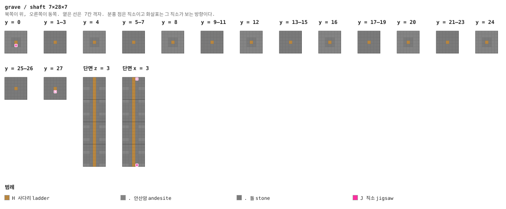

<details><summary>층별 지도 (텍스트)</summary>

```
y = 0   x →동, z ↓남
  .......
  .......
  .......
  ...H...
  ...J...
  .......
  .......
y = 1–3   x →동, z ↓남
  .......
  .......
  .......
  ...H...
  .......
  .......
  .......
y = 4   x →동, z ↓남
  .......
  .......
  .......
  ...H...
  .......
  .......
  .......
y = 5–7   x →동, z ↓남
  .......
  .......
  .......
  ...H...
  .......
  .......
  .......
y = 8   x →동, z ↓남
  .......
  .......
  .......
  ...H...
  .......
  .......
  .......
y = 9–11   x →동, z ↓남
  .......
  .......
  .......
  ...H...
  .......
  .......
  .......
y = 12   x →동, z ↓남
  .......
  .......
  .......
  ...H...
  .......
  .......
  .......
y = 13–15   x →동, z ↓남
  .......
  .......
  .......
  ...H...
  .......
  .......
  .......
y = 16   x →동, z ↓남
  .......
  .......
  .......
  ...H...
  .......
  .......
  .......
y = 17–19   x →동, z ↓남
  .......
  .......
  .......
  ...H...
  .......
  .......
  .......
y = 20   x →동, z ↓남
  .......
  .......
  .......
  ...H...
  .......
  .......
  .......
y = 21–23   x →동, z ↓남
  .......
  .......
  .......
  ...H...
  .......
  .......
  .......
y = 24   x →동, z ↓남
  .......
  .......
  .......
  ...H...
  .......
  .......
  .......
y = 25–26   x →동, z ↓남
  .......
  .......
  .......
  ...H...
  .......
  .......
  .......
y = 27   x →동, z ↓남
  .......
  .......
  .......
  ...H...
  ...J...
  .......
  .......
```

</details>

<details><summary>세로 단면 (텍스트)</summary>

```
단면 z = 3   x →동, y ↑하늘
  ...H...
  ...H...
  ...H...
  ...H...
  ...H...
  ...H...
  ...H...
  ...H...
  ...H...
  ...H...
  ...H...
  ...H...
  ...H...
  ...H...
  ...H...
  ...H...
  ...H...
  ...H...
  ...H...
  ...H...
  ...H...
  ...H...
  ...H...
  ...H...
  ...H...
  ...H...
  ...H...
  ...H...
단면 x = 3   z →남, y ↑하늘
  ...HJ..
  ...H...
  ...H...
  ...H...
  ...H...
  ...H...
  ...H...
  ...H...
  ...H...
  ...H...
  ...H...
  ...H...
  ...H...
  ...H...
  ...H...
  ...H...
  ...H...
  ...H...
  ...H...
  ...H...
  ...H...
  ...H...
  ...H...
  ...H...
  ...H...
  ...H...
  ...H...
  ...HJ..
```

</details>


### `crypt_hub` — 7×7×7 — 1×1×1 셀

사다리가 닿는 방. 서·북문이 납골당으로, **남문 하나만** `grv_captain`을 target으로 삼아 보스
사슬을 부른다. 사다리가 방 한가운데라 돌벽돌 기둥을 세우고 직소를 그 안에 넣었다 (§24).

**어느 풀에 있나** — `crypt_first` (가중치 1)

| 직소 위치 | 향 | name | target | pool |
|---|---|---|---|---|
| (3, 0, 0) | ▲ 북 | `grv_crypt` | `grv_crypt` | `grave/crypts` |
| (0, 0, 3) | ◀ 서 | `grv_crypt` | `grv_crypt` | `grave/crypts` |
| (3, 0, 6) | ▼ 남 | `grv_crypt` | `grv_captain` | `grave/captain_approach_1` |
| (3, 6, 4) | ◆ 위 | `grv_crypt` | `grv_crypt` | `—` |

**뚫린 면** — 서: z 2–4, y 1–4 (12칸) / 북: x 2–4, y 1–4 (12칸) / 남: x 2–4, y 1–4 (12칸)

**블록** — 돌 116, 이끼 낀 돌벽돌 46, 안산암 15, 사다리 6, 돌벽돌 5, 직소 4, 검은 양초 1

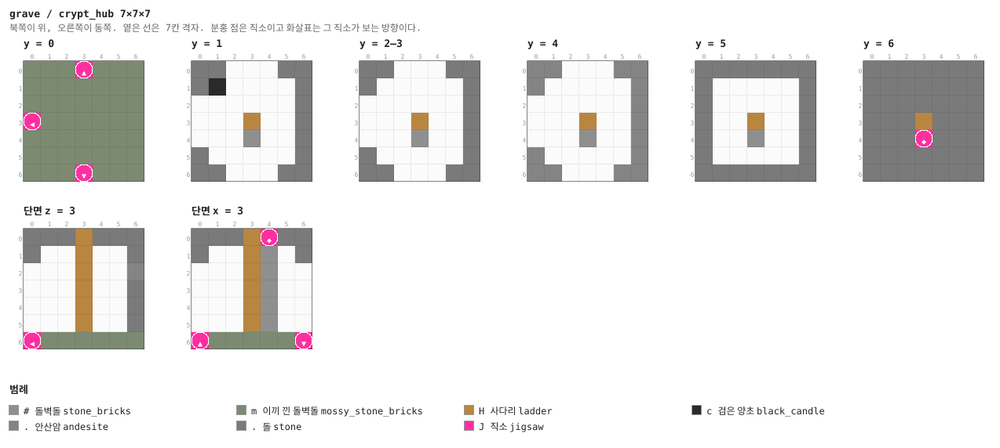

<details><summary>층별 지도 (텍스트)</summary>

```
y = 0   x →동, z ↓남
  mmmJmmm
  mmmmmmm
  mmmmmmm
  Jmmmmmm
  mmmmmmm
  mmmmmmm
  mmmJmmm
y = 1   x →동, z ↓남
  .......
  .c.....
  .......
  ...H...
  ...#...
  .......
  .......
y = 2–3   x →동, z ↓남
  .......
  .......
  .......
  ...H...
  ...#...
  .......
  .......
y = 4   x →동, z ↓남
  .......
  .......
  .......
  ...H...
  ...#...
  .......
  .......
y = 5   x →동, z ↓남
  .......
  .......
  .......
  ...H...
  ...#...
  .......
  .......
y = 6   x →동, z ↓남
  .......
  .......
  .......
  ...H...
  ...J...
  .......
  .......
```

</details>


### `passage` — 7×7×7 — 1×1×1 셀

납골당의 기본 단위. 바위를 파낸 통로다.

**어느 풀에 있나** — `crypts` (가중치 10)

| 직소 위치 | 향 | name | target | pool |
|---|---|---|---|---|
| (0, 0, 3) | ◀ 서 | `grv_crypt` | `grv_crypt` | `grave/crypts` |
| (6, 0, 3) | ▶ 동 | `grv_crypt` | `grv_crypt` | `grave/crypts` |

**뚫린 면** — 서: z 2–4, y 1–4 (12칸) / 동: z 2–4, y 1–4 (12칸)

**블록** — 돌 127, 이끼 낀 돌벽돌 47, 안산암 18, 직소 2

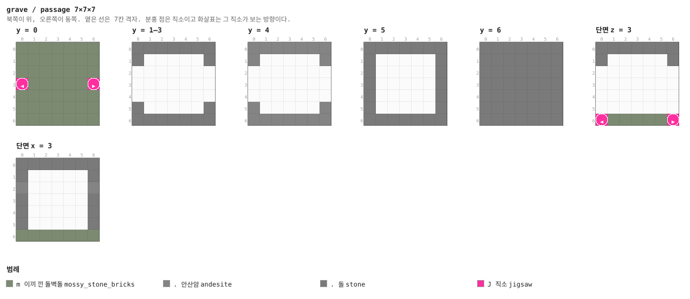

<details><summary>층별 지도 (텍스트)</summary>

```
y = 0   x →동, z ↓남
  mmmmmmm
  mmmmmmm
  mmmmmmm
  JmmmmmJ
  mmmmmmm
  mmmmmmm
  mmmmmmm
y = 1–3   x →동, z ↓남
  .......
  .......
  .......
  .......
  .......
  .......
  .......
y = 4   x →동, z ↓남
  .......
  .......
  .......
  .......
  .......
  .......
  .......
y = 5   x →동, z ↓남
  .......
  .......
  .......
  .......
  .......
  .......
  .......
y = 6   x →동, z ↓남
  .......
  .......
  .......
  .......
  .......
  .......
  .......
```

</details>


### `corner` — 7×7×7 — 1×1×1 셀

꺾이는 통로.

**어느 풀에 있나** — `crypts` (가중치 9)

| 직소 위치 | 향 | name | target | pool |
|---|---|---|---|---|
| (0, 0, 3) | ◀ 서 | `grv_crypt` | `grv_crypt` | `grave/crypts` |
| (3, 0, 6) | ▼ 남 | `grv_crypt` | `grv_crypt` | `grave/crypts` |

**뚫린 면** — 서: z 2–4, y 1–4 (12칸) / 남: x 2–4, y 1–4 (12칸)

**블록** — 돌 127, 이끼 낀 돌벽돌 47, 안산암 18, 직소 2

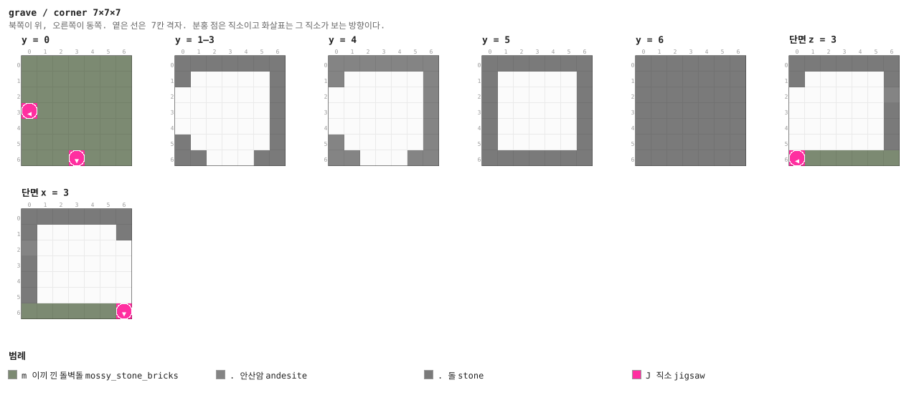

<details><summary>층별 지도 (텍스트)</summary>

```
y = 0   x →동, z ↓남
  mmmmmmm
  mmmmmmm
  mmmmmmm
  Jmmmmmm
  mmmmmmm
  mmmmmmm
  mmmJmmm
y = 1–3   x →동, z ↓남
  .......
  .......
  .......
  .......
  .......
  .......
  .......
y = 4   x →동, z ↓남
  .......
  .......
  .......
  .......
  .......
  .......
  .......
y = 5   x →동, z ↓남
  .......
  .......
  .......
  .......
  .......
  .......
  .......
y = 6   x →동, z ↓남
  .......
  .......
  .......
  .......
  .......
  .......
  .......
```

</details>


### `cross` — 7×7×7 — 1×1×1 셀

십자 교차로.

**어느 풀에 있나** — `crypts` (가중치 4)

| 직소 위치 | 향 | name | target | pool |
|---|---|---|---|---|
| (3, 0, 0) | ▲ 북 | `grv_crypt` | `grv_crypt` | `grave/crypts` |
| (0, 0, 3) | ◀ 서 | `grv_crypt` | `grv_crypt` | `grave/crypts` |
| (6, 0, 3) | ▶ 동 | `grv_crypt` | `grv_crypt` | `grave/crypts` |
| (3, 0, 6) | ▼ 남 | `grv_crypt` | `grv_crypt` | `grave/crypts` |

**뚫린 면** — 서: z 2–4, y 1–4 (12칸) / 동: z 2–4, y 1–4 (12칸) / 북: x 2–4, y 1–4 (12칸) / 남: x 2–4, y 1–4 (12칸)

**블록** — 돌 109, 이끼 낀 돌벽돌 45, 안산암 12, 직소 4

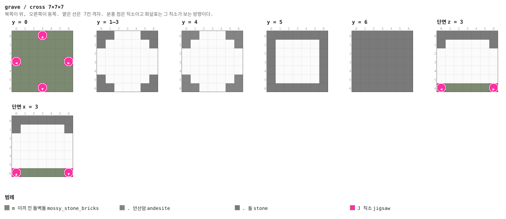

<details><summary>층별 지도 (텍스트)</summary>

```
y = 0   x →동, z ↓남
  mmmJmmm
  mmmmmmm
  mmmmmmm
  JmmmmmJ
  mmmmmmm
  mmmmmmm
  mmmJmmm
y = 1–3   x →동, z ↓남
  .......
  .......
  .......
  .......
  .......
  .......
  .......
y = 4   x →동, z ↓남
  .......
  .......
  .......
  .......
  .......
  .......
  .......
y = 5   x →동, z ↓남
  .......
  .......
  .......
  .......
  .......
  .......
  .......
y = 6   x →동, z ↓남
  .......
  .......
  .......
  .......
  .......
  .......
  .......
```

</details>


### `guard` — 7×7×7 — 1×1×1 셀

교차로 한가운데 스켈레톤 스포너와 거미줄.

**어느 풀에 있나** — `crypts` (가중치 5)

| 직소 위치 | 향 | name | target | pool |
|---|---|---|---|---|
| (3, 0, 0) | ▲ 북 | `grv_crypt` | `grv_crypt` | `grave/crypts` |
| (0, 0, 3) | ◀ 서 | `grv_crypt` | `grv_crypt` | `grave/crypts` |
| (6, 0, 3) | ▶ 동 | `grv_crypt` | `grv_crypt` | `grave/crypts` |
| (3, 0, 6) | ▼ 남 | `grv_crypt` | `grv_crypt` | `grave/crypts` |

**뚫린 면** — 서: z 2–4, y 1–4 (12칸) / 동: z 2–4, y 1–4 (12칸) / 북: x 2–4, y 1–4 (12칸) / 남: x 2–4, y 1–4 (12칸)

**블록** — 돌 109, 이끼 낀 돌벽돌 45, 안산암 12, 직소 4, 거미줄 2, 몬스터 스포너 1

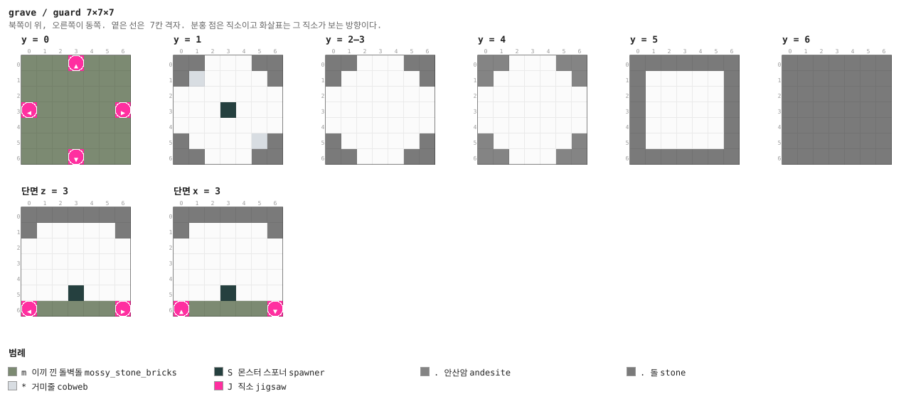

<details><summary>층별 지도 (텍스트)</summary>

```
y = 0   x →동, z ↓남
  mmmJmmm
  mmmmmmm
  mmmmmmm
  JmmmmmJ
  mmmmmmm
  mmmmmmm
  mmmJmmm
y = 1   x →동, z ↓남
  .......
  .*.....
  .......
  ...S...
  .......
  .....*.
  .......
y = 2–3   x →동, z ↓남
  .......
  .......
  .......
  .......
  .......
  .......
  .......
y = 4   x →동, z ↓남
  .......
  .......
  .......
  .......
  .......
  .......
  .......
y = 5   x →동, z ↓남
  .......
  .......
  .......
  .......
  .......
  .......
  .......
y = 6   x →동, z ↓남
  .......
  .......
  .......
  .......
  .......
  .......
  .......
```

</details>


### `niche` — 7×7×7 — 1×1×1 셀

봉안 벽감. 뼈 선반 위에 상자.

**어느 풀에 있나** — `crypts` (가중치 7)

| 직소 위치 | 향 | name | target | pool |
|---|---|---|---|---|
| (0, 0, 3) | ◀ 서 | `grv_crypt` | `grv_crypt` | `grave/crypts` |

**뚫린 면** — 서: z 2–4, y 1–4 (12칸)

**블록** — 돌 136, 이끼 낀 돌벽돌 48, 안산암 21, 뼈 블록 10, 직소 1, 검은 양초 1, 상자 1

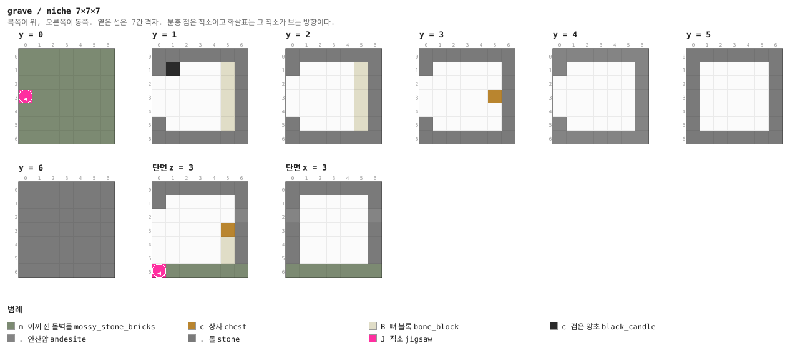

<details><summary>층별 지도 (텍스트)</summary>

```
y = 0   x →동, z ↓남
  mmmmmmm
  mmmmmmm
  mmmmmmm
  Jmmmmmm
  mmmmmmm
  mmmmmmm
  mmmmmmm
y = 1   x →동, z ↓남
  .......
  .c...B.
  .....B.
  .....B.
  .....B.
  .....B.
  .......
y = 2   x →동, z ↓남
  .......
  .....B.
  .....B.
  .....B.
  .....B.
  .....B.
  .......
y = 3   x →동, z ↓남
  .......
  .......
  .......
  .....c.
  .......
  .......
  .......
y = 4   x →동, z ↓남
  .......
  .......
  .......
  .......
  .......
  .......
  .......
y = 5   x →동, z ↓남
  .......
  .......
  .......
  .......
  .......
  .......
  .......
y = 6   x →동, z ↓남
  .......
  .......
  .......
  .......
  .......
  .......
  .......
```

</details>


### `coffin` — 7×7×7 — 1×1×1 셀

봉인된 석관 둘. 하나에는 스켈레톤 스포너가, 하나에는 해골이 놓여 있다. **깨서 여는 것은
플레이어뿐이므로** 트리거 함정이 아니라 선택이다 (§12).

**어느 풀에 있나** — `crypts` (가중치 6)

| 직소 위치 | 향 | name | target | pool |
|---|---|---|---|---|
| (0, 0, 3) | ◀ 서 | `grv_crypt` | `grv_crypt` | `grave/crypts` |
| (6, 0, 3) | ▶ 동 | `grv_crypt` | `grv_crypt` | `grave/crypts` |

**뚫린 면** — 서: z 2–4, y 1–4 (12칸) / 동: z 2–4, y 1–4 (12칸)

**블록** — 돌 127, 이끼 낀 돌벽돌 47, 안산암 18, 돌벽돌 10, 조각한 돌벽돌 9, 직소 2, 몬스터 스포너 1, 스켈레톤 머리 1

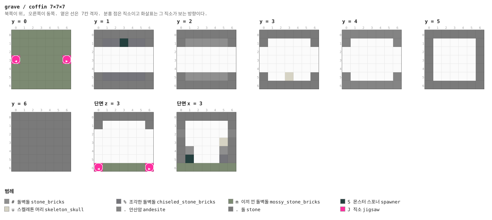

<details><summary>층별 지도 (텍스트)</summary>

```
y = 0   x →동, z ↓남
  mmmmmmm
  mmmmmmm
  mmmmmmm
  JmmmmmJ
  mmmmmmm
  mmmmmmm
  mmmmmmm
y = 1   x →동, z ↓남
  .......
  .%%S%%.
  .......
  .......
  .......
  .%%%%%.
  .......
y = 2   x →동, z ↓남
  .......
  .#####.
  .......
  .......
  .......
  .#####.
  .......
y = 3   x →동, z ↓남
  .......
  .......
  .......
  .......
  .......
  ...u...
  .......
y = 4   x →동, z ↓남
  .......
  .......
  .......
  .......
  .......
  .......
  .......
y = 5   x →동, z ↓남
  .......
  .......
  .......
  .......
  .......
  .......
  .......
y = 6   x →동, z ↓남
  .......
  .......
  .......
  .......
  .......
  .......
  .......
```

</details>


### `ossuary` — 7×7×7 — 1×1×1 셀

양쪽 벽이 뼈 선반. 상자 하나(`chests/grave_crypt`).

**어느 풀에 있나** — `crypts` (가중치 6)

| 직소 위치 | 향 | name | target | pool |
|---|---|---|---|---|
| (0, 0, 3) | ◀ 서 | `grv_crypt` | `grv_crypt` | `grave/crypts` |

**뚫린 면** — 서: z 2–4, y 1–4 (12칸)

**블록** — 돌 136, 이끼 낀 돌벽돌 48, 뼈 블록 30, 안산암 21, 직소 1, 상자 1, 영혼 랜턴 1

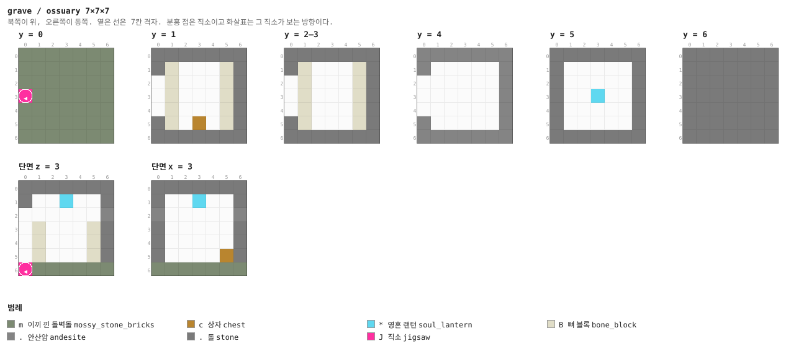

<details><summary>층별 지도 (텍스트)</summary>

```
y = 0   x →동, z ↓남
  mmmmmmm
  mmmmmmm
  mmmmmmm
  Jmmmmmm
  mmmmmmm
  mmmmmmm
  mmmmmmm
y = 1   x →동, z ↓남
  .......
  .B...B.
  .B...B.
  .B...B.
  .B...B.
  .B.c.B.
  .......
y = 2–3   x →동, z ↓남
  .......
  .B...B.
  .B...B.
  .B...B.
  .B...B.
  .B...B.
  .......
y = 4   x →동, z ↓남
  .......
  .......
  .......
  .......
  .......
  .......
  .......
y = 5   x →동, z ↓남
  .......
  .......
  .......
  ...*...
  .......
  .......
  .......
y = 6   x →동, z ↓남
  .......
  .......
  .......
  .......
  .......
  .......
  .......
```

</details>


### `soul` — 7×7×7 — 1×1×1 셀

바닥이 영혼 흙. 걸음이 느려지는 것이 위험이고, 트리거가 아예 없다.

**어느 풀에 있나** — `crypts` (가중치 4)

| 직소 위치 | 향 | name | target | pool |
|---|---|---|---|---|
| (0, 0, 3) | ◀ 서 | `grv_crypt` | `grv_crypt` | `grave/crypts` |
| (6, 0, 3) | ▶ 동 | `grv_crypt` | `grv_crypt` | `grave/crypts` |

**뚫린 면** — 서: z 2–4, y 1–4 (12칸) / 동: z 2–4, y 1–4 (12칸)

**블록** — 돌 127, 영혼 흙 25, 이끼 낀 돌벽돌 22, 안산암 18, 직소 2, 영혼 횃불 2

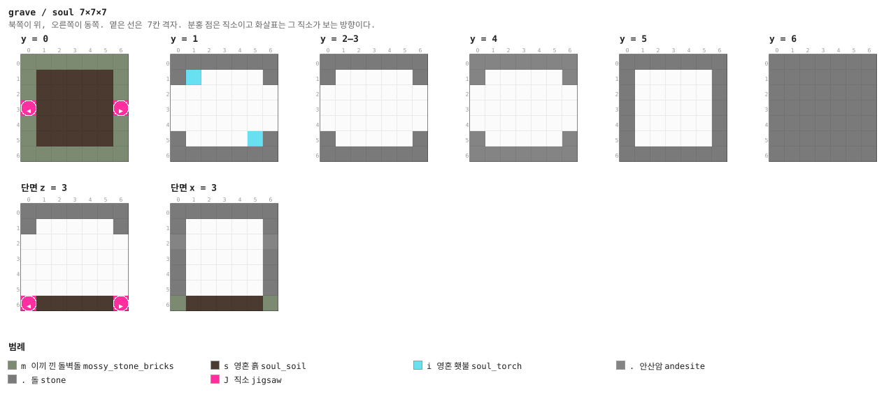

<details><summary>층별 지도 (텍스트)</summary>

```
y = 0   x →동, z ↓남
  mmmmmmm
  msssssm
  msssssm
  JsssssJ
  msssssm
  msssssm
  mmmmmmm
y = 1   x →동, z ↓남
  .......
  .i.....
  .......
  .......
  .......
  .....i.
  .......
y = 2–3   x →동, z ↓남
  .......
  .......
  .......
  .......
  .......
  .......
  .......
y = 4   x →동, z ↓남
  .......
  .......
  .......
  .......
  .......
  .......
  .......
y = 5   x →동, z ↓남
  .......
  .......
  .......
  .......
  .......
  .......
  .......
y = 6   x →동, z ↓남
  .......
  .......
  .......
  .......
  .......
  .......
  .......
```

</details>


### `cap` — 1×7×7

두께 1의 바위 마개. 납골당 풀의 fallback (§4).

**어느 풀에 있나** — `crypt_caps` (가중치 1)

| 직소 위치 | 향 | name | target | pool |
|---|---|---|---|---|
| (0, 0, 3) | ◀ 서 | `grv_crypt` | `grv_crypt` | `grave/crypt_caps` |

**블록** — 돌 35, 안산암 13, 직소 1

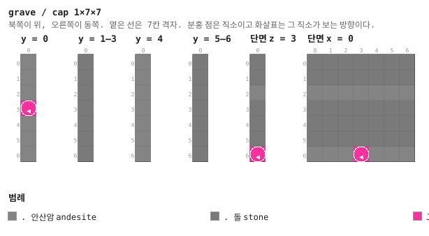

<details><summary>층별 지도 (텍스트)</summary>

```
y = 0   x →동, z ↓남
  .
  .
  .
  J
  .
  .
  .
y = 1–3   x →동, z ↓남
  .
  .
  .
  .
  .
  .
  .
y = 4   x →동, z ↓남
  .
  .
  .
  .
  .
  .
  .
y = 5–6   x →동, z ↓남
  .
  .
  .
  .
  .
  .
  .
```

</details>


### `approach_1` — 7×7×7 — 1×1×1 셀

보스 사슬의 1번째 칸. **서문만 이름이 `grv_captain`**이고 동문의 target이 `grv_captain`이다.
부모는 서문으로만 들어올 수 있어 사슬이 거꾸로 흐르지 않는다 (§13). 북문은 평범한 납골당이라
보스 가지도 방을 낳는다. 우선순위가 10이라 미로보다 먼저 놓인다 (§7).

**어느 풀에 있나** — `captain_approach_1` (가중치 1)

| 직소 위치 | 향 | name | target | pool |
|---|---|---|---|---|
| (3, 0, 0) | ▲ 북 | `grv_crypt` | `grv_crypt` | `grave/crypts` |
| (0, 0, 3) | ◀ 서 | `grv_captain` | `grv_crypt` | `grave/crypts` |
| (6, 0, 3) | ▶ 동 | `grv_crypt` | `grv_captain` | `grave/captain_approach_2` |

**뚫린 면** — 서: z 2–4, y 1–4 (12칸) / 동: z 2–4, y 1–4 (12칸) / 북: x 2–4, y 1–4 (12칸)

**블록** — 돌 118, 이끼 낀 돌벽돌 46, 안산암 15, 직소 3


<details><summary>층별 지도 (텍스트)</summary>

```
y = 0   x →동, z ↓남
  mmmJmmm
  mmmmmmm
  mmmmmmm
  JmmmmmJ
  mmmmmmm
  mmmmmmm
  mmmmmmm
y = 1–3   x →동, z ↓남
  .......
  .......
  .......
  .......
  .......
  .......
  .......
y = 4   x →동, z ↓남
  .......
  .......
  .......
  .......
  .......
  .......
  .......
y = 5   x →동, z ↓남
  .......
  .......
  .......
  .......
  .......
  .......
  .......
y = 6   x →동, z ↓남
  .......
  .......
  .......
  .......
  .......
  .......
  .......
```

</details>


### `approach_2` — 7×7×7 — 1×1×1 셀

보스 사슬의 2번째 칸. **서문만 이름이 `grv_captain`**이고 동문의 target이 `grv_captain`이다.
부모는 서문으로만 들어올 수 있어 사슬이 거꾸로 흐르지 않는다 (§13). 북문은 평범한 납골당이라
보스 가지도 방을 낳는다. 우선순위가 10이라 미로보다 먼저 놓인다 (§7).

**어느 풀에 있나** — `captain_approach_2` (가중치 1)

| 직소 위치 | 향 | name | target | pool |
|---|---|---|---|---|
| (3, 0, 0) | ▲ 북 | `grv_crypt` | `grv_crypt` | `grave/crypts` |
| (0, 0, 3) | ◀ 서 | `grv_captain` | `grv_crypt` | `grave/crypts` |
| (6, 0, 3) | ▶ 동 | `grv_crypt` | `grv_captain` | `grave/captain_approach_3` |

**뚫린 면** — 서: z 2–4, y 1–4 (12칸) / 동: z 2–4, y 1–4 (12칸) / 북: x 2–4, y 1–4 (12칸)

**블록** — 돌 118, 이끼 낀 돌벽돌 46, 안산암 15, 직소 3


<details><summary>층별 지도 (텍스트)</summary>

```
y = 0   x →동, z ↓남
  mmmJmmm
  mmmmmmm
  mmmmmmm
  JmmmmmJ
  mmmmmmm
  mmmmmmm
  mmmmmmm
y = 1–3   x →동, z ↓남
  .......
  .......
  .......
  .......
  .......
  .......
  .......
y = 4   x →동, z ↓남
  .......
  .......
  .......
  .......
  .......
  .......
  .......
y = 5   x →동, z ↓남
  .......
  .......
  .......
  .......
  .......
  .......
  .......
y = 6   x →동, z ↓남
  .......
  .......
  .......
  .......
  .......
  .......
  .......
```

</details>


### `approach_3` — 7×7×7 — 1×1×1 셀

보스 사슬의 3번째 칸. **서문만 이름이 `grv_captain`**이고 동문의 target이 `grv_captain`이다.
부모는 서문으로만 들어올 수 있어 사슬이 거꾸로 흐르지 않는다 (§13). 북문은 평범한 납골당이라
보스 가지도 방을 낳는다. 우선순위가 10이라 미로보다 먼저 놓인다 (§7).

**어느 풀에 있나** — `captain_approach` (가중치 1), `captain_approach_3` (가중치 1)

| 직소 위치 | 향 | name | target | pool |
|---|---|---|---|---|
| (3, 0, 0) | ▲ 북 | `grv_crypt` | `grv_crypt` | `grave/crypts` |
| (0, 0, 3) | ◀ 서 | `grv_captain` | `grv_crypt` | `grave/crypts` |
| (6, 0, 3) | ▶ 동 | `grv_crypt` | `grv_captain` | `grave/captain_approach` |

**뚫린 면** — 서: z 2–4, y 1–4 (12칸) / 동: z 2–4, y 1–4 (12칸) / 북: x 2–4, y 1–4 (12칸)

**블록** — 돌 118, 이끼 낀 돌벽돌 46, 안산암 15, 직소 3

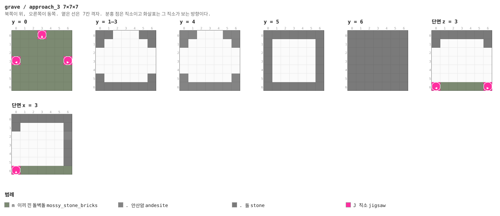

<details><summary>층별 지도 (텍스트)</summary>

```
y = 0   x →동, z ↓남
  mmmJmmm
  mmmmmmm
  mmmmmmm
  JmmmmmJ
  mmmmmmm
  mmmmmmm
  mmmmmmm
y = 1–3   x →동, z ↓남
  .......
  .......
  .......
  .......
  .......
  .......
  .......
y = 4   x →동, z ↓남
  .......
  .......
  .......
  .......
  .......
  .......
  .......
y = 5   x →동, z ↓남
  .......
  .......
  .......
  .......
  .......
  .......
  .......
y = 6   x →동, z ↓남
  .......
  .......
  .......
  .......
  .......
  .......
  .......
```

</details>


### `captain_hall` — 21×14×21 — 3×2×3 셀

21×14×21. 뼈 블록 기둥 넷이 천장을 받치고, 북쪽 단상에 기병대장(스켈레톤, 체력 90, 힘 III·
화염 활) 트라이얼 스포너가 선다. 사분면마다 경비 스포너 넷 — 스켈레톤·좀비, 그리고
**스켈레톤말을 탄 기병**.

남쪽에 **마구간**이 있다. 여기 스포너는 트라이얼이 아니라 평범한 몬스터 스포너이고
`Tame:1` 스켈레톤말을 낸다 — 싸움에 세이지 않으므로 끝나도 남아 있고, 보상의 안장으로
타고 나갈 수 있다.

확정 보상: **수선 책 + 안장 + 마법 부여(20~28) 다이아 장비 1 + 뼈 블록 6~10.**
수선은 마법 부여대가 주지 않는 보물 마법이고, 이 모드에서 여기밖에 없다.

**어느 풀에 있나** — `captain_approach` (가중치 1)

| 직소 위치 | 향 | name | target | pool |
|---|---|---|---|---|
| (0, 0, 10) | ◀ 서 | `grv_captain` | `grv_crypt` | `—` |

**뚫린 면** — 서: z 9–11, y 1–4 (12칸)

**블록** — 돌 1152, 이끼 낀 돌벽돌 440, 안산암 237, 뼈 블록 188, 조각한 돌벽돌 35, 돌벽돌 9, 건초 더미 6, 영혼 랜턴 4

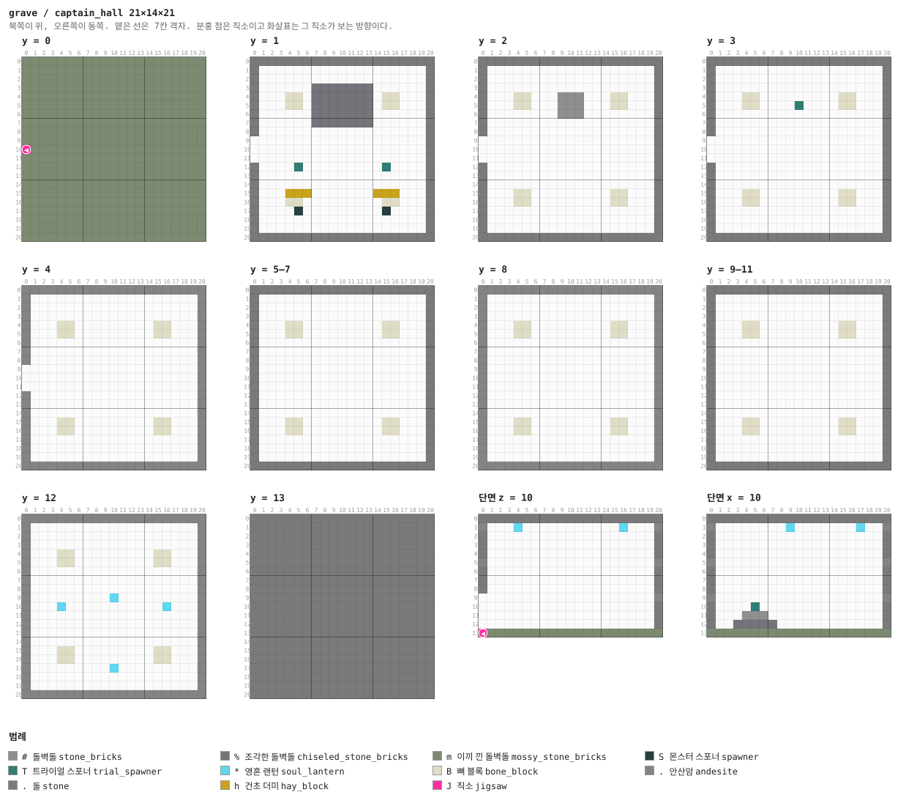

<details><summary>층별 지도 (텍스트)</summary>

```
y = 0   x →동, z ↓남
  mmmmmmmmmmmmmmmmmmmmm
  mmmmmmmmmmmmmmmmmmmmm
  mmmmmmmmmmmmmmmmmmmmm
  mmmmmmmmmmmmmmmmmmmmm
  mmmmmmmmmmmmmmmmmmmmm
  mmmmmmmmmmmmmmmmmmmmm
  mmmmmmmmmmmmmmmmmmmmm
  mmmmmmmmmmmmmmmmmmmmm
  mmmmmmmmmmmmmmmmmmmmm
  mmmmmmmmmmmmmmmmmmmmm
  Jmmmmmmmmmmmmmmmmmmmm
  mmmmmmmmmmmmmmmmmmmmm
  mmmmmmmmmmmmmmmmmmmmm
  mmmmmmmmmmmmmmmmmmmmm
  mmmmmmmmmmmmmmmmmmmmm
  mmmmmmmmmmmmmmmmmmmmm
  mmmmmmmmmmmmmmmmmmmmm
  mmmmmmmmmmmmmmmmmmmmm
  mmmmmmmmmmmmmmmmmmmmm
  mmmmmmmmmmmmmmmmmmmmm
  mmmmmmmmmmmmmmmmmmmmm
y = 1   x →동, z ↓남
  .....................
  .....................
  .....................
  .......%%%%%%%.......
  ....BB.%%%%%%%.BB....
  ....BB.%%%%%%%.BB....
  .......%%%%%%%.......
  .......%%%%%%%.......
  .....................
  .....................
  .....................
  .....................
  .....T.........T.....
  .....................
  .....................
  ....hhh.......hhh....
  ....BB.........BB....
  .....S.........S.....
  .....................
  .....................
  .....................
y = 2   x →동, z ↓남
  .....................
  .....................
  .....................
  .....................
  ....BB...###...BB....
  ....BB...###...BB....
  .........###.........
  .....................
  .....................
  .....................
  .....................
  .....................
  .....................
  .....................
  .....................
  ....BB.........BB....
  ....BB.........BB....
  .....................
  .....................
  .....................
  .....................
y = 3   x →동, z ↓남
  .....................
  .....................
  .....................
  .....................
  ....BB.........BB....
  ....BB....T....BB....
  .....................
  .....................
  .....................
  .....................
  .....................
  .....................
  .....................
  .....................
  .....................
  ....BB.........BB....
  ....BB.........BB....
  .....................
  .....................
  .....................
  .....................
y = 4   x →동, z ↓남
  .....................
  .....................
  .....................
  .....................
  ....BB.........BB....
  ....BB.........BB....
  .....................
  .....................
  .....................
  .....................
  .....................
  .....................
  .....................
  .....................
  .....................
  ....BB.........BB....
  ....BB.........BB....
  .....................
  .....................
  .....................
  .....................
y = 5–7   x →동, z ↓남
  .....................
  .....................
  .....................
  .....................
  ....BB.........BB....
  ....BB.........BB....
  .....................
  .....................
  .....................
  .....................
  .....................
  .....................
  .....................
  .....................
  .....................
  ....BB.........BB....
  ....BB.........BB....
  .....................
  .....................
  .....................
  .....................
y = 8   x →동, z ↓남
  .....................
  .....................
  .....................
  .....................
  ....BB.........BB....
  ....BB.........BB....
  .....................
  .....................
  .....................
  .....................
  .....................
  .....................
  .....................
  .....................
  .....................
  ....BB.........BB....
  ....BB.........BB....
  .....................
  .....................
  .....................
  .....................
y = 9–11   x →동, z ↓남
  .....................
  .....................
  .....................
  .....................
  ....BB.........BB....
  ....BB.........BB....
  .....................
  .....................
  .....................
  .....................
  .....................
  .....................
  .....................
  .....................
  .....................
  ....BB.........BB....
  ....BB.........BB....
  .....................
  .....................
  .....................
  .....................
y = 12   x →동, z ↓남
  .....................
  .....................
  .....................
  .....................
  ....BB.........BB....
  ....BB.........BB....
  .....................
  .....................
  .....................
  ..........*..........
  ....*...........*....
  .....................
  .....................
  .....................
  .....................
  ....BB.........BB....
  ....BB.........BB....
  ..........*..........
  .....................
  .....................
  .....................
y = 13   x →동, z ↓남
  .....................
  .....................
  .....................
  .....................
  .....................
  .....................
  .....................
  .....................
  .....................
  .....................
  .....................
  .....................
  .....................
  .....................
  .....................
  .....................
  .....................
  .....................
  .....................
  .....................
  .....................
```

</details>

<details><summary>세로 단면 (텍스트)</summary>

```
단면 z = 10   x →동, y ↑하늘
  .....................
  ....*...........*....
  .....................
  .....................
  .....................
  .....................
  .....................
  .....................
  .....................
  .....................
  .....................
  .....................
  .....................
  Jmmmmmmmmmmmmmmmmmmmm
단면 x = 10   z →남, y ↑하늘
  .....................
  .........*.......*...
  .....................
  .....................
  .....................
  .....................
  .....................
  .....................
  .....................
  .....................
  .....T...............
  ....###..............
  ...%%%%%.............
  mmmmmmmmmmmmmmmmmmmmm
```

</details>


## 다듬을 곳

**코드가 지은 첫 판이다.** 전부 한 변 48 이하라 손으로 다시 지을 수 있다 —
`python tools/workshop.py grave`로 깔고 `python tools/grab_workshop.py grave`로 가져온다.

- **예배당이 네모반듯하다.** 무너진 지붕이 무작위 무늬일 뿐이라, 실제로 무너진 것처럼 보이지
  않는다. 한쪽 벽이 통째로 넘어가 있거나 종탑이 부러져 있으면 좋겠다
- **묘비가 담장 블록 하나다.** 이름을 새긴 표지판이나 눕힌 석판, 십자 울타리가 섞이면 좋다
- **납골당이 지하감옥과 같은 모양이다.** 통로·교차로·막다른 방. 봉안 벽감이나 계단식 지하
  묘실처럼 이 던전만의 칸이 필요하다
- **창백한 정원을 거의 안 쓴다.** 죽은 나무 칸 하나뿐이다. 창백한 이끼와 삐걱 심장이 더 나올
  자리가 있다
