# 레벨 설계 — 균사 동굴

> 이 문서는 `python tools/gen_level_doc.py grove`가 만든다. 조각을 고치면 다시 돌린다. 그림과 표는 게임이 읽는 파일(`structure/grove/*.nbt`, `worldgen/**`)에서 그대로 읽어 온 것이라 모드와 어긋날 수 없다. 설명 문장만 사람이 쓴다 (`tools/gen_level_doc.py`의 `INTRO`·`NOTES`).

## 1. 한눈에

버섯섬 아래의 굴이다. 균사체 위 커다란 버섯 네 개가 둘러싼 구멍으로 내려가면, 발광 지의류가
켜진 굴이 이어지고 그 안에 **무무 목장**과 **야영지**가 있다.

**이 모드의 첫 중소규모 던전이다** (§2.8). **보스도, 시그니처도, 해칠 몹도 없다.** 침대와
그릇과 스튜가 있고, 하는 일은 **쉴 곳을 주는 것** 하나다. 조각 열넷, 한 판 십 분.

| 항목 | 값 |
|---|---|
| 생성 단계 | `underground_structures` |
| 바이옴 | `#sydungeon:has_structure/grove` |
| 간격 / 최소거리 | spacing 20 / separation 8 |
| 직소 깊이 | 8 ~ 14 (`sydungeon:ranged_jigsaw`) |
| 시작 풀 | `start` |
| 조각 / 풀 | 14개 / 7개 |

## 2. 조립 원리

### 작은 던전은 보스를 갖지 않는다

앞의 여덟은 전부 §2.8이 말하는 대규모다 — 단일 원소 풀 사슬로 걸린 보스, 확정 시그니처,
삼십 분에서 한 시간. 이것은 반대쪽이다. **트라이얼 스포너가 하나도 없고**, `verify()`가
그것을 검사한다.

이유는 밸런스다. 작은 던전마다 트라이얼 스포너를 달면 "다이아 풀세트 = 승리 여섯 번"이
**한나절**이 된다 (§2.4). 그래서 작은 것은 소모품과 재료만 주고, 이건 그중에서도 가장
작은 약속을 한다 — 잘 곳.

### 기계는 지하감옥을 짧게 줄인 것이다

입구 → 수직통로 하나 → 굴 → 균사 미로, 끝은 1칸 마개 (§4). **목장과 야영지는 단일 원소
풀**이라 반드시 나온다 — 이 모드에서 보스를 거는 방법과 같고, 여기서 보장되는 것이 침대라는
점만 다르다. 이름도 따로 줬다(`grv_pen`·`grv_camp`)이라 사슬이 거꾸로 붙지 않는다 (§13).

### 스포너가 무무를 낸다

`custom_spawn_rules`의 빛 조건은 여기도 붙여 뒀다 (§6). 무무도 어두운 데서는 제 발로
스폰하지 않으므로, 빼면 목장이 장식이 된다. 스폰 간격은 다른 던전의 스포너보다 훨씬 길다 —
소가 굴을 메우면 안 되니까.

### 가까이, 자주

spacing 20 / separation 8. 대규모가 30~48인 데 비해 촘촘하다. 중소규모는 **찾아가는 것이
아니라 걷다가 걸리는 것**이어야 한다 (§2.8). 버섯섬 자체가 희귀하므로 결과적으로는 드물다.

## 3. 풀 배선

풀이 어떤 조각을 내놓는지(실선, 숫자는 가중치)와 그 조각의 직소가 다시 어떤 풀을 부르는지(점선)다. 직소 생성은 이 그래프를 깊이만큼 따라간다.

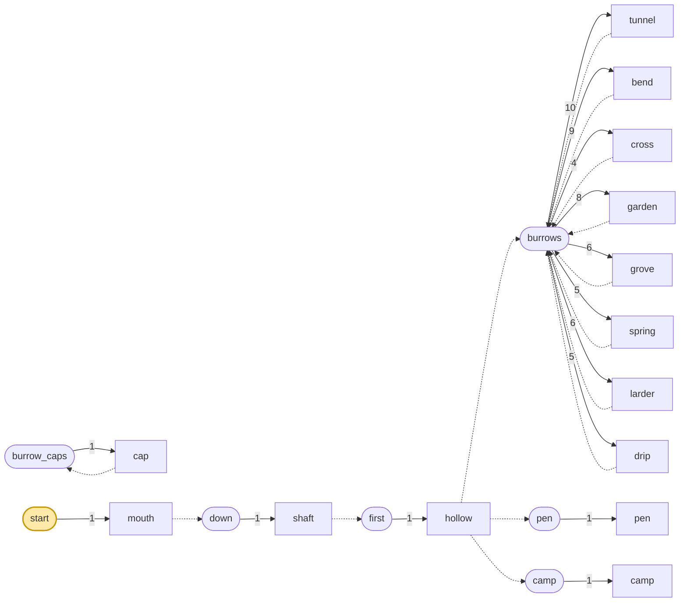

| 풀 | fallback | 원소 (가중치) |
|---|---|---|
| `burrow_caps` | `minecraft:empty` | `cap` 1 |
| `burrows` | `burrow_caps` | `tunnel` 10, `bend` 9, `cross` 4, `garden` 8, `grove` 6, `spring` 5, `larder` 6, `drip` 5 |
| `camp` | `minecraft:empty` | `camp` 1 |
| `down` | `minecraft:empty` | `shaft` 1 |
| `first` | `minecraft:empty` | `hollow` 1 |
| `pen` | `minecraft:empty` | `pen` 1 |
| `start` | `minecraft:empty` | `mouth` 1 |

## 4. 뼈대 — 반드시 이렇게 놓이는 부분

입구와 수직통로, 굴, 그리고 굴이 반드시 부르는 목장과 야영지. 균사 미로는 판마다 다르다.

| 조각 | 놓이는 자리 (시작 조각 기준) | 누가 놓나 |
|---|---|---|
| `mouth` | (0, 0, 0) | 시작 풀 |
| `shaft` | (0, -14, 0) | mouth의 아래 grv_shaft 직소 |
| `hollow` | (0, -21, 0) | shaft의 아래 grv_burrow 직소 |
| `pen` | (0, -21, -7) | hollow의 북 grv_burrow 직소 |
| `camp` | (0, -21, 7) | hollow의 남 grv_burrow 직소 |

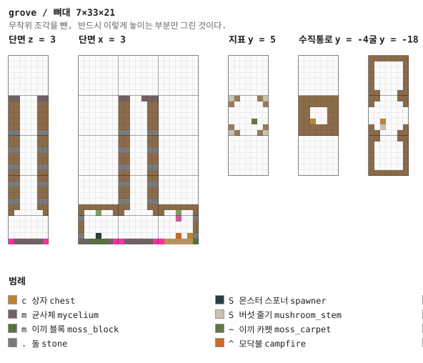

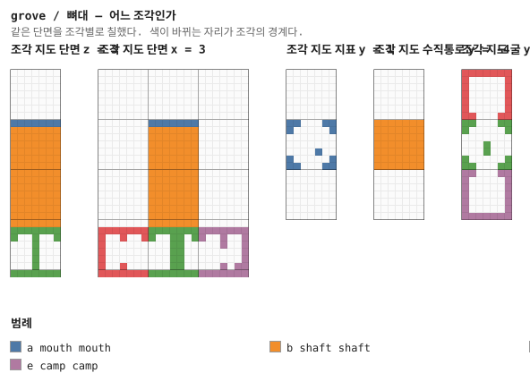

## 5. 조각


그림은 조각 하나를 **층마다 한 장씩** 블록 단위로 그린 것이다. 같은 층이 이어지면 `y = 2–5`처럼 묶었고, 마지막 두 장은 가운데를 자른 세로 단면이다. 분홍 점이 직소, 화살표가 그 직소가 보는 방향이다 — **마주 본 직소끼리만 붙는다.**

### `mouth` — 7×8×7

시작 조각. 균사체에 뚫린 구멍과 그것을 둘러싼 커다란 버섯 넷. 지상에 있는 것은 이게 전부다 —
던전은 굴이다. 사다리가 걸린 줄은 바닥 켜에서 남겨 두어 걸어 나가 올라탈 수 있다 (§24).

**어느 풀에 있나** — `start` (가중치 1)

| 직소 위치 | 향 | name | target | pool |
|---|---|---|---|---|
| (3, 0, 4) | ◇ 아래 | `grv_shaft` | `grv_shaft` | `grove/down` |

**뚫린 면** — 서: z 0–6, y 1–7 (39칸) / 동: z 0–6, y 1–7 (39칸) / 북: x 0–6, y 1–7 (39칸) / 남: x 0–6, y 1–7 (39칸) / 위: x 0–6, z 0–6 (49칸)

**블록** — 균사체 47, 버섯 줄기 12, 갈색 버섯 8, 갈색 버섯 블록 4, 사다리 1, 직소 1, 이끼 카펫 1

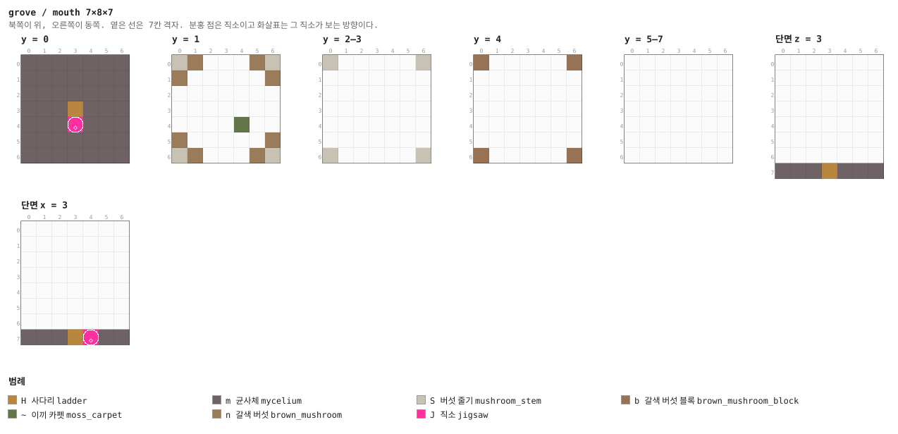

<details><summary>층별 지도 (텍스트)</summary>

```
y = 0   x →동, z ↓남
  mmmmmmm
  mmmmmmm
  mmmmmmm
  mmmHmmm
  mmmJmmm
  mmmmmmm
  mmmmmmm
y = 1   x →동, z ↓남
  Sn...nS
  n.....n
  .......
  .......
  ....~..
  n.....n
  Sn...nS
y = 2–3   x →동, z ↓남
  S.....S
  .......
  .......
  .......
  .......
  .......
  S.....S
y = 4   x →동, z ↓남
  b.....b
  .......
  .......
  .......
  .......
  .......
  b.....b
y = 5–7   x →동, z ↓남
  .......
  .......
  .......
  .......
  .......
  .......
  .......
```

</details>

<details><summary>세로 단면 (텍스트)</summary>

```
단면 z = 3   x →동, y ↑하늘
  .......
  .......
  .......
  .......
  .......
  .......
  .......
  mmmHmmm
단면 x = 3   z →남, y ↑하늘
  .......
  .......
  .......
  .......
  .......
  .......
  .......
  mmmHJmm
```

</details>


### `shaft` — 7×14×7 — 1×2×1 셀

뿌리내린 흙과 돌이 번갈아 나오는 14칸. 사다리 한 줄.

**어느 풀에 있나** — `down` (가중치 1)

| 직소 위치 | 향 | name | target | pool |
|---|---|---|---|---|
| (3, 0, 4) | ◇ 아래 | `grv_burrow` | `grv_burrow` | `grove/first` |
| (3, 13, 4) | ◆ 위 | `grv_shaft` | `grv_shaft` | `—` |

**블록** — 뿌리내린 흙 470, 돌 200, 사다리 14, 직소 2

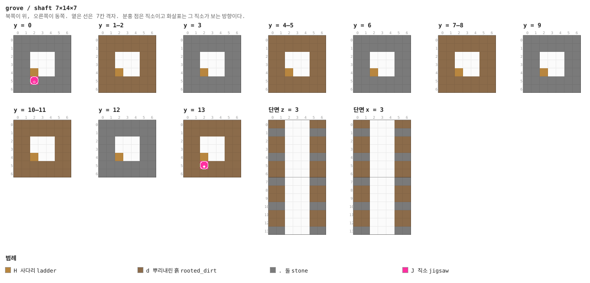

<details><summary>층별 지도 (텍스트)</summary>

```
y = 0   x →동, z ↓남
  .......
  .......
  ..ddd..
  ..dHd..
  ..dJd..
  .......
  .......
y = 1–2   x →동, z ↓남
  ddddddd
  ddddddd
  ddddddd
  dddHddd
  ddddddd
  ddddddd
  ddddddd
y = 3   x →동, z ↓남
  .......
  .......
  ..ddd..
  ..dHd..
  ..ddd..
  .......
  .......
y = 4–5   x →동, z ↓남
  ddddddd
  ddddddd
  ddddddd
  dddHddd
  ddddddd
  ddddddd
  ddddddd
y = 6   x →동, z ↓남
  .......
  .......
  ..ddd..
  ..dHd..
  ..ddd..
  .......
  .......
y = 7–8   x →동, z ↓남
  ddddddd
  ddddddd
  ddddddd
  dddHddd
  ddddddd
  ddddddd
  ddddddd
y = 9   x →동, z ↓남
  .......
  .......
  ..ddd..
  ..dHd..
  ..ddd..
  .......
  .......
y = 10–11   x →동, z ↓남
  ddddddd
  ddddddd
  ddddddd
  dddHddd
  ddddddd
  ddddddd
  ddddddd
y = 12   x →동, z ↓남
  .......
  .......
  ..ddd..
  ..dHd..
  ..ddd..
  .......
  .......
y = 13   x →동, z ↓남
  ddddddd
  ddddddd
  ddddddd
  dddHddd
  dddJddd
  ddddddd
  ddddddd
```

</details>

<details><summary>세로 단면 (텍스트)</summary>

```
단면 z = 3   x →동, y ↑하늘
  dddHddd
  ..dHd..
  dddHddd
  dddHddd
  ..dHd..
  dddHddd
  dddHddd
  ..dHd..
  dddHddd
  dddHddd
  ..dHd..
  dddHddd
  dddHddd
  ..dHd..
단면 x = 3   z →남, y ↑하늘
  dddHJdd
  ..dHd..
  dddHddd
  dddHddd
  ..dHd..
  dddHddd
  dddHddd
  ..dHd..
  dddHddd
  dddHddd
  ..dHd..
  dddHddd
  dddHddd
  ..dHJ..
```

</details>


### `hollow` — 7×7×7 — 1×1×1 셀

사다리가 닿는 굴. 서·동문이 균사 미로로, **북문은 목장, 남문은 야영지**를 부른다 — 각자
이름이 다른 단일 원소 풀이라 둘 다 반드시 나온다.

사다리가 굴 한가운데라 걸 데가 없으므로 **버섯 줄기 기둥**을 세우고 직소를 그 안에 넣었다 (§24).

**어느 풀에 있나** — `first` (가중치 1)

| 직소 위치 | 향 | name | target | pool |
|---|---|---|---|---|
| (3, 0, 0) | ▲ 북 | `grv_burrow` | `grv_pen` | `grove/pen` |
| (0, 0, 3) | ◀ 서 | `grv_burrow` | `grv_burrow` | `grove/burrows` |
| (6, 0, 3) | ▶ 동 | `grv_burrow` | `grv_burrow` | `grove/burrows` |
| (3, 0, 6) | ▼ 남 | `grv_burrow` | `grv_camp` | `grove/camp` |
| (3, 6, 4) | ◆ 위 | `grv_burrow` | `grv_burrow` | `—` |

**뚫린 면** — 서: z 2–4, y 1–4 (12칸) / 동: z 2–4, y 1–4 (12칸) / 북: x 2–4, y 1–4 (12칸) / 남: x 2–4, y 1–4 (12칸)

**블록** — 뿌리내린 흙 95, 균사체 45, 돌 24, 발광 지의류 6, 사다리 6, 직소 5, 버섯 줄기 5, 홀씨 꽃 1

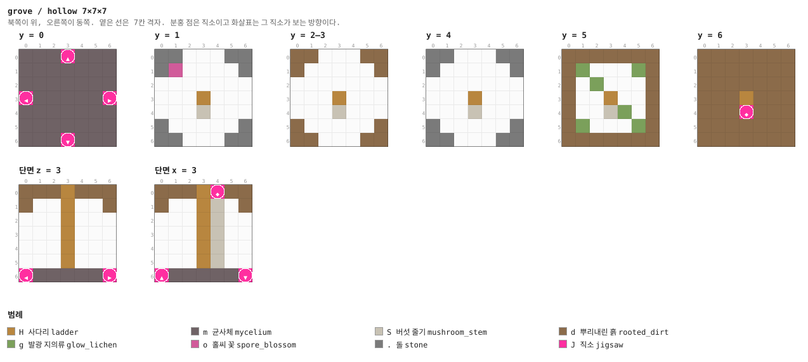

<details><summary>층별 지도 (텍스트)</summary>

```
y = 0   x →동, z ↓남
  mmmJmmm
  mmmmmmm
  mmmmmmm
  JmmmmmJ
  mmmmmmm
  mmmmmmm
  mmmJmmm
y = 1   x →동, z ↓남
  .......
  .o.....
  .......
  ...H...
  ...S...
  .......
  .......
y = 2–3   x →동, z ↓남
  dd...dd
  d.....d
  .......
  ...H...
  ...S...
  d.....d
  dd...dd
y = 4   x →동, z ↓남
  .......
  .......
  .......
  ...H...
  ...S...
  .......
  .......
y = 5   x →동, z ↓남
  ddddddd
  dg...gd
  d.g...d
  d..H..d
  d..Sg.d
  dg...gd
  ddddddd
y = 6   x →동, z ↓남
  ddddddd
  ddddddd
  ddddddd
  dddHddd
  dddJddd
  ddddddd
  ddddddd
```

</details>


### `pen` — 7×7×7 — 1×1×1 셀

무무 목장. 울타리와 건초, 그리고 **무무 스포너**. 이 던전이 하는 약속이 여기 있다 — 그릇만
있으면 스튜가 무한이다. 문은 남쪽 하나뿐이고 울타리에 그 자리만 비어 있다.

**어느 풀에 있나** — `pen` (가중치 1)

| 직소 위치 | 향 | name | target | pool |
|---|---|---|---|---|
| (3, 0, 6) | ▼ 남 | `grv_pen` | `grv_pen` | `—` |

**뚫린 면** — 남: x 2–4, y 1–4 (12칸)

**블록** — 뿌리내린 흙 115, 돌 42, 균사체 39, 참나무 울타리 10, 이끼 블록 9, 발광 지의류 7, 붉은 버섯 2, 건초 더미 2

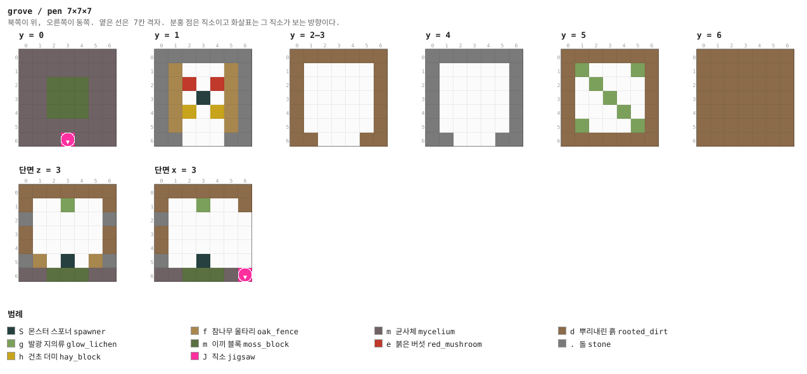

<details><summary>층별 지도 (텍스트)</summary>

```
y = 0   x →동, z ↓남
  mmmmmmm
  mmmmmmm
  mmmmmmm
  mmmmmmm
  mmmmmmm
  mmmmmmm
  mmmJmmm
y = 1   x →동, z ↓남
  .......
  .f...f.
  .fe.ef.
  .f.S.f.
  .fh.hf.
  .f...f.
  .......
y = 2–3   x →동, z ↓남
  ddddddd
  d.....d
  d.....d
  d.....d
  d.....d
  d.....d
  dd...dd
y = 4   x →동, z ↓남
  .......
  .......
  .......
  .......
  .......
  .......
  .......
y = 5   x →동, z ↓남
  ddddddd
  dg...gd
  d.g...d
  d..g..d
  d...g.d
  dg...gd
  ddddddd
y = 6   x →동, z ↓남
  ddddddd
  ddddddd
  ddddddd
  ddddddd
  ddddddd
  ddddddd
  ddddddd
```

</details>


### `camp` — 7×7×7 — 1×1×1 셀

야영지. **침대 둘**, 작업대, 모닥불, 통, 상자. 이 모드에서 **목적이 멈추는 것**인 방은
여기 하나다.

**어느 풀에 있나** — `camp` (가중치 1)

| 직소 위치 | 향 | name | target | pool |
|---|---|---|---|---|
| (3, 0, 0) | ▲ 북 | `grv_camp` | `grv_camp` | `—` |

**뚫린 면** — 북: x 2–4, y 1–4 (12칸)

**블록** — 뿌리내린 흙 115, 돌 42, 참나무 판자 25, 이끼 블록 23, 발광 지의류 7, 참나무 원목 4, 침대 4, 작업대 1

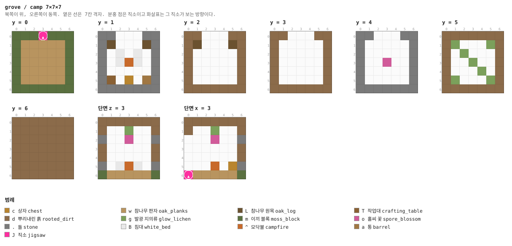

<details><summary>층별 지도 (텍스트)</summary>

```
y = 0   x →동, z ↓남
  mmmJmmm
  mwwwwwm
  mwwwwwm
  mwwwwwm
  mwwwwwm
  mwwwwwm
  mmmmmmm
y = 1   x →동, z ↓남
  .......
  .L...L.
  ..B.B..
  ..B^B..
  .......
  .T.c.a.
  .......
y = 2   x →동, z ↓남
  dd...dd
  dL...Ld
  d.....d
  d.....d
  d.....d
  d.....d
  ddddddd
y = 3   x →동, z ↓남
  dd...dd
  d.....d
  d.....d
  d.....d
  d.....d
  d.....d
  ddddddd
y = 4   x →동, z ↓남
  .......
  .......
  .......
  ...o...
  .......
  .......
  .......
y = 5   x →동, z ↓남
  ddddddd
  dg...gd
  d.g...d
  d..g..d
  d...g.d
  dg...gd
  ddddddd
y = 6   x →동, z ↓남
  ddddddd
  ddddddd
  ddddddd
  ddddddd
  ddddddd
  ddddddd
  ddddddd
```

</details>


### `tunnel` — 7×7×7 — 1×1×1 셀

미로의 기본 단위. 천장에 발광 지의류가 붙어 있어 횃불이 필요 없다.

**어느 풀에 있나** — `burrows` (가중치 10)

| 직소 위치 | 향 | name | target | pool |
|---|---|---|---|---|
| (0, 0, 3) | ◀ 서 | `grv_burrow` | `grv_burrow` | `grove/burrows` |
| (6, 0, 3) | ▶ 동 | `grv_burrow` | `grv_burrow` | `grove/burrows` |

**뚫린 면** — 서: z 2–4, y 1–4 (12칸) / 동: z 2–4, y 1–4 (12칸)

**블록** — 뿌리내린 흙 109, 균사체 47, 돌 36, 발광 지의류 7, 직소 2

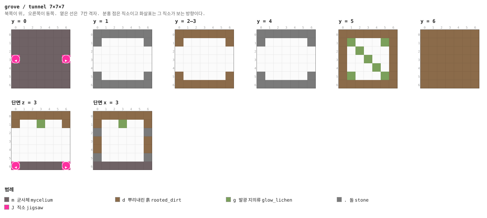

<details><summary>층별 지도 (텍스트)</summary>

```
y = 0   x →동, z ↓남
  mmmmmmm
  mmmmmmm
  mmmmmmm
  JmmmmmJ
  mmmmmmm
  mmmmmmm
  mmmmmmm
y = 1   x →동, z ↓남
  .......
  .......
  .......
  .......
  .......
  .......
  .......
y = 2–3   x →동, z ↓남
  ddddddd
  d.....d
  .......
  .......
  .......
  d.....d
  ddddddd
y = 4   x →동, z ↓남
  .......
  .......
  .......
  .......
  .......
  .......
  .......
y = 5   x →동, z ↓남
  ddddddd
  dg...gd
  d.g...d
  d..g..d
  d...g.d
  dg...gd
  ddddddd
y = 6   x →동, z ↓남
  ddddddd
  ddddddd
  ddddddd
  ddddddd
  ddddddd
  ddddddd
  ddddddd
```

</details>


### `bend` — 7×7×7 — 1×1×1 셀

꺾이는 굴.

**어느 풀에 있나** — `burrows` (가중치 9)

| 직소 위치 | 향 | name | target | pool |
|---|---|---|---|---|
| (0, 0, 3) | ◀ 서 | `grv_burrow` | `grv_burrow` | `grove/burrows` |
| (3, 0, 6) | ▼ 남 | `grv_burrow` | `grv_burrow` | `grove/burrows` |

**뚫린 면** — 서: z 2–4, y 1–4 (12칸) / 남: x 2–4, y 1–4 (12칸)

**블록** — 뿌리내린 흙 109, 균사체 47, 돌 36, 발광 지의류 7, 직소 2

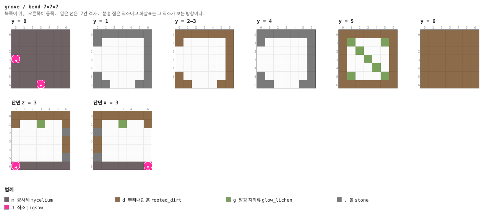

<details><summary>층별 지도 (텍스트)</summary>

```
y = 0   x →동, z ↓남
  mmmmmmm
  mmmmmmm
  mmmmmmm
  Jmmmmmm
  mmmmmmm
  mmmmmmm
  mmmJmmm
y = 1   x →동, z ↓남
  .......
  .......
  .......
  .......
  .......
  .......
  .......
y = 2–3   x →동, z ↓남
  ddddddd
  d.....d
  ......d
  ......d
  ......d
  d.....d
  dd...dd
y = 4   x →동, z ↓남
  .......
  .......
  .......
  .......
  .......
  .......
  .......
y = 5   x →동, z ↓남
  ddddddd
  dg...gd
  d.g...d
  d..g..d
  d...g.d
  dg...gd
  ddddddd
y = 6   x →동, z ↓남
  ddddddd
  ddddddd
  ddddddd
  ddddddd
  ddddddd
  ddddddd
  ddddddd
```

</details>


### `cross` — 7×7×7 — 1×1×1 셀

네거리. 다른 던전이라면 스포너가 있을 자리인데, 여기는 없다.

**어느 풀에 있나** — `burrows` (가중치 4)

| 직소 위치 | 향 | name | target | pool |
|---|---|---|---|---|
| (3, 0, 0) | ▲ 북 | `grv_burrow` | `grv_burrow` | `grove/burrows` |
| (0, 0, 3) | ◀ 서 | `grv_burrow` | `grv_burrow` | `grove/burrows` |
| (6, 0, 3) | ▶ 동 | `grv_burrow` | `grv_burrow` | `grove/burrows` |
| (3, 0, 6) | ▼ 남 | `grv_burrow` | `grv_burrow` | `grove/burrows` |

**뚫린 면** — 서: z 2–4, y 1–4 (12칸) / 동: z 2–4, y 1–4 (12칸) / 북: x 2–4, y 1–4 (12칸) / 남: x 2–4, y 1–4 (12칸)

**블록** — 뿌리내린 흙 97, 균사체 45, 돌 24, 발광 지의류 7, 직소 4

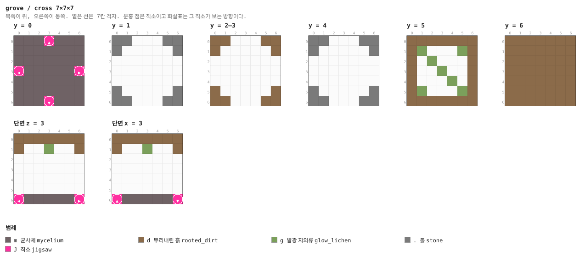

<details><summary>층별 지도 (텍스트)</summary>

```
y = 0   x →동, z ↓남
  mmmJmmm
  mmmmmmm
  mmmmmmm
  JmmmmmJ
  mmmmmmm
  mmmmmmm
  mmmJmmm
y = 1   x →동, z ↓남
  .......
  .......
  .......
  .......
  .......
  .......
  .......
y = 2–3   x →동, z ↓남
  dd...dd
  d.....d
  .......
  .......
  .......
  d.....d
  dd...dd
y = 4   x →동, z ↓남
  .......
  .......
  .......
  .......
  .......
  .......
  .......
y = 5   x →동, z ↓남
  ddddddd
  dg...gd
  d.g...d
  d..g..d
  d...g.d
  dg...gd
  ddddddd
y = 6   x →동, z ↓남
  ddddddd
  ddddddd
  ddddddd
  ddddddd
  ddddddd
  ddddddd
  ddddddd
```

</details>


### `garden` — 7×7×7 — 1×1×1 셀

버섯이 자란 칸. 붉은 버섯과 갈색 버섯이 번갈아 심겨 있다.

**어느 풀에 있나** — `burrows` (가중치 8)

| 직소 위치 | 향 | name | target | pool |
|---|---|---|---|---|
| (0, 0, 3) | ◀ 서 | `grv_burrow` | `grv_burrow` | `grove/burrows` |
| (6, 0, 3) | ▶ 동 | `grv_burrow` | `grv_burrow` | `grove/burrows` |

**뚫린 면** — 서: z 2–4, y 1–4 (12칸) / 동: z 2–4, y 1–4 (12칸)

**블록** — 뿌리내린 흙 109, 돌 36, 균사체 34, 이끼 블록 13, 붉은 버섯 12, 발광 지의류 7, 직소 2

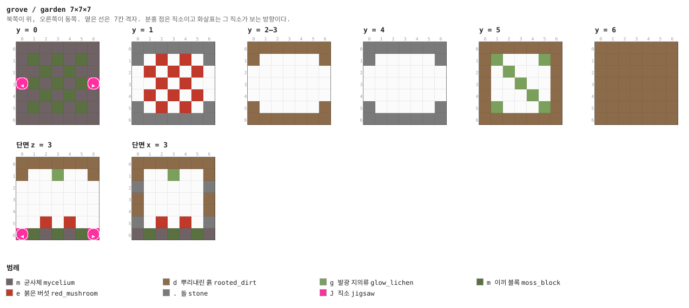

<details><summary>층별 지도 (텍스트)</summary>

```
y = 0   x →동, z ↓남
  mmmmmmm
  mmmmmmm
  mmmmmmm
  JmmmmmJ
  mmmmmmm
  mmmmmmm
  mmmmmmm
y = 1   x →동, z ↓남
  .......
  ..e.e..
  .e.e.e.
  ..e.e..
  .e.e.e.
  ..e.e..
  .......
y = 2–3   x →동, z ↓남
  ddddddd
  d.....d
  .......
  .......
  .......
  d.....d
  ddddddd
y = 4   x →동, z ↓남
  .......
  .......
  .......
  .......
  .......
  .......
  .......
y = 5   x →동, z ↓남
  ddddddd
  dg...gd
  d.g...d
  d..g..d
  d...g.d
  dg...gd
  ddddddd
y = 6   x →동, z ↓남
  ddddddd
  ddddddd
  ddddddd
  ddddddd
  ddddddd
  ddddddd
  ddddddd
```

</details>


### `grove` — 7×7×7 — 1×1×1 셀

거대 버섯 한 그루와 상자. 문이 하나뿐이니 상자를 준다.

**어느 풀에 있나** — `burrows` (가중치 6)

| 직소 위치 | 향 | name | target | pool |
|---|---|---|---|---|
| (0, 0, 3) | ◀ 서 | `grv_burrow` | `grv_burrow` | `grove/burrows` |

**뚫린 면** — 서: z 2–4, y 1–4 (12칸)

**블록** — 뿌리내린 흙 115, 균사체 48, 돌 42, 발광 지의류 7, 갈색 버섯 블록 5, 버섯 줄기 3, 직소 1, 상자 1

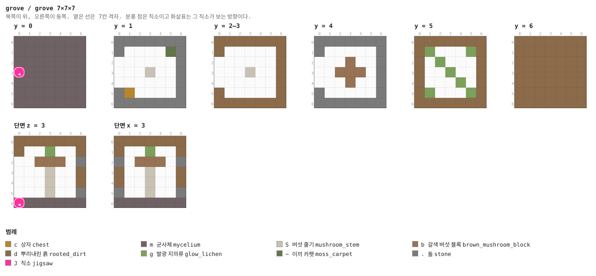

<details><summary>층별 지도 (텍스트)</summary>

```
y = 0   x →동, z ↓남
  mmmmmmm
  mmmmmmm
  mmmmmmm
  Jmmmmmm
  mmmmmmm
  mmmmmmm
  mmmmmmm
y = 1   x →동, z ↓남
  .......
  .....~.
  .......
  ...S...
  .......
  .c.....
  .......
y = 2–3   x →동, z ↓남
  ddddddd
  d.....d
  ......d
  ...S..d
  ......d
  d.....d
  ddddddd
y = 4   x →동, z ↓남
  .......
  .......
  ...b...
  ..bbb..
  ...b...
  .......
  .......
y = 5   x →동, z ↓남
  ddddddd
  dg...gd
  d.g...d
  d..g..d
  d...g.d
  dg...gd
  ddddddd
y = 6   x →동, z ↓남
  ddddddd
  ddddddd
  ddddddd
  ddddddd
  ddddddd
  ddddddd
  ddddddd
```

</details>


### `spring` — 7×7×7 — 1×1×1 셀

바닥에 작은 물웅덩이. 늘어진 뿌리가 내려온다.

**어느 풀에 있나** — `burrows` (가중치 5)

| 직소 위치 | 향 | name | target | pool |
|---|---|---|---|---|
| (0, 0, 3) | ◀ 서 | `grv_burrow` | `grv_burrow` | `grove/burrows` |
| (6, 0, 3) | ▶ 동 | `grv_burrow` | `grv_burrow` | `grove/burrows` |

**뚫린 면** — 서: z 2–4, y 1–4 (12칸) / 동: z 2–4, y 1–4 (12칸)

**블록** — 뿌리내린 흙 109, 균사체 38, 돌 36, 물 8, 발광 지의류 7, 직소 2, 늘어진 뿌리 2, 이끼 블록 1

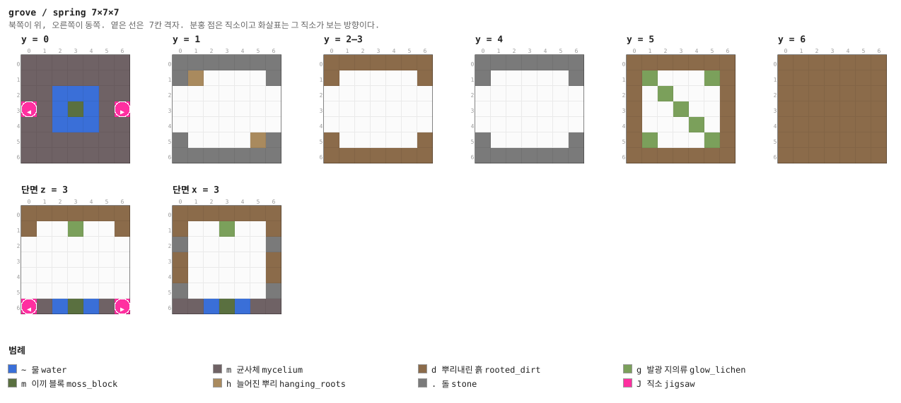

<details><summary>층별 지도 (텍스트)</summary>

```
y = 0   x →동, z ↓남
  mmmmmmm
  mmmmmmm
  mm~~~mm
  Jm~m~mJ
  mm~~~mm
  mmmmmmm
  mmmmmmm
y = 1   x →동, z ↓남
  .......
  .h.....
  .......
  .......
  .......
  .....h.
  .......
y = 2–3   x →동, z ↓남
  ddddddd
  d.....d
  .......
  .......
  .......
  d.....d
  ddddddd
y = 4   x →동, z ↓남
  .......
  .......
  .......
  .......
  .......
  .......
  .......
y = 5   x →동, z ↓남
  ddddddd
  dg...gd
  d.g...d
  d..g..d
  d...g.d
  dg...gd
  ddddddd
y = 6   x →동, z ↓남
  ddddddd
  ddddddd
  ddddddd
  ddddddd
  ddddddd
  ddddddd
  ddddddd
```

</details>


### `larder` — 7×7×7 — 1×1×1 셀

저장고. 상자·통·퇴비통·작업대. 문이 하나다.

**어느 풀에 있나** — `burrows` (가중치 6)

| 직소 위치 | 향 | name | target | pool |
|---|---|---|---|---|
| (0, 0, 3) | ◀ 서 | `grv_burrow` | `grv_burrow` | `grove/burrows` |

**뚫린 면** — 서: z 2–4, y 1–4 (12칸)

**블록** — 뿌리내린 흙 115, 균사체 48, 돌 42, 발광 지의류 7, 직소 1, 통 1, 퇴비통 1, 작업대 1

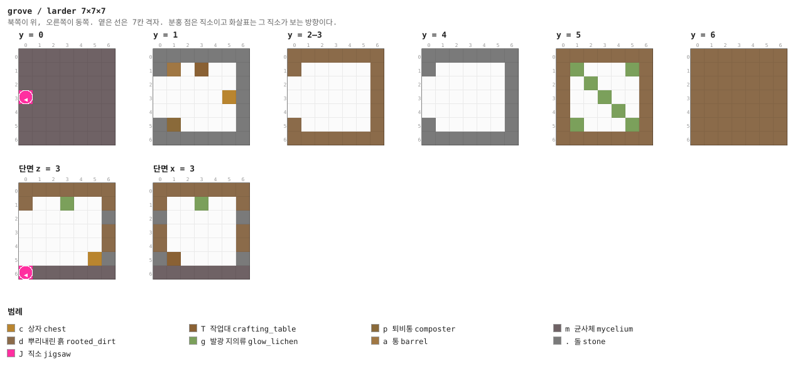

<details><summary>층별 지도 (텍스트)</summary>

```
y = 0   x →동, z ↓남
  mmmmmmm
  mmmmmmm
  mmmmmmm
  Jmmmmmm
  mmmmmmm
  mmmmmmm
  mmmmmmm
y = 1   x →동, z ↓남
  .......
  .a.T...
  .......
  .....c.
  .......
  .p.....
  .......
y = 2–3   x →동, z ↓남
  ddddddd
  d.....d
  ......d
  ......d
  ......d
  d.....d
  ddddddd
y = 4   x →동, z ↓남
  .......
  .......
  .......
  .......
  .......
  .......
  .......
y = 5   x →동, z ↓남
  ddddddd
  dg...gd
  d.g...d
  d..g..d
  d...g.d
  dg...gd
  ddddddd
y = 6   x →동, z ↓남
  ddddddd
  ddddddd
  ddddddd
  ddddddd
  ddddddd
  ddddddd
  ddddddd
```

</details>


### `drip` — 7×7×7 — 1×1×1 셀

점적석이 천장에서 자라는 칸. 바닥도 점적석이다.

**어느 풀에 있나** — `burrows` (가중치 5)

| 직소 위치 | 향 | name | target | pool |
|---|---|---|---|---|
| (0, 0, 3) | ◀ 서 | `grv_burrow` | `grv_burrow` | `grove/burrows` |
| (6, 0, 3) | ▶ 동 | `grv_burrow` | `grv_burrow` | `grove/burrows` |

**뚫린 면** — 서: z 2–4, y 1–4 (12칸) / 동: z 2–4, y 1–4 (12칸)

**블록** — 뿌리내린 흙 109, 돌 36, 점적석 28, 균사체 22, 발광 지의류 5, 점적석 고드름 3, 직소 2

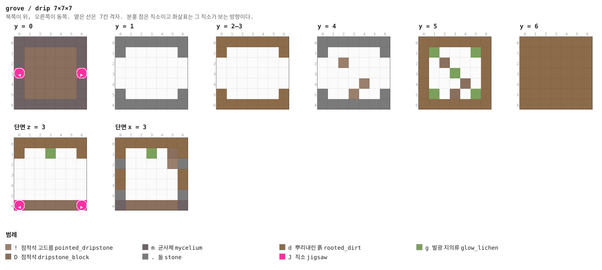

<details><summary>층별 지도 (텍스트)</summary>

```
y = 0   x →동, z ↓남
  mmmmmmm
  mDDDDDm
  mDDDDDm
  JDDDDDJ
  mDDDDDm
  mDDDDDm
  mmmmmmm
y = 1   x →동, z ↓남
  .......
  .......
  .......
  .......
  .......
  .......
  .......
y = 2–3   x →동, z ↓남
  ddddddd
  d.....d
  .......
  .......
  .......
  d.....d
  ddddddd
y = 4   x →동, z ↓남
  .......
  .......
  ..!....
  .......
  ....!..
  ...!...
  .......
y = 5   x →동, z ↓남
  ddddddd
  dg...gd
  d.D...d
  d..g..d
  d...D.d
  dg.D.gd
  ddddddd
y = 6   x →동, z ↓남
  ddddddd
  ddddddd
  ddddddd
  ddddddd
  ddddddd
  ddddddd
  ddddddd
```

</details>


### `cap` — 1×7×7

두께 1의 마개. 균사 미로 풀의 fallback (§4).

**어느 풀에 있나** — `burrow_caps` (가중치 1)

| 직소 위치 | 향 | name | target | pool |
|---|---|---|---|---|
| (0, 0, 3) | ◀ 서 | `grv_burrow` | `grv_burrow` | `grove/burrow_caps` |

**블록** — 뿌리내린 흙 34, 돌 14, 직소 1

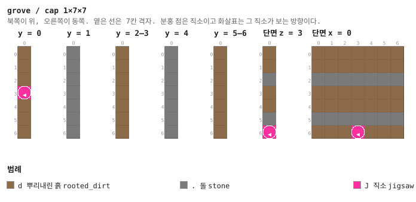

<details><summary>층별 지도 (텍스트)</summary>

```
y = 0   x →동, z ↓남
  d
  d
  d
  J
  d
  d
  d
y = 1   x →동, z ↓남
  .
  .
  .
  .
  .
  .
  .
y = 2–3   x →동, z ↓남
  d
  d
  d
  d
  d
  d
  d
y = 4   x →동, z ↓남
  .
  .
  .
  .
  .
  .
  .
y = 5–6   x →동, z ↓남
  d
  d
  d
  d
  d
  d
  d
```

</details>


## 다듬을 곳

- **입구가 작다.** 7×7에 커다란 버섯 넷뿐이라 멀리서 안 보인다. 버섯섬에 다른 지형물이
  없으니 조금 더 커도 된다
- **굴이 네모나다.** 균사 미로도 7×7×7 칸이라 동굴이라기보다 방이다. 천장을 울퉁불퉁하게
  깎은 조각이 섞이면 굴처럼 보인다
- **적이 없다는 것 말고 특별한 것이 없다.** 발광 오징어가 사는 물웅덩이나, 거대 버섯을
  타고 오르는 층이 있으면 좋겠다
