# 레벨 설계 — 얼음 성채

> 이 문서는 `python tools/gen_level_doc.py ice`가 만든다. 조각을 고치면 다시 돌린다. 그림과 표는 게임이 읽는 파일(`structure/ice/*.nbt`, `worldgen/**`)에서 그대로 읽어 온 것이라 모드와 어긋날 수 없다. 설명 문장만 사람이 쓴다 (`tools/gen_level_doc.py`의 `INTRO`·`NOTES`).

## 1. 한눈에

눈 덮인 땅에 선 성이다. **아성**이 한가운데 서고 그 사방으로 **성벽**이 뻗어 49×49 안뜰을
두르며, 네 귀퉁이에 **탑**이 올라간다. 아성 바닥의 구멍으로 사다리가 14칸 내려가면 돌벽돌
**얼음 창고**고, 그 안쪽에 **서리 군주**가 있다.

**한 판:** 성문으로 들어가 안뜰과 순찰로를 돌며 탑의 스트레이를 상대하고 → 아성 → 사다리 →
얼음 창고 미로(가루눈·푸른 얼음·북극곰) → 통로 셋 뒤 보스. 이기면 **마법 부여 다이아 방어구
한 조각 + 서리 걷기 II 책**이 확정이다. 서리 걷기는 마법 부여대에서 나오지 않는 보물
마법이라, 이 책이 유일한 길이다.

| 항목 | 값 |
|---|---|
| 생성 단계 | `surface_structures` |
| 바이옴 | `#sydungeon:has_structure/ice` |
| 간격 / 최소거리 | spacing 36 / separation 12 |
| 직소 깊이 | 14 ~ 22 (`sydungeon:ranged_jigsaw`) |
| 시작 풀 | `start` |
| 조각 / 풀 | 23개 / 14개 |

## 2. 조립 원리

### 성벽은 한 조각일 수 없다

49×49 한 장으로 만들면 아성이 그 상자 **안에** 매달린다. 그러면 `CLAUDE.md` §10대로
**울타리가 자손에게 상속되어** 지하 창고까지 성벽 상자에 갇힌다 — 아래를 가리키는 직소를
달아도 자식이 거부될 뿐이다. 피라미드는 그걸 노린 것이지만 여기서는 사고다.

그래서 성벽을 **가운데가 빈 여덟 조각**(벽 넷 + 탑 넷)으로 나눈다. 상자가 안뜰을 비워 두므로
상속이 일어나지 않고, **시작 조각인 아성**에서 내려가는 가지는 아무것도 가두지 않은 자리에서
자란다.

### 고리는 결정적 기하로 닫힌다

아성이 사방으로 벽을 부르고, **북벽과 남벽만** 자기 양 끝에서 탑을 부른다. 둘만 부르는 이유가
있다 — 탑은 두꺼운 모서리와 두 팔로 되어 있어서, 한 번만 잘못 돌아가면 탑이 안뜰 안쪽에
박힌다. 동·서벽도 부르게 하면 같은 탑을 두 방향에서 불러 **어느 쪽이 먼저 놓이느냐에 따라
방향이 달라진다.** 한 번만 부르면 회전이 하나로 정해진다 (§13).

바닐라는 돌려는 주지만 **뒤집어 주지는 않으므로** 북서용과 북동용이 서로 거울이다. 탑 하나를
만들고 x를 뒤집어 다른 하나를 만든다 — 마법사의 탑의 `corner_right`와 같은 수법이다.

깊이는 지상 전체가 **2**밖에 쓰지 않는다: 아성 → 벽 → 탑.

### 산에 서는 법

눈 비탈·서리 봉우리·그로브는 **산 바이옴**이라 바닥이 평평하지 않다. `terrain_adaptation`은
`beard_thin`이고, 그 위에 **벽과 탑이 기초를 일곱 칸 아래로 끌고 내려간다.** 시작 조각은
바닥이 지표에 고정되지만(§18) 자식은 직소 높이로만 놓이므로 얼마든지 깊어도 된다. 늪의
말뚝에서 배운 것을 그대로 쓴 것이다.

안뜰은 조각이 덮고 있으므로 **평평하게 깎인다.** 성이 비탈에 앉으면 한쪽은 기초가 드러나고
한쪽은 땅에 묻힌다 — 성이라면 그래야 한다.

### 위험은 트리거가 없다

가루눈 웅덩이와 푸른 얼음 바닥. 둘 다 **밟아서 터지는 것이 아니라 그냥 거기 있는 것**이라,
플레이어가 오기 전에 몹이 먼저 발동시켜 버리는 §12의 문제가 없다. 가루눈은 가죽 부츠가
있으면 건널 수 있고, 그래서 **모든 상자의 첫 풀에 가죽 부츠가 들어 있다.**

## 3. 풀 배선

풀이 어떤 조각을 내놓는지(실선, 숫자는 가중치)와 그 조각의 직소가 다시 어떤 풀을 부르는지(점선)다. 직소 생성은 이 그래프를 깊이만큼 따라간다.

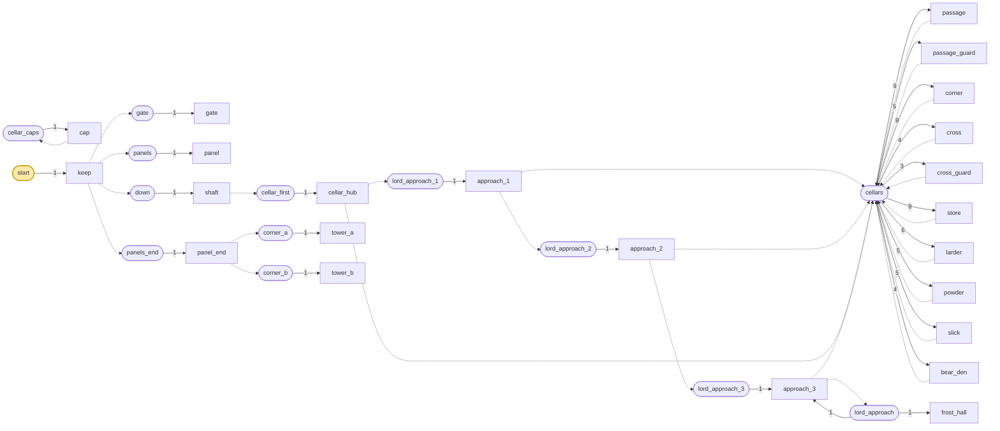
```mermaid
flowchart LR
  P_cellar_caps(["cellar_caps"])
  P_cellar_first(["cellar_first"])
  P_cellars(["cellars"])
  P_corner_a(["corner_a"])
  P_corner_b(["corner_b"])
  P_down(["down"])
  P_gate(["gate"])
  P_lord_approach(["lord_approach"])
  P_lord_approach_1(["lord_approach_1"])
  P_lord_approach_2(["lord_approach_2"])
  P_lord_approach_3(["lord_approach_3"])
  P_panels(["panels"])
  P_panels_end(["panels_end"])
  P_start(["start"])
  E_approach_1["approach_1"]
  E_approach_2["approach_2"]
  E_approach_3["approach_3"]
  E_bear_den["bear_den"]
  E_cap["cap"]
  E_cellar_hub["cellar_hub"]
  E_corner["corner"]
  E_cross["cross"]
  E_cross_guard["cross_guard"]
  E_frost_hall["frost_hall"]
  E_gate["gate"]
  E_keep["keep"]
  E_larder["larder"]
  E_panel["panel"]
  E_panel_end["panel_end"]
  E_passage["passage"]
  E_passage_guard["passage_guard"]
  E_powder["powder"]
  E_shaft["shaft"]
  E_slick["slick"]
  E_store["store"]
  E_tower_a["tower_a"]
  E_tower_b["tower_b"]
  P_cellar_caps -- 1 --> E_cap
  P_cellar_first -- 1 --> E_cellar_hub
  P_cellars -- 9 --> E_passage
  P_cellars -- 5 --> E_passage_guard
  P_cellars -- 9 --> E_corner
  P_cellars -- 4 --> E_cross
  P_cellars -- 3 --> E_cross_guard
  P_cellars -- 8 --> E_store
  P_cellars -- 6 --> E_larder
  P_cellars -- 5 --> E_powder
  P_cellars -- 5 --> E_slick
  P_cellars -- 4 --> E_bear_den
  P_corner_a -- 1 --> E_tower_a
  P_corner_b -- 1 --> E_tower_b
  P_down -- 1 --> E_shaft
  P_gate -- 1 --> E_gate
  P_lord_approach -- 1 --> E_frost_hall
  P_lord_approach -- 1 --> E_approach_3
  P_lord_approach_1 -- 1 --> E_approach_1
  P_lord_approach_2 -- 1 --> E_approach_2
  P_lord_approach_3 -- 1 --> E_approach_3
  P_panels -- 1 --> E_panel
  P_panels_end -- 1 --> E_panel_end
  P_start -- 1 --> E_keep
  E_approach_1 -.-> P_cellars
  E_approach_1 -.-> P_lord_approach_2
  E_approach_2 -.-> P_cellars
  E_approach_2 -.-> P_lord_approach_3
  E_approach_3 -.-> P_cellars
  E_approach_3 -.-> P_lord_approach
  E_bear_den -.-> P_cellars
  E_cap -.-> P_cellar_caps
  E_cellar_hub -.-> P_cellars
  E_cellar_hub -.-> P_lord_approach_1
  E_corner -.-> P_cellars
  E_cross -.-> P_cellars
  E_cross_guard -.-> P_cellars
  E_keep -.-> P_gate
  E_keep -.-> P_panels_end
  E_keep -.-> P_down
  E_keep -.-> P_panels
  E_larder -.-> P_cellars
  E_panel_end -.-> P_corner_a
  E_panel_end -.-> P_corner_b
  E_passage -.-> P_cellars
  E_passage_guard -.-> P_cellars
  E_powder -.-> P_cellars
  E_shaft -.-> P_cellar_first
  E_slick -.-> P_cellars
  E_store -.-> P_cellars
  P_start:::start
  classDef start fill:#ffe9a8,stroke:#c99a00,stroke-width:2px
```

| 풀 | fallback | 원소 (가중치) |
|---|---|---|
| `cellar_caps` | `minecraft:empty` | `cap` 1 |
| `cellar_first` | `minecraft:empty` | `cellar_hub` 1 |
| `cellars` | `cellar_caps` | `passage` 9, `passage_guard` 5, `corner` 9, `cross` 4, `cross_guard` 3, `store` 8, `larder` 6, `powder` 5, `slick` 5, `bear_den` 4 |
| `corner_a` | `minecraft:empty` | `tower_a` 1 |
| `corner_b` | `minecraft:empty` | `tower_b` 1 |
| `down` | `minecraft:empty` | `shaft` 1 |
| `gate` | `minecraft:empty` | `gate` 1 |
| `lord_approach` | `cellar_caps` | `frost_hall` 1, `approach_3` 1 |
| `lord_approach_1` | `cellar_caps` | `approach_1` 1 |
| `lord_approach_2` | `cellar_caps` | `approach_2` 1 |
| `lord_approach_3` | `cellar_caps` | `approach_3` 1 |
| `panels` | `minecraft:empty` | `panel` 1 |
| `panels_end` | `minecraft:empty` | `panel_end` 1 |
| `start` | `minecraft:empty` | `keep` 1 |

## 4. 뼈대 — 반드시 이렇게 놓이는 부분

아성과 그것이 부르는 성벽·탑, 그리고 사다리 아래의 사슬. **원소가 하나뿐인 풀로 놓이는
것만** 그렸다. 얼음 창고 미로는 판마다 다르다. 지상 조각 여덟이 49×49를 빈틈없이 덮고,
사다리가 아성 바닥(y=0)에서 창고 바닥(y=−20)까지 한 줄로 이어지는 것이 단면에 보인다.

| 조각 | 놓이는 자리 (시작 조각 기준) | 누가 놓나 |
|---|---|---|
| `keep` | (0, 0, 0) | 시작 풀 |
| `gate` | (-14, -7, 0) | keep의 서 ice_wall 직소 |
| `panel_end` | (0, -7, -14) | keep의 북 ice_wall 직소 |
| `panel_end` | (0, -7, 21) | keep의 남 ice_wall 직소 |
| `shaft` | (7, -14, 7) | keep의 아래 ice_down 직소 |
| `panel` | (21, -7, 0) | keep의 동 ice_wall 직소 |
| `tower_a` | (-14, -7, -14) | panel_end의 서 ice_corner_a 직소 |
| `tower_b` | (21, -7, -14) | panel_end의 동 ice_corner_b 직소 |
| `tower_a` | (-14, -7, 21) | panel_end의 서 ice_corner_a 직소 |
| `tower_b` | (21, -7, 21) | panel_end의 동 ice_corner_b 직소 |
| `cellar_hub` | (7, -21, 7) | shaft의 아래 ice_door 직소 |
| `approach_1` | (7, -21, 14) | cellar_hub의 남 ice_door 직소 |
| `approach_2` | (14, -21, 14) | approach_1의 동 ice_door 직소 |
| `approach_3` | (21, -21, 14) | approach_2의 동 ice_door 직소 |

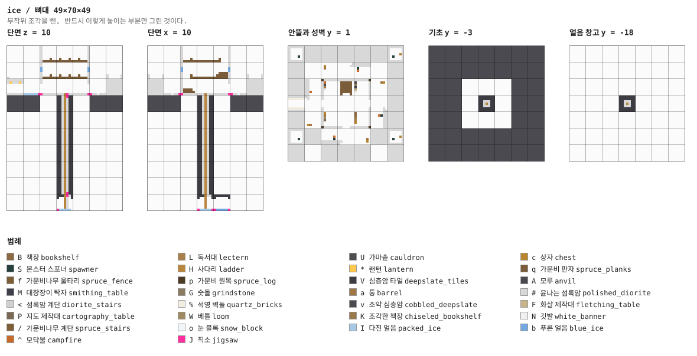

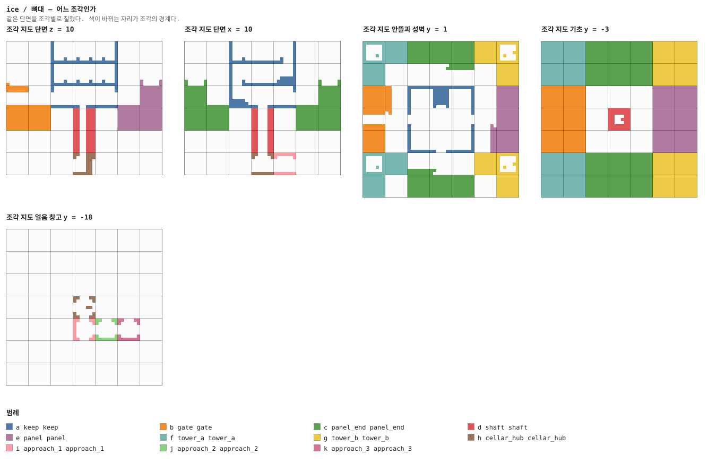

## 5. 조각


그림은 조각 하나를 **층마다 한 장씩** 블록 단위로 그린 것이다. 같은 층이 이어지면 `y = 2–5`처럼 묶었고, 마지막 두 장은 가운데를 자른 세로 단면이다. 분홍 점이 직소, 화살표가 그 직소가 보는 방향이다 — **마주 본 직소끼리만 붙는다.**

### `keep` — 21×21×21 — 3×3×3 셀

시작 조각. 21×21×21 세 층이고 사방에 문이 하나씩 있어 **그 넷이 성벽을 부른다.** 바닥의
3×3 구멍이 이 던전의 유일한 아래 방향 직소다.

게임은 시작 조각을 **바닥으로 고정**하므로(`minY + 1`이 지표) 아성은 기초를 아래로 못 끌고
내려간다. 대신 벽과 탑이 자식이라 일곱 칸씩 내려간다 (§18).

**어느 풀에 있나** — `start` (가중치 1)

| 직소 위치 | 향 | name | target | pool |
|---|---|---|---|---|
| (10, 0, 0) | ▲ 북 | `ice_wall` | `ice_wall` | `ice/panels_end` |
| (0, 0, 10) | ◀ 서 | `ice_wall` | `ice_wall` | `ice/gate` |
| (12, 0, 10) | ◇ 아래 | `ice_down` | `ice_down` | `ice/down` |
| (20, 0, 10) | ▶ 동 | `ice_wall` | `ice_wall` | `ice/panels` |
| (10, 0, 20) | ▼ 남 | `ice_wall` | `ice_wall` | `ice/panels_end` |

**뚫린 면** — 서: z 1–19, y 1–20 (22칸) / 동: z 1–19, y 1–20 (22칸) / 북: x 1–19, y 20–20 (10칸) / 남: x 1–19, y 1–20 (22칸) / 아래: x 9–11, z 9–11 (8칸) / 위: x 0–20, z 0–20 (401칸)

**블록** — 윤나는 섬록암 1839, 가문비나무 판자 778, 가문비나무 울타리 143, 가문비나무 원목 72, 가문비나무 계단 72, 푸른 얼음 40, 랜턴 8, 직소 5

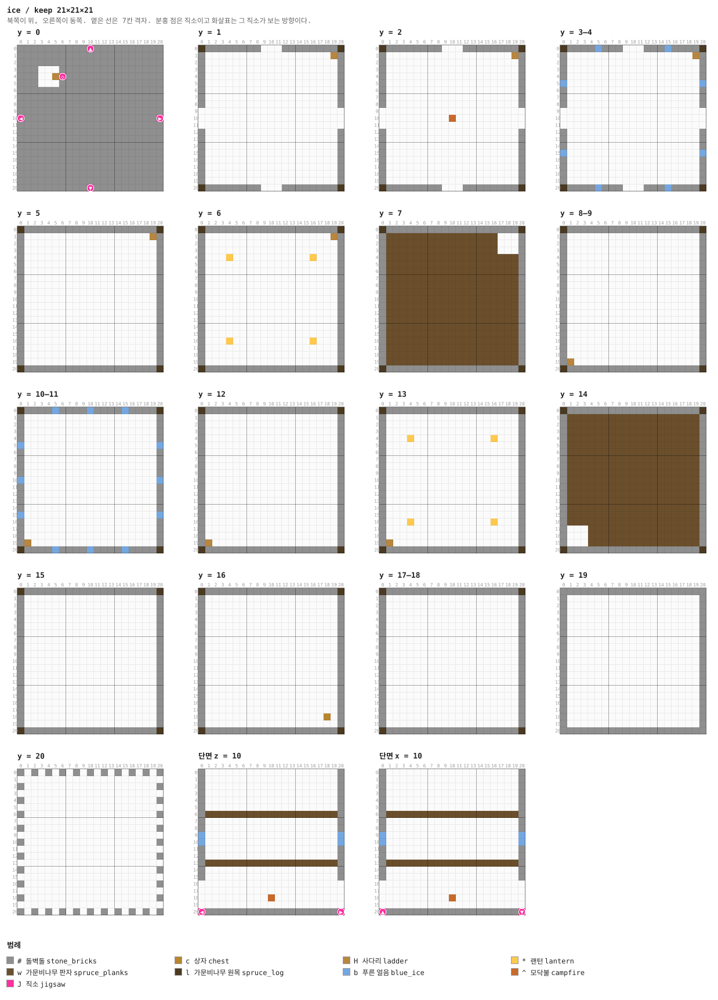

<details><summary>층별 지도 (텍스트)</summary>

```
y = 0   x →동, z ↓남
  ##########J##########
  #####################
  #####################
  #####################
  #####################
  #####################
  #####################
  #####################
  #####################
  #########...#########
  J########..HJ#######J
  #########...#########
  #####################
  #####################
  #####################
  #####################
  #####################
  #####################
  #####################
  #####################
  ##########J##########
y = 1   x →동, z ↓남
  l###################l
  #^......fwwwf.A.....#
  #U......fwwwf.G.....#
  #a......fwwwf.M.....#
  #N......fwwwf.F.....#
  #.......w///w.N.....#
  #.......w...w.......#
  #...................#
  #...................#
  .....................
  .....................
  .....................
  #...................#
  #...................#
  #c............B.....#
  #a............B.....#
  #W............K.....#
  #P............L.....#
  #.............c.....#
  #...................#
  l########...########l
y = 2   x →동, z ↓남
  l###################l
  #.......wwwww.......#
  #.......wwwww.......#
  #.......wwwww.......#
  #.......w///w.......#
  #.......w...w.......#
  #.......f...f.......#
  #...................#
  #...................#
  .....................
  .....................
  .....................
  #...................#
  #...................#
  #...................#
  #...................#
  #...................#
  #...................#
  #...................#
  #...................#
  l########...########l
y = 3   x →동, z ↓남
  l####b#########b####l
  #......w/.../w......#
  #......w/.../w......#
  #......w/.../w......#
  #.......w...w.......#
  b.......f...f.......b
  #...................#
  #...................#
  #...................#
  .....................
  .....................
  .....................
  #...................#
  #...................#
  #...................#
  b...................b
  #...................#
  #...................#
  #...................#
  #...................#
  l####b###...###b####l
y = 4   x →동, z ↓남
  l####b#########b####l
  #.....w/...../w.....#
  #.....w/...../w.....#
  #.....w/...../w.....#
  #......wf...fw......#
  b...................b
  #...................#
  #...................#
  #...................#
  .....................
  .....................
  .....................
  #...................#
  #...................#
  #...................#
  b...................b
  #...................#
  #...................#
  #...................#
  #...................#
  l####b###...###b####l
y = 5   x →동, z ↓남
  l###################l
  #....w/......./w....#
  #....w/......./w....#
  #....w/......./w....#
  #.....wf.....fw.....#
  #...................#
  #...................#
  #...................#
  #...................#
  #...................#
  #...................#
  #...................#
  #...................#
  #...................#
  #...................#
  #...................#
  #...................#
  #...................#
  #...................#
  #...................#
  l###################l
y = 6   x →동, z ↓남
  l###################l
  #...w/........./w...#
  #...w/........./w...#
  #...w/........./w...#
  #...*wf.......fw*...#
  #...................#
  #...................#
  #...................#
  #...................#
  #...................#
  #...................#
  #...................#
  #...................#
  #...................#
  #...................#
  #...................#
  #...*...........*...#
  #...................#
  #...................#
  #...................#
  l###################l
y = 7   x →동, z ↓남
  l###################l
  #www/.........../www#
  #www/.........../www#
  #www/.........../www#
  #wwwwwwwwwwwwwwwwwww#
  #wwwwwwwwwwwwwwwwwww#
  #wwwwwwwwwwwwwwwwwww#
  #wwwwwwwwwwwwwwwwwww#
  #wwwwwwwwwwwwwwwwwww#
  #wwwwwwwwwwwwwwwwwww#
  #wwwwwwwwwwwwwwwwwww#
  #wwwwwwwwwwwwwwwwwww#
  #wwwwwwwwwwwwwwwwwww#
  #wwwwwwwwwwwwwwwwwww#
  #wwwwwwwwwwwwwwwwwww#
  #wwwwwwwwwwwwwwwwwww#
  #wwwwwwwwwwwwwwwwwww#
  #wwwwwwwwwwwwwwwwwww#
  #wwwwwwwwwwwwwwwwwww#
  #wwwwwwwwwwwwwwwwwww#
  l###################l
y = 8   x →동, z ↓남
  l###################l
  #B..................#
  #B..................#
  #c..................#
  #...fffffffffffff...#
  #...f.........Baf...#
  #...f.........B.f...#
  #...f...........f...#
  #...f...f...f...f...#
  #...f...f...f...f...#
  #...f...f...f...f...#
  #...f...f...f...f...#
  #...f...f...f...f...#
  #...f...f...f...f...#
  #c..f...w...w.S.f...#
  #B..f...w///w.O.f...#
  #...f...fwwwf...f...#
  #.......fwwwf.......#
  #.......fwwwf.......#
  #.......fwwwf.......#
  l###################l
y = 9   x →동, z ↓남
  l###################l
  #...................#
  #...................#
  #...................#
  #...................#
  #...................#
  #...................#
  #...................#
  #...................#
  #...................#
  #...................#
  #...................#
  #...................#
  #...................#
  #.......f...f.......#
  #.......w...w.......#
  #.......w///w.......#
  #.......wwwww.......#
  #.......wwwww.......#
  #.......wwwww.......#
  l###################l
y = 10   x →동, z ↓남
  l####b####b####b####l
  #...................#
  #...................#
  #...................#
  #...................#
  b...................b
  #...................#
  #...................#
  #...................#
  #...................#
  b...................b
  #...................#
  #...................#
  #...................#
  #...................#
  b.......f...f.......b
  #.......w...w.......#
  #......w/.../w......#
  #......w/.../w......#
  #......w/.../w......#
  l####b####b####b####l
y = 11   x →동, z ↓남
  l####b####b####b####l
  #...................#
  #...................#
  #...................#
  #...................#
  b...................b
  #...................#
  #...................#
  #...................#
  #...................#
  b...................b
  #...................#
  #...................#
  #...................#
  #...................#
  b...................b
  #......wf...fw......#
  #.....w/...../w.....#
  #.....w/...../w.....#
  #.....w/...../w.....#
  l####b####b####b####l
y = 12   x →동, z ↓남
  l###################l
  #...................#
  #...................#
  #...................#
  #...................#
  #...................#
  #...................#
  #...................#
  #...................#
  #...................#
  #...................#
  #...................#
  #...................#
  #...................#
  #...................#
  #...................#
  #.....wf.....fw.....#
  #....w/......./w....#
  #....w/......./w....#
  #....w/......./w....#
  l###################l
y = 13   x →동, z ↓남
  l###################l
  #...................#
  #...................#
  #...................#
  #...*...........*...#
  #...................#
  #...................#
  #...................#
  #...................#
  #...................#
  #...................#
  #...................#
  #...................#
  #...................#
  #...................#
  #...................#
  #...*wf.......fw*...#
  #...w/........./w...#
  #...w/........./w...#
  #...w/........./w...#
  l###################l
y = 14   x →동, z ↓남
  l###################l
  #wwwwwwwwwwwwwwwwwww#
  #wwwwwwwwwwwwwwwwwww#
  #wwwwwwwwwwwwwwwwwww#
  #wwwwwwwwwwwwwwwwwww#
  #wwwwwwwwwwwwwwwwwww#
  #wwwwwwwwwwwwwwwwwww#
  #wwwwwwwwwwwwwwwwwww#
  #wwwwwwwwwwwwwwwwwww#
  #wwwwwwwwwwwwwwwwwww#
  #wwwwwwwwwwwwwwwwwww#
  #wwwwwwwwwwwwwwwwwww#
  #wwwwwwwwwwwwwwwwwww#
  #wwwwwwwwwwwwwwwwwww#
  #wwwwwwwwwwwwwwwwwww#
  #wwwwwwwwwwwwwwwwwww#
  #wwwwwwwwwwwwwwwwwww#
  #www/.........../www#
  #www/.........../www#
  #www/.........../www#
  l###################l
y = 15   x →동, z ↓남
  l###################l
  #c............L.....#
  #...................#
  #...................#
  #...f...fffff...f...#
  #...f...f...f...f...#
  #...f...f...f...f...#
  #...f...f...f...f...#
  #...f...f...f...f...#
  #...f...f...f...f...#
  #...f...f...f...f...#
  #...f...f...f...f...#
  #...f...f...f...f...#
  #...f...........f...#
  #U..f.........c.f...#
  #...f.........N.f...#
  #...fffffffffffff...#
  #...................#
  #...................#
  #...................#
  l###################l
y = 16–18   x →동, z ↓남
  l###################l
  #...................#
  #...................#
  #...................#
  #...................#
  #...................#
  #...................#
  #...................#
  #...................#
  #...................#
  #...................#
  #...................#
  #...................#
  #...................#
  #...................#
  #...................#
  #...................#
  #...................#
  #...................#
  #...................#
  l###################l
y = 19   x →동, z ↓남
  #####################
  #...................#
  #...................#
  #...................#
  #...................#
  #...................#
  #...................#
  #...................#
  #...................#
  #...................#
  #...................#
  #...................#
  #...................#
  #...................#
  #...................#
  #...................#
  #...................#
  #...................#
  #...................#
  #...................#
  #####################
y = 20   x →동, z ↓남
  #.#.#.#.#.#.#.#.#.#.#
  .....................
  #...................#
  .....................
  #...................#
  .....................
  #...................#
  .....................
  #...................#
  .....................
  #...................#
  .....................
  #...................#
  .....................
  #...................#
  .....................
  #...................#
  .....................
  #...................#
  .....................
  #.#.#.#.#.#.#.#.#.#.#
```

</details>

<details><summary>세로 단면 (텍스트)</summary>

```
단면 z = 10   x →동, y ↑하늘
  #...................#
  #...................#
  #...................#
  #...................#
  #...................#
  #...f...f...f...f...#
  #wwwwwwwwwwwwwwwwwww#
  #...................#
  #...................#
  b...................b
  b...................b
  #...................#
  #...f...f...f...f...#
  #wwwwwwwwwwwwwwwwwww#
  #...................#
  #...................#
  .....................
  .....................
  .....................
  .....................
  J########..HJ#######J
단면 x = 10   z →남, y ↑하늘
  #...................#
  #...................#
  #...................#
  #...................#
  #...................#
  #...f...........f...#
  #wwwwwwwwwwwwwwww...#
  #...................#
  #...................#
  b...................b
  b...................b
  #.............../www#
  #...f........../wwww#
  #...wwwwwwwwwwwwwwww#
  #...................#
  #...................#
  #....................
  #....................
  #www/................
  #wwww/...............
  J########...########J
```

</details>


### `gate` — 21×25×14

서쪽 성문. 상자는 `panel`과 같고 가운데를 3×4로 뚫어 아치를 내고 양옆에 문탑을 세웠다.
안뜰 쪽으로 다진 얼음 길이 이어진다.

그 길을 **직소보다 먼저** 깔아야 한다. 반대로 하면 길이 입구 직소를 지우고, 그러면 성문이
아예 안 놓인다 — 한 번 그랬다 (§11).

**어느 풀에 있나** — `gate` (가중치 1)

| 직소 위치 | 향 | name | target | pool |
|---|---|---|---|---|
| (10, 7, 13) | ▼ 남 | `ice_wall` | `ice_wall` | `—` |

**뚫린 면** — 서: z 0–13, y 8–24 (192칸) / 동: z 0–13, y 8–24 (177칸) / 북: x 0–20, y 8–24 (202칸) / 남: x 0–20, y 8–24 (357칸) / 위: x 0–20, z 0–13 (294칸)

**블록** — 조약 심층암 2058, 윤나는 섬록암 1201, 눈 블록 26, 다진 얼음 20, 석영 벽돌 14, 섬록암 계단 6, 랜턴 4, 상자 1

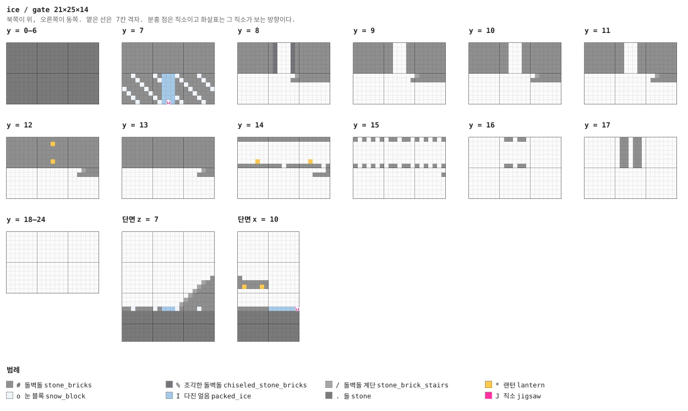

<details><summary>층별 지도 (텍스트)</summary>

```
y = 0–6   x →동, z ↓남
  vvvvvvvvvvvvvvvvvvvvv
  vvvvvvvvvvvvvvvvvvvvv
  vvvvvvvvvvvvvvvvvvvvv
  vvvvvvvvvvvvvvvvvvvvv
  vvvvvvvvvvvvvvvvvvvvv
  vvvvvvvvvvvvvvvvvvvvv
  vvvvvvvvvvvvvvvvvvvvv
  vvvvvvvvvvvvvvvvvvvvv
  vvvvvvvvvvvvvvvvvvvvv
  vvvvvvvvvvvvvvvvvvvvv
  vvvvvvvvvvvvvvvvvvvvv
  vvvvvvvvvvvvvvvvvvvvv
  vvvvvvvvvvvvvvvvvvvvv
  vvvvvvvvvvvvvvvvvvvvv
y = 7   x →동, z ↓남
  #####################
  #####################
  #####################
  #####################
  #####################
  #####################
  #####################
  ##o####o#IIIo####o###
  ###o####oIII#o####o##
  ####o####III##o####o#
  o####o###III###o####o
  #o####o##III####o####
  ##o####o#IIIo####o###
  ###o####oIJI#o####o##
y = 8   x →동, z ↓남
  ########%...%########
  ########%...%########
  ########%...%########
  ########%...%########
  ########%...%########
  ########%...%########
  ########%...%########
  .............<#######
  .c..........#########
  .a.............^.....
  .....................
  .....................
  .....................
  .....................
y = 9   x →동, z ↓남
  #########...#########
  #########...#########
  #########...#########
  #########...#########
  #########...#########
  #########...#########
  #########...#########
  ..............<######
  .............########
  .....................
  .....................
  .....................
  .....................
  .....................
y = 10   x →동, z ↓남
  #########...#########
  #########...#########
  #########...#########
  #########...#########
  #########...#########
  #########...#########
  #########...#########
  ...............<#####
  ..............#######
  .....................
  .....................
  .....................
  .....................
  .....................
y = 11   x →동, z ↓남
  #########...#########
  #########...#########
  #########...#########
  #########...#########
  #########...#########
  #########...#########
  #########...#########
  ................<####
  ...............######
  .....................
  .....................
  .....................
  .....................
  .....................
y = 12   x →동, z ↓남
  #####################
  ##########*##########
  #####################
  #####################
  #####################
  ##########*##########
  #####################
  .................<###
  ................#####
  .....................
  .....................
  .....................
  .....................
  .....................
y = 13   x →동, z ↓남
  #####################
  #####################
  #####################
  #####################
  #####################
  #####################
  #####################
  ..................<##
  .................####
  .....................
  .....................
  .....................
  .....................
  .....................
y = 14   x →동, z ↓남
  #####################
  .....................
  .....................
  .....................
  .....................
  ....*...........*....
  ##########.########.#
  ....................#
  .................####
  .....................
  .....................
  .....................
  .....................
  .....................
y = 15   x →동, z ↓남
  #.#.#.#.##.##.#.#.#.#
  .....................
  .....................
  .....................
  .....................
  .....................
  #.#.#.#.##.##.#.#.#.#
  .....................
  ....................#
  .....................
  .....................
  .....................
  .....................
  .....................
y = 16   x →동, z ↓남
  ........##.##........
  .....................
  .....................
  .....................
  .....................
  .....................
  ........##.##........
  .....................
  .....................
  .....................
  .....................
  .....................
  .....................
  .....................
y = 17   x →동, z ↓남
  ........##.##........
  ........##.##........
  ........##.##........
  ........##.##........
  ........##.##........
  ........##.##........
  ........##.##........
  .....................
  .....................
  .....................
  .....................
  .....................
  .....................
  .....................
y = 18–24   x →동, z ↓남
  .....................
  .....................
  .....................
  .....................
  .....................
  .....................
  .....................
  .....................
  .....................
  .....................
  .....................
  .....................
  .....................
  .....................
```

</details>

<details><summary>세로 단면 (텍스트)</summary>

```
단면 z = 7   x →동, y ↑하늘
  .....................
  .....................
  .....................
  .....................
  .....................
  .....................
  .....................
  .....................
  .....................
  .....................
  ....................#
  ..................<##
  .................<###
  ................<####
  ...............<#####
  ..............<######
  .............<#######
  ##o####o#IIIo####o###
  vvvvvvvvvvvvvvvvvvvvv
  vvvvvvvvvvvvvvvvvvvvv
  vvvvvvvvvvvvvvvvvvvvv
  vvvvvvvvvvvvvvvvvvvvv
  vvvvvvvvvvvvvvvvvvvvv
  vvvvvvvvvvvvvvvvvvvvv
  vvvvvvvvvvvvvvvvvvvvv
단면 x = 10   z →남, y ↑하늘
  ..............
  ..............
  ..............
  ..............
  ..............
  ..............
  ..............
  ..............
  ..............
  ..............
  #.............
  #######.......
  #*###*#.......
  ..............
  ..............
  ..............
  ..............
  #######IIIIIIJ
  vvvvvvvvvvvvvv
  vvvvvvvvvvvvvv
  vvvvvvvvvvvvvv
  vvvvvvvvvvvvvv
  vvvvvvvvvvvvvv
  vvvvvvvvvvvvvv
  vvvvvvvvvvvvvv
```

</details>


### `panel` — 21×25×14

성벽 한 장과 **그 앞의 안뜰 일곱 칸**을 함께 가진 조각. 안뜰을 같이 갖는 이유는 직소가
자식을 바로 옆에 붙이기 때문이다 — 벽만 있는 조각은 아성에 딱 붙어 버린다.

아래 일곱 칸은 기초고, 위는 공기로 파낸다. 비탈에서 성을 평평하게 앉히는 것이 이 두 가지다.

**어느 풀에 있나** — `panels` (가중치 1)

| 직소 위치 | 향 | name | target | pool |
|---|---|---|---|---|
| (10, 7, 13) | ▼ 남 | `ice_wall` | `ice_wall` | `—` |

**뚫린 면** — 서: z 0–13, y 8–24 (192칸) / 동: z 0–13, y 8–24 (177칸) / 북: x 0–20, y 15–24 (199칸) / 남: x 0–20, y 8–24 (357칸) / 위: x 0–20, z 0–13 (294칸)

**블록** — 조약 심층암 2058, 윤나는 섬록암 1280, 눈 블록 29, 섬록암 계단 6, 랜턴 2, 상자 1, 통 1, 직소 1

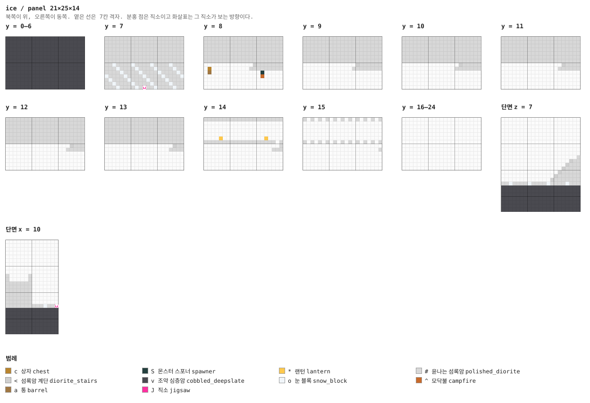

<details><summary>층별 지도 (텍스트)</summary>

```
y = 0–6   x →동, z ↓남
  vvvvvvvvvvvvvvvvvvvvv
  vvvvvvvvvvvvvvvvvvvvv
  vvvvvvvvvvvvvvvvvvvvv
  vvvvvvvvvvvvvvvvvvvvv
  vvvvvvvvvvvvvvvvvvvvv
  vvvvvvvvvvvvvvvvvvvvv
  vvvvvvvvvvvvvvvvvvvvv
  vvvvvvvvvvvvvvvvvvvvv
  vvvvvvvvvvvvvvvvvvvvv
  vvvvvvvvvvvvvvvvvvvvv
  vvvvvvvvvvvvvvvvvvvvv
  vvvvvvvvvvvvvvvvvvvvv
  vvvvvvvvvvvvvvvvvvvvv
  vvvvvvvvvvvvvvvvvvvvv
y = 7   x →동, z ↓남
  #####################
  #####################
  #####################
  #####################
  #####################
  #####################
  #####################
  ##o####o####o####o###
  ###o####o####o####o##
  ####o####o####o####o#
  o####o####o####o####o
  #o####o####o####o####
  ##o####o####o####o###
  ###o####o#J##o####o##
y = 8   x →동, z ↓남
  #####################
  #####################
  #####################
  #####################
  #####################
  #####################
  #####################
  .............<#######
  .c..........#########
  .a.............S.....
  ...............^.....
  .....................
  .....................
  .....................
y = 9   x →동, z ↓남
  #####################
  #####################
  #####################
  #####################
  #####################
  #####################
  #####################
  ..............<######
  .............########
  .....................
  .....................
  .....................
  .....................
  .....................
y = 10   x →동, z ↓남
  #####################
  #####################
  #####################
  #####################
  #####################
  #####################
  #####################
  ...............<#####
  ..............#######
  .....................
  .....................
  .....................
  .....................
  .....................
y = 11   x →동, z ↓남
  #####################
  #####################
  #####################
  #####################
  #####################
  #####################
  #####################
  ................<####
  ...............######
  .....................
  .....................
  .....................
  .....................
  .....................
y = 12   x →동, z ↓남
  #####################
  #####################
  #####################
  #####################
  #####################
  #####################
  #####################
  .................<###
  ................#####
  .....................
  .....................
  .....................
  .....................
  .....................
y = 13   x →동, z ↓남
  #####################
  #####################
  #####################
  #####################
  #####################
  #####################
  #####################
  ..................<##
  .................####
  .....................
  .....................
  .....................
  .....................
  .....................
y = 14   x →동, z ↓남
  #####################
  .....................
  .....................
  .....................
  .....................
  ....*...........*....
  ###################.#
  ....................#
  ..................###
  .....................
  .....................
  .....................
  .....................
  .....................
y = 15   x →동, z ↓남
  #.#.#.#.#.#.#.#.#.#.#
  .....................
  .....................
  .....................
  .....................
  .....................
  #.#.#.#.#.#.#.#.#.#.#
  .....................
  ....................#
  .....................
  .....................
  .....................
  .....................
  .....................
y = 16–24   x →동, z ↓남
  .....................
  .....................
  .....................
  .....................
  .....................
  .....................
  .....................
  .....................
  .....................
  .....................
  .....................
  .....................
  .....................
  .....................
```

</details>

<details><summary>세로 단면 (텍스트)</summary>

```
단면 z = 7   x →동, y ↑하늘
  .....................
  .....................
  .....................
  .....................
  .....................
  .....................
  .....................
  .....................
  .....................
  .....................
  ....................#
  ..................<##
  .................<###
  ................<####
  ...............<#####
  ..............<######
  .............<#######
  ##o####o####o####o###
  vvvvvvvvvvvvvvvvvvvvv
  vvvvvvvvvvvvvvvvvvvvv
  vvvvvvvvvvvvvvvvvvvvv
  vvvvvvvvvvvvvvvvvvvvv
  vvvvvvvvvvvvvvvvvvvvv
  vvvvvvvvvvvvvvvvvvvvv
  vvvvvvvvvvvvvvvvvvvvv
단면 x = 10   z →남, y ↑하늘
  ..............
  ..............
  ..............
  ..............
  ..............
  ..............
  ..............
  ..............
  ..............
  #.....#.......
  #.....#.......
  #######.......
  #######.......
  #######.......
  #######.......
  #######.......
  #######.......
  ##########o##J
  vvvvvvvvvvvvvv
  vvvvvvvvvvvvvv
  vvvvvvvvvvvvvv
  vvvvvvvvvvvvvv
  vvvvvvvvvvvvvv
  vvvvvvvvvvvvvv
  vvvvvvvvvvvvvv
```

</details>


### `panel_end` — 21×25×14

북벽과 남벽. `panel`과 같은데 **양 끝에 탑을 부르는 직소가 하나씩** 더 있다. 동·서벽에는
없다 — 탑을 두 방향에서 부르면 회전이 갈리기 때문이다 (§13).

왼쪽 끝은 `ice_corner_a`, 오른쪽 끝은 `ice_corner_b`로 이름이 다르고, 그래서 거울인 두 탑이
각자 제자리에 놓인다.

**어느 풀에 있나** — `panels_end` (가중치 1)

| 직소 위치 | 향 | name | target | pool |
|---|---|---|---|---|
| (0, 7, 3) | ◀ 서 | `ice_corner_a` | `ice_corner_a` | `ice/corner_a` |
| (20, 7, 3) | ▶ 동 | `ice_corner_b` | `ice_corner_b` | `ice/corner_b` |
| (10, 7, 13) | ▼ 남 | `ice_wall` | `ice_wall` | `—` |

**뚫린 면** — 서: z 0–13, y 8–24 (192칸) / 동: z 0–13, y 8–24 (177칸) / 북: x 0–20, y 15–24 (199칸) / 남: x 0–20, y 8–24 (357칸) / 위: x 0–20, z 0–13 (294칸)

**블록** — 조약 심층암 2058, 윤나는 섬록암 1278, 눈 블록 29, 섬록암 계단 6, 직소 3, 랜턴 2, 상자 1, 통 1

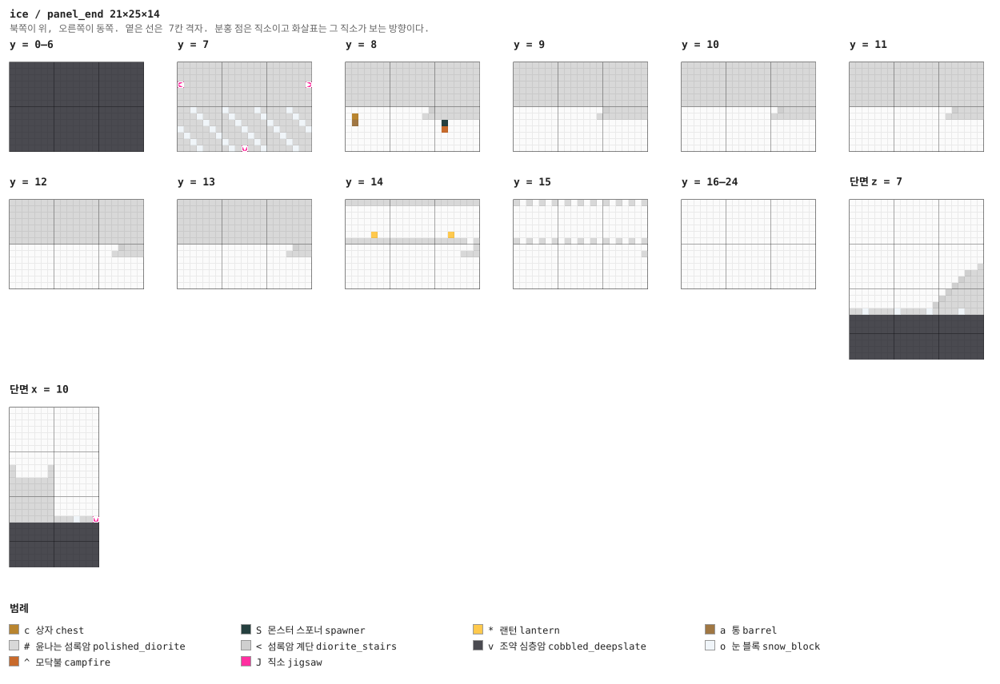

<details><summary>층별 지도 (텍스트)</summary>

```
y = 0–6   x →동, z ↓남
  vvvvvvvvvvvvvvvvvvvvv
  vvvvvvvvvvvvvvvvvvvvv
  vvvvvvvvvvvvvvvvvvvvv
  vvvvvvvvvvvvvvvvvvvvv
  vvvvvvvvvvvvvvvvvvvvv
  vvvvvvvvvvvvvvvvvvvvv
  vvvvvvvvvvvvvvvvvvvvv
  vvvvvvvvvvvvvvvvvvvvv
  vvvvvvvvvvvvvvvvvvvvv
  vvvvvvvvvvvvvvvvvvvvv
  vvvvvvvvvvvvvvvvvvvvv
  vvvvvvvvvvvvvvvvvvvvv
  vvvvvvvvvvvvvvvvvvvvv
  vvvvvvvvvvvvvvvvvvvvv
y = 7   x →동, z ↓남
  #####################
  #####################
  #####################
  J###################J
  #####################
  #####################
  #####################
  ##o####o####o####o###
  ###o####o####o####o##
  ####o####o####o####o#
  o####o####o####o####o
  #o####o####o####o####
  ##o####o####o####o###
  ###o####o#J##o####o##
y = 8   x →동, z ↓남
  #####################
  #####################
  #####################
  #####################
  #####################
  #####################
  #####################
  .............<#######
  .c..........#########
  .a.............S.....
  ...............^.....
  .....................
  .....................
  .....................
y = 9   x →동, z ↓남
  #####################
  #####################
  #####################
  #####################
  #####################
  #####################
  #####################
  ..............<######
  .............########
  .....................
  .....................
  .....................
  .....................
  .....................
y = 10   x →동, z ↓남
  #####################
  #####################
  #####################
  #####################
  #####################
  #####################
  #####################
  ...............<#####
  ..............#######
  .....................
  .....................
  .....................
  .....................
  .....................
y = 11   x →동, z ↓남
  #####################
  #####################
  #####################
  #####################
  #####################
  #####################
  #####################
  ................<####
  ...............######
  .....................
  .....................
  .....................
  .....................
  .....................
y = 12   x →동, z ↓남
  #####################
  #####################
  #####################
  #####################
  #####################
  #####################
  #####################
  .................<###
  ................#####
  .....................
  .....................
  .....................
  .....................
  .....................
y = 13   x →동, z ↓남
  #####################
  #####################
  #####################
  #####################
  #####################
  #####################
  #####################
  ..................<##
  .................####
  .....................
  .....................
  .....................
  .....................
  .....................
y = 14   x →동, z ↓남
  #####################
  .....................
  .....................
  .....................
  .....................
  ....*...........*....
  ###################.#
  ....................#
  ..................###
  .....................
  .....................
  .....................
  .....................
  .....................
y = 15   x →동, z ↓남
  #.#.#.#.#.#.#.#.#.#.#
  .....................
  .....................
  .....................
  .....................
  .....................
  #.#.#.#.#.#.#.#.#.#.#
  .....................
  ....................#
  .....................
  .....................
  .....................
  .....................
  .....................
y = 16–24   x →동, z ↓남
  .....................
  .....................
  .....................
  .....................
  .....................
  .....................
  .....................
  .....................
  .....................
  .....................
  .....................
  .....................
  .....................
  .....................
```

</details>

<details><summary>세로 단면 (텍스트)</summary>

```
단면 z = 7   x →동, y ↑하늘
  .....................
  .....................
  .....................
  .....................
  .....................
  .....................
  .....................
  .....................
  .....................
  .....................
  ....................#
  ..................<##
  .................<###
  ................<####
  ...............<#####
  ..............<######
  .............<#######
  ##o####o####o####o###
  vvvvvvvvvvvvvvvvvvvvv
  vvvvvvvvvvvvvvvvvvvvv
  vvvvvvvvvvvvvvvvvvvvv
  vvvvvvvvvvvvvvvvvvvvv
  vvvvvvvvvvvvvvvvvvvvv
  vvvvvvvvvvvvvvvvvvvvv
  vvvvvvvvvvvvvvvvvvvvv
단면 x = 10   z →남, y ↑하늘
  ..............
  ..............
  ..............
  ..............
  ..............
  ..............
  ..............
  ..............
  ..............
  #.....#.......
  #.....#.......
  #######.......
  #######.......
  #######.......
  #######.......
  #######.......
  #######.......
  ##########o##J
  vvvvvvvvvvvvvv
  vvvvvvvvvvvvvv
  vvvvvvvvvvvvvv
  vvvvvvvvvvvvvv
  vvvvvvvvvvvvvv
  vvvvvvvvvvvvvv
  vvvvvvvvvvvvvv
```

</details>


### `tower_a` — 14×25×14

북서 귀퉁이. 14×14를 네 칸으로 나눠 **바깥 모서리에 탑, 두 팔은 성벽, 안쪽은 안뜰**이다.
탑 안에 사다리가 있어 순찰로로 오르고, 꼭대기에 총안이 뚫린 관이 얹힌다. 스트레이 스포너가
하나 있다.

직소가 **하나뿐**이라 회전이 하나로 정해진다. 둘이었다면 어느 벽이 먼저 부르느냐에 따라 탑이
안뜰로 들어왔을 것이다.

**어느 풀에 있나** — `corner_a` (가중치 1)

| 직소 위치 | 향 | name | target | pool |
|---|---|---|---|---|
| (13, 7, 3) | ▶ 동 | `ice_corner_a` | `ice_corner_a` | `—` |

**뚫린 면** — 서: z 0–13, y 15–24 (76칸) / 동: z 0–13, y 8–24 (194칸) / 북: x 0–13, y 15–24 (76칸) / 남: x 0–13, y 8–24 (194칸) / 위: x 0–13, z 0–13 (196칸)

**블록** — 조약 심층암 1372, 윤나는 섬록암 1188, 사다리 13, 눈 블록 11, 철창 8, 상자 1, 통 1, 랜턴 1

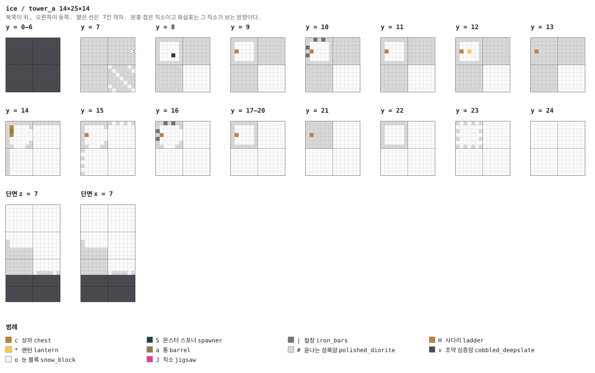

<details><summary>층별 지도 (텍스트)</summary>

```
y = 0–6   x →동, z ↓남
  vvvvvvvvvvvvvv
  vvvvvvvvvvvvvv
  vvvvvvvvvvvvvv
  vvvvvvvvvvvvvv
  vvvvvvvvvvvvvv
  vvvvvvvvvvvvvv
  vvvvvvvvvvvvvv
  vvvvvvvvvvvvvv
  vvvvvvvvvvvvvv
  vvvvvvvvvvvvvv
  vvvvvvvvvvvvvv
  vvvvvvvvvvvvvv
  vvvvvvvvvvvvvv
  vvvvvvvvvvvvvv
y = 7   x →동, z ↓남
  ##############
  ##############
  ##############
  #############J
  ##############
  ##############
  ##############
  #######o####o#
  ########o####o
  #########o####
  ##########o###
  ###########o##
  #######o####o#
  ########o####o
y = 8   x →동, z ↓남
  ##############
  #.....########
  #.....########
  #.....########
  #...S.########
  #.....########
  ##############
  #######.......
  #######.......
  #######.......
  #######.......
  #######.......
  #######.......
  #######.......
y = 9   x →동, z ↓남
  ##############
  #.....########
  #.....########
  #H....########
  #.....########
  #.....########
  ##############
  #######.......
  #######.......
  #######.......
  #######.......
  #######.......
  #######.......
  #######.......
y = 10   x →동, z ↓남
  ##|#|#########
  #.....########
  |.....########
  #H....########
  |.....########
  #.....########
  ##############
  #######.......
  #######.......
  #######.......
  #######.......
  #######.......
  #######.......
  #######.......
y = 11   x →동, z ↓남
  ##############
  #.....########
  #.....########
  #H....########
  #.....########
  #.....########
  ##############
  #######.......
  #######.......
  #######.......
  #######.......
  #######.......
  #######.......
  #######.......
y = 12   x →동, z ↓남
  ##############
  #.....########
  #.....########
  #H.*..########
  #.....########
  #.....########
  ##############
  #######.......
  #######.......
  #######.......
  #######.......
  #######.......
  #######.......
  #######.......
y = 13   x →동, z ↓남
  ##############
  ##############
  ##############
  #H############
  ##############
  ##############
  ##############
  #######.......
  #######.......
  #######.......
  #######.......
  #######.......
  #######.......
  #######.......
y = 14   x →동, z ↓남
  ##############
  #c....#.......
  #a............
  #H............
  #.............
  #.....#.......
  ##...##.......
  #.............
  #.............
  #.............
  #.............
  #.............
  #.............
  #.............
y = 15   x →동, z ↓남
  ########.#.#.#
  #.....#.......
  #.............
  #H............
  #.............
  #.....#.......
  ##...##.......
  #.............
  ..............
  #.............
  ..............
  #.............
  ..............
  #.............
y = 16   x →동, z ↓남
  ##|#|##.......
  #.....#.......
  |.............
  #H............
  |.............
  #.....#.......
  ##...##.......
  ..............
  ..............
  ..............
  ..............
  ..............
  ..............
  ..............
y = 17–20   x →동, z ↓남
  #######.......
  #.....#.......
  #.....#.......
  #H....#.......
  #.....#.......
  #.....#.......
  #######.......
  ..............
  ..............
  ..............
  ..............
  ..............
  ..............
  ..............
y = 21   x →동, z ↓남
  #######.......
  #######.......
  #######.......
  #H#####.......
  #######.......
  #######.......
  #######.......
  ..............
  ..............
  ..............
  ..............
  ..............
  ..............
  ..............
y = 22   x →동, z ↓남
  #######.......
  #.....#.......
  #.....#.......
  #.....#.......
  #.....#.......
  #.....#.......
  #######.......
  ..............
  ..............
  ..............
  ..............
  ..............
  ..............
  ..............
y = 23   x →동, z ↓남
  #.#.#.#.......
  ..............
  #.....#.......
  ..............
  #.....#.......
  ..............
  #.#.#.#.......
  ..............
  ..............
  ..............
  ..............
  ..............
  ..............
  ..............
y = 24   x →동, z ↓남
  ..............
  ..............
  ..............
  ..............
  ..............
  ..............
  ..............
  ..............
  ..............
  ..............
  ..............
  ..............
  ..............
  ..............
```

</details>

<details><summary>세로 단면 (텍스트)</summary>

```
단면 z = 7   x →동, y ↑하늘
  ..............
  ..............
  ..............
  ..............
  ..............
  ..............
  ..............
  ..............
  ..............
  #.............
  #.............
  #######.......
  #######.......
  #######.......
  #######.......
  #######.......
  #######.......
  #######o####o#
  vvvvvvvvvvvvvv
  vvvvvvvvvvvvvv
  vvvvvvvvvvvvvv
  vvvvvvvvvvvvvv
  vvvvvvvvvvvvvv
  vvvvvvvvvvvvvv
  vvvvvvvvvvvvvv
단면 x = 7   z →남, y ↑하늘
  ..............
  ..............
  ..............
  ..............
  ..............
  ..............
  ..............
  ..............
  ..............
  #.............
  #.............
  #######.......
  #######.......
  #######.......
  #######.......
  #######.......
  #######.......
  #######o####o#
  vvvvvvvvvvvvvv
  vvvvvvvvvvvvvv
  vvvvvvvvvvvvvv
  vvvvvvvvvvvvvv
  vvvvvvvvvvvvvv
  vvvvvvvvvvvvvv
  vvvvvvvvvvvvvv
```

</details>


### `tower_b` — 14×25×14

북동 귀퉁이. `tower_a`를 x로 뒤집은 것이다. 바닐라는 돌려는 줘도 뒤집어 주지 않는다.

**어느 풀에 있나** — `corner_b` (가중치 1)

| 직소 위치 | 향 | name | target | pool |
|---|---|---|---|---|
| (0, 7, 3) | ◀ 서 | `ice_corner_b` | `ice_corner_b` | `—` |

**뚫린 면** — 서: z 0–13, y 8–24 (194칸) / 동: z 0–13, y 15–24 (76칸) / 북: x 0–13, y 15–24 (76칸) / 남: x 0–13, y 8–24 (194칸) / 위: x 0–13, z 0–13 (196칸)

**블록** — 조약 심층암 1372, 윤나는 섬록암 1188, 사다리 14, 눈 블록 11, 철창 8, 직소 1, 상자 1, 통 1

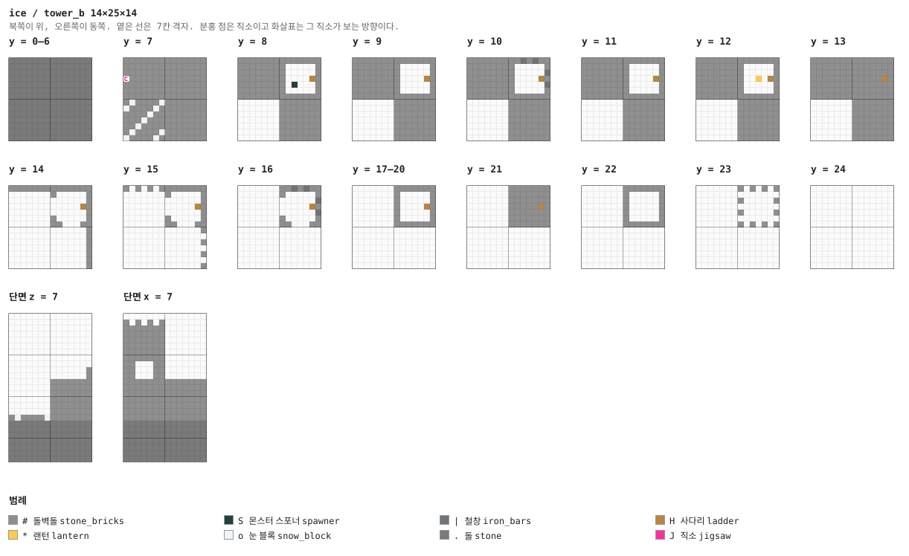

<details><summary>층별 지도 (텍스트)</summary>

```
y = 0–6   x →동, z ↓남
  vvvvvvvvvvvvvv
  vvvvvvvvvvvvvv
  vvvvvvvvvvvvvv
  vvvvvvvvvvvvvv
  vvvvvvvvvvvvvv
  vvvvvvvvvvvvvv
  vvvvvvvvvvvvvv
  vvvvvvvvvvvvvv
  vvvvvvvvvvvvvv
  vvvvvvvvvvvvvv
  vvvvvvvvvvvvvv
  vvvvvvvvvvvvvv
  vvvvvvvvvvvvvv
  vvvvvvvvvvvvvv
y = 7   x →동, z ↓남
  ##############
  ##############
  ##############
  J#############
  ##############
  ##############
  ##############
  #o####o#######
  o####o########
  ####o#########
  ###o##########
  ##o###########
  #o####o#######
  o####o########
y = 8   x →동, z ↓남
  ##############
  ########.....#
  ########.....#
  ########....H#
  ########.S...#
  ########.....#
  ##############
  .......#######
  .......#######
  .......#######
  .......#######
  .......#######
  .......#######
  .......#######
y = 9   x →동, z ↓남
  ##############
  ########.....#
  ########.....#
  ########....H#
  ########.....#
  ########.....#
  ##############
  .......#######
  .......#######
  .......#######
  .......#######
  .......#######
  .......#######
  .......#######
y = 10   x →동, z ↓남
  #########|#|##
  ########.....#
  ########.....|
  ########....H#
  ########.....|
  ########.....#
  ##############
  .......#######
  .......#######
  .......#######
  .......#######
  .......#######
  .......#######
  .......#######
y = 11   x →동, z ↓남
  ##############
  ########.....#
  ########.....#
  ########....H#
  ########.....#
  ########.....#
  ##############
  .......#######
  .......#######
  .......#######
  .......#######
  .......#######
  .......#######
  .......#######
y = 12   x →동, z ↓남
  ##############
  ########.....#
  ########.....#
  ########..*.H#
  ########.....#
  ########.....#
  ##############
  .......#######
  .......#######
  .......#######
  .......#######
  .......#######
  .......#######
  .......#######
y = 13   x →동, z ↓남
  ##############
  ##############
  ##############
  ############H#
  ##############
  ##############
  ##############
  .......#######
  .......#######
  .......#######
  .......#######
  .......#######
  .......#######
  .......#######
y = 14   x →동, z ↓남
  ##############
  .c.....#.....#
  .a...........#
  ............H#
  .............#
  .......#.....#
  .......##...##
  .............#
  .............#
  .............#
  .............#
  .............#
  .............#
  .............#
y = 15   x →동, z ↓남
  #.#.#.########
  .......#.....#
  .............#
  ............H#
  .............#
  .......#.....#
  .......##...##
  .............#
  ..............
  .............#
  ..............
  .............#
  ..............
  .............#
y = 16   x →동, z ↓남
  .......##|#|##
  .......#.....#
  .............|
  ............H#
  .............|
  .......#.....#
  .......##...##
  ..............
  ..............
  ..............
  ..............
  ..............
  ..............
  ..............
y = 17–20   x →동, z ↓남
  .......#######
  .......#.....#
  .......#.....#
  .......#....H#
  .......#.....#
  .......#.....#
  .......#######
  ..............
  ..............
  ..............
  ..............
  ..............
  ..............
  ..............
y = 21   x →동, z ↓남
  .......#######
  .......#######
  .......#######
  .......#####H#
  .......#######
  .......#######
  .......#######
  ..............
  ..............
  ..............
  ..............
  ..............
  ..............
  ..............
y = 22   x →동, z ↓남
  .......#######
  .......#.....#
  .......#.....#
  .......#.....#
  .......#.....#
  .......#.....#
  .......#######
  ..............
  ..............
  ..............
  ..............
  ..............
  ..............
  ..............
y = 23   x →동, z ↓남
  .......#.#.#.#
  ..............
  .......#.....#
  ..............
  .......#.....#
  ..............
  .......#.#.#.#
  ..............
  ..............
  ..............
  ..............
  ..............
  ..............
  ..............
y = 24   x →동, z ↓남
  ..............
  ..............
  ..............
  ..............
  ..............
  ..............
  ..............
  ..............
  ..............
  ..............
  ..............
  ..............
  ..............
  ..............
```

</details>

<details><summary>세로 단면 (텍스트)</summary>

```
단면 z = 7   x →동, y ↑하늘
  ..............
  ..............
  ..............
  ..............
  ..............
  ..............
  ..............
  ..............
  ..............
  .............#
  .............#
  .......#######
  .......#######
  .......#######
  .......#######
  .......#######
  .......#######
  #o####o#######
  vvvvvvvvvvvvvv
  vvvvvvvvvvvvvv
  vvvvvvvvvvvvvv
  vvvvvvvvvvvvvv
  vvvvvvvvvvvvvv
  vvvvvvvvvvvvvv
  vvvvvvvvvvvvvv
단면 x = 7   z →남, y ↑하늘
  ..............
  #.#.#.#.......
  #######.......
  #######.......
  #######.......
  #######.......
  #######.......
  #######.......
  ##...##.......
  ##...##.......
  ##...##.......
  ##############
  ##############
  ##############
  ##############
  ##############
  ##############
  ##############
  vvvvvvvvvvvvvv
  vvvvvvvvvvvvvv
  vvvvvvvvvvvvvv
  vvvvvvvvvvvvvv
  vvvvvvvvvvvvvv
  vvvvvvvvvvvvvv
  vvvvvvvvvvvvvv
```

</details>


### `shaft` — 7×14×7 — 1×2×1 셀

아성 바닥에서 바위 속으로 14칸. 아성과 x·z가 같아 사다리가 한 줄로 이어진다.

**어느 풀에 있나** — `down` (가중치 1)

| 직소 위치 | 향 | name | target | pool |
|---|---|---|---|---|
| (5, 0, 3) | ◇ 아래 | `ice_door` | `ice_door` | `ice/cellar_first` |
| (5, 13, 3) | ◆ 위 | `ice_down` | `ice_down` | `—` |

**뚫린 면** — 아래: x 2–4, z 2–4 (8칸) / 위: x 2–4, z 2–4 (8칸)

**블록** — 심층암 타일 488, 윤나는 섬록암 70, 사다리 14, 직소 2

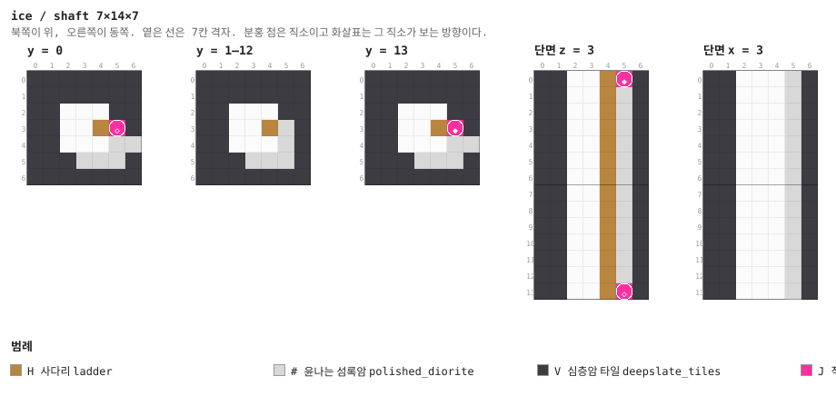

<details><summary>층별 지도 (텍스트)</summary>

```
y = 0   x →동, z ↓남
  VVVVVVV
  VVVVVVV
  VV...VV
  VV..HJV
  VV...##
  VVV###V
  VVVVVVV
y = 1–12   x →동, z ↓남
  VVVVVVV
  VVVVVVV
  VV...VV
  VV..H#V
  VV...#V
  VVV###V
  VVVVVVV
y = 13   x →동, z ↓남
  VVVVVVV
  VVVVVVV
  VV...VV
  VV..HJV
  VV...##
  VVV###V
  VVVVVVV
```

</details>

<details><summary>세로 단면 (텍스트)</summary>

```
단면 z = 3   x →동, y ↑하늘
  VV..HJV
  VV..H#V
  VV..H#V
  VV..H#V
  VV..H#V
  VV..H#V
  VV..H#V
  VV..H#V
  VV..H#V
  VV..H#V
  VV..H#V
  VV..H#V
  VV..H#V
  VV..HJV
단면 x = 3   z →남, y ↑하늘
  VV...#V
  VV...#V
  VV...#V
  VV...#V
  VV...#V
  VV...#V
  VV...#V
  VV...#V
  VV...#V
  VV...#V
  VV...#V
  VV...#V
  VV...#V
  VV...#V
```

</details>


### `cellar_hub` — 7×7×7 — 1×1×1 셀

사다리가 닿는 방. 서·동·북문이 창고 미로로, **남문 하나만** `ice_lord`를 target으로 삼아
보스 사슬을 부른다.

천장 구멍을 **직소보다 먼저** 파야 한다 (§11).

**어느 풀에 있나** — `cellar_first` (가중치 1)

| 직소 위치 | 향 | name | target | pool |
|---|---|---|---|---|
| (3, 0, 0) | ▲ 북 | `ice_door` | `ice_door` | `ice/cellars` |
| (0, 0, 3) | ◀ 서 | `ice_door` | `ice_door` | `ice/cellars` |
| (3, 0, 6) | ▼ 남 | `ice_door` | `ice_lord` | `ice/lord_approach_1` |
| (5, 6, 3) | ◆ 위 | `ice_door` | `ice_door` | `—` |

**뚫린 면** — 서: z 2–4, y 1–4 (12칸) / 동: z 2–4, y 0–4 (13칸) / 북: x 2–4, y 1–4 (12칸) / 남: x 2–4, y 1–4 (12칸) / 아래: x 6–6, z 3–3 (1칸) / 위: x 2–4, z 2–4 (8칸)

**블록** — 심층암 타일 106, 다진 얼음 45, 윤나는 섬록암 10, 사다리 7, 직소 4

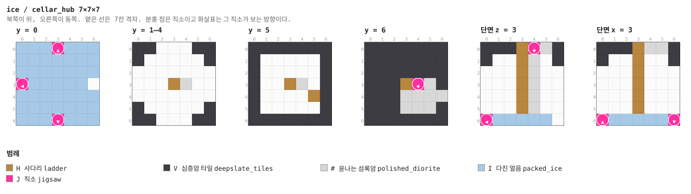

<details><summary>층별 지도 (텍스트)</summary>

```
y = 0   x →동, z ↓남
  IIIJIII
  IIIIIII
  IIIIIII
  JIIIII.
  IIIIIII
  IIIIIII
  IIIJIII
y = 1–4   x →동, z ↓남
  VV...VV
  V.....V
  .......
  ....H#.
  .......
  V.....V
  VV...VV
y = 5   x →동, z ↓남
  VVVVVVV
  V.....V
  V.....V
  V...H#V
  V....HV
  V.....V
  VVVVVVV
y = 6   x →동, z ↓남
  VVVVVVV
  VVVVVVV
  VV...VV
  VV..HJV
  VV...##
  VVV###V
  VVVVVVV
```

</details>


### `passage` — 7×7×7 — 1×1×1 셀

미로의 기본 단위.

**어느 풀에 있나** — `cellars` (가중치 9)

| 직소 위치 | 향 | name | target | pool |
|---|---|---|---|---|
| (0, 0, 3) | ◀ 서 | `ice_door` | `ice_door` | `ice/cellars` |
| (6, 0, 3) | ▶ 동 | `ice_door` | `ice_door` | `ice/cellars` |

**뚫린 면** — 서: z 2–4, y 1–4 (12칸) / 동: z 2–4, y 1–4 (12칸)

**블록** — 심층암 타일 145, 다진 얼음 47, 직소 2

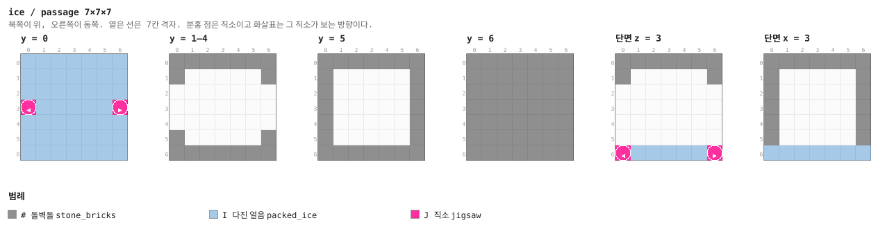

<details><summary>층별 지도 (텍스트)</summary>

```
y = 0   x →동, z ↓남
  IIIIIII
  IIIIIII
  IIIIIII
  JIIIIIJ
  IIIIIII
  IIIIIII
  IIIIIII
y = 1–4   x →동, z ↓남
  VVVVVVV
  V.....V
  .......
  .......
  .......
  V.....V
  VVVVVVV
y = 5   x →동, z ↓남
  VVVVVVV
  V.....V
  V.....V
  V.....V
  V.....V
  V.....V
  VVVVVVV
y = 6   x →동, z ↓남
  VVVVVVV
  VVVVVVV
  VVVVVVV
  VVVVVVV
  VVVVVVV
  VVVVVVV
  VVVVVVV
```

</details>


### `passage_guard` — 7×7×7 — 1×1×1 셀

통로 한가운데 스트레이 스포너. 평범한 통로와 같은 풀에 섞여 나온다.

**어느 풀에 있나** — `cellars` (가중치 5)

| 직소 위치 | 향 | name | target | pool |
|---|---|---|---|---|
| (0, 0, 3) | ◀ 서 | `ice_door` | `ice_door` | `ice/cellars` |
| (6, 0, 3) | ▶ 동 | `ice_door` | `ice_door` | `ice/cellars` |

**뚫린 면** — 서: z 2–4, y 1–4 (12칸) / 동: z 2–4, y 1–4 (12칸)

**블록** — 심층암 타일 145, 다진 얼음 47, 직소 2, 몬스터 스포너 1

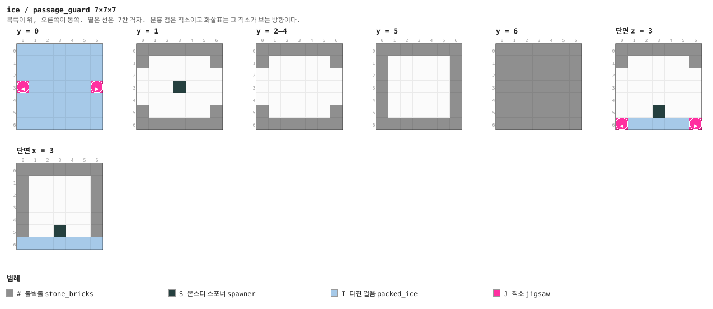

<details><summary>층별 지도 (텍스트)</summary>

```
y = 0   x →동, z ↓남
  IIIIIII
  IIIIIII
  IIIIIII
  JIIIIIJ
  IIIIIII
  IIIIIII
  IIIIIII
y = 1   x →동, z ↓남
  VVVVVVV
  V.....V
  .......
  ...S...
  .......
  V.....V
  VVVVVVV
y = 2–4   x →동, z ↓남
  VVVVVVV
  V.....V
  .......
  .......
  .......
  V.....V
  VVVVVVV
y = 5   x →동, z ↓남
  VVVVVVV
  V.....V
  V.....V
  V.....V
  V.....V
  V.....V
  VVVVVVV
y = 6   x →동, z ↓남
  VVVVVVV
  VVVVVVV
  VVVVVVV
  VVVVVVV
  VVVVVVV
  VVVVVVV
  VVVVVVV
```

</details>


### `corner` — 7×7×7 — 1×1×1 셀

꺾이는 통로.

**어느 풀에 있나** — `cellars` (가중치 9)

| 직소 위치 | 향 | name | target | pool |
|---|---|---|---|---|
| (0, 0, 3) | ◀ 서 | `ice_door` | `ice_door` | `ice/cellars` |
| (3, 0, 6) | ▼ 남 | `ice_door` | `ice_door` | `ice/cellars` |

**뚫린 면** — 서: z 2–4, y 1–4 (12칸) / 남: x 2–4, y 1–4 (12칸)

**블록** — 심층암 타일 145, 다진 얼음 47, 직소 2

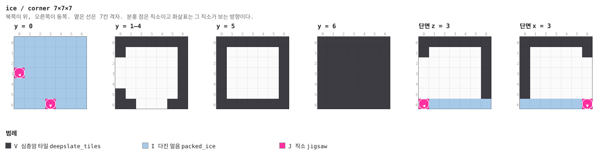

<details><summary>층별 지도 (텍스트)</summary>

```
y = 0   x →동, z ↓남
  IIIIIII
  IIIIIII
  IIIIIII
  JIIIIII
  IIIIIII
  IIIIIII
  IIIJIII
y = 1–4   x →동, z ↓남
  VVVVVVV
  V.....V
  ......V
  ......V
  ......V
  V.....V
  VV...VV
y = 5   x →동, z ↓남
  VVVVVVV
  V.....V
  V.....V
  V.....V
  V.....V
  V.....V
  VVVVVVV
y = 6   x →동, z ↓남
  VVVVVVV
  VVVVVVV
  VVVVVVV
  VVVVVVV
  VVVVVVV
  VVVVVVV
  VVVVVVV
```

</details>


### `cross` — 7×7×7 — 1×1×1 셀

십자 교차로.

**어느 풀에 있나** — `cellars` (가중치 4)

| 직소 위치 | 향 | name | target | pool |
|---|---|---|---|---|
| (3, 0, 0) | ▲ 북 | `ice_door` | `ice_door` | `ice/cellars` |
| (0, 0, 3) | ◀ 서 | `ice_door` | `ice_door` | `ice/cellars` |
| (6, 0, 3) | ▶ 동 | `ice_door` | `ice_door` | `ice/cellars` |
| (3, 0, 6) | ▼ 남 | `ice_door` | `ice_door` | `ice/cellars` |

**뚫린 면** — 서: z 2–4, y 1–4 (12칸) / 동: z 2–4, y 1–4 (12칸) / 북: x 2–4, y 1–4 (12칸) / 남: x 2–4, y 1–4 (12칸)

**블록** — 심층암 타일 121, 다진 얼음 45, 직소 4

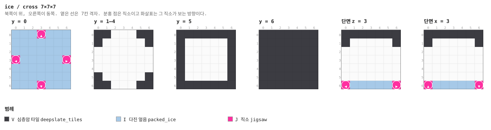

<details><summary>층별 지도 (텍스트)</summary>

```
y = 0   x →동, z ↓남
  IIIJIII
  IIIIIII
  IIIIIII
  JIIIIIJ
  IIIIIII
  IIIIIII
  IIIJIII
y = 1–4   x →동, z ↓남
  VV...VV
  V.....V
  .......
  .......
  .......
  V.....V
  VV...VV
y = 5   x →동, z ↓남
  VVVVVVV
  V.....V
  V.....V
  V.....V
  V.....V
  V.....V
  VVVVVVV
y = 6   x →동, z ↓남
  VVVVVVV
  VVVVVVV
  VVVVVVV
  VVVVVVV
  VVVVVVV
  VVVVVVV
  VVVVVVV
```

</details>


### `cross_guard` — 7×7×7 — 1×1×1 셀

교차로 한가운데 스켈레톤 스포너.

**어느 풀에 있나** — `cellars` (가중치 3)

| 직소 위치 | 향 | name | target | pool |
|---|---|---|---|---|
| (3, 0, 0) | ▲ 북 | `ice_door` | `ice_door` | `ice/cellars` |
| (0, 0, 3) | ◀ 서 | `ice_door` | `ice_door` | `ice/cellars` |
| (6, 0, 3) | ▶ 동 | `ice_door` | `ice_door` | `ice/cellars` |
| (3, 0, 6) | ▼ 남 | `ice_door` | `ice_door` | `ice/cellars` |

**뚫린 면** — 서: z 2–4, y 1–4 (12칸) / 동: z 2–4, y 1–4 (12칸) / 북: x 2–4, y 1–4 (12칸) / 남: x 2–4, y 1–4 (12칸)

**블록** — 심층암 타일 121, 다진 얼음 45, 직소 4, 몬스터 스포너 1

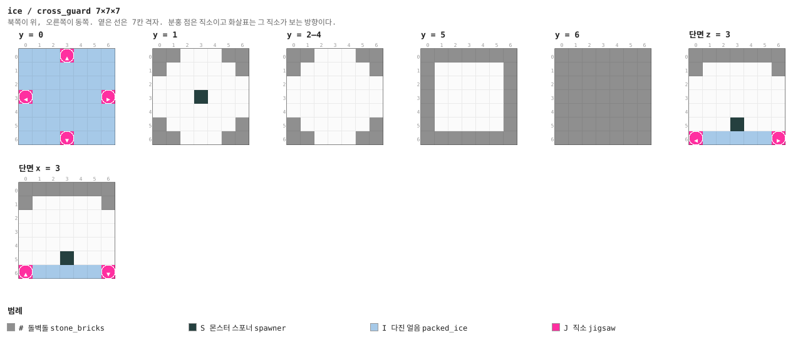

<details><summary>층별 지도 (텍스트)</summary>

```
y = 0   x →동, z ↓남
  IIIJIII
  IIIIIII
  IIIIIII
  JIIIIIJ
  IIIIIII
  IIIIIII
  IIIJIII
y = 1   x →동, z ↓남
  VV...VV
  V.....V
  .......
  ...S...
  .......
  V.....V
  VV...VV
y = 2–4   x →동, z ↓남
  VV...VV
  V.....V
  .......
  .......
  .......
  V.....V
  VV...VV
y = 5   x →동, z ↓남
  VVVVVVV
  V.....V
  V.....V
  V.....V
  V.....V
  V.....V
  VVVVVVV
y = 6   x →동, z ↓남
  VVVVVVV
  VVVVVVV
  VVVVVVV
  VVVVVVV
  VVVVVVV
  VVVVVVV
  VVVVVVV
```

</details>


### `store` — 7×7×7 — 1×1×1 셀

막다른 창고. 문이 하나면 상자를 준다.

**어느 풀에 있나** — `cellars` (가중치 8)

| 직소 위치 | 향 | name | target | pool |
|---|---|---|---|---|
| (0, 0, 3) | ◀ 서 | `ice_door` | `ice_door` | `ice/cellars` |

**뚫린 면** — 서: z 2–4, y 1–4 (12칸)

**블록** — 심층암 타일 157, 다진 얼음 58, 직소 1, 상자 1

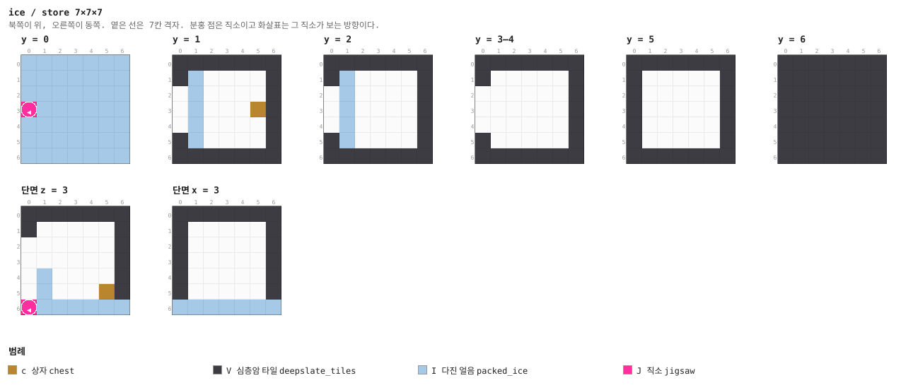

<details><summary>층별 지도 (텍스트)</summary>

```
y = 0   x →동, z ↓남
  IIIIIII
  IIIIIII
  IIIIIII
  JIIIIII
  IIIIIII
  IIIIIII
  IIIIIII
y = 1   x →동, z ↓남
  VVVVVVV
  VI....V
  .I....V
  .I...cV
  .I....V
  VI....V
  VVVVVVV
y = 2   x →동, z ↓남
  VVVVVVV
  VI....V
  .I....V
  .I....V
  .I....V
  VI....V
  VVVVVVV
y = 3–4   x →동, z ↓남
  VVVVVVV
  V.....V
  ......V
  ......V
  ......V
  V.....V
  VVVVVVV
y = 5   x →동, z ↓남
  VVVVVVV
  V.....V
  V.....V
  V.....V
  V.....V
  V.....V
  VVVVVVV
y = 6   x →동, z ↓남
  VVVVVVV
  VVVVVVV
  VVVVVVV
  VVVVVVV
  VVVVVVV
  VVVVVVV
  VVVVVVV
```

</details>


### `larder` — 7×7×7 — 1×1×1 셀

얼음에 파묻은 식량고. 상자와 통.

**어느 풀에 있나** — `cellars` (가중치 6)

| 직소 위치 | 향 | name | target | pool |
|---|---|---|---|---|
| (0, 0, 3) | ◀ 서 | `ice_door` | `ice_door` | `ice/cellars` |

**뚫린 면** — 서: z 2–4, y 1–4 (12칸)

**블록** — 심층암 타일 157, 다진 얼음 63, 직소 1, 상자 1

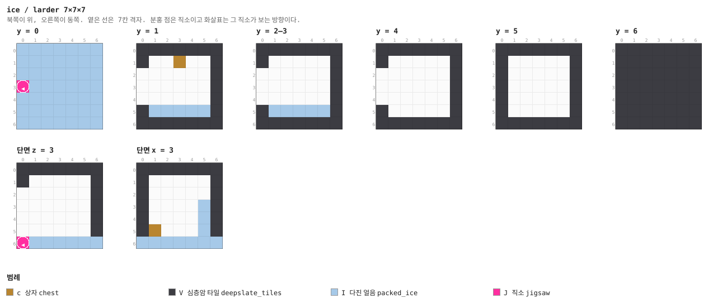

<details><summary>층별 지도 (텍스트)</summary>

```
y = 0   x →동, z ↓남
  IIIIIII
  IIIIIII
  IIIIIII
  JIIIIII
  IIIIIII
  IIIIIII
  IIIIIII
y = 1   x →동, z ↓남
  VVVVVVV
  V..c..V
  ......V
  ......V
  ......V
  VIIIIIV
  VVVVVVV
y = 2–3   x →동, z ↓남
  VVVVVVV
  V.....V
  ......V
  ......V
  ......V
  VIIIIIV
  VVVVVVV
y = 4   x →동, z ↓남
  VVVVVVV
  V.....V
  ......V
  ......V
  ......V
  V.....V
  VVVVVVV
y = 5   x →동, z ↓남
  VVVVVVV
  V.....V
  V.....V
  V.....V
  V.....V
  V.....V
  VVVVVVV
y = 6   x →동, z ↓남
  VVVVVVV
  VVVVVVV
  VVVVVVV
  VVVVVVV
  VVVVVVV
  VVVVVVV
  VVVVVVV
```

</details>


### `powder` — 7×7×7 — 1×1×1 셀

가루눈 웅덩이. 바닥 한 켜가 전부 가루눈이라 **가죽 부츠 없이는 빠진다.** 밟아서 터지는
장치가 아니라 그냥 거기 있는 것이라, 몹이 먼저 발동시켜 버릴 수가 없다 (§12).

**어느 풀에 있나** — `cellars` (가중치 5)

| 직소 위치 | 향 | name | target | pool |
|---|---|---|---|---|
| (0, 0, 3) | ◀ 서 | `ice_door` | `ice_door` | `ice/cellars` |
| (6, 0, 3) | ▶ 동 | `ice_door` | `ice_door` | `ice/cellars` |

**뚫린 면** — 서: z 2–4, y 1–4 (12칸) / 동: z 2–4, y 1–4 (12칸)

**블록** — 심층암 타일 145, 다진 얼음 24, 가루눈 23, 직소 2

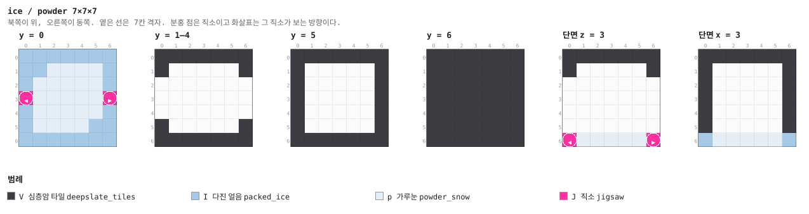

<details><summary>층별 지도 (텍스트)</summary>

```
y = 0   x →동, z ↓남
  IIIIIII
  IIppppI
  IpppppI
  JpppppJ
  IpppppI
  IppppII
  IIIIIII
y = 1–4   x →동, z ↓남
  VVVVVVV
  V.....V
  .......
  .......
  .......
  V.....V
  VVVVVVV
y = 5   x →동, z ↓남
  VVVVVVV
  V.....V
  V.....V
  V.....V
  V.....V
  V.....V
  VVVVVVV
y = 6   x →동, z ↓남
  VVVVVVV
  VVVVVVV
  VVVVVVV
  VVVVVVV
  VVVVVVV
  VVVVVVV
  VVVVVVV
```

</details>


### `slick` — 7×7×7 — 1×1×1 셀

바닥이 푸른 얼음. 미끄러워서 멈출 수가 없다.

**어느 풀에 있나** — `cellars` (가중치 5)

| 직소 위치 | 향 | name | target | pool |
|---|---|---|---|---|
| (0, 0, 3) | ◀ 서 | `ice_door` | `ice_door` | `ice/cellars` |
| (6, 0, 3) | ▶ 동 | `ice_door` | `ice_door` | `ice/cellars` |

**뚫린 면** — 서: z 2–4, y 1–4 (12칸) / 동: z 2–4, y 1–4 (12칸)

**블록** — 심층암 타일 145, 푸른 얼음 25, 다진 얼음 22, 직소 2

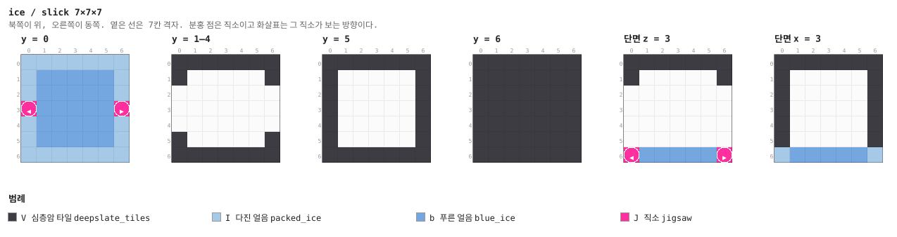

<details><summary>층별 지도 (텍스트)</summary>

```
y = 0   x →동, z ↓남
  IIIIIII
  IbbbbbI
  IbbbbbI
  JbbbbbJ
  IbbbbbI
  IbbbbbI
  IIIIIII
y = 1–4   x →동, z ↓남
  VVVVVVV
  V.....V
  .......
  .......
  .......
  V.....V
  VVVVVVV
y = 5   x →동, z ↓남
  VVVVVVV
  V.....V
  V.....V
  V.....V
  V.....V
  V.....V
  VVVVVVV
y = 6   x →동, z ↓남
  VVVVVVV
  VVVVVVV
  VVVVVVV
  VVVVVVV
  VVVVVVV
  VVVVVVV
  VVVVVVV
```

</details>


### `bear_den` — 7×7×7 — 1×1×1 셀

북극곰 스포너와 상자. 문이 하나뿐이니 들어갔다 돌아 나와야 한다.

**어느 풀에 있나** — `cellars` (가중치 4)

| 직소 위치 | 향 | name | target | pool |
|---|---|---|---|---|
| (0, 0, 3) | ◀ 서 | `ice_door` | `ice_door` | `ice/cellars` |

**뚫린 면** — 서: z 2–4, y 1–4 (12칸)

**블록** — 심층암 타일 157, 다진 얼음 48, 눈 블록 24, 직소 1, 몬스터 스포너 1, 상자 1

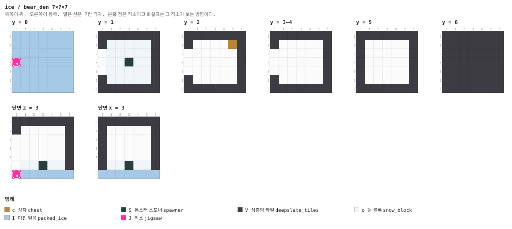

<details><summary>층별 지도 (텍스트)</summary>

```
y = 0   x →동, z ↓남
  IIIIIII
  IIIIIII
  IIIIIII
  JIIIIII
  IIIIIII
  IIIIIII
  IIIIIII
y = 1   x →동, z ↓남
  VVVVVVV
  VoooooV
  .oooooV
  .ooSooV
  .oooooV
  VoooooV
  VVVVVVV
y = 2   x →동, z ↓남
  VVVVVVV
  V....cV
  ......V
  ......V
  ......V
  V.....V
  VVVVVVV
y = 3–4   x →동, z ↓남
  VVVVVVV
  V.....V
  ......V
  ......V
  ......V
  V.....V
  VVVVVVV
y = 5   x →동, z ↓남
  VVVVVVV
  V.....V
  V.....V
  V.....V
  V.....V
  V.....V
  VVVVVVV
y = 6   x →동, z ↓남
  VVVVVVV
  VVVVVVV
  VVVVVVV
  VVVVVVV
  VVVVVVV
  VVVVVVV
  VVVVVVV
```

</details>


### `cap` — 1×7×7

두께 1의 돌벽돌 벽. 창고 풀의 fallback (§4).

**어느 풀에 있나** — `cellar_caps` (가중치 1)

| 직소 위치 | 향 | name | target | pool |
|---|---|---|---|---|
| (0, 0, 3) | ◀ 서 | `ice_door` | `ice_door` | `ice/cellar_caps` |

**블록** — 심층암 타일 48, 직소 1

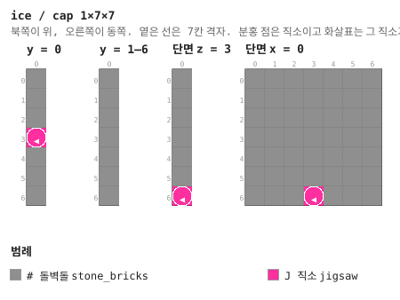

<details><summary>층별 지도 (텍스트)</summary>

```
y = 0   x →동, z ↓남
  V
  V
  V
  J
  V
  V
  V
y = 1–6   x →동, z ↓남
  V
  V
  V
  V
  V
  V
  V
```

</details>


### `approach_1` — 7×7×7 — 1×1×1 셀

보스 사슬의 1번째 칸. **서문만 이름이 `ice_lord`**이고 동문의 target이 `ice_lord`다. 부모는
서문으로만 들어올 수 있어 사슬이 거꾸로 흐르지 않는다. 북문은 평범한 미로라 보스 가지도
창고를 낳는다. 우선순위가 10이라 미로보다 먼저 놓인다 (§7).

**어느 풀에 있나** — `lord_approach_1` (가중치 1)

| 직소 위치 | 향 | name | target | pool |
|---|---|---|---|---|
| (3, 0, 0) | ▲ 북 | `ice_door` | `ice_door` | `ice/cellars` |
| (0, 0, 3) | ◀ 서 | `ice_lord` | `ice_door` | `ice/cellars` |
| (6, 0, 3) | ▶ 동 | `ice_door` | `ice_lord` | `ice/lord_approach_2` |

**뚫린 면** — 서: z 2–4, y 1–4 (12칸) / 동: z 2–4, y 1–4 (12칸) / 북: x 2–4, y 1–4 (12칸)

**블록** — 심층암 타일 133, 푸른 얼음 25, 다진 얼음 21, 직소 3

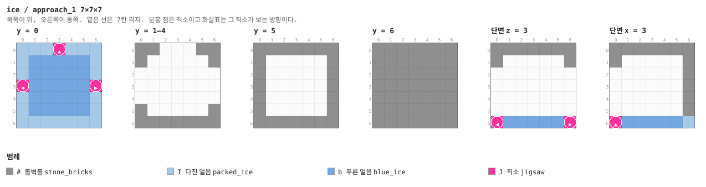

<details><summary>층별 지도 (텍스트)</summary>

```
y = 0   x →동, z ↓남
  IIIJIII
  IbbbbbI
  IbbbbbI
  JbbbbbJ
  IbbbbbI
  IbbbbbI
  IIIIIII
y = 1–4   x →동, z ↓남
  VV...VV
  V.....V
  .......
  .......
  .......
  V.....V
  VVVVVVV
y = 5   x →동, z ↓남
  VVVVVVV
  V.....V
  V.....V
  V.....V
  V.....V
  V.....V
  VVVVVVV
y = 6   x →동, z ↓남
  VVVVVVV
  VVVVVVV
  VVVVVVV
  VVVVVVV
  VVVVVVV
  VVVVVVV
  VVVVVVV
```

</details>


### `approach_2` — 7×7×7 — 1×1×1 셀

보스 사슬의 2번째 칸. **서문만 이름이 `ice_lord`**이고 동문의 target이 `ice_lord`다. 부모는
서문으로만 들어올 수 있어 사슬이 거꾸로 흐르지 않는다. 북문은 평범한 미로라 보스 가지도
창고를 낳는다. 우선순위가 10이라 미로보다 먼저 놓인다 (§7).

**어느 풀에 있나** — `lord_approach_2` (가중치 1)

| 직소 위치 | 향 | name | target | pool |
|---|---|---|---|---|
| (3, 0, 0) | ▲ 북 | `ice_door` | `ice_door` | `ice/cellars` |
| (0, 0, 3) | ◀ 서 | `ice_lord` | `ice_door` | `ice/cellars` |
| (6, 0, 3) | ▶ 동 | `ice_door` | `ice_lord` | `ice/lord_approach_3` |

**뚫린 면** — 서: z 2–4, y 1–4 (12칸) / 동: z 2–4, y 1–4 (12칸) / 북: x 2–4, y 1–4 (12칸)

**블록** — 심층암 타일 133, 푸른 얼음 25, 다진 얼음 21, 직소 3


<details><summary>층별 지도 (텍스트)</summary>

```
y = 0   x →동, z ↓남
  IIIJIII
  IbbbbbI
  IbbbbbI
  JbbbbbJ
  IbbbbbI
  IbbbbbI
  IIIIIII
y = 1–4   x →동, z ↓남
  VV...VV
  V.....V
  .......
  .......
  .......
  V.....V
  VVVVVVV
y = 5   x →동, z ↓남
  VVVVVVV
  V.....V
  V.....V
  V.....V
  V.....V
  V.....V
  VVVVVVV
y = 6   x →동, z ↓남
  VVVVVVV
  VVVVVVV
  VVVVVVV
  VVVVVVV
  VVVVVVV
  VVVVVVV
  VVVVVVV
```

</details>


### `approach_3` — 7×7×7 — 1×1×1 셀

보스 사슬의 3번째 칸. **서문만 이름이 `ice_lord`**이고 동문의 target이 `ice_lord`다. 부모는
서문으로만 들어올 수 있어 사슬이 거꾸로 흐르지 않는다. 북문은 평범한 미로라 보스 가지도
창고를 낳는다. 우선순위가 10이라 미로보다 먼저 놓인다 (§7).

**어느 풀에 있나** — `lord_approach` (가중치 1), `lord_approach_3` (가중치 1)

| 직소 위치 | 향 | name | target | pool |
|---|---|---|---|---|
| (3, 0, 0) | ▲ 북 | `ice_door` | `ice_door` | `ice/cellars` |
| (0, 0, 3) | ◀ 서 | `ice_lord` | `ice_door` | `ice/cellars` |
| (6, 0, 3) | ▶ 동 | `ice_door` | `ice_lord` | `ice/lord_approach` |

**뚫린 면** — 서: z 2–4, y 1–4 (12칸) / 동: z 2–4, y 1–4 (12칸) / 북: x 2–4, y 1–4 (12칸)

**블록** — 심층암 타일 133, 푸른 얼음 25, 다진 얼음 21, 직소 3

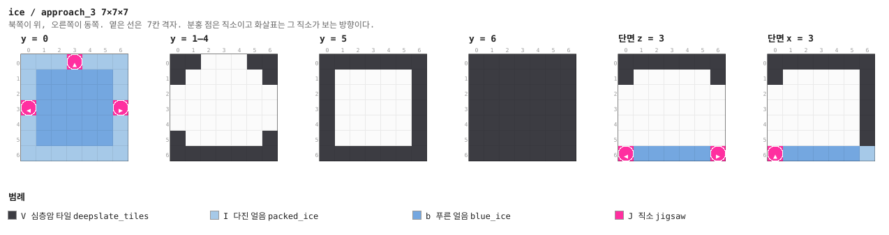

<details><summary>층별 지도 (텍스트)</summary>

```
y = 0   x →동, z ↓남
  IIIJIII
  IbbbbbI
  IbbbbbI
  JbbbbbJ
  IbbbbbI
  IbbbbbI
  IIIIIII
y = 1–4   x →동, z ↓남
  VV...VV
  V.....V
  .......
  .......
  .......
  V.....V
  VVVVVVV
y = 5   x →동, z ↓남
  VVVVVVV
  V.....V
  V.....V
  V.....V
  V.....V
  V.....V
  VVVVVVV
y = 6   x →동, z ↓남
  VVVVVVV
  VVVVVVV
  VVVVVVV
  VVVVVVV
  VVVVVVV
  VVVVVVV
  VVVVVVV
```

</details>


### `frost_hall` — 21×14×21 — 3×2×3 셀

21×14×21. 얼어붙은 저수조고 가운데 푸른 얼음 바닥 위 단상에 서리 군주(스트레이, 체력 90,
힘 III 활) 트라이얼 스포너가 선다. 사분면마다 경비 스포너 넷(스트레이·스켈레톤·북극곰).

입구는 서쪽 하나뿐이고 나가는 문이 없다. 클리어 판정과 보상은 트라이얼 스포너가 한다 (§7).

확정 보상: **마법 부여(25~30) 다이아 방어구 1 + 서리 걷기 II 책** + 느려짐 화살 12~16 +
가루눈 양동이. 서리 걷기는 마법 부여대에서 나오지 않는 보물 마법이라 이 책이 유일한 길이다.

**어느 풀에 있나** — `lord_approach` (가중치 1)

| 직소 위치 | 향 | name | target | pool |
|---|---|---|---|---|
| (0, 0, 10) | ◀ 서 | `ice_lord` | `ice_door` | `—` |

**뚫린 면** — 서: z 9–11, y 1–4 (12칸)

**블록** — 심층암 타일 1389, 다진 얼음 576, 푸른 얼음 91, 조각한 심층암 9, 트라이얼 스포너 5, 직소 1

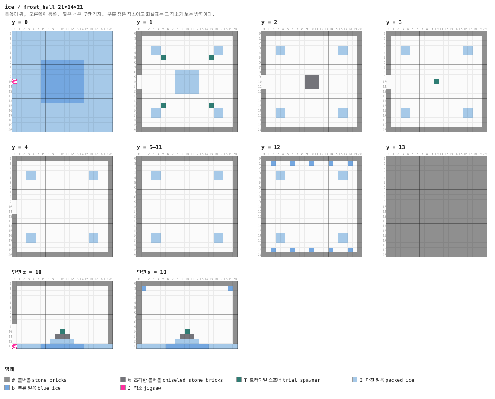

<details><summary>층별 지도 (텍스트)</summary>

```
y = 0   x →동, z ↓남
  IIIIIIIIIIIIIIIIIIIII
  IIIIIIIIIIIIIIIIIIIII
  IIIIIIIIIIIIIIIIIIIII
  IIIIIIIIIIIIIIIIIIIII
  IIIIIIIIIIIIIIIIIIIII
  IIIIIIIIIIIIIIIIIIIII
  IIIIIIbbbbbbbbbIIIIII
  IIIIIIbbbbbbbbbIIIIII
  IIIIIIbbbbbbbbbIIIIII
  IIIIIIbbbbbbbbbIIIIII
  JIIIIIbbbbbbbbbIIIIII
  IIIIIIbbbbbbbbbIIIIII
  IIIIIIbbbbbbbbbIIIIII
  IIIIIIbbbbbbbbbIIIIII
  IIIIIIbbbbbbbbbIIIIII
  IIIIIIIIIIIIIIIIIIIII
  IIIIIIIIIIIIIIIIIIIII
  IIIIIIIIIIIIIIIIIIIII
  IIIIIIIIIIIIIIIIIIIII
  IIIIIIIIIIIIIIIIIIIII
  IIIIIIIIIIIIIIIIIIIII
y = 1   x →동, z ↓남
  VVVVVVVVVVVVVVVVVVVVV
  V...................V
  V...................V
  V..II...........II..V
  V..II...........II..V
  V....T.........T....V
  V...................V
  V...................V
  V.......IIIII.......V
  ........IIIII.......V
  ........IIIII.......V
  ........IIIII.......V
  V.......IIIII.......V
  V...................V
  V...................V
  V....T.........T....V
  V..II...........II..V
  V..II...........II..V
  V...................V
  V...................V
  VVVVVVVVVVVVVVVVVVVVV
y = 2   x →동, z ↓남
  VVVVVVVVVVVVVVVVVVVVV
  V...................V
  V...................V
  V..II...........II..V
  V..II...........II..V
  V...................V
  V...................V
  V...................V
  V...................V
  .........yyy........V
  .........yyy........V
  .........yyy........V
  V...................V
  V...................V
  V...................V
  V...................V
  V..II...........II..V
  V..II...........II..V
  V...................V
  V...................V
  VVVVVVVVVVVVVVVVVVVVV
y = 3   x →동, z ↓남
  VVVVVVVVVVVVVVVVVVVVV
  V...................V
  V...................V
  V..II...........II..V
  V..II...........II..V
  V...................V
  V...................V
  V...................V
  V...................V
  ....................V
  ..........T.........V
  ....................V
  V...................V
  V...................V
  V...................V
  V...................V
  V..II...........II..V
  V..II...........II..V
  V...................V
  V...................V
  VVVVVVVVVVVVVVVVVVVVV
y = 4   x →동, z ↓남
  VVVVVVVVVVVVVVVVVVVVV
  V...................V
  V...................V
  V..II...........II..V
  V..II...........II..V
  V...................V
  V...................V
  V...................V
  V...................V
  ....................V
  ....................V
  ....................V
  V...................V
  V...................V
  V...................V
  V...................V
  V..II...........II..V
  V..II...........II..V
  V...................V
  V...................V
  VVVVVVVVVVVVVVVVVVVVV
y = 5–11   x →동, z ↓남
  VVVVVVVVVVVVVVVVVVVVV
  V...................V
  V...................V
  V..II...........II..V
  V..II...........II..V
  V...................V
  V...................V
  V...................V
  V...................V
  V...................V
  V...................V
  V...................V
  V...................V
  V...................V
  V...................V
  V...................V
  V..II...........II..V
  V..II...........II..V
  V...................V
  V...................V
  VVVVVVVVVVVVVVVVVVVVV
y = 12   x →동, z ↓남
  VVVVVVVVVVVVVVVVVVVVV
  V.b...b...b...b...b.V
  V...................V
  V..II...........II..V
  V..II...........II..V
  V...................V
  V...................V
  V...................V
  V...................V
  V...................V
  V...................V
  V...................V
  V...................V
  V...................V
  V...................V
  V...................V
  V..II...........II..V
  V..II...........II..V
  V...................V
  V.b...b...b...b...b.V
  VVVVVVVVVVVVVVVVVVVVV
y = 13   x →동, z ↓남
  VVVVVVVVVVVVVVVVVVVVV
  VVVVVVVVVVVVVVVVVVVVV
  VVVVVVVVVVVVVVVVVVVVV
  VVVVVVVVVVVVVVVVVVVVV
  VVVVVVVVVVVVVVVVVVVVV
  VVVVVVVVVVVVVVVVVVVVV
  VVVVVVVVVVVVVVVVVVVVV
  VVVVVVVVVVVVVVVVVVVVV
  VVVVVVVVVVVVVVVVVVVVV
  VVVVVVVVVVVVVVVVVVVVV
  VVVVVVVVVVVVVVVVVVVVV
  VVVVVVVVVVVVVVVVVVVVV
  VVVVVVVVVVVVVVVVVVVVV
  VVVVVVVVVVVVVVVVVVVVV
  VVVVVVVVVVVVVVVVVVVVV
  VVVVVVVVVVVVVVVVVVVVV
  VVVVVVVVVVVVVVVVVVVVV
  VVVVVVVVVVVVVVVVVVVVV
  VVVVVVVVVVVVVVVVVVVVV
  VVVVVVVVVVVVVVVVVVVVV
  VVVVVVVVVVVVVVVVVVVVV
```

</details>

<details><summary>세로 단면 (텍스트)</summary>

```
단면 z = 10   x →동, y ↑하늘
  VVVVVVVVVVVVVVVVVVVVV
  V...................V
  V...................V
  V...................V
  V...................V
  V...................V
  V...................V
  V...................V
  V...................V
  ....................V
  ..........T.........V
  .........yyy........V
  ........IIIII.......V
  JIIIIIbbbbbbbbbIIIIII
단면 x = 10   z →남, y ↑하늘
  VVVVVVVVVVVVVVVVVVVVV
  Vb.................bV
  V...................V
  V...................V
  V...................V
  V...................V
  V...................V
  V...................V
  V...................V
  V...................V
  V.........T.........V
  V........yyy........V
  V.......IIIII.......V
  IIIIIIbbbbbbbbbIIIIII
```

</details>


## 다듬을 곳

**코드가 지은 첫 판이다.** 조각은 출발점이고 예쁘게 만드는 일은 개발 클라이언트에서 한다
(`CLAUDE.md` §16). **조각이 전부 한 변 48 이하라 하나도 빠짐없이 손으로 다시 지을 수 있다** —
`verify()`가 그걸 검사한다. `python tools/workshop.py ice`로 전부 깔린다.

- **성벽이 속이 꽉 차 있다.** 일곱 칸 두께가 통짜라 안이 없다. 안에 회랑을 뚫고 탑과 이으면
  순찰로가 두 층이 된다
- **아성 내부가 휑하다.** 세 층에 모닥불과 상자 하나뿐이다. 무기고·침소·지도실이 들어갈 자리다
- **얼음 창고가 지하감옥과 같은 모양이다.** 통로·교차로·막다른 방. 얼음을 캐던 구덩이나
  얼어붙은 우물처럼 이 던전만의 칸이 필요하다
- **북극곰이 스포너로만 나온다.** 우리 안에 갇힌 곰이 문을 부수고 나오는 그림이 더 낫다
