# 레벨 설계 — 침몰한 등대

> 이 문서는 `python tools/gen_level_doc.py light`가 만든다. 조각을 고치면 다시 돌린다. 그림과 표는 게임이 읽는 파일(`structure/light/*.nbt`, `worldgen/**`)에서 그대로 읽어 온 것이라 모드와 어긋날 수 없다. 설명 문장만 사람이 쓴다 (`tools/gen_level_doc.py`의 `INTRO`·`NOTES`).

## 1. 한눈에

해변에 부서진 등대가 서 있고, 그 바닥 구멍으로 **21칸 내려가면 마른 집수실**이,
그 바닥에 뚫린 구멍 아래로는 **물에 잠긴 프리즈머린 요새**가 있다.

시그니처(확정): **삼지창(충성 III 또는 급류 II) + 해양의 심장.** 바다 탐험과 전달체의
열쇠가 여기서 나온다. 상자마다 **물 호흡 물약**이 들어 있다 — 이 던전에서 그것은
소모품이 아니라 통행권이다.

| 항목 | 값 |
|---|---|
| 생성 단계 | `surface_structures` |
| 바이옴 | `#sydungeon:has_structure/light` |
| 간격 / 최소거리 | spacing 34 / separation 12 |
| 직소 깊이 | 16 ~ 24 (`sydungeon:ranged_jigsaw`) |
| 시작 풀 | `start` |
| 조각 / 풀 | 18개 / 11개 |

## 2. 조립 원리

### 해변까지다. 먼바다는 못 간다

구조물 하나는 **높이 기준(heightmap)을 하나만** 쓴다. 해변 조각은 모래 위에 서야 하므로
`WORLD_SURFACE_WG`인데, 먼바다에서 그 값은 **수면**이라 등대가 파도 위에 뜬다. 그래서
바이옴은 해변·눈 덮인 해변·자갈 해안 셋이고, 바다는 그 등대가 발을 담그고 있는 바다다.

### 물은 상속되지 않는다. 놓는 것이다

늪에서 배운 절반은 "안 쓴 자리는 월드가 갖고 있던 것이 남는다"였다 (§17). 요새는 나머지
절반이 필요하다 — **물을 직접 놓아야 하고**, 놓은 물은 드워프의 용암과 똑같이 갇혀 있어야
한다. 안 그러면 주변 돌로 빠져나가고 요새는 공기로 찬다.

그래서 물이 있는 조각은 자기 **구멍 목록(`ports`)**을 기록하고, `water_problems()`가
검사한다: 물 옆이나 아래에 공기가 있으면 안 되고, 구멍이 아닌 면에 물이 있으면 안 된다.
**위는 보지 않는다** — 그게 수면이고, 이 던전의 마른 쪽과 젖은 쪽이 만나는 곳도 수면이다.

### 마른 쪽과 젖은 쪽은 물이 못 올라오는 자리에서 만난다

물은 위로 흐르지 않는다. 그래서 이음매를 **수직으로** 뒀다. 사다리는 등대에서 집수실까지
내려오고 집수실은 마른 방이다. 그 바닥에 3×3 구멍이 있고 **수면은 그 턱보다 두 칸 아래**다.
뛰어들어 헤엄쳐 내려간다. 물을 막아 줄 문도 유리도 필요 없다 — 이 모드가 믿는 유일한
물막이가 수면이다.

### 문은 물끼리 만난다

잠긴 칸의 문간은 공기가 아니라 **물**이다. 두 칸이 물과 물로 만나야 둘 다 안 마른다.
`door_problems()`가 조각의 가로 직소마다 그 문간 3×4가 전부 물인지 본다 — 한 칸이라도
공기면 그 쌍은 같이 빠진다.

### 보스방은 반쯤 물을 뺐다

물 여섯 켜, 그 위는 공기다. 가디언 스포너는 **물속**에 있고(가디언은 물에서 산다) 파수꾼의
단상은 수면 위로 솟아 있다. 물약 없이도 싸움이 되도록 한 것이고, 콘셉트의 "반은 수중"이
실제로 이 방이다.

### 발동시킬 수 없는 위험만

§12 그대로다. **소울 모래 기포 기둥**(`column`)은 누가 있든 없든 계속 올라가고, 물 자체가
숨을 조른다. 트리거는 하나도 없다.

## 3. 풀 배선

풀이 어떤 조각을 내놓는지(실선, 숫자는 가중치)와 그 조각의 직소가 다시 어떤 풀을 부르는지(점선)다. 직소 생성은 이 그래프를 깊이만큼 따라간다.

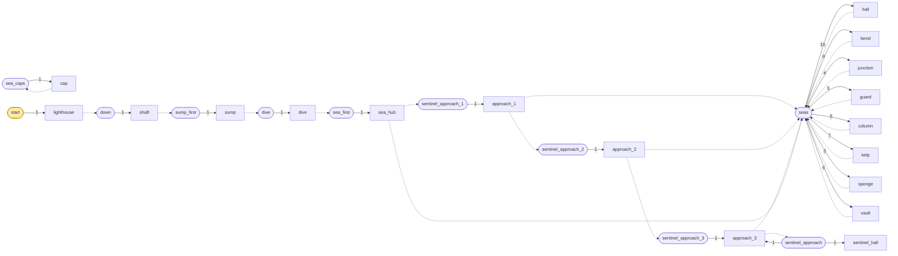

| 풀 | fallback | 원소 (가중치) |
|---|---|---|
| `dive` | `minecraft:empty` | `dive` 1 |
| `down` | `minecraft:empty` | `shaft` 1 |
| `sea_caps` | `minecraft:empty` | `cap` 1 |
| `sea_first` | `minecraft:empty` | `sea_hub` 1 |
| `seas` | `sea_caps` | `hall` 10, `bend` 9, `junction` 4, `guard` 5, `column` 5, `kelp` 7, `sponge` 5, `vault` 6 |
| `sentinel_approach` | `sea_caps` | `sentinel_hall` 1, `approach_3` 1 |
| `sentinel_approach_1` | `sea_caps` | `approach_1` 1 |
| `sentinel_approach_2` | `sea_caps` | `approach_2` 1 |
| `sentinel_approach_3` | `sea_caps` | `approach_3` 1 |
| `start` | `minecraft:empty` | `lighthouse` 1 |
| `sump_first` | `minecraft:empty` | `sump` 1 |

## 4. 뼈대 — 반드시 이렇게 놓이는 부분

등대와 수직통로, 마른 집수실, 물기둥, 그리고 헤엄쳐 닿는 요새 허브.

| 조각 | 놓이는 자리 (시작 조각 기준) | 누가 놓나 |
|---|---|---|
| `lighthouse` | (0, 0, 0) | 시작 풀 |
| `shaft` | (0, -21, 0) | lighthouse의 아래 lht_down 직소 |
| `sump` | (0, -28, 0) | shaft의 아래 lht_down 직소 |
| `dive` | (0, -42, 0) | sump의 아래 lht_down 직소 |
| `sea_hub` | (0, -49, 0) | dive의 아래 lht_sea 직소 |
| `approach_1` | (0, -49, 7) | sea_hub의 남 lht_sea 직소 |
| `approach_2` | (7, -49, 7) | approach_1의 동 lht_sea 직소 |
| `approach_3` | (14, -49, 7) | approach_2의 동 lht_sea 직소 |

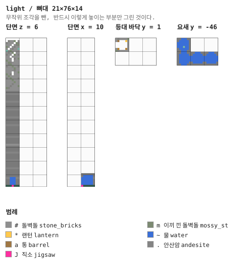

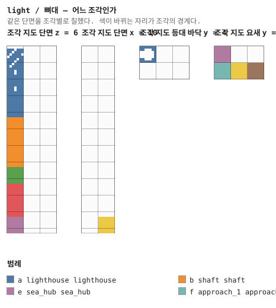

## 5. 조각


그림은 조각 하나를 **층마다 한 장씩** 블록 단위로 그린 것이다. 같은 층이 이어지면 `y = 2–5`처럼 묶었고, 마지막 두 장은 가운데를 자른 세로 단면이다. 분홍 점이 직소, 화살표가 그 직소가 보는 방향이다 — **마주 본 직소끼리만 붙는다.**

### `lighthouse` — 7×27×7

시작 조각. **7×7뿐이다** — 더 넓으면 해변이 제 돌바닥으로 덮인다. 부서진 탑이 26칸 올라가고
바다 쪽(북) 위쪽은 아예 없다. 사다리가 안쪽 동남 기둥을 타고 등실까지 오르고, 등실에는
풍화된 구리 테 안에 바다 랜턴 둘이 있다.

바닥 가운데 3×3 구멍이 요새로 가는 유일한 길이다. 사다리가 걸린 줄은 바닥 켜에서 남겨
두었다 (§24).

**어느 풀에 있나** — `start` (가중치 1)

| 직소 위치 | 향 | name | target | pool |
|---|---|---|---|---|
| (2, 0, 5) | ◇ 아래 | `lht_down` | `lht_down` | `light/down` |

**뚫린 면** — 서: z 0–6, y 1–26 (40칸) / 동: z 0–6, y 21–26 (24칸) / 북: x 0–6, y 8–26 (44칸) / 남: x 0–6, y 8–26 (20칸) / 아래: x 2–4, z 2–3 (6칸) / 위: x 0–6, z 0–6 (49칸)

**블록** — 돌벽돌 405, 이끼 낀 돌벽돌 71, 금 간 돌벽돌 69, 사다리 23, 어두운 프리즈머린 21, 풍화된 구리 18, 프리즈머린 벽돌 5, 바다 랜턴 2

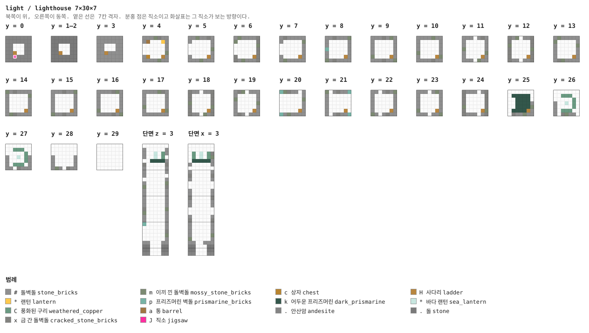

<details><summary>층별 지도 (텍스트)</summary>

```
y = 0   x →동, z ↓남
  #######
  #######
  ##...##
  ##...##
  ##H####
  ##J####
  #######
y = 1   x →동, z ↓남
  #x####m
  #a...*#
  ......#
  ......#
  ......#
  #c...H#
  mx#####
y = 2   x →동, z ↓남
  ##x##m#
  #.....#
  ......#
  ......#
  ......#
  m....H#
  ##x###m
y = 3   x →동, z ↓남
  ###xm##
  #.....#
  ......#
  ......#
  ......#
  #....Hm
  ###x###
y = 4   x →동, z ↓남
  ###mx##
  #.....#
  ......#
  ......#
  ......m
  #....H#
  ####m##
y = 5   x →동, z ↓남
  ##m##x#
  #.....#
  m.....#
  p.....m
  #.....#
  #....H#
  ###m###
y = 6   x →동, z ↓남
  xm####x
  m.....x
  x.....m
  x.....x
  x.....x
  x....Hx
  x#m###x
y = 7   x →동, z ↓남
  mx#####
  #.....m
  #.....#
  #.....#
  #.....#
  #....H#
  #m#####
y = 8   x →동, z ↓남
  ##x.##m
  #.....#
  #.....#
  #.....#
  #.....#
  #....H#
  m#x.###
y = 9   x →동, z ↓남
  ###.#m#
  #.....#
  #.....#
  #.....#
  #.....#
  m....H#
  ###.##m
y = 10   x →동, z ↓남
  ####m##
  #.....#
  #.....#
  #.....#
  m.....#
  #....Hm
  ####x##
y = 11   x →동, z ↓남
  ###m#x#
  #.....#
  #.....#
  m.....#
  #.....m
  #....H#
  ####m##
y = 12   x →동, z ↓남
  x#m###x
  x.....x
  m.....x
  x.....m
  x.....x
  x....Hx
  x##m##x
y = 13   x →동, z ↓남
  #m#####
  m.....#
  #.....m
  #.....#
  #.....#
  #....H#
  #xm####
y = 14   x →동, z ↓남
  m#x####
  #.....m
  #.....#
  #.....#
  #.....#
  #....H#
  #mx####
y = 15   x →동, z ↓남
  ###.##m
  #.....#
  #.....#
  #.....#
  #.....#
  #....H#
  m##.###
y = 16   x →동, z ↓남
  ###.xm#
  #.....#
  #.....#
  #.....#
  #.....#
  m....H#
  ###.x#m
y = 17   x →동, z ↓남
  ##.#mx#
  #.....#
  #.....#
  #.....#
  m.....#
  #....Hm
  ##.####
y = 18   x →동, z ↓남
  x##.##x
  x.....x
  x.....x
  m.....x
  x.....m
  x....Hx
  x##.m#x
y = 19   x →동, z ↓남
  #xm#.##
  #.....#
  m.....#
  #.....m
  #.....#
  #....H#
  #x#m.##
y = 20   x →동, z ↓남
  pmx##.#
  ......#
  ......m
  ......#
  ......#
  .....H#
  p#m####
y = 21   x →동, z ↓남
  m.#x##p
  #......
  #......
  #......
  #......
  #....H.
  #.#x##p
y = 22   x →동, z ↓남
  .......
  .kkkkk.
  ..kkkk.
  #.kkkk#
  #.kkkk#
  #kkkkH#
  m#.#x##
y = 23   x →동, z ↓남
  .......
  ..CCC..
  .....C.
  #..*.C#
  #....C#
  m.CCC.#
  ###.#xm
y = 24   x →동, z ↓남
  .......
  ..CCC..
  .....C.
  x..*.Cx
  m....Cx
  x.CCC.m
  x###.mx
y = 25   x →동, z ↓남
  .......
  .......
  .......
  ......#
  ......m
  ......#
  .x##m.#
y = 26   x →동, z ↓남
  .......
  .......
  .......
  .......
  .......
  .......
  .......
```

</details>

<details><summary>세로 단면 (텍스트)</summary>

```
단면 z = 3   x →동, y ↑하늘
  .......
  ......#
  x..*.Cx
  #..*.C#
  #.kkkk#
  #......
  ......#
  #.....m
  m.....x
  #.....#
  #.....#
  #.....#
  #.....#
  #.....#
  x.....m
  m.....#
  #.....#
  #.....#
  #.....#
  #.....#
  x.....x
  p.....m
  ......#
  ......#
  ......#
  ......#
  ##...##
단면 x = 3   z →남, y ↑하늘
  .......
  ......#
  .C.*.C#
  .C.*.C.
  .kkkkk#
  x.....x
  #.....#
  #.....m
  .......
  #.....#
  .......
  .......
  #.....#
  #.....#
  #.....m
  m.....#
  #.....#
  .......
  .......
  #.....#
  #.....#
  #.....m
  m.....#
  x.....x
  #.....#
  #.....#
  ##..###
```

</details>


### `shaft` — 7×21×7 — 1×3×1 셀

마른 수직통로 21칸. 돌과 안산암 띠, 사다리 한 줄.

**어느 풀에 있나** — `down` (가중치 1)

| 직소 위치 | 향 | name | target | pool |
|---|---|---|---|---|
| (2, 0, 5) | ◇ 아래 | `lht_down` | `lht_down` | `light/sump_first` |
| (2, 20, 5) | ◆ 위 | `lht_down` | `lht_down` | `—` |

**뚫린 면** — 아래: x 2–4, z 2–4 (8칸) / 위: x 2–4, z 2–4 (8칸)

**블록** — 돌 638, 안산암 200, 사다리 21, 직소 2

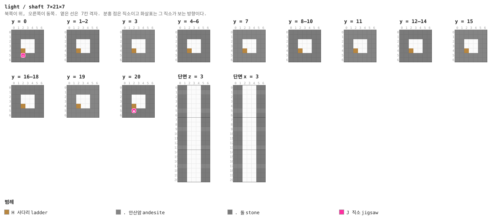

<details><summary>층별 지도 (텍스트)</summary>

```
y = 0   x →동, z ↓남
  .......
  .......
  .......
  .......
  ..H....
  ..J....
  .......
y = 1–2   x →동, z ↓남
  .......
  .......
  .......
  .......
  ..H....
  .......
  .......
y = 3   x →동, z ↓남
  .......
  .......
  .......
  .......
  ..H....
  .......
  .......
y = 4–6   x →동, z ↓남
  .......
  .......
  .......
  .......
  ..H....
  .......
  .......
y = 7   x →동, z ↓남
  .......
  .......
  .......
  .......
  ..H....
  .......
  .......
y = 8–10   x →동, z ↓남
  .......
  .......
  .......
  .......
  ..H....
  .......
  .......
y = 11   x →동, z ↓남
  .......
  .......
  .......
  .......
  ..H....
  .......
  .......
y = 12–14   x →동, z ↓남
  .......
  .......
  .......
  .......
  ..H....
  .......
  .......
y = 15   x →동, z ↓남
  .......
  .......
  .......
  .......
  ..H....
  .......
  .......
y = 16–18   x →동, z ↓남
  .......
  .......
  .......
  .......
  ..H....
  .......
  .......
y = 19   x →동, z ↓남
  .......
  .......
  .......
  .......
  ..H....
  .......
  .......
y = 20   x →동, z ↓남
  .......
  .......
  .......
  .......
  ..H....
  ..J....
  .......
```

</details>

<details><summary>세로 단면 (텍스트)</summary>

```
단면 z = 3   x →동, y ↑하늘
  .......
  .......
  .......
  .......
  .......
  .......
  .......
  .......
  .......
  .......
  .......
  .......
  .......
  .......
  .......
  .......
  .......
  .......
  .......
  .......
  .......
단면 x = 3   z →남, y ↑하늘
  .......
  .......
  .......
  .......
  .......
  .......
  .......
  .......
  .......
  .......
  .......
  .......
  .......
  .......
  .......
  .......
  .......
  .......
  .......
  .......
  .......
```

</details>


### `sump` — 7×7×7 — 1×1×1 셀

집수실. **마른 쪽의 끝이다.** 사다리가 여기서 끝나고, 바닥의 3×3 구멍 아래로 두 칸 내려간
자리가 수면이다. 상자 하나와 통 하나 — 물에 들어가기 전에 물약을 챙기는 방이다.

**어느 풀에 있나** — `sump_first` (가중치 1)

| 직소 위치 | 향 | name | target | pool |
|---|---|---|---|---|
| (2, 0, 5) | ◇ 아래 | `lht_down` | `lht_down` | `light/dive` |
| (2, 6, 5) | ◆ 위 | `lht_down` | `lht_down` | `—` |

**뚫린 면** — 아래: x 2–4, z 2–4 (9칸) / 위: x 2–4, z 2–4 (8칸)

**블록** — 돌 135, 돌벽돌 44, 안산암 24, 사다리 6, 직소 2, 랜턴 2, 상자 1, 통 1

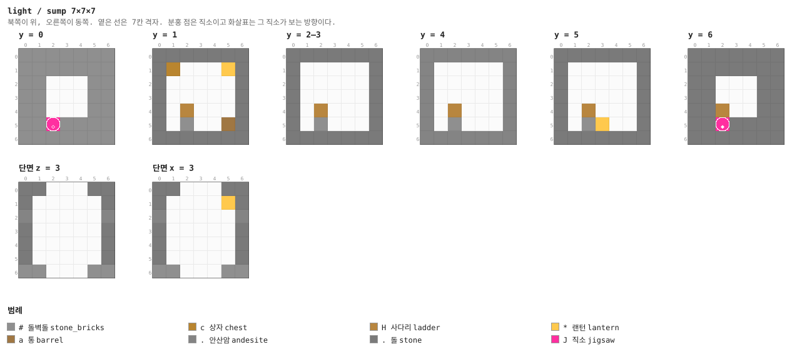

<details><summary>층별 지도 (텍스트)</summary>

```
y = 0   x →동, z ↓남
  #######
  #######
  ##...##
  ##...##
  ##...##
  ##J####
  #######
y = 1   x →동, z ↓남
  .......
  .c...*.
  .......
  .......
  ..H....
  ..#..a.
  .......
y = 2–3   x →동, z ↓남
  .......
  .......
  .......
  .......
  ..H....
  ..#....
  .......
y = 4   x →동, z ↓남
  .......
  .......
  .......
  .......
  ..H....
  ..#....
  .......
y = 5   x →동, z ↓남
  .......
  .......
  .......
  .......
  ..H....
  ..#*...
  .......
y = 6   x →동, z ↓남
  .......
  .......
  .......
  .......
  ..H....
  ..J....
  .......
```

</details>


### `dive` — 7×14×7 — 1×2×1 셀

물기둥. 14칸이고 **맨 윗 켜만 공기**다. 그 한 켜가 수면을 집수실 바닥보다 아래로 잡아 두는
전부다 — 물은 위로 흐르지 않으므로 그것으로 끝이다.

**어느 풀에 있나** — `dive` (가중치 1)

| 직소 위치 | 향 | name | target | pool |
|---|---|---|---|---|
| (2, 0, 5) | ◇ 아래 | `lht_sea` | `lht_sea` | `light/sea_first` |
| (2, 13, 5) | ◆ 위 | `lht_down` | `lht_down` | `—` |

**뚫린 면** — 위: x 2–4, z 2–4 (9칸)

**블록** — 돌 429, 안산암 117, 물 117, 프리즈머린 벽돌 12, 직소 2

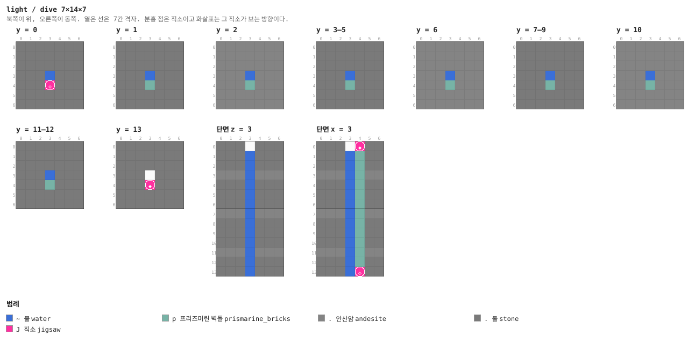

<details><summary>층별 지도 (텍스트)</summary>

```
y = 0   x →동, z ↓남
  .......
  .......
  ..~~~..
  ..~~~..
  ..~~~..
  ..J....
  .......
y = 1   x →동, z ↓남
  .......
  .......
  ..~~~..
  ..~~~..
  ..~~~..
  ..p....
  .......
y = 2   x →동, z ↓남
  .......
  .......
  ..~~~..
  ..~~~..
  ..~~~..
  ..p....
  .......
y = 3–5   x →동, z ↓남
  .......
  .......
  ..~~~..
  ..~~~..
  ..~~~..
  ..p....
  .......
y = 6   x →동, z ↓남
  .......
  .......
  ..~~~..
  ..~~~..
  ..~~~..
  ..p....
  .......
y = 7–9   x →동, z ↓남
  .......
  .......
  ..~~~..
  ..~~~..
  ..~~~..
  ..p....
  .......
y = 10   x →동, z ↓남
  .......
  .......
  ..~~~..
  ..~~~..
  ..~~~..
  ..p....
  .......
y = 11–12   x →동, z ↓남
  .......
  .......
  ..~~~..
  ..~~~..
  ..~~~..
  ..p....
  .......
y = 13   x →동, z ↓남
  .......
  .......
  .......
  .......
  .......
  ..J....
  .......
```

</details>

<details><summary>세로 단면 (텍스트)</summary>

```
단면 z = 3   x →동, y ↑하늘
  .......
  ..~~~..
  ..~~~..
  ..~~~..
  ..~~~..
  ..~~~..
  ..~~~..
  ..~~~..
  ..~~~..
  ..~~~..
  ..~~~..
  ..~~~..
  ..~~~..
  ..~~~..
단면 x = 3   z →남, y ↑하늘
  .......
  ..~~~..
  ..~~~..
  ..~~~..
  ..~~~..
  ..~~~..
  ..~~~..
  ..~~~..
  ..~~~..
  ..~~~..
  ..~~~..
  ..~~~..
  ..~~~..
  ..~~~..
```

</details>


### `sea_hub` — 7×7×7 — 1×1×1 셀

헤엄쳐 닿는 요새의 첫 방. 천장 구멍이 물기둥과 이어지고, 서·북문이 요새로, **남문이 보스
사슬**을 부른다.

**어느 풀에 있나** — `sea_first` (가중치 1)

| 직소 위치 | 향 | name | target | pool |
|---|---|---|---|---|
| (3, 0, 0) | ▲ 북 | `lht_sea` | `lht_sea` | `light/seas` |
| (0, 0, 3) | ◀ 서 | `lht_sea` | `lht_sea` | `light/seas` |
| (3, 0, 6) | ▼ 남 | `lht_sea` | `lht_sentinel` | `light/sentinel_approach_1` |
| (2, 6, 5) | ◆ 위 | `lht_sea` | `lht_sea` | `—` |

**블록** — 물 163, 돌 108, 어두운 프리즈머린 46, 안산암 15, 프리즈머린 벽돌 5, 직소 4, 바다 랜턴 2

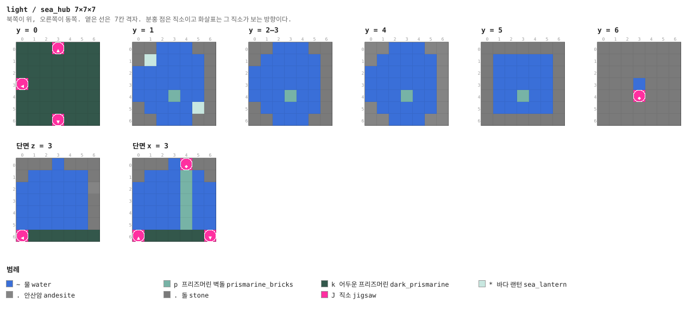

<details><summary>층별 지도 (텍스트)</summary>

```
y = 0   x →동, z ↓남
  kkkJkkk
  kkkkkkk
  kkkkkkk
  Jkkkkkk
  kkkkkkk
  kkkkkkk
  kkkJkkk
y = 1   x →동, z ↓남
  ..~~~..
  .*~~~~.
  ~~~~~~.
  ~~~~~~.
  ~~~~~~.
  .~p~~*.
  ..~~~..
y = 2–3   x →동, z ↓남
  ..~~~..
  .~~~~~.
  ~~~~~~.
  ~~~~~~.
  ~~~~~~.
  .~p~~~.
  ..~~~..
y = 4   x →동, z ↓남
  ..~~~..
  .~~~~~.
  ~~~~~~.
  ~~~~~~.
  ~~~~~~.
  .~p~~~.
  ..~~~..
y = 5   x →동, z ↓남
  .......
  .~~~~~.
  .~~~~~.
  .~~~~~.
  .~~~~~.
  .~p~~~.
  .......
y = 6   x →동, z ↓남
  .......
  .......
  ..~~~..
  ..~~~..
  ..~~~..
  ..J....
  .......
```

</details>


### `hall` — 7×7×7 — 1×1×1 셀

요새의 기본 통로. 프리즈머린 기둥과 바다 랜턴.

**어느 풀에 있나** — `seas` (가중치 10)

| 직소 위치 | 향 | name | target | pool |
|---|---|---|---|---|
| (0, 0, 3) | ◀ 서 | `lht_sea` | `lht_sea` | `light/seas` |
| (6, 0, 3) | ▶ 동 | `lht_sea` | `lht_sea` | `light/seas` |

**블록** — 물 144, 돌 127, 어두운 프리즈머린 47, 안산암 18, 직소 2, 프리즈머린 벽돌 2, 프리즈머린 2, 바다 랜턴 1

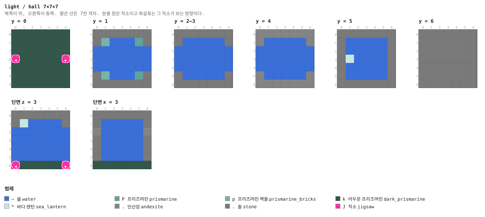

<details><summary>층별 지도 (텍스트)</summary>

```
y = 0   x →동, z ↓남
  kkkkkkk
  kkkkkkk
  kkkkkkk
  JkkkkkJ
  kkkkkkk
  kkkkkkk
  kkkkkkk
y = 1   x →동, z ↓남
  .......
  .p~~~P.
  ~~~~~~~
  ~~~~~~~
  ~~~~~~~
  .p~~~P.
  .......
y = 2–3   x →동, z ↓남
  .......
  .~~~~~.
  ~~~~~~~
  ~~~~~~~
  ~~~~~~~
  .~~~~~.
  .......
y = 4   x →동, z ↓남
  .......
  .~~~~~.
  ~~~~~~~
  ~~~~~~~
  ~~~~~~~
  .~~~~~.
  .......
y = 5   x →동, z ↓남
  .......
  .~~~~~.
  .~~~~~.
  .*~~~~.
  .~~~~~.
  .~~~~~.
  .......
y = 6   x →동, z ↓남
  .......
  .......
  .......
  .......
  .......
  .......
  .......
```

</details>


### `bend` — 7×7×7 — 1×1×1 셀

꺾이는 통로.

**어느 풀에 있나** — `seas` (가중치 9)

| 직소 위치 | 향 | name | target | pool |
|---|---|---|---|---|
| (0, 0, 3) | ◀ 서 | `lht_sea` | `lht_sea` | `light/seas` |
| (3, 0, 6) | ▼ 남 | `lht_sea` | `lht_sea` | `light/seas` |

**블록** — 물 147, 돌 127, 어두운 프리즈머린 47, 안산암 18, 직소 2, 프리즈머린 벽돌 1, 바다 랜턴 1

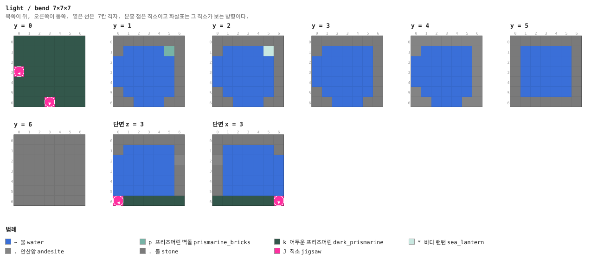

<details><summary>층별 지도 (텍스트)</summary>

```
y = 0   x →동, z ↓남
  kkkkkkk
  kkkkkkk
  kkkkkkk
  Jkkkkkk
  kkkkkkk
  kkkkkkk
  kkkJkkk
y = 1   x →동, z ↓남
  .......
  .~~~~p.
  ~~~~~~.
  ~~~~~~.
  ~~~~~~.
  .~~~~~.
  ..~~~..
y = 2   x →동, z ↓남
  .......
  .~~~~*.
  ~~~~~~.
  ~~~~~~.
  ~~~~~~.
  .~~~~~.
  ..~~~..
y = 3   x →동, z ↓남
  .......
  .~~~~~.
  ~~~~~~.
  ~~~~~~.
  ~~~~~~.
  .~~~~~.
  ..~~~..
y = 4   x →동, z ↓남
  .......
  .~~~~~.
  ~~~~~~.
  ~~~~~~.
  ~~~~~~.
  .~~~~~.
  ..~~~..
y = 5   x →동, z ↓남
  .......
  .~~~~~.
  .~~~~~.
  .~~~~~.
  .~~~~~.
  .~~~~~.
  .......
y = 6   x →동, z ↓남
  .......
  .......
  .......
  .......
  .......
  .......
  .......
```

</details>


### `junction` — 7×7×7 — 1×1×1 셀

네거리. 네 구석에 프리즈머린 기둥.

**어느 풀에 있나** — `seas` (가중치 4)

| 직소 위치 | 향 | name | target | pool |
|---|---|---|---|---|
| (3, 0, 0) | ▲ 북 | `lht_sea` | `lht_sea` | `light/seas` |
| (0, 0, 3) | ◀ 서 | `lht_sea` | `lht_sea` | `light/seas` |
| (6, 0, 3) | ▶ 동 | `lht_sea` | `lht_sea` | `light/seas` |
| (3, 0, 6) | ▼ 남 | `lht_sea` | `lht_sea` | `light/seas` |

**블록** — 물 160, 돌 109, 어두운 프리즈머린 36, 안산암 12, 프리즈머린 12, 프리즈머린 벽돌 9, 직소 4, 바다 랜턴 1

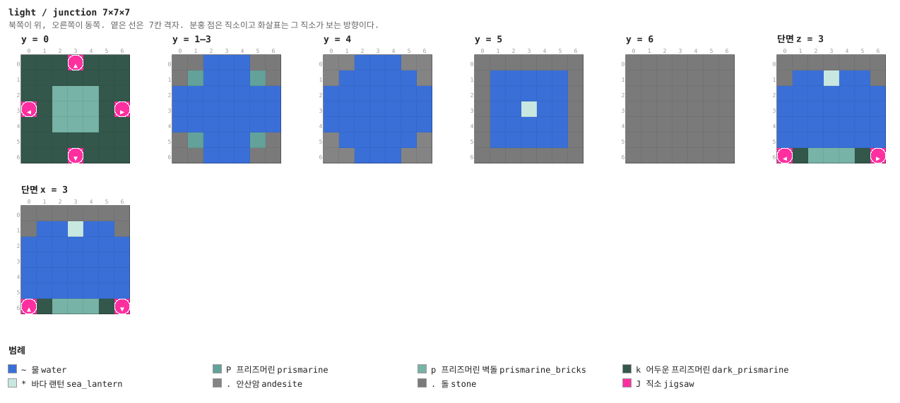

<details><summary>층별 지도 (텍스트)</summary>

```
y = 0   x →동, z ↓남
  kkkJkkk
  kkkkkkk
  kkpppkk
  JkpppkJ
  kkpppkk
  kkkkkkk
  kkkJkkk
y = 1–3   x →동, z ↓남
  ..~~~..
  .P~~~P.
  ~~~~~~~
  ~~~~~~~
  ~~~~~~~
  .P~~~P.
  ..~~~..
y = 4   x →동, z ↓남
  ..~~~..
  .~~~~~.
  ~~~~~~~
  ~~~~~~~
  ~~~~~~~
  .~~~~~.
  ..~~~..
y = 5   x →동, z ↓남
  .......
  .~~~~~.
  .~~~~~.
  .~~*~~.
  .~~~~~.
  .~~~~~.
  .......
y = 6   x →동, z ↓남
  .......
  .......
  .......
  .......
  .......
  .......
  .......
```

</details>


### `guard` — 7×7×7 — 1×1×1 셀

가디언 스포너. 물속이라 가디언이 제대로 산다.

**어느 풀에 있나** — `seas` (가중치 5)

| 직소 위치 | 향 | name | target | pool |
|---|---|---|---|---|
| (3, 0, 0) | ▲ 북 | `lht_sea` | `lht_sea` | `light/seas` |
| (0, 0, 3) | ◀ 서 | `lht_sea` | `lht_sea` | `light/seas` |
| (6, 0, 3) | ▶ 동 | `lht_sea` | `lht_sea` | `light/seas` |
| (3, 0, 6) | ▼ 남 | `lht_sea` | `lht_sea` | `light/seas` |

**블록** — 물 170, 돌 109, 어두운 프리즈머린 36, 안산암 12, 프리즈머린 벽돌 9, 직소 4, 철창 2, 몬스터 스포너 1

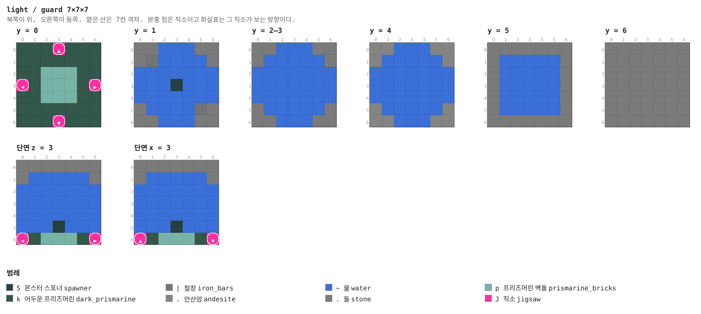

<details><summary>층별 지도 (텍스트)</summary>

```
y = 0   x →동, z ↓남
  kkkJkkk
  kkkkkkk
  kkpppkk
  JkpppkJ
  kkpppkk
  kkkkkkk
  kkkJkkk
y = 1   x →동, z ↓남
  ..~~~..
  .|~~~~.
  ~~~~~~~
  ~~~S~~~
  ~~~~~~~
  .~~~~|.
  ..~~~..
y = 2–3   x →동, z ↓남
  ..~~~..
  .~~~~~.
  ~~~~~~~
  ~~~~~~~
  ~~~~~~~
  .~~~~~.
  ..~~~..
y = 4   x →동, z ↓남
  ..~~~..
  .~~~~~.
  ~~~~~~~
  ~~~~~~~
  ~~~~~~~
  .~~~~~.
  ..~~~..
y = 5   x →동, z ↓남
  .......
  .~~~~~.
  .~~~~~.
  .~~~~~.
  .~~~~~.
  .~~~~~.
  .......
y = 6   x →동, z ↓남
  .......
  .......
  .......
  .......
  .......
  .......
  .......
```

</details>


### `column` — 7×7×7 — 1×1×1 셀

소울 모래 기포 기둥. 바닥 켜 위에 소울 모래 셋이 있고 그 위로 기포가 올라간다. 트리거가
없는 장치라 누가 먼저 지나가든 똑같다 (§12).

**어느 풀에 있나** — `seas` (가중치 5)

| 직소 위치 | 향 | name | target | pool |
|---|---|---|---|---|
| (0, 0, 3) | ◀ 서 | `lht_sea` | `lht_sea` | `light/seas` |
| (6, 0, 3) | ▶ 동 | `lht_sea` | `lht_sea` | `light/seas` |

**블록** — 물 144, 돌 127, 어두운 프리즈머린 47, 안산암 18, 영혼 모래 3, 직소 2, 프리즈머린 1, 바다 랜턴 1

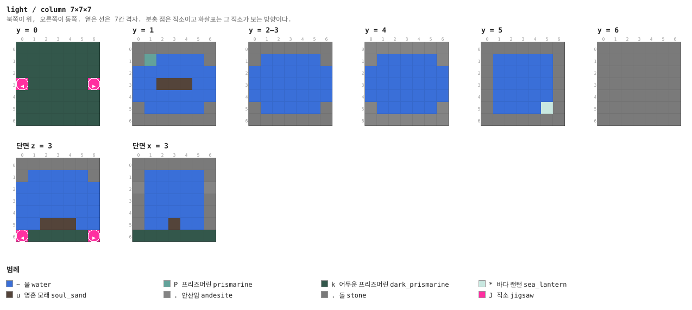

<details><summary>층별 지도 (텍스트)</summary>

```
y = 0   x →동, z ↓남
  kkkkkkk
  kkkkkkk
  kkkkkkk
  JkkkkkJ
  kkkkkkk
  kkkkkkk
  kkkkkkk
y = 1   x →동, z ↓남
  .......
  .P~~~~.
  ~~~~~~~
  ~~uuu~~
  ~~~~~~~
  .~~~~~.
  .......
y = 2–3   x →동, z ↓남
  .......
  .~~~~~.
  ~~~~~~~
  ~~~~~~~
  ~~~~~~~
  .~~~~~.
  .......
y = 4   x →동, z ↓남
  .......
  .~~~~~.
  ~~~~~~~
  ~~~~~~~
  ~~~~~~~
  .~~~~~.
  .......
y = 5   x →동, z ↓남
  .......
  .~~~~~.
  .~~~~~.
  .~~~~~.
  .~~~~~.
  .~~~~*.
  .......
y = 6   x →동, z ↓남
  .......
  .......
  .......
  .......
  .......
  .......
  .......
```

</details>


### `kelp` — 7×7×7 — 1×1×1 셀

다시마가 자란 칸. 네 포기가 바닥에서 올라온다.

**어느 풀에 있나** — `seas` (가중치 7)

| 직소 위치 | 향 | name | target | pool |
|---|---|---|---|---|
| (0, 0, 3) | ◀ 서 | `lht_sea` | `lht_sea` | `light/seas` |
| (6, 0, 3) | ▶ 동 | `lht_sea` | `lht_sea` | `light/seas` |

**블록** — 물 137, 돌 127, 어두운 프리즈머린 46, 안산암 18, 다시마 12, 직소 2, 프리즈머린 1

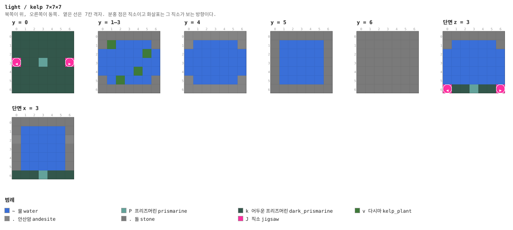

<details><summary>층별 지도 (텍스트)</summary>

```
y = 0   x →동, z ↓남
  kkkkkkk
  kkkkkkk
  kkkkkkk
  JkkPkkJ
  kkkkkkk
  kkkkkkk
  kkkkkkk
y = 1–3   x →동, z ↓남
  .......
  .v~~~~.
  ~~~~~v~
  ~~~~~~~
  ~~~~v~~
  .~v~~~.
  .......
y = 4   x →동, z ↓남
  .......
  .~~~~~.
  ~~~~~~~
  ~~~~~~~
  ~~~~~~~
  .~~~~~.
  .......
y = 5   x →동, z ↓남
  .......
  .~~~~~.
  .~~~~~.
  .~~~~~.
  .~~~~~.
  .~~~~~.
  .......
y = 6   x →동, z ↓남
  .......
  .......
  .......
  .......
  .......
  .......
  .......
```

</details>


### `sponge` — 7×7×7 — 1×1×1 셀

해면 방. 젖은 해면 넷과 상자. 상자에는 **마른 해면**이 확정으로 들어 있다 — 원하면
물속에 마른 방을 만들 수 있다.

**어느 풀에 있나** — `seas` (가중치 5)

| 직소 위치 | 향 | name | target | pool |
|---|---|---|---|---|
| (0, 0, 3) | ◀ 서 | `lht_sea` | `lht_sea` | `light/seas` |

**블록** — 돌 136, 물 131, 어두운 프리즈머린 48, 안산암 21, 젖은 해면 4, 직소 1, 상자 1, 바다 랜턴 1

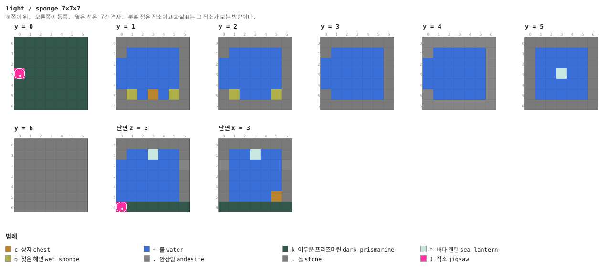

<details><summary>층별 지도 (텍스트)</summary>

```
y = 0   x →동, z ↓남
  kkkkkkk
  kkkkkkk
  kkkkkkk
  Jkkkkkk
  kkkkkkk
  kkkkkkk
  kkkkkkk
y = 1   x →동, z ↓남
  .......
  .~~~~~.
  ~~~~~~.
  ~~~~~~.
  ~~~~~~.
  .g~c~g.
  .......
y = 2   x →동, z ↓남
  .......
  .~~~~~.
  ~~~~~~.
  ~~~~~~.
  ~~~~~~.
  .g~~~g.
  .......
y = 3   x →동, z ↓남
  .......
  .~~~~~.
  ~~~~~~.
  ~~~~~~.
  ~~~~~~.
  .~~~~~.
  .......
y = 4   x →동, z ↓남
  .......
  .~~~~~.
  ~~~~~~.
  ~~~~~~.
  ~~~~~~.
  .~~~~~.
  .......
y = 5   x →동, z ↓남
  .......
  .~~~~~.
  .~~~~~.
  .~~*~~.
  .~~~~~.
  .~~~~~.
  .......
y = 6   x →동, z ↓남
  .......
  .......
  .......
  .......
  .......
  .......
  .......
```

</details>


### `vault` — 7×7×7 — 1×1×1 셀

보물방. 물에 잠긴 상자 둘.

**어느 풀에 있나** — `seas` (가중치 6)

| 직소 위치 | 향 | name | target | pool |
|---|---|---|---|---|
| (0, 0, 3) | ◀ 서 | `lht_sea` | `lht_sea` | `light/seas` |

**블록** — 돌 136, 물 128, 어두운 프리즈머린 48, 안산암 21, 프리즈머린 벽돌 5, 상자 2, 바다 랜턴 2, 직소 1

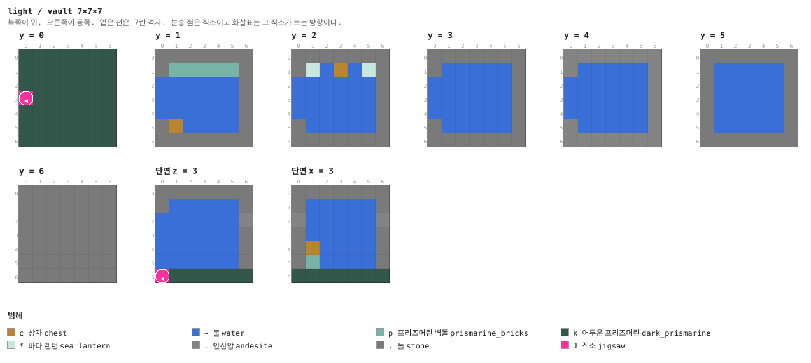

<details><summary>층별 지도 (텍스트)</summary>

```
y = 0   x →동, z ↓남
  kkkkkkk
  kkkkkkk
  kkkkkkk
  Jkkkkkk
  kkkkkkk
  kkkkkkk
  kkkkkkk
y = 1   x →동, z ↓남
  .......
  .ppppp.
  ~~~~~~.
  ~~~~~~.
  ~~~~~~.
  .c~~~~.
  .......
y = 2   x →동, z ↓남
  .......
  .*~c~*.
  ~~~~~~.
  ~~~~~~.
  ~~~~~~.
  .~~~~~.
  .......
y = 3   x →동, z ↓남
  .......
  .~~~~~.
  ~~~~~~.
  ~~~~~~.
  ~~~~~~.
  .~~~~~.
  .......
y = 4   x →동, z ↓남
  .......
  .~~~~~.
  ~~~~~~.
  ~~~~~~.
  ~~~~~~.
  .~~~~~.
  .......
y = 5   x →동, z ↓남
  .......
  .~~~~~.
  .~~~~~.
  .~~~~~.
  .~~~~~.
  .~~~~~.
  .......
y = 6   x →동, z ↓남
  .......
  .......
  .......
  .......
  .......
  .......
  .......
```

</details>


### `cap` — 1×7×7

두께 1의 돌 마개. 요새 풀의 fallback이고, **막혀 있어야 물이 안 샌다** (§4).

**어느 풀에 있나** — `sea_caps` (가중치 1)

| 직소 위치 | 향 | name | target | pool |
|---|---|---|---|---|
| (0, 0, 3) | ◀ 서 | `lht_sea` | `lht_sea` | `light/sea_caps` |

**블록** — 돌 35, 안산암 13, 직소 1

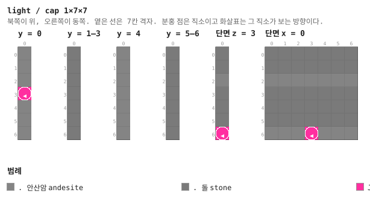

<details><summary>층별 지도 (텍스트)</summary>

```
y = 0   x →동, z ↓남
  .
  .
  .
  J
  .
  .
  .
y = 1–3   x →동, z ↓남
  .
  .
  .
  .
  .
  .
  .
y = 4   x →동, z ↓남
  .
  .
  .
  .
  .
  .
  .
y = 5–6   x →동, z ↓남
  .
  .
  .
  .
  .
  .
  .
```

</details>


### `approach_1` — 7×7×7 — 1×1×1 셀

보스 통로. 셋이 사슬로 이어져 파수꾼의 홀을 허브에서 멀리 민다 (§7).

**어느 풀에 있나** — `sentinel_approach_1` (가중치 1)

| 직소 위치 | 향 | name | target | pool |
|---|---|---|---|---|
| (3, 0, 0) | ▲ 북 | `lht_sea` | `lht_sea` | `light/seas` |
| (0, 0, 3) | ◀ 서 | `lht_sentinel` | `lht_sea` | `light/seas` |
| (6, 0, 3) | ▶ 동 | `lht_sea` | `lht_sentinel` | `light/sentinel_approach_2` |

**블록** — 물 159, 돌 118, 어두운 프리즈머린 46, 안산암 15, 직소 3, 프리즈머린 벽돌 1, 바다 랜턴 1


<details><summary>층별 지도 (텍스트)</summary>

```
y = 0   x →동, z ↓남
  kkkJkkk
  kkkkkkk
  kkkkkkk
  JkkkkkJ
  kkkkkkk
  kkkkkkk
  kkkkkkk
y = 1   x →동, z ↓남
  ..~~~..
  .p~~~~.
  ~~~~~~~
  ~~~~~~~
  ~~~~~~~
  .~~~~~.
  .......
y = 2   x →동, z ↓남
  ..~~~..
  .*~~~~.
  ~~~~~~~
  ~~~~~~~
  ~~~~~~~
  .~~~~~.
  .......
y = 3   x →동, z ↓남
  ..~~~..
  .~~~~~.
  ~~~~~~~
  ~~~~~~~
  ~~~~~~~
  .~~~~~.
  .......
y = 4   x →동, z ↓남
  ..~~~..
  .~~~~~.
  ~~~~~~~
  ~~~~~~~
  ~~~~~~~
  .~~~~~.
  .......
y = 5   x →동, z ↓남
  .......
  .~~~~~.
  .~~~~~.
  .~~~~~.
  .~~~~~.
  .~~~~~.
  .......
y = 6   x →동, z ↓남
  .......
  .......
  .......
  .......
  .......
  .......
  .......
```

</details>


### `sentinel_hall` — 21×14×21 — 3×2×3 셀

심해의 파수꾼. 21×14×21이고 **물이 여섯 켜, 그 위는 공기**다. 단상은 수면 위로 솟아 있고
파수꾼(삼지창을 든 드라운드, 체력 100)의 트라이얼 스포너가 그 위에 있다. 네 구석의 경비
스포너는 물속이라 가디언이 나온다.

잡으면 **삼지창 하나와 해양의 심장**이 확정이다.

**어느 풀에 있나** — `sentinel_approach` (가중치 1)

| 직소 위치 | 향 | name | target | pool |
|---|---|---|---|---|
| (0, 0, 10) | ◀ 서 | `lht_sentinel` | `lht_sea` | `—` |

**블록** — 물 1822, 돌 1152, 어두운 프리즈머린 508, 프리즈머린 벽돌 294, 안산암 237, 프리즈머린 144, 바다 랜턴 9, 트라이얼 스포너 5

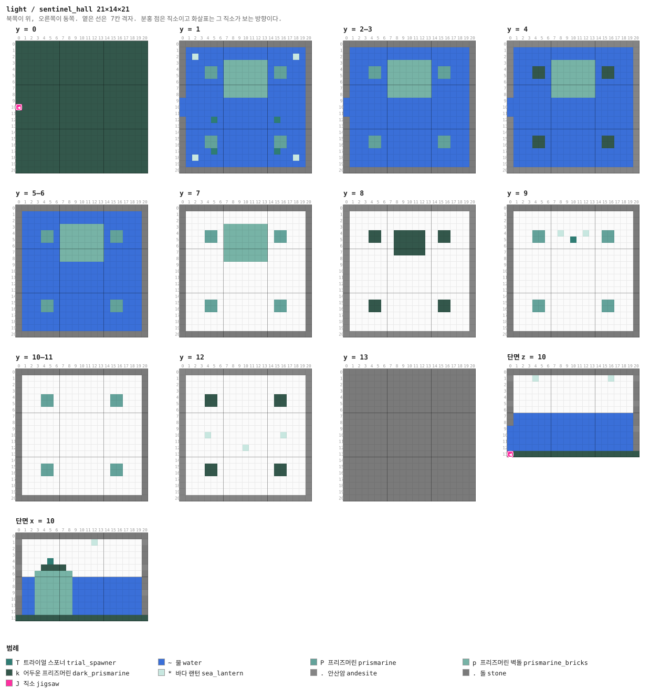

<details><summary>층별 지도 (텍스트)</summary>

```
y = 0   x →동, z ↓남
  kkkkkkkkkkkkkkkkkkkkk
  kkkkkkkkkkkkkkkkkkkkk
  kkkkkkkkkkkkkkkkkkkkk
  kkkkkkkkkkkkkkkkkkkkk
  kkkkkkkkkkkkkkkkkkkkk
  kkkkkkkkkkkkkkkkkkkkk
  kkkkkkkkkkkkkkkkkkkkk
  kkkkkkkkkkkkkkkkkkkkk
  kkkkkkkkkkkkkkkkkkkkk
  kkkkkkkkkkkkkkkkkkkkk
  Jkkkkkkkkkkkkkkkkkkkk
  kkkkkkkkkkkkkkkkkkkkk
  kkkkkkkkkkkkkkkkkkkkk
  kkkkkkkkkkkkkkkkkkkkk
  kkkkkkkkkkkkkkkkkkkkk
  kkkkkkkkkkkkkkkkkkkkk
  kkkkkkkkkkkkkkkkkkkkk
  kkkkkkkkkkkkkkkkkkkkk
  kkkkkkkkkkkkkkkkkkkkk
  kkkkkkkkkkkkkkkkkkkkk
  kkkkkkkkkkkkkkkkkkkkk
y = 1   x →동, z ↓남
  .....................
  .~~~~~~~~~~~~~~~~~~~.
  .~*~~~~~~~~~~~~~~~*~.
  .~~~~~~ppppppp~~~~~~.
  .~~~PP~ppppppp~PP~~~.
  .~~~PP~ppppppp~PP~~~.
  .~~~~~~ppppppp~~~~~~.
  .~~~~~~ppppppp~~~~~~.
  .~~~~~~ppppppp~~~~~~.
  ~~~~~~~~~~~~~~~~~~~~.
  ~~~~~~~~~~~~~~~~~~~~.
  ~~~~~~~~~~~~~~~~~~~~.
  .~~~~T~~~~~~~~~T~~~~.
  .~~~~~~~~~~~~~~~~~~~.
  .~~~~~~~~~~~~~~~~~~~.
  .~~~PP~~~~~~~~~PP~~~.
  .~~~PP~~~~~~~~~PP~~~.
  .~~~~T~~~~~~~~~T~~~~.
  .~*~~~~~~~~~~~~~~~*~.
  .~~~~~~~~~~~~~~~~~~~.
  .....................
y = 2–3   x →동, z ↓남
  .....................
  .~~~~~~~~~~~~~~~~~~~.
  .~~~~~~~~~~~~~~~~~~~.
  .~~~~~~ppppppp~~~~~~.
  .~~~PP~ppppppp~PP~~~.
  .~~~PP~ppppppp~PP~~~.
  .~~~~~~ppppppp~~~~~~.
  .~~~~~~ppppppp~~~~~~.
  .~~~~~~ppppppp~~~~~~.
  ~~~~~~~~~~~~~~~~~~~~.
  ~~~~~~~~~~~~~~~~~~~~.
  ~~~~~~~~~~~~~~~~~~~~.
  .~~~~~~~~~~~~~~~~~~~.
  .~~~~~~~~~~~~~~~~~~~.
  .~~~~~~~~~~~~~~~~~~~.
  .~~~PP~~~~~~~~~PP~~~.
  .~~~PP~~~~~~~~~PP~~~.
  .~~~~~~~~~~~~~~~~~~~.
  .~~~~~~~~~~~~~~~~~~~.
  .~~~~~~~~~~~~~~~~~~~.
  .....................
y = 4   x →동, z ↓남
  .....................
  .~~~~~~~~~~~~~~~~~~~.
  .~~~~~~~~~~~~~~~~~~~.
  .~~~~~~ppppppp~~~~~~.
  .~~~kk~ppppppp~kk~~~.
  .~~~kk~ppppppp~kk~~~.
  .~~~~~~ppppppp~~~~~~.
  .~~~~~~ppppppp~~~~~~.
  .~~~~~~ppppppp~~~~~~.
  ~~~~~~~~~~~~~~~~~~~~.
  ~~~~~~~~~~~~~~~~~~~~.
  ~~~~~~~~~~~~~~~~~~~~.
  .~~~~~~~~~~~~~~~~~~~.
  .~~~~~~~~~~~~~~~~~~~.
  .~~~~~~~~~~~~~~~~~~~.
  .~~~kk~~~~~~~~~kk~~~.
  .~~~kk~~~~~~~~~kk~~~.
  .~~~~~~~~~~~~~~~~~~~.
  .~~~~~~~~~~~~~~~~~~~.
  .~~~~~~~~~~~~~~~~~~~.
  .....................
y = 5–6   x →동, z ↓남
  .....................
  .~~~~~~~~~~~~~~~~~~~.
  .~~~~~~~~~~~~~~~~~~~.
  .~~~~~~ppppppp~~~~~~.
  .~~~PP~ppppppp~PP~~~.
  .~~~PP~ppppppp~PP~~~.
  .~~~~~~ppppppp~~~~~~.
  .~~~~~~ppppppp~~~~~~.
  .~~~~~~ppppppp~~~~~~.
  .~~~~~~~~~~~~~~~~~~~.
  .~~~~~~~~~~~~~~~~~~~.
  .~~~~~~~~~~~~~~~~~~~.
  .~~~~~~~~~~~~~~~~~~~.
  .~~~~~~~~~~~~~~~~~~~.
  .~~~~~~~~~~~~~~~~~~~.
  .~~~PP~~~~~~~~~PP~~~.
  .~~~PP~~~~~~~~~PP~~~.
  .~~~~~~~~~~~~~~~~~~~.
  .~~~~~~~~~~~~~~~~~~~.
  .~~~~~~~~~~~~~~~~~~~.
  .....................
y = 7   x →동, z ↓남
  .....................
  .....................
  .....................
  .......ppppppp.......
  ....PP.ppppppp.PP....
  ....PP.ppppppp.PP....
  .......ppppppp.......
  .......ppppppp.......
  .......ppppppp.......
  .....................
  .....................
  .....................
  .....................
  .....................
  .....................
  ....PP.........PP....
  ....PP.........PP....
  .....................
  .....................
  .....................
  .....................
y = 8   x →동, z ↓남
  .....................
  .....................
  .....................
  .....................
  ....kk..kkkkk..kk....
  ....kk..kkkkk..kk....
  ........kkkkk........
  ........kkkkk........
  .....................
  .....................
  .....................
  .....................
  .....................
  .....................
  .....................
  ....kk.........kk....
  ....kk.........kk....
  .....................
  .....................
  .....................
  .....................
y = 9   x →동, z ↓남
  .....................
  .....................
  .....................
  .....................
  ....PP..*...*..PP....
  ....PP....T....PP....
  .....................
  .....................
  .....................
  .....................
  .....................
  .....................
  .....................
  .....................
  .....................
  ....PP.........PP....
  ....PP.........PP....
  .....................
  .....................
  .....................
  .....................
y = 10–11   x →동, z ↓남
  .....................
  .....................
  .....................
  .....................
  ....PP.........PP....
  ....PP.........PP....
  .....................
  .....................
  .....................
  .....................
  .....................
  .....................
  .....................
  .....................
  .....................
  ....PP.........PP....
  ....PP.........PP....
  .....................
  .....................
  .....................
  .....................
y = 12   x →동, z ↓남
  .....................
  .....................
  .....................
  .....................
  ....kk.........kk....
  ....kk.........kk....
  .....................
  .....................
  .....................
  .....................
  ....*...........*....
  .....................
  ..........*..........
  .....................
  .....................
  ....kk.........kk....
  ....kk.........kk....
  .....................
  .....................
  .....................
  .....................
y = 13   x →동, z ↓남
  .....................
  .....................
  .....................
  .....................
  .....................
  .....................
  .....................
  .....................
  .....................
  .....................
  .....................
  .....................
  .....................
  .....................
  .....................
  .....................
  .....................
  .....................
  .....................
  .....................
  .....................
```

</details>

<details><summary>세로 단면 (텍스트)</summary>

```
단면 z = 10   x →동, y ↑하늘
  .....................
  ....*...........*....
  .....................
  .....................
  .....................
  .....................
  .....................
  .~~~~~~~~~~~~~~~~~~~.
  .~~~~~~~~~~~~~~~~~~~.
  ~~~~~~~~~~~~~~~~~~~~.
  ~~~~~~~~~~~~~~~~~~~~.
  ~~~~~~~~~~~~~~~~~~~~.
  ~~~~~~~~~~~~~~~~~~~~.
  Jkkkkkkkkkkkkkkkkkkkk
단면 x = 10   z →남, y ↑하늘
  .....................
  ............*........
  .....................
  .....................
  .....T...............
  ....kkkk.............
  ...pppppp............
  .~~pppppp~~~~~~~~~~~.
  .~~pppppp~~~~~~~~~~~.
  .~~pppppp~~~~~~~~~~~.
  .~~pppppp~~~~~~~~~~~.
  .~~pppppp~~~~~~~~~~~.
  .~~pppppp~~~~~~~~~~~.
  kkkkkkkkkkkkkkkkkkkkk
```

</details>


### `approach_2` — 7×7×7 — 1×1×1 셀

**어느 풀에 있나** — `sentinel_approach_2` (가중치 1)

| 직소 위치 | 향 | name | target | pool |
|---|---|---|---|---|
| (3, 0, 0) | ▲ 북 | `lht_sea` | `lht_sea` | `light/seas` |
| (0, 0, 3) | ◀ 서 | `lht_sentinel` | `lht_sea` | `light/seas` |
| (6, 0, 3) | ▶ 동 | `lht_sea` | `lht_sentinel` | `light/sentinel_approach_3` |

**블록** — 물 159, 돌 118, 어두운 프리즈머린 46, 안산암 15, 직소 3, 프리즈머린 벽돌 1, 바다 랜턴 1


<details><summary>층별 지도 (텍스트)</summary>

```
y = 0   x →동, z ↓남
  kkkJkkk
  kkkkkkk
  kkkkkkk
  JkkkkkJ
  kkkkkkk
  kkkkkkk
  kkkkkkk
y = 1   x →동, z ↓남
  ..~~~..
  .p~~~~.
  ~~~~~~~
  ~~~~~~~
  ~~~~~~~
  .~~~~~.
  .......
y = 2   x →동, z ↓남
  ..~~~..
  .*~~~~.
  ~~~~~~~
  ~~~~~~~
  ~~~~~~~
  .~~~~~.
  .......
y = 3   x →동, z ↓남
  ..~~~..
  .~~~~~.
  ~~~~~~~
  ~~~~~~~
  ~~~~~~~
  .~~~~~.
  .......
y = 4   x →동, z ↓남
  ..~~~..
  .~~~~~.
  ~~~~~~~
  ~~~~~~~
  ~~~~~~~
  .~~~~~.
  .......
y = 5   x →동, z ↓남
  .......
  .~~~~~.
  .~~~~~.
  .~~~~~.
  .~~~~~.
  .~~~~~.
  .......
y = 6   x →동, z ↓남
  .......
  .......
  .......
  .......
  .......
  .......
  .......
```

</details>


### `approach_3` — 7×7×7 — 1×1×1 셀

**어느 풀에 있나** — `sentinel_approach` (가중치 1), `sentinel_approach_3` (가중치 1)

| 직소 위치 | 향 | name | target | pool |
|---|---|---|---|---|
| (3, 0, 0) | ▲ 북 | `lht_sea` | `lht_sea` | `light/seas` |
| (0, 0, 3) | ◀ 서 | `lht_sentinel` | `lht_sea` | `light/seas` |
| (6, 0, 3) | ▶ 동 | `lht_sea` | `lht_sentinel` | `light/sentinel_approach` |

**블록** — 물 159, 돌 118, 어두운 프리즈머린 46, 안산암 15, 직소 3, 프리즈머린 벽돌 1, 바다 랜턴 1

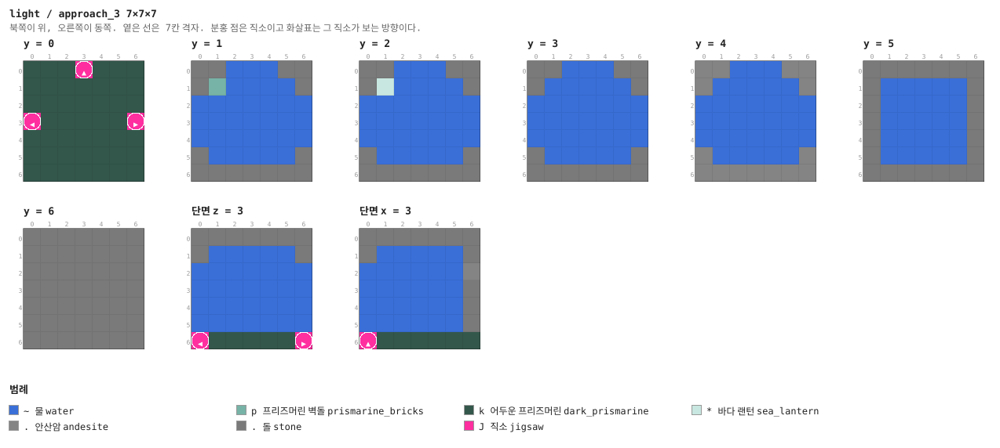

<details><summary>층별 지도 (텍스트)</summary>

```
y = 0   x →동, z ↓남
  kkkJkkk
  kkkkkkk
  kkkkkkk
  JkkkkkJ
  kkkkkkk
  kkkkkkk
  kkkkkkk
y = 1   x →동, z ↓남
  ..~~~..
  .p~~~~.
  ~~~~~~~
  ~~~~~~~
  ~~~~~~~
  .~~~~~.
  .......
y = 2   x →동, z ↓남
  ..~~~..
  .*~~~~.
  ~~~~~~~
  ~~~~~~~
  ~~~~~~~
  .~~~~~.
  .......
y = 3   x →동, z ↓남
  ..~~~..
  .~~~~~.
  ~~~~~~~
  ~~~~~~~
  ~~~~~~~
  .~~~~~.
  .......
y = 4   x →동, z ↓남
  ..~~~..
  .~~~~~.
  ~~~~~~~
  ~~~~~~~
  ~~~~~~~
  .~~~~~.
  .......
y = 5   x →동, z ↓남
  .......
  .~~~~~.
  .~~~~~.
  .~~~~~.
  .~~~~~.
  .~~~~~.
  .......
y = 6   x →동, z ↓남
  .......
  .......
  .......
  .......
  .......
  .......
  .......
```

</details>


## 다듬을 곳

- **등대가 가늘다.** 7×7이다. 넓히면 해변을 제 돌바닥으로 덮어 버리므로(§2) 넓히는 대신
  §16대로 손으로 다시 지어야 예뻐진다
- **먼바다가 비어 있다.** 바다 바이옴에는 아무것도 없다. `OCEAN_FLOOR_WG`를 쓰는 **별도
  구조물**로 만들면 되지만, 그건 이 등대의 변형이 아니라 다른 던전이다
- **가디언이 레이저를 쏘려면 자리가 필요하다.** 7×7 칸은 좁아서 대부분 붙어서 싸우게 된다
