# 레벨 설계 — 대피라미드

> 이 문서는 `python tools/gen_level_doc.py pyramid`가 만든다. 조각을 고치면 다시 돌린다. 그림과 표는 게임이 읽는 파일(`structure/pyramid/*.nbt`, `worldgen/**`)에서 그대로 읽어 온 것이라 모드와 어긋날 수 없다. 설명 문장만 사람이 쓴다 (`tools/gen_level_doc.py`의 `INTRO`·`NOTES`).

## 1. 한눈에

사막 한가운데 밑변 91칸, 높이 46칸의 45° 사암 피라미드가 서 있다. 북면의 문으로 들어가면
9×9칸(63×63블록) 미로가 있고, 미로 한가운데 **우물**의 사다리가 천장을 뚫고 21×21×21
**묘실** 바닥 한복판으로 올려보낸다. 올라서는 순간 스포너 다섯에 둘러싸인 채로 파라오와 싸운다.
묘실 천장 구멍 위에는 석관실이 하나 더 있다.

**한 판:** 북면 입구 → 스파인 3칸(결정적) → 우물 → 미로를 돌며 전리품·수상한 모래·허스크 →
우물로 돌아와 사다리 → 묘실에서 보스 → 천장 해치 → 석관실.

**클리어 보상이 흑요석 14 + 화염과 강철 + 마법 부여 다이아 장비**다. 네더 포탈과 마법
부여대를 여기서 받는다.

| 항목 | 값 |
|---|---|
| 생성 단계 | `surface_structures` |
| 바이옴 | `#sydungeon:has_structure/pyramid` |
| 간격 / 최소거리 | spacing 48 / separation 20 |
| 직소 깊이 | 16 ~ 22 (`sydungeon:ranged_jigsaw`) |
| 시작 풀 | `start` |
| 조각 / 풀 | 18개 / 12개 |

## 2. 조립 원리

### 지하감옥과 다른 점은 **겉모양이 있다**는 것 하나다

지하감옥은 어디로 자라도 상관없었다. 피라미드는 **45° 경사면이 무너지면 안 된다.** 그런데
직소 생성은 실루엣이라는 걸 모른다. 그냥 두면 미로가 경사면을 뚫고 나가 사막에 구멍이 뚫린다.

막는 방법은 세 가지가 있었다.

1. 차단 조각을 둘러 세운다 — 가장자리 칸마다 "여기서 멈춰" 조각을 놓아야 하는데, 직소는
   위치를 모르므로 강제할 수가 없다.
2. `structure_void`로 바깥을 채운다 — 충돌 판정에 영향을 주지 않아서 소용이 없다.
3. **부모의 바운딩 박스를 울타리로 쓴다** ← 이걸 택했다.

### 상자가 형태를 지킨다

`JigsawPlacement`에 규칙이 하나 있다. **직소가 자기 조각의 바운딩 박스 *안쪽*을 가리키면,
그 자식들은 전역 공간이 아니라 그 박스를 여유 공간으로 삼아 판정된다.** 네더 요새(bastion)가
큰 방을 작은 방들로 채우는 방식이고, 여기서는 그대로 울타리가 된다.

```
skin_base (91×7×91)  ─안쪽→ core (63×7×63) ─안쪽→ 스파인 → 미로 전체
skin_mid  (77×21×77) ─안쪽→ tomb (21×21×21)
skin_top  (35×18×35) ─안쪽→ crypt (7×7×7)
```

미로 조각은 전부 `core`의 자손이므로 **전부 core의 박스로 판정된다.** core는 피라미드
가장자리에서 8블록 안쪽이라 경사면은 아예 건드려지지 않는다. 차단 조각도, 관리할 void도
필요 없다 — **박스가 울타리다.**

껍데기 세 장은 `joint=aligned` 수직 직소 하나짜리 사슬로 쌓이므로 피라미드는 항상 온전하다.

### 결정적인 기하는 직소를 쓰지 않는다

입구 터널, 우물에서 묘실로 오르는 사다리, 묘실에서 석관실로 가는 해치 — 이것들은 **두 조각에
같은 좌표로 새겨** 놓았다. 앵커 직소 하나로 이어진 두 조각은 언제나 같은 상대 위치에 놓이기
때문에, 양쪽에 같은 구멍을 파면 그게 곧 통로가 된다. `generate_pyramid.py`의 `AT`/`SIZE` 표가
유일한 출처이고 `verify()`가 매번 검사한다.

> **순서 함정:** 천장 구멍을 사다리보다 **나중에** 파면 사다리 맨 윗칸이 지워진다. 한 번 그랬다.

### 커넥터 이름도 역할로 나뉜다

`pyr_door`는 미로 커넥터, `pyr_spine`은 스파인 사슬, `pyr_anchor`는 결정적으로 놓이는 큰
조각의 입구다. **`pyr_anchor`를 가진 조각은 그 직소가 딱 하나다** — 부모가 다른 문으로
들어오는 사고를 막는다.

### 밟는 함정은 없다

압력판도 철사도 플레이어를 가리지 않는다. 던전에는 스포너와 자연 스폰으로 몹이 돌아다니므로
**플레이어가 오기 전에 몹이 전부 밟는다.** 0.2.0 첫 판에서 TNT 함정방은 아무도 없을 때 터져서
**피라미드 일부를 같이 날려버렸다.** 지금 남은 위험은 트리거가 필요 없는 것들뿐이다 — 스포너,
그리고 **솔질은 플레이어만 할 수 있는** 수상한 모래.

## 3. 풀 배선

풀이 어떤 조각을 내놓는지(실선, 숫자는 가중치)와 그 조각의 직소가 다시 어떤 풀을 부르는지(점선)다. 직소 생성은 이 그래프를 깊이만큼 따라간다.

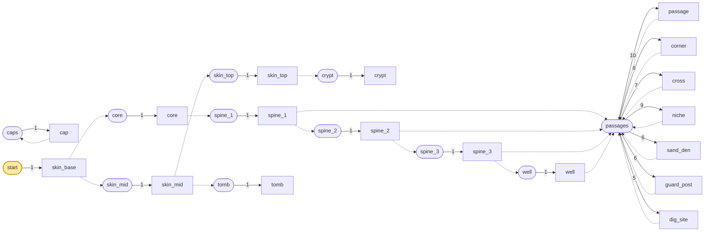

| 풀 | fallback | 원소 (가중치) |
|---|---|---|
| `caps` | `minecraft:empty` | `cap` 1 |
| `core` | `minecraft:empty` | `core` 1 |
| `crypt` | `minecraft:empty` | `crypt` 1 |
| `passages` | `caps` | `passage` 10, `corner` 8, `cross` 7, `niche` 9, `sand_den` 6, `guard_post` 6, `dig_site` 5 |
| `skin_mid` | `minecraft:empty` | `skin_mid` 1 |
| `skin_top` | `minecraft:empty` | `skin_top` 1 |
| `spine_1` | `minecraft:empty` | `spine_1` 1 |
| `spine_2` | `minecraft:empty` | `spine_2` 1 |
| `spine_3` | `minecraft:empty` | `spine_3` 1 |
| `start` | `minecraft:empty` | `skin_base` 1 |
| `tomb` | `minecraft:empty` | `tomb` 1 |
| `well` | `minecraft:empty` | `well` 1 |

## 4. 뼈대 — 반드시 이렇게 놓이는 부분

껍데기 세 장이 수직으로 쌓이고, `core`·`tomb`·`crypt`가 각각의 껍데기 안쪽에 앵커로 매달리고,
스파인 셋이 입구에서 우물까지 이어진다. **여기까지는 매번 똑같다.** 미로는 `well`과
스파인의 옆문에서 자라는 것이라 이 그림에 없다.

| 조각 | 놓이는 자리 (시작 조각 기준) | 누가 놓나 |
|---|---|---|
| `skin_base` | (0, 0, 0) | 시작 풀 |
| `skin_mid` | (7, 7, 7) | skin_base의 위 pyr_door 직소 |
| `core` | (14, 0, 14) | skin_base의 동 pyr_door 직소 |
| `skin_top` | (28, 28, 28) | skin_mid의 위 pyr_door 직소 |
| `tomb` | (35, 7, 35) | skin_mid의 동 pyr_door 직소 |
| `spine_1` | (42, 0, 21) | core의 남 pyr_door 직소 |
| `crypt` | (47, 28, 49) | skin_top의 동 pyr_door 직소 |
| `spine_2` | (42, 0, 28) | spine_1의 남 pyr_door 직소 |
| `spine_3` | (42, 0, 35) | spine_2의 남 pyr_door 직소 |
| `well` | (42, 0, 42) | spine_3의 남 pyr_door 직소 |

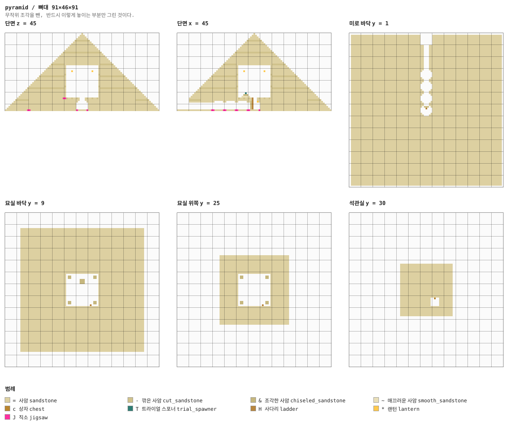

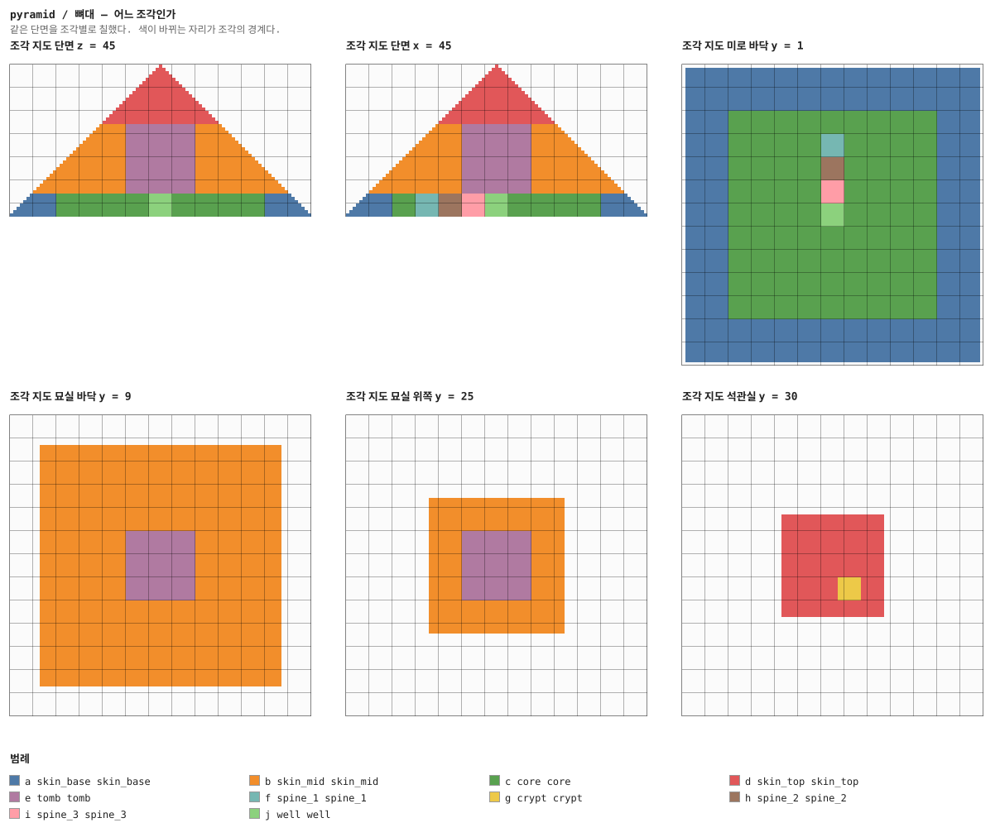

## 5. 조각


그림은 조각 하나를 **층마다 한 장씩** 블록 단위로 그린 것이다. 같은 층이 이어지면 `y = 2–5`처럼 묶었고, 마지막 두 장은 가운데를 자른 세로 단면이다. 분홍 점이 직소, 화살표가 그 직소가 보는 방향이다 — **마주 본 직소끼리만 붙는다.**

### `skin_base` — 91×7×91 — 13×1×13 셀

1층 껍데기. **구조물 블록으로는 저장할 수 없다** — 한 변 48칸이 한계인데 이건 91칸이다.
그래서 피라미드는 전부 코드가 만든다.

가운데 63×63은 `structure_void`다. 그 자리는 `core`가 채우므로 껍데기가 건드리면 안 된다.
북면에 **입구 터널이 새겨져 있고**, 터널 끝은 `core`의 북쪽 구멍과 좌표가 맞는다 — 직소가
아니라 표에서 온 숫자다.

직소 둘: 동쪽 `pyr_door`는 core를 자기 박스 안에 매달고(형태 울타리의 출발점), 위쪽은
`skin_mid`를 올린다.

**어느 풀에 있나** — `start` (가중치 1)

| 직소 위치 | 향 | name | target | pool |
|---|---|---|---|---|
| (13, 0, 45) | ▶ 동 | `pyr_door` | `pyr_anchor` | `pyramid/core` |
| (7, 6, 7) | ◆ 위 | `pyr_door` | `pyr_anchor` | `pyramid/skin_mid` |

**뚫린 면** — 위: x 42–48, z 6–6 (7칸)

**블록** — 사암 44221, 구조물 공백 7280, 깎은 사암 6233, 직소 2

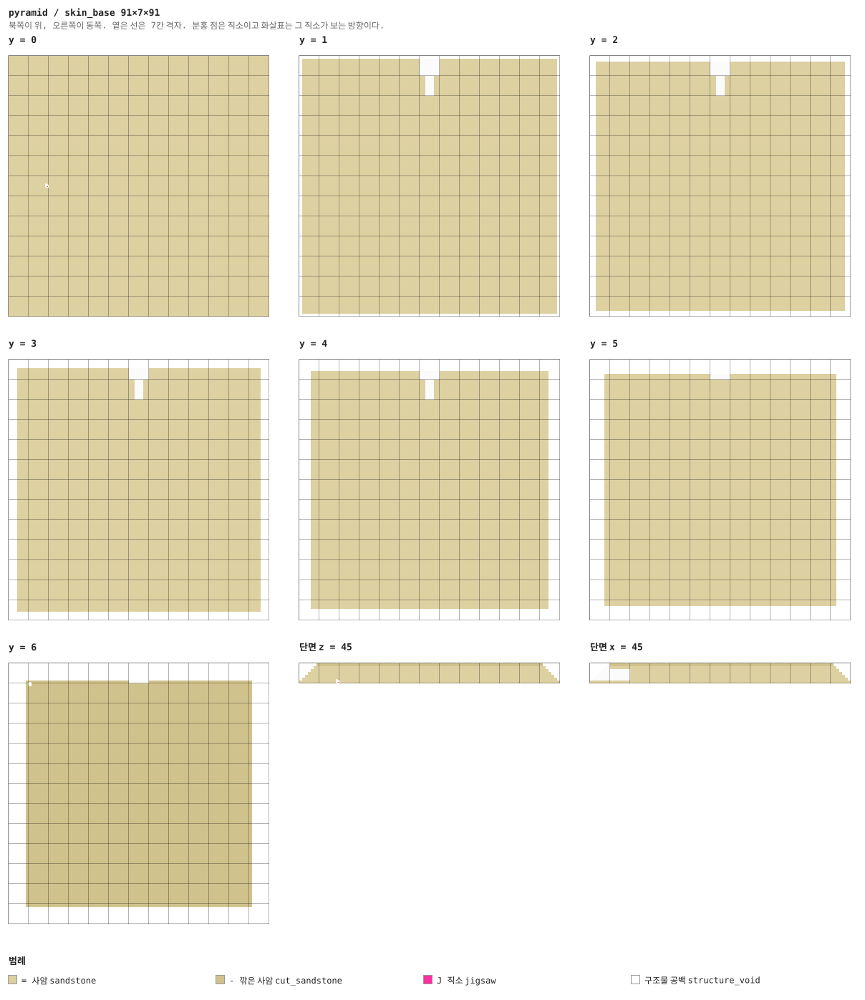


### `skin_mid` — 77×21×77 — 11×3×11 셀

2~4층 껍데기. 가운데 구멍이 커서(`structure_void` 53200) 21칸 높이의 묘실이 통째로 들어간다.
아래 직소 `pyr_anchor`가 `skin_base` 위 직소에 걸리는 유일한 입구고, 이름이 하나뿐이라
뒤집혀 붙을 수 없다.

**어느 풀에 있나** — `skin_mid` (가중치 1)

| 직소 위치 | 향 | name | target | pool |
|---|---|---|---|---|
| (0, 0, 0) | ◇ 아래 | `pyr_anchor` | `pyr_anchor` | `—` |
| (27, 0, 38) | ▶ 동 | `pyr_door` | `pyr_anchor` | `pyramid/tomb` |
| (21, 20, 21) | ◆ 위 | `pyr_door` | `pyr_anchor` | `pyramid/skin_top` |

**블록** — 사암 63112, 구조물 공백 53200, 깎은 사암 8194, 직소 3

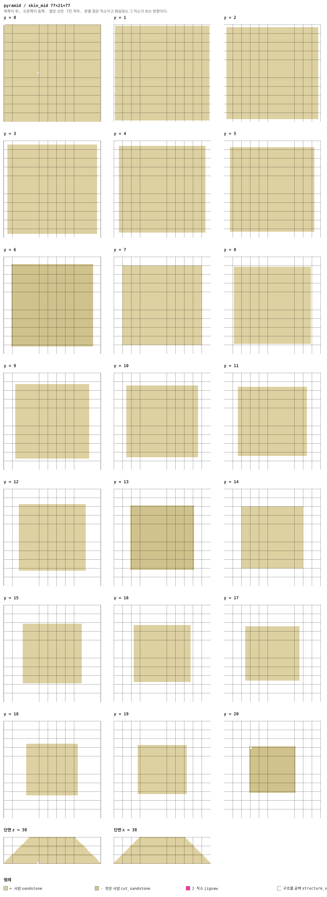


### `skin_top` — 35×18×35

5층과 꼭대기. 여기부터는 속이 거의 비어 있고(void 14280), 석관실 하나를 품는다.
꼭대기 18칸은 통짜 사암 뿔이다.

**어느 풀에 있나** — `skin_top` (가중치 1)

| 직소 위치 | 향 | name | target | pool |
|---|---|---|---|---|
| (0, 0, 0) | ◇ 아래 | `pyr_anchor` | `pyr_anchor` | `—` |
| (18, 0, 24) | ▶ 동 | `pyr_door` | `pyr_anchor` | `pyramid/crypt` |

**블록** — 구조물 공백 14280, 사암 7158, 깎은 사암 610, 직소 2

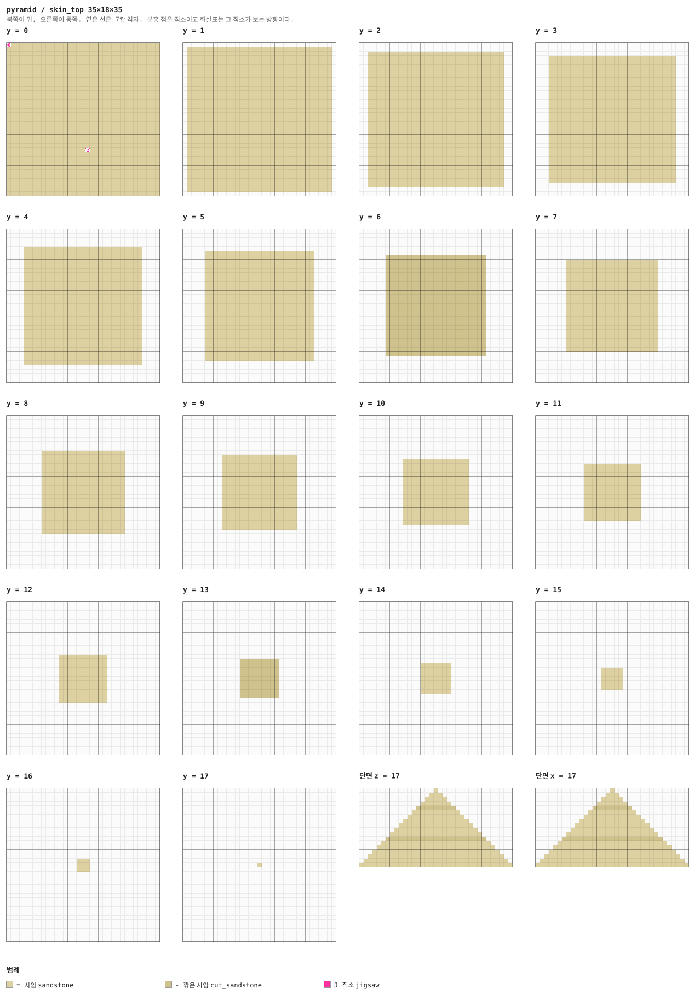

<details><summary>세로 단면 (텍스트)</summary>

```
단면 z = 17   x →동, y ↑하늘
                   =                 
                  ===                
                 =====               
                =======              
               ---------             
              ===========            
             =============           
            ===============          
           =================         
          ===================        
         =====================       
        -----------------------      
       =========================     
      ===========================    
     =============================   
    ===============================  
   ================================= 
  ===================================
단면 x = 17   z →남, y ↑하늘
                   =                 
                  ===                
                 =====               
                =======              
               ---------             
              ===========            
             =============           
            ===============          
           =================         
          ===================        
         =====================       
        -----------------------      
       =========================     
      ===========================    
     =============================   
    ===============================  
   ================================= 
  ===================================
```

</details>


### `core` — 63×7×63 — 9×1×9 셀

**63×63×7의 통짜 사암 덩어리.** 미로가 이걸 파내면서 생긴다. 조각이 놓이는 것이 곧 파내는
것이라 별도의 굴착이 없다.

이 조각이 **형태 보장의 전부**다. 모든 미로 조각은 여기서 뻗어 나온 자손이고, 바닐라는
자식을 부모의 박스 안에서만 판정하므로 무엇도 63×63 밖으로 못 나간다. 피라미드 가장자리까지
8블록이 남는다.

북면에 뚫린 3×4(x 30–32)가 입구 터널의 안쪽 끝이다.

**어느 풀에 있나** — `core` (가중치 1)

| 직소 위치 | 향 | name | target | pool |
|---|---|---|---|---|
| (31, 0, 6) | ▼ 남 | `pyr_door` | `pyr_spine` | `pyramid/spine_1` |
| (0, 0, 31) | ◀ 서 | `pyr_anchor` | `pyr_anchor` | `—` |

**뚫린 면** — 북: x 30–32, y 1–4 (12칸)

**블록** — 사암 27697, 직소 2

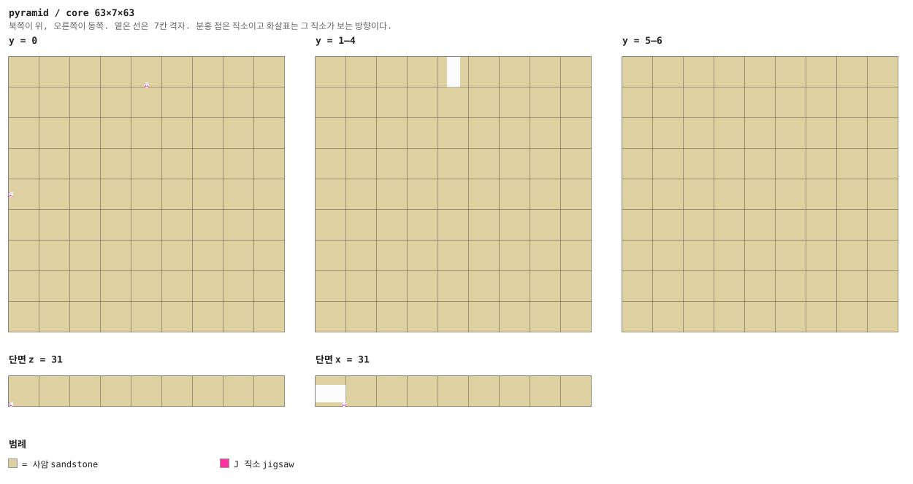


### `spine_1` — 7×7×7 — 1×1×1 셀

입구에서 우물까지 이어지는 결정적 사슬의 1번째 칸. 북문이 `pyr_spine` 입구(하나뿐),
남문이 다음 칸(`spine_2`)을 부른다. 서·동문은 평범한 `passages`라 스파인에서도 미로가 갈라진다.
**입구에서 중앙까지 최소 세 칸**을 강제하는 것이 목적이다.

**어느 풀에 있나** — `spine_1` (가중치 1)

| 직소 위치 | 향 | name | target | pool |
|---|---|---|---|---|
| (3, 0, 0) | ▲ 북 | `pyr_spine` | `pyr_spine` | `—` |
| (0, 0, 3) | ◀ 서 | `pyr_door` | `pyr_door` | `pyramid/passages` |
| (6, 0, 3) | ▶ 동 | `pyr_door` | `pyr_door` | `pyramid/passages` |
| (3, 0, 6) | ▼ 남 | `pyr_door` | `pyr_spine` | `pyramid/spine_2` |

**뚫린 면** — 서: z 2–4, y 1–4 (12칸) / 동: z 2–4, y 1–4 (12칸) / 북: x 2–4, y 1–4 (12칸) / 남: x 2–4, y 1–4 (12칸)

**블록** — 사암 166, 직소 4


<details><summary>층별 지도 (텍스트)</summary>

```
y = 0   x →동, z ↓남
  ===J===
  =======
  =======
  J=====J
  =======
  =======
  ===J===
y = 1–4   x →동, z ↓남
  ==...==
  =.....=
  .......
  .......
  .......
  =.....=
  ==...==
y = 5   x →동, z ↓남
  =======
  =.....=
  =.....=
  =.....=
  =.....=
  =.....=
  =======
y = 6   x →동, z ↓남
  =======
  =======
  =======
  =======
  =======
  =======
  =======
```

</details>


### `spine_2` — 7×7×7 — 1×1×1 셀

입구에서 우물까지 이어지는 결정적 사슬의 2번째 칸. 북문이 `pyr_spine` 입구(하나뿐),
남문이 다음 칸(`spine_3`)을 부른다. 서·동문은 평범한 `passages`라 스파인에서도 미로가 갈라진다.
**입구에서 중앙까지 최소 세 칸**을 강제하는 것이 목적이다.

**어느 풀에 있나** — `spine_2` (가중치 1)

| 직소 위치 | 향 | name | target | pool |
|---|---|---|---|---|
| (3, 0, 0) | ▲ 북 | `pyr_spine` | `pyr_spine` | `—` |
| (0, 0, 3) | ◀ 서 | `pyr_door` | `pyr_door` | `pyramid/passages` |
| (6, 0, 3) | ▶ 동 | `pyr_door` | `pyr_door` | `pyramid/passages` |
| (3, 0, 6) | ▼ 남 | `pyr_door` | `pyr_spine` | `pyramid/spine_3` |

**뚫린 면** — 서: z 2–4, y 1–4 (12칸) / 동: z 2–4, y 1–4 (12칸) / 북: x 2–4, y 1–4 (12칸) / 남: x 2–4, y 1–4 (12칸)

**블록** — 사암 166, 직소 4


<details><summary>층별 지도 (텍스트)</summary>

```
y = 0   x →동, z ↓남
  ===J===
  =======
  =======
  J=====J
  =======
  =======
  ===J===
y = 1–4   x →동, z ↓남
  ==...==
  =.....=
  .......
  .......
  .......
  =.....=
  ==...==
y = 5   x →동, z ↓남
  =======
  =.....=
  =.....=
  =.....=
  =.....=
  =.....=
  =======
y = 6   x →동, z ↓남
  =======
  =======
  =======
  =======
  =======
  =======
  =======
```

</details>


### `spine_3` — 7×7×7 — 1×1×1 셀

입구에서 우물까지 이어지는 결정적 사슬의 3번째 칸. 북문이 `pyr_spine` 입구(하나뿐),
남문이 다음 칸(`well`)을 부른다. 서·동문은 평범한 `passages`라 스파인에서도 미로가 갈라진다.
**입구에서 중앙까지 최소 세 칸**을 강제하는 것이 목적이다.

**어느 풀에 있나** — `spine_3` (가중치 1)

| 직소 위치 | 향 | name | target | pool |
|---|---|---|---|---|
| (3, 0, 0) | ▲ 북 | `pyr_spine` | `pyr_spine` | `—` |
| (0, 0, 3) | ◀ 서 | `pyr_door` | `pyr_door` | `pyramid/passages` |
| (6, 0, 3) | ▶ 동 | `pyr_door` | `pyr_door` | `pyramid/passages` |
| (3, 0, 6) | ▼ 남 | `pyr_door` | `pyr_spine` | `pyramid/well` |

**뚫린 면** — 서: z 2–4, y 1–4 (12칸) / 동: z 2–4, y 1–4 (12칸) / 북: x 2–4, y 1–4 (12칸) / 남: x 2–4, y 1–4 (12칸)

**블록** — 사암 166, 직소 4

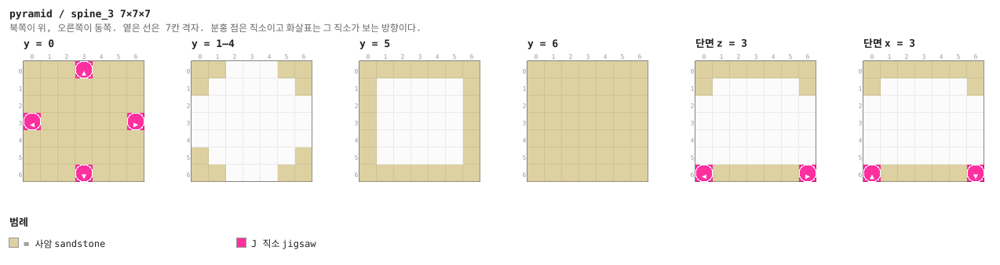

<details><summary>층별 지도 (텍스트)</summary>

```
y = 0   x →동, z ↓남
  ===J===
  =======
  =======
  J=====J
  =======
  =======
  ===J===
y = 1–4   x →동, z ↓남
  ==...==
  =.....=
  .......
  .......
  .......
  =.....=
  ==...==
y = 5   x →동, z ↓남
  =======
  =.....=
  =.....=
  =.....=
  =.....=
  =.....=
  =======
y = 6   x →동, z ↓남
  =======
  =======
  =======
  =======
  =======
  =======
  =======
```

</details>


### `well` — 7×7×7 — 1×1×1 셀

스파인의 끝이자 피라미드의 중심. **천장에 사다리 수직통로가 뚫려 있다** — 위쪽 8칸(x 2–4,
z 2–4)이 열려 있고 그 위는 `tomb`의 바닥 구멍이다. 두 조각 다 코드가 같은 표를 보고 파므로
직소 없이도 정확히 만난다.

서·동·남 세 문이 미로로 나가서, 미로는 사실상 이 방을 중심으로 퍼진다.

**어느 풀에 있나** — `well` (가중치 1)

| 직소 위치 | 향 | name | target | pool |
|---|---|---|---|---|
| (3, 0, 0) | ▲ 북 | `pyr_spine` | `pyr_spine` | `—` |
| (0, 0, 3) | ◀ 서 | `pyr_door` | `pyr_door` | `pyramid/passages` |
| (6, 0, 3) | ▶ 동 | `pyr_door` | `pyr_door` | `pyramid/passages` |
| (3, 0, 6) | ▼ 남 | `pyr_door` | `pyr_door` | `pyramid/passages` |

**뚫린 면** — 서: z 2–4, y 1–4 (12칸) / 동: z 2–4, y 1–4 (12칸) / 북: x 2–4, y 1–4 (12칸) / 남: x 2–4, y 1–4 (12칸) / 위: x 2–4, z 2–4 (8칸)

**블록** — 사암 157, 깎은 사암 15, 사다리 6, 직소 4, 랜턴 1

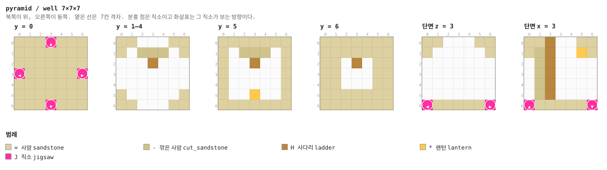

<details><summary>층별 지도 (텍스트)</summary>

```
y = 0   x →동, z ↓남
  ===J===
  =======
  =======
  J=====J
  =======
  =======
  ===J===
y = 1–4   x →동, z ↓남
  ==...==
  =.---.=
  ...H...
  .......
  .......
  =.....=
  ==...==
y = 5   x →동, z ↓남
  =======
  =.---.=
  =..H..=
  =.....=
  =.....=
  =..*..=
  =======
y = 6   x →동, z ↓남
  =======
  =======
  ==.H.==
  ==...==
  ==...==
  =======
  =======
```

</details>


### `tomb` — 21×21×21 — 3×3×3 셀

21×21×21 묘실. **입구가 바닥 한가운데**라는 점이 지하감옥 보스방과 다르다 — 사다리를 타고
올라오면 이미 방 한복판이고, 사분면 스포너 넷과 단상의 파라오가 사방을 둘러싸고 있다.
도망칠 문이 없다.

천장 근처(x 14–16, z 17–19)에 해치가 있고 그 위가 석관실이다. 사다리 21칸이 그리로 올린다.

**어느 풀에 있나** — `tomb` (가중치 1)

| 직소 위치 | 향 | name | target | pool |
|---|---|---|---|---|
| (0, 0, 10) | ◀ 서 | `pyr_anchor` | `pyr_anchor` | `—` |

**뚫린 면** — 아래: x 9–11, z 9–11 (8칸) / 위: x 14–16, z 17–19 (8칸)

**블록** — 사암 2175, 조각한 사암 313, 깎은 사암 208, 매끄러운 사암 35, 사다리 21, 트라이얼 스포너 5, 랜턴 4, 직소 1

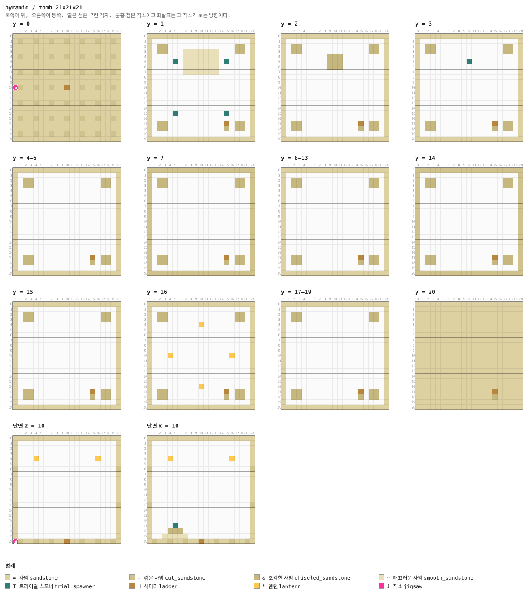

<details><summary>층별 지도 (텍스트)</summary>

```
y = 0   x →동, z ↓남
  =====================
  =-==-==-==-==-==-==-=
  =====================
  =====================
  =-==-==-==-==-==-==-=
  =====================
  =====================
  =-==-==-==-==-==-==-=
  =====================
  =========.H.=========
  J-==-==-=...=-==-==-=
  =========...=========
  =====================
  =-==-==-==-==-==-==-=
  =====================
  =====================
  =-==-==-==-==-==-==-=
  =====================
  =====================
  =-==-==-==-==-==-==-=
  =====================
y = 1   x →동, z ↓남
  =====================
  =...................=
  =.&&.............&&.=
  =.&&...~~~~~~~...&&.=
  =......~~~~~~~......=
  =....T.~~~~~~~.T....=
  =......~~~~~~~......=
  =......~~~~~~~......=
  =...................=
  =...................=
  =...................=
  =...................=
  =...................=
  =...................=
  =...................=
  =....T.........T....=
  =...................=
  =.&&.............&&.=
  =.&&.............&&.=
  =..............H....=
  =====================
y = 2   x →동, z ↓남
  =====================
  =...................=
  =.&&.............&&.=
  =.&&.............&&.=
  =........&&&........=
  =........&&&........=
  =........&&&........=
  =...................=
  =...................=
  =...................=
  =...................=
  =...................=
  =...................=
  =...................=
  =...................=
  =...................=
  =...................=
  =.&&.............&&.=
  =.&&.............&&.=
  =..............H....=
  =====================
y = 3   x →동, z ↓남
  =====================
  =...................=
  =.&&.............&&.=
  =.&&.............&&.=
  =...................=
  =.........T.........=
  =...................=
  =...................=
  =...................=
  =...................=
  =...................=
  =...................=
  =...................=
  =...................=
  =...................=
  =...................=
  =...................=
  =.&&.............&&.=
  =.&&.............&&.=
  =..............H....=
  =====================
y = 4–6   x →동, z ↓남
  =====================
  =...................=
  =.&&.............&&.=
  =.&&.............&&.=
  =...................=
  =...................=
  =...................=
  =...................=
  =...................=
  =...................=
  =...................=
  =...................=
  =...................=
  =...................=
  =...................=
  =...................=
  =...................=
  =.&&.............&&.=
  =.&&.............&&.=
  =..............H....=
  =====================
y = 7   x →동, z ↓남
  ---------------------
  -...................-
  -.&&.............&&.-
  -.&&.............&&.-
  -...................-
  -...................-
  -...................-
  -...................-
  -...................-
  -...................-
  -...................-
  -...................-
  -...................-
  -...................-
  -...................-
  -...................-
  -...................-
  -.&&.............&&.-
  -.&&.............&&.-
  -..............H....-
  ---------------------
y = 8–13   x →동, z ↓남
  =====================
  =...................=
  =.&&.............&&.=
  =.&&.............&&.=
  =...................=
  =...................=
  =...................=
  =...................=
  =...................=
  =...................=
  =...................=
  =...................=
  =...................=
  =...................=
  =...................=
  =...................=
  =...................=
  =.&&.............&&.=
  =.&&.............&&.=
  =..............H....=
  =====================
y = 14   x →동, z ↓남
  ---------------------
  -...................-
  -.&&.............&&.-
  -.&&.............&&.-
  -...................-
  -...................-
  -...................-
  -...................-
  -...................-
  -...................-
  -...................-
  -...................-
  -...................-
  -...................-
  -...................-
  -...................-
  -...................-
  -.&&.............&&.-
  -.&&.............&&.-
  -..............H....-
  ---------------------
y = 15   x →동, z ↓남
  =====================
  =...................=
  =.&&.............&&.=
  =.&&.............&&.=
  =...................=
  =...................=
  =...................=
  =...................=
  =...................=
  =...................=
  =...................=
  =...................=
  =...................=
  =...................=
  =...................=
  =...................=
  =...................=
  =.&&.............&&.=
  =.&&.............&&.=
  =..............H....=
  =====================
y = 16   x →동, z ↓남
  =====================
  =...................=
  =.&&.............&&.=
  =.&&.............&&.=
  =.........*.........=
  =...................=
  =...................=
  =...................=
  =...................=
  =...................=
  =...*...........*...=
  =...................=
  =...................=
  =...................=
  =...................=
  =...................=
  =.........*.........=
  =.&&.............&&.=
  =.&&.............&&.=
  =..............H....=
  =====================
y = 17–19   x →동, z ↓남
  =====================
  =...................=
  =.&&.............&&.=
  =.&&.............&&.=
  =...................=
  =...................=
  =...................=
  =...................=
  =...................=
  =...................=
  =...................=
  =...................=
  =...................=
  =...................=
  =...................=
  =...................=
  =...................=
  =.&&.............&&.=
  =.&&.............&&.=
  =..............H....=
  =====================
y = 20   x →동, z ↓남
  =====================
  =====================
  =====================
  =====================
  =====================
  =====================
  =====================
  =====================
  =====================
  =====================
  =====================
  =====================
  =====================
  =====================
  =====================
  =====================
  =====================
  ==============...====
  ==============...====
  ==============.H.====
  =====================
```

</details>

<details><summary>세로 단면 (텍스트)</summary>

```
단면 z = 10   x →동, y ↑하늘
  =====================
  =...................=
  =...................=
  =...................=
  =...*...........*...=
  =...................=
  -...................-
  =...................=
  =...................=
  =...................=
  =...................=
  =...................=
  =...................=
  -...................-
  =...................=
  =...................=
  =...................=
  =...................=
  =...................=
  =...................=
  J-==-==-=...=-==-==-=
단면 x = 10   z →남, y ↑하늘
  =====================
  =...................=
  =...................=
  =...................=
  =...*...........*...=
  =...................=
  -...................-
  =...................=
  =...................=
  =...................=
  =...................=
  =...................=
  =...................=
  -...................-
  =...................=
  =...................=
  =...................=
  =....T..............=
  =...&&&.............=
  =..~~~~~............=
  =-==-==-=H..=-==-==-=
```

</details>


### `crypt` — 7×7×7 — 1×1×1 셀

묘실 천장 위 석관실. 문이 없고 **바닥 해치로만** 들어온다. 마법 황금사과가 든 상자 하나가
확정으로 있다. 보스를 잡은 사람만 닿는 자리라 전리품이 확정이어도 된다.

**어느 풀에 있나** — `crypt` (가중치 1)

| 직소 위치 | 향 | name | target | pool |
|---|---|---|---|---|
| (0, 0, 3) | ◀ 서 | `pyr_anchor` | `pyr_anchor` | `—` |

**뚫린 면** — 아래: x 2–4, z 3–5 (8칸)

**블록** — 사암 208, 조각한 사암 5, 사다리 2, 직소 1, 상자 1, 랜턴 1

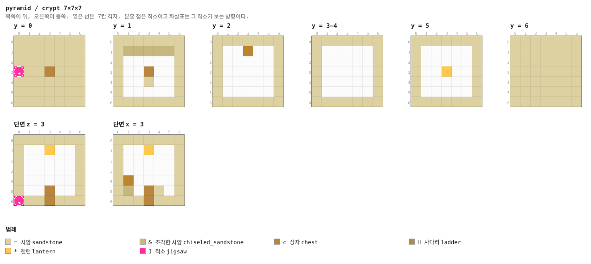

<details><summary>층별 지도 (텍스트)</summary>

```
y = 0   x →동, z ↓남
  =======
  =======
  =======
  J=...==
  ==...==
  ==.H.==
  =======
y = 1   x →동, z ↓남
  =======
  =&&&&&=
  =.....=
  =.....=
  =.....=
  =..H..=
  =======
y = 2   x →동, z ↓남
  =======
  =..c..=
  =.....=
  =.....=
  =.....=
  =.....=
  =======
y = 3–4   x →동, z ↓남
  =======
  =.....=
  =.....=
  =.....=
  =.....=
  =.....=
  =======
y = 5   x →동, z ↓남
  =======
  =.....=
  =.....=
  =..*..=
  =.....=
  =.....=
  =======
y = 6   x →동, z ↓남
  =======
  =======
  =======
  =======
  =======
  =======
  =======
```

</details>


### `passage` — 7×7×7 — 1×1×1 셀

미로의 기본 단위. 서-동 직선, 가중치 10.

**어느 풀에 있나** — `passages` (가중치 10)

| 직소 위치 | 향 | name | target | pool |
|---|---|---|---|---|
| (0, 0, 3) | ◀ 서 | `pyr_door` | `pyr_door` | `pyramid/passages` |
| (6, 0, 3) | ▶ 동 | `pyr_door` | `pyr_door` | `pyramid/passages` |

**뚫린 면** — 서: z 2–4, y 1–4 (12칸) / 동: z 2–4, y 1–4 (12칸)

**블록** — 사암 192, 직소 2

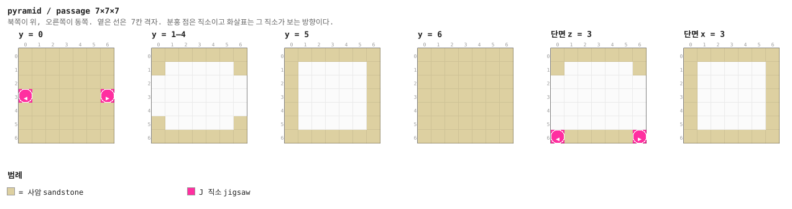

<details><summary>층별 지도 (텍스트)</summary>

```
y = 0   x →동, z ↓남
  =======
  =======
  =======
  J=====J
  =======
  =======
  =======
y = 1–4   x →동, z ↓남
  =======
  =.....=
  .......
  .......
  .......
  =.....=
  =======
y = 5   x →동, z ↓남
  =======
  =.....=
  =.....=
  =.....=
  =.....=
  =.....=
  =======
y = 6   x →동, z ↓남
  =======
  =======
  =======
  =======
  =======
  =======
  =======
```

</details>


### `corner` — 7×7×7 — 1×1×1 셀

서-남 모퉁이. 지하감옥에는 없는 조각이다. 피라미드 미로는 한 층뿐이라 평면이 단조로워지기
쉬워서 모퉁이를 가중치 8로 높게 넣었다.

**어느 풀에 있나** — `passages` (가중치 8)

| 직소 위치 | 향 | name | target | pool |
|---|---|---|---|---|
| (0, 0, 3) | ◀ 서 | `pyr_door` | `pyr_door` | `pyramid/passages` |
| (3, 0, 6) | ▼ 남 | `pyr_door` | `pyr_door` | `pyramid/passages` |

**뚫린 면** — 서: z 2–4, y 1–4 (12칸) / 남: x 2–4, y 1–4 (12칸)

**블록** — 사암 192, 직소 2

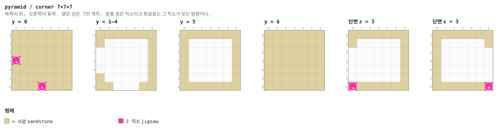

<details><summary>층별 지도 (텍스트)</summary>

```
y = 0   x →동, z ↓남
  =======
  =======
  =======
  J======
  =======
  =======
  ===J===
y = 1–4   x →동, z ↓남
  =======
  =.....=
  ......=
  ......=
  ......=
  =.....=
  ==...==
y = 5   x →동, z ↓남
  =======
  =.....=
  =.....=
  =.....=
  =.....=
  =.....=
  =======
y = 6   x →동, z ↓남
  =======
  =======
  =======
  =======
  =======
  =======
  =======
```

</details>


### `cross` — 7×7×7 — 1×1×1 셀

십자 교차로.

**어느 풀에 있나** — `passages` (가중치 7)

| 직소 위치 | 향 | name | target | pool |
|---|---|---|---|---|
| (3, 0, 0) | ▲ 북 | `pyr_door` | `pyr_door` | `pyramid/passages` |
| (0, 0, 3) | ◀ 서 | `pyr_door` | `pyr_door` | `pyramid/passages` |
| (6, 0, 3) | ▶ 동 | `pyr_door` | `pyr_door` | `pyramid/passages` |
| (3, 0, 6) | ▼ 남 | `pyr_door` | `pyr_door` | `pyramid/passages` |

**뚫린 면** — 서: z 2–4, y 1–4 (12칸) / 동: z 2–4, y 1–4 (12칸) / 북: x 2–4, y 1–4 (12칸) / 남: x 2–4, y 1–4 (12칸)

**블록** — 사암 166, 직소 4

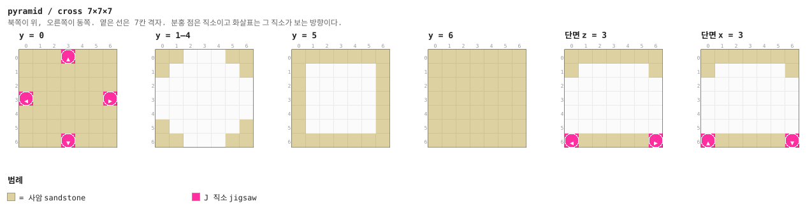

<details><summary>층별 지도 (텍스트)</summary>

```
y = 0   x →동, z ↓남
  ===J===
  =======
  =======
  J=====J
  =======
  =======
  ===J===
y = 1–4   x →동, z ↓남
  ==...==
  =.....=
  .......
  .......
  .......
  =.....=
  ==...==
y = 5   x →동, z ↓남
  =======
  =.....=
  =.....=
  =.....=
  =.....=
  =.....=
  =======
y = 6   x →동, z ↓남
  =======
  =======
  =======
  =======
  =======
  =======
  =======
```

</details>


### `niche` — 7×7×7 — 1×1×1 셀

문 하나짜리 막다른 벽감. 상자 하나(`chests/pyramid_niche`). 지하감옥의 `dead_end`에 해당하지만
스포너가 없어서 더 가볍고, 가중치 9로 자주 나온다.

**어느 풀에 있나** — `passages` (가중치 9)

| 직소 위치 | 향 | name | target | pool |
|---|---|---|---|---|
| (0, 0, 3) | ◀ 서 | `pyr_door` | `pyr_door` | `pyramid/passages` |

**뚫린 면** — 서: z 2–4, y 1–4 (12칸)

**블록** — 사암 205, 깎은 사암 6, 직소 1, 상자 1, 조각한 사암 1

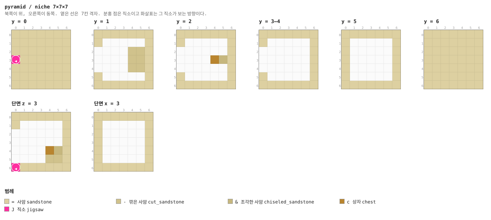

<details><summary>층별 지도 (텍스트)</summary>

```
y = 0   x →동, z ↓남
  =======
  =======
  =======
  J======
  =======
  =======
  =======
y = 1   x →동, z ↓남
  =======
  =.....=
  ....--=
  ....--=
  ....--=
  =.....=
  =======
y = 2   x →동, z ↓남
  =======
  =.....=
  ......=
  ....c&=
  ......=
  =.....=
  =======
y = 3–4   x →동, z ↓남
  =======
  =.....=
  ......=
  ......=
  ......=
  =.....=
  =======
y = 5   x →동, z ↓남
  =======
  =.....=
  =.....=
  =.....=
  =.....=
  =.....=
  =======
y = 6   x →동, z ↓남
  =======
  =======
  =======
  =======
  =======
  =======
  =======
```

</details>


### `sand_den` — 7×7×7 — 1×1×1 셀

**모래가 되찾은 칸.** 통로는 뚫려 있지만 나머지는 모래로 막혀 있고, 알코브에 허스크 스포너가
묻혀 있다. 트리거가 없는 위험 — 파고 들어가는 것도, 지나치는 것도 플레이어의 선택이다.

**어느 풀에 있나** — `passages` (가중치 6)

| 직소 위치 | 향 | name | target | pool |
|---|---|---|---|---|
| (0, 0, 3) | ◀ 서 | `pyr_door` | `pyr_door` | `pyramid/passages` |
| (6, 0, 3) | ▶ 동 | `pyr_door` | `pyr_door` | `pyramid/passages` |

**뚫린 면** — 서: z 2–4, y 1–4 (12칸) / 동: z 2–4, y 1–4 (12칸)

**블록** — 사암 192, 모래 70, 직소 2, 몬스터 스포너 1

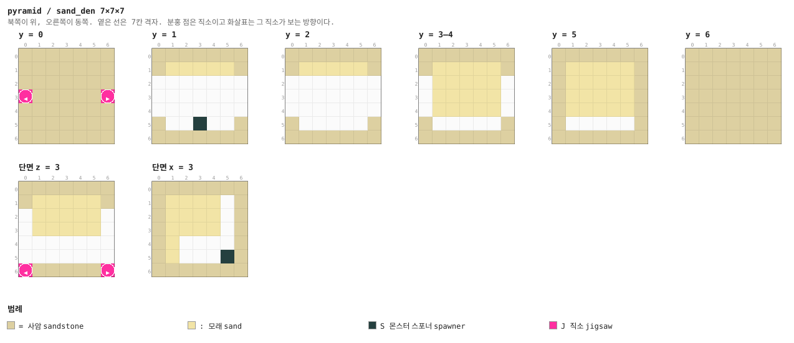

<details><summary>층별 지도 (텍스트)</summary>

```
y = 0   x →동, z ↓남
  =======
  =======
  =======
  J=====J
  =======
  =======
  =======
y = 1   x →동, z ↓남
  =======
  =:::::=
  .......
  .......
  .......
  =..S..=
  =======
y = 2   x →동, z ↓남
  =======
  =:::::=
  .......
  .......
  .......
  =.....=
  =======
y = 3–4   x →동, z ↓남
  =======
  =:::::=
  .:::::.
  .:::::.
  .:::::.
  =.....=
  =======
y = 5   x →동, z ↓남
  =======
  =:::::=
  =:::::=
  =:::::=
  =:::::=
  =.....=
  =======
y = 6   x →동, z ↓남
  =======
  =======
  =======
  =======
  =======
  =======
  =======
```

</details>


### `dig_site` — 7×7×7 — 1×1×1 셀

모래 언덕에 수상한 모래가 묻혀 있다. **솔질은 몹이 할 수 없는 유일한 상호작용**이라 함정을
전부 뺀 뒤에도 이 조각만 남았다. 전리품은 `archaeology/pyramid_sand`.

**어느 풀에 있나** — `passages` (가중치 5)

| 직소 위치 | 향 | name | target | pool |
|---|---|---|---|---|
| (0, 0, 3) | ◀ 서 | `pyr_door` | `pyr_door` | `pyramid/passages` |
| (6, 0, 3) | ▶ 동 | `pyr_door` | `pyr_door` | `pyramid/passages` |

**뚫린 면** — 서: z 2–4, y 1–4 (12칸) / 동: z 2–4, y 1–4 (12칸)

**블록** — 사암 192, 모래 11, 수상한 모래 4, 직소 2

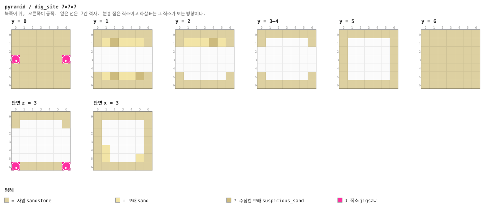

<details><summary>층별 지도 (텍스트)</summary>

```
y = 0   x →동, z ↓남
  =======
  =======
  =======
  J=====J
  =======
  =======
  =======
y = 1   x →동, z ↓남
  =======
  =:?:::=
  .......
  .......
  .......
  =:?::?=
  =======
y = 2   x →동, z ↓남
  =======
  =:::?:=
  .......
  .......
  .......
  =.....=
  =======
y = 3–4   x →동, z ↓남
  =======
  =.....=
  .......
  .......
  .......
  =.....=
  =======
y = 5   x →동, z ↓남
  =======
  =.....=
  =.....=
  =.....=
  =.....=
  =.....=
  =======
y = 6   x →동, z ↓남
  =======
  =======
  =======
  =======
  =======
  =======
  =======
```

</details>


### `guard_post` — 7×7×7 — 1×1×1 셀

교차로 한가운데 허스크 스포너. 지하감옥의 `cross_guard`와 같은 역할이다.

**어느 풀에 있나** — `passages` (가중치 6)

| 직소 위치 | 향 | name | target | pool |
|---|---|---|---|---|
| (3, 0, 0) | ▲ 북 | `pyr_door` | `pyr_door` | `pyramid/passages` |
| (0, 0, 3) | ◀ 서 | `pyr_door` | `pyr_door` | `pyramid/passages` |
| (6, 0, 3) | ▶ 동 | `pyr_door` | `pyr_door` | `pyramid/passages` |
| (3, 0, 6) | ▼ 남 | `pyr_door` | `pyr_door` | `pyramid/passages` |

**뚫린 면** — 서: z 2–4, y 1–4 (12칸) / 동: z 2–4, y 1–4 (12칸) / 북: x 2–4, y 1–4 (12칸) / 남: x 2–4, y 1–4 (12칸)

**블록** — 사암 166, 직소 4, 조각한 사암 4, 몬스터 스포너 1

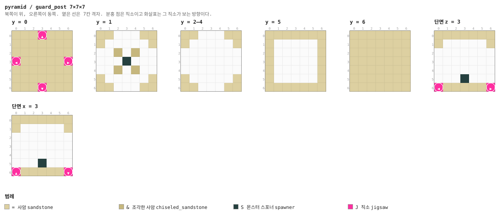

<details><summary>층별 지도 (텍스트)</summary>

```
y = 0   x →동, z ↓남
  ===J===
  =======
  =======
  J=====J
  =======
  =======
  ===J===
y = 1   x →동, z ↓남
  ==...==
  =.....=
  ..&.&..
  ...S...
  ..&.&..
  =.....=
  ==...==
y = 2–4   x →동, z ↓남
  ==...==
  =.....=
  .......
  .......
  .......
  =.....=
  ==...==
y = 5   x →동, z ↓남
  =======
  =.....=
  =.....=
  =.....=
  =.....=
  =.....=
  =======
y = 6   x →동, z ↓남
  =======
  =======
  =======
  =======
  =======
  =======
  =======
```

</details>


### `cap` — 1×7×7

두께 1의 사암 벽. 모든 풀의 fallback.

**어느 풀에 있나** — `caps` (가중치 1)

| 직소 위치 | 향 | name | target | pool |
|---|---|---|---|---|
| (0, 0, 3) | ◀ 서 | `pyr_door` | `pyr_door` | `pyramid/caps` |

**블록** — 사암 48, 직소 1

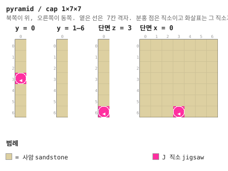

<details><summary>층별 지도 (텍스트)</summary>

```
y = 0   x →동, z ↓남
  =
  =
  =
  J
  =
  =
  =
y = 1–6   x →동, z ↓남
  =
  =
  =
  =
  =
  =
  =
```

</details>


## 다듬을 곳

- **껍데기가 통짜 사암이다.** 층마다 깎은 사암 띠가 하나 들어갈 뿐, 45° 면에 아무 무늬가 없다.
  실물 피라미드처럼 면에 얕은 층을 주거나, 모서리 선을 다른 블록으로 긋는 것이 어울린다.
- **입구가 북면 한가운데에 문 하나뿐이다.** 스핑크스나 계단, 오벨리스크 같은 외부 장식이 없어서
  멀리서는 그냥 모래 산으로 보인다.
- **미로 칸이 전부 평평하다.** 피라미드 1층은 높이 7칸 한 층뿐이라 위아래가 없다. 지하감옥의
  `stair`에 해당하는 것이 없다.
- **묘실 위쪽 절반이 비어 있다.** 21칸 높이인데 단상과 스포너는 바닥에 있고 천장 근처는
  랜턴 넷뿐이다.
- **`dig_site`의 수상한 모래가 4칸뿐**이라 솔질 한 번이면 끝난다.
