# 레벨 설계 — 산신의 사당

> 이 문서는 `python tools/gen_level_doc.py shrine`가 만든다. 조각을 고치면 다시 돌린다. 그림과 표는 게임이 읽는 파일(`structure/shrine/*.nbt`, `worldgen/**`)에서 그대로 읽어 온 것이라 모드와 어긋날 수 없다. 설명 문장만 사람이 쓴다 (`tools/gen_level_doc.py`의 `INTRO`·`NOTES`).

## 1. 한눈에

벚꽃숲의 사당이다. 토리이가 선 네 갈래 돌길이 숲으로 뻗고, 그 가운데에 담을 두른 마당과
일곱 칸 높이의 단상, 그 위에 **제단**이 있다.

**두 번째 중소규모 던전이고, 보스가 없다** (§2.8). 대신 **이 모드에서 상자가 진행을 주는
단 하나의 예외**가 여기 있다 — 제단 상자의 **엔더 진주 6 + 경험치 병 8**. 그리고 단상
속에는 **문이 없는 지하실**이 들어 있다.

| 항목 | 값 |
|---|---|
| 생성 단계 | `surface_structures` |
| 바이옴 | `#sydungeon:has_structure/shrine` |
| 간격 / 최소거리 | spacing 40 / separation 14 |
| 직소 깊이 | 10 ~ 16 (`sydungeon:ranged_jigsaw`) |
| 시작 풀 | `start` |
| 조각 / 풀 | 11개 / 4개 |

## 2. 조립 원리

### 상자가 진행을 주는 단 하나의 자리

§2.1은 진행 아이템을 상자에 넣지 않는다 — 상자는 싸우지 않고 열 수 있으니까. 사당은 그
규칙의 **유일한 예외**이고, `docs/concepts.md` §4.11에 예외로 적혀 있다. 이유는 사당이
하는 약속 자체가 "아무것도 요구하지 않는다"이기 때문이다. 적이 없고, 스포너가 없고,
`verify()`가 **트라이얼 스포너도 몬스터 스포너도 하나라도 있으면 거부한다.**

엔더 진주 여섯은 엔더의 눈 재료다. 요새로 가는 길이 싸움 없는 던전 하나에서 시작한다.

### 산을 오르지 않는다

콘셉트는 산길을 오르는 계단과 토리이였다. 사슬로 엮으면 될 것 같지만, **사슬의 각 조각은
지형이 아니라 자기 직소의 높이로 놓인다** (§18). 그래서 오르막 사슬의 끝은 산비탈이
아니라 계산이 놓는 자리에 서고, 경사가 딱 맞는 한 가지 지형 말고는 마지막 계단이 공중에
뜬다.

그래서 오르막을 **마당 안으로** 들여왔다. 길은 숲을 수평으로 지나가고, 오르는 것은
조각이 자기 손으로 쌓은 단상 일곱 칸이다. 기하가 우리 것이면 계단은 항상 닿는다 (§11).

### 자식은 부모의 직소 **앞**에 놓인다

지하실을 단상 서쪽 벽에 걸었더니 마당 밖으로 한 칸 밀려났다. 한 칸이면 충분하다 —
**부모의 박스에 들어가지 않는 자식은 말없이 버려진다** (§10). 지하실이 아예 생성되지
않았고, 조각을 검사해서는 알 수 없었다.

직소는 자식이 놓일 자리를 **가리키는** 것이므로, 단상 속에 방을 넣으려면 직소가 반대쪽
벽에 서서 단상을 **관통해 되돌아봐야** 한다. `cellar_problems()`가 그 계산을 대신 해서
지하실이 실제로 어디 떨어지는지 좌표로 찍어 본다.

### 손으로 깎은 계단은 조용히 계단이 아니게 된다

처음 쓴 단상 계단은 단상 **속**에 디딤판을 써 넣은 것이었다. 위에 공기가 없으니 계단은
통짜 돌에 묻혔고, 제단으로 올라갈 길이 없었다. `walk_problems()`가 이제 **네 문에서
제단까지 플레이어처럼 걸어 본다** — 발밑이 단단하고, 머리 위 두 칸이 비어 있고, 한 번에
한 칸 오르고 두 칸 내린다.

### 문이 없는 방은 여기도 통한다

마법사의 탑의 비밀방과 같은 수법이다 (§15). 지하실은 문이 하나도 없고 직소는 벽 속에
있다. 단상은 9×9이고 위에 선 사당은 7×7이니, **단상이 사당보다 크다는 것을 눈치채고
파야** 상자가 나온다.

## 3. 풀 배선

풀이 어떤 조각을 내놓는지(실선, 숫자는 가중치)와 그 조각의 직소가 다시 어떤 풀을 부르는지(점선)다. 직소 생성은 이 그래프를 깊이만큼 따라간다.

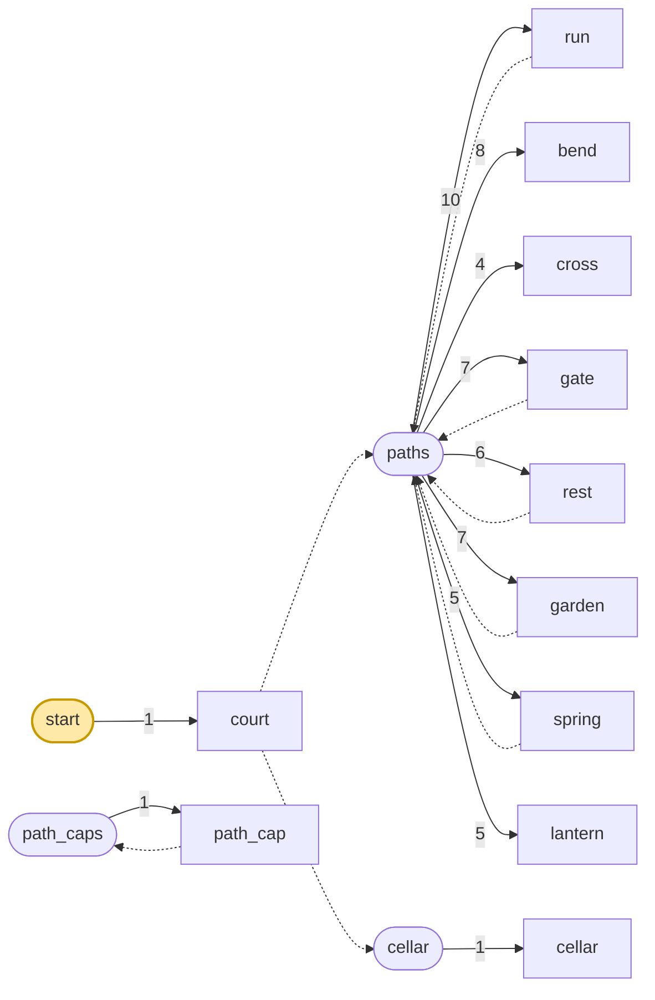

| 풀 | fallback | 원소 (가중치) |
|---|---|---|
| `cellar` | `minecraft:empty` | `cellar` 1 |
| `path_caps` | `minecraft:empty` | `path_cap` 1 |
| `paths` | `path_caps` | `run` 10, `bend` 8, `cross` 4, `gate` 7, `rest` 6, `garden` 7, `spring` 5, `lantern` 5 |
| `start` | `minecraft:empty` | `court` 1 |

## 4. 조각


그림은 조각 하나를 **층마다 한 장씩** 블록 단위로 그린 것이다. 같은 층이 이어지면 `y = 2–5`처럼 묶었고, 마지막 두 장은 가운데를 자른 세로 단면이다. 분홍 점이 직소, 화살표가 그 직소가 보는 방향이다 — **마주 본 직소끼리만 붙는다.**

### `court` — 21×23×21

시작 조각. 담을 두른 21×21 마당, 네 면 가운데에 토리이와 문, 가운데에 일곱 칸 단상. 단상
남쪽 한 칸 앞에 계단이 동에서 서로 오르고, 그 위 네 기둥과 판자 지붕 아래 **제단 상자**가
있다. 상자 위 종 하나, 처마 밑 랜턴 둘.

단상 **동쪽 벽에 지하실을 부르는 직소**가 박혀 있다. 서쪽 벽이 아닌 이유는 자식이 직소
앞에 놓이기 때문이다 — 서쪽에 두면 마당 밖으로 밀려나 버려진다.

**어느 풀에 있나** — `start` (가중치 1)

| 직소 위치 | 향 | name | target | pool |
|---|---|---|---|---|
| (10, 5, 0) | ▲ 북 | `shr_path` | `shr_path` | `shrine/paths` |
| (0, 5, 10) | ◀ 서 | `shr_path` | `shr_path` | `shrine/paths` |
| (20, 5, 10) | ▶ 동 | `shr_path` | `shr_path` | `shrine/paths` |
| (10, 5, 20) | ▼ 남 | `shr_path` | `shr_path` | `shrine/paths` |
| (14, 6, 10) | ◀ 서 | `shr_path` | `shr_sealed` | `shrine/cellar` |

**뚫린 면** — 서: z 0–20, y 6–22 (303칸) / 동: z 0–20, y 6–22 (303칸) / 북: x 0–20, y 6–22 (303칸) / 남: x 0–20, y 6–22 (303칸) / 위: x 0–20, z 0–20 (441칸)

**블록** — 돌 2554, 매끄러운 돌 594, 안산암 담장 112, 윤나는 안산암 50, 벚나무 판자 45, 벚나무 원목 40, 매끄러운 돌 반 블록 32, 껍질 벗긴 벚나무 28

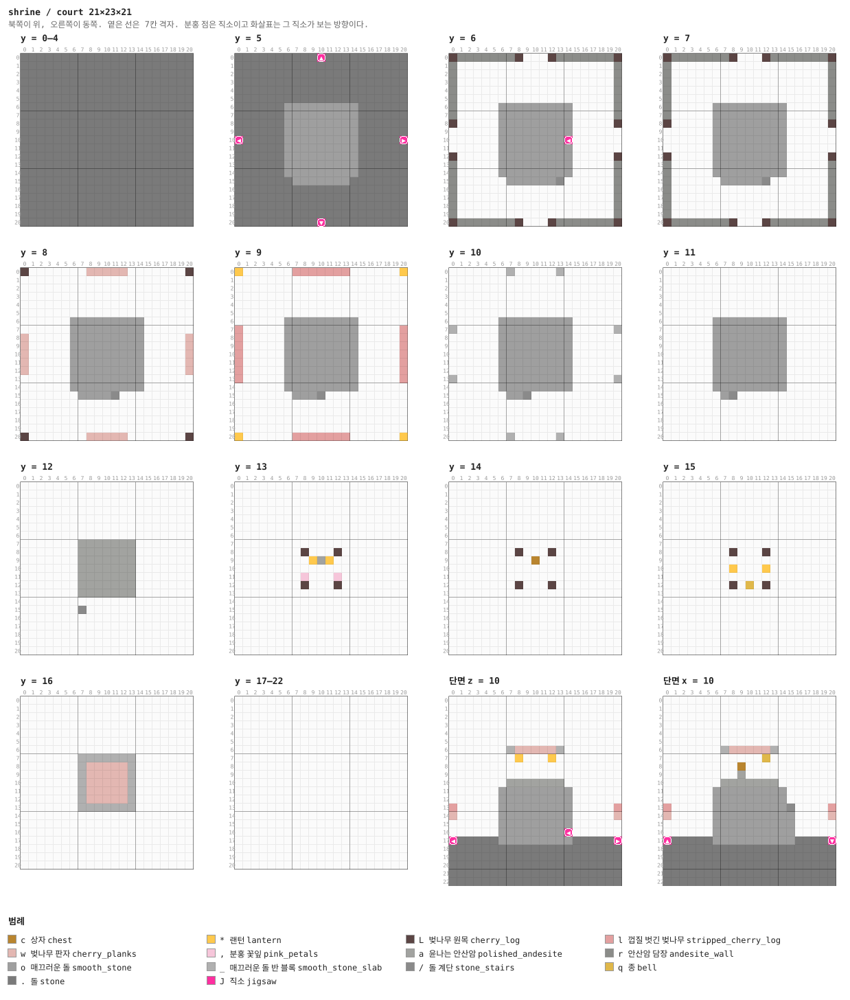

<details><summary>층별 지도 (텍스트)</summary>

```
y = 0–4   x →동, z ↓남
  .....................
  .....................
  .....................
  .....................
  .....................
  .....................
  .....................
  .....................
  .....................
  .....................
  .....................
  .....................
  .....................
  .....................
  .....................
  .....................
  .....................
  .....................
  .....................
  .....................
  .....................
y = 5   x →동, z ↓남
  ..........J..........
  .....................
  .....................
  .....................
  .....................
  .....................
  ......ooooooooo......
  ......ooooooooo......
  ......ooooooooo......
  ......ooooooooo......
  J.....ooooooooo.....J
  ......ooooooooo......
  ......ooooooooo......
  ......ooooooooo......
  ......ooooooooo......
  .......ooooooo.......
  .....................
  .....................
  .....................
  .....................
  ..........J..........
y = 6   x →동, z ↓남
  LrrrrrrrL...LrrrrrrrL
  r...................r
  r...................r
  r...................r
  r...................r
  r...................r
  r.....ooooooooo.....r
  r.....ooooooooo.....r
  L.....ooooooooo.....L
  ......ooooooooo......
  ......ooooooooJ......
  ......ooooooooo......
  L.....ooooooooo.....L
  r.....ooooooooo.....r
  r.....ooooooooo.....r
  r......oooooo/......r
  r...................r
  r...................r
  r...................r
  r...................r
  LrrrrrrrL...LrrrrrrrL
y = 7   x →동, z ↓남
  LrrrrrrrL...LrrrrrrrL
  r...................r
  r...................r
  r...................r
  r...................r
  r...................r
  r.....ooooooooo.....r
  r.....ooooooooo.....r
  L.....ooooooooo.....L
  ......ooooooooo......
  ......ooooooooo......
  ......ooooooooo......
  L.....ooooooooo.....L
  r.....ooooooooo.....r
  r.....ooooooooo.....r
  r......ooooo/.......r
  r...................r
  r...................r
  r...................r
  r...................r
  LrrrrrrrL...LrrrrrrrL
y = 8   x →동, z ↓남
  L.......wwwww.......L
  .....................
  .....................
  .....................
  .....................
  .....................
  ......ooooooooo......
  ......ooooooooo......
  w.....ooooooooo.....w
  w.....ooooooooo.....w
  w.....ooooooooo.....w
  w.....ooooooooo.....w
  w.....ooooooooo.....w
  ......ooooooooo......
  ......ooooooooo......
  .......oooo/.........
  .....................
  .....................
  .....................
  .....................
  L.......wwwww.......L
y = 9   x →동, z ↓남
  *......lllllll......*
  .....................
  .....................
  .....................
  .....................
  .....................
  ......ooooooooo......
  l.....ooooooooo.....l
  l.....ooooooooo.....l
  l.....ooooooooo.....l
  l.....ooooooooo.....l
  l.....ooooooooo.....l
  l.....ooooooooo.....l
  l.....ooooooooo.....l
  ......ooooooooo......
  .......ooo/..........
  .....................
  .....................
  .....................
  .....................
  *......lllllll......*
y = 10   x →동, z ↓남
  ......._....._.......
  .....................
  .....................
  .....................
  .....................
  .....................
  ......ooooooooo......
  _.....ooooooooo....._
  ......ooooooooo......
  ......ooooooooo......
  ......ooooooooo......
  ......ooooooooo......
  ......ooooooooo......
  _.....ooooooooo....._
  ......ooooooooo......
  .......oo/...........
  .....................
  .....................
  .....................
  .....................
  ......._....._.......
y = 11   x →동, z ↓남
  .....................
  .....................
  .....................
  .....................
  .....................
  .....................
  ......ooooooooo......
  ......ooooooooo......
  ......ooooooooo......
  ......ooooooooo......
  ......ooooooooo......
  ......ooooooooo......
  ......ooooooooo......
  ......ooooooooo......
  ......ooooooooo......
  .......o/............
  .....................
  .....................
  .....................
  .....................
  .....................
y = 12   x →동, z ↓남
  .....................
  .....................
  .....................
  .....................
  .....................
  .....................
  .....................
  .......aaaaaaa.......
  .......aaaaaaa.......
  .......aaaaaaa.......
  .......aaaaaaa.......
  .......aaaaaaa.......
  .......aaaaaaa.......
  .......aaaaaaa.......
  .....................
  ......./.............
  .....................
  .....................
  .....................
  .....................
  .....................
y = 13   x →동, z ↓남
  .....................
  .....................
  .....................
  .....................
  .....................
  .....................
  .....................
  .....................
  ........L...L........
  .........*a*.........
  .....................
  ........,...,........
  ........L...L........
  .....................
  .....................
  .....................
  .....................
  .....................
  .....................
  .....................
  .....................
y = 14   x →동, z ↓남
  .....................
  .....................
  .....................
  .....................
  .....................
  .....................
  .....................
  .....................
  ........L...L........
  ..........c..........
  .....................
  .....................
  ........L...L........
  .....................
  .....................
  .....................
  .....................
  .....................
  .....................
  .....................
  .....................
y = 15   x →동, z ↓남
  .....................
  .....................
  .....................
  .....................
  .....................
  .....................
  .....................
  .....................
  ........L...L........
  .....................
  ........*...*........
  .....................
  ........L.q.L........
  .....................
  .....................
  .....................
  .....................
  .....................
  .....................
  .....................
  .....................
y = 16   x →동, z ↓남
  .....................
  .....................
  .....................
  .....................
  .....................
  .....................
  .....................
  ......._______.......
  ......._wwwww_.......
  ......._wwwww_.......
  ......._wwwww_.......
  ......._wwwww_.......
  ......._wwwww_.......
  ......._______.......
  .....................
  .....................
  .....................
  .....................
  .....................
  .....................
  .....................
y = 17–22   x →동, z ↓남
  .....................
  .....................
  .....................
  .....................
  .....................
  .....................
  .....................
  .....................
  .....................
  .....................
  .....................
  .....................
  .....................
  .....................
  .....................
  .....................
  .....................
  .....................
  .....................
  .....................
  .....................
```

</details>

<details><summary>세로 단면 (텍스트)</summary>

```
단면 z = 10   x →동, y ↑하늘
  .....................
  .....................
  .....................
  .....................
  .....................
  .....................
  ......._wwwww_.......
  ........*...*........
  .....................
  .....................
  .......aaaaaaa.......
  ......ooooooooo......
  ......ooooooooo......
  l.....ooooooooo.....l
  w.....ooooooooo.....w
  ......ooooooooo......
  ......ooooooooJ......
  J.....ooooooooo.....J
  .....................
  .....................
  .....................
  .....................
  .....................
단면 x = 10   z →남, y ↑하늘
  .....................
  .....................
  .....................
  .....................
  .....................
  .....................
  ......._wwwww_.......
  ............q........
  .........c...........
  .........a...........
  .......aaaaaaa.......
  ......ooooooooo......
  ......ooooooooo......
  l.....ooooooooo/....l
  w.....oooooooooo....w
  ......oooooooooo.....
  ......oooooooooo.....
  J.....oooooooooo....J
  .....................
  .....................
  .....................
  .....................
  .....................
```

</details>


### `cellar` — 7×7×7 — 1×1×1 셀

단상 속 7×7×7. **문이 하나도 없다.** 직소는 동쪽 벽 속이고, 상자에는 이 던전에서 가장 좋은
것이 들어 있다. 단상이 사당보다 두 칸 넓다는 것이 유일한 단서다 (§15).

**어느 풀에 있나** — `cellar` (가중치 1)

| 직소 위치 | 향 | name | target | pool |
|---|---|---|---|---|
| (6, 1, 3) | ▶ 동 | `shr_sealed` | `shr_sealed` | `—` |

**블록** — 매끄러운 돌 168, 윤나는 안산암 50, 안산암 담장 2, 상자 1, 분홍 꽃잎 1, 랜턴 1, 직소 1

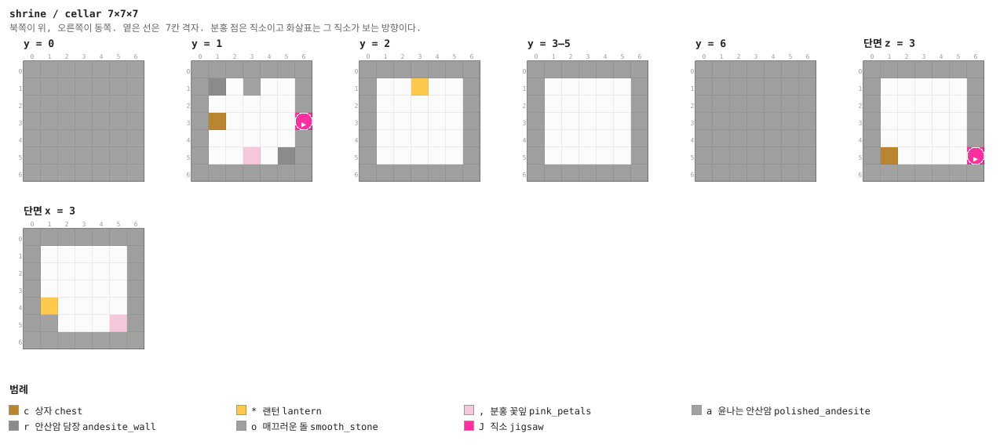

<details><summary>층별 지도 (텍스트)</summary>

```
y = 0   x →동, z ↓남
  aaaaaaa
  aaaaaaa
  aaaaaaa
  aaaaaaa
  aaaaaaa
  aaaaaaa
  aaaaaaa
y = 1   x →동, z ↓남
  ooooooo
  or.a..o
  o.....o
  oc....J
  o.....o
  o..,.ro
  ooooooo
y = 2   x →동, z ↓남
  ooooooo
  o..*..o
  o.....o
  o.....o
  o.....o
  o.....o
  ooooooo
y = 3–5   x →동, z ↓남
  ooooooo
  o.....o
  o.....o
  o.....o
  o.....o
  o.....o
  ooooooo
y = 6   x →동, z ↓남
  ooooooo
  ooooooo
  ooooooo
  ooooooo
  ooooooo
  ooooooo
  ooooooo
```

</details>


### `gate` — 7×14×7 — 1×2×1 셀

토리이가 선 길. 벚나무 기둥 둘과 그 위 상인방, 길은 그 사이로 지난다.

**어느 풀에 있나** — `paths` (가중치 7)

| 직소 위치 | 향 | name | target | pool |
|---|---|---|---|---|
| (0, 5, 3) | ◀ 서 | `shr_path` | `shr_path` | `shrine/paths` |
| (6, 5, 3) | ▶ 동 | `shr_path` | `shr_path` | `shrine/paths` |

**뚫린 면** — 서: z 0–6, y 6–13 (54칸) / 동: z 0–6, y 6–13 (54칸) / 북: x 0–6, y 6–13 (53칸) / 남: x 0–6, y 6–13 (53칸) / 위: x 0–6, z 0–6 (49칸)

**블록** — 돌 271, 윤나는 안산암 21, 껍질 벗긴 벚나무 7, 분홍 꽃잎 6, 벚나무 판자 5, 벚나무 원목 4, 직소 2, 매끄러운 돌 반 블록 2

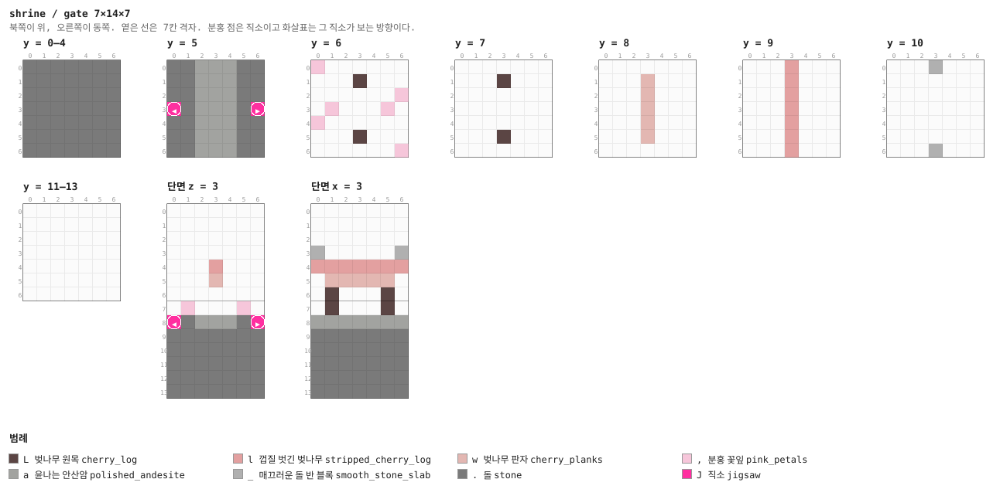

<details><summary>층별 지도 (텍스트)</summary>

```
y = 0–4   x →동, z ↓남
  .......
  .......
  .......
  .......
  .......
  .......
  .......
y = 5   x →동, z ↓남
  ..aaa..
  ..aaa..
  ..aaa..
  J.aaa.J
  ..aaa..
  ..aaa..
  ..aaa..
y = 6   x →동, z ↓남
  ,......
  ...L...
  ......,
  .,...,.
  ,......
  ...L...
  ......,
y = 7   x →동, z ↓남
  .......
  ...L...
  .......
  .......
  .......
  ...L...
  .......
y = 8   x →동, z ↓남
  .......
  ...w...
  ...w...
  ...w...
  ...w...
  ...w...
  .......
y = 9   x →동, z ↓남
  ...l...
  ...l...
  ...l...
  ...l...
  ...l...
  ...l...
  ...l...
y = 10   x →동, z ↓남
  ..._...
  .......
  .......
  .......
  .......
  .......
  ..._...
y = 11–13   x →동, z ↓남
  .......
  .......
  .......
  .......
  .......
  .......
  .......
```

</details>

<details><summary>세로 단면 (텍스트)</summary>

```
단면 z = 3   x →동, y ↑하늘
  .......
  .......
  .......
  .......
  ...l...
  ...w...
  .......
  .,...,.
  J.aaa.J
  .......
  .......
  .......
  .......
  .......
단면 x = 3   z →남, y ↑하늘
  .......
  .......
  .......
  _....._
  lllllll
  .wwwww.
  .L...L.
  .L...L.
  aaaaaaa
  .......
  .......
  .......
  .......
  .......
```

</details>


### `run` — 7×14×7 — 1×2×1 셀

길의 기본 단위. 윤나는 안산암 세 폭의 포석과 그 옆의 벚꽃잎.

**어느 풀에 있나** — `paths` (가중치 10)

| 직소 위치 | 향 | name | target | pool |
|---|---|---|---|---|
| (0, 5, 3) | ◀ 서 | `shr_path` | `shr_path` | `shrine/paths` |
| (6, 5, 3) | ▶ 동 | `shr_path` | `shr_path` | `shrine/paths` |

**뚫린 면** — 서: z 0–6, y 6–13 (54칸) / 동: z 0–6, y 6–13 (54칸) / 북: x 0–6, y 6–13 (55칸) / 남: x 0–6, y 6–13 (55칸) / 위: x 0–6, z 0–6 (49칸)

**블록** — 돌 271, 윤나는 안산암 21, 분홍 꽃잎 6, 직소 2

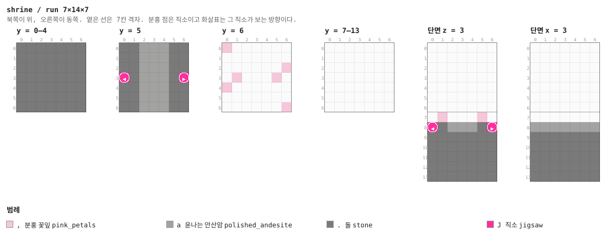

<details><summary>층별 지도 (텍스트)</summary>

```
y = 0–4   x →동, z ↓남
  .......
  .......
  .......
  .......
  .......
  .......
  .......
y = 5   x →동, z ↓남
  ..aaa..
  ..aaa..
  ..aaa..
  J.aaa.J
  ..aaa..
  ..aaa..
  ..aaa..
y = 6   x →동, z ↓남
  ,......
  .......
  ......,
  .,...,.
  ,......
  .......
  ......,
y = 7–13   x →동, z ↓남
  .......
  .......
  .......
  .......
  .......
  .......
  .......
```

</details>

<details><summary>세로 단면 (텍스트)</summary>

```
단면 z = 3   x →동, y ↑하늘
  .......
  .......
  .......
  .......
  .......
  .......
  .......
  .,...,.
  J.aaa.J
  .......
  .......
  .......
  .......
  .......
단면 x = 3   z →남, y ↑하늘
  .......
  .......
  .......
  .......
  .......
  .......
  .......
  .......
  aaaaaaa
  .......
  .......
  .......
  .......
  .......
```

</details>


### `bend` — 7×14×7 — 1×2×1 셀

꺾이는 길. 서문과 남문, 구석에 벚나무 묘목.

**어느 풀에 있나** — `paths` (가중치 8)

**뚫린 면** — 서: z 0–6, y 6–13 (55칸) / 동: z 0–6, y 6–13 (55칸) / 북: x 0–6, y 6–13 (55칸) / 남: x 0–6, y 6–13 (55칸) / 위: x 0–6, z 0–6 (49칸)

**블록** — 돌 261, 윤나는 안산암 33, 분홍 꽃잎 2, 벚나무 묘목 1

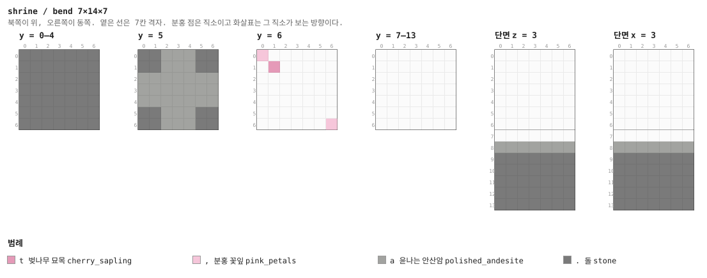

<details><summary>층별 지도 (텍스트)</summary>

```
y = 0–4   x →동, z ↓남
  .......
  .......
  .......
  .......
  .......
  .......
  .......
y = 5   x →동, z ↓남
  ..aaa..
  ..aaa..
  aaaaaaa
  aaaaaaa
  aaaaaaa
  ..aaa..
  ..aaa..
y = 6   x →동, z ↓남
  ,......
  .t.....
  .......
  .......
  .......
  .......
  ......,
y = 7–13   x →동, z ↓남
  .......
  .......
  .......
  .......
  .......
  .......
  .......
```

</details>

<details><summary>세로 단면 (텍스트)</summary>

```
단면 z = 3   x →동, y ↑하늘
  .......
  .......
  .......
  .......
  .......
  .......
  .......
  .......
  aaaaaaa
  .......
  .......
  .......
  .......
  .......
단면 x = 3   z →남, y ↑하늘
  .......
  .......
  .......
  .......
  .......
  .......
  .......
  .......
  aaaaaaa
  .......
  .......
  .......
  .......
  .......
```

</details>


### `cross` — 7×14×7 — 1×2×1 셀

네거리. 다른 던전이라면 스포너가 있을 자리인데 여기는 포석뿐이다.

**어느 풀에 있나** — `paths` (가중치 4)

**뚫린 면** — 서: z 0–6, y 6–13 (55칸) / 동: z 0–6, y 6–13 (55칸) / 북: x 0–6, y 6–13 (55칸) / 남: x 0–6, y 6–13 (55칸) / 위: x 0–6, z 0–6 (49칸)

**블록** — 돌 261, 윤나는 안산암 33, 분홍 꽃잎 2

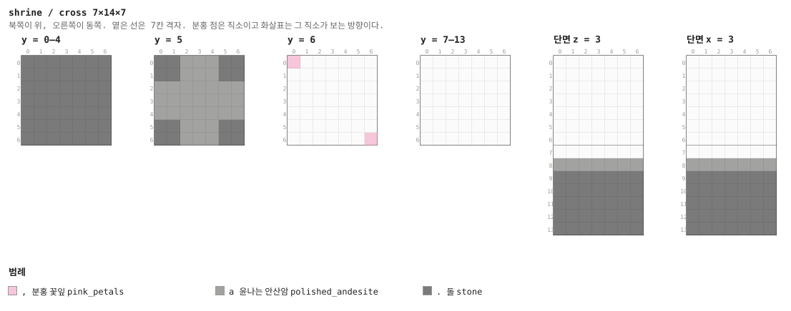

<details><summary>층별 지도 (텍스트)</summary>

```
y = 0–4   x →동, z ↓남
  .......
  .......
  .......
  .......
  .......
  .......
  .......
y = 5   x →동, z ↓남
  ..aaa..
  ..aaa..
  aaaaaaa
  aaaaaaa
  aaaaaaa
  ..aaa..
  ..aaa..
y = 6   x →동, z ↓남
  ,......
  .......
  .......
  .......
  .......
  .......
  ......,
y = 7–13   x →동, z ↓남
  .......
  .......
  .......
  .......
  .......
  .......
  .......
```

</details>

<details><summary>세로 단면 (텍스트)</summary>

```
단면 z = 3   x →동, y ↑하늘
  .......
  .......
  .......
  .......
  .......
  .......
  .......
  .......
  aaaaaaa
  .......
  .......
  .......
  .......
  .......
단면 x = 3   z →남, y ↑하늘
  .......
  .......
  .......
  .......
  .......
  .......
  .......
  .......
  aaaaaaa
  .......
  .......
  .......
  .......
  .......
```

</details>


### `rest` — 7×14×7 — 1×2×1 셀

쉼터. 반 블록 의자와 퇴비통, 그리고 상자 `chests/shrine_rest`. 침대와 음식이 여기서 나온다 —
사당이 T3 보조인 이유다.

**어느 풀에 있나** — `paths` (가중치 6)

| 직소 위치 | 향 | name | target | pool |
|---|---|---|---|---|
| (0, 5, 3) | ◀ 서 | `shr_path` | `shr_path` | `shrine/paths` |

**뚫린 면** — 서: z 0–6, y 6–13 (54칸) / 동: z 0–6, y 6–13 (54칸) / 북: x 0–6, y 6–13 (55칸) / 남: x 0–6, y 6–13 (55칸) / 위: x 0–6, z 0–6 (49칸)

**블록** — 돌 272, 윤나는 안산암 21, 매끄러운 돌 반 블록 5, 분홍 꽃잎 4, 벚나무 원목 2, 직소 1, 퇴비통 1, 상자 1

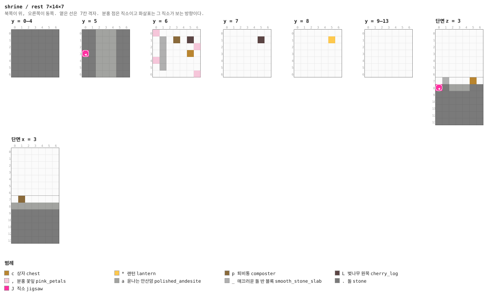

<details><summary>층별 지도 (텍스트)</summary>

```
y = 0–4   x →동, z ↓남
  .......
  .......
  .......
  .......
  .......
  .......
  .......
y = 5   x →동, z ↓남
  ..aaa..
  ..aaa..
  ..aaa..
  J.aaa..
  ..aaa..
  ..aaa..
  ..aaa..
y = 6   x →동, z ↓남
  ,......
  ._.p.L.
  ._....,
  ._...c.
  ,_.....
  ._.....
  ......,
y = 7   x →동, z ↓남
  .......
  .....L.
  .......
  .......
  .......
  .......
  .......
y = 8   x →동, z ↓남
  .......
  .....*.
  .......
  .......
  .......
  .......
  .......
y = 9–13   x →동, z ↓남
  .......
  .......
  .......
  .......
  .......
  .......
  .......
```

</details>

<details><summary>세로 단면 (텍스트)</summary>

```
단면 z = 3   x →동, y ↑하늘
  .......
  .......
  .......
  .......
  .......
  .......
  .......
  ._...c.
  J.aaa..
  .......
  .......
  .......
  .......
  .......
단면 x = 3   z →남, y ↑하늘
  .......
  .......
  .......
  .......
  .......
  .......
  .......
  .p.....
  aaaaaaa
  .......
  .......
  .......
  .......
  .......
```

</details>


### `garden` — 7×14×7 — 1×2×1 셀

벚나무 두 그루가 선 칸. 잎이 길 위로 드리운다.

**어느 풀에 있나** — `paths` (가중치 7)

| 직소 위치 | 향 | name | target | pool |
|---|---|---|---|---|
| (0, 5, 3) | ◀ 서 | `shr_path` | `shr_path` | `shrine/paths` |
| (6, 5, 3) | ▶ 동 | `shr_path` | `shr_path` | `shrine/paths` |

**뚫린 면** — 서: z 0–6, y 6–13 (53칸) / 동: z 0–6, y 6–13 (53칸) / 북: x 0–6, y 6–13 (55칸) / 남: x 0–6, y 6–13 (55칸) / 위: x 0–6, z 0–6 (49칸)

**블록** — 돌 271, 윤나는 안산암 21, 벚나무 잎 8, 분홍 꽃잎 6, 벚나무 원목 6, 직소 2, 분홍 튤립 1

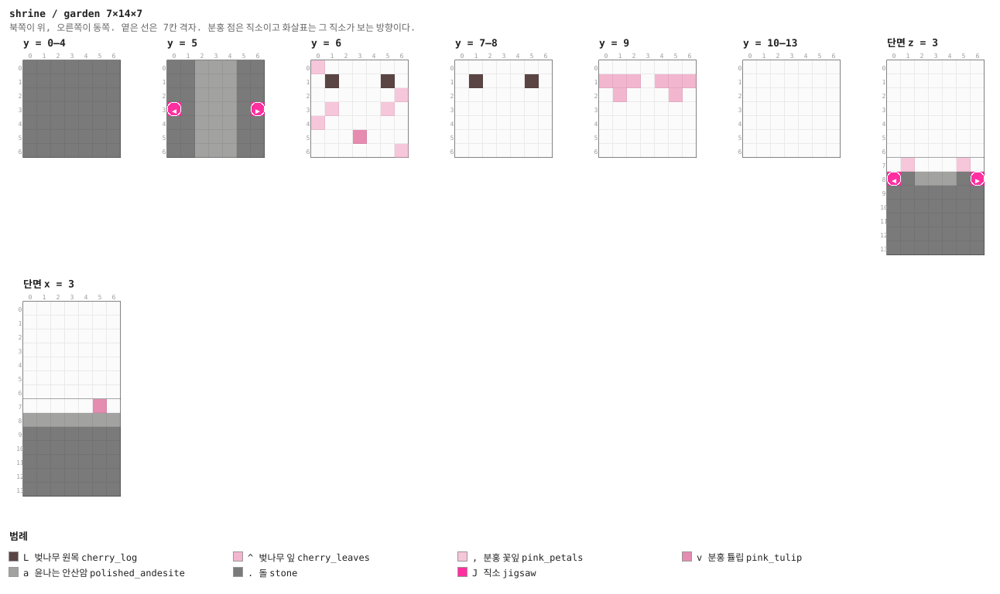

<details><summary>층별 지도 (텍스트)</summary>

```
y = 0–4   x →동, z ↓남
  .......
  .......
  .......
  .......
  .......
  .......
  .......
y = 5   x →동, z ↓남
  ..aaa..
  ..aaa..
  ..aaa..
  J.aaa.J
  ..aaa..
  ..aaa..
  ..aaa..
y = 6   x →동, z ↓남
  ,......
  .L...L.
  ......,
  .,...,.
  ,......
  ...v...
  ......,
y = 7–8   x →동, z ↓남
  .......
  .L...L.
  .......
  .......
  .......
  .......
  .......
y = 9   x →동, z ↓남
  .......
  ^^^.^^^
  .^...^.
  .......
  .......
  .......
  .......
y = 10–13   x →동, z ↓남
  .......
  .......
  .......
  .......
  .......
  .......
  .......
```

</details>

<details><summary>세로 단면 (텍스트)</summary>

```
단면 z = 3   x →동, y ↑하늘
  .......
  .......
  .......
  .......
  .......
  .......
  .......
  .,...,.
  J.aaa.J
  .......
  .......
  .......
  .......
  .......
단면 x = 3   z →남, y ↑하늘
  .......
  .......
  .......
  .......
  .......
  .......
  .......
  .....v.
  aaaaaaa
  .......
  .......
  .......
  .......
  .......
```

</details>


### `spring` — 7×14×7 — 1×2×1 셀

온천. 매끄러운 돌 바닥 가운데에 마그마 블록 하나, 그 위가 물이다. 김이 오르고, **밟으면
데인다** — 트리거가 필요 없는 위험이라는 점에서 §12를 따른다.

**어느 풀에 있나** — `paths` (가중치 5)

| 직소 위치 | 향 | name | target | pool |
|---|---|---|---|---|
| (0, 5, 3) | ◀ 서 | `shr_path` | `shr_path` | `shrine/paths` |

**뚫린 면** — 서: z 0–6, y 6–13 (54칸) / 동: z 0–6, y 6–13 (54칸) / 북: x 0–6, y 6–13 (55칸) / 남: x 0–6, y 6–13 (55칸) / 위: x 0–6, z 0–6 (49칸)

**블록** — 돌 258, 윤나는 안산암 12, 물 9, 매끄러운 돌 8, 분홍 꽃잎 5, 매끄러운 돌 반 블록 5, 안산암 담장 2, 직소 1

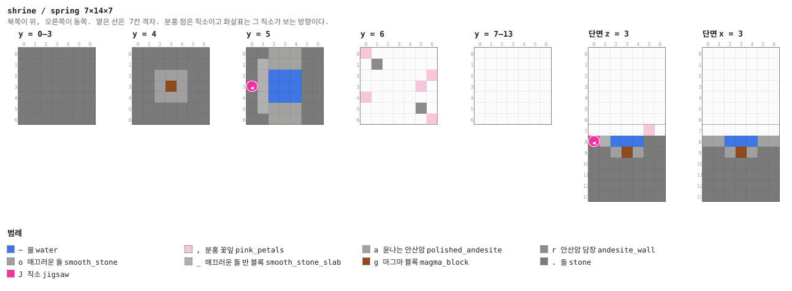

<details><summary>층별 지도 (텍스트)</summary>

```
y = 0–3   x →동, z ↓남
  .......
  .......
  .......
  .......
  .......
  .......
  .......
y = 4   x →동, z ↓남
  .......
  .......
  ..ooo..
  ..ogo..
  ..ooo..
  .......
  .......
y = 5   x →동, z ↓남
  ..aaa..
  ._aaa..
  ._~~~..
  J_~~~..
  ._~~~..
  ._aaa..
  ..aaa..
y = 6   x →동, z ↓남
  ,......
  .r.....
  ......,
  .....,.
  ,......
  .....r.
  ......,
y = 7–13   x →동, z ↓남
  .......
  .......
  .......
  .......
  .......
  .......
  .......
```

</details>

<details><summary>세로 단면 (텍스트)</summary>

```
단면 z = 3   x →동, y ↑하늘
  .......
  .......
  .......
  .......
  .......
  .......
  .......
  .....,.
  J_~~~..
  ..ogo..
  .......
  .......
  .......
  .......
단면 x = 3   z →남, y ↑하늘
  .......
  .......
  .......
  .......
  .......
  .......
  .......
  .......
  aa~~~aa
  ..ogo..
  .......
  .......
  .......
  .......
```

</details>


### `lantern` — 7×14×7 — 1×2×1 셀

길 가운데 등불 기둥. 사슬 넷이 사방으로 걸려 있다.

**어느 풀에 있나** — `paths` (가중치 5)

**뚫린 면** — 서: z 0–6, y 6–13 (55칸) / 동: z 0–6, y 6–13 (55칸) / 북: x 0–6, y 6–13 (55칸) / 남: x 0–6, y 6–13 (55칸) / 위: x 0–6, z 0–6 (49칸)

**블록** — 돌 261, 윤나는 안산암 33, 쇠사슬 4, 벚나무 원목 3, 분홍 꽃잎 2, 랜턴 1

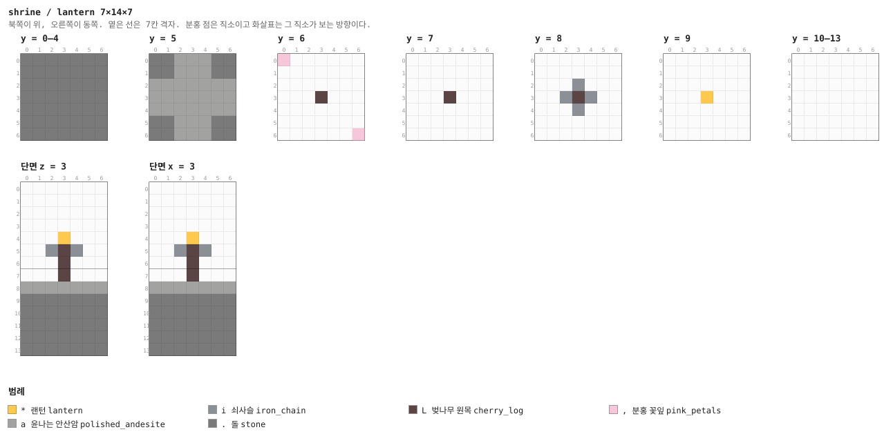

<details><summary>층별 지도 (텍스트)</summary>

```
y = 0–4   x →동, z ↓남
  .......
  .......
  .......
  .......
  .......
  .......
  .......
y = 5   x →동, z ↓남
  ..aaa..
  ..aaa..
  aaaaaaa
  aaaaaaa
  aaaaaaa
  ..aaa..
  ..aaa..
y = 6   x →동, z ↓남
  ,......
  .......
  .......
  ...L...
  .......
  .......
  ......,
y = 7   x →동, z ↓남
  .......
  .......
  .......
  ...L...
  .......
  .......
  .......
y = 8   x →동, z ↓남
  .......
  .......
  ...i...
  ..iLi..
  ...i...
  .......
  .......
y = 9   x →동, z ↓남
  .......
  .......
  .......
  ...*...
  .......
  .......
  .......
y = 10–13   x →동, z ↓남
  .......
  .......
  .......
  .......
  .......
  .......
  .......
```

</details>

<details><summary>세로 단면 (텍스트)</summary>

```
단면 z = 3   x →동, y ↑하늘
  .......
  .......
  .......
  .......
  ...*...
  ..iLi..
  ...L...
  ...L...
  aaaaaaa
  .......
  .......
  .......
  .......
  .......
단면 x = 3   z →남, y ↑하늘
  .......
  .......
  .......
  .......
  ...*...
  ..iLi..
  ...L...
  ...L...
  aaaaaaa
  .......
  .......
  .......
  .......
  .......
```

</details>


### `path_cap` — 1×14×7

두께 1의 닫힌 문. 길 풀의 fallback (§4).

**어느 풀에 있나** — `path_caps` (가중치 1)

| 직소 위치 | 향 | name | target | pool |
|---|---|---|---|---|
| (0, 5, 3) | ◀ 서 | `shr_path` | `shr_path` | `shrine/path_caps` |

**뚫린 면** — 서: z 0–6, y 7–13 (47칸) / 동: z 0–6, y 7–13 (47칸) / 북: x 0–0, y 7–13 (7칸) / 남: x 0–0, y 7–13 (7칸) / 위: x 0–0, z 0–6 (7칸)

**블록** — 돌 41, 안산암 담장 5, 벚나무 원목 4, 직소 1

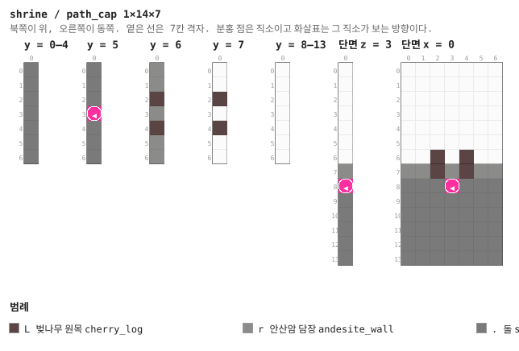

<details><summary>층별 지도 (텍스트)</summary>

```
y = 0–4   x →동, z ↓남
  .
  .
  .
  .
  .
  .
  .
y = 5   x →동, z ↓남
  .
  .
  .
  J
  .
  .
  .
y = 6   x →동, z ↓남
  r
  r
  L
  r
  L
  r
  r
y = 7   x →동, z ↓남
  .
  .
  L
  .
  L
  .
  .
y = 8–13   x →동, z ↓남
  .
  .
  .
  .
  .
  .
  .
```

</details>

<details><summary>세로 단면 (텍스트)</summary>

```
단면 z = 3   x →동, y ↑하늘
  .
  .
  .
  .
  .
  .
  .
  r
  J
  .
  .
  .
  .
  .
단면 x = 0   z →남, y ↑하늘
  .......
  .......
  .......
  .......
  .......
  .......
  ..L.L..
  rrLrLrr
  ...J...
  .......
  .......
  .......
  .......
  .......
```

</details>


## 다듬을 곳

- **길이 평지에만 어울린다.** 수평으로만 뻗으므로 경사진 벚꽃숲에서는 발밑에 돌 기초가
  드러난다. 한 칸씩 오르내리는 길 조각이 있으면 지형을 따라갈 수 있다
- **등불 순서 퍼즐이 없다.** 콘셉트의 기믹이었는데, 판정에 Java가 필요해서 빠졌다.
  대신 들어간 것이 문 없는 지하실이다
- **마당이 비어 있다.** 담과 단상과 네 모서리 등불뿐이다. 손으로 지어 되가져올 수 있는
  크기(21×21)이므로 §16이 말하는 대로 사람이 꾸미면 된다
