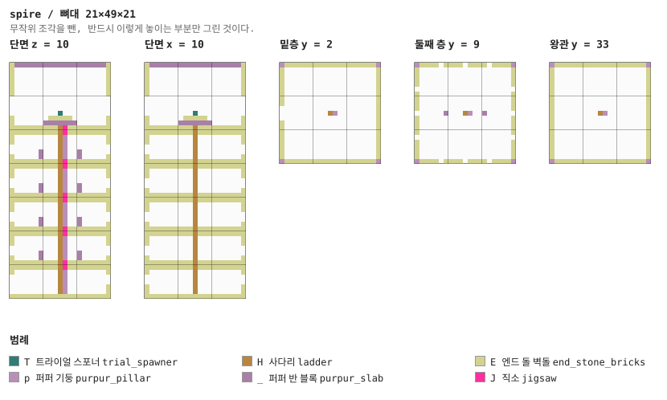
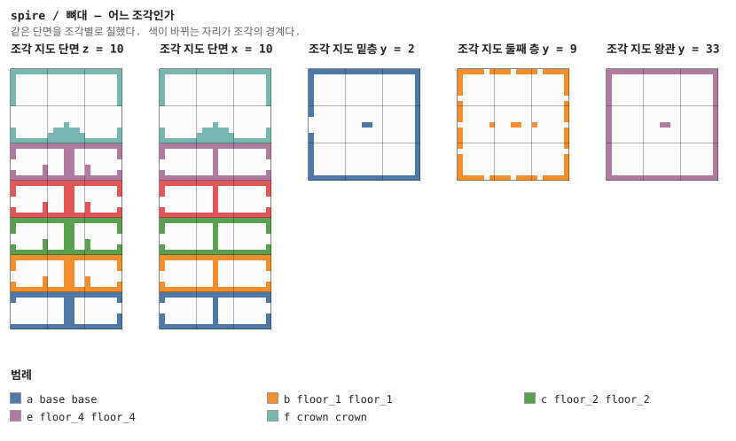
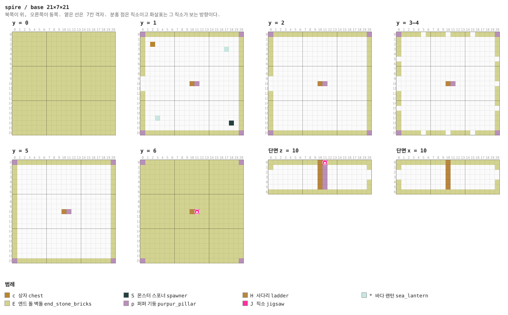
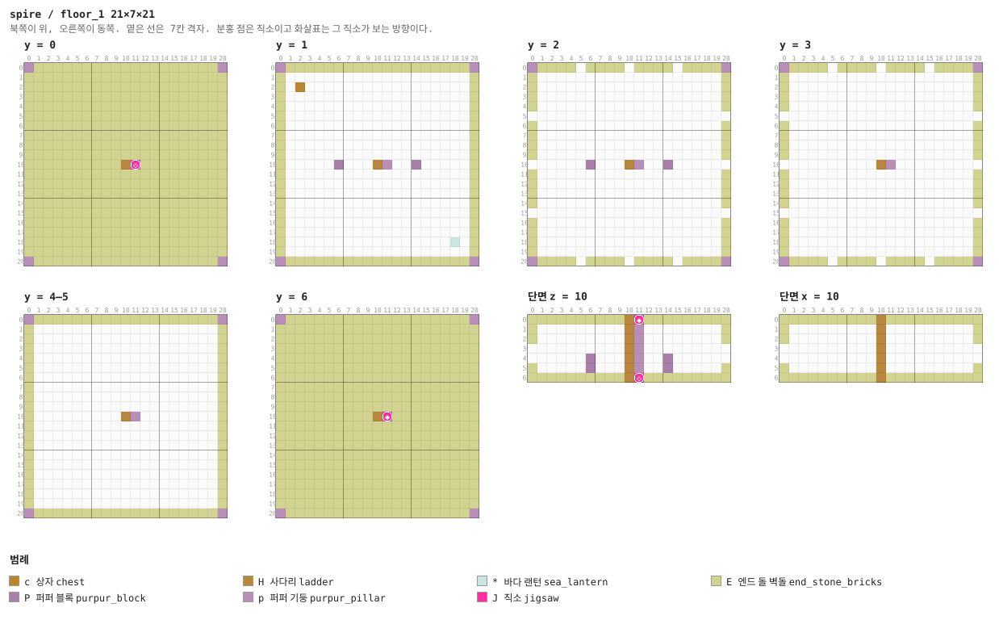
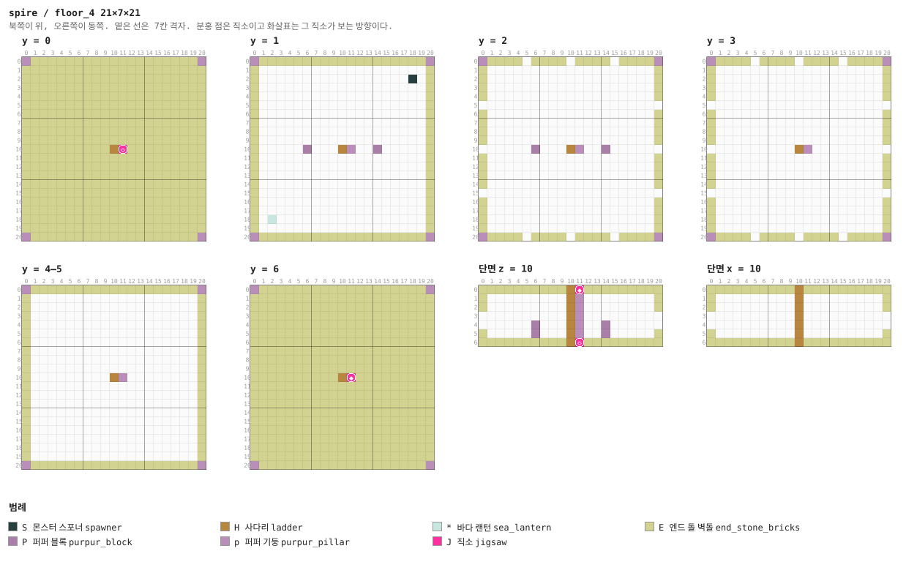
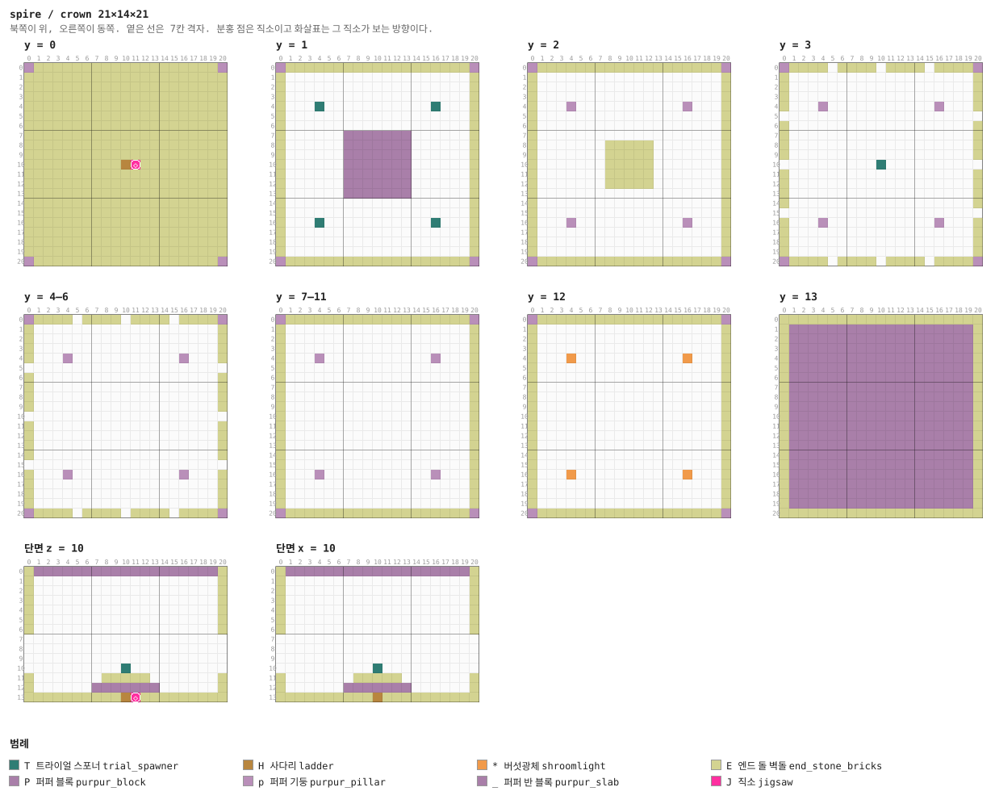

# 레벨 설계 — 공허 첨탑

> 이 문서는 `python tools/gen_level_doc.py spire`가 만든다. 조각을 고치면 다시 돌린다. 그림과 표는 게임이 읽는 파일(`structure/spire/*.nbt`, `worldgen/**`)에서 그대로 읽어 온 것이라 모드와 어긋날 수 없다. 설명 문장만 사람이 쓴다 (`tools/gen_level_doc.py`의 `INTRO`·`NOTES`).

## 1. 한눈에

엔드 고지의 탑이다. 섬 위에 선 21×21 밑층에서 **위로** 올라간다 — 이 모드에서 유일하게
올라가는 던전이다. 층 넷을 지나 꼭대기 왕관 방에 셜커 여섯과 **엘리트라**가 있다.

시그니처(확정): **엘리트라 + 셜커 껍데기 2 + 마법 부여 다이아 1.** spacing 30 / separation 10.

| 항목 | 값 |
|---|---|
| 생성 단계 | `surface_structures` |
| 바이옴 | `#sydungeon:has_structure/spire` |
| 간격 / 최소거리 | spacing 30 / separation 10 |
| 직소 깊이 | 8 ~ 16 (`sydungeon:ranged_jigsaw`) |
| 시작 풀 | `start` |
| 조각 / 풀 | 6개 / 6개 |

## 2. 조립 원리

### 올라가는 것은 내려가는 것과 같은 기둥이다

§33은 "구멍은 한 칸이고 둘레 여덟은 막혀 있다"인데, 그 규칙에 위아래가 없다. 첫탑은 같은
기둥을 반대로 읽는다 — 층마다 **위 직소**가 다음 층을 부르고, 사다리는 바닥 켜를 제 손으로
뚫는다. 층이 넷인 것은 보스 사슬과 같은 수법이다 (§7): `floor_1`이 `floor_2`를 부르고,
`floor_4`가 왕관을 부른다.

### 순서 함정, 또

왕관 방의 첫 판은 **직소를 먼저 쓰고 기둥을 나중에** 세웠다. 기둥이 같은 칸을 지나므로 직소를
지워 버렸고, 탑이 네 층에서 끝났다. §11이 피라미드에서 적어 둔 것과 같은 함정이다 — 검사기가
조립해서 올라가 보고 어느 높이에서 멈추는지 말해 준다.

### 엔드에서는 heightmap이 통한다

섬은 단단하고 위는 하늘이라 `WORLD_SURFACE_WG`가 제대로 잰다 (네더와 정반대다). 대신 섬
가장자리는 공허로 떨어지는 절벽이므로 `level_ground_drop` 12를 건다 (§34).

## 3. 풀 배선

풀이 어떤 조각을 내놓는지(실선, 숫자는 가중치)와 그 조각의 직소가 다시 어떤 풀을 부르는지(점선)다. 직소 생성은 이 그래프를 깊이만큼 따라간다.

```mermaid
flowchart LR
  P_crown(["crown"])
  P_floor_1(["floor_1"])
  P_floor_2(["floor_2"])
  P_floor_3(["floor_3"])
  P_floor_4(["floor_4"])
  P_start(["start"])
  E_base["base"]
  E_crown["crown"]
  E_floor_1["floor_1"]
  E_floor_2["floor_2"]
  E_floor_3["floor_3"]
  E_floor_4["floor_4"]
  P_crown -- 1 --> E_crown
  P_floor_1 -- 1 --> E_floor_1
  P_floor_2 -- 1 --> E_floor_2
  P_floor_3 -- 1 --> E_floor_3
  P_floor_4 -- 1 --> E_floor_4
  P_start -- 1 --> E_base
  E_base -.-> P_floor_1
  E_floor_1 -.-> P_floor_2
  E_floor_2 -.-> P_floor_3
  E_floor_3 -.-> P_floor_4
  E_floor_4 -.-> P_crown
  P_start:::start
  classDef start fill:#ffe9a8,stroke:#c99a00,stroke-width:2px
```



| 풀 | fallback | 원소 (가중치) |
|---|---|---|
| `crown` | `minecraft:empty` | `crown` 1 |
| `floor_1` | `minecraft:empty` | `floor_1` 1 |
| `floor_2` | `minecraft:empty` | `floor_2` 1 |
| `floor_3` | `minecraft:empty` | `floor_3` 1 |
| `floor_4` | `minecraft:empty` | `floor_4` 1 |
| `start` | `minecraft:empty` | `base` 1 |

## 4. 뼈대 — 반드시 이렇게 놓이는 부분

밑층, 층 넷, 왕관. 전부 단일 원소 풀이라 첫탑은 언제나 같은 높이다.

| 조각 | 놓이는 자리 (시작 조각 기준) | 누가 놓나 |
|---|---|---|
| `base` | (0, 0, 0) | 시작 풀 |
| `floor_1` | (0, 7, 0) | base의 위 spr_up 직소 |
| `floor_2` | (0, 14, 0) | floor_1의 위 spr_up 직소 |
| `floor_3` | (0, 21, 0) | floor_2의 위 spr_up 직소 |
| `floor_4` | (0, 28, 0) | floor_3의 위 spr_up 직소 |
| `crown` | (0, 35, 0) | floor_4의 위 spr_up 직소 |





## 5. 조각


그림은 조각 하나를 **층마다 한 장씩** 블록 단위로 그린 것이다. 같은 층이 이어지면 `y = 2–5`처럼 묶었고, 마지막 두 장은 가운데를 자른 세로 단면이다. 분홍 점이 직소, 화살표가 그 직소가 보는 방향이다 — **마주 본 직소끼리만 붙는다.**

### `base` — 21×7×21 — 3×1×3 셀

시작 조각. 섬 위에 서고 바닥 켜가 곧 섬의 맨 윗 블록이다 (§30). 서쪽에 문, 가운데에
올라가는 기둥.

**어느 풀에 있나** — `start` (가중치 1)

| 직소 위치 | 향 | name | target | pool |
|---|---|---|---|---|
| (11, 6, 10) | ◆ 위 | `spr_up` | `spr_up` | `spire/floor_1` |

**뚫린 면** — 서: z 5–15, y 1–4 (16칸) / 동: z 5–15, y 3–4 (6칸) / 북: x 5–15, y 3–4 (6칸) / 남: x 5–15, y 3–4 (6칸)

**블록** — 엔드 돌 벽돌 1222, 퍼퍼 기둥 29, 사다리 6, 바다 랜턴 2, 상자 1, 직소 1, 몬스터 스포너 1



<details><summary>층별 지도 (텍스트)</summary>

```
y = 0   x →동, z ↓남
  EEEEEEEEEEEEEEEEEEEEE
  EEEEEEEEEEEEEEEEEEEEE
  EEEEEEEEEEEEEEEEEEEEE
  EEEEEEEEEEEEEEEEEEEEE
  EEEEEEEEEEEEEEEEEEEEE
  EEEEEEEEEEEEEEEEEEEEE
  EEEEEEEEEEEEEEEEEEEEE
  EEEEEEEEEEEEEEEEEEEEE
  EEEEEEEEEEEEEEEEEEEEE
  EEEEEEEEEEEEEEEEEEEEE
  EEEEEEEEEEEEEEEEEEEEE
  EEEEEEEEEEEEEEEEEEEEE
  EEEEEEEEEEEEEEEEEEEEE
  EEEEEEEEEEEEEEEEEEEEE
  EEEEEEEEEEEEEEEEEEEEE
  EEEEEEEEEEEEEEEEEEEEE
  EEEEEEEEEEEEEEEEEEEEE
  EEEEEEEEEEEEEEEEEEEEE
  EEEEEEEEEEEEEEEEEEEEE
  EEEEEEEEEEEEEEEEEEEEE
  EEEEEEEEEEEEEEEEEEEEE
y = 1   x →동, z ↓남
  pEEEEEEEEEEEEEEEEEEEp
  E...................E
  E.c.................E
  E................*..E
  E...................E
  E...................E
  E...................E
  E...................E
  E...................E
  ....................E
  ..........Hp........E
  ....................E
  E...................E
  E...................E
  E...................E
  E...................E
  E...................E
  E..*................E
  E.................S.E
  E...................E
  pEEEEEEEEEEEEEEEEEEEp
y = 2   x →동, z ↓남
  pEEEEEEEEEEEEEEEEEEEp
  E...................E
  E...................E
  E...................E
  E...................E
  E...................E
  E...................E
  E...................E
  E...................E
  ....................E
  ..........Hp........E
  ....................E
  E...................E
  E...................E
  E...................E
  E...................E
  E...................E
  E...................E
  E...................E
  E...................E
  pEEEEEEEEEEEEEEEEEEEp
y = 3–4   x →동, z ↓남
  pEEEE.EEEE.EEEE.EEEEp
  E...................E
  E...................E
  E...................E
  E...................E
  .....................
  E...................E
  E...................E
  E...................E
  ....................E
  ..........Hp.........
  ....................E
  E...................E
  E...................E
  E...................E
  .....................
  E...................E
  E...................E
  E...................E
  E...................E
  pEEEE.EEEE.EEEE.EEEEp
y = 5   x →동, z ↓남
  pEEEEEEEEEEEEEEEEEEEp
  E...................E
  E...................E
  E...................E
  E...................E
  E...................E
  E...................E
  E...................E
  E...................E
  E...................E
  E.........Hp........E
  E...................E
  E...................E
  E...................E
  E...................E
  E...................E
  E...................E
  E...................E
  E...................E
  E...................E
  pEEEEEEEEEEEEEEEEEEEp
y = 6   x →동, z ↓남
  pEEEEEEEEEEEEEEEEEEEp
  EEEEEEEEEEEEEEEEEEEEE
  EEEEEEEEEEEEEEEEEEEEE
  EEEEEEEEEEEEEEEEEEEEE
  EEEEEEEEEEEEEEEEEEEEE
  EEEEEEEEEEEEEEEEEEEEE
  EEEEEEEEEEEEEEEEEEEEE
  EEEEEEEEEEEEEEEEEEEEE
  EEEEEEEEEEEEEEEEEEEEE
  EEEEEEEEEEEEEEEEEEEEE
  EEEEEEEEEEHJEEEEEEEEE
  EEEEEEEEEEEEEEEEEEEEE
  EEEEEEEEEEEEEEEEEEEEE
  EEEEEEEEEEEEEEEEEEEEE
  EEEEEEEEEEEEEEEEEEEEE
  EEEEEEEEEEEEEEEEEEEEE
  EEEEEEEEEEEEEEEEEEEEE
  EEEEEEEEEEEEEEEEEEEEE
  EEEEEEEEEEEEEEEEEEEEE
  EEEEEEEEEEEEEEEEEEEEE
  pEEEEEEEEEEEEEEEEEEEp
```

</details>


### `floor_1` — 21×7×21 — 3×1×3 셀

1층. 가운데 사다리 기둥이 바닥을 뚫고 지나가고, 상자 하나.

**어느 풀에 있나** — `floor_1` (가중치 1)

| 직소 위치 | 향 | name | target | pool |
|---|---|---|---|---|
| (11, 0, 10) | ◇ 아래 | `spr_up` | `spr_up` | `—` |
| (11, 6, 10) | ◆ 위 | `spr_up` | `spr_up` | `spire/floor_2` |

**뚫린 면** — 서: z 5–15, y 2–3 (6칸) / 동: z 5–15, y 2–3 (6칸) / 북: x 5–15, y 2–3 (6칸) / 남: x 5–15, y 2–3 (6칸)

**블록** — 엔드 돌 벽돌 1226, 퍼퍼 기둥 33, 사다리 7, 퍼퍼 블록 4, 직소 2, 상자 1, 바다 랜턴 1



<details><summary>층별 지도 (텍스트)</summary>

```
y = 0   x →동, z ↓남
  pEEEEEEEEEEEEEEEEEEEp
  EEEEEEEEEEEEEEEEEEEEE
  EEEEEEEEEEEEEEEEEEEEE
  EEEEEEEEEEEEEEEEEEEEE
  EEEEEEEEEEEEEEEEEEEEE
  EEEEEEEEEEEEEEEEEEEEE
  EEEEEEEEEEEEEEEEEEEEE
  EEEEEEEEEEEEEEEEEEEEE
  EEEEEEEEEEEEEEEEEEEEE
  EEEEEEEEEEEEEEEEEEEEE
  EEEEEEEEEEHJEEEEEEEEE
  EEEEEEEEEEEEEEEEEEEEE
  EEEEEEEEEEEEEEEEEEEEE
  EEEEEEEEEEEEEEEEEEEEE
  EEEEEEEEEEEEEEEEEEEEE
  EEEEEEEEEEEEEEEEEEEEE
  EEEEEEEEEEEEEEEEEEEEE
  EEEEEEEEEEEEEEEEEEEEE
  EEEEEEEEEEEEEEEEEEEEE
  EEEEEEEEEEEEEEEEEEEEE
  pEEEEEEEEEEEEEEEEEEEp
y = 1   x →동, z ↓남
  pEEEEEEEEEEEEEEEEEEEp
  E...................E
  E.c.................E
  E...................E
  E...................E
  E...................E
  E...................E
  E...................E
  E...................E
  E...................E
  E.....P...Hp..P.....E
  E...................E
  E...................E
  E...................E
  E...................E
  E...................E
  E...................E
  E...................E
  E.................*.E
  E...................E
  pEEEEEEEEEEEEEEEEEEEp
y = 2   x →동, z ↓남
  pEEEE.EEEE.EEEE.EEEEp
  E...................E
  E...................E
  E...................E
  E...................E
  .....................
  E...................E
  E...................E
  E...................E
  E...................E
  ......P...Hp..P......
  E...................E
  E...................E
  E...................E
  E...................E
  .....................
  E...................E
  E...................E
  E...................E
  E...................E
  pEEEE.EEEE.EEEE.EEEEp
y = 3   x →동, z ↓남
  pEEEE.EEEE.EEEE.EEEEp
  E...................E
  E...................E
  E...................E
  E...................E
  .....................
  E...................E
  E...................E
  E...................E
  E...................E
  ..........Hp.........
  E...................E
  E...................E
  E...................E
  E...................E
  .....................
  E...................E
  E...................E
  E...................E
  E...................E
  pEEEE.EEEE.EEEE.EEEEp
y = 4–5   x →동, z ↓남
  pEEEEEEEEEEEEEEEEEEEp
  E...................E
  E...................E
  E...................E
  E...................E
  E...................E
  E...................E
  E...................E
  E...................E
  E...................E
  E.........Hp........E
  E...................E
  E...................E
  E...................E
  E...................E
  E...................E
  E...................E
  E...................E
  E...................E
  E...................E
  pEEEEEEEEEEEEEEEEEEEp
y = 6   x →동, z ↓남
  pEEEEEEEEEEEEEEEEEEEp
  EEEEEEEEEEEEEEEEEEEEE
  EEEEEEEEEEEEEEEEEEEEE
  EEEEEEEEEEEEEEEEEEEEE
  EEEEEEEEEEEEEEEEEEEEE
  EEEEEEEEEEEEEEEEEEEEE
  EEEEEEEEEEEEEEEEEEEEE
  EEEEEEEEEEEEEEEEEEEEE
  EEEEEEEEEEEEEEEEEEEEE
  EEEEEEEEEEEEEEEEEEEEE
  EEEEEEEEEEHJEEEEEEEEE
  EEEEEEEEEEEEEEEEEEEEE
  EEEEEEEEEEEEEEEEEEEEE
  EEEEEEEEEEEEEEEEEEEEE
  EEEEEEEEEEEEEEEEEEEEE
  EEEEEEEEEEEEEEEEEEEEE
  EEEEEEEEEEEEEEEEEEEEE
  EEEEEEEEEEEEEEEEEEEEE
  EEEEEEEEEEEEEEEEEEEEE
  EEEEEEEEEEEEEEEEEEEEE
  pEEEEEEEEEEEEEEEEEEEp
```

</details>


### `floor_2` — 21×7×21 — 3×1×3 셀

2층. 가운데 사다리 기둥이 바닥을 뚫고 지나가고, 셜커 스포너 하나.

**어느 풀에 있나** — `floor_2` (가중치 1)

| 직소 위치 | 향 | name | target | pool |
|---|---|---|---|---|
| (11, 0, 10) | ◇ 아래 | `spr_up` | `spr_up` | `—` |
| (11, 6, 10) | ◆ 위 | `spr_up` | `spr_up` | `spire/floor_3` |

**뚫린 면** — 서: z 5–15, y 2–3 (6칸) / 동: z 5–15, y 2–3 (6칸) / 북: x 5–15, y 2–3 (6칸) / 남: x 5–15, y 2–3 (6칸)

**블록** — 엔드 돌 벽돌 1226, 퍼퍼 기둥 33, 사다리 7, 퍼퍼 블록 4, 직소 2, 바다 랜턴 1, 몬스터 스포너 1


<details><summary>층별 지도 (텍스트)</summary>

```
y = 0   x →동, z ↓남
  pEEEEEEEEEEEEEEEEEEEp
  EEEEEEEEEEEEEEEEEEEEE
  EEEEEEEEEEEEEEEEEEEEE
  EEEEEEEEEEEEEEEEEEEEE
  EEEEEEEEEEEEEEEEEEEEE
  EEEEEEEEEEEEEEEEEEEEE
  EEEEEEEEEEEEEEEEEEEEE
  EEEEEEEEEEEEEEEEEEEEE
  EEEEEEEEEEEEEEEEEEEEE
  EEEEEEEEEEEEEEEEEEEEE
  EEEEEEEEEEHJEEEEEEEEE
  EEEEEEEEEEEEEEEEEEEEE
  EEEEEEEEEEEEEEEEEEEEE
  EEEEEEEEEEEEEEEEEEEEE
  EEEEEEEEEEEEEEEEEEEEE
  EEEEEEEEEEEEEEEEEEEEE
  EEEEEEEEEEEEEEEEEEEEE
  EEEEEEEEEEEEEEEEEEEEE
  EEEEEEEEEEEEEEEEEEEEE
  EEEEEEEEEEEEEEEEEEEEE
  pEEEEEEEEEEEEEEEEEEEp
y = 1   x →동, z ↓남
  pEEEEEEEEEEEEEEEEEEEp
  E...................E
  E.................S.E
  E...................E
  E...................E
  E...................E
  E...................E
  E...................E
  E...................E
  E...................E
  E.....P...Hp..P.....E
  E...................E
  E...................E
  E...................E
  E...................E
  E...................E
  E...................E
  E...................E
  E.*.................E
  E...................E
  pEEEEEEEEEEEEEEEEEEEp
y = 2   x →동, z ↓남
  pEEEE.EEEE.EEEE.EEEEp
  E...................E
  E...................E
  E...................E
  E...................E
  .....................
  E...................E
  E...................E
  E...................E
  E...................E
  ......P...Hp..P......
  E...................E
  E...................E
  E...................E
  E...................E
  .....................
  E...................E
  E...................E
  E...................E
  E...................E
  pEEEE.EEEE.EEEE.EEEEp
y = 3   x →동, z ↓남
  pEEEE.EEEE.EEEE.EEEEp
  E...................E
  E...................E
  E...................E
  E...................E
  .....................
  E...................E
  E...................E
  E...................E
  E...................E
  ..........Hp.........
  E...................E
  E...................E
  E...................E
  E...................E
  .....................
  E...................E
  E...................E
  E...................E
  E...................E
  pEEEE.EEEE.EEEE.EEEEp
y = 4–5   x →동, z ↓남
  pEEEEEEEEEEEEEEEEEEEp
  E...................E
  E...................E
  E...................E
  E...................E
  E...................E
  E...................E
  E...................E
  E...................E
  E...................E
  E.........Hp........E
  E...................E
  E...................E
  E...................E
  E...................E
  E...................E
  E...................E
  E...................E
  E...................E
  E...................E
  pEEEEEEEEEEEEEEEEEEEp
y = 6   x →동, z ↓남
  pEEEEEEEEEEEEEEEEEEEp
  EEEEEEEEEEEEEEEEEEEEE
  EEEEEEEEEEEEEEEEEEEEE
  EEEEEEEEEEEEEEEEEEEEE
  EEEEEEEEEEEEEEEEEEEEE
  EEEEEEEEEEEEEEEEEEEEE
  EEEEEEEEEEEEEEEEEEEEE
  EEEEEEEEEEEEEEEEEEEEE
  EEEEEEEEEEEEEEEEEEEEE
  EEEEEEEEEEEEEEEEEEEEE
  EEEEEEEEEEHJEEEEEEEEE
  EEEEEEEEEEEEEEEEEEEEE
  EEEEEEEEEEEEEEEEEEEEE
  EEEEEEEEEEEEEEEEEEEEE
  EEEEEEEEEEEEEEEEEEEEE
  EEEEEEEEEEEEEEEEEEEEE
  EEEEEEEEEEEEEEEEEEEEE
  EEEEEEEEEEEEEEEEEEEEE
  EEEEEEEEEEEEEEEEEEEEE
  EEEEEEEEEEEEEEEEEEEEE
  pEEEEEEEEEEEEEEEEEEEp
```

</details>


### `floor_3` — 21×7×21 — 3×1×3 셀

3층. 가운데 사다리 기둥이 바닥을 뚫고 지나가고, 상자 하나.

**어느 풀에 있나** — `floor_3` (가중치 1)

| 직소 위치 | 향 | name | target | pool |
|---|---|---|---|---|
| (11, 0, 10) | ◇ 아래 | `spr_up` | `spr_up` | `—` |
| (11, 6, 10) | ◆ 위 | `spr_up` | `spr_up` | `spire/floor_4` |

**뚫린 면** — 서: z 5–15, y 2–3 (6칸) / 동: z 5–15, y 2–3 (6칸) / 북: x 5–15, y 2–3 (6칸) / 남: x 5–15, y 2–3 (6칸)

**블록** — 엔드 돌 벽돌 1226, 퍼퍼 기둥 33, 사다리 7, 퍼퍼 블록 4, 직소 2, 상자 1, 바다 랜턴 1


<details><summary>층별 지도 (텍스트)</summary>

```
y = 0   x →동, z ↓남
  pEEEEEEEEEEEEEEEEEEEp
  EEEEEEEEEEEEEEEEEEEEE
  EEEEEEEEEEEEEEEEEEEEE
  EEEEEEEEEEEEEEEEEEEEE
  EEEEEEEEEEEEEEEEEEEEE
  EEEEEEEEEEEEEEEEEEEEE
  EEEEEEEEEEEEEEEEEEEEE
  EEEEEEEEEEEEEEEEEEEEE
  EEEEEEEEEEEEEEEEEEEEE
  EEEEEEEEEEEEEEEEEEEEE
  EEEEEEEEEEHJEEEEEEEEE
  EEEEEEEEEEEEEEEEEEEEE
  EEEEEEEEEEEEEEEEEEEEE
  EEEEEEEEEEEEEEEEEEEEE
  EEEEEEEEEEEEEEEEEEEEE
  EEEEEEEEEEEEEEEEEEEEE
  EEEEEEEEEEEEEEEEEEEEE
  EEEEEEEEEEEEEEEEEEEEE
  EEEEEEEEEEEEEEEEEEEEE
  EEEEEEEEEEEEEEEEEEEEE
  pEEEEEEEEEEEEEEEEEEEp
y = 1   x →동, z ↓남
  pEEEEEEEEEEEEEEEEEEEp
  E...................E
  E.c.................E
  E...................E
  E...................E
  E...................E
  E...................E
  E...................E
  E...................E
  E...................E
  E.....P...Hp..P.....E
  E...................E
  E...................E
  E...................E
  E...................E
  E...................E
  E...................E
  E...................E
  E.................*.E
  E...................E
  pEEEEEEEEEEEEEEEEEEEp
y = 2   x →동, z ↓남
  pEEEE.EEEE.EEEE.EEEEp
  E...................E
  E...................E
  E...................E
  E...................E
  .....................
  E...................E
  E...................E
  E...................E
  E...................E
  ......P...Hp..P......
  E...................E
  E...................E
  E...................E
  E...................E
  .....................
  E...................E
  E...................E
  E...................E
  E...................E
  pEEEE.EEEE.EEEE.EEEEp
y = 3   x →동, z ↓남
  pEEEE.EEEE.EEEE.EEEEp
  E...................E
  E...................E
  E...................E
  E...................E
  .....................
  E...................E
  E...................E
  E...................E
  E...................E
  ..........Hp.........
  E...................E
  E...................E
  E...................E
  E...................E
  .....................
  E...................E
  E...................E
  E...................E
  E...................E
  pEEEE.EEEE.EEEE.EEEEp
y = 4–5   x →동, z ↓남
  pEEEEEEEEEEEEEEEEEEEp
  E...................E
  E...................E
  E...................E
  E...................E
  E...................E
  E...................E
  E...................E
  E...................E
  E...................E
  E.........Hp........E
  E...................E
  E...................E
  E...................E
  E...................E
  E...................E
  E...................E
  E...................E
  E...................E
  E...................E
  pEEEEEEEEEEEEEEEEEEEp
y = 6   x →동, z ↓남
  pEEEEEEEEEEEEEEEEEEEp
  EEEEEEEEEEEEEEEEEEEEE
  EEEEEEEEEEEEEEEEEEEEE
  EEEEEEEEEEEEEEEEEEEEE
  EEEEEEEEEEEEEEEEEEEEE
  EEEEEEEEEEEEEEEEEEEEE
  EEEEEEEEEEEEEEEEEEEEE
  EEEEEEEEEEEEEEEEEEEEE
  EEEEEEEEEEEEEEEEEEEEE
  EEEEEEEEEEEEEEEEEEEEE
  EEEEEEEEEEHJEEEEEEEEE
  EEEEEEEEEEEEEEEEEEEEE
  EEEEEEEEEEEEEEEEEEEEE
  EEEEEEEEEEEEEEEEEEEEE
  EEEEEEEEEEEEEEEEEEEEE
  EEEEEEEEEEEEEEEEEEEEE
  EEEEEEEEEEEEEEEEEEEEE
  EEEEEEEEEEEEEEEEEEEEE
  EEEEEEEEEEEEEEEEEEEEE
  EEEEEEEEEEEEEEEEEEEEE
  pEEEEEEEEEEEEEEEEEEEp
```

</details>


### `floor_4` — 21×7×21 — 3×1×3 셀

4층. 가운데 사다리 기둥이 바닥을 뚫고 지나가고, 셜커 스포너 하나.

**어느 풀에 있나** — `floor_4` (가중치 1)

| 직소 위치 | 향 | name | target | pool |
|---|---|---|---|---|
| (11, 0, 10) | ◇ 아래 | `spr_up` | `spr_up` | `—` |
| (11, 6, 10) | ◆ 위 | `spr_up` | `spr_up` | `spire/crown` |

**뚫린 면** — 서: z 5–15, y 2–3 (6칸) / 동: z 5–15, y 2–3 (6칸) / 북: x 5–15, y 2–3 (6칸) / 남: x 5–15, y 2–3 (6칸)

**블록** — 엔드 돌 벽돌 1226, 퍼퍼 기둥 33, 사다리 7, 퍼퍼 블록 4, 직소 2, 바다 랜턴 1, 몬스터 스포너 1



<details><summary>층별 지도 (텍스트)</summary>

```
y = 0   x →동, z ↓남
  pEEEEEEEEEEEEEEEEEEEp
  EEEEEEEEEEEEEEEEEEEEE
  EEEEEEEEEEEEEEEEEEEEE
  EEEEEEEEEEEEEEEEEEEEE
  EEEEEEEEEEEEEEEEEEEEE
  EEEEEEEEEEEEEEEEEEEEE
  EEEEEEEEEEEEEEEEEEEEE
  EEEEEEEEEEEEEEEEEEEEE
  EEEEEEEEEEEEEEEEEEEEE
  EEEEEEEEEEEEEEEEEEEEE
  EEEEEEEEEEHJEEEEEEEEE
  EEEEEEEEEEEEEEEEEEEEE
  EEEEEEEEEEEEEEEEEEEEE
  EEEEEEEEEEEEEEEEEEEEE
  EEEEEEEEEEEEEEEEEEEEE
  EEEEEEEEEEEEEEEEEEEEE
  EEEEEEEEEEEEEEEEEEEEE
  EEEEEEEEEEEEEEEEEEEEE
  EEEEEEEEEEEEEEEEEEEEE
  EEEEEEEEEEEEEEEEEEEEE
  pEEEEEEEEEEEEEEEEEEEp
y = 1   x →동, z ↓남
  pEEEEEEEEEEEEEEEEEEEp
  E...................E
  E.................S.E
  E...................E
  E...................E
  E...................E
  E...................E
  E...................E
  E...................E
  E...................E
  E.....P...Hp..P.....E
  E...................E
  E...................E
  E...................E
  E...................E
  E...................E
  E...................E
  E...................E
  E.*.................E
  E...................E
  pEEEEEEEEEEEEEEEEEEEp
y = 2   x →동, z ↓남
  pEEEE.EEEE.EEEE.EEEEp
  E...................E
  E...................E
  E...................E
  E...................E
  .....................
  E...................E
  E...................E
  E...................E
  E...................E
  ......P...Hp..P......
  E...................E
  E...................E
  E...................E
  E...................E
  .....................
  E...................E
  E...................E
  E...................E
  E...................E
  pEEEE.EEEE.EEEE.EEEEp
y = 3   x →동, z ↓남
  pEEEE.EEEE.EEEE.EEEEp
  E...................E
  E...................E
  E...................E
  E...................E
  .....................
  E...................E
  E...................E
  E...................E
  E...................E
  ..........Hp.........
  E...................E
  E...................E
  E...................E
  E...................E
  .....................
  E...................E
  E...................E
  E...................E
  E...................E
  pEEEE.EEEE.EEEE.EEEEp
y = 4–5   x →동, z ↓남
  pEEEEEEEEEEEEEEEEEEEp
  E...................E
  E...................E
  E...................E
  E...................E
  E...................E
  E...................E
  E...................E
  E...................E
  E...................E
  E.........Hp........E
  E...................E
  E...................E
  E...................E
  E...................E
  E...................E
  E...................E
  E...................E
  E...................E
  E...................E
  pEEEEEEEEEEEEEEEEEEEp
y = 6   x →동, z ↓남
  pEEEEEEEEEEEEEEEEEEEp
  EEEEEEEEEEEEEEEEEEEEE
  EEEEEEEEEEEEEEEEEEEEE
  EEEEEEEEEEEEEEEEEEEEE
  EEEEEEEEEEEEEEEEEEEEE
  EEEEEEEEEEEEEEEEEEEEE
  EEEEEEEEEEEEEEEEEEEEE
  EEEEEEEEEEEEEEEEEEEEE
  EEEEEEEEEEEEEEEEEEEEE
  EEEEEEEEEEEEEEEEEEEEE
  EEEEEEEEEEHJEEEEEEEEE
  EEEEEEEEEEEEEEEEEEEEE
  EEEEEEEEEEEEEEEEEEEEE
  EEEEEEEEEEEEEEEEEEEEE
  EEEEEEEEEEEEEEEEEEEEE
  EEEEEEEEEEEEEEEEEEEEE
  EEEEEEEEEEEEEEEEEEEEE
  EEEEEEEEEEEEEEEEEEEEE
  EEEEEEEEEEEEEEEEEEEEE
  EEEEEEEEEEEEEEEEEEEEE
  pEEEEEEEEEEEEEEEEEEEp
```

</details>


### `crown` — 21×14×21 — 3×2×3 셀

왕관 방. 21×14×21. 단상에 **첨탑의 심장**(체력 50 셜커) 트라이얼 스포너, 네 기둥 발치에
경비 스포너 넷. 이기면 **엘리트라**가 나온다.

**어느 풀에 있나** — `crown` (가중치 1)

| 직소 위치 | 향 | name | target | pool |
|---|---|---|---|---|
| (11, 0, 10) | ◇ 아래 | `spr_up` | `spr_up` | `—` |

**뚫린 면** — 서: z 5–15, y 3–6 (12칸) / 동: z 5–15, y 3–6 (12칸) / 북: x 5–15, y 3–6 (12칸) / 남: x 5–15, y 3–6 (12칸)

**블록** — 엔드 돌 벽돌 1404, 퍼퍼 반 블록 361, 퍼퍼 기둥 92, 퍼퍼 블록 49, 트라이얼 스포너 5, 버섯광체 4, 사다리 1, 직소 1



<details><summary>층별 지도 (텍스트)</summary>

```
y = 0   x →동, z ↓남
  pEEEEEEEEEEEEEEEEEEEp
  EEEEEEEEEEEEEEEEEEEEE
  EEEEEEEEEEEEEEEEEEEEE
  EEEEEEEEEEEEEEEEEEEEE
  EEEEEEEEEEEEEEEEEEEEE
  EEEEEEEEEEEEEEEEEEEEE
  EEEEEEEEEEEEEEEEEEEEE
  EEEEEEEEEEEEEEEEEEEEE
  EEEEEEEEEEEEEEEEEEEEE
  EEEEEEEEEEEEEEEEEEEEE
  EEEEEEEEEEHJEEEEEEEEE
  EEEEEEEEEEEEEEEEEEEEE
  EEEEEEEEEEEEEEEEEEEEE
  EEEEEEEEEEEEEEEEEEEEE
  EEEEEEEEEEEEEEEEEEEEE
  EEEEEEEEEEEEEEEEEEEEE
  EEEEEEEEEEEEEEEEEEEEE
  EEEEEEEEEEEEEEEEEEEEE
  EEEEEEEEEEEEEEEEEEEEE
  EEEEEEEEEEEEEEEEEEEEE
  pEEEEEEEEEEEEEEEEEEEp
y = 1   x →동, z ↓남
  pEEEEEEEEEEEEEEEEEEEp
  E...................E
  E...................E
  E...................E
  E...T...........T...E
  E...................E
  E...................E
  E......PPPPPPP......E
  E......PPPPPPP......E
  E......PPPPPPP......E
  E......PPPPPPP......E
  E......PPPPPPP......E
  E......PPPPPPP......E
  E......PPPPPPP......E
  E...................E
  E...................E
  E...T...........T...E
  E...................E
  E...................E
  E...................E
  pEEEEEEEEEEEEEEEEEEEp
y = 2   x →동, z ↓남
  pEEEEEEEEEEEEEEEEEEEp
  E...................E
  E...................E
  E...................E
  E...p...........p...E
  E...................E
  E...................E
  E...................E
  E.......EEEEE.......E
  E.......EEEEE.......E
  E.......EEEEE.......E
  E.......EEEEE.......E
  E.......EEEEE.......E
  E...................E
  E...................E
  E...................E
  E...p...........p...E
  E...................E
  E...................E
  E...................E
  pEEEEEEEEEEEEEEEEEEEp
y = 3   x →동, z ↓남
  pEEEE.EEEE.EEEE.EEEEp
  E...................E
  E...................E
  E...................E
  E...p...........p...E
  .....................
  E...................E
  E...................E
  E...................E
  E...................E
  ..........T..........
  E...................E
  E...................E
  E...................E
  E...................E
  .....................
  E...p...........p...E
  E...................E
  E...................E
  E...................E
  pEEEE.EEEE.EEEE.EEEEp
y = 4–6   x →동, z ↓남
  pEEEE.EEEE.EEEE.EEEEp
  E...................E
  E...................E
  E...................E
  E...p...........p...E
  .....................
  E...................E
  E...................E
  E...................E
  E...................E
  .....................
  E...................E
  E...................E
  E...................E
  E...................E
  .....................
  E...p...........p...E
  E...................E
  E...................E
  E...................E
  pEEEE.EEEE.EEEE.EEEEp
y = 7–11   x →동, z ↓남
  pEEEEEEEEEEEEEEEEEEEp
  E...................E
  E...................E
  E...................E
  E...p...........p...E
  E...................E
  E...................E
  E...................E
  E...................E
  E...................E
  E...................E
  E...................E
  E...................E
  E...................E
  E...................E
  E...................E
  E...p...........p...E
  E...................E
  E...................E
  E...................E
  pEEEEEEEEEEEEEEEEEEEp
y = 12   x →동, z ↓남
  pEEEEEEEEEEEEEEEEEEEp
  E...................E
  E...................E
  E...................E
  E...*...........*...E
  E...................E
  E...................E
  E...................E
  E...................E
  E...................E
  E...................E
  E...................E
  E...................E
  E...................E
  E...................E
  E...................E
  E...*...........*...E
  E...................E
  E...................E
  E...................E
  pEEEEEEEEEEEEEEEEEEEp
y = 13   x →동, z ↓남
  EEEEEEEEEEEEEEEEEEEEE
  E___________________E
  E___________________E
  E___________________E
  E___________________E
  E___________________E
  E___________________E
  E___________________E
  E___________________E
  E___________________E
  E___________________E
  E___________________E
  E___________________E
  E___________________E
  E___________________E
  E___________________E
  E___________________E
  E___________________E
  E___________________E
  E___________________E
  EEEEEEEEEEEEEEEEEEEEE
```

</details>

<details><summary>세로 단면 (텍스트)</summary>

```
단면 z = 10   x →동, y ↑하늘
  E___________________E
  E...................E
  E...................E
  E...................E
  E...................E
  E...................E
  E...................E
  .....................
  .....................
  .....................
  ..........T..........
  E.......EEEEE.......E
  E......PPPPPPP......E
  EEEEEEEEEEHJEEEEEEEEE
단면 x = 10   z →남, y ↑하늘
  E___________________E
  E...................E
  E...................E
  E...................E
  E...................E
  E...................E
  E...................E
  .....................
  .....................
  .....................
  ..........T..........
  E.......EEEEE.......E
  E......PPPPPPP......E
  EEEEEEEEEEHEEEEEEEEEE
```

</details>


## 다듬을 곳

- **층이 다 같이 생겼다.** 홀수 층에 상자, 짝수 층에 셜커 스포너뿐이다. 층마다 다른
  방을 손으로 지으면 마법사의 탑처럼 될 수 있다 (§16)
- **"진주로만 건너는 틈"이 없다.** 콘셉트의 기믹인데, 사다리를 끊으면 검사기가 막고
  플레이어는 버그로 읽는다. 넣으려면 끊긴 곳이 **끊긴 것처럼 보여야** 한다
