# 레벨 설계 — 마녀의 늪

> 이 문서는 `python tools/gen_level_doc.py swamp`가 만든다. 조각을 고치면 다시 돌린다. 그림과 표는 게임이 읽는 파일(`structure/swamp/*.nbt`, `worldgen/**`)에서 그대로 읽어 온 것이라 모드와 어긋날 수 없다. 설명 문장만 사람이 쓴다 (`tools/gen_level_doc.py`의 `INTRO`·`NOTES`).

## 1. 한눈에

늪과 맹그로브 늪의 물 위에 말뚝을 박고 지은 마을이다. 가운데 **큰 오두막**에서 널다리가
사방으로 뻗고, 그 끝마다 작은 오두막이 달린다. 큰 오두막 바닥의 구멍으로 사다리가 **물을
뚫고 21칸** 내려가면 진흙 벽돌 양조장이고, 그 안쪽에 **늪의 어머니**가 있다.

**한 판:** 널다리를 돌며 오두막의 상자와 마녀·슬라임 → 큰 오두막 → 사다리 → 양조장 미로 →
통로 셋 뒤 보스. 이기면 **양조기 + 네더 사마귀 8 + 블레이즈 가루 4**가 확정이다.
**네더에 가기 전에 양조가 열린다** — 이 던전이 하는 유일한 약속이고, 다른 데서는 안 나온다.

| 항목 | 값 |
|---|---|
| 생성 단계 | `surface_structures` |
| 바이옴 | `#sydungeon:has_structure/swamp` |
| 간격 / 최소거리 | spacing 36 / separation 12 |
| 직소 깊이 | 12 ~ 20 (`sydungeon:ranged_jigsaw`) |
| 시작 풀 | `start` |
| 조각 / 풀 | 25개 / 11개 |

## 2. 조립 원리

### 위아래가 서로 다른 기계다

**물 위는 마을처럼 자란다.** 큰 오두막이 시작이고 널다리가 자리 있는 쪽으로 뻗는다. 이
모드에서 직소를 가장 느슨하게 쓰는 곳이다 — 형태를 지킬 것도, 채울 칸도 없다. 끝에 닿으면
fallback이 **난간 한 장**(`deck_cap`)으로 막는다. 허공에 뚫린 널다리가 남지 않는다.

**물 밑은 지하감옥의 기계다.** 미로는 아무것도 가두지 않고 사방으로 자라고, 끝은 1칸 마개로
막힌다. 보스만은 단일 원소 풀 사슬(`mother_approach_1..3`)로 걸어서 **반드시, 통로 셋 뒤에**
나온다.

### 물 위에 서는 법

늪의 구조물은 **물 위 첫 빈 칸**에서 시작한다(`WORLD_SURFACE_WG`). 그래서 덱은 **세 켜 위**에
놓고 말뚝이 그 아래 물속으로 내려간다.

**덱 아래는 말뚝 말고 아무것도 쓰지 않는다.** 템플릿은 목록에 있는 블록만 놓으므로, 안 쓴
자리는 월드가 갖고 있던 것 — 물이든 진흙이든 나무뿌리든 — 이 그대로 남는다. 공기로 쓰면
오두막마다 밑에 마른 구멍이 파이고, `structure_void`로 쓰면 **더 나쁘다**(`CLAUDE.md` §2).

수직통로는 정반대다. **일부러 공기를 쓴다** — 지나가는 물을 밀어내야 하니까.

### 문이 세 켜 높은 것 말고는 같은 규약이다

덱이 y=3이므로 문은 y 4~7이고 직소도 y=3이다. 3폭×4높이, 면 중앙은 그대로다 (§2). 마을
조각은 전부 **높이 11**로 고정이라 덱이 어긋날 수 없고, `verify()`가 그것과 "덱 아래에
말뚝 말고 다른 것이 쓰였는지"를 검사한다.

### 막다른 방은 보상, 통로는 싸움

**문이 하나뿐인 방은 상자를 준다.** 들어갔다 돌아 나와야 하는 자리라 그만한 값이 있어야
하고, 아무것도 없으면 빈 방을 왜 들어갔나 싶어진다. 널다리의 오두막 셋과 지하의
`cellar_room`·`cellar_brew`·`cellar_still`이 전부 상자를 갖는다.

**문이 둘 이상인 방은 스포너를 준다.** 지나가는 자리니까. 평범한 조각과 스포너가 든 조각이
**같은 풀에 나란히** 들어가서 섞여 나온다.

### 지형을 건드리지 않는다

`terrain_adaptation`이 **`none`**이다. 다른 던전은 beard가 땅을 받쳐 주지만, 이건 물 위에
말뚝으로 서는 것이라 받칠 것이 없고 받치면 늪이 메워진다.

## 3. 풀 배선

풀이 어떤 조각을 내놓는지(실선, 숫자는 가중치)와 그 조각의 직소가 다시 어떤 풀을 부르는지(점선)다. 직소 생성은 이 그래프를 깊이만큼 따라간다.

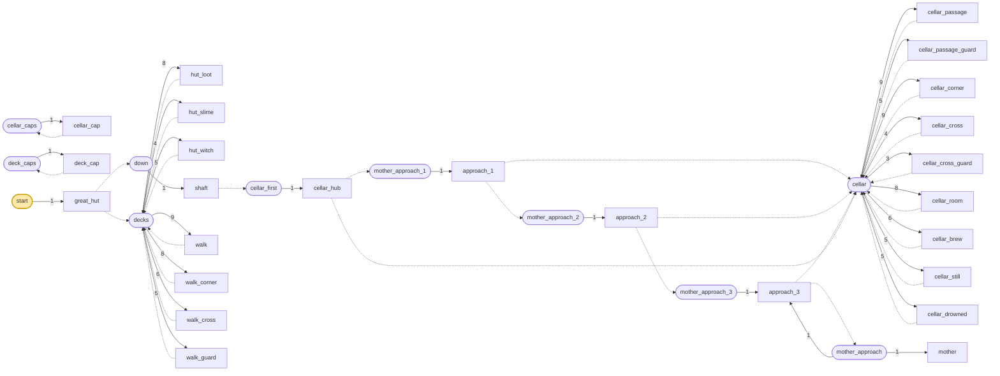
```mermaid
flowchart LR
  P_cellar(["cellar"])
  P_cellar_caps(["cellar_caps"])
  P_cellar_first(["cellar_first"])
  P_deck_caps(["deck_caps"])
  P_decks(["decks"])
  P_down(["down"])
  P_mother_approach(["mother_approach"])
  P_mother_approach_1(["mother_approach_1"])
  P_mother_approach_2(["mother_approach_2"])
  P_mother_approach_3(["mother_approach_3"])
  P_start(["start"])
  E_approach_1["approach_1"]
  E_approach_2["approach_2"]
  E_approach_3["approach_3"]
  E_cellar_brew["cellar_brew"]
  E_cellar_cap["cellar_cap"]
  E_cellar_corner["cellar_corner"]
  E_cellar_cross["cellar_cross"]
  E_cellar_cross_guard["cellar_cross_guard"]
  E_cellar_drowned["cellar_drowned"]
  E_cellar_hub["cellar_hub"]
  E_cellar_passage["cellar_passage"]
  E_cellar_passage_guard["cellar_passage_guard"]
  E_cellar_room["cellar_room"]
  E_cellar_still["cellar_still"]
  E_deck_cap["deck_cap"]
  E_great_hut["great_hut"]
  E_hut_loot["hut_loot"]
  E_hut_slime["hut_slime"]
  E_hut_witch["hut_witch"]
  E_mother["mother"]
  E_shaft["shaft"]
  E_walk["walk"]
  E_walk_corner["walk_corner"]
  E_walk_cross["walk_cross"]
  E_walk_guard["walk_guard"]
  P_cellar -- 9 --> E_cellar_passage
  P_cellar -- 5 --> E_cellar_passage_guard
  P_cellar -- 9 --> E_cellar_corner
  P_cellar -- 4 --> E_cellar_cross
  P_cellar -- 3 --> E_cellar_cross_guard
  P_cellar -- 8 --> E_cellar_room
  P_cellar -- 6 --> E_cellar_brew
  P_cellar -- 5 --> E_cellar_still
  P_cellar -- 5 --> E_cellar_drowned
  P_cellar_caps -- 1 --> E_cellar_cap
  P_cellar_first -- 1 --> E_cellar_hub
  P_deck_caps -- 1 --> E_deck_cap
  P_decks -- 9 --> E_walk
  P_decks -- 5 --> E_walk_guard
  P_decks -- 8 --> E_walk_corner
  P_decks -- 6 --> E_walk_cross
  P_decks -- 8 --> E_hut_loot
  P_decks -- 5 --> E_hut_witch
  P_decks -- 4 --> E_hut_slime
  P_down -- 1 --> E_shaft
  P_mother_approach -- 1 --> E_mother
  P_mother_approach -- 1 --> E_approach_3
  P_mother_approach_1 -- 1 --> E_approach_1
  P_mother_approach_2 -- 1 --> E_approach_2
  P_mother_approach_3 -- 1 --> E_approach_3
  P_start -- 1 --> E_great_hut
  E_approach_1 -.-> P_cellar
  E_approach_1 -.-> P_mother_approach_2
  E_approach_2 -.-> P_cellar
  E_approach_2 -.-> P_mother_approach_3
  E_approach_3 -.-> P_cellar
  E_approach_3 -.-> P_mother_approach
  E_cellar_brew -.-> P_cellar
  E_cellar_cap -.-> P_cellar_caps
  E_cellar_corner -.-> P_cellar
  E_cellar_cross -.-> P_cellar
  E_cellar_cross_guard -.-> P_cellar
  E_cellar_drowned -.-> P_cellar
  E_cellar_hub -.-> P_cellar
  E_cellar_hub -.-> P_mother_approach_1
  E_cellar_passage -.-> P_cellar
  E_cellar_passage_guard -.-> P_cellar
  E_cellar_room -.-> P_cellar
  E_cellar_still -.-> P_cellar
  E_deck_cap -.-> P_deck_caps
  E_great_hut -.-> P_decks
  E_great_hut -.-> P_down
  E_hut_loot -.-> P_decks
  E_hut_slime -.-> P_decks
  E_hut_witch -.-> P_decks
  E_shaft -.-> P_cellar_first
  E_walk -.-> P_decks
  E_walk_corner -.-> P_decks
  E_walk_cross -.-> P_decks
  E_walk_guard -.-> P_decks
  P_start:::start
  classDef start fill:#ffe9a8,stroke:#c99a00,stroke-width:2px
```

| 풀 | fallback | 원소 (가중치) |
|---|---|---|
| `cellar` | `cellar_caps` | `cellar_passage` 9, `cellar_passage_guard` 5, `cellar_corner` 9, `cellar_cross` 4, `cellar_cross_guard` 3, `cellar_room` 8, `cellar_brew` 6, `cellar_still` 5, `cellar_drowned` 5 |
| `cellar_caps` | `minecraft:empty` | `cellar_cap` 1 |
| `cellar_first` | `minecraft:empty` | `cellar_hub` 1 |
| `deck_caps` | `minecraft:empty` | `deck_cap` 1 |
| `decks` | `deck_caps` | `walk` 9, `walk_guard` 5, `walk_corner` 8, `walk_cross` 6, `hut_loot` 8, `hut_witch` 5, `hut_slime` 4 |
| `down` | `minecraft:empty` | `shaft` 1 |
| `mother_approach` | `cellar_caps` | `mother` 1, `approach_3` 1 |
| `mother_approach_1` | `cellar_caps` | `approach_1` 1 |
| `mother_approach_2` | `cellar_caps` | `approach_2` 1 |
| `mother_approach_3` | `cellar_caps` | `approach_3` 1 |
| `start` | `minecraft:empty` | `great_hut` 1 |

## 4. 뼈대 — 반드시 이렇게 놓이는 부분

큰 오두막 → 수직통로 → 지하 허브 → 보스 통로 셋. **원소가 하나뿐인 풀로 놓이는 것만** 그렸다.
널다리와 양조장 미로는 판마다 다르다. 사다리가 덱(y=3)에서 지하 바닥(y=−28)까지 한 줄로
이어지는 것이 단면에 보인다.

| 조각 | 놓이는 자리 (시작 조각 기준) | 누가 놓나 |
|---|---|---|
| `great_hut` | (0, 0, 0) | 시작 풀 |
| `shaft` | (7, -21, 7) | great_hut의 아래 swamp_down 직소 |
| `cellar_hub` | (7, -28, 7) | shaft의 아래 swamp_cellar 직소 |
| `approach_1` | (7, -28, 14) | cellar_hub의 남 swamp_cellar 직소 |
| `approach_2` | (14, -28, 14) | approach_1의 동 swamp_cellar 직소 |
| `approach_3` | (21, -28, 14) | approach_2의 동 swamp_cellar 직소 |

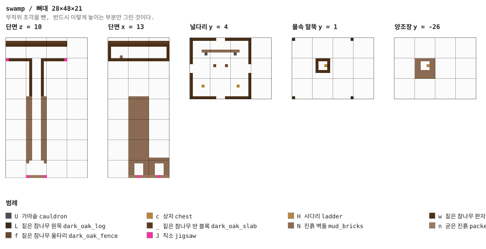

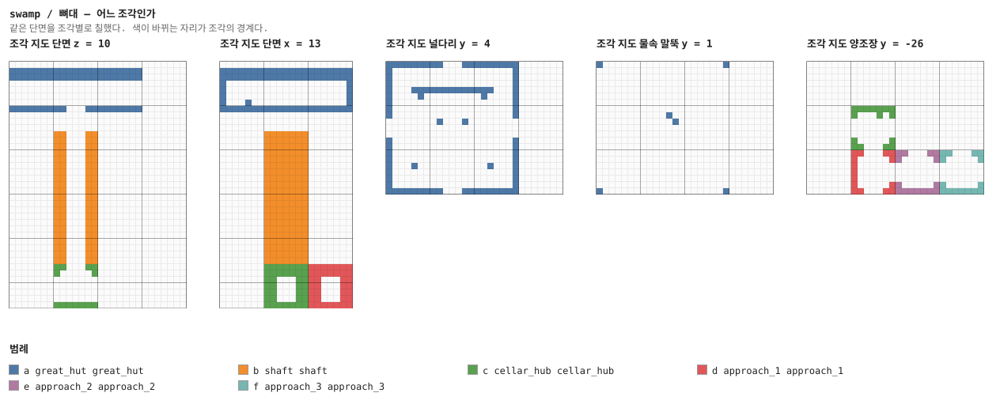

## 5. 조각


그림은 조각 하나를 **층마다 한 장씩** 블록 단위로 그린 것이다. 같은 층이 이어지면 `y = 2–5`처럼 묶었고, 마지막 두 장은 가운데를 자른 세로 단면이다. 분홍 점이 직소, 화살표가 그 직소가 보는 방향이다 — **마주 본 직소끼리만 붙는다.**

### `great_hut` — 21×11×21

시작 조각. 21×21의 한 층짜리 홀이고 말뚝 위에 선다. 네 면 가운데에서 널다리가 뻗고,
바닥의 3×3 구멍이 **이 던전의 유일한 아래 방향 직소**다 — 양조장으로 가는 길은 이것뿐이다.

양조기 셋이 놓인 작업대와 가마솥 둘, 상자 둘. 사다리는 구멍의 동쪽 벽에 붙어서
수직통로의 사다리와 **같은 칸(x+1, z−2)**으로 이어진다. 두 조각이 그 좌표에 합의해야 하므로
`generate_swamp.py` 한 곳에서 나온다.

**어느 풀에 있나** — `start` (가중치 1)

| 직소 위치 | 향 | name | target | pool |
|---|---|---|---|---|
| (12, 0, 9) | ◇ 아래 | `swamp_down` | `swamp_down` | `swamp/down` |
| (10, 3, 0) | ▲ 북 | `swamp_deck` | `swamp_deck` | `swamp/decks` |
| (0, 3, 10) | ◀ 서 | `swamp_deck` | `swamp_deck` | `swamp/decks` |
| (20, 3, 10) | ▶ 동 | `swamp_deck` | `swamp_deck` | `swamp/decks` |
| (10, 3, 20) | ▼ 남 | `swamp_deck` | `swamp_deck` | `swamp/decks` |

**뚫린 면** — 서: z 0–20, y 0–10 (90칸) / 동: z 0–20, y 0–10 (90칸) / 북: x 0–20, y 0–10 (90칸) / 남: x 0–20, y 0–10 (90칸) / 아래: x 0–20, z 0–20 (435칸) / 위: x 0–20, z 0–20 (441칸)

**블록** — 짙은 참나무 판자 1121, 짙은 참나무 반 블록 441, 짙은 참나무 원목 34, 진흙 벽돌 13, 직소 5, 랜턴 4, 사다리 4, 양조기 3

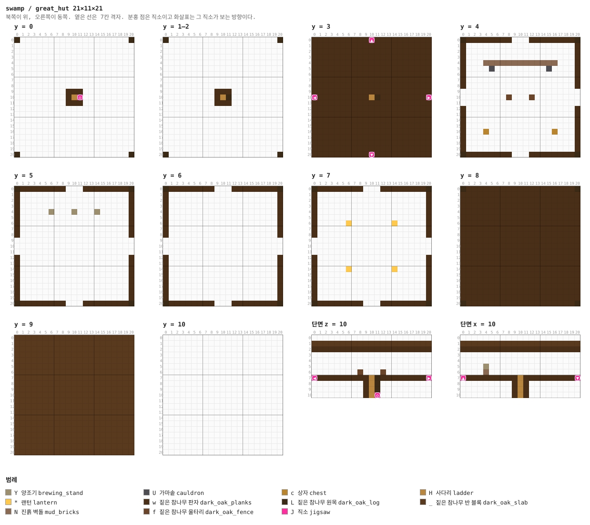

<details><summary>층별 지도 (텍스트)</summary>

```
y = 0   x →동, z ↓남
  L...................L
  .....................
  .....................
  .....................
  .....................
  .....................
  .....................
  .....................
  ...........H.........
  ............J........
  .....................
  .....................
  .....................
  .....................
  .....................
  .....................
  .....................
  .....................
  .....................
  .....................
  L...................L
y = 1–2   x →동, z ↓남
  L...................L
  .....................
  .....................
  .....................
  .....................
  .....................
  .....................
  .....................
  ...........H.........
  ............L........
  .....................
  .....................
  .....................
  .....................
  .....................
  .....................
  .....................
  .....................
  .....................
  .....................
  L...................L
y = 3   x →동, z ↓남
  wwwwwwwwwwJwwwwwwwwww
  wwwwwwwwwwwwwwwwwwwww
  wwwwwwwwwwwwwwwwwwwww
  wwwwwwwwwwwwwwwwwwwww
  wwwwwwwwwwwwwwwwwwwww
  wwwwwwwwwwwwwwwwwwwww
  wwwwwwwwwwwwwwwwwwwww
  wwwwwwwwwwwwwwwwwwwww
  wwwwwwwww..Hwwwwwwwww
  wwwwwwwww...wwwwwwwww
  Jwwwwwwww...wwwwwwwwJ
  wwwwwwwwwwwwwwwwwwwww
  wwwwwwwwwwwwwwwwwwwww
  wwwwwwwwwwwwwwwwwwwww
  wwwwwwwwwwwwwwwwwwwww
  wwwwwwwwwwwwwwwwwwwww
  wwwwwwwwwwwwwwwwwwwww
  wwwwwwwwwwwwwwwwwwwww
  wwwwwwwwwwwwwwwwwwwww
  wwwwwwwwwwwwwwwwwwwww
  wwwwwwwwwwJwwwwwwwwww
y = 4   x →동, z ↓남
  Lwwwwwwww...wwwwwwwwL
  w...................w
  w...................w
  w...................w
  w...NNNNNNNNNNNNN...w
  w....U.........U....w
  w...................w
  w...................w
  w...................w
  ........f...f........
  .....................
  .....................
  w...................w
  w...................w
  w...................w
  w...................w
  w...c...........c...w
  w...................w
  w...................w
  w...................w
  Lwwwwwwww...wwwwwwwwL
y = 5   x →동, z ↓남
  Lwwwwwwww...wwwwwwwwL
  w...................w
  w...................w
  w...................w
  w.....Y...Y...Y.....w
  w...................w
  w...................w
  w...................w
  w...................w
  .....................
  .....................
  .....................
  w...................w
  w...................w
  w...................w
  w...................w
  w...................w
  w...................w
  w...................w
  w...................w
  Lwwwwwwww...wwwwwwwwL
y = 6   x →동, z ↓남
  Lwwwwwwww...wwwwwwwwL
  w...................w
  w...................w
  w...................w
  w...................w
  w...................w
  w...................w
  w...................w
  w...................w
  .....................
  .....................
  .....................
  w...................w
  w...................w
  w...................w
  w...................w
  w...................w
  w...................w
  w...................w
  w...................w
  Lwwwwwwww...wwwwwwwwL
y = 7   x →동, z ↓남
  Lwwwwwwww...wwwwwwwwL
  w...................w
  w...................w
  w...................w
  w...................w
  w...................w
  w.....*.......*.....w
  w...................w
  w...................w
  .....................
  .....................
  .....................
  w...................w
  w...................w
  w.....*.......*.....w
  w...................w
  w...................w
  w...................w
  w...................w
  w...................w
  Lwwwwwwww...wwwwwwwwL
y = 8   x →동, z ↓남
  LwwwwwwwwwwwwwwwwwwwL
  wwwwwwwwwwwwwwwwwwwww
  wwwwwwwwwwwwwwwwwwwww
  wwwwwwwwwwwwwwwwwwwww
  wwwwwwwwwwwwwwwwwwwww
  wwwwwwwwwwwwwwwwwwwww
  wwwwwwwwwwwwwwwwwwwww
  wwwwwwwwwwwwwwwwwwwww
  wwwwwwwwwwwwwwwwwwwww
  wwwwwwwwwwwwwwwwwwwww
  wwwwwwwwwwwwwwwwwwwww
  wwwwwwwwwwwwwwwwwwwww
  wwwwwwwwwwwwwwwwwwwww
  wwwwwwwwwwwwwwwwwwwww
  wwwwwwwwwwwwwwwwwwwww
  wwwwwwwwwwwwwwwwwwwww
  wwwwwwwwwwwwwwwwwwwww
  wwwwwwwwwwwwwwwwwwwww
  wwwwwwwwwwwwwwwwwwwww
  wwwwwwwwwwwwwwwwwwwww
  LwwwwwwwwwwwwwwwwwwwL
y = 9   x →동, z ↓남
  _____________________
  _____________________
  _____________________
  _____________________
  _____________________
  _____________________
  _____________________
  _____________________
  _____________________
  _____________________
  _____________________
  _____________________
  _____________________
  _____________________
  _____________________
  _____________________
  _____________________
  _____________________
  _____________________
  _____________________
  _____________________
y = 10   x →동, z ↓남
  .....................
  .....................
  .....................
  .....................
  .....................
  .....................
  .....................
  .....................
  .....................
  .....................
  .....................
  .....................
  .....................
  .....................
  .....................
  .....................
  .....................
  .....................
  .....................
  .....................
  .....................
```

</details>

<details><summary>세로 단면 (텍스트)</summary>

```
단면 z = 10   x →동, y ↑하늘
  .....................
  _____________________
  wwwwwwwwwwwwwwwwwwwww
  .....................
  .....................
  .....................
  .....................
  Jwwwwwwww...wwwwwwwwJ
  .....................
  .....................
  .....................
단면 x = 10   z →남, y ↑하늘
  .....................
  _____________________
  wwwwwwwwwwwwwwwwwwwww
  .....................
  .....................
  ....Y................
  ....N................
  Jwwwwwww...wwwwwwwwwJ
  .....................
  .....................
  .....................
```

</details>


### `walk` — 7×11×7

널다리의 기본 단위. 말뚝 넷, 판자 덱, 사방 난간 — 문이 난 쪽만 뚫린다. **덱 아래는 말뚝
말고 아무것도 쓰지 않아서** 물이 그대로 남는다.

**어느 풀에 있나** — `decks` (가중치 9)

| 직소 위치 | 향 | name | target | pool |
|---|---|---|---|---|
| (0, 3, 3) | ◀ 서 | `swamp_deck` | `swamp_deck` | `swamp/decks` |
| (6, 3, 3) | ▶ 동 | `swamp_deck` | `swamp_deck` | `swamp/decks` |

**뚫린 면** — 서: z 0–6, y 0–10 (60칸) / 동: z 0–6, y 0–10 (60칸) / 북: x 0–6, y 0–10 (57칸) / 남: x 0–6, y 0–10 (57칸) / 아래: x 0–6, z 0–6 (45칸) / 위: x 0–6, z 0–6 (49칸)

**블록** — 짙은 참나무 판자 47, 짙은 참나무 울타리 18, 짙은 참나무 원목 12, 직소 2, 랜턴 2

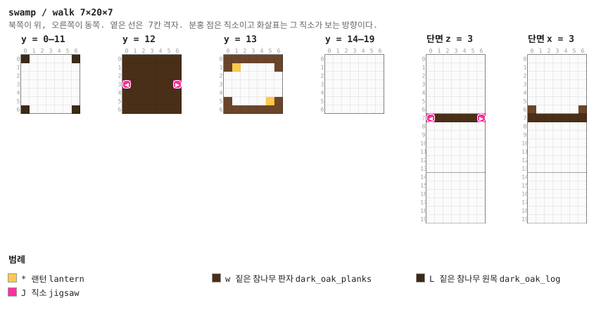

<details><summary>층별 지도 (텍스트)</summary>

```
y = 0–2   x →동, z ↓남
  L.....L
  .......
  .......
  .......
  .......
  .......
  L.....L
y = 3   x →동, z ↓남
  wwwwwww
  wwwwwww
  wwwwwww
  JwwwwwJ
  wwwwwww
  wwwwwww
  wwwwwww
y = 4   x →동, z ↓남
  fffffff
  f*....f
  .......
  .......
  .......
  f....*f
  fffffff
y = 5–10   x →동, z ↓남
  .......
  .......
  .......
  .......
  .......
  .......
  .......
```

</details>

<details><summary>세로 단면 (텍스트)</summary>

```
단면 z = 3   x →동, y ↑하늘
  .......
  .......
  .......
  .......
  .......
  .......
  .......
  JwwwwwJ
  .......
  .......
  .......
단면 x = 3   z →남, y ↑하늘
  .......
  .......
  .......
  .......
  .......
  .......
  f.....f
  wwwwwww
  .......
  .......
  .......
```

</details>


### `walk_guard` — 7×11×7

널다리 한가운데 마녀 스포너. 피할 데가 없는 자리다.

**어느 풀에 있나** — `decks` (가중치 5)

| 직소 위치 | 향 | name | target | pool |
|---|---|---|---|---|
| (0, 3, 3) | ◀ 서 | `swamp_deck` | `swamp_deck` | `swamp/decks` |
| (6, 3, 3) | ▶ 동 | `swamp_deck` | `swamp_deck` | `swamp/decks` |

**뚫린 면** — 서: z 0–6, y 0–10 (60칸) / 동: z 0–6, y 0–10 (60칸) / 북: x 0–6, y 0–10 (57칸) / 남: x 0–6, y 0–10 (57칸) / 아래: x 0–6, z 0–6 (45칸) / 위: x 0–6, z 0–6 (49칸)

**블록** — 짙은 참나무 판자 47, 짙은 참나무 울타리 18, 짙은 참나무 원목 12, 직소 2, 랜턴 2, 몬스터 스포너 1

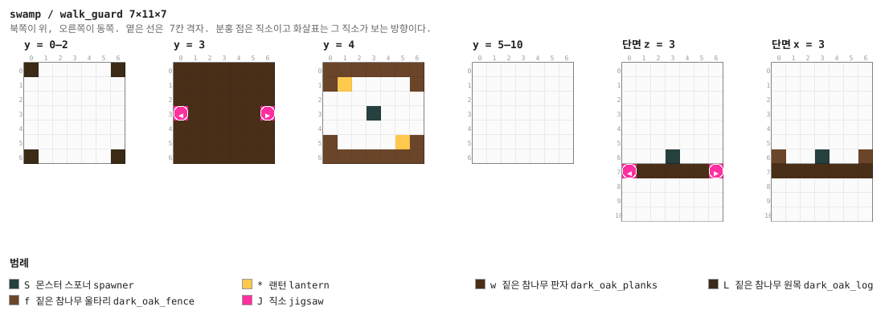

<details><summary>층별 지도 (텍스트)</summary>

```
y = 0–2   x →동, z ↓남
  L.....L
  .......
  .......
  .......
  .......
  .......
  L.....L
y = 3   x →동, z ↓남
  wwwwwww
  wwwwwww
  wwwwwww
  JwwwwwJ
  wwwwwww
  wwwwwww
  wwwwwww
y = 4   x →동, z ↓남
  fffffff
  f*....f
  .......
  ...S...
  .......
  f....*f
  fffffff
y = 5–10   x →동, z ↓남
  .......
  .......
  .......
  .......
  .......
  .......
  .......
```

</details>

<details><summary>세로 단면 (텍스트)</summary>

```
단면 z = 3   x →동, y ↑하늘
  .......
  .......
  .......
  .......
  .......
  .......
  ...S...
  JwwwwwJ
  .......
  .......
  .......
단면 x = 3   z →남, y ↑하늘
  .......
  .......
  .......
  .......
  .......
  .......
  f..S..f
  wwwwwww
  .......
  .......
  .......
```

</details>


### `walk_corner` — 7×11×7

꺾이는 널다리.

**어느 풀에 있나** — `decks` (가중치 8)

| 직소 위치 | 향 | name | target | pool |
|---|---|---|---|---|
| (0, 3, 3) | ◀ 서 | `swamp_deck` | `swamp_deck` | `swamp/decks` |
| (3, 3, 6) | ▼ 남 | `swamp_deck` | `swamp_deck` | `swamp/decks` |

**뚫린 면** — 서: z 0–6, y 0–10 (60칸) / 동: z 0–6, y 0–10 (57칸) / 북: x 0–6, y 0–10 (57칸) / 남: x 0–6, y 0–10 (60칸) / 아래: x 0–6, z 0–6 (45칸) / 위: x 0–6, z 0–6 (49칸)

**블록** — 짙은 참나무 판자 47, 짙은 참나무 울타리 18, 짙은 참나무 원목 12, 직소 2, 랜턴 2

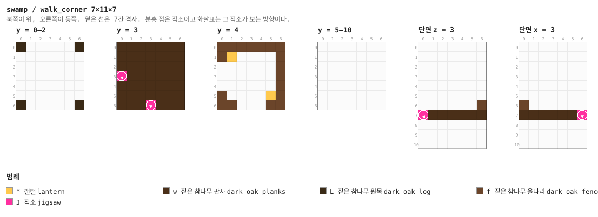

<details><summary>층별 지도 (텍스트)</summary>

```
y = 0–2   x →동, z ↓남
  L.....L
  .......
  .......
  .......
  .......
  .......
  L.....L
y = 3   x →동, z ↓남
  wwwwwww
  wwwwwww
  wwwwwww
  Jwwwwww
  wwwwwww
  wwwwwww
  wwwJwww
y = 4   x →동, z ↓남
  fffffff
  f*....f
  ......f
  ......f
  ......f
  f....*f
  ff...ff
y = 5–10   x →동, z ↓남
  .......
  .......
  .......
  .......
  .......
  .......
  .......
```

</details>

<details><summary>세로 단면 (텍스트)</summary>

```
단면 z = 3   x →동, y ↑하늘
  .......
  .......
  .......
  .......
  .......
  .......
  ......f
  Jwwwwww
  .......
  .......
  .......
단면 x = 3   z →남, y ↑하늘
  .......
  .......
  .......
  .......
  .......
  .......
  f......
  wwwwwwJ
  .......
  .......
  .......
```

</details>


### `walk_cross` — 7×11×7

널다리 네거리. 마을이 갈라지는 자리다.

**어느 풀에 있나** — `decks` (가중치 6)

| 직소 위치 | 향 | name | target | pool |
|---|---|---|---|---|
| (3, 3, 0) | ▲ 북 | `swamp_deck` | `swamp_deck` | `swamp/decks` |
| (0, 3, 3) | ◀ 서 | `swamp_deck` | `swamp_deck` | `swamp/decks` |
| (6, 3, 3) | ▶ 동 | `swamp_deck` | `swamp_deck` | `swamp/decks` |
| (3, 3, 6) | ▼ 남 | `swamp_deck` | `swamp_deck` | `swamp/decks` |

**뚫린 면** — 서: z 0–6, y 0–10 (60칸) / 동: z 0–6, y 0–10 (60칸) / 북: x 0–6, y 0–10 (60칸) / 남: x 0–6, y 0–10 (60칸) / 아래: x 0–6, z 0–6 (45칸) / 위: x 0–6, z 0–6 (49칸)

**블록** — 짙은 참나무 판자 45, 짙은 참나무 원목 12, 짙은 참나무 울타리 12, 직소 4, 랜턴 2

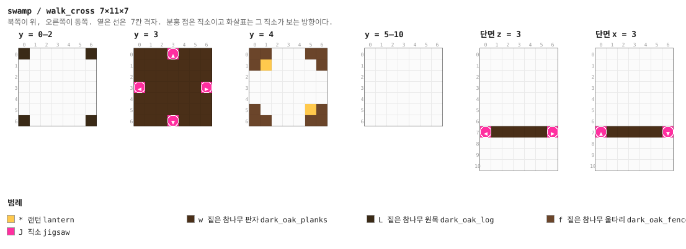

<details><summary>층별 지도 (텍스트)</summary>

```
y = 0–2   x →동, z ↓남
  L.....L
  .......
  .......
  .......
  .......
  .......
  L.....L
y = 3   x →동, z ↓남
  wwwJwww
  wwwwwww
  wwwwwww
  JwwwwwJ
  wwwwwww
  wwwwwww
  wwwJwww
y = 4   x →동, z ↓남
  ff...ff
  f*....f
  .......
  .......
  .......
  f....*f
  ff...ff
y = 5–10   x →동, z ↓남
  .......
  .......
  .......
  .......
  .......
  .......
  .......
```

</details>

<details><summary>세로 단면 (텍스트)</summary>

```
단면 z = 3   x →동, y ↑하늘
  .......
  .......
  .......
  .......
  .......
  .......
  .......
  JwwwwwJ
  .......
  .......
  .......
단면 x = 3   z →남, y ↑하늘
  .......
  .......
  .......
  .......
  .......
  .......
  .......
  JwwwwwJ
  .......
  .......
  .......
```

</details>


### `hut_loot` — 7×11×7

상자가 든 오두막. 문이 서쪽 하나뿐이라 들어갔다 나와야 한다. 지붕이 있어서 널다리와
멀리서도 구별된다.

**어느 풀에 있나** — `decks` (가중치 8)

| 직소 위치 | 향 | name | target | pool |
|---|---|---|---|---|
| (0, 3, 3) | ◀ 서 | `swamp_deck` | `swamp_deck` | `swamp/decks` |

**뚫린 면** — 서: z 0–6, y 0–10 (34칸) / 동: z 0–6, y 0–10 (22칸) / 북: x 0–6, y 0–10 (22칸) / 남: x 0–6, y 0–10 (22칸) / 아래: x 0–6, z 0–6 (45칸) / 위: x 0–6, z 0–6 (49칸)

**블록** — 짙은 참나무 판자 181, 짙은 참나무 반 블록 49, 짙은 참나무 원목 12, 직소 1, 가마솥 1, 랜턴 1, 상자 1

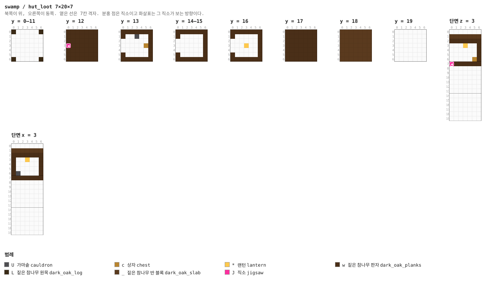

<details><summary>층별 지도 (텍스트)</summary>

```
y = 0–2   x →동, z ↓남
  L.....L
  .......
  .......
  .......
  .......
  .......
  L.....L
y = 3   x →동, z ↓남
  wwwwwww
  wwwwwww
  wwwwwww
  Jwwwwww
  wwwwwww
  wwwwwww
  wwwwwww
y = 4   x →동, z ↓남
  wwwwwww
  w..U..w
  ......w
  .....cw
  ......w
  w.....w
  wwwwwww
y = 5–6   x →동, z ↓남
  wwwwwww
  w.....w
  ......w
  ......w
  ......w
  w.....w
  wwwwwww
y = 7   x →동, z ↓남
  wwwwwww
  w.....w
  ......w
  ...*..w
  ......w
  w.....w
  wwwwwww
y = 8   x →동, z ↓남
  wwwwwww
  wwwwwww
  wwwwwww
  wwwwwww
  wwwwwww
  wwwwwww
  wwwwwww
y = 9   x →동, z ↓남
  _______
  _______
  _______
  _______
  _______
  _______
  _______
y = 10   x →동, z ↓남
  .......
  .......
  .......
  .......
  .......
  .......
  .......
```

</details>

<details><summary>세로 단면 (텍스트)</summary>

```
단면 z = 3   x →동, y ↑하늘
  .......
  _______
  wwwwwww
  ...*..w
  ......w
  ......w
  .....cw
  Jwwwwww
  .......
  .......
  .......
단면 x = 3   z →남, y ↑하늘
  .......
  _______
  wwwwwww
  w..*..w
  w.....w
  w.....w
  wU....w
  wwwwwww
  .......
  .......
  .......
```

</details>


### `hut_witch` — 7×11×7

마녀 스포너와 끓는 가마솥, 양조기. 마을의 진짜 주인이다.

**어느 풀에 있나** — `decks` (가중치 5)

| 직소 위치 | 향 | name | target | pool |
|---|---|---|---|---|
| (0, 3, 3) | ◀ 서 | `swamp_deck` | `swamp_deck` | `swamp/decks` |

**뚫린 면** — 서: z 0–6, y 0–10 (34칸) / 동: z 0–6, y 0–10 (22칸) / 북: x 0–6, y 0–10 (22칸) / 남: x 0–6, y 0–10 (22칸) / 아래: x 0–6, z 0–6 (45칸) / 위: x 0–6, z 0–6 (49칸)

**블록** — 짙은 참나무 판자 181, 짙은 참나무 반 블록 49, 짙은 참나무 원목 12, 직소 1, 가마솥 1, 몬스터 스포너 1, 양조기 1, 상자 1

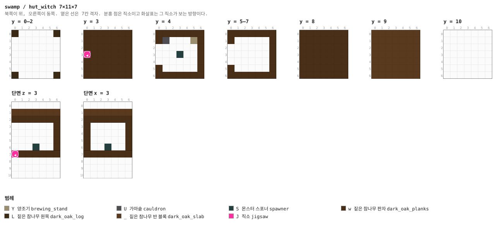

<details><summary>층별 지도 (텍스트)</summary>

```
y = 0–2   x →동, z ↓남
  L.....L
  .......
  .......
  .......
  .......
  .......
  L.....L
y = 3   x →동, z ↓남
  wwwwwww
  wwwwwww
  wwwwwww
  Jwwwwww
  wwwwwww
  wwwwwww
  wwwwwww
y = 4   x →동, z ↓남
  wwwwwww
  wU...Yw
  ......w
  ...S..w
  ......w
  w....cw
  wwwwwww
y = 5–7   x →동, z ↓남
  wwwwwww
  w.....w
  ......w
  ......w
  ......w
  w.....w
  wwwwwww
y = 8   x →동, z ↓남
  wwwwwww
  wwwwwww
  wwwwwww
  wwwwwww
  wwwwwww
  wwwwwww
  wwwwwww
y = 9   x →동, z ↓남
  _______
  _______
  _______
  _______
  _______
  _______
  _______
y = 10   x →동, z ↓남
  .......
  .......
  .......
  .......
  .......
  .......
  .......
```

</details>

<details><summary>세로 단면 (텍스트)</summary>

```
단면 z = 3   x →동, y ↑하늘
  .......
  _______
  wwwwwww
  ......w
  ......w
  ......w
  ...S..w
  Jwwwwww
  .......
  .......
  .......
단면 x = 3   z →남, y ↑하늘
  .......
  _______
  wwwwwww
  w.....w
  w.....w
  w.....w
  w..S..w
  wwwwwww
  .......
  .......
  .......
```

</details>


### `hut_slime` — 7×11×7

슬라임 스포너와 진흙 뿌리 바닥.

**어느 풀에 있나** — `decks` (가중치 4)

| 직소 위치 | 향 | name | target | pool |
|---|---|---|---|---|
| (0, 3, 3) | ◀ 서 | `swamp_deck` | `swamp_deck` | `swamp/decks` |

**뚫린 면** — 서: z 0–6, y 0–10 (34칸) / 동: z 0–6, y 0–10 (22칸) / 북: x 0–6, y 0–10 (22칸) / 남: x 0–6, y 0–10 (22칸) / 아래: x 0–6, z 0–6 (45칸) / 위: x 0–6, z 0–6 (49칸)

**블록** — 짙은 참나무 판자 181, 짙은 참나무 반 블록 49, 짙은 참나무 원목 12, 진흙 맹그로브 뿌리 5, 직소 1, 상자 1, 몬스터 스포너 1

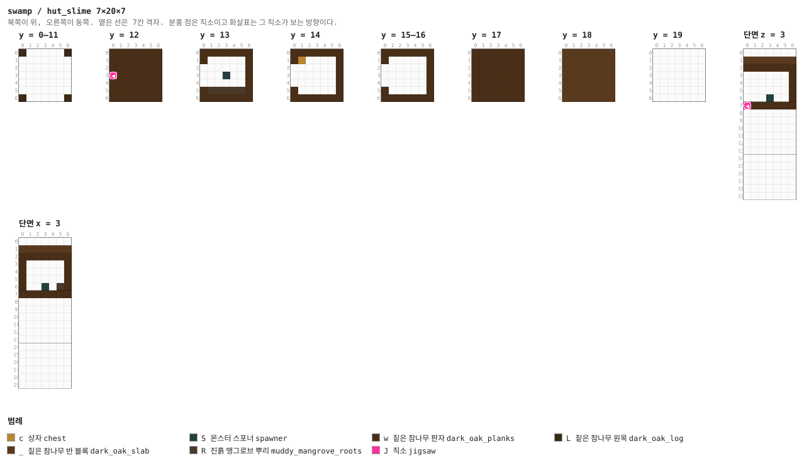

<details><summary>층별 지도 (텍스트)</summary>

```
y = 0–2   x →동, z ↓남
  L.....L
  .......
  .......
  .......
  .......
  .......
  L.....L
y = 3   x →동, z ↓남
  wwwwwww
  wwwwwww
  wwwwwww
  Jwwwwww
  wwwwwww
  wwwwwww
  wwwwwww
y = 4   x →동, z ↓남
  wwwwwww
  w.....w
  ......w
  ...S..w
  ......w
  wRRRRRw
  wwwwwww
y = 5   x →동, z ↓남
  wwwwwww
  wc....w
  ......w
  ......w
  ......w
  w.....w
  wwwwwww
y = 6–7   x →동, z ↓남
  wwwwwww
  w.....w
  ......w
  ......w
  ......w
  w.....w
  wwwwwww
y = 8   x →동, z ↓남
  wwwwwww
  wwwwwww
  wwwwwww
  wwwwwww
  wwwwwww
  wwwwwww
  wwwwwww
y = 9   x →동, z ↓남
  _______
  _______
  _______
  _______
  _______
  _______
  _______
y = 10   x →동, z ↓남
  .......
  .......
  .......
  .......
  .......
  .......
  .......
```

</details>

<details><summary>세로 단면 (텍스트)</summary>

```
단면 z = 3   x →동, y ↑하늘
  .......
  _______
  wwwwwww
  ......w
  ......w
  ......w
  ...S..w
  Jwwwwww
  .......
  .......
  .......
단면 x = 3   z →남, y ↑하늘
  .......
  _______
  wwwwwww
  w.....w
  w.....w
  w.....w
  w..S.Rw
  wwwwwww
  .......
  .......
  .......
```

</details>


### `deck_cap` — 1×11×7

**난간 한 장.** 널다리 풀의 fallback이다. 두께가 1이라 최대 깊이에서도 거의 항상 들어가고,
그래서 허공에서 끊기는 널다리가 없다. 감옥의 `cap`과 같은 역할이다 (§4).

**어느 풀에 있나** — `deck_caps` (가중치 1)

| 직소 위치 | 향 | name | target | pool |
|---|---|---|---|---|
| (0, 3, 3) | ◀ 서 | `swamp_deck` | `swamp_deck` | `swamp/deck_caps` |

**뚫린 면** — 서: z 0–6, y 0–10 (63칸) / 동: z 0–6, y 0–10 (63칸) / 북: x 0–0, y 0–10 (9칸) / 남: x 0–0, y 0–10 (9칸) / 아래: x 0–0, z 0–6 (7칸) / 위: x 0–0, z 0–6 (7칸)

**블록** — 짙은 참나무 울타리 7, 짙은 참나무 판자 6, 직소 1

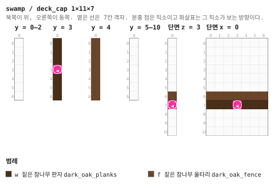

<details><summary>층별 지도 (텍스트)</summary>

```
y = 0–2   x →동, z ↓남
  .
  .
  .
  .
  .
  .
  .
y = 3   x →동, z ↓남
  w
  w
  w
  J
  w
  w
  w
y = 4   x →동, z ↓남
  f
  f
  f
  f
  f
  f
  f
y = 5–10   x →동, z ↓남
  .
  .
  .
  .
  .
  .
  .
```

</details>

<details><summary>세로 단면 (텍스트)</summary>

```
단면 z = 3   x →동, y ↑하늘
  .
  .
  .
  .
  .
  .
  f
  J
  .
  .
  .
단면 x = 0   z →남, y ↑하늘
  .......
  .......
  .......
  .......
  .......
  .......
  fffffff
  wwwJwww
  .......
  .......
  .......
```

</details>


### `shaft` — 7×21×7 — 1×3×1 셀

큰 오두막 밑에서 물을 뚫고 진흙까지 21칸. **여기는 공기를 일부러 쓴다** — 지나가는 물을
밀어내야 하기 때문이고, 그래서 덱 조각들과 정반대 규칙을 따른다.

**어느 풀에 있나** — `down` (가중치 1)

| 직소 위치 | 향 | name | target | pool |
|---|---|---|---|---|
| (5, 0, 2) | ◇ 아래 | `swamp_cellar` | `swamp_cellar` | `swamp/cellar_first` |
| (5, 20, 2) | ◆ 위 | `swamp_down` | `swamp_down` | `—` |

**뚫린 면** — 아래: x 2–4, z 1–3 (8칸) / 위: x 2–4, z 1–3 (8칸)

**블록** — 진흙 벽돌 838, 사다리 21, 직소 2

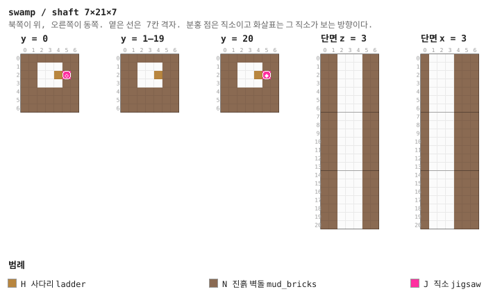

<details><summary>층별 지도 (텍스트)</summary>

```
y = 0   x →동, z ↓남
  NNNNNNN
  NN..HNN
  NN...JN
  NN...NN
  NNNNNNN
  NNNNNNN
  NNNNNNN
y = 1–19   x →동, z ↓남
  NNNNNNN
  NN..HNN
  NN...NN
  NN...NN
  NNNNNNN
  NNNNNNN
  NNNNNNN
y = 20   x →동, z ↓남
  NNNNNNN
  NN..HNN
  NN...JN
  NN...NN
  NNNNNNN
  NNNNNNN
  NNNNNNN
```

</details>

<details><summary>세로 단면 (텍스트)</summary>

```
단면 z = 3   x →동, y ↑하늘
  NN...NN
  NN...NN
  NN...NN
  NN...NN
  NN...NN
  NN...NN
  NN...NN
  NN...NN
  NN...NN
  NN...NN
  NN...NN
  NN...NN
  NN...NN
  NN...NN
  NN...NN
  NN...NN
  NN...NN
  NN...NN
  NN...NN
  NN...NN
  NN...NN
단면 x = 3   z →남, y ↑하늘
  N...NNN
  N...NNN
  N...NNN
  N...NNN
  N...NNN
  N...NNN
  N...NNN
  N...NNN
  N...NNN
  N...NNN
  N...NNN
  N...NNN
  N...NNN
  N...NNN
  N...NNN
  N...NNN
  N...NNN
  N...NNN
  N...NNN
  N...NNN
  N...NNN
```

</details>


### `cellar_hub` — 7×7×7 — 1×1×1 셀

사다리가 닿는 방. 서·동문이 양조장 미로로, **남문 하나만** `swamp_mother`를 target으로 삼아
보스 사슬을 부른다. 그 문만 이름이 달라서 사슬이 거꾸로 들어올 수 없다 (§13).

천장 구멍을 **직소보다 먼저** 파야 한다. 반대로 하면 구멍이 직소를 지운다 — 피라미드
사다리에서 한 번 겪은 그 함정이고, 여기서 또 겪었다 (§11).

**어느 풀에 있나** — `cellar_first` (가중치 1)

| 직소 위치 | 향 | name | target | pool |
|---|---|---|---|---|
| (0, 0, 3) | ◀ 서 | `swamp_cellar` | `swamp_cellar` | `swamp/cellar` |
| (6, 0, 3) | ▶ 동 | `swamp_cellar` | `swamp_cellar` | `swamp/cellar` |
| (3, 0, 6) | ▼ 남 | `swamp_cellar` | `swamp_mother` | `swamp/mother_approach_1` |
| (5, 6, 2) | ◆ 위 | `swamp_cellar` | `swamp_cellar` | `—` |

**뚫린 면** — 서: z 2–4, y 1–4 (12칸) / 동: z 2–4, y 1–4 (12칸) / 남: x 2–4, y 1–4 (12칸) / 위: x 2–4, z 1–3 (8칸)

**블록** — 진흙 벽돌 123, 굳은 진흙 46, 사다리 6, 직소 4, 랜턴 1

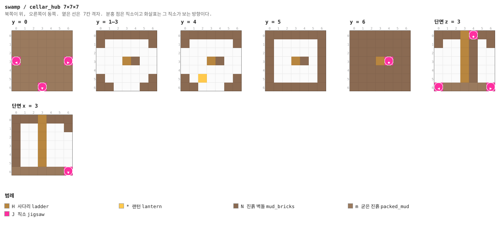

<details><summary>층별 지도 (텍스트)</summary>

```
y = 0   x →동, z ↓남
  nnnnnnn
  nnnnnnn
  nnnnnnn
  JnnnnnJ
  nnnnnnn
  nnnnnnn
  nnnJnnn
y = 1–3   x →동, z ↓남
  NNNNNNN
  N...H.N
  .......
  .......
  .......
  N.....N
  NN...NN
y = 4   x →동, z ↓남
  NNNNNNN
  N...H.N
  .......
  .......
  .......
  N.*...N
  NN...NN
y = 5   x →동, z ↓남
  NNNNNNN
  N...H.N
  N.....N
  N.....N
  N.....N
  N.....N
  NNNNNNN
y = 6   x →동, z ↓남
  NNNNNNN
  NN..HNN
  NN...JN
  NN...NN
  NNNNNNN
  NNNNNNN
  NNNNNNN
```

</details>


### `cellar_passage` — 7×7×7 — 1×1×1 셀

미로의 기본 단위.

**어느 풀에 있나** — `cellar` (가중치 9)

| 직소 위치 | 향 | name | target | pool |
|---|---|---|---|---|
| (0, 0, 3) | ◀ 서 | `swamp_cellar` | `swamp_cellar` | `swamp/cellar` |
| (6, 0, 3) | ▶ 동 | `swamp_cellar` | `swamp_cellar` | `swamp/cellar` |

**뚫린 면** — 서: z 2–4, y 1–4 (12칸) / 동: z 2–4, y 1–4 (12칸)

**블록** — 진흙 벽돌 145, 굳은 진흙 47, 직소 2

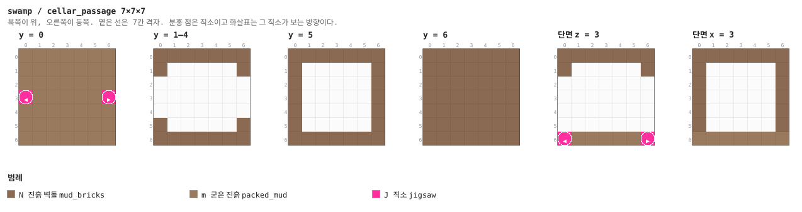

<details><summary>층별 지도 (텍스트)</summary>

```
y = 0   x →동, z ↓남
  nnnnnnn
  nnnnnnn
  nnnnnnn
  JnnnnnJ
  nnnnnnn
  nnnnnnn
  nnnnnnn
y = 1–4   x →동, z ↓남
  NNNNNNN
  N.....N
  .......
  .......
  .......
  N.....N
  NNNNNNN
y = 5   x →동, z ↓남
  NNNNNNN
  N.....N
  N.....N
  N.....N
  N.....N
  N.....N
  NNNNNNN
y = 6   x →동, z ↓남
  NNNNNNN
  NNNNNNN
  NNNNNNN
  NNNNNNN
  NNNNNNN
  NNNNNNN
  NNNNNNN
```

</details>


### `cellar_passage_guard` — 7×7×7 — 1×1×1 셀

통로 한가운데 마녀 스포너. 평범한 통로와 같은 풀에 섞여 나온다.

**어느 풀에 있나** — `cellar` (가중치 5)

| 직소 위치 | 향 | name | target | pool |
|---|---|---|---|---|
| (0, 0, 3) | ◀ 서 | `swamp_cellar` | `swamp_cellar` | `swamp/cellar` |
| (6, 0, 3) | ▶ 동 | `swamp_cellar` | `swamp_cellar` | `swamp/cellar` |

**뚫린 면** — 서: z 2–4, y 1–4 (12칸) / 동: z 2–4, y 1–4 (12칸)

**블록** — 진흙 벽돌 145, 굳은 진흙 47, 직소 2, 몬스터 스포너 1

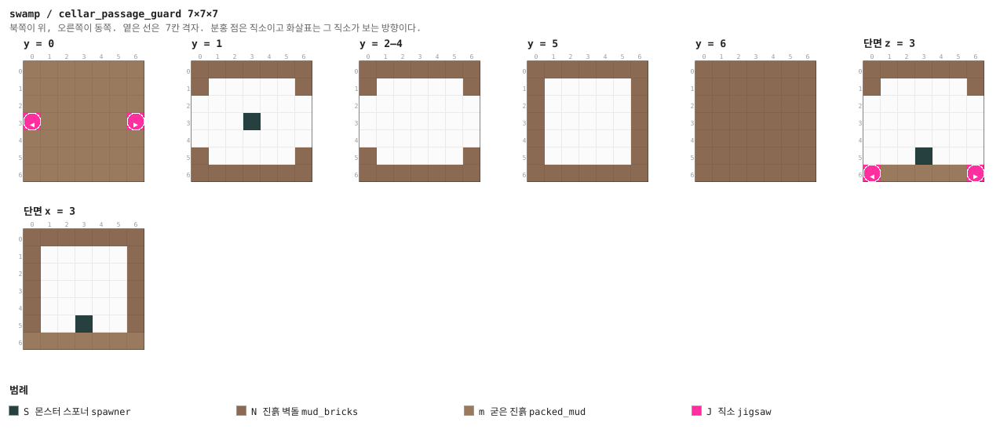

<details><summary>층별 지도 (텍스트)</summary>

```
y = 0   x →동, z ↓남
  nnnnnnn
  nnnnnnn
  nnnnnnn
  JnnnnnJ
  nnnnnnn
  nnnnnnn
  nnnnnnn
y = 1   x →동, z ↓남
  NNNNNNN
  N.....N
  .......
  ...S...
  .......
  N.....N
  NNNNNNN
y = 2–4   x →동, z ↓남
  NNNNNNN
  N.....N
  .......
  .......
  .......
  N.....N
  NNNNNNN
y = 5   x →동, z ↓남
  NNNNNNN
  N.....N
  N.....N
  N.....N
  N.....N
  N.....N
  NNNNNNN
y = 6   x →동, z ↓남
  NNNNNNN
  NNNNNNN
  NNNNNNN
  NNNNNNN
  NNNNNNN
  NNNNNNN
  NNNNNNN
```

</details>


### `cellar_corner` — 7×7×7 — 1×1×1 셀

꺾이는 통로.

**어느 풀에 있나** — `cellar` (가중치 9)

| 직소 위치 | 향 | name | target | pool |
|---|---|---|---|---|
| (0, 0, 3) | ◀ 서 | `swamp_cellar` | `swamp_cellar` | `swamp/cellar` |
| (3, 0, 6) | ▼ 남 | `swamp_cellar` | `swamp_cellar` | `swamp/cellar` |

**뚫린 면** — 서: z 2–4, y 1–4 (12칸) / 남: x 2–4, y 1–4 (12칸)

**블록** — 진흙 벽돌 145, 굳은 진흙 47, 직소 2

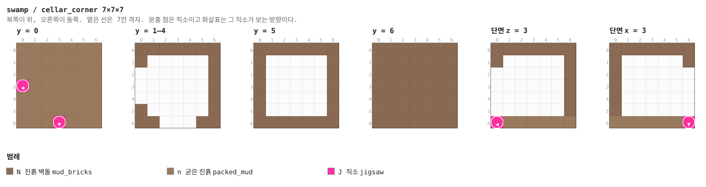

<details><summary>층별 지도 (텍스트)</summary>

```
y = 0   x →동, z ↓남
  nnnnnnn
  nnnnnnn
  nnnnnnn
  Jnnnnnn
  nnnnnnn
  nnnnnnn
  nnnJnnn
y = 1–4   x →동, z ↓남
  NNNNNNN
  N.....N
  ......N
  ......N
  ......N
  N.....N
  NN...NN
y = 5   x →동, z ↓남
  NNNNNNN
  N.....N
  N.....N
  N.....N
  N.....N
  N.....N
  NNNNNNN
y = 6   x →동, z ↓남
  NNNNNNN
  NNNNNNN
  NNNNNNN
  NNNNNNN
  NNNNNNN
  NNNNNNN
  NNNNNNN
```

</details>


### `cellar_cross` — 7×7×7 — 1×1×1 셀

십자 교차로.

**어느 풀에 있나** — `cellar` (가중치 4)

| 직소 위치 | 향 | name | target | pool |
|---|---|---|---|---|
| (3, 0, 0) | ▲ 북 | `swamp_cellar` | `swamp_cellar` | `swamp/cellar` |
| (0, 0, 3) | ◀ 서 | `swamp_cellar` | `swamp_cellar` | `swamp/cellar` |
| (6, 0, 3) | ▶ 동 | `swamp_cellar` | `swamp_cellar` | `swamp/cellar` |
| (3, 0, 6) | ▼ 남 | `swamp_cellar` | `swamp_cellar` | `swamp/cellar` |

**뚫린 면** — 서: z 2–4, y 1–4 (12칸) / 동: z 2–4, y 1–4 (12칸) / 북: x 2–4, y 1–4 (12칸) / 남: x 2–4, y 1–4 (12칸)

**블록** — 진흙 벽돌 121, 굳은 진흙 45, 직소 4

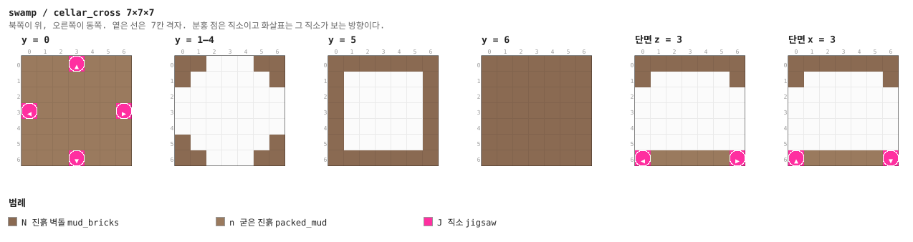

<details><summary>층별 지도 (텍스트)</summary>

```
y = 0   x →동, z ↓남
  nnnJnnn
  nnnnnnn
  nnnnnnn
  JnnnnnJ
  nnnnnnn
  nnnnnnn
  nnnJnnn
y = 1–4   x →동, z ↓남
  NN...NN
  N.....N
  .......
  .......
  .......
  N.....N
  NN...NN
y = 5   x →동, z ↓남
  NNNNNNN
  N.....N
  N.....N
  N.....N
  N.....N
  N.....N
  NNNNNNN
y = 6   x →동, z ↓남
  NNNNNNN
  NNNNNNN
  NNNNNNN
  NNNNNNN
  NNNNNNN
  NNNNNNN
  NNNNNNN
```

</details>


### `cellar_cross_guard` — 7×7×7 — 1×1×1 셀

십자 교차로 한가운데 슬라임 스포너.

**어느 풀에 있나** — `cellar` (가중치 3)

| 직소 위치 | 향 | name | target | pool |
|---|---|---|---|---|
| (3, 0, 0) | ▲ 북 | `swamp_cellar` | `swamp_cellar` | `swamp/cellar` |
| (0, 0, 3) | ◀ 서 | `swamp_cellar` | `swamp_cellar` | `swamp/cellar` |
| (6, 0, 3) | ▶ 동 | `swamp_cellar` | `swamp_cellar` | `swamp/cellar` |
| (3, 0, 6) | ▼ 남 | `swamp_cellar` | `swamp_cellar` | `swamp/cellar` |

**뚫린 면** — 서: z 2–4, y 1–4 (12칸) / 동: z 2–4, y 1–4 (12칸) / 북: x 2–4, y 1–4 (12칸) / 남: x 2–4, y 1–4 (12칸)

**블록** — 진흙 벽돌 121, 굳은 진흙 45, 직소 4, 몬스터 스포너 1

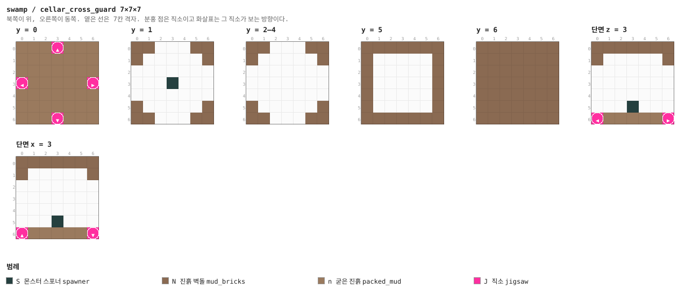

<details><summary>층별 지도 (텍스트)</summary>

```
y = 0   x →동, z ↓남
  nnnJnnn
  nnnnnnn
  nnnnnnn
  JnnnnnJ
  nnnnnnn
  nnnnnnn
  nnnJnnn
y = 1   x →동, z ↓남
  NN...NN
  N.....N
  .......
  ...S...
  .......
  N.....N
  NN...NN
y = 2–4   x →동, z ↓남
  NN...NN
  N.....N
  .......
  .......
  .......
  N.....N
  NN...NN
y = 5   x →동, z ↓남
  NNNNNNN
  N.....N
  N.....N
  N.....N
  N.....N
  N.....N
  NNNNNNN
y = 6   x →동, z ↓남
  NNNNNNN
  NNNNNNN
  NNNNNNN
  NNNNNNN
  NNNNNNN
  NNNNNNN
  NNNNNNN
```

</details>


### `cellar_room` — 7×7×7 — 1×1×1 셀

막다른 방. 문이 하나뿐이니 들어갔다 돌아 나와야 하고, 그래서 **상자가 있다.**
빈 막다른 방은 들어간 값이 없다.

**어느 풀에 있나** — `cellar` (가중치 8)

| 직소 위치 | 향 | name | target | pool |
|---|---|---|---|---|
| (0, 0, 3) | ◀ 서 | `swamp_cellar` | `swamp_cellar` | `swamp/cellar` |

**뚫린 면** — 서: z 2–4, y 1–4 (12칸)

**블록** — 진흙 벽돌 157, 굳은 진흙 48, 이끼 낀 조약돌 5, 직소 1, 가마솥 1, 랜턴 1, 상자 1

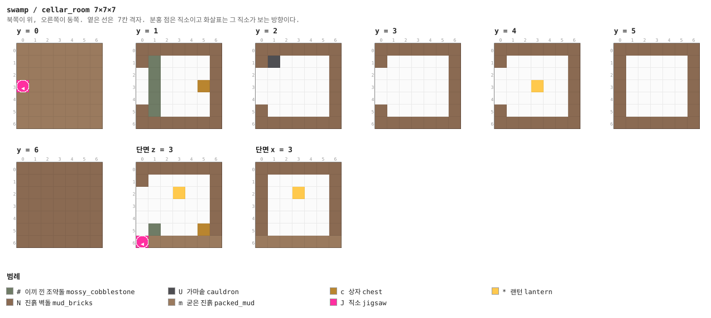

<details><summary>층별 지도 (텍스트)</summary>

```
y = 0   x →동, z ↓남
  nnnnnnn
  nnnnnnn
  nnnnnnn
  Jnnnnnn
  nnnnnnn
  nnnnnnn
  nnnnnnn
y = 1   x →동, z ↓남
  NNNNNNN
  Nn....N
  .n....N
  .n...cN
  .n....N
  Nn....N
  NNNNNNN
y = 2   x →동, z ↓남
  NNNNNNN
  NU....N
  ......N
  ......N
  ......N
  N.....N
  NNNNNNN
y = 3   x →동, z ↓남
  NNNNNNN
  N.....N
  ......N
  ......N
  ......N
  N.....N
  NNNNNNN
y = 4   x →동, z ↓남
  NNNNNNN
  N.....N
  ......N
  ...*..N
  ......N
  N.....N
  NNNNNNN
y = 5   x →동, z ↓남
  NNNNNNN
  N.....N
  N.....N
  N.....N
  N.....N
  N.....N
  NNNNNNN
y = 6   x →동, z ↓남
  NNNNNNN
  NNNNNNN
  NNNNNNN
  NNNNNNN
  NNNNNNN
  NNNNNNN
  NNNNNNN
```

</details>


### `cellar_brew` — 7×7×7 — 1×1×1 셀

양조장. 양조기와 가마솥, 상자 하나(`chests/swamp_brewery`).

**어느 풀에 있나** — `cellar` (가중치 6)

| 직소 위치 | 향 | name | target | pool |
|---|---|---|---|---|
| (0, 0, 3) | ◀ 서 | `swamp_cellar` | `swamp_cellar` | `swamp/cellar` |

**뚫린 면** — 서: z 2–4, y 1–4 (12칸)

**블록** — 진흙 벽돌 157, 굳은 진흙 48, 이끼 낀 조약돌 5, 직소 1, 가마솥 1, 양조기 1, 랜턴 1, 상자 1

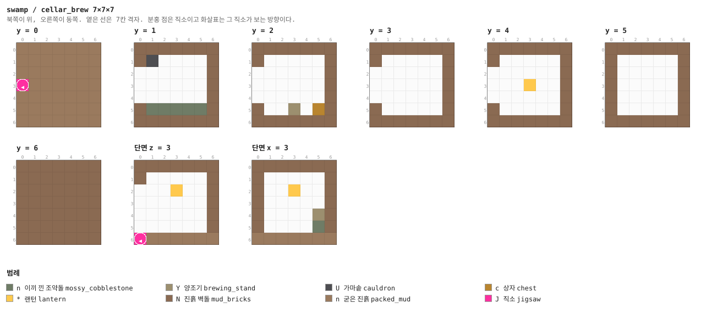

<details><summary>층별 지도 (텍스트)</summary>

```
y = 0   x →동, z ↓남
  nnnnnnn
  nnnnnnn
  nnnnnnn
  Jnnnnnn
  nnnnnnn
  nnnnnnn
  nnnnnnn
y = 1   x →동, z ↓남
  NNNNNNN
  NU....N
  ......N
  ......N
  ......N
  NnnnnnN
  NNNNNNN
y = 2   x →동, z ↓남
  NNNNNNN
  N.....N
  ......N
  ......N
  ......N
  N..Y.cN
  NNNNNNN
y = 3   x →동, z ↓남
  NNNNNNN
  N.....N
  ......N
  ......N
  ......N
  N.....N
  NNNNNNN
y = 4   x →동, z ↓남
  NNNNNNN
  N.....N
  ......N
  ...*..N
  ......N
  N.....N
  NNNNNNN
y = 5   x →동, z ↓남
  NNNNNNN
  N.....N
  N.....N
  N.....N
  N.....N
  N.....N
  NNNNNNN
y = 6   x →동, z ↓남
  NNNNNNN
  NNNNNNN
  NNNNNNN
  NNNNNNN
  NNNNNNN
  NNNNNNN
  NNNNNNN
```

</details>


### `cellar_still` — 7×7×7 — 1×1×1 셀

증류실. 마녀 스포너와 상자.

**어느 풀에 있나** — `cellar` (가중치 5)

| 직소 위치 | 향 | name | target | pool |
|---|---|---|---|---|
| (0, 0, 3) | ◀ 서 | `swamp_cellar` | `swamp_cellar` | `swamp/cellar` |

**뚫린 면** — 서: z 2–4, y 1–4 (12칸)

**블록** — 진흙 벽돌 157, 굳은 진흙 48, 직소 1, 몬스터 스포너 1, 가마솥 1, 상자 1

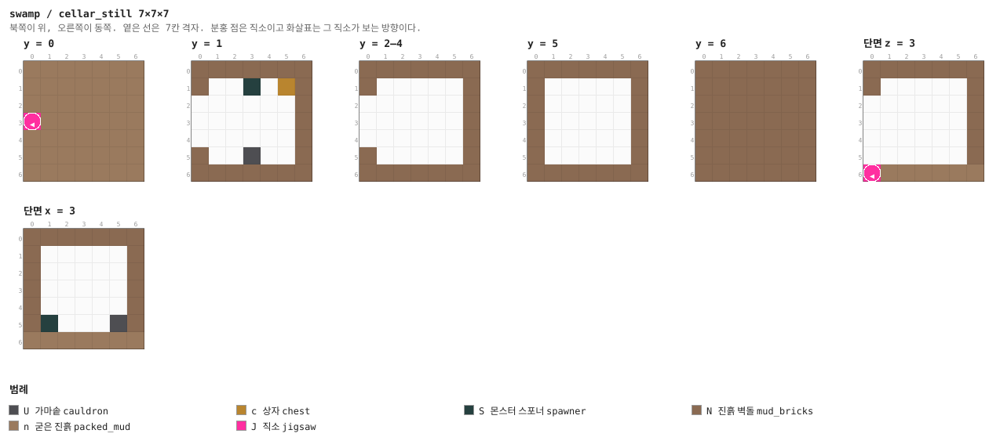

<details><summary>층별 지도 (텍스트)</summary>

```
y = 0   x →동, z ↓남
  nnnnnnn
  nnnnnnn
  nnnnnnn
  Jnnnnnn
  nnnnnnn
  nnnnnnn
  nnnnnnn
y = 1   x →동, z ↓남
  NNNNNNN
  N..S.cN
  ......N
  ......N
  ......N
  N..U..N
  NNNNNNN
y = 2–4   x →동, z ↓남
  NNNNNNN
  N.....N
  ......N
  ......N
  ......N
  N.....N
  NNNNNNN
y = 5   x →동, z ↓남
  NNNNNNN
  N.....N
  N.....N
  N.....N
  N.....N
  N.....N
  NNNNNNN
y = 6   x →동, z ↓남
  NNNNNNN
  NNNNNNN
  NNNNNNN
  NNNNNNN
  NNNNNNN
  NNNNNNN
  NNNNNNN
```

</details>


### `cellar_drowned` — 7×7×7 — 1×1×1 셀

물이 찬 방. 바닥 한 켜가 물이고 가운데 드라운드 스포너가 있다. 지하에서 물을 만나는 유일한
자리다.

**어느 풀에 있나** — `cellar` (가중치 5)

| 직소 위치 | 향 | name | target | pool |
|---|---|---|---|---|
| (0, 0, 3) | ◀ 서 | `swamp_cellar` | `swamp_cellar` | `swamp/cellar` |
| (6, 0, 3) | ▶ 동 | `swamp_cellar` | `swamp_cellar` | `swamp/cellar` |

**뚫린 면** — 서: z 2–4, y 1–4 (12칸) / 동: z 2–4, y 1–4 (12칸)

**블록** — 진흙 벽돌 145, 굳은 진흙 47, 물 24, 직소 2, 진흙 맹그로브 뿌리 1, 몬스터 스포너 1

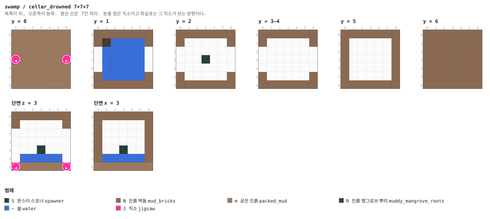

<details><summary>층별 지도 (텍스트)</summary>

```
y = 0   x →동, z ↓남
  nnnnnnn
  nnnnnnn
  nnnnnnn
  JnnnnnJ
  nnnnnnn
  nnnnnnn
  nnnnnnn
y = 1   x →동, z ↓남
  NNNNNNN
  NR~~~~N
  .~~~~~.
  .~~~~~.
  .~~~~~.
  N~~~~~N
  NNNNNNN
y = 2   x →동, z ↓남
  NNNNNNN
  N.....N
  .......
  ...S...
  .......
  N.....N
  NNNNNNN
y = 3–4   x →동, z ↓남
  NNNNNNN
  N.....N
  .......
  .......
  .......
  N.....N
  NNNNNNN
y = 5   x →동, z ↓남
  NNNNNNN
  N.....N
  N.....N
  N.....N
  N.....N
  N.....N
  NNNNNNN
y = 6   x →동, z ↓남
  NNNNNNN
  NNNNNNN
  NNNNNNN
  NNNNNNN
  NNNNNNN
  NNNNNNN
  NNNNNNN
```

</details>


### `cellar_cap` — 1×7×7

두께 1의 진흙 벽돌 벽. 지하 풀의 fallback.

**어느 풀에 있나** — `cellar_caps` (가중치 1)

| 직소 위치 | 향 | name | target | pool |
|---|---|---|---|---|
| (0, 0, 3) | ◀ 서 | `swamp_cellar` | `swamp_cellar` | `swamp/cellar_caps` |

**블록** — 진흙 벽돌 48, 직소 1

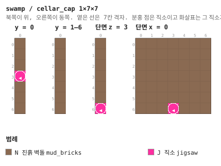

<details><summary>층별 지도 (텍스트)</summary>

```
y = 0   x →동, z ↓남
  N
  N
  N
  J
  N
  N
  N
y = 1–6   x →동, z ↓남
  N
  N
  N
  N
  N
  N
  N
```

</details>


### `approach_1` — 7×7×7 — 1×1×1 셀

보스 사슬의 1번째 칸. **서문만 이름이 `swamp_mother`**이고 동문의 target이 `swamp_mother`다.
부모는 서문으로만 들어올 수 있고 사슬은 서→동 한 방향으로만 흐른다. 북문은 평범한 미로라
보스 가지도 양조장을 낳는다. 우선순위가 10이라 미로보다 먼저 놓인다 (§7).

**어느 풀에 있나** — `mother_approach_1` (가중치 1)

| 직소 위치 | 향 | name | target | pool |
|---|---|---|---|---|
| (3, 0, 0) | ▲ 북 | `swamp_cellar` | `swamp_cellar` | `swamp/cellar` |
| (0, 0, 3) | ◀ 서 | `swamp_mother` | `swamp_cellar` | `swamp/cellar` |
| (6, 0, 3) | ▶ 동 | `swamp_cellar` | `swamp_mother` | `swamp/mother_approach_2` |

**뚫린 면** — 서: z 2–4, y 1–4 (12칸) / 동: z 2–4, y 1–4 (12칸) / 북: x 2–4, y 1–4 (12칸)

**블록** — 진흙 벽돌 133, 굳은 진흙 46, 직소 3

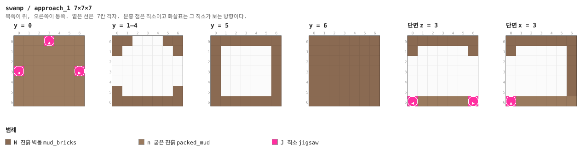

<details><summary>층별 지도 (텍스트)</summary>

```
y = 0   x →동, z ↓남
  nnnJnnn
  nnnnnnn
  nnnnnnn
  JnnnnnJ
  nnnnnnn
  nnnnnnn
  nnnnnnn
y = 1–4   x →동, z ↓남
  NN...NN
  N.....N
  .......
  .......
  .......
  N.....N
  NNNNNNN
y = 5   x →동, z ↓남
  NNNNNNN
  N.....N
  N.....N
  N.....N
  N.....N
  N.....N
  NNNNNNN
y = 6   x →동, z ↓남
  NNNNNNN
  NNNNNNN
  NNNNNNN
  NNNNNNN
  NNNNNNN
  NNNNNNN
  NNNNNNN
```

</details>


### `approach_2` — 7×7×7 — 1×1×1 셀

보스 사슬의 2번째 칸. **서문만 이름이 `swamp_mother`**이고 동문의 target이 `swamp_mother`다.
부모는 서문으로만 들어올 수 있고 사슬은 서→동 한 방향으로만 흐른다. 북문은 평범한 미로라
보스 가지도 양조장을 낳는다. 우선순위가 10이라 미로보다 먼저 놓인다 (§7).

**어느 풀에 있나** — `mother_approach_2` (가중치 1)

| 직소 위치 | 향 | name | target | pool |
|---|---|---|---|---|
| (3, 0, 0) | ▲ 북 | `swamp_cellar` | `swamp_cellar` | `swamp/cellar` |
| (0, 0, 3) | ◀ 서 | `swamp_mother` | `swamp_cellar` | `swamp/cellar` |
| (6, 0, 3) | ▶ 동 | `swamp_cellar` | `swamp_mother` | `swamp/mother_approach_3` |

**뚫린 면** — 서: z 2–4, y 1–4 (12칸) / 동: z 2–4, y 1–4 (12칸) / 북: x 2–4, y 1–4 (12칸)

**블록** — 진흙 벽돌 133, 굳은 진흙 46, 직소 3


<details><summary>층별 지도 (텍스트)</summary>

```
y = 0   x →동, z ↓남
  nnnJnnn
  nnnnnnn
  nnnnnnn
  JnnnnnJ
  nnnnnnn
  nnnnnnn
  nnnnnnn
y = 1–4   x →동, z ↓남
  NN...NN
  N.....N
  .......
  .......
  .......
  N.....N
  NNNNNNN
y = 5   x →동, z ↓남
  NNNNNNN
  N.....N
  N.....N
  N.....N
  N.....N
  N.....N
  NNNNNNN
y = 6   x →동, z ↓남
  NNNNNNN
  NNNNNNN
  NNNNNNN
  NNNNNNN
  NNNNNNN
  NNNNNNN
  NNNNNNN
```

</details>


### `approach_3` — 7×7×7 — 1×1×1 셀

보스 사슬의 3번째 칸. **서문만 이름이 `swamp_mother`**이고 동문의 target이 `swamp_mother`다.
부모는 서문으로만 들어올 수 있고 사슬은 서→동 한 방향으로만 흐른다. 북문은 평범한 미로라
보스 가지도 양조장을 낳는다. 우선순위가 10이라 미로보다 먼저 놓인다 (§7).

**어느 풀에 있나** — `mother_approach` (가중치 1), `mother_approach_3` (가중치 1)

| 직소 위치 | 향 | name | target | pool |
|---|---|---|---|---|
| (3, 0, 0) | ▲ 북 | `swamp_cellar` | `swamp_cellar` | `swamp/cellar` |
| (0, 0, 3) | ◀ 서 | `swamp_mother` | `swamp_cellar` | `swamp/cellar` |
| (6, 0, 3) | ▶ 동 | `swamp_cellar` | `swamp_mother` | `swamp/mother_approach` |

**뚫린 면** — 서: z 2–4, y 1–4 (12칸) / 동: z 2–4, y 1–4 (12칸) / 북: x 2–4, y 1–4 (12칸)

**블록** — 진흙 벽돌 133, 굳은 진흙 46, 직소 3


<details><summary>층별 지도 (텍스트)</summary>

```
y = 0   x →동, z ↓남
  nnnJnnn
  nnnnnnn
  nnnnnnn
  JnnnnnJ
  nnnnnnn
  nnnnnnn
  nnnnnnn
y = 1–4   x →동, z ↓남
  NN...NN
  N.....N
  .......
  .......
  .......
  N.....N
  NNNNNNN
y = 5   x →동, z ↓남
  NNNNNNN
  N.....N
  N.....N
  N.....N
  N.....N
  N.....N
  NNNNNNN
y = 6   x →동, z ↓남
  NNNNNNN
  NNNNNNN
  NNNNNNN
  NNNNNNN
  NNNNNNN
  NNNNNNN
  NNNNNNN
```

</details>


### `mother` — 21×14×21 — 3×2×3 셀

21×14×21. 넓고 낮은 지하 홀이고 가운데가 **물웅덩이**, 그 한가운데 섬 위에 늪의 어머니
트라이얼 스포너가 선다. 네 귀퉁이에 진흙 뿌리 기둥, 사분면마다 경비 스포너 넷
(마녀·슬라임·드라운드 웨이브).

입구는 서쪽 하나뿐이고 나가는 문이 없다. 클리어 판정과 보상은 트라이얼 스포너가 한다 (§7).

확정 보상: **양조기 + 네더 사마귀 8 + 블레이즈 가루 4** + 마법 부여(20~28) 다이아 장비 1 +
유리병 6~9. 네더 사마귀는 **네더보다 먼저** 여기서 나온다 — 그게 이 던전의 존재 이유다.

**어느 풀에 있나** — `mother_approach` (가중치 1)

| 직소 위치 | 향 | name | target | pool |
|---|---|---|---|---|
| (0, 0, 10) | ◀ 서 | `swamp_mother` | `swamp_cellar` | `—` |

**뚫린 면** — 서: z 9–11, y 1–4 (12칸)

**블록** — 진흙 벽돌 1389, 굳은 진흙 384, 진흙 맹그로브 뿌리 192, 물 56, 이끼 낀 조약돌 9, 트라이얼 스포너 5, 랜턴 4, 직소 1

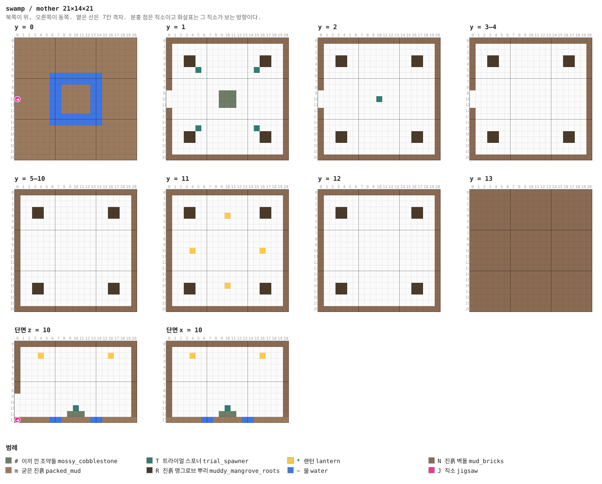

<details><summary>층별 지도 (텍스트)</summary>

```
y = 0   x →동, z ↓남
  nnnnnnnnnnnnnnnnnnnnn
  nnnnnnnnnnnnnnnnnnnnn
  nnnnnnnnnnnnnnnnnnnnn
  nnnnnnnnnnnnnnnnnnnnn
  nnnnnnnnnnnnnnnnnnnnn
  nnnnnnnnnnnnnnnnnnnnn
  nnnnnn~~~~~~~~~nnnnnn
  nnnnnn~~~~~~~~~nnnnnn
  nnnnnn~~nnnnn~~nnnnnn
  nnnnnn~~nnnnn~~nnnnnn
  Jnnnnn~~nnnnn~~nnnnnn
  nnnnnn~~nnnnn~~nnnnnn
  nnnnnn~~nnnnn~~nnnnnn
  nnnnnn~~~~~~~~~nnnnnn
  nnnnnn~~~~~~~~~nnnnnn
  nnnnnnnnnnnnnnnnnnnnn
  nnnnnnnnnnnnnnnnnnnnn
  nnnnnnnnnnnnnnnnnnnnn
  nnnnnnnnnnnnnnnnnnnnn
  nnnnnnnnnnnnnnnnnnnnn
  nnnnnnnnnnnnnnnnnnnnn
y = 1   x →동, z ↓남
  NNNNNNNNNNNNNNNNNNNNN
  N...................N
  N...................N
  N..RR...........RR..N
  N..RR...........RR..N
  N....T.........T....N
  N...................N
  N...................N
  N...................N
  .........nnn........N
  .........nnn........N
  .........nnn........N
  N...................N
  N...................N
  N...................N
  N....T.........T....N
  N..RR...........RR..N
  N..RR...........RR..N
  N...................N
  N...................N
  NNNNNNNNNNNNNNNNNNNNN
y = 2   x →동, z ↓남
  NNNNNNNNNNNNNNNNNNNNN
  N...................N
  N...................N
  N..RR...........RR..N
  N..RR...........RR..N
  N...................N
  N...................N
  N...................N
  N...................N
  ....................N
  ..........T.........N
  ....................N
  N...................N
  N...................N
  N...................N
  N...................N
  N..RR...........RR..N
  N..RR...........RR..N
  N...................N
  N...................N
  NNNNNNNNNNNNNNNNNNNNN
y = 3–4   x →동, z ↓남
  NNNNNNNNNNNNNNNNNNNNN
  N...................N
  N...................N
  N..RR...........RR..N
  N..RR...........RR..N
  N...................N
  N...................N
  N...................N
  N...................N
  ....................N
  ....................N
  ....................N
  N...................N
  N...................N
  N...................N
  N...................N
  N..RR...........RR..N
  N..RR...........RR..N
  N...................N
  N...................N
  NNNNNNNNNNNNNNNNNNNNN
y = 5–10   x →동, z ↓남
  NNNNNNNNNNNNNNNNNNNNN
  N...................N
  N...................N
  N..RR...........RR..N
  N..RR...........RR..N
  N...................N
  N...................N
  N...................N
  N...................N
  N...................N
  N...................N
  N...................N
  N...................N
  N...................N
  N...................N
  N...................N
  N..RR...........RR..N
  N..RR...........RR..N
  N...................N
  N...................N
  NNNNNNNNNNNNNNNNNNNNN
y = 11   x →동, z ↓남
  NNNNNNNNNNNNNNNNNNNNN
  N...................N
  N...................N
  N..RR...........RR..N
  N..RR.....*.....RR..N
  N...................N
  N...................N
  N...................N
  N...................N
  N...................N
  N...*...........*...N
  N...................N
  N...................N
  N...................N
  N...................N
  N...................N
  N..RR.....*.....RR..N
  N..RR...........RR..N
  N...................N
  N...................N
  NNNNNNNNNNNNNNNNNNNNN
y = 12   x →동, z ↓남
  NNNNNNNNNNNNNNNNNNNNN
  N...................N
  N...................N
  N..RR...........RR..N
  N..RR...........RR..N
  N...................N
  N...................N
  N...................N
  N...................N
  N...................N
  N...................N
  N...................N
  N...................N
  N...................N
  N...................N
  N...................N
  N..RR...........RR..N
  N..RR...........RR..N
  N...................N
  N...................N
  NNNNNNNNNNNNNNNNNNNNN
y = 13   x →동, z ↓남
  NNNNNNNNNNNNNNNNNNNNN
  NNNNNNNNNNNNNNNNNNNNN
  NNNNNNNNNNNNNNNNNNNNN
  NNNNNNNNNNNNNNNNNNNNN
  NNNNNNNNNNNNNNNNNNNNN
  NNNNNNNNNNNNNNNNNNNNN
  NNNNNNNNNNNNNNNNNNNNN
  NNNNNNNNNNNNNNNNNNNNN
  NNNNNNNNNNNNNNNNNNNNN
  NNNNNNNNNNNNNNNNNNNNN
  NNNNNNNNNNNNNNNNNNNNN
  NNNNNNNNNNNNNNNNNNNNN
  NNNNNNNNNNNNNNNNNNNNN
  NNNNNNNNNNNNNNNNNNNNN
  NNNNNNNNNNNNNNNNNNNNN
  NNNNNNNNNNNNNNNNNNNNN
  NNNNNNNNNNNNNNNNNNNNN
  NNNNNNNNNNNNNNNNNNNNN
  NNNNNNNNNNNNNNNNNNNNN
  NNNNNNNNNNNNNNNNNNNNN
  NNNNNNNNNNNNNNNNNNNNN
```

</details>

<details><summary>세로 단면 (텍스트)</summary>

```
단면 z = 10   x →동, y ↑하늘
  NNNNNNNNNNNNNNNNNNNNN
  N...................N
  N...*...........*...N
  N...................N
  N...................N
  N...................N
  N...................N
  N...................N
  N...................N
  ....................N
  ....................N
  ..........T.........N
  .........nnn........N
  Jnnnnn~~nnnnn~~nnnnnn
단면 x = 10   z →남, y ↑하늘
  NNNNNNNNNNNNNNNNNNNNN
  N...................N
  N...*...........*...N
  N...................N
  N...................N
  N...................N
  N...................N
  N...................N
  N...................N
  N...................N
  N...................N
  N.........T.........N
  N........nnn........N
  nnnnnn~~nnnnn~~nnnnnn
```

</details>


## 다듬을 곳

**코드가 지은 첫 판이다.** 탑에서 배운 대로, 조각은 출발점이고 예쁘게 만드는 일은 개발
클라이언트에서 한다 (`CLAUDE.md` §16). `python tools/workshop.py swamp`로 전부 깔린다.

- **오두막이 세 종류뿐이다** — 상자·마녀·슬라임. 전부 같은 상자 모양에 안에 든 것만 다르다
- **널다리가 밋밋하다.** 판자와 난간, 등불 둘이 전부다. 등불·그물·말린 생선·보트가 걸릴 자리가
  많다
- **독 안개가 없다.** 콘셉트에는 있었는데, 트리거 없이 독을 주는 방법이 마땅치 않았다
  (§12 — 밟는 함정은 몹이 먼저 밟는다). 마녀 스포너가 대신하고 있다
- **물속 통로가 없다.** 드라운드는 지하의 물웅덩이 방에만 있다. 늪 물 밑으로 지나는 길이
  있으면 좋겠는데, 그건 수직통로처럼 물을 밀어내는 조각이 따로 필요하다
- **큰 오두막이 한 층이다.** 21×21인데 높이가 널다리와 같아서 넓기만 하고 낮다
