# 레벨 설계 — 덩굴에 삼킨 신전

> 이 문서는 `python tools/gen_level_doc.py temple`가 만든다. 조각을 고치면 다시 돌린다. 그림과 표는 게임이 읽는 파일(`structure/temple/*.nbt`, `worldgen/**`)에서 그대로 읽어 온 것이라 모드와 어긋날 수 없다. 설명 문장만 사람이 쓴다 (`tools/gen_level_doc.py`의 `INTRO`·`NOTES`).

## 1. 한눈에

정글에 선 밑변 63칸, 높이 35칸의 **계단식 지구라트**다. 남면에 대계단이 꼭대기까지 이어지고,
북면의 문으로 들어가면 이끼 조약돌 미로가 시작된다. 미로 가운데 **우물**에서 아래로는 물이 흐르는
**수로**가, 위로는 **환영술사 사제의 홀**이 있다. 세 층이 같은 사다리 하나로 이어진다.

**한 판:** 북면 문 → 스파인 셋 → 우물 → (아래) 물살 수로와 철문 보물방 → (위) 21×14×21 홀의
사제. 이기면 **마법 부여 다이아 무기 1 + 행운 III 책**이 확정이다. 꼭대기 사당은 **밖에서
대계단으로** 올라가면 그냥 준다 — 던전에 들어가지 않아도 상자 하나는 먹을 수 있다.

| 항목 | 값 |
|---|---|
| 생성 단계 | `surface_structures` |
| 바이옴 | `#sydungeon:has_structure/temple` |
| 간격 / 최소거리 | spacing 36 / separation 12 |
| 직소 깊이 | 16 ~ 22 (`sydungeon:ranged_jigsaw`) |
| 시작 풀 | `start` |
| 조각 / 풀 | 27개 / 15개 |

## 2. 조립 원리

### 울타리는 피라미드와 같고, 상자는 하나다

실루엣을 지키는 방법은 대피라미드와 같다 (`CLAUDE.md` §10). **직소가 자기 조각의 상자 안쪽을
가리키면 자식은 전역 공간이 아니라 그 상자로 판정되고, 그 상자는 자손에게 상속된다** (§19).
그래서 미로는 `core` 밖으로 못 나간다.

다른 것은 이 신전이 **반은 지하**라는 점이다. 상속되는 울타리는 한 번 들어가면 못 나오므로,
지하를 따로 매달 수가 없다 — **기초를 같은 껍데기 조각에 넣었다.** `skin_base`는 14켜고 그중
일곱 켜가 정글 바닥 아래다. 마른 미로(`core`)와 젖은 미로(`core_deep`)가 **둘 다 그 하나의
상자 안에** 매달린다.

```
skin_base 63×14×63  ─안쪽→ core      49×7×49   마른 미로 + 우물까지의 스파인
                    ─안쪽→ core_deep 49×7×49   물살 수로
skin_mid  49×21×49  ─안쪽→ vault     21×14×21  사제의 홀
shrine     7× 7× 7                             꼭대기. 밖에서 올라간다
```

### 세 층이 같은 기둥을 쓴다

우물(마른 미로 한가운데)의 바닥 구멍이 수로로, 천장 구멍이 홀로 이어진다. 세 조각이 **각자 제
좌표에서 같은 `SHAFT`를 파낸다** — 직소가 아니라 결정적 기하다 (§11). 앵커 하나로 이어진 조각은
언제나 같은 상대 위치에 놓이기 때문이다.

사다리는 **남쪽 벽에 붙고, 문 자리에서 한 칸 비켜** 있다. 문은 벽에 난 구멍이라 그 자리에
사다리를 걸면 걸 데가 없어진다 — 얼음 성채에서 배운 것이다. `verify()`가 −6부터 7까지 기둥을
타고 올라가며 칸마다 확인한다.

### 트리거가 있는 함정은 없다

콘셉트에는 트립와이어 화살 발사기가 있었다. 몹은 누구 발인지 가리지 않으므로(§12) **플레이어가
오기 전에 다 터진다.** 그래서 **플레이어만 발동시킬 수 있는 것**으로 바꿨다.

- **좀벌레 돌** — 캐야 나온다. 캐는 것은 플레이어뿐이다
- **수상한 자갈** — 솔질도 플레이어뿐이다
- **레버로 여는 철문 보물방** — 몹은 압력판은 밟지만 **레버는 못 당긴다.** 바닐라 정글 사원의
  레버 퍼즐이 이것이고, 레드스톤 배선 없이 레버를 문 옆에 붙이면 확실히 작동한다
- **물살 수로** — 트리거가 아예 없다. 늘 흐르고 있고, 몹도 같이 떠내려간다

### 대계단은 남면, 문은 북면

둘을 같은 면에 두면 서로를 파낸다. 대계단은 테라스마다 한 구간씩 **남면에 새겨서** 정글 바닥에서
꼭대기 사당까지 이어지고(층마다 7칸씩 안으로 들어가며 7칸 오른다), 들어가는 문은 북면이다.

## 3. 풀 배선

풀이 어떤 조각을 내놓는지(실선, 숫자는 가중치)와 그 조각의 직소가 다시 어떤 풀을 부르는지(점선)다. 직소 생성은 이 그래프를 깊이만큼 따라간다.

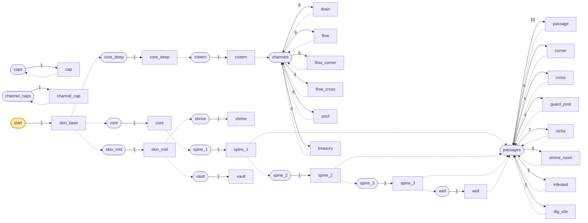
```mermaid
flowchart LR
  P_caps(["caps"])
  P_channel_caps(["channel_caps"])
  P_channels(["channels"])
  P_cistern(["cistern"])
  P_core(["core"])
  P_core_deep(["core_deep"])
  P_passages(["passages"])
  P_shrine(["shrine"])
  P_skin_mid(["skin_mid"])
  P_spine_1(["spine_1"])
  P_spine_2(["spine_2"])
  P_spine_3(["spine_3"])
  P_start(["start"])
  P_vault(["vault"])
  P_well(["well"])
  E_cap["cap"]
  E_channel_cap["channel_cap"]
  E_cistern["cistern"]
  E_core["core"]
  E_core_deep["core_deep"]
  E_corner["corner"]
  E_cross["cross"]
  E_dig_site["dig_site"]
  E_drain["drain"]
  E_flow["flow"]
  E_flow_corner["flow_corner"]
  E_flow_cross["flow_cross"]
  E_guard_post["guard_post"]
  E_infested["infested"]
  E_niche["niche"]
  E_passage["passage"]
  E_pool["pool"]
  E_shrine["shrine"]
  E_shrine_room["shrine_room"]
  E_skin_base["skin_base"]
  E_skin_mid["skin_mid"]
  E_spine_1["spine_1"]
  E_spine_2["spine_2"]
  E_spine_3["spine_3"]
  E_treasury["treasury"]
  E_vault["vault"]
  E_well["well"]
  P_caps -- 1 --> E_cap
  P_channel_caps -- 1 --> E_channel_cap
  P_channels -- 9 --> E_flow
  P_channels -- 9 --> E_flow_corner
  P_channels -- 4 --> E_flow_cross
  P_channels -- 6 --> E_pool
  P_channels -- 6 --> E_drain
  P_channels -- 4 --> E_treasury
  P_cistern -- 1 --> E_cistern
  P_core -- 1 --> E_core
  P_core_deep -- 1 --> E_core_deep
  P_passages -- 10 --> E_passage
  P_passages -- 9 --> E_corner
  P_passages -- 5 --> E_cross
  P_passages -- 4 --> E_guard_post
  P_passages -- 7 --> E_niche
  P_passages -- 5 --> E_shrine_room
  P_passages -- 5 --> E_infested
  P_passages -- 5 --> E_dig_site
  P_shrine -- 1 --> E_shrine
  P_skin_mid -- 1 --> E_skin_mid
  P_spine_1 -- 1 --> E_spine_1
  P_spine_2 -- 1 --> E_spine_2
  P_spine_3 -- 1 --> E_spine_3
  P_start -- 1 --> E_skin_base
  P_vault -- 1 --> E_vault
  P_well -- 1 --> E_well
  E_cap -.-> P_caps
  E_channel_cap -.-> P_channel_caps
  E_cistern -.-> P_channels
  E_core -.-> P_spine_1
  E_core_deep -.-> P_cistern
  E_corner -.-> P_passages
  E_cross -.-> P_passages
  E_dig_site -.-> P_passages
  E_drain -.-> P_channels
  E_flow -.-> P_channels
  E_flow_corner -.-> P_channels
  E_flow_cross -.-> P_channels
  E_guard_post -.-> P_passages
  E_infested -.-> P_passages
  E_niche -.-> P_passages
  E_passage -.-> P_passages
  E_pool -.-> P_channels
  E_shrine_room -.-> P_passages
  E_skin_base -.-> P_core_deep
  E_skin_base -.-> P_core
  E_skin_base -.-> P_skin_mid
  E_skin_mid -.-> P_vault
  E_skin_mid -.-> P_shrine
  E_spine_1 -.-> P_spine_2
  E_spine_1 -.-> P_passages
  E_spine_2 -.-> P_passages
  E_spine_2 -.-> P_spine_3
  E_spine_3 -.-> P_passages
  E_spine_3 -.-> P_well
  E_treasury -.-> P_channels
  E_well -.-> P_passages
  P_start:::start
  classDef start fill:#ffe9a8,stroke:#c99a00,stroke-width:2px
```

| 풀 | fallback | 원소 (가중치) |
|---|---|---|
| `caps` | `minecraft:empty` | `cap` 1 |
| `channel_caps` | `minecraft:empty` | `channel_cap` 1 |
| `channels` | `channel_caps` | `flow` 9, `flow_corner` 9, `flow_cross` 4, `pool` 6, `drain` 6, `treasury` 4 |
| `cistern` | `minecraft:empty` | `cistern` 1 |
| `core` | `minecraft:empty` | `core` 1 |
| `core_deep` | `minecraft:empty` | `core_deep` 1 |
| `passages` | `caps` | `passage` 10, `corner` 9, `cross` 5, `guard_post` 4, `niche` 7, `shrine_room` 5, `infested` 5, `dig_site` 5 |
| `shrine` | `minecraft:empty` | `shrine` 1 |
| `skin_mid` | `minecraft:empty` | `skin_mid` 1 |
| `spine_1` | `minecraft:empty` | `spine_1` 1 |
| `spine_2` | `minecraft:empty` | `spine_2` 1 |
| `spine_3` | `minecraft:empty` | `spine_3` 1 |
| `start` | `minecraft:empty` | `skin_base` 1 |
| `vault` | `minecraft:empty` | `vault` 1 |
| `well` | `minecraft:empty` | `well` 1 |

## 4. 뼈대 — 반드시 이렇게 놓이는 부분

껍데기 둘과 그 안에 매달린 것들, 그리고 우물까지의 스파인. **원소가 하나뿐인 풀로 놓이는
것만** 그렸다. 두 미로는 판마다 다르다. 사다리가 수로 바닥(y=−6)에서 홀 바닥(y=7)까지 한 줄로
이어지는 것이 단면에 보인다.

| 조각 | 놓이는 자리 (시작 조각 기준) | 누가 놓나 |
|---|---|---|
| `skin_base` | (0, 0, 0) | 시작 풀 |
| `core_deep` | (7, 0, 7) | skin_base의 동 tpl_door 직소 |
| `core` | (7, 7, 7) | skin_base의 동 tpl_door 직소 |
| `skin_mid` | (7, 14, 7) | skin_base의 위 tpl_door 직소 |
| `cistern` | (28, 0, 28) | core_deep의 동 tpl_flow 직소 |
| `spine_1` | (28, 7, 7) | core의 동 tpl_door 직소 |
| `vault` | (21, 14, 21) | skin_mid의 동 tpl_door 직소 |
| `shrine` | (28, 35, 28) | skin_mid의 위 tpl_door 직소 |
| `spine_2` | (28, 7, 14) | spine_1의 남 tpl_door 직소 |
| `spine_3` | (28, 7, 21) | spine_2의 남 tpl_door 직소 |
| `well` | (28, 7, 28) | spine_3의 남 tpl_door 직소 |

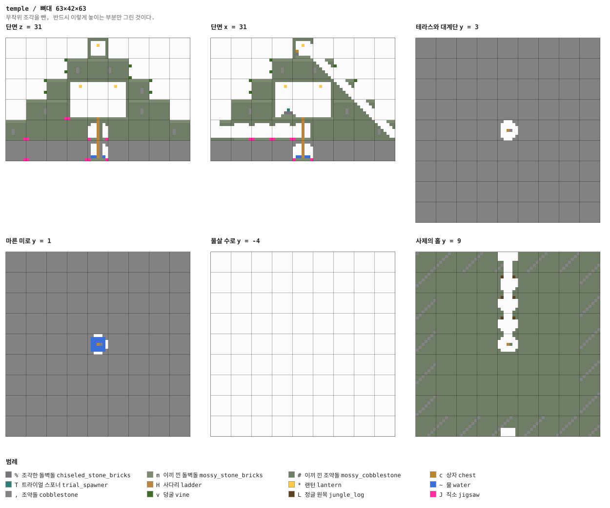

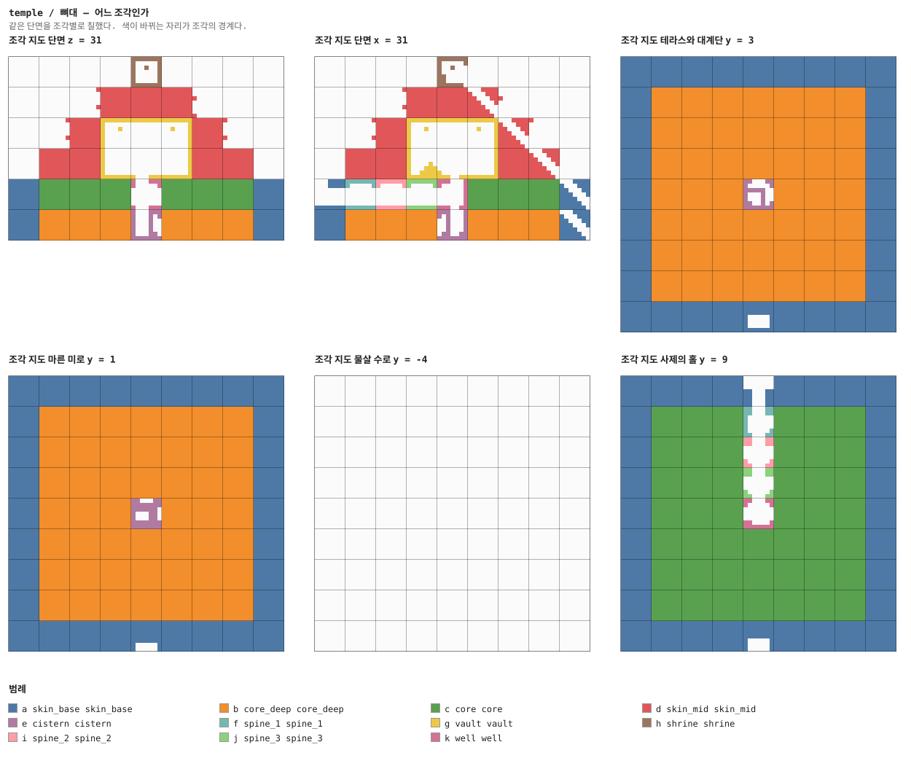

## 5. 조각


그림은 조각 하나를 **층마다 한 장씩** 블록 단위로 그린 것이다. 같은 층이 이어지면 `y = 2–5`처럼 묶었고, 마지막 두 장은 가운데를 자른 세로 단면이다. 분홍 점이 직소, 화살표가 그 직소가 보는 방향이다 — **마주 본 직소끼리만 붙는다.**

### `skin_base` — 63×14×63 — 9×2×9 셀

아래쪽 테라스와 **그 밑 일곱 켜의 기초**를 한 조각에 담았다. 기초가 같은 상자에 있어야 젖은
미로도 이 상자 안에 매달 수 있다 — 울타리는 상속되고, 한 번 들어가면 나올 수 없다 (§19).

북면에 들어가는 문이, 남면에 대계단의 첫 구간이 새겨져 있다. 실루엣 밖은 **아무것도 쓰지 않아서**
정글의 흙과 풀이 테라스에 그대로 붙는다 (§2).

**어느 풀에 있나** — `start` (가중치 1)

| 직소 위치 | 향 | name | target | pool |
|---|---|---|---|---|
| (6, 0, 31) | ▶ 동 | `tpl_door` | `tpl_anchor` | `temple/core_deep` |
| (6, 7, 31) | ▶ 동 | `tpl_door` | `tpl_anchor` | `temple/core` |
| (7, 13, 7) | ◆ 위 | `tpl_door` | `tpl_anchor` | `temple/skin_mid` |

**뚫린 면** — 북: x 28–34, y 8–13 (42칸) / 남: x 29–33, y 8–10 (15칸) / 위: x 28–34, z 0–59 (41칸)

**블록** — 조약돌 28493, 이끼 낀 조약돌 22864, 이끼 낀 돌벽돌 3927, 직소 3

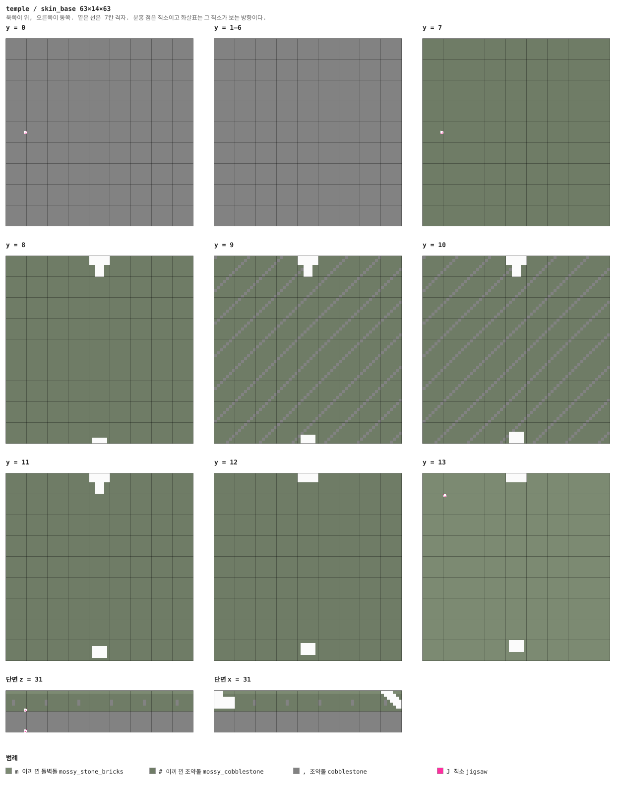


### `skin_mid` — 49×21×49 — 7×3×7 셀

2~4번째 테라스. 남면에 대계단이 이어지고, 안쪽에 사제의 홀이 매달린다.

**어느 풀에 있나** — `skin_mid` (가중치 1)

| 직소 위치 | 향 | name | target | pool |
|---|---|---|---|---|
| (0, 0, 0) | ◇ 아래 | `tpl_anchor` | `tpl_anchor` | `—` |
| (13, 0, 24) | ▶ 동 | `tpl_door` | `tpl_anchor` | `temple/vault` |
| (21, 20, 21) | ◆ 위 | `tpl_door` | `tpl_anchor` | `temple/shrine` |

**뚫린 면** — 서: z 0–48, y 7–20 (686칸) / 동: z 0–48, y 7–20 (686칸) / 북: x 0–48, y 7–20 (686칸) / 남: x 0–48, y 0–20 (706칸) / 아래: x 22–26, z 48–48 (5칸) / 위: x 0–48, z 0–48 (1958칸)

**블록** — 이끼 낀 조약돌 23403, 이끼 낀 돌벽돌 4006, 조약돌 727, 덩굴 382, 직소 3

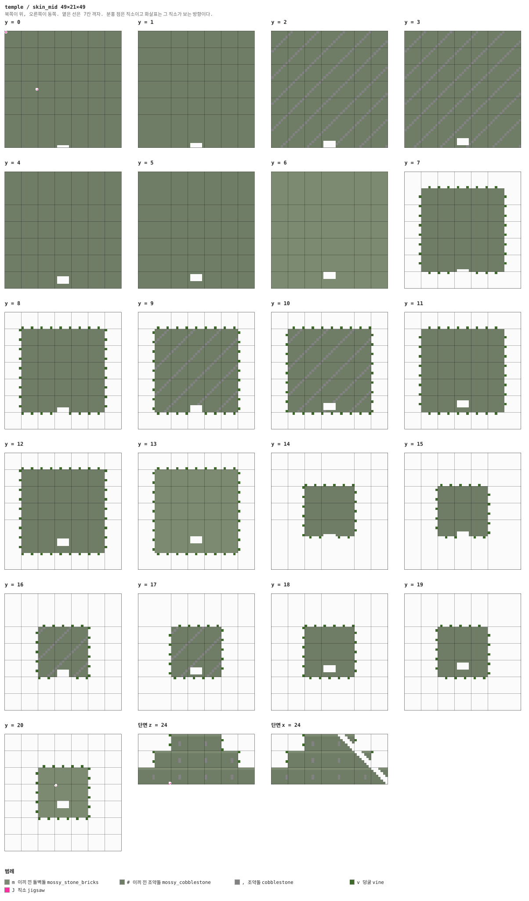


### `shrine` — 7×7×7 — 1×1×1 셀

꼭대기 사당. 7×7×7이고 문이 남쪽 하나뿐인데, 그 문으로 오는 길은 **대계단**이다. 던전에 들어가지
않아도 이 상자 하나는 열 수 있다 — 지구라트를 올라가 볼 이유가 있어야 한다.

**어느 풀에 있나** — `shrine` (가중치 1)

| 직소 위치 | 향 | name | target | pool |
|---|---|---|---|---|
| (0, 0, 0) | ◇ 아래 | `tpl_anchor` | `tpl_anchor` | `—` |

**뚫린 면** — 남: x 2–4, y 0–4 (15칸) / 아래: x 2–4, z 6–6 (3칸)

**블록** — 이끼 낀 조약돌 177, 이끼 낀 돌벽돌 25, 정글 원목 4, 직소 1, 조각한 돌벽돌 1, 상자 1, 랜턴 1

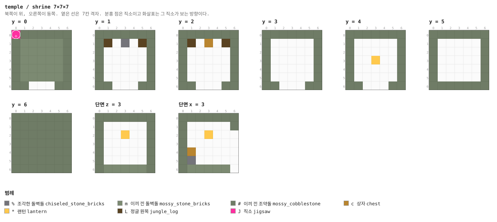

<details><summary>층별 지도 (텍스트)</summary>

```
y = 0   x →동, z ↓남
  J######
  #mmmmm#
  #mmmmm#
  #mmmmm#
  #mmmmm#
  #mmmmm#
  ##...##
y = 1   x →동, z ↓남
  #######
  #L.%.L#
  #.....#
  #.....#
  #.....#
  #.....#
  ##...##
y = 2   x →동, z ↓남
  #######
  #L.c.L#
  #.....#
  #.....#
  #.....#
  #.....#
  ##...##
y = 3   x →동, z ↓남
  #######
  #.....#
  #.....#
  #.....#
  #.....#
  #.....#
  ##...##
y = 4   x →동, z ↓남
  #######
  #.....#
  #.....#
  #..*..#
  #.....#
  #.....#
  ##...##
y = 5   x →동, z ↓남
  #######
  #.....#
  #.....#
  #.....#
  #.....#
  #.....#
  #######
y = 6   x →동, z ↓남
  #######
  #######
  #######
  #######
  #######
  #######
  #######
```

</details>


### `core` — 49×7×49 — 7×1×7 셀

49×7×49 통짜 이끼 조약돌. 7×7 = 49칸이고 미로가 파낸다. 북쪽 가장자리 가운데에 직소가 하나
있어 스파인을 부르고, **그 직소가 이 상자 안쪽을 가리키므로** 미로 전체가 이 상자에 갇힌다.

**어느 풀에 있나** — `core` (가중치 1)

| 직소 위치 | 향 | name | target | pool |
|---|---|---|---|---|
| (20, 0, 3) | ▶ 동 | `tpl_door` | `tpl_anchor` | `temple/spine_1` |
| (0, 0, 24) | ◀ 서 | `tpl_anchor` | `tpl_anchor` | `—` |

**블록** — 이끼 낀 조약돌 16805, 직소 2

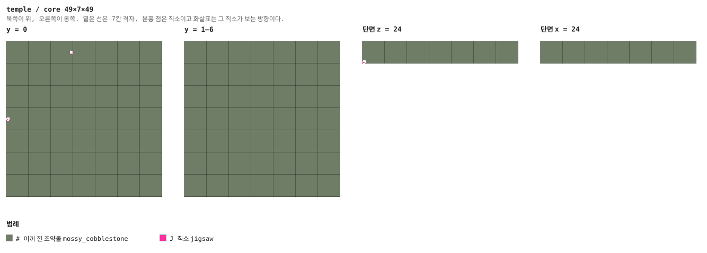


### `core_deep` — 49×7×49 — 7×1×7 셀

같은 것이 기초 안에 하나 더. 여기서 자라는 것은 물살 수로다.

**어느 풀에 있나** — `core_deep` (가중치 1)

| 직소 위치 | 향 | name | target | pool |
|---|---|---|---|---|
| (0, 0, 24) | ◀ 서 | `tpl_anchor` | `tpl_anchor` | `—` |
| (20, 0, 24) | ▶ 동 | `tpl_flow` | `tpl_anchor` | `temple/cistern` |

**블록** — 조약돌 16805, 직소 2

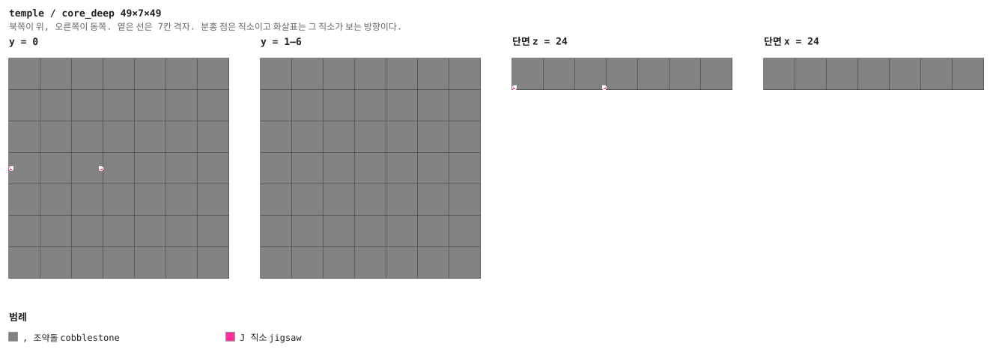


### `spine_1` — 7×7×7 — 1×1×1 셀

들어가는 길의 1번째 칸. **북문만 이름이 `tpl_spine`**이고 남문의 target이 `tpl_spine`이라,
미로가 사슬에 끼어들어 방향을 돌릴 수 없다 (§13). 서·동문은 평범한 미로라 스파인도 미로를 낳는다.

**어느 풀에 있나** — `spine_1` (가중치 1)

| 직소 위치 | 향 | name | target | pool |
|---|---|---|---|---|
| (0, 0, 3) | ◀ 서 | `tpl_anchor` | `tpl_anchor` | `—` |
| (6, 0, 3) | ▶ 동 | `tpl_door` | `tpl_door` | `temple/passages` |
| (3, 0, 6) | ▼ 남 | `tpl_door` | `tpl_spine` | `temple/spine_2` |

**뚫린 면** — 동: z 2–4, y 1–4 (12칸) / 북: x 2–4, y 1–4 (12칸) / 남: x 2–4, y 1–4 (12칸)

**블록** — 이끼 낀 조약돌 154, 이끼 낀 돌벽돌 25, 정글 원목 4, 직소 3

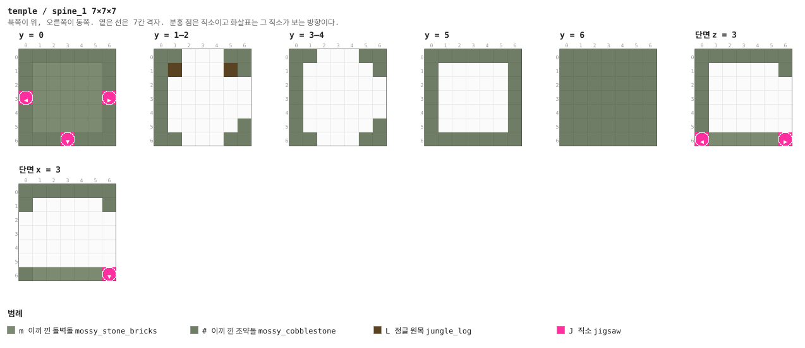

<details><summary>층별 지도 (텍스트)</summary>

```
y = 0   x →동, z ↓남
  #######
  #mmmmm#
  #mmmmm#
  JmmmmmJ
  #mmmmm#
  #mmmmm#
  ###J###
y = 1–2   x →동, z ↓남
  ##...##
  #L...L#
  #......
  #......
  #......
  #.....#
  ##...##
y = 3–4   x →동, z ↓남
  ##...##
  #.....#
  #......
  #......
  #......
  #.....#
  ##...##
y = 5   x →동, z ↓남
  #######
  #.....#
  #.....#
  #.....#
  #.....#
  #.....#
  #######
y = 6   x →동, z ↓남
  #######
  #######
  #######
  #######
  #######
  #######
  #######
```

</details>


### `spine_2` — 7×7×7 — 1×1×1 셀

들어가는 길의 2번째 칸. **북문만 이름이 `tpl_spine`**이고 남문의 target이 `tpl_spine`이라,
미로가 사슬에 끼어들어 방향을 돌릴 수 없다 (§13). 서·동문은 평범한 미로라 스파인도 미로를 낳는다.

**어느 풀에 있나** — `spine_2` (가중치 1)

| 직소 위치 | 향 | name | target | pool |
|---|---|---|---|---|
| (3, 0, 0) | ▲ 북 | `tpl_spine` | `tpl_spine` | `—` |
| (0, 0, 3) | ◀ 서 | `tpl_door` | `tpl_door` | `temple/passages` |
| (6, 0, 3) | ▶ 동 | `tpl_door` | `tpl_door` | `temple/passages` |
| (3, 0, 6) | ▼ 남 | `tpl_door` | `tpl_spine` | `temple/spine_3` |

**뚫린 면** — 서: z 2–4, y 1–4 (12칸) / 동: z 2–4, y 1–4 (12칸) / 북: x 2–4, y 1–4 (12칸) / 남: x 2–4, y 1–4 (12칸)

**블록** — 이끼 낀 조약돌 141, 이끼 낀 돌벽돌 25, 직소 4, 정글 원목 4

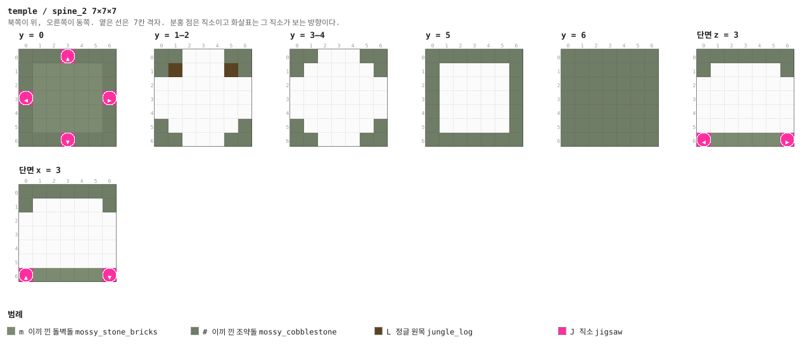

<details><summary>층별 지도 (텍스트)</summary>

```
y = 0   x →동, z ↓남
  ###J###
  #mmmmm#
  #mmmmm#
  JmmmmmJ
  #mmmmm#
  #mmmmm#
  ###J###
y = 1–2   x →동, z ↓남
  ##...##
  #L...L#
  .......
  .......
  .......
  #.....#
  ##...##
y = 3–4   x →동, z ↓남
  ##...##
  #.....#
  .......
  .......
  .......
  #.....#
  ##...##
y = 5   x →동, z ↓남
  #######
  #.....#
  #.....#
  #.....#
  #.....#
  #.....#
  #######
y = 6   x →동, z ↓남
  #######
  #######
  #######
  #######
  #######
  #######
  #######
```

</details>


### `well` — 7×7×7 — 1×1×1 셀

세 층이 만나는 곳. 스파인이 북쪽으로 들어오고, 바닥 구멍이 수로로, 천장 구멍이 사제의 홀로
이어진다. 세 조각이 같은 `SHAFT` 좌표를 각자 파내는 것이라 직소가 필요 없다 (§11).

**어느 풀에 있나** — `well` (가중치 1)

| 직소 위치 | 향 | name | target | pool |
|---|---|---|---|---|
| (3, 0, 0) | ▲ 북 | `tpl_spine` | `tpl_spine` | `—` |
| (0, 0, 3) | ◀ 서 | `tpl_door` | `tpl_door` | `temple/passages` |
| (6, 0, 3) | ▶ 동 | `tpl_door` | `tpl_door` | `temple/passages` |

**뚫린 면** — 서: z 2–4, y 1–4 (12칸) / 동: z 2–4, y 1–4 (12칸) / 북: x 2–4, y 1–4 (12칸)

**블록** — 이끼 낀 조약돌 159, 이끼 낀 돌벽돌 23, 사다리 7, 직소 3, 정글 원목 2, 랜턴 1

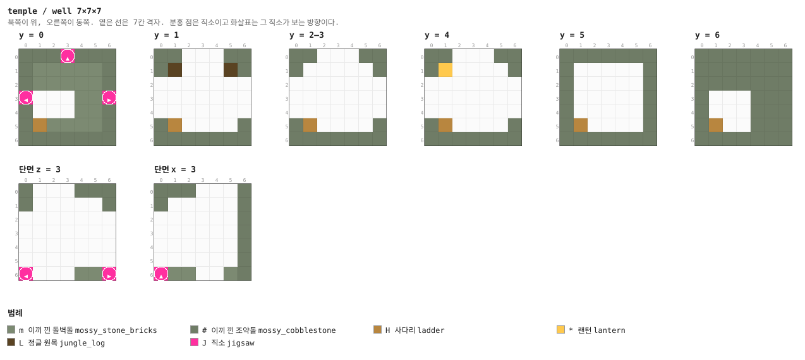

<details><summary>층별 지도 (텍스트)</summary>

```
y = 0   x →동, z ↓남
  ###J###
  #mmmmm#
  #mmmmm#
  JmmH#mJ
  #mmmmm#
  #mmmmm#
  #######
y = 1   x →동, z ↓남
  ##...##
  #L...L#
  .......
  ...H#..
  .......
  #.....#
  #######
y = 2–3   x →동, z ↓남
  ##...##
  #.....#
  .......
  ...H#..
  .......
  #.....#
  #######
y = 4   x →동, z ↓남
  ##...##
  #*....#
  .......
  ...H#..
  .......
  #.....#
  #######
y = 5   x →동, z ↓남
  #######
  #.....#
  #.....#
  #..H#.#
  #.....#
  #.....#
  #######
y = 6   x →동, z ↓남
  #######
  #######
  #######
  ###H###
  #######
  #######
  #######
```

</details>


### `cistern` — 7×7×7 — 1×1×1 셀

우물 밑의 수조. 사방으로 수로가 뻗고, 사다리 발치만 물이 걷혀 있다.

**어느 풀에 있나** — `cistern` (가중치 1)

| 직소 위치 | 향 | name | target | pool |
|---|---|---|---|---|
| (3, 0, 0) | ▲ 북 | `tpl_flow` | `tpl_flow` | `temple/channels` |
| (0, 0, 3) | ◀ 서 | `tpl_anchor` | `tpl_anchor` | `—` |
| (6, 0, 3) | ▶ 동 | `tpl_flow` | `tpl_flow` | `temple/channels` |
| (3, 0, 6) | ▼ 남 | `tpl_flow` | `tpl_flow` | `temple/channels` |

**뚫린 면** — 동: z 2–4, y 1–4 (12칸) / 북: x 2–4, y 1–4 (12칸) / 남: x 2–4, y 1–4 (12칸)

**블록** — 조약돌 157, 이끼 낀 돌벽돌 25, 물 23, 사다리 6, 직소 4

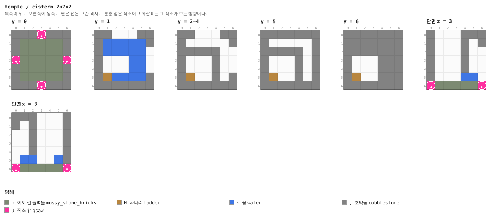

<details><summary>층별 지도 (텍스트)</summary>

```
y = 0   x →동, z ↓남
  ,,,J,,,
  ,mmmmm,
  ,mmmmm,
  JmmmmmJ
  ,mmmmm,
  ,mmmmm,
  ,,,J,,,
y = 1   x →동, z ↓남
  ,,...,,
  ,~~~~~,
  ,~~~~~.
  ,~~H,~.
  ,~~~~~.
  ,~~~~~,
  ,,...,,
y = 2–4   x →동, z ↓남
  ,,...,,
  ,.....,
  ,......
  ,..H,..
  ,......
  ,.....,
  ,,...,,
y = 5   x →동, z ↓남
  ,,,,,,,
  ,.....,
  ,.....,
  ,..H,.,
  ,.....,
  ,.....,
  ,,,,,,,
y = 6   x →동, z ↓남
  ,,,,,,,
  ,,,,,,,
  ,,,,,,,
  ,,,H,,,
  ,,,,,,,
  ,,,,,,,
  ,,,,,,,
```

</details>


### `vault` — 21×14×21 — 3×2×3 셀

21×14×21. 사다리가 **바닥 한가운데로 올라오므로** 올라서는 순간 스포너 넷에 둘러싸인다 —
피라미드 묘실의 수법이고, 그 던전에서 가장 좋은 부분이다.

확정 보상: **마법 부여(25~30) 다이아 무기 1 + 행운 III 책 + 에메랄드 8~14.**

**어느 풀에 있나** — `vault` (가중치 1)

| 직소 위치 | 향 | name | target | pool |
|---|---|---|---|---|
| (0, 0, 10) | ◀ 서 | `tpl_anchor` | `tpl_anchor` | `—` |

**블록** — 이끼 낀 조약돌 1401, 이끼 낀 돌벽돌 474, 정글 원목 192, 조각한 돌벽돌 9, 트라이얼 스포너 5, 랜턴 4, 직소 1, 사다리 1

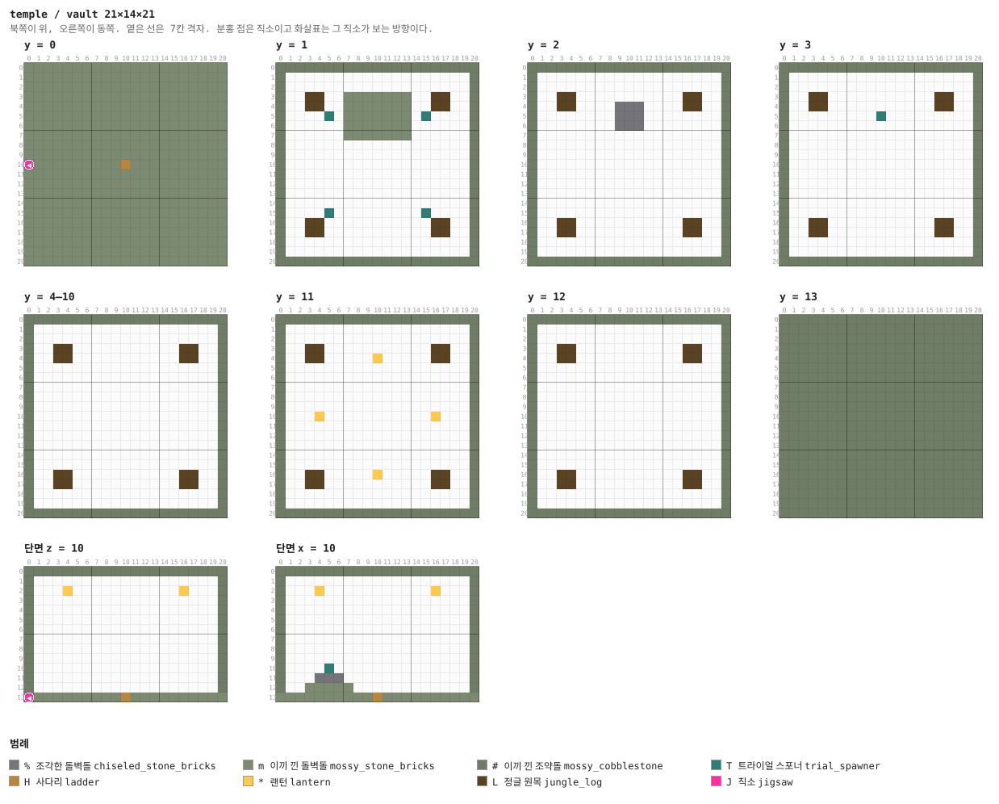

<details><summary>층별 지도 (텍스트)</summary>

```
y = 0   x →동, z ↓남
  mmmmmmmmmmmmmmmmmmmmm
  mmmmmmmmmmmmmmmmmmmmm
  mmmmmmmmmmmmmmmmmmmmm
  mmmmmmmmmmmmmmmmmmmmm
  mmmmmmmmmmmmmmmmmmmmm
  mmmmmmmmmmmmmmmmmmmmm
  mmmmmmmmmmmmmmmmmmmmm
  mmmmmmmmmmmmmmmmmmmmm
  mmmmmmmmmmmmmmmmmmmmm
  mmmmmmmmmmmmmmmmmmmmm
  JmmmmmmmmmHmmmmmmmmmm
  mmmmmmmmmmmmmmmmmmmmm
  mmmmmmmmmmmmmmmmmmmmm
  mmmmmmmmmmmmmmmmmmmmm
  mmmmmmmmmmmmmmmmmmmmm
  mmmmmmmmmmmmmmmmmmmmm
  mmmmmmmmmmmmmmmmmmmmm
  mmmmmmmmmmmmmmmmmmmmm
  mmmmmmmmmmmmmmmmmmmmm
  mmmmmmmmmmmmmmmmmmmmm
  mmmmmmmmmmmmmmmmmmmmm
y = 1   x →동, z ↓남
  #####################
  #...................#
  #...................#
  #..LL..mmmmmmm..LL..#
  #..LL..mmmmmmm..LL..#
  #....T.mmmmmmm.T....#
  #......mmmmmmm......#
  #......mmmmmmm......#
  #...................#
  #...................#
  #...................#
  #...................#
  #...................#
  #...................#
  #...................#
  #....T.........T....#
  #..LL...........LL..#
  #..LL...........LL..#
  #...................#
  #...................#
  #####################
y = 2   x →동, z ↓남
  #####################
  #...................#
  #...................#
  #..LL...........LL..#
  #..LL....%%%....LL..#
  #........%%%........#
  #........%%%........#
  #...................#
  #...................#
  #...................#
  #...................#
  #...................#
  #...................#
  #...................#
  #...................#
  #...................#
  #..LL...........LL..#
  #..LL...........LL..#
  #...................#
  #...................#
  #####################
y = 3   x →동, z ↓남
  #####################
  #...................#
  #...................#
  #..LL...........LL..#
  #..LL...........LL..#
  #.........T.........#
  #...................#
  #...................#
  #...................#
  #...................#
  #...................#
  #...................#
  #...................#
  #...................#
  #...................#
  #...................#
  #..LL...........LL..#
  #..LL...........LL..#
  #...................#
  #...................#
  #####################
y = 4–10   x →동, z ↓남
  #####################
  #...................#
  #...................#
  #..LL...........LL..#
  #..LL...........LL..#
  #...................#
  #...................#
  #...................#
  #...................#
  #...................#
  #...................#
  #...................#
  #...................#
  #...................#
  #...................#
  #...................#
  #..LL...........LL..#
  #..LL...........LL..#
  #...................#
  #...................#
  #####################
y = 11   x →동, z ↓남
  #####################
  #...................#
  #...................#
  #..LL...........LL..#
  #..LL.....*.....LL..#
  #...................#
  #...................#
  #...................#
  #...................#
  #...................#
  #...*...........*...#
  #...................#
  #...................#
  #...................#
  #...................#
  #...................#
  #..LL.....*.....LL..#
  #..LL...........LL..#
  #...................#
  #...................#
  #####################
y = 12   x →동, z ↓남
  #####################
  #...................#
  #...................#
  #..LL...........LL..#
  #..LL...........LL..#
  #...................#
  #...................#
  #...................#
  #...................#
  #...................#
  #...................#
  #...................#
  #...................#
  #...................#
  #...................#
  #...................#
  #..LL...........LL..#
  #..LL...........LL..#
  #...................#
  #...................#
  #####################
y = 13   x →동, z ↓남
  #####################
  #####################
  #####################
  #####################
  #####################
  #####################
  #####################
  #####################
  #####################
  #####################
  #####################
  #####################
  #####################
  #####################
  #####################
  #####################
  #####################
  #####################
  #####################
  #####################
  #####################
```

</details>

<details><summary>세로 단면 (텍스트)</summary>

```
단면 z = 10   x →동, y ↑하늘
  #####################
  #...................#
  #...*...........*...#
  #...................#
  #...................#
  #...................#
  #...................#
  #...................#
  #...................#
  #...................#
  #...................#
  #...................#
  #...................#
  JmmmmmmmmmHmmmmmmmmmm
단면 x = 10   z →남, y ↑하늘
  #####################
  #...................#
  #...*...........*...#
  #...................#
  #...................#
  #...................#
  #...................#
  #...................#
  #...................#
  #...................#
  #....T..............#
  #...%%%.............#
  #..mmmmm............#
  mmmmmmmmmmHmmmmmmmmmm
```

</details>


### `passage` — 7×7×7 — 1×1×1 셀

미로의 기본 단위.

**어느 풀에 있나** — `passages` (가중치 10)

| 직소 위치 | 향 | name | target | pool |
|---|---|---|---|---|
| (0, 0, 3) | ◀ 서 | `tpl_door` | `tpl_door` | `temple/passages` |
| (6, 0, 3) | ▶ 동 | `tpl_door` | `tpl_door` | `temple/passages` |

**뚫린 면** — 서: z 2–4, y 1–4 (12칸) / 동: z 2–4, y 1–4 (12칸)

**블록** — 이끼 낀 조약돌 192, 직소 2

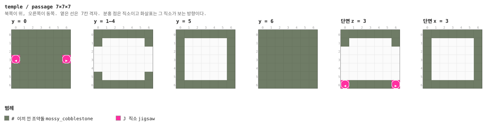

<details><summary>층별 지도 (텍스트)</summary>

```
y = 0   x →동, z ↓남
  #######
  #######
  #######
  J#####J
  #######
  #######
  #######
y = 1–4   x →동, z ↓남
  #######
  #.....#
  .......
  .......
  .......
  #.....#
  #######
y = 5   x →동, z ↓남
  #######
  #.....#
  #.....#
  #.....#
  #.....#
  #.....#
  #######
y = 6   x →동, z ↓남
  #######
  #######
  #######
  #######
  #######
  #######
  #######
```

</details>


### `corner` — 7×7×7 — 1×1×1 셀

꺾이는 통로.

**어느 풀에 있나** — `passages` (가중치 9)

| 직소 위치 | 향 | name | target | pool |
|---|---|---|---|---|
| (0, 0, 3) | ◀ 서 | `tpl_door` | `tpl_door` | `temple/passages` |
| (3, 0, 6) | ▼ 남 | `tpl_door` | `tpl_door` | `temple/passages` |

**뚫린 면** — 서: z 2–4, y 1–4 (12칸) / 남: x 2–4, y 1–4 (12칸)

**블록** — 이끼 낀 조약돌 192, 직소 2

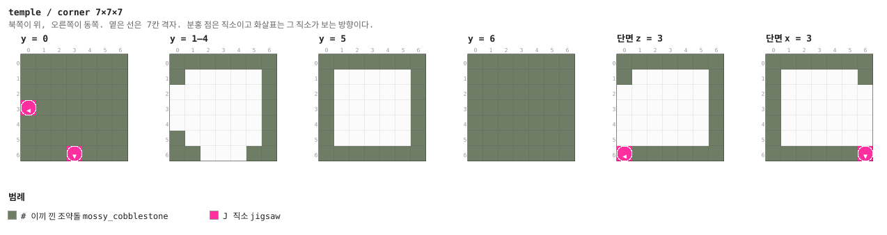

<details><summary>층별 지도 (텍스트)</summary>

```
y = 0   x →동, z ↓남
  #######
  #######
  #######
  J######
  #######
  #######
  ###J###
y = 1–4   x →동, z ↓남
  #######
  #.....#
  ......#
  ......#
  ......#
  #.....#
  ##...##
y = 5   x →동, z ↓남
  #######
  #.....#
  #.....#
  #.....#
  #.....#
  #.....#
  #######
y = 6   x →동, z ↓남
  #######
  #######
  #######
  #######
  #######
  #######
  #######
```

</details>


### `cross` — 7×7×7 — 1×1×1 셀

십자 교차로.

**어느 풀에 있나** — `passages` (가중치 5)

| 직소 위치 | 향 | name | target | pool |
|---|---|---|---|---|
| (3, 0, 0) | ▲ 북 | `tpl_door` | `tpl_door` | `temple/passages` |
| (0, 0, 3) | ◀ 서 | `tpl_door` | `tpl_door` | `temple/passages` |
| (6, 0, 3) | ▶ 동 | `tpl_door` | `tpl_door` | `temple/passages` |
| (3, 0, 6) | ▼ 남 | `tpl_door` | `tpl_door` | `temple/passages` |

**뚫린 면** — 서: z 2–4, y 1–4 (12칸) / 동: z 2–4, y 1–4 (12칸) / 북: x 2–4, y 1–4 (12칸) / 남: x 2–4, y 1–4 (12칸)

**블록** — 이끼 낀 조약돌 166, 직소 4

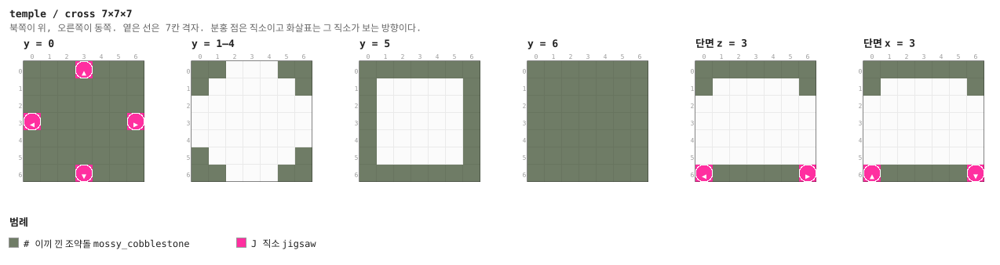

<details><summary>층별 지도 (텍스트)</summary>

```
y = 0   x →동, z ↓남
  ###J###
  #######
  #######
  J#####J
  #######
  #######
  ###J###
y = 1–4   x →동, z ↓남
  ##...##
  #.....#
  .......
  .......
  .......
  #.....#
  ##...##
y = 5   x →동, z ↓남
  #######
  #.....#
  #.....#
  #.....#
  #.....#
  #.....#
  #######
y = 6   x →동, z ↓남
  #######
  #######
  #######
  #######
  #######
  #######
  #######
```

</details>


### `niche` — 7×7×7 — 1×1×1 셀

벽감. 문이 하나뿐이니 상자를 준다.

**어느 풀에 있나** — `passages` (가중치 7)

| 직소 위치 | 향 | name | target | pool |
|---|---|---|---|---|
| (0, 0, 3) | ◀ 서 | `tpl_door` | `tpl_door` | `temple/passages` |

**뚫린 면** — 서: z 2–4, y 1–4 (12칸)

**블록** — 이끼 낀 조약돌 180, 이끼 낀 돌벽돌 25, 직소 1, 조각한 돌벽돌 1, 랜턴 1, 상자 1

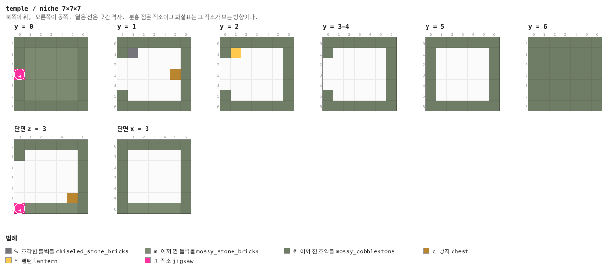

<details><summary>층별 지도 (텍스트)</summary>

```
y = 0   x →동, z ↓남
  #######
  #mmmmm#
  #mmmmm#
  Jmmmmm#
  #mmmmm#
  #mmmmm#
  #######
y = 1   x →동, z ↓남
  #######
  #%....#
  ......#
  .....c#
  ......#
  #.....#
  #######
y = 2   x →동, z ↓남
  #######
  #*....#
  ......#
  ......#
  ......#
  #.....#
  #######
y = 3–4   x →동, z ↓남
  #######
  #.....#
  ......#
  ......#
  ......#
  #.....#
  #######
y = 5   x →동, z ↓남
  #######
  #.....#
  #.....#
  #.....#
  #.....#
  #.....#
  #######
y = 6   x →동, z ↓남
  #######
  #######
  #######
  #######
  #######
  #######
  #######
```

</details>


### `shrine_room` — 7×7×7 — 1×1×1 셀

작은 제단방. 상자와 정글 묘목.

**어느 풀에 있나** — `passages` (가중치 5)

| 직소 위치 | 향 | name | target | pool |
|---|---|---|---|---|
| (0, 0, 3) | ◀ 서 | `tpl_door` | `tpl_door` | `temple/passages` |

**뚫린 면** — 서: z 2–4, y 1–4 (12칸)

**블록** — 이끼 낀 조약돌 180, 이끼 낀 돌벽돌 35, 직소 1, 정글 묘목 1, 상자 1, 조각한 돌벽돌 1

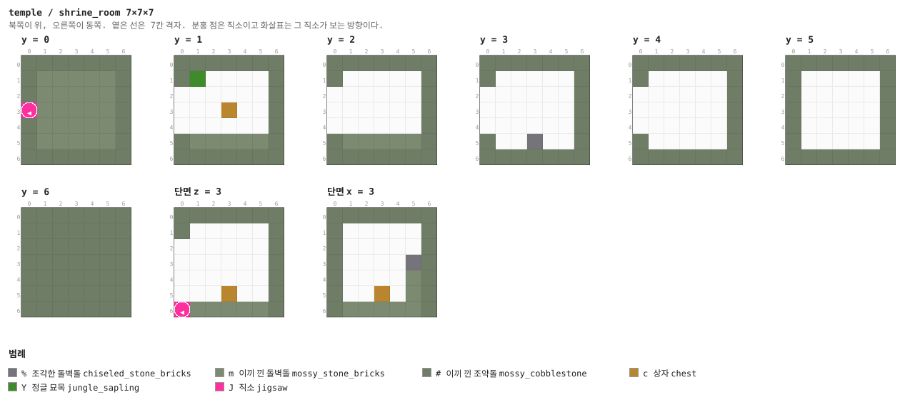

<details><summary>층별 지도 (텍스트)</summary>

```
y = 0   x →동, z ↓남
  #######
  #mmmmm#
  #mmmmm#
  Jmmmmm#
  #mmmmm#
  #mmmmm#
  #######
y = 1   x →동, z ↓남
  #######
  #Y....#
  ......#
  ...c..#
  ......#
  #mmmmm#
  #######
y = 2   x →동, z ↓남
  #######
  #.....#
  ......#
  ......#
  ......#
  #mmmmm#
  #######
y = 3   x →동, z ↓남
  #######
  #.....#
  ......#
  ......#
  ......#
  #..%..#
  #######
y = 4   x →동, z ↓남
  #######
  #.....#
  ......#
  ......#
  ......#
  #.....#
  #######
y = 5   x →동, z ↓남
  #######
  #.....#
  #.....#
  #.....#
  #.....#
  #.....#
  #######
y = 6   x →동, z ↓남
  #######
  #######
  #######
  #######
  #######
  #######
  #######
```

</details>


### `guard_post` — 7×7×7 — 1×1×1 셀

거미줄과 동굴거미 스포너. 교차로 한가운데다.

**어느 풀에 있나** — `passages` (가중치 4)

| 직소 위치 | 향 | name | target | pool |
|---|---|---|---|---|
| (3, 0, 0) | ▲ 북 | `tpl_door` | `tpl_door` | `temple/passages` |
| (0, 0, 3) | ◀ 서 | `tpl_door` | `tpl_door` | `temple/passages` |
| (6, 0, 3) | ▶ 동 | `tpl_door` | `tpl_door` | `temple/passages` |
| (3, 0, 6) | ▼ 남 | `tpl_door` | `tpl_door` | `temple/passages` |

**뚫린 면** — 서: z 2–4, y 1–4 (12칸) / 동: z 2–4, y 1–4 (12칸) / 북: x 2–4, y 1–4 (12칸) / 남: x 2–4, y 1–4 (12칸)

**블록** — 이끼 낀 조약돌 166, 직소 4, 거미줄 2, 몬스터 스포너 1

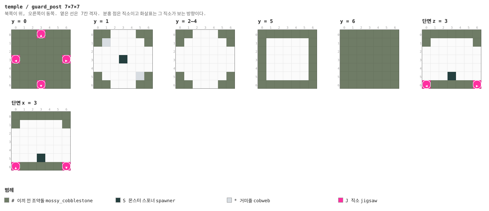

<details><summary>층별 지도 (텍스트)</summary>

```
y = 0   x →동, z ↓남
  ###J###
  #######
  #######
  J#####J
  #######
  #######
  ###J###
y = 1   x →동, z ↓남
  ##...##
  #*....#
  .......
  ...S...
  .......
  #....*#
  ##...##
y = 2–4   x →동, z ↓남
  ##...##
  #.....#
  .......
  .......
  .......
  #.....#
  ##...##
y = 5   x →동, z ↓남
  #######
  #.....#
  #.....#
  #.....#
  #.....#
  #.....#
  #######
y = 6   x →동, z ↓남
  #######
  #######
  #######
  #######
  #######
  #######
  #######
```

</details>


### `infested` — 7×7×7 — 1×1×1 셀

좀벌레 돌이 섞인 방. 캐야 나오고, 캐는 것은 플레이어뿐이다.

**어느 풀에 있나** — `passages` (가중치 5)

| 직소 위치 | 향 | name | target | pool |
|---|---|---|---|---|
| (0, 0, 3) | ◀ 서 | `tpl_door` | `tpl_door` | `temple/passages` |
| (6, 0, 3) | ▶ 동 | `tpl_door` | `tpl_door` | `temple/passages` |

**뚫린 면** — 서: z 2–4, y 1–4 (12칸) / 동: z 2–4, y 1–4 (12칸)

**블록** — 이끼 낀 조약돌 185, 좀벌레 돌벽돌 9, 직소 2

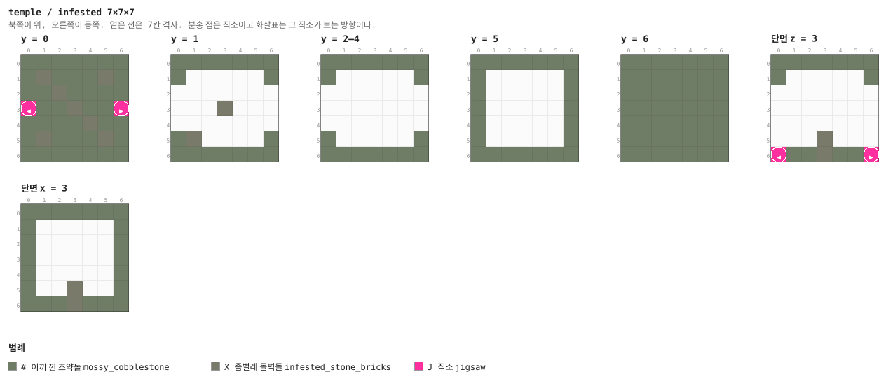

<details><summary>층별 지도 (텍스트)</summary>

```
y = 0   x →동, z ↓남
  #######
  #X###X#
  ##X####
  J##X##J
  ####X##
  #X###X#
  #######
y = 1   x →동, z ↓남
  #######
  #.....#
  .......
  ...X...
  .......
  #X....#
  #######
y = 2–4   x →동, z ↓남
  #######
  #.....#
  .......
  .......
  .......
  #.....#
  #######
y = 5   x →동, z ↓남
  #######
  #.....#
  #.....#
  #.....#
  #.....#
  #.....#
  #######
y = 6   x →동, z ↓남
  #######
  #######
  #######
  #######
  #######
  #######
  #######
```

</details>


### `dig_site` — 7×7×7 — 1×1×1 셀

무너진 자갈 더미. 수상한 자갈이 넷 묻혀 있다. 솔질은 플레이어만 한다.

**어느 풀에 있나** — `passages` (가중치 5)

| 직소 위치 | 향 | name | target | pool |
|---|---|---|---|---|
| (0, 0, 3) | ◀ 서 | `tpl_door` | `tpl_door` | `temple/passages` |

**뚫린 면** — 서: z 2–4, y 1–4 (12칸)

**블록** — 이끼 낀 조약돌 205, 자갈 30, 수상한 자갈 4, 직소 1

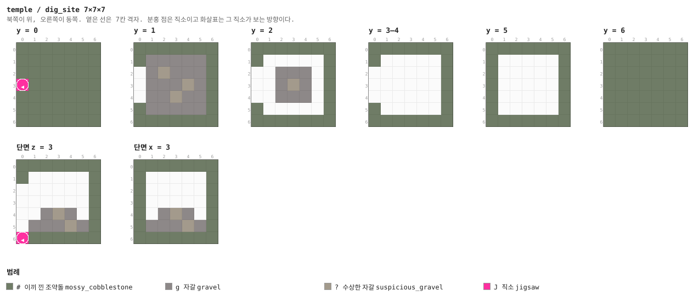

<details><summary>층별 지도 (텍스트)</summary>

```
y = 0   x →동, z ↓남
  #######
  #######
  #######
  J######
  #######
  #######
  #######
y = 1   x →동, z ↓남
  #######
  #ggggg#
  .g?ggg#
  .ggg?g#
  .gg?gg#
  #ggggg#
  #######
y = 2   x →동, z ↓남
  #######
  #.....#
  ..ggg.#
  ..g?g.#
  ..ggg.#
  #.....#
  #######
y = 3–4   x →동, z ↓남
  #######
  #.....#
  ......#
  ......#
  ......#
  #.....#
  #######
y = 5   x →동, z ↓남
  #######
  #.....#
  #.....#
  #.....#
  #.....#
  #.....#
  #######
y = 6   x →동, z ↓남
  #######
  #######
  #######
  #######
  #######
  #######
  #######
```

</details>


### `cap` — 1×7×7

두께 1의 마개. 마른 미로 풀의 fallback (§4).

**어느 풀에 있나** — `caps` (가중치 1)

| 직소 위치 | 향 | name | target | pool |
|---|---|---|---|---|
| (0, 0, 3) | ◀ 서 | `tpl_door` | `tpl_door` | `temple/caps` |

**블록** — 이끼 낀 조약돌 48, 직소 1

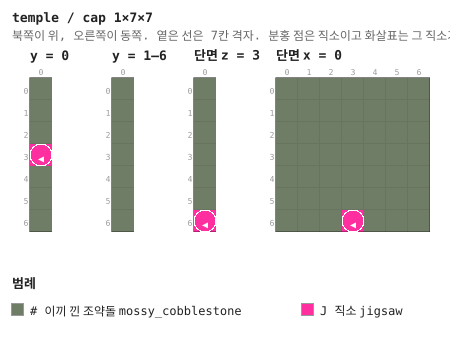

<details><summary>층별 지도 (텍스트)</summary>

```
y = 0   x →동, z ↓남
  #
  #
  #
  J
  #
  #
  #
y = 1–6   x →동, z ↓남
  #
  #
  #
  #
  #
  #
  #
```

</details>


### `flow` — 7×7×7 — 1×1×1 셀

물살 수로. 트리거가 없는 위험이고, 몹도 같이 떠내려간다.

**어느 풀에 있나** — `channels` (가중치 9)

| 직소 위치 | 향 | name | target | pool |
|---|---|---|---|---|
| (0, 0, 3) | ◀ 서 | `tpl_flow` | `tpl_flow` | `temple/channels` |
| (6, 0, 3) | ▶ 동 | `tpl_flow` | `tpl_flow` | `temple/channels` |

**뚫린 면** — 서: z 2–4, y 1–4 (12칸) / 동: z 2–4, y 1–4 (12칸)

**블록** — 조약돌 192, 물 23, 직소 2, 이끼 낀 돌벽돌 2

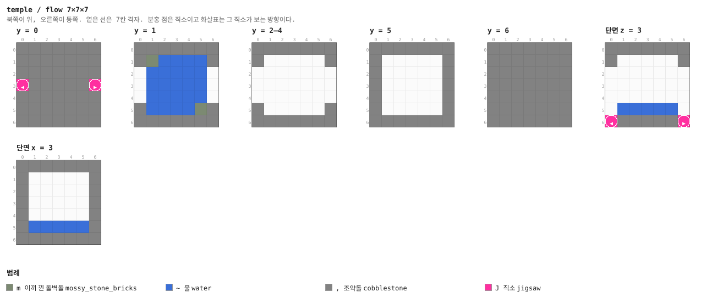

<details><summary>층별 지도 (텍스트)</summary>

```
y = 0   x →동, z ↓남
  ,,,,,,,
  ,,,,,,,
  ,,,,,,,
  J,,,,,J
  ,,,,,,,
  ,,,,,,,
  ,,,,,,,
y = 1   x →동, z ↓남
  ,,,,,,,
  ,m~~~~,
  .~~~~~.
  .~~~~~.
  .~~~~~.
  ,~~~~m,
  ,,,,,,,
y = 2–4   x →동, z ↓남
  ,,,,,,,
  ,.....,
  .......
  .......
  .......
  ,.....,
  ,,,,,,,
y = 5   x →동, z ↓남
  ,,,,,,,
  ,.....,
  ,.....,
  ,.....,
  ,.....,
  ,.....,
  ,,,,,,,
y = 6   x →동, z ↓남
  ,,,,,,,
  ,,,,,,,
  ,,,,,,,
  ,,,,,,,
  ,,,,,,,
  ,,,,,,,
  ,,,,,,,
```

</details>


### `flow_corner` — 7×7×7 — 1×1×1 셀

꺾이는 수로.

**어느 풀에 있나** — `channels` (가중치 9)

| 직소 위치 | 향 | name | target | pool |
|---|---|---|---|---|
| (0, 0, 3) | ◀ 서 | `tpl_flow` | `tpl_flow` | `temple/channels` |
| (3, 0, 6) | ▼ 남 | `tpl_flow` | `tpl_flow` | `temple/channels` |

**뚫린 면** — 서: z 2–4, y 1–4 (12칸) / 남: x 2–4, y 1–4 (12칸)

**블록** — 조약돌 192, 물 23, 직소 2, 이끼 낀 돌벽돌 2

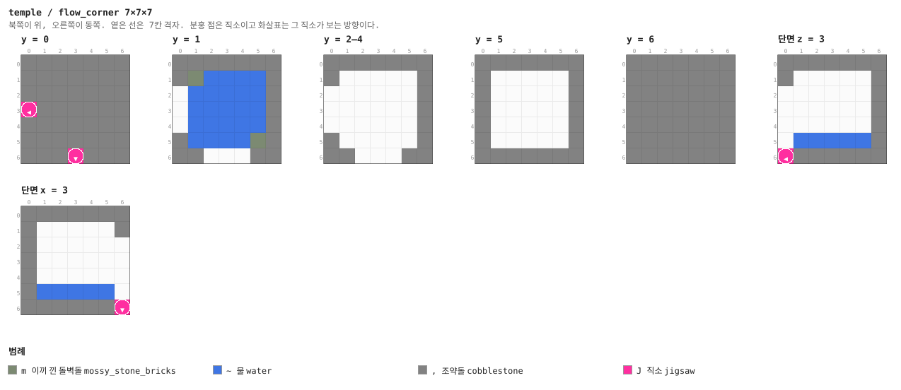

<details><summary>층별 지도 (텍스트)</summary>

```
y = 0   x →동, z ↓남
  ,,,,,,,
  ,,,,,,,
  ,,,,,,,
  J,,,,,,
  ,,,,,,,
  ,,,,,,,
  ,,,J,,,
y = 1   x →동, z ↓남
  ,,,,,,,
  ,m~~~~,
  .~~~~~,
  .~~~~~,
  .~~~~~,
  ,~~~~m,
  ,,...,,
y = 2–4   x →동, z ↓남
  ,,,,,,,
  ,.....,
  ......,
  ......,
  ......,
  ,.....,
  ,,...,,
y = 5   x →동, z ↓남
  ,,,,,,,
  ,.....,
  ,.....,
  ,.....,
  ,.....,
  ,.....,
  ,,,,,,,
y = 6   x →동, z ↓남
  ,,,,,,,
  ,,,,,,,
  ,,,,,,,
  ,,,,,,,
  ,,,,,,,
  ,,,,,,,
  ,,,,,,,
```

</details>


### `flow_cross` — 7×7×7 — 1×1×1 셀

수로 네거리.

**어느 풀에 있나** — `channels` (가중치 4)

| 직소 위치 | 향 | name | target | pool |
|---|---|---|---|---|
| (3, 0, 0) | ▲ 북 | `tpl_flow` | `tpl_flow` | `temple/channels` |
| (0, 0, 3) | ◀ 서 | `tpl_flow` | `tpl_flow` | `temple/channels` |
| (6, 0, 3) | ▶ 동 | `tpl_flow` | `tpl_flow` | `temple/channels` |
| (3, 0, 6) | ▼ 남 | `tpl_flow` | `tpl_flow` | `temple/channels` |

**뚫린 면** — 서: z 2–4, y 1–4 (12칸) / 동: z 2–4, y 1–4 (12칸) / 북: x 2–4, y 1–4 (12칸) / 남: x 2–4, y 1–4 (12칸)

**블록** — 조약돌 166, 물 23, 직소 4, 이끼 낀 돌벽돌 2

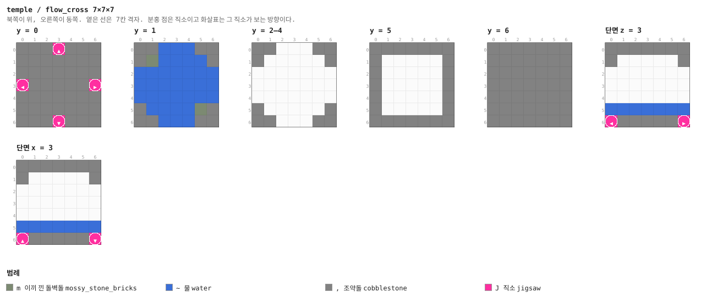

<details><summary>층별 지도 (텍스트)</summary>

```
y = 0   x →동, z ↓남
  ,,,J,,,
  ,,,,,,,
  ,,,,,,,
  J,,,,,J
  ,,,,,,,
  ,,,,,,,
  ,,,J,,,
y = 1   x →동, z ↓남
  ,,...,,
  ,m~~~~,
  .~~~~~.
  .~~~~~.
  .~~~~~.
  ,~~~~m,
  ,,...,,
y = 2–4   x →동, z ↓남
  ,,...,,
  ,.....,
  .......
  .......
  .......
  ,.....,
  ,,...,,
y = 5   x →동, z ↓남
  ,,,,,,,
  ,.....,
  ,.....,
  ,.....,
  ,.....,
  ,.....,
  ,,,,,,,
y = 6   x →동, z ↓남
  ,,,,,,,
  ,,,,,,,
  ,,,,,,,
  ,,,,,,,
  ,,,,,,,
  ,,,,,,,
  ,,,,,,,
```

</details>


### `pool` — 7×7×7 — 1×1×1 셀

물이 허리까지 오는 칸. 가운데 섬에 동굴거미 스포너.

**어느 풀에 있나** — `channels` (가중치 6)

| 직소 위치 | 향 | name | target | pool |
|---|---|---|---|---|
| (0, 0, 3) | ◀ 서 | `tpl_flow` | `tpl_flow` | `temple/channels` |
| (6, 0, 3) | ▶ 동 | `tpl_flow` | `tpl_flow` | `temple/channels` |

**뚫린 면** — 서: z 2–4, y 1–4 (12칸) / 동: z 2–4, y 1–4 (12칸)

**블록** — 조약돌 167, 물 50, 이끼 낀 돌벽돌 9, 직소 2

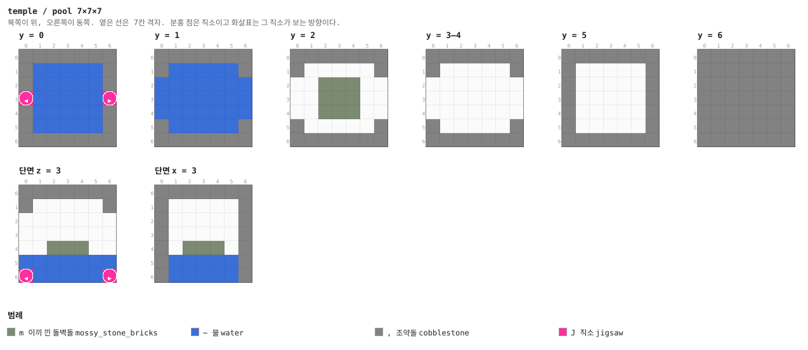

<details><summary>층별 지도 (텍스트)</summary>

```
y = 0   x →동, z ↓남
  ,,,,,,,
  ,~~~~~,
  ,~~~~~,
  J~~~~~J
  ,~~~~~,
  ,~~~~~,
  ,,,,,,,
y = 1   x →동, z ↓남
  ,,,,,,,
  ,~~~~~,
  .~~~~~.
  .~~~~~.
  .~~~~~.
  ,~~~~~,
  ,,,,,,,
y = 2   x →동, z ↓남
  ,,,,,,,
  ,.....,
  ..mmm..
  ..mmm..
  ..mmm..
  ,.....,
  ,,,,,,,
y = 3–4   x →동, z ↓남
  ,,,,,,,
  ,.....,
  .......
  .......
  .......
  ,.....,
  ,,,,,,,
y = 5   x →동, z ↓남
  ,,,,,,,
  ,.....,
  ,.....,
  ,.....,
  ,.....,
  ,.....,
  ,,,,,,,
y = 6   x →동, z ↓남
  ,,,,,,,
  ,,,,,,,
  ,,,,,,,
  ,,,,,,,
  ,,,,,,,
  ,,,,,,,
  ,,,,,,,
```

</details>


### `drain` — 7×7×7 — 1×1×1 셀

수로가 끝나는 곳. 물 위 선반에 상자.

**어느 풀에 있나** — `channels` (가중치 6)

| 직소 위치 | 향 | name | target | pool |
|---|---|---|---|---|
| (0, 0, 3) | ◀ 서 | `tpl_flow` | `tpl_flow` | `temple/channels` |

**뚫린 면** — 서: z 2–4, y 1–4 (12칸)

**블록** — 조약돌 180, 이끼 낀 돌벽돌 26, 물 24, 직소 1, 상자 1

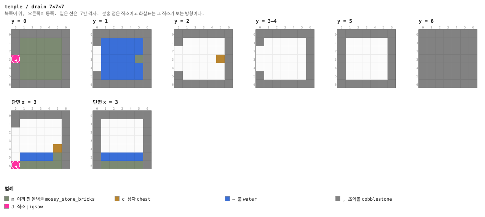

<details><summary>층별 지도 (텍스트)</summary>

```
y = 0   x →동, z ↓남
  ,,,,,,,
  ,mmmmm,
  ,mmmmm,
  Jmmmmm,
  ,mmmmm,
  ,mmmmm,
  ,,,,,,,
y = 1   x →동, z ↓남
  ,,,,,,,
  ,~~~~~,
  .~~~~~,
  .~~~~m,
  .~~~~~,
  ,~~~~~,
  ,,,,,,,
y = 2   x →동, z ↓남
  ,,,,,,,
  ,.....,
  ......,
  .....c,
  ......,
  ,.....,
  ,,,,,,,
y = 3–4   x →동, z ↓남
  ,,,,,,,
  ,.....,
  ......,
  ......,
  ......,
  ,.....,
  ,,,,,,,
y = 5   x →동, z ↓남
  ,,,,,,,
  ,.....,
  ,.....,
  ,.....,
  ,.....,
  ,.....,
  ,,,,,,,
y = 6   x →동, z ↓남
  ,,,,,,,
  ,,,,,,,
  ,,,,,,,
  ,,,,,,,
  ,,,,,,,
  ,,,,,,,
  ,,,,,,,
```

</details>


### `treasury` — 7×7×7 — 1×1×1 셀

철문과 레버. **몹은 압력판은 밟지만 레버는 못 당긴다** — 그래서 이 방은 플레이어만 열 수 있고,
§12의 함정 문제에 걸리지 않는다. 안에 `chests/temple_vault`.

**어느 풀에 있나** — `channels` (가중치 4)

| 직소 위치 | 향 | name | target | pool |
|---|---|---|---|---|
| (0, 0, 3) | ◀ 서 | `tpl_flow` | `tpl_flow` | `temple/channels` |

**뚫린 면** — 서: z 2–4, y 1–4 (11칸)

**블록** — 조약돌 251, 이끼 낀 돌벽돌 25, 철문 2, 직소 1, 레버 1, 상자 1, 랜턴 1

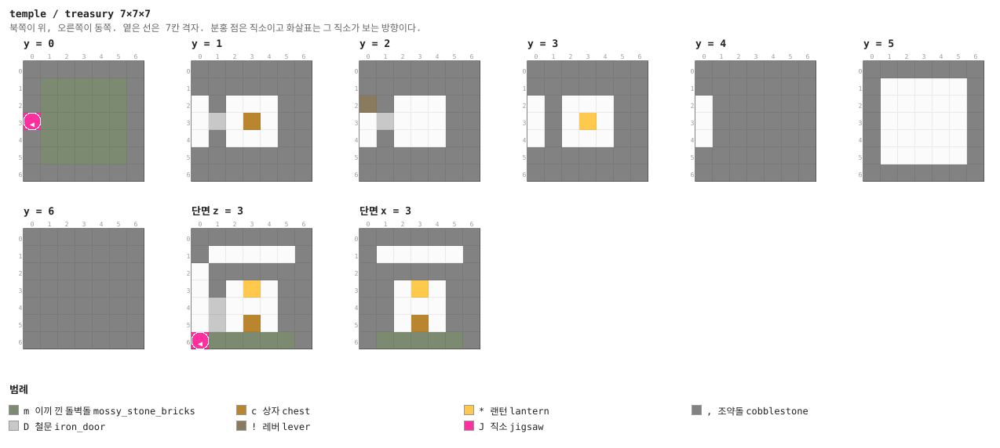

<details><summary>층별 지도 (텍스트)</summary>

```
y = 0   x →동, z ↓남
  ,,,,,,,
  ,mmmmm,
  ,mmmmm,
  Jmmmmm,
  ,mmmmm,
  ,mmmmm,
  ,,,,,,,
y = 1   x →동, z ↓남
  ,,,,,,,
  ,,,,,,,
  .,...,,
  .D.c.,,
  .,...,,
  ,,,,,,,
  ,,,,,,,
y = 2   x →동, z ↓남
  ,,,,,,,
  ,,,,,,,
  !,...,,
  .D...,,
  .,...,,
  ,,,,,,,
  ,,,,,,,
y = 3   x →동, z ↓남
  ,,,,,,,
  ,,,,,,,
  .,...,,
  .,.*.,,
  .,...,,
  ,,,,,,,
  ,,,,,,,
y = 4   x →동, z ↓남
  ,,,,,,,
  ,,,,,,,
  .,,,,,,
  .,,,,,,
  .,,,,,,
  ,,,,,,,
  ,,,,,,,
y = 5   x →동, z ↓남
  ,,,,,,,
  ,.....,
  ,.....,
  ,.....,
  ,.....,
  ,.....,
  ,,,,,,,
y = 6   x →동, z ↓남
  ,,,,,,,
  ,,,,,,,
  ,,,,,,,
  ,,,,,,,
  ,,,,,,,
  ,,,,,,,
  ,,,,,,,
```

</details>


### `channel_cap` — 1×7×7

수로 쪽 마개. 커넥터가 달라서 마개도 따로 있다.

**어느 풀에 있나** — `channel_caps` (가중치 1)

| 직소 위치 | 향 | name | target | pool |
|---|---|---|---|---|
| (0, 0, 3) | ◀ 서 | `tpl_flow` | `tpl_flow` | `temple/channel_caps` |

**블록** — 조약돌 48, 직소 1

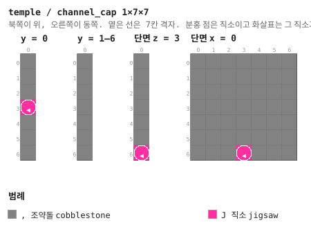

<details><summary>층별 지도 (텍스트)</summary>

```
y = 0   x →동, z ↓남
  ,
  ,
  ,
  J
  ,
  ,
  ,
y = 1–6   x →동, z ↓남
  ,
  ,
  ,
  ,
  ,
  ,
  ,
```

</details>


### `spine_3` — 7×7×7 — 1×1×1 셀

**어느 풀에 있나** — `spine_3` (가중치 1)

| 직소 위치 | 향 | name | target | pool |
|---|---|---|---|---|
| (3, 0, 0) | ▲ 북 | `tpl_spine` | `tpl_spine` | `—` |
| (0, 0, 3) | ◀ 서 | `tpl_door` | `tpl_door` | `temple/passages` |
| (6, 0, 3) | ▶ 동 | `tpl_door` | `tpl_door` | `temple/passages` |
| (3, 0, 6) | ▼ 남 | `tpl_door` | `tpl_spine` | `temple/well` |

**뚫린 면** — 서: z 2–4, y 1–4 (12칸) / 동: z 2–4, y 1–4 (12칸) / 북: x 2–4, y 1–4 (12칸) / 남: x 2–4, y 1–4 (12칸)

**블록** — 이끼 낀 조약돌 141, 이끼 낀 돌벽돌 25, 직소 4, 정글 원목 4


<details><summary>층별 지도 (텍스트)</summary>

```
y = 0   x →동, z ↓남
  ###J###
  #mmmmm#
  #mmmmm#
  JmmmmmJ
  #mmmmm#
  #mmmmm#
  ###J###
y = 1–2   x →동, z ↓남
  ##...##
  #L...L#
  .......
  .......
  .......
  #.....#
  ##...##
y = 3–4   x →동, z ↓남
  ##...##
  #.....#
  .......
  .......
  .......
  #.....#
  ##...##
y = 5   x →동, z ↓남
  #######
  #.....#
  #.....#
  #.....#
  #.....#
  #.....#
  #######
y = 6   x →동, z ↓남
  #######
  #######
  #######
  #######
  #######
  #######
  #######
```

</details>


## 다듬을 곳

**코드가 지은 첫 판이다.** 조각은 출발점이고 예쁘게 만드는 일은 개발 클라이언트에서 한다
(`CLAUDE.md` §16). 껍데기 둘과 코어 둘을 빼면 전부 한 변 48 이하라 손으로 다시 지을 수 있고,
`python tools/workshop.py temple`로 깔고 `python tools/grab_workshop.py temple`로 가져온다.

- **테라스가 평평하다.** 켜마다 이끼 조약돌이고 일곱 켜마다 이끼 벽돌 띠 하나가 전부다. 실제
  지구라트처럼 모서리 선을 긋거나 면에 얕은 감을 파면 멀리서도 읽힌다
- **대계단에 난간이 없다.** 폭 3칸 홈이라 떨어지기 쉽다. 정글 나무 울타리나 조각상이 어울린다
- **수로가 한 층뿐이다.** 물이 흐르지만 높이차가 없어서 "떠내려간다"는 감각이 약하다. 한 칸
  낮은 수조로 떨어지는 칸이 있으면 좋겠다
- **사제의 홀이 넓고 낮다.** 21×14인데 기둥 넷과 단상뿐이다
