# 레벨 설계 — 마법사의 탑

> 이 문서는 `python tools/gen_level_doc.py tower`가 만든다. 조각을 고치면 다시 돌린다. 그림과 표는 게임이 읽는 파일(`structure/tower/*.nbt`, `worldgen/**`)에서 그대로 읽어 온 것이라 모드와 어긋날 수 없다. 설명 문장만 사람이 쓴다 (`tools/gen_level_doc.py`의 `INTRO`·`NOTES`).

## 1. 한눈에

타이가에 밑변 39칸, 높이 86칸의 탑이 서 있다. 아래가 넓고 몸통이 가늘며 꼭대기에서 다시
벌어진다 — 받침 39, 몸통 25, 왕관 39, 그 위로 산화 구리 지붕이 한 칸씩 좁아지다 피뢰침으로
끝난다.

```
y 65–85   지붕 39→1 + 피뢰침
y 56–64   왕관 39폭 — 몸통보다 일곱 칸씩 튀어나온 전망 회랑
y  7–55   몸통 25폭 — 2~8층, 층마다 7×7 방 3×3 = 아홉 칸
y  0– 6   받침 39폭 — 1층, 7×7 방 5×5 = 스물다섯 칸
```

**사다리가 없다. 층마다 계단방이 하나씩 있고, 그 방은 층마다 다른 칸에 있다.**
착지한 칸에서 계단 칸까지 걸어가야 하고, 그 경로가 층마다 꺾인다. 게다가 미로 풀에도
계단이 섞여 있어서 지름길이 매번 다르게 생긴다.

**한 판:** 서쪽 현관 → 1층 홀·연금실 → 대계단 → 2층 → … 층마다 계단을 찾아 올라 →
3층 문 너머 **도서관**(마법 부여대 30레벨) → 7층 문 너머 **성소**에서 대마법사 →
8층에서 마지막 계단 → **옥상 회랑**.

| 항목 | 값 |
|---|---|
| 생성 단계 | `surface_structures` |
| 바이옴 | `#sydungeon:has_structure/tower` |
| 간격 / 최소거리 | spacing 40 / separation 14 |
| 직소 깊이 | 30 ~ 38 (`sydungeon:ranged_jigsaw`) |
| 시작 풀 | `start` |
| 조각 / 풀 | 34개 / 27개 |

## 2. 조립 원리

### 겉모양이 폭을 바꾸므로, 껍데기를 쌓는다

피라미드는 껍데기 세 장을 쌓아 45° 면을 지켰다. 탑도 같은 방식인데, 지켜야 하는 것이
**테이퍼**다. 39 → 25 → 39 → 지붕으로 폭이 네 번 바뀌므로 껍데기도 네 장이다.

```
base  (39× 7×39) ─위→ shaft (25×49×25) ─위→ crown (39×9×39) ─위→ roof (39×21×39)
  └안쪽→ core_base (35×7×35)  └안쪽→ core_shaft (21×49×21)
```

껍데기끼리는 **수직 앵커 하나**로 쌓이고 y가 한 칸도 겹치지 않는다 — 겹치면 자식의 상자가
부모의 상자에 부딪혀 거부되고, 그 위가 통째로 사라진다. `verify()`가 매번 센다.

그리고 각 껍데기는 자기 안쪽을 가리키는 직소로 **core**를 매단다. 그 뒤로 자란 것은 전부
그 core의 상자 안에서만 판정되므로(§10), 1층 미로는 받침 밖으로, 2~8층 미로는 몸통 밖으로
나갈 수 없다. **왕관은 core가 없다** — 옥상은 방 하나면 충분하고, 미로가 할 일이 없다.

### 계단이 한 칸을 쓰고 자기 천장으로 나온다

계단방은 7×7×7 한 칸이고, 마지막 계단이 **자기 천장의 구멍**을 지나 위층으로 나온다.
그래서 **어느 층의 착지 칸은 아래층 계단 칸의 바로 위**다.

```
2층 (1,1)→(1,0)   3층 (1,0)→(2,0)   4층 (2,0)→(2,1)   5층 (2,1)→(1,1)
6층 (1,1)→(0,1)   7층 (0,1)→(0,2)   8층 (0,2)→ 옥상
```

두 칸짜리 계단방(7×14×7)을 썼다면 **한 층에 빈 칸이 연달아 둘** 필요한데, 도서관과 성소가
아홉 칸 중 넷을 먹는 층에서는 그럴 여유가 없다. 한 칸짜리로 만든 이유가 그것이다.

착지방과 계단방은 전부 원소 하나뿐인 풀이라 **일곱 층이 반드시 다 생기고 반드시 이어진다.**
그 위에 미로 풀의 `stair_maze`(7×14×7)가 가중치 5로 섞여 있어서, 정해진 길 말고도 층을
건너뛰는 지름길이 매번 다르게 난다. 몸통 꼭대기에서는 상자가 안 맞아 거부되고 마개가
들어간다 — 그래야 맞다.

### 껍데기 경계는 직소가 못 넘으므로 새긴다

직소가 자기 상자 **바깥**을 가리키면 자식은 전역 공간으로 판정된다. 1층(core_base) 안에서
2층(core_shaft)으로 직소를 뻗으면 core_shaft의 상자와 부딪혀 거부된다. 그래서 양 끝은
**두 조각에 같은 좌표로 새겼다**(§11).

- **대계단** — `great_stair`가 계단 다섯 칸과 천장 구멍을, `land_2`가 바닥 구멍과 마지막 한
  칸을 갖는다
- **옥상 계단** — `land_8`이 같은 것을 **거울로 뒤집어** 갖는다. 거울이 필요한 이유는
  land_8이 바닥 구멍(7층에서 올라오는 자리)과 천장 구멍(옥상으로 가는 자리)을 **한 칸 안에
  동시에** 가져야 하기 때문이다. 같은 자리면 서로 먹는다

좌표는 `FLIGHTS` 표 하나에 있고 `verify()`가 위아래가 만나는지 검사한다.

### §13 — 결정적으로 놓이는 조각은 부모가 찾는 이름의 직소를 하나만 가진다

마법사의 성을 버린 이유다. 바닐라는 자식의 **아무 직소나** 이름이 맞으면 입구로 쓰고 회전
넷을 다 시도한다. 성에서는 한 조각에 같은 이름 직소를 여럿 달아서 절반이 뒤집혀 붙었고,
**보스방에 들어가는 길이 아예 없었다.**

| 이름 | 쓰임 | 조각당 개수 |
|---|---|---|
| `tow_door` | 미로 커넥터 | 여럿 |
| `tow_riser` | 착지방·계단방의 **입구** | **정확히 하나** |
| `tow_anchor` | 이름 있는 방과 껍데기의 **입구** | **정확히 하나** |
| `tow_placer` | 고정 조각을 **놓는 쪽**. 문이 아니라 면 검사 대상이 아니다 | 여럿 |

## 3. 풀 배선

풀이 어떤 조각을 내놓는지(실선, 숫자는 가중치)와 그 조각의 직소가 다시 어떤 풀을 부르는지(점선)다. 직소 생성은 이 그래프를 깊이만큼 따라간다.


```mermaid
flowchart LR
  P_alchemy(["alchemy"])
  P_caps(["caps"])
  P_core_base(["core_base"])
  P_core_shaft(["core_shaft"])
  P_corridor(["corridor"])
  P_crown(["crown"])
  P_great_stair(["great_stair"])
  P_hall(["hall"])
  P_land_2(["land_2"])
  P_land_3(["land_3"])
  P_land_4(["land_4"])
  P_land_5(["land_5"])
  P_land_6(["land_6"])
  P_land_7(["land_7"])
  P_land_8(["land_8"])
  P_library(["library"])
  P_passages(["passages"])
  P_roof(["roof"])
  P_sanctum(["sanctum"])
  P_shaft(["shaft"])
  P_stair_2(["stair_2"])
  P_stair_3(["stair_3"])
  P_stair_4(["stair_4"])
  P_stair_5(["stair_5"])
  P_stair_6(["stair_6"])
  P_stair_7(["stair_7"])
  P_start(["start"])
  E_alchemy["alchemy"]
  E_base["base"]
  E_cap["cap"]
  E_core_base["core_base"]
  E_core_shaft["core_shaft"]
  E_corner["corner"]
  E_corridor["corridor"]
  E_cross["cross"]
  E_crown["crown"]
  E_great_stair["great_stair"]
  E_hall["hall"]
  E_lab["lab"]
  E_land_2["land_2"]
  E_land_3["land_3"]
  E_land_4["land_4"]
  E_land_5["land_5"]
  E_land_6["land_6"]
  E_land_7["land_7"]
  E_land_8["land_8"]
  E_library["library"]
  E_passage["passage"]
  E_roof["roof"]
  E_sanctum["sanctum"]
  E_shaft["shaft"]
  E_shaft_floor["shaft_floor"]
  E_stair_2["stair_2"]
  E_stair_3["stair_3"]
  E_stair_4["stair_4"]
  E_stair_5["stair_5"]
  E_stair_6["stair_6"]
  E_stair_7["stair_7"]
  E_stair_maze["stair_maze"]
  E_study["study"]
  E_vex_cage["vex_cage"]
  P_alchemy -- 1 --> E_alchemy
  P_caps -- 1 --> E_cap
  P_core_base -- 1 --> E_core_base
  P_core_shaft -- 1 --> E_core_shaft
  P_corridor -- 1 --> E_corridor
  P_crown -- 1 --> E_crown
  P_great_stair -- 1 --> E_great_stair
  P_hall -- 1 --> E_hall
  P_land_2 -- 1 --> E_land_2
  P_land_3 -- 1 --> E_land_3
  P_land_4 -- 1 --> E_land_4
  P_land_5 -- 1 --> E_land_5
  P_land_6 -- 1 --> E_land_6
  P_land_7 -- 1 --> E_land_7
  P_land_8 -- 1 --> E_land_8
  P_library -- 1 --> E_library
  P_passages -- 10 --> E_passage
  P_passages -- 9 --> E_corner
  P_passages -- 8 --> E_cross
  P_passages -- 8 --> E_study
  P_passages -- 6 --> E_vex_cage
  P_passages -- 6 --> E_lab
  P_passages -- 5 --> E_stair_maze
  P_roof -- 1 --> E_roof
  P_sanctum -- 1 --> E_sanctum
  P_shaft -- 1 --> E_shaft
  P_stair_2 -- 1 --> E_stair_2
  P_stair_3 -- 1 --> E_stair_3
  P_stair_4 -- 1 --> E_stair_4
  P_stair_5 -- 1 --> E_stair_5
  P_stair_6 -- 1 --> E_stair_6
  P_stair_7 -- 1 --> E_stair_7
  P_start -- 1 --> E_base
  E_base -.-> P_core_base
  E_base -.-> P_shaft
  E_cap -.-> P_caps
  E_core_base -.-> P_hall
  E_core_shaft -.-> P_land_2
  E_corner -.-> P_passages
  E_corridor -.-> P_alchemy
  E_corridor -.-> P_great_stair
  E_cross -.-> P_passages
  E_crown -.-> P_roof
  E_great_stair -.-> P_passages
  E_hall -.-> P_passages
  E_hall -.-> P_corridor
  E_lab -.-> P_passages
  E_land_2 -.-> P_stair_2
  E_land_2 -.-> P_passages
  E_land_3 -.-> P_passages
  E_land_3 -.-> P_library
  E_land_3 -.-> P_stair_3
  E_land_4 -.-> P_passages
  E_land_4 -.-> P_stair_4
  E_land_5 -.-> P_stair_5
  E_land_5 -.-> P_passages
  E_land_6 -.-> P_stair_6
  E_land_6 -.-> P_passages
  E_land_7 -.-> P_passages
  E_land_7 -.-> P_stair_7
  E_land_7 -.-> P_sanctum
  E_land_8 -.-> P_passages
  E_passage -.-> P_passages
  E_shaft -.-> P_crown
  E_shaft -.-> P_core_shaft
  E_stair_2 -.-> P_land_3
  E_stair_3 -.-> P_land_4
  E_stair_4 -.-> P_land_5
  E_stair_5 -.-> P_land_6
  E_stair_6 -.-> P_land_7
  E_stair_7 -.-> P_land_8
  E_stair_maze -.-> P_passages
  E_study -.-> P_passages
  E_vex_cage -.-> P_passages
  P_start:::start
  classDef start fill:#ffe9a8,stroke:#c99a00,stroke-width:2px
```

| 풀 | fallback | 원소 (가중치) |
|---|---|---|
| `alchemy` | `minecraft:empty` | `alchemy` 1 |
| `caps` | `minecraft:empty` | `cap` 1 |
| `core_base` | `minecraft:empty` | `core_base` 1 |
| `core_shaft` | `minecraft:empty` | `core_shaft` 1 |
| `corridor` | `minecraft:empty` | `corridor` 1 |
| `crown` | `minecraft:empty` | `crown` 1 |
| `great_stair` | `minecraft:empty` | `great_stair` 1 |
| `hall` | `minecraft:empty` | `hall` 1 |
| `land_2` | `minecraft:empty` | `land_2` 1 |
| `land_3` | `minecraft:empty` | `land_3` 1 |
| `land_4` | `minecraft:empty` | `land_4` 1 |
| `land_5` | `minecraft:empty` | `land_5` 1 |
| `land_6` | `minecraft:empty` | `land_6` 1 |
| `land_7` | `minecraft:empty` | `land_7` 1 |
| `land_8` | `minecraft:empty` | `land_8` 1 |
| `library` | `minecraft:empty` | `library` 1 |
| `passages` | `caps` | `passage` 10, `corner` 9, `cross` 8, `study` 8, `vex_cage` 6, `lab` 6, `stair_maze` 5 |
| `roof` | `minecraft:empty` | `roof` 1 |
| `sanctum` | `minecraft:empty` | `sanctum` 1 |
| `shaft` | `minecraft:empty` | `shaft` 1 |
| `stair_2` | `minecraft:empty` | `stair_2` 1 |
| `stair_3` | `minecraft:empty` | `stair_3` 1 |
| `stair_4` | `minecraft:empty` | `stair_4` 1 |
| `stair_5` | `minecraft:empty` | `stair_5` 1 |
| `stair_6` | `minecraft:empty` | `stair_6` 1 |
| `stair_7` | `minecraft:empty` | `stair_7` 1 |
| `start` | `minecraft:empty` | `base` 1 |

## 4. 뼈대 — 반드시 이렇게 놓이는 부분

껍데기 넷, core 둘, 1층의 고정 사슬 셋, 착지방 일곱, 계단방 여섯, 큰 방 둘.
**탑의 이 부분은 매번 똑같다.** 층마다 착지방에서 갈라지는 미로만 무작위다.
단면에서 계단이 층마다 다른 칸에 있는 것이 보인다 — 그게 이 판의 핵심이다.

| 조각 | 놓이는 자리 (시작 조각 기준) | 누가 놓나 |
|---|---|---|
| `base` | (0, 0, 0) | 시작 풀 |
| `core_base` | (2, 0, 2) | base의 동 tow_placer 직소 |
| `shaft` | (7, 7, 7) | base의 위 tow_placer 직소 |
| `hall` | (2, 0, 16) | core_base의 남 tow_placer 직소 |
| `crown` | (0, 56, 0) | shaft의 위 tow_placer 직소 |
| `core_shaft` | (9, 7, 9) | shaft의 동 tow_placer 직소 |
| `corridor` | (9, 0, 16) | hall의 동 tow_placer 직소 |
| `roof` | (0, 65, 0) | crown의 위 tow_placer 직소 |
| `land_2` | (16, 7, 16) | core_shaft의 동 tow_placer 직소 |
| `alchemy` | (9, 0, 9) | corridor의 북 tow_placer 직소 |
| `great_stair` | (16, 0, 16) | corridor의 동 tow_placer 직소 |
| `stair_2` | (16, 7, 9) | land_2의 북 tow_placer 직소 |
| `land_3` | (16, 14, 9) | stair_2의 위 tow_placer 직소 |
| `library` | (9, 14, 16) | land_3의 남 tow_placer 직소 |
| `stair_3` | (23, 14, 9) | land_3의 동 tow_placer 직소 |
| `land_4` | (23, 21, 9) | stair_3의 위 tow_placer 직소 |
| `stair_4` | (23, 21, 16) | land_4의 남 tow_placer 직소 |
| `land_5` | (23, 28, 16) | stair_4의 위 tow_placer 직소 |
| `stair_5` | (16, 28, 16) | land_5의 서 tow_placer 직소 |
| `land_6` | (16, 35, 16) | stair_5의 위 tow_placer 직소 |
| `stair_6` | (9, 35, 16) | land_6의 서 tow_placer 직소 |
| `land_7` | (9, 42, 16) | stair_6의 위 tow_placer 직소 |
| `stair_7` | (9, 42, 23) | land_7의 남 tow_placer 직소 |
| `sanctum` | (16, 42, 16) | land_7의 동 tow_placer 직소 |
| `land_8` | (9, 49, 23) | stair_7의 위 tow_placer 직소 |


## 5. 조각


그림은 조각 하나를 **층마다 한 장씩** 블록 단위로 그린 것이다. 같은 층이 이어지면 `y = 2–5`처럼 묶었고, 마지막 두 장은 가운데를 자른 세로 단면이다. 분홍 점이 직소, 화살표가 그 직소가 보는 방향이다 — **마주 본 직소끼리만 붙는다.**

### `base` — 39×7×39

받침이자 1층. 39×39가 일곱 칸 높이다. 바깥 벽은 이끼 낀 돌벽돌을 섞어 얼룩지게 했고
(생성할 때 풍화 processor가 더 얹는다), 네 모서리에 3×3 기둥이 서고 맨 위 한 켜가
**산화 구리 코니스**다 — 몸통이 시작되는 자리를 밖에서 알 수 있다.

**현관은 서쪽 면 한가운데**다. 벽 두 켜를 파 들어간 요(凹)자 현관이고 양옆에 원목 기둥과
랜턴이 있다. 그 안쪽이 `hall`이고, 둘 다 좌표가 고정이라 문이 돌벽에 막힐 일이 없다.

직소 둘: 안쪽을 보는 것이 `core_base`를 매달고(1층 미로의 울타리가 여기서 시작된다),
위를 보는 것이 몸통을 올린다.

**어느 풀에 있나** — `start` (가중치 1)

| 직소 위치 | 향 | name | target | pool |
|---|---|---|---|---|
| (1, 0, 19) | ▶ 동 | `tow_placer` | `tow_anchor` | `tower/core_base` |
| (7, 6, 7) | ◆ 위 | `tow_placer` | `tow_anchor` | `tower/shaft` |

**뚫린 면** — 서: z 18–20, y 1–4 (12칸)

**블록** — 돌벽돌 9646, 이끼 낀 조약돌 441, 이끼 낀 돌벽돌 156, 깎은 산화 구리 132, 조각한 돌벽돌 131, 가문비나무 원목 72, 유리판 40, 직소 2

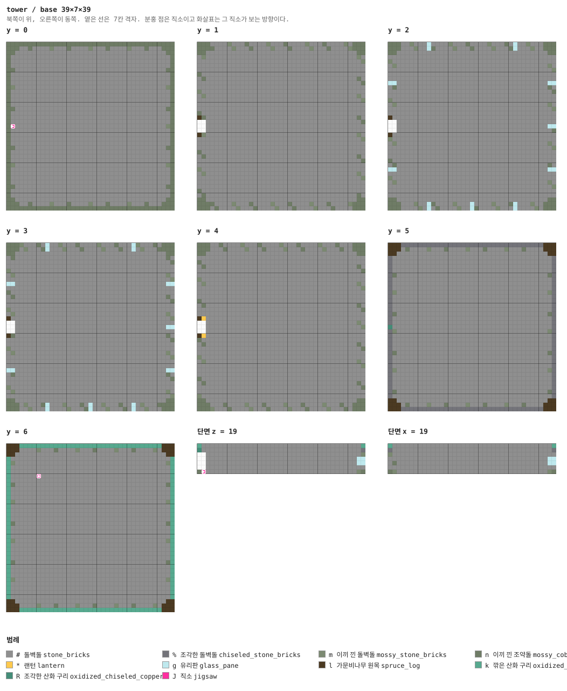

<details><summary>세로 단면 (텍스트)</summary>

```
단면 z = 19   x →동, y ↑하늘
  k#####################################k
  R#####################################%
  ..####################################m
  ..###################################gg
  ..###################################gg
  ..#####################################
  nJ###################################mn
단면 x = 19   z →남, y ↑하늘
  k#####################################k
  %#####################################%
  m######################################
  #####################################gg
  #n###################################gg
  #######################################
  nm###################################mn
```

</details>


### `shaft` — 25×49×25

탑의 몸통. 25×25가 마흔아홉 칸, 즉 일곱 층이다. 벽 두 켜 안쪽은 통짜 돌벽돌이고
`core_shaft`가 그 자리를 다시 가져가 방들이 판다.

층마다 **산화 구리 띠**가 한 줄씩 돌아서 밖에서 층을 셀 수 있고, 모서리에는 조각한 돌벽돌이
한 칸 걸러 박혀 있다. 창문은 한 칸 폭에 세 칸 높이로 **벽 두 켜를 관통해** 뚫고 양쪽에
유리판을 넣는다 — 성에서는 한 켜에만 넣어 벽에 박힌 유리처럼 보였다.

**어느 풀에 있나** — `shaft` (가중치 1)

| 직소 위치 | 향 | name | target | pool |
|---|---|---|---|---|
| (0, 0, 0) | ◇ 아래 | `tow_anchor` | `tow_anchor` | `—` |
| (1, 0, 12) | ▶ 동 | `tow_placer` | `tow_anchor` | `tower/core_shaft` |
| (0, 48, 0) | ◆ 위 | `tow_placer` | `tow_anchor` | `tower/crown` |

**블록** — 돌벽돌 27124, 이끼 낀 조약돌 784, 이끼 낀 돌벽돌 784, 조각한 돌벽돌 782, 깎은 산화 구리 644, 유리판 504, 직소 3

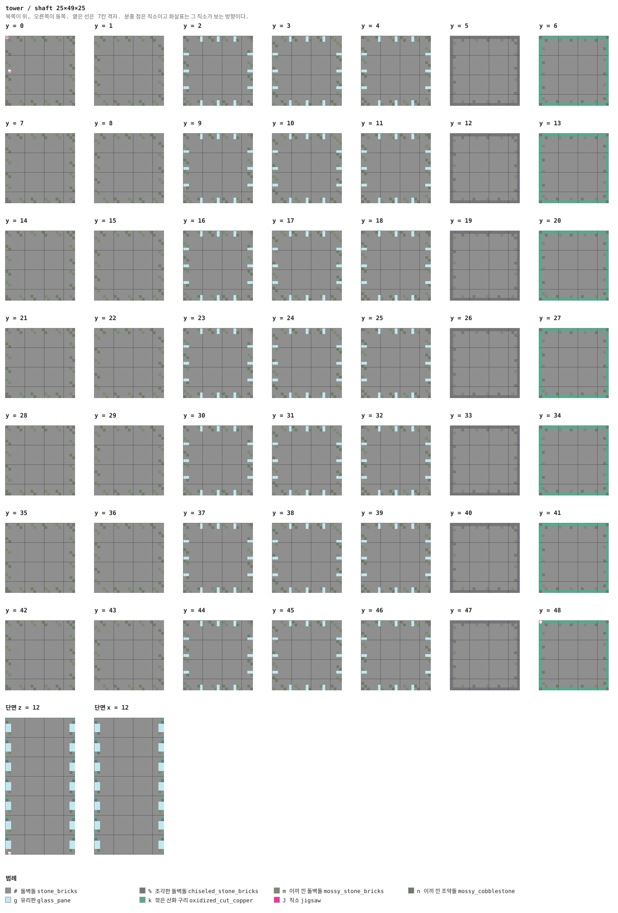

<details><summary>세로 단면 (텍스트)</summary>

```
단면 z = 12   x →동, y ↑하늘
  k#######################k
  %#######################%
  gg#####################gg
  gg#####################gg
  gg#####################gg
  #m#####################n#
  #########################
  k#######################k
  %#######################%
  gg#####################gg
  gg#####################gg
  gg#####################gg
  #m#####################n#
  #########################
  k#######################k
  %#######################%
  gg#####################gg
  gg#####################gg
  gg#####################gg
  #m#####################n#
  #########################
  k#######################k
  %#######################%
  gg#####################gg
  gg#####################gg
  gg#####################gg
  #m#####################n#
  #########################
  k#######################k
  %#######################%
  gg#####################gg
  gg#####################gg
  gg#####################gg
  #m#####################n#
  #########################
  k#######################k
  %#######################%
  gg#####################gg
  gg#####################gg
  gg#####################gg
  #m#####################n#
  #########################
  k#######################k
  %#######################%
  gg#####################gg
  gg#####################gg
  gg#####################gg
  #m#####################n#
  #J#######################
단면 x = 12   z →남, y ↑하늘
  k#######################k
  %#######################%
  gg#####################gg
  gg#####################gg
  gg#####################gg
  #n#####################m#
  #########################
  k#######################k
  %#######################%
  gg#####################gg
  gg#####################gg
  gg#####################gg
  #n#####################m#
  #########################
  k#######################k
  %#######################%
  gg#####################gg
  gg#####################gg
  gg#####################gg
  #n#####################m#
  #########################
  k#######################k
  %#######################%
  gg#####################gg
  gg#####################gg
  gg#####################gg
  #n#####################m#
  #########################
  k#######################k
  %#######################%
  gg#####################gg
  gg#####################gg
  gg#####################gg
  #n#####################m#
  #########################
  k#######################k
  %#######################%
  gg#####################gg
  gg#####################gg
  gg#####################gg
  #n#####################m#
  #########################
  k#######################k
  %#######################%
  gg#####################gg
  gg#####################gg
  gg#####################gg
  #n#####################m#
  #########################
```

</details>


### `crown` — 39×9×39

옥상 회랑. **몸통보다 일곱 칸씩 튀어나온다** — 레퍼런스의 탑들이 전부 그렇게 생겼고,
이 탑의 실루엣을 만드는 것도 이 한 층이다.

아래 한 켜(y0)는 33폭이고 거기에 산화 구리 계단을 뒤집어 깔아 **처마 밑 경사**를 만든다.
그 위 한 켜가 39폭 갑판이고, 모서리 기둥과 가문비나무 난간이 둘러싼 회랑이 여섯 칸,
그 위가 지붕이 얹히는 처마다.

**core가 없다.** 여기는 방 하나면 되고 미로가 할 일이 없다. 8층에서 올라오는 계단 구멍과
상자 하나, 랜턴 넷이 들어 있다.

**어느 풀에 있나** — `crown` (가중치 1)

| 직소 위치 | 향 | name | target | pool |
|---|---|---|---|---|
| (7, 0, 7) | ◇ 아래 | `tow_anchor` | `tow_anchor` | `—` |
| (0, 8, 0) | ◆ 위 | `tow_placer` | `tow_anchor` | `tower/roof` |

**뚫린 면** — 서: z 0–38, y 0–6 (159칸) / 동: z 0–38, y 0–6 (159칸) / 북: x 0–38, y 0–6 (159칸) / 남: x 0–38, y 0–6 (159칸) / 아래: x 0–38, z 0–38 (440칸)

**블록** — 깎은 산화 구리 2768, 가문비나무 판자 2584, 산화 구리 계단 279, 돌벽돌 180, 가문비나무 울타리 120, 가문비나무 원목 60, 랜턴 4, 직소 2

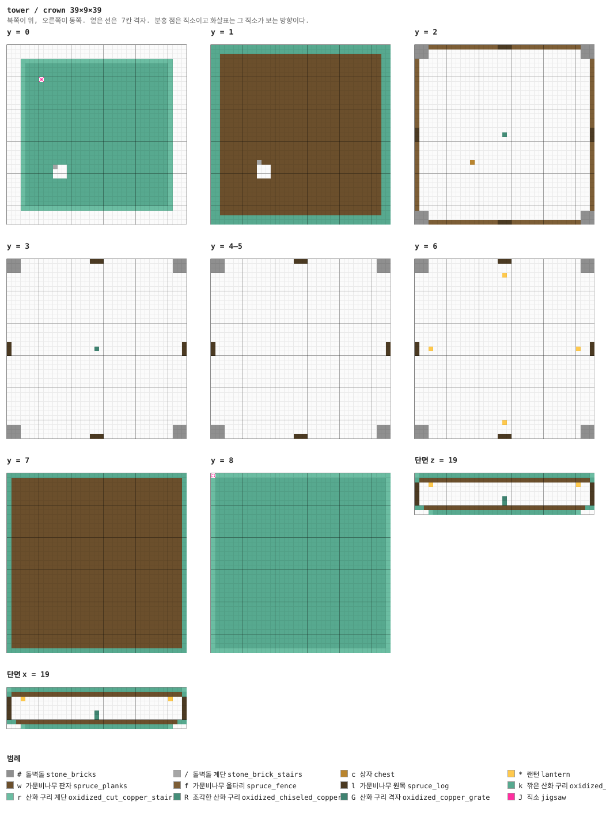

<details><summary>세로 단면 (텍스트)</summary>

```
단면 z = 19   x →동, y ↑하늘
  rkkkkkkkkkkkkkkkkkkkkkkkkkkkkkkkkkkkkkr
  kwwwwwwwwwwwwwwwwwwwwwwwwwwwwwwwwwwwwwk
  l..*...............................*..l
  l.....................................l
  l.....................................l
  l..................G..................l
  l..................R..................l
  kkwwwwwwwwwwwwwwwwwwwwwwwwwwwwwwwwwwwkk
  ...rkkkkkkkkkkkkkkkkkkkkkkkkkkkkkkkr...
단면 x = 19   z →남, y ↑하늘
  rkkkkkkkkkkkkkkkkkkkkkkkkkkkkkkkkkkkkkr
  kwwwwwwwwwwwwwwwwwwwwwwwwwwwwwwwwwwwwwk
  l..*...............................*..l
  l.....................................l
  l.....................................l
  l..................G..................l
  l..................R..................l
  kkwwwwwwwwwwwwwwwwwwwwwwwwwwwwwwwwwwwkk
  ...rkkkkkkkkkkkkkkkkkkkkkkkkkkkkkkkr...
```

</details>


### `roof` — 39×21×39

산화 구리 지붕. 한 켜 올라갈 때마다 한 칸씩 좁아지는 45° 모임지붕이고, 네 면이 전부
바깥을 보는 계단 블록이라 층계가 아니라 경사로 보인다. 꼭대기에 조각한 구리와 격자를 번갈아
쌓아 작은 첨탑을 세우고 그 위에 **피뢰침**을 꽂았다.

**속이 비어 있다** — 껍데기만 있고 아무도 들어가지 않는다. 자식 직소도 없다.

**어느 풀에 있나** — `roof` (가중치 1)

| 직소 위치 | 향 | name | target | pool |
|---|---|---|---|---|
| (0, 0, 0) | ◇ 아래 | `tow_anchor` | `tow_anchor` | `—` |

**뚫린 면** — 서: z 0–38, y 1–20 (780칸) / 동: z 0–38, y 1–20 (780칸) / 북: x 0–38, y 1–20 (780칸) / 남: x 0–38, y 1–20 (780칸) / 아래: x 1–37, z 1–37 (1369칸) / 위: x 0–38, z 0–38 (1520칸)

**블록** — 산화 구리 계단 1440, 산화 구리 80, 직소 1, 조각한 산화 구리 1, 피뢰침 1

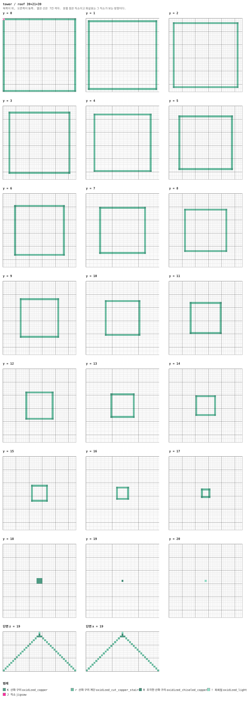

<details><summary>세로 단면 (텍스트)</summary>

```
단면 z = 19   x →동, y ↑하늘
  ...................!...................
  ...................R...................
  ..................KKK..................
  .................r...r.................
  ................r.....r................
  ...............r.......r...............
  ..............r.........r..............
  .............r...........r.............
  ............r.............r............
  ...........r...............r...........
  ..........r.................r..........
  .........r...................r.........
  ........r.....................r........
  .......r.......................r.......
  ......r.........................r......
  .....r...........................r.....
  ....r.............................r....
  ...r...............................r...
  ..r.................................r..
  .r...................................r.
  r.....................................r
단면 x = 19   z →남, y ↑하늘
  ...................!...................
  ...................R...................
  ..................KKK..................
  .................r...r.................
  ................r.....r................
  ...............r.......r...............
  ..............r.........r..............
  .............r...........r.............
  ............r.............r............
  ...........r...............r...........
  ..........r.................r..........
  .........r...................r.........
  ........r.....................r........
  .......r.......................r.......
  ......r.........................r......
  .....r...........................r.....
  ....r.............................r....
  ...r...............................r...
  ..r.................................r..
  .r...................................r.
  r.....................................r
```

</details>


### `core_base` — 35×7×35 — 5×1×5 셀

1층 전체를 덮는 35×7×35 통짜 돌벽돌. 방이 놓이는 것이 곧 파내는 것이다.
이 상자가 **1층 미로의 울타리**이고, 받침 가장자리에서 두 칸 안쪽이라 바깥벽은 안 건드려진다.

직소 둘: 받침에서 들어오는 앵커 하나, 그리고 `hall`을 놓는 것 하나.
**현관 방을 미로에 맡기지 않는다.**

**어느 풀에 있나** — `core_base` (가중치 1)

| 직소 위치 | 향 | name | target | pool |
|---|---|---|---|---|
| (3, 0, 13) | ▼ 남 | `tow_placer` | `tow_riser` | `tower/hall` |
| (0, 0, 17) | ◀ 서 | `tow_anchor` | `tow_anchor` | `—` |

**블록** — 돌벽돌 8573, 직소 2

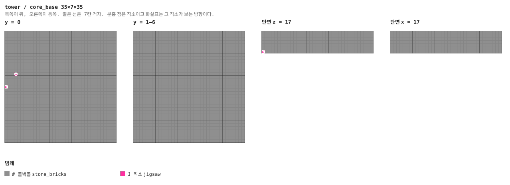

<details><summary>세로 단면 (텍스트)</summary>

```
단면 z = 17   x →동, y ↑하늘
  ###################################
  ###################################
  ###################################
  ###################################
  ###################################
  ###################################
  J##################################
단면 x = 17   z →남, y ↑하늘
  ###################################
  ###################################
  ###################################
  ###################################
  ###################################
  ###################################
  ###################################
```

</details>


### `core_shaft` — 21×49×21 — 3×7×3 셀

2~8층 전체를 덮는 21×49×21 통짜 돌벽돌. 도서관과 성소가 층 경계를 넘나들 수 있는 것은
이게 층마다 잘려 있지 않기 때문이다.

직소 둘: 몸통에서 들어오는 앵커, 그리고 2층 착지방(`land_2`)을 놓는 것.
그 한 칸에서 등반 사슬 전체가 시작된다.

**어느 풀에 있나** — `core_shaft` (가중치 1)

| 직소 위치 | 향 | name | target | pool |
|---|---|---|---|---|
| (0, 0, 10) | ◀ 서 | `tow_anchor` | `tow_anchor` | `—` |
| (6, 0, 10) | ▶ 동 | `tow_placer` | `tow_riser` | `tower/land_2` |

**블록** — 돌벽돌 21607, 직소 2

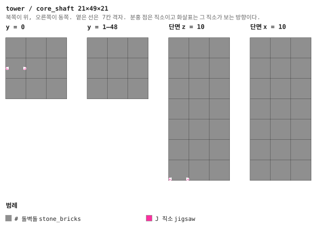

<details><summary>층별 지도 (텍스트)</summary>

```
y = 0   x →동, z ↓남
  #####################
  #####################
  #####################
  #####################
  #####################
  #####################
  #####################
  #####################
  #####################
  #####################
  J#####J##############
  #####################
  #####################
  #####################
  #####################
  #####################
  #####################
  #####################
  #####################
  #####################
  #####################
y = 1–48   x →동, z ↓남
  #####################
  #####################
  #####################
  #####################
  #####################
  #####################
  #####################
  #####################
  #####################
  #####################
  #####################
  #####################
  #####################
  #####################
  #####################
  #####################
  #####################
  #####################
  #####################
  #####################
  #####################
```

</details>

<details><summary>세로 단면 (텍스트)</summary>

```
단면 z = 10   x →동, y ↑하늘
  #####################
  #####################
  #####################
  #####################
  #####################
  #####################
  #####################
  #####################
  #####################
  #####################
  #####################
  #####################
  #####################
  #####################
  #####################
  #####################
  #####################
  #####################
  #####################
  #####################
  #####################
  #####################
  #####################
  #####################
  #####################
  #####################
  #####################
  #####################
  #####################
  #####################
  #####################
  #####################
  #####################
  #####################
  #####################
  #####################
  #####################
  #####################
  #####################
  #####################
  #####################
  #####################
  #####################
  #####################
  #####################
  #####################
  #####################
  #####################
  J#####J##############
단면 x = 10   z →남, y ↑하늘
  #####################
  #####################
  #####################
  #####################
  #####################
  #####################
  #####################
  #####################
  #####################
  #####################
  #####################
  #####################
  #####################
  #####################
  #####################
  #####################
  #####################
  #####################
  #####################
  #####################
  #####################
  #####################
  #####################
  #####################
  #####################
  #####################
  #####################
  #####################
  #####################
  #####################
  #####################
  #####################
  #####################
  #####################
  #####################
  #####################
  #####################
  #####################
  #####################
  #####################
  #####################
  #####################
  #####################
  #####################
  #####################
  #####################
  #####################
  #####################
  #####################
```

</details>


### `hall` — 7×7×7 — 1×1×1 셀

현관 바로 안쪽. 1층에서 **자리가 고정된 유일한 시작점**이라 바깥문이 돌벽에 막힐 수 없다.
동쪽이 복도로, 남쪽이 미로로 간다. 상자 하나.

**어느 풀에 있나** — `hall` (가중치 1)

| 직소 위치 | 향 | name | target | pool |
|---|---|---|---|---|
| (3, 0, 0) | ▲ 북 | `tow_riser` | `tow_riser` | `—` |
| (6, 0, 3) | ▶ 동 | `tow_placer` | `tow_riser` | `tower/corridor` |
| (3, 0, 6) | ▼ 남 | `tow_door` | `tow_door` | `tower/passages` |

**뚫린 면** — 서: z 2–4, y 1–4 (12칸) / 동: z 2–4, y 1–4 (12칸) / 남: x 2–4, y 1–4 (12칸)

**블록** — 돌벽돌 133, 가문비나무 판자 46, 가문비나무 원목 4, 직소 3, 랜턴 1, 상자 1

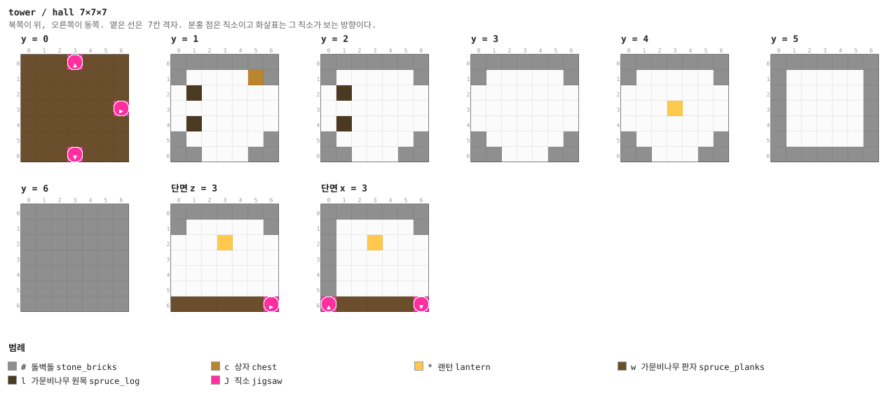

<details><summary>층별 지도 (텍스트)</summary>

```
y = 0   x →동, z ↓남
  wwwJwww
  wwwwwww
  wwwwwww
  wwwwwwJ
  wwwwwww
  wwwwwww
  wwwJwww
y = 1   x →동, z ↓남
  #######
  #....c#
  .l.....
  .......
  .l.....
  #.....#
  ##...##
y = 2   x →동, z ↓남
  #######
  #.....#
  .l.....
  .......
  .l.....
  #.....#
  ##...##
y = 3   x →동, z ↓남
  #######
  #.....#
  .......
  .......
  .......
  #.....#
  ##...##
y = 4   x →동, z ↓남
  #######
  #.....#
  .......
  ...*...
  .......
  #.....#
  ##...##
y = 5   x →동, z ↓남
  #######
  #.....#
  #.....#
  #.....#
  #.....#
  #.....#
  #######
y = 6   x →동, z ↓남
  #######
  #######
  #######
  #######
  #######
  #######
  #######
```

</details>


### `corridor` — 7×7×7 — 1×1×1 셀

현관과 대계단 사이. 북쪽 문이 연금실을 놓는다 — 성에서는 이 방이 복도 한가운데 떨어져
있었는데, 이제는 반드시 복도에서 문 하나로 들어간다.

**어느 풀에 있나** — `corridor` (가중치 1)

| 직소 위치 | 향 | name | target | pool |
|---|---|---|---|---|
| (3, 0, 0) | ▲ 북 | `tow_placer` | `tow_anchor` | `tower/alchemy` |
| (0, 0, 3) | ◀ 서 | `tow_riser` | `tow_riser` | `—` |
| (6, 0, 3) | ▶ 동 | `tow_placer` | `tow_riser` | `tower/great_stair` |

**뚫린 면** — 서: z 2–4, y 1–4 (12칸) / 동: z 2–4, y 1–4 (12칸) / 북: x 2–4, y 1–4 (12칸)

**블록** — 돌벽돌 133, 가문비나무 판자 46, 직소 3, 랜턴 1

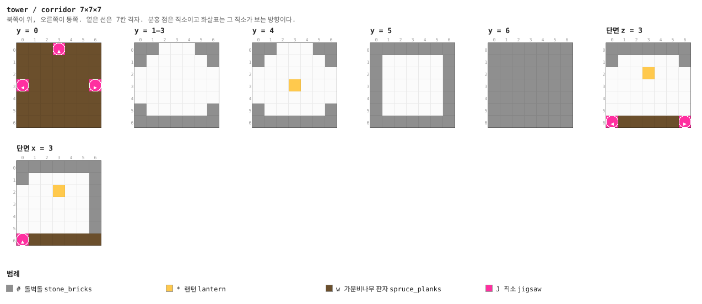

<details><summary>층별 지도 (텍스트)</summary>

```
y = 0   x →동, z ↓남
  wwwJwww
  wwwwwww
  wwwwwww
  JwwwwwJ
  wwwwwww
  wwwwwww
  wwwwwww
y = 1–3   x →동, z ↓남
  ##...##
  #.....#
  .......
  .......
  .......
  #.....#
  #######
y = 4   x →동, z ↓남
  ##...##
  #.....#
  .......
  ...*...
  .......
  #.....#
  #######
y = 5   x →동, z ↓남
  #######
  #.....#
  #.....#
  #.....#
  #.....#
  #.....#
  #######
y = 6   x →동, z ↓남
  #######
  #######
  #######
  #######
  #######
  #######
  #######
```

</details>


### `alchemy` — 7×7×7 — 1×1×1 셀

연금실. 양조기·가마솥 둘·상자. 탑에 들어와 처음 만나는 방이고, 이 모드가 양조를 보여 주는
첫 자리다.

**어느 풀에 있나** — `alchemy` (가중치 1)

| 직소 위치 | 향 | name | target | pool |
|---|---|---|---|---|
| (3, 0, 6) | ▼ 남 | `tow_anchor` | `tow_anchor` | `—` |

**뚫린 면** — 남: x 2–4, y 1–4 (12칸)

**블록** — 돌벽돌 157, 가문비나무 판자 48, 윤나는 심층암 4, 가마솥 2, 상자 1, 직소 1, 양조기 1, 영혼 랜턴 1

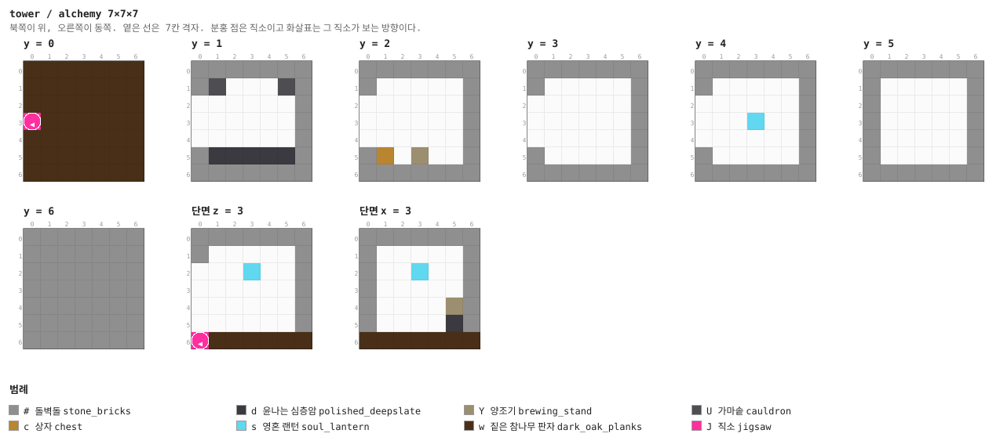

<details><summary>층별 지도 (텍스트)</summary>

```
y = 0   x →동, z ↓남
  wwwwwww
  wwwwwww
  wwwwwww
  wwwwwww
  wwwwwww
  wwwwwww
  wwwJwww
y = 1   x →동, z ↓남
  #######
  #ddddB#
  #.....#
  #.....#
  #.....#
  #U...U#
  ##...##
y = 2   x →동, z ↓남
  #######
  #c.Y..#
  #.....#
  #.....#
  #.....#
  #.....#
  ##...##
y = 3   x →동, z ↓남
  #######
  #.....#
  #.....#
  #.....#
  #.....#
  #.....#
  ##...##
y = 4   x →동, z ↓남
  #######
  #.....#
  #.....#
  #..s..#
  #.....#
  #.....#
  ##...##
y = 5   x →동, z ↓남
  #######
  #.....#
  #.....#
  #.....#
  #.....#
  #.....#
  #######
y = 6   x →동, z ↓남
  #######
  #######
  #######
  #######
  #######
  #######
  #######
```

</details>


### `great_stair` — 7×7×7 — 1×1×1 셀

1층에서 2층으로 오르는 대계단. **껍데기 경계를 넘으므로 직소를 쓰지 않는다** — 계단 다섯
칸과 천장 구멍이 여기 있고, 바닥 구멍과 마지막 한 칸은 바로 위의 `land_2`에 있다.
둘 다 `FLIGHTS` 표에서 나온 같은 좌표다.

**어느 풀에 있나** — `great_stair` (가중치 1)

| 직소 위치 | 향 | name | target | pool |
|---|---|---|---|---|
| (0, 0, 3) | ◀ 서 | `tow_riser` | `tow_riser` | `—` |
| (3, 0, 6) | ▼ 남 | `tow_door` | `tow_door` | `tower/passages` |

**뚫린 면** — 서: z 2–4, y 1–4 (12칸) / 남: x 2–4, y 1–4 (12칸) / 위: x 3–5, z 1–3 (8칸)

**블록** — 돌벽돌 136, 가문비나무 판자 47, 돌벽돌 계단 6, 직소 2, 랜턴 1


<details><summary>층별 지도 (텍스트)</summary>

```
y = 0   x →동, z ↓남
  wwwwwww
  wwwwwww
  wwwwwww
  Jwwwwww
  wwwwwww
  wwwwwww
  wwwJwww
y = 1   x →동, z ↓남
  #######
  #/....#
  ......#
  ......#
  ......#
  #.....#
  ##...##
y = 2   x →동, z ↓남
  #######
  #./...#
  ......#
  ......#
  ......#
  #.....#
  ##...##
y = 3   x →동, z ↓남
  #######
  #../..#
  ......#
  ......#
  ......#
  #.....#
  ##...##
y = 4   x →동, z ↓남
  #######
  #.../.#
  ......#
  ......#
  ......#
  #*....#
  ##...##
y = 5   x →동, z ↓남
  #######
  #..../#
  #.....#
  #.....#
  #.....#
  #.....#
  #######
y = 6   x →동, z ↓남
  #######
  ###...#
  ###../#
  ###...#
  #######
  #######
  #######
```

</details>


### `land_2` — 7×7×7 — 1×1×1 셀

2층 착지방. 대계단이 바닥 구멍으로 올라오는 자리다. 다른 착지방과 달리 **입구 직소가
가로**로 붙어 있는데(`core_shaft`가 놓기 때문), 실제로 올라오는 길은 바닥 구멍이다.

**어느 풀에 있나** — `land_2` (가중치 1)

| 직소 위치 | 향 | name | target | pool |
|---|---|---|---|---|
| (3, 0, 0) | ▲ 북 | `tow_placer` | `tow_riser` | `tower/stair_2` |
| (0, 0, 3) | ◀ 서 | `tow_riser` | `tow_riser` | `—` |
| (6, 0, 3) | ▶ 동 | `tow_door` | `tow_door` | `tower/passages` |
| (3, 0, 6) | ▼ 남 | `tow_door` | `tow_door` | `tower/passages` |

**뚫린 면** — 동: z 2–4, y 1–4 (12칸) / 북: x 2–4, y 1–4 (12칸) / 남: x 2–4, y 1–4 (12칸) / 아래: x 3–5, z 1–3 (8칸)

**블록** — 돌벽돌 133, 가문비나무 판자 36, 직소 4, 랜턴 1, 돌벽돌 계단 1

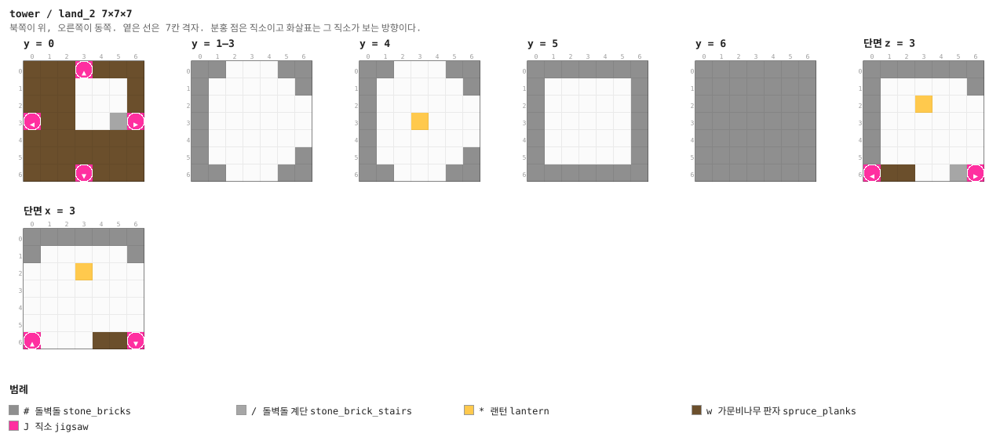

<details><summary>층별 지도 (텍스트)</summary>

```
y = 0   x →동, z ↓남
  wwwJwww
  www...w
  www...w
  Jww../J
  wwwwwww
  wwwwwww
  wwwJwww
y = 1–3   x →동, z ↓남
  ##...##
  #.....#
  #......
  #......
  #......
  #.....#
  ##...##
y = 4   x →동, z ↓남
  ##...##
  #.....#
  #......
  #..*...
  #......
  #.....#
  ##...##
y = 5   x →동, z ↓남
  #######
  #.....#
  #.....#
  #.....#
  #.....#
  #.....#
  #######
y = 6   x →동, z ↓남
  #######
  #######
  #######
  #######
  #######
  #######
  #######
```

</details>


### `stair_2` — 7×7×7 — 1×1×1 셀

2층 계단방. 착지방에서 문 하나로 들어와 다섯 칸을 오르고, 여섯 번째 칸이 **자기 천장의
구멍**을 지나 위층으로 나간다. 그래서 위층 착지방은 이 조각 바로 위 칸이다.
사다리가 아니라 계단인 것이 0.4.0에서 바뀐 점이고, 층마다 칸이 달라서 매 층 걸어 찾아야 한다.

**어느 풀에 있나** — `stair_2` (가중치 1)

| 직소 위치 | 향 | name | target | pool |
|---|---|---|---|---|
| (3, 0, 6) | ▼ 남 | `tow_riser` | `tow_riser` | `—` |
| (0, 6, 0) | ◆ 위 | `tow_placer` | `tow_riser` | `tower/land_3` |

**뚫린 면** — 남: x 2–4, y 1–4 (12칸) / 위: x 3–5, z 1–3 (8칸)

**블록** — 돌벽돌 147, 가문비나무 판자 48, 돌벽돌 계단 6, 직소 2, 랜턴 1

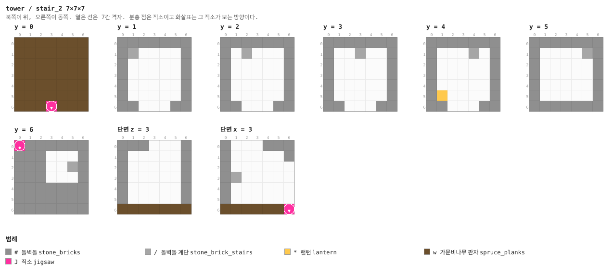

<details><summary>층별 지도 (텍스트)</summary>

```
y = 0   x →동, z ↓남
  wwwwwww
  wwwwwww
  wwwwwww
  wwwwwww
  wwwwwww
  wwwwwww
  wwwJwww
y = 1   x →동, z ↓남
  #######
  #/....#
  #.....#
  #.....#
  #.....#
  #.....#
  ##...##
y = 2   x →동, z ↓남
  #######
  #./...#
  #.....#
  #.....#
  #.....#
  #.....#
  ##...##
y = 3   x →동, z ↓남
  #######
  #../..#
  #.....#
  #.....#
  #.....#
  #.....#
  ##...##
y = 4   x →동, z ↓남
  #######
  #.../.#
  #.....#
  #.....#
  #.....#
  #*....#
  ##...##
y = 5   x →동, z ↓남
  #######
  #..../#
  #.....#
  #.....#
  #.....#
  #.....#
  #######
y = 6   x →동, z ↓남
  J######
  ###...#
  ###../#
  ###...#
  #######
  #######
  #######
```

</details>


### `land_3` — 7×7×7 — 1×1×1 셀

3층 착지방. 남쪽 문이 **도서관**을 놓는다. 도서관은 3~4층 두 층을 쓰므로 4층 착지방에는
그 문이 없다 — 그 자리가 도서관이다.

**어느 풀에 있나** — `land_3` (가중치 1)

| 직소 위치 | 향 | name | target | pool |
|---|---|---|---|---|
| (0, 0, 0) | ◇ 아래 | `tow_riser` | `tow_riser` | `—` |
| (0, 0, 3) | ◀ 서 | `tow_door` | `tow_door` | `tower/passages` |
| (6, 0, 3) | ▶ 동 | `tow_placer` | `tow_riser` | `tower/stair_3` |
| (3, 0, 6) | ▼ 남 | `tow_placer` | `tow_anchor` | `tower/library` |

**뚫린 면** — 서: z 2–4, y 1–4 (12칸) / 동: z 2–4, y 1–4 (12칸) / 남: x 2–4, y 1–4 (12칸) / 아래: x 3–5, z 1–3 (8칸)

**블록** — 돌벽돌 133, 가문비나무 판자 36, 직소 4, 랜턴 1, 돌벽돌 계단 1

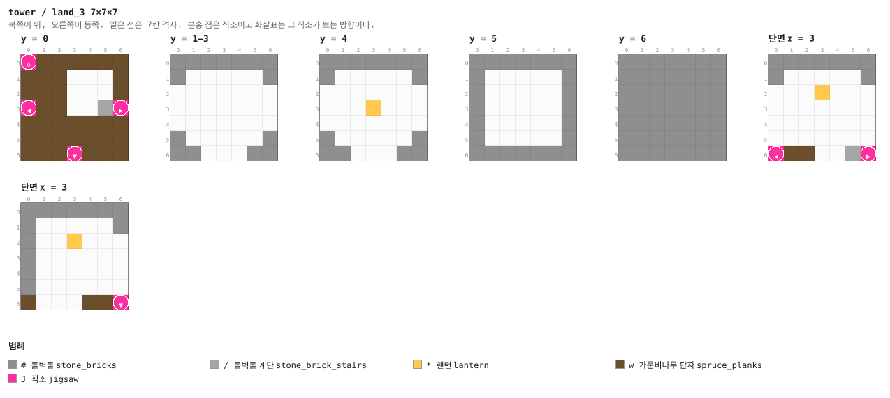

<details><summary>층별 지도 (텍스트)</summary>

```
y = 0   x →동, z ↓남
  Jwwwwww
  www...w
  www...w
  Jww../J
  wwwwwww
  wwwwwww
  wwwJwww
y = 1–3   x →동, z ↓남
  #######
  #.....#
  .......
  .......
  .......
  #.....#
  ##...##
y = 4   x →동, z ↓남
  #######
  #.....#
  .......
  ...*...
  .......
  #.....#
  ##...##
y = 5   x →동, z ↓남
  #######
  #.....#
  #.....#
  #.....#
  #.....#
  #.....#
  #######
y = 6   x →동, z ↓남
  #######
  #######
  #######
  #######
  #######
  #######
  #######
```

</details>


### `stair_3` — 7×7×7 — 1×1×1 셀

3층 계단방. 착지방에서 문 하나로 들어와 다섯 칸을 오르고, 여섯 번째 칸이 **자기 천장의
구멍**을 지나 위층으로 나간다. 그래서 위층 착지방은 이 조각 바로 위 칸이다.
사다리가 아니라 계단인 것이 0.4.0에서 바뀐 점이고, 층마다 칸이 달라서 매 층 걸어 찾아야 한다.

**어느 풀에 있나** — `stair_3` (가중치 1)

| 직소 위치 | 향 | name | target | pool |
|---|---|---|---|---|
| (0, 0, 3) | ◀ 서 | `tow_riser` | `tow_riser` | `—` |
| (0, 6, 0) | ◆ 위 | `tow_placer` | `tow_riser` | `tower/land_4` |

**뚫린 면** — 서: z 2–4, y 1–4 (12칸) / 위: x 3–5, z 1–3 (8칸)

**블록** — 돌벽돌 147, 가문비나무 판자 48, 돌벽돌 계단 6, 직소 2, 랜턴 1

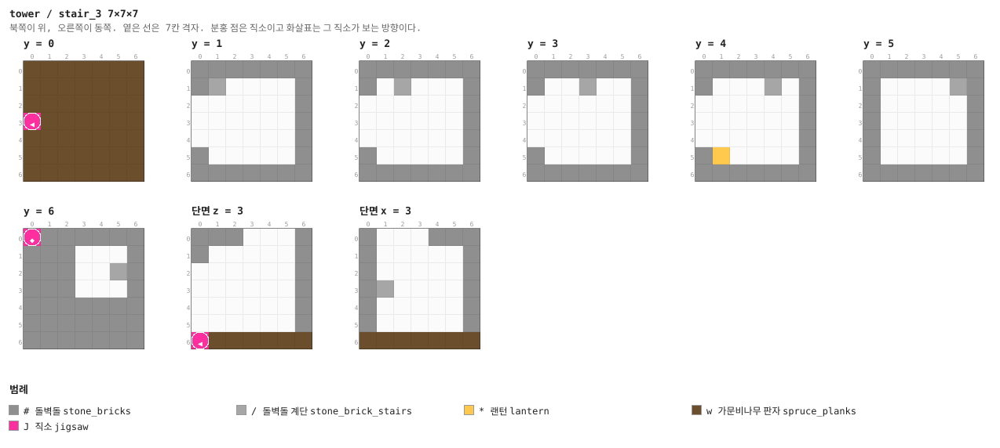

<details><summary>층별 지도 (텍스트)</summary>

```
y = 0   x →동, z ↓남
  wwwwwww
  wwwwwww
  wwwwwww
  Jwwwwww
  wwwwwww
  wwwwwww
  wwwwwww
y = 1   x →동, z ↓남
  #######
  #/....#
  ......#
  ......#
  ......#
  #.....#
  #######
y = 2   x →동, z ↓남
  #######
  #./...#
  ......#
  ......#
  ......#
  #.....#
  #######
y = 3   x →동, z ↓남
  #######
  #../..#
  ......#
  ......#
  ......#
  #.....#
  #######
y = 4   x →동, z ↓남
  #######
  #.../.#
  ......#
  ......#
  ......#
  #*....#
  #######
y = 5   x →동, z ↓남
  #######
  #..../#
  #.....#
  #.....#
  #.....#
  #.....#
  #######
y = 6   x →동, z ↓남
  J######
  ###...#
  ###../#
  ###...#
  #######
  #######
  #######
```

</details>


### `land_4` — 7×7×7 — 1×1×1 셀

4층 착지방. 아래층 계단방이 **위쪽 직소로 이 조각을 놓고**, 바닥 구멍으로 사람이 올라온다.
입구 직소는 바닥면에 하나뿐이라 뒤집혀 붙을 수 없다(§13). 옆면 하나가 그 층의 계단방을
놓고, 남은 면이 그 층 미로의 시작이다.

**어느 풀에 있나** — `land_4` (가중치 1)

| 직소 위치 | 향 | name | target | pool |
|---|---|---|---|---|
| (0, 0, 0) | ◇ 아래 | `tow_riser` | `tow_riser` | `—` |
| (0, 0, 3) | ◀ 서 | `tow_door` | `tow_door` | `tower/passages` |
| (3, 0, 6) | ▼ 남 | `tow_placer` | `tow_riser` | `tower/stair_4` |

**뚫린 면** — 서: z 2–4, y 1–4 (12칸) / 남: x 2–4, y 1–4 (12칸) / 아래: x 3–5, z 1–3 (8칸)

**블록** — 돌벽돌 145, 가문비나무 판자 37, 직소 3, 랜턴 1, 돌벽돌 계단 1

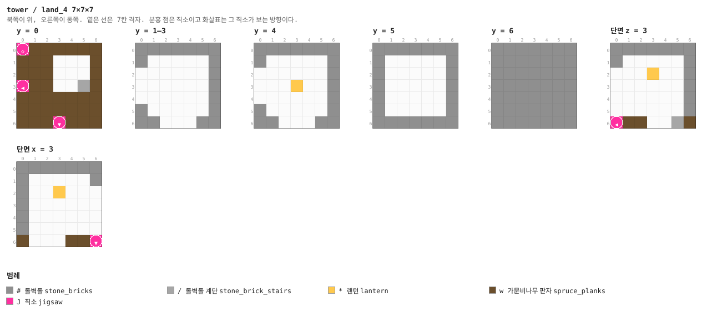

<details><summary>층별 지도 (텍스트)</summary>

```
y = 0   x →동, z ↓남
  Jwwwwww
  www...w
  www...w
  Jww../w
  wwwwwww
  wwwwwww
  wwwJwww
y = 1–3   x →동, z ↓남
  #######
  #.....#
  ......#
  ......#
  ......#
  #.....#
  ##...##
y = 4   x →동, z ↓남
  #######
  #.....#
  ......#
  ...*..#
  ......#
  #.....#
  ##...##
y = 5   x →동, z ↓남
  #######
  #.....#
  #.....#
  #.....#
  #.....#
  #.....#
  #######
y = 6   x →동, z ↓남
  #######
  #######
  #######
  #######
  #######
  #######
  #######
```

</details>


### `stair_4` — 7×7×7 — 1×1×1 셀

4층 계단방. 착지방에서 문 하나로 들어와 다섯 칸을 오르고, 여섯 번째 칸이 **자기 천장의
구멍**을 지나 위층으로 나간다. 그래서 위층 착지방은 이 조각 바로 위 칸이다.
사다리가 아니라 계단인 것이 0.4.0에서 바뀐 점이고, 층마다 칸이 달라서 매 층 걸어 찾아야 한다.

**어느 풀에 있나** — `stair_4` (가중치 1)

| 직소 위치 | 향 | name | target | pool |
|---|---|---|---|---|
| (3, 0, 0) | ▲ 북 | `tow_riser` | `tow_riser` | `—` |
| (0, 6, 0) | ◆ 위 | `tow_placer` | `tow_riser` | `tower/land_5` |

**뚫린 면** — 북: x 2–4, y 1–4 (12칸) / 위: x 3–5, z 1–3 (8칸)

**블록** — 돌벽돌 147, 가문비나무 판자 48, 돌벽돌 계단 6, 직소 2, 랜턴 1

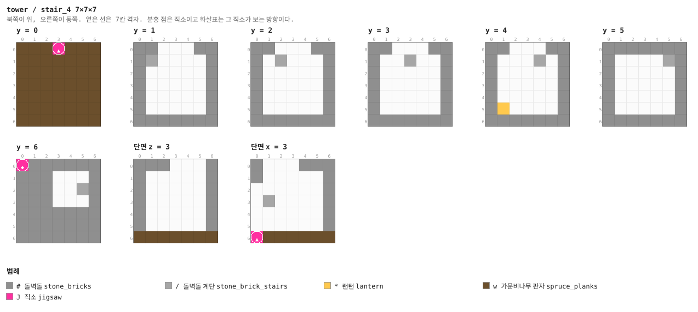

<details><summary>층별 지도 (텍스트)</summary>

```
y = 0   x →동, z ↓남
  wwwJwww
  wwwwwww
  wwwwwww
  wwwwwww
  wwwwwww
  wwwwwww
  wwwwwww
y = 1   x →동, z ↓남
  ##...##
  #/....#
  #.....#
  #.....#
  #.....#
  #.....#
  #######
y = 2   x →동, z ↓남
  ##...##
  #./...#
  #.....#
  #.....#
  #.....#
  #.....#
  #######
y = 3   x →동, z ↓남
  ##...##
  #../..#
  #.....#
  #.....#
  #.....#
  #.....#
  #######
y = 4   x →동, z ↓남
  ##...##
  #.../.#
  #.....#
  #.....#
  #.....#
  #*....#
  #######
y = 5   x →동, z ↓남
  #######
  #..../#
  #.....#
  #.....#
  #.....#
  #.....#
  #######
y = 6   x →동, z ↓남
  J######
  ###...#
  ###../#
  ###...#
  #######
  #######
  #######
```

</details>


### `land_5` — 7×7×7 — 1×1×1 셀

5층 착지방. 아래층 계단방이 **위쪽 직소로 이 조각을 놓고**, 바닥 구멍으로 사람이 올라온다.
입구 직소는 바닥면에 하나뿐이라 뒤집혀 붙을 수 없다(§13). 옆면 하나가 그 층의 계단방을
놓고, 남은 면이 그 층 미로의 시작이다.

**어느 풀에 있나** — `land_5` (가중치 1)

| 직소 위치 | 향 | name | target | pool |
|---|---|---|---|---|
| (0, 0, 0) | ◇ 아래 | `tow_riser` | `tow_riser` | `—` |
| (3, 0, 0) | ▲ 북 | `tow_door` | `tow_door` | `tower/passages` |
| (0, 0, 3) | ◀ 서 | `tow_placer` | `tow_riser` | `tower/stair_5` |
| (3, 0, 6) | ▼ 남 | `tow_door` | `tow_door` | `tower/passages` |

**뚫린 면** — 서: z 2–4, y 1–4 (12칸) / 북: x 2–4, y 1–4 (12칸) / 남: x 2–4, y 1–4 (12칸) / 아래: x 3–5, z 1–3 (8칸)

**블록** — 돌벽돌 133, 가문비나무 판자 36, 직소 4, 랜턴 1, 돌벽돌 계단 1

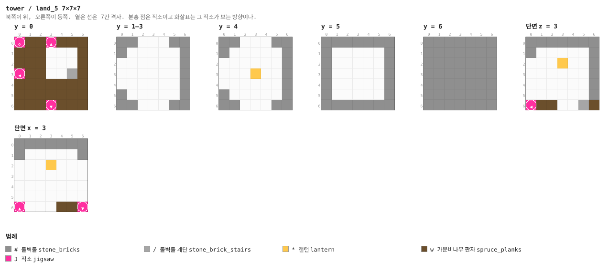

<details><summary>층별 지도 (텍스트)</summary>

```
y = 0   x →동, z ↓남
  JwwJwww
  www...w
  www...w
  Jww../w
  wwwwwww
  wwwwwww
  wwwJwww
y = 1–3   x →동, z ↓남
  ##...##
  #.....#
  ......#
  ......#
  ......#
  #.....#
  ##...##
y = 4   x →동, z ↓남
  ##...##
  #.....#
  ......#
  ...*..#
  ......#
  #.....#
  ##...##
y = 5   x →동, z ↓남
  #######
  #.....#
  #.....#
  #.....#
  #.....#
  #.....#
  #######
y = 6   x →동, z ↓남
  #######
  #######
  #######
  #######
  #######
  #######
  #######
```

</details>


### `stair_5` — 7×7×7 — 1×1×1 셀

5층 계단방. 착지방에서 문 하나로 들어와 다섯 칸을 오르고, 여섯 번째 칸이 **자기 천장의
구멍**을 지나 위층으로 나간다. 그래서 위층 착지방은 이 조각 바로 위 칸이다.
사다리가 아니라 계단인 것이 0.4.0에서 바뀐 점이고, 층마다 칸이 달라서 매 층 걸어 찾아야 한다.

**어느 풀에 있나** — `stair_5` (가중치 1)

| 직소 위치 | 향 | name | target | pool |
|---|---|---|---|---|
| (6, 0, 3) | ▶ 동 | `tow_riser` | `tow_riser` | `—` |
| (0, 6, 0) | ◆ 위 | `tow_placer` | `tow_riser` | `tower/land_6` |

**뚫린 면** — 동: z 2–4, y 1–4 (12칸) / 위: x 3–5, z 1–3 (8칸)

**블록** — 돌벽돌 147, 가문비나무 판자 48, 돌벽돌 계단 6, 직소 2, 랜턴 1


<details><summary>층별 지도 (텍스트)</summary>

```
y = 0   x →동, z ↓남
  wwwwwww
  wwwwwww
  wwwwwww
  wwwwwwJ
  wwwwwww
  wwwwwww
  wwwwwww
y = 1   x →동, z ↓남
  #######
  #/....#
  #......
  #......
  #......
  #.....#
  #######
y = 2   x →동, z ↓남
  #######
  #./...#
  #......
  #......
  #......
  #.....#
  #######
y = 3   x →동, z ↓남
  #######
  #../..#
  #......
  #......
  #......
  #.....#
  #######
y = 4   x →동, z ↓남
  #######
  #.../.#
  #......
  #......
  #......
  #*....#
  #######
y = 5   x →동, z ↓남
  #######
  #..../#
  #.....#
  #.....#
  #.....#
  #.....#
  #######
y = 6   x →동, z ↓남
  J######
  ###...#
  ###../#
  ###...#
  #######
  #######
  #######
```

</details>


### `land_6` — 7×7×7 — 1×1×1 셀

6층 착지방. 아래층 계단방이 **위쪽 직소로 이 조각을 놓고**, 바닥 구멍으로 사람이 올라온다.
입구 직소는 바닥면에 하나뿐이라 뒤집혀 붙을 수 없다(§13). 옆면 하나가 그 층의 계단방을
놓고, 남은 면이 그 층 미로의 시작이다.

**어느 풀에 있나** — `land_6` (가중치 1)

| 직소 위치 | 향 | name | target | pool |
|---|---|---|---|---|
| (0, 0, 0) | ◇ 아래 | `tow_riser` | `tow_riser` | `—` |
| (3, 0, 0) | ▲ 북 | `tow_door` | `tow_door` | `tower/passages` |
| (0, 0, 3) | ◀ 서 | `tow_placer` | `tow_riser` | `tower/stair_6` |
| (6, 0, 3) | ▶ 동 | `tow_door` | `tow_door` | `tower/passages` |
| (3, 0, 6) | ▼ 남 | `tow_door` | `tow_door` | `tower/passages` |

**뚫린 면** — 서: z 2–4, y 1–4 (12칸) / 동: z 2–4, y 1–4 (12칸) / 북: x 2–4, y 1–4 (12칸) / 남: x 2–4, y 1–4 (12칸) / 아래: x 3–5, z 1–3 (8칸)

**블록** — 돌벽돌 121, 가문비나무 판자 35, 직소 5, 랜턴 1, 돌벽돌 계단 1

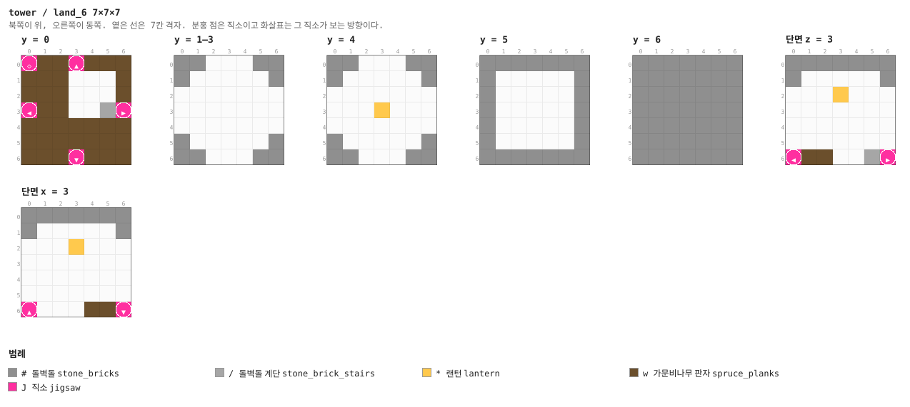

<details><summary>층별 지도 (텍스트)</summary>

```
y = 0   x →동, z ↓남
  JwwJwww
  www...w
  www...w
  Jww../J
  wwwwwww
  wwwwwww
  wwwJwww
y = 1–3   x →동, z ↓남
  ##...##
  #.....#
  .......
  .......
  .......
  #.....#
  ##...##
y = 4   x →동, z ↓남
  ##...##
  #.....#
  .......
  ...*...
  .......
  #.....#
  ##...##
y = 5   x →동, z ↓남
  #######
  #.....#
  #.....#
  #.....#
  #.....#
  #.....#
  #######
y = 6   x →동, z ↓남
  #######
  #######
  #######
  #######
  #######
  #######
  #######
```

</details>


### `stair_6` — 7×7×7 — 1×1×1 셀

6층 계단방. 착지방에서 문 하나로 들어와 다섯 칸을 오르고, 여섯 번째 칸이 **자기 천장의
구멍**을 지나 위층으로 나간다. 그래서 위층 착지방은 이 조각 바로 위 칸이다.
사다리가 아니라 계단인 것이 0.4.0에서 바뀐 점이고, 층마다 칸이 달라서 매 층 걸어 찾아야 한다.

**어느 풀에 있나** — `stair_6` (가중치 1)

| 직소 위치 | 향 | name | target | pool |
|---|---|---|---|---|
| (6, 0, 3) | ▶ 동 | `tow_riser` | `tow_riser` | `—` |
| (0, 6, 0) | ◆ 위 | `tow_placer` | `tow_riser` | `tower/land_7` |

**뚫린 면** — 동: z 2–4, y 1–4 (12칸) / 위: x 3–5, z 1–3 (8칸)

**블록** — 돌벽돌 147, 가문비나무 판자 48, 돌벽돌 계단 6, 직소 2, 랜턴 1

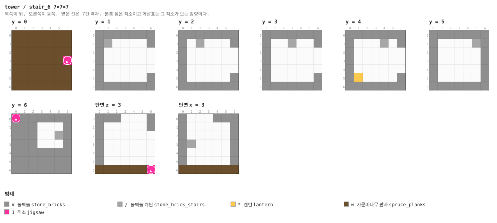

<details><summary>층별 지도 (텍스트)</summary>

```
y = 0   x →동, z ↓남
  wwwwwww
  wwwwwww
  wwwwwww
  wwwwwwJ
  wwwwwww
  wwwwwww
  wwwwwww
y = 1   x →동, z ↓남
  #######
  #/....#
  #......
  #......
  #......
  #.....#
  #######
y = 2   x →동, z ↓남
  #######
  #./...#
  #......
  #......
  #......
  #.....#
  #######
y = 3   x →동, z ↓남
  #######
  #../..#
  #......
  #......
  #......
  #.....#
  #######
y = 4   x →동, z ↓남
  #######
  #.../.#
  #......
  #......
  #......
  #*....#
  #######
y = 5   x →동, z ↓남
  #######
  #..../#
  #.....#
  #.....#
  #.....#
  #.....#
  #######
y = 6   x →동, z ↓남
  J######
  ###...#
  ###../#
  ###...#
  #######
  #######
  #######
```

</details>


### `land_7` — 7×7×7 — 1×1×1 셀

7층 착지방. 동쪽 문이 **성소**를 놓는다. 탑의 보스방으로 가는 길은 이 문 하나뿐이고
착지하자마자 바로 옆이다.

**어느 풀에 있나** — `land_7` (가중치 1)

| 직소 위치 | 향 | name | target | pool |
|---|---|---|---|---|
| (0, 0, 0) | ◇ 아래 | `tow_riser` | `tow_riser` | `—` |
| (3, 0, 0) | ▲ 북 | `tow_door` | `tow_door` | `tower/passages` |
| (6, 0, 3) | ▶ 동 | `tow_placer` | `tow_anchor` | `tower/sanctum` |
| (3, 0, 6) | ▼ 남 | `tow_placer` | `tow_riser` | `tower/stair_7` |

**뚫린 면** — 동: z 2–4, y 1–4 (12칸) / 북: x 2–4, y 1–4 (12칸) / 남: x 2–4, y 1–4 (12칸) / 아래: x 3–5, z 1–3 (8칸)

**블록** — 돌벽돌 133, 가문비나무 판자 36, 직소 4, 랜턴 1, 돌벽돌 계단 1

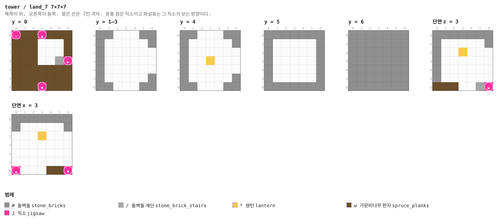

<details><summary>층별 지도 (텍스트)</summary>

```
y = 0   x →동, z ↓남
  JwwJwww
  www...w
  www...w
  www../J
  wwwwwww
  wwwwwww
  wwwJwww
y = 1–3   x →동, z ↓남
  ##...##
  #.....#
  #......
  #......
  #......
  #.....#
  ##...##
y = 4   x →동, z ↓남
  ##...##
  #.....#
  #......
  #..*...
  #......
  #.....#
  ##...##
y = 5   x →동, z ↓남
  #######
  #.....#
  #.....#
  #.....#
  #.....#
  #.....#
  #######
y = 6   x →동, z ↓남
  #######
  #######
  #######
  #######
  #######
  #######
  #######
```

</details>


### `stair_7` — 7×7×7 — 1×1×1 셀

7층 계단방. 착지방에서 문 하나로 들어와 다섯 칸을 오르고, 여섯 번째 칸이 **자기 천장의
구멍**을 지나 위층으로 나간다. 그래서 위층 착지방은 이 조각 바로 위 칸이다.
사다리가 아니라 계단인 것이 0.4.0에서 바뀐 점이고, 층마다 칸이 달라서 매 층 걸어 찾아야 한다.

**어느 풀에 있나** — `stair_7` (가중치 1)

| 직소 위치 | 향 | name | target | pool |
|---|---|---|---|---|
| (3, 0, 0) | ▲ 북 | `tow_riser` | `tow_riser` | `—` |
| (0, 6, 0) | ◆ 위 | `tow_placer` | `tow_riser` | `tower/land_8` |

**뚫린 면** — 북: x 2–4, y 1–4 (12칸) / 위: x 3–5, z 1–3 (8칸)

**블록** — 돌벽돌 147, 가문비나무 판자 48, 돌벽돌 계단 6, 직소 2, 랜턴 1


<details><summary>층별 지도 (텍스트)</summary>

```
y = 0   x →동, z ↓남
  wwwJwww
  wwwwwww
  wwwwwww
  wwwwwww
  wwwwwww
  wwwwwww
  wwwwwww
y = 1   x →동, z ↓남
  ##...##
  #/....#
  #.....#
  #.....#
  #.....#
  #.....#
  #######
y = 2   x →동, z ↓남
  ##...##
  #./...#
  #.....#
  #.....#
  #.....#
  #.....#
  #######
y = 3   x →동, z ↓남
  ##...##
  #../..#
  #.....#
  #.....#
  #.....#
  #.....#
  #######
y = 4   x →동, z ↓남
  ##...##
  #.../.#
  #.....#
  #.....#
  #.....#
  #*....#
  #######
y = 5   x →동, z ↓남
  #######
  #..../#
  #.....#
  #.....#
  #.....#
  #.....#
  #######
y = 6   x →동, z ↓남
  J######
  ###...#
  ###../#
  ###...#
  #######
  #######
  #######
```

</details>


### `land_8` — 7×7×7 — 1×1×1 셀

꼭대기 착지방. 바닥 구멍으로 7층에서 올라오고, **거울로 뒤집은 계단**이 천장으로 나가
옥상 회랑에 닿는다. 한 칸 안에 구멍이 둘이라 둘을 서로 반대편에 놓아야 했다.

**어느 풀에 있나** — `land_8` (가중치 1)

| 직소 위치 | 향 | name | target | pool |
|---|---|---|---|---|
| (0, 0, 0) | ◇ 아래 | `tow_riser` | `tow_riser` | `—` |
| (3, 0, 0) | ▲ 북 | `tow_door` | `tow_door` | `tower/passages` |

**뚫린 면** — 북: x 2–4, y 1–4 (12칸) / 아래: x 3–5, z 1–3 (8칸) / 위: x 1–3, z 3–5 (8칸)

**블록** — 돌벽돌 148, 가문비나무 판자 38, 돌벽돌 계단 7, 직소 2, 랜턴 1

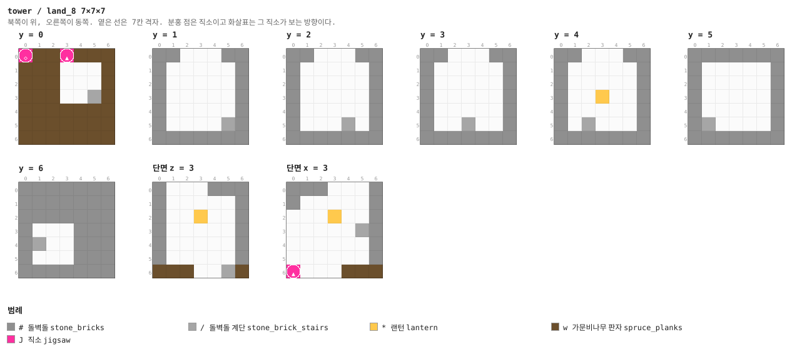

<details><summary>층별 지도 (텍스트)</summary>

```
y = 0   x →동, z ↓남
  JwwJwww
  www...w
  www...w
  www../w
  wwwwwww
  wwwwwww
  wwwwwww
y = 1   x →동, z ↓남
  ##...##
  #.....#
  #.....#
  #.....#
  #.....#
  #..../#
  #######
y = 2   x →동, z ↓남
  ##...##
  #.....#
  #.....#
  #.....#
  #.....#
  #.../.#
  #######
y = 3   x →동, z ↓남
  ##...##
  #.....#
  #.....#
  #.....#
  #.....#
  #../..#
  #######
y = 4   x →동, z ↓남
  ##...##
  #.....#
  #.....#
  #..*..#
  #.....#
  #./...#
  #######
y = 5   x →동, z ↓남
  #######
  #.....#
  #.....#
  #.....#
  #.....#
  #/....#
  #######
y = 6   x →동, z ↓남
  #######
  #######
  #######
  #...###
  #/..###
  #...###
  #######
```

</details>


### `library` — 14×14×14 — 2×2×2 셀

14×14×14, **두 층을 관통하는 도서관**. 벽 네 면이 바닥부터 천장까지 책장이고, 회랑이
한 바퀴 돌며 동쪽 벽의 계단으로 오른다. 가운데 단상의 **마법 부여대 둘레에 유효 책장이
정확히 열다섯** — 30레벨이 바로 나온다. 천장에서 구리 사슬에 매달린 랜턴이 아트리움
한가운데로 내려온다.

파밍 없이 마법 부여를 여는 것이 이 방의 존재 이유다. 21×21×21에서 14×14×14로 줄인 것은
3×3 층에서 계단이 설 자리를 남기기 위해서다 — 2×2 칸을 쓰면 바깥에 ㄱ자로 다섯 칸이 남는다.

**어느 풀에 있나** — `library` (가중치 1)

| 직소 위치 | 향 | name | target | pool |
|---|---|---|---|---|
| (10, 0, 0) | ▲ 북 | `tow_anchor` | `tow_anchor` | `—` |

**뚫린 면** — 북: x 9–11, y 1–4 (12칸)

**블록** — 돌벽돌 808, 가문비나무 판자 287, 책장 279, 윤나는 심층암 49, 가문비나무 울타리 23, 돌벽돌 계단 6, 랜턴 5, 상자 2


<details><summary>층별 지도 (텍스트)</summary>

```
y = 0   x →동, z ↓남
  wwwwwwwwwwJwww
  wwwwwwwwwwwwww
  wwwwwwwwwwwwww
  wwwwwwwwwwwwww
  wwwwwwwwwwwwww
  wwwwwwwwwwwwww
  wwwwwwwwwwwwww
  wwwwwwwwwwwwww
  wwwwwwwwwwwwww
  wwwwwwwwwwwwww
  wwwwwwwwwwwwww
  wwwwwwwwwwwwww
  wwwwwwwwwwwwww
  wwwwwwwwwwwwww
y = 1   x →동, z ↓남
  #########...##
  #BBBBBBBBBBBB#
  #B........./B#
  #B.....L....B#
  #B..ddddddd.B#
  #B..ddddddd.B#
  #B..ddddddd.B#
  #B..ddddddd.B#
  #B..ddddddd.B#
  #B..ddddddd.B#
  #B..ddddddd.B#
  #B..........B#
  #BBBBBBBBBBBB#
  ##############
y = 2   x →동, z ↓남
  #########...##
  #BBBBBBBBBBBB#
  #B..........B#
  #B........./B#
  #B..........B#
  #B...BB.BB..B#
  #B...B...B..B#
  #B..cB.E.Bc.B#
  #B...B...B..B#
  #B...BBBBB..B#
  #B..........B#
  #B..........B#
  #BBBBBBBBBBBB#
  ##############
y = 3   x →동, z ↓남
  #########...##
  #BBBBBBBBBBBB#
  #B..........B#
  #B..........B#
  #B........./B#
  #B..........B#
  #B..........B#
  #B..........B#
  #B..........B#
  #B..........B#
  #B..........B#
  #B..........B#
  #BBBBBBBBBBBB#
  ##############
y = 4   x →동, z ↓남
  #########...##
  #............#
  #............#
  #............#
  #............#
  #........../.#
  #............#
  #............#
  #............#
  #............#
  #............#
  #............#
  #............#
  ##############
y = 5   x →동, z ↓남
  ##############
  #............#
  #............#
  #............#
  #............#
  #............#
  #........../.#
  #............#
  #............#
  #............#
  #............#
  #............#
  #............#
  ##############
y = 6   x →동, z ↓남
  ##############
  #............#
  #............#
  #............#
  #............#
  #............#
  #............#
  #........../.#
  #............#
  #............#
  #............#
  #............#
  #............#
  ##############
y = 7   x →동, z ↓남
  ##############
  #wwwwwwwwwwww#
  #wwwwwwwww..w#
  #wwwwwwwww..w#
  #www........w#
  #www........w#
  #www........w#
  #www........w#
  #www........w#
  #www........w#
  #wwwwwwwwwwww#
  #wwwwwwwwwwww#
  #wwwwwwwwwwww#
  ##############
y = 8   x →동, z ↓남
  ##############
  #BBBBBBBBBBBB#
  #B..........B#
  #B.ffffffff.B#
  #B.f......f.B#
  #B.f........B#
  #B.f........B#
  #B.f........B#
  #B.f........B#
  #B.f........B#
  #B.ffffffff.B#
  #B..........B#
  #BBBBBBBBBBBB#
  ##############
y = 9   x →동, z ↓남
  ##############
  #BBBBBBBBBBBB#
  #B..........B#
  #B..........B#
  #B..........B#
  #B..........B#
  #B..........B#
  #B..........B#
  #B..........B#
  #B..........B#
  #B..........B#
  #B..........B#
  #BBBBBBBBBBBB#
  ##############
y = 10   x →동, z ↓남
  ##############
  #BBBBBBBBBBBB#
  #B..........B#
  #B..........B#
  #B..........B#
  #B..........B#
  #B..........B#
  #B.....*....B#
  #B..........B#
  #B..........B#
  #B..........B#
  #B..........B#
  #BBBBBBBBBBBB#
  ##############
y = 11   x →동, z ↓남
  ##############
  #............#
  #............#
  #............#
  #............#
  #............#
  #............#
  #......j.....#
  #............#
  #............#
  #............#
  #............#
  #............#
  ##############
y = 12   x →동, z ↓남
  ##############
  #............#
  #............#
  #..*......*..#
  #............#
  #............#
  #............#
  #............#
  #............#
  #............#
  #..*......*..#
  #............#
  #............#
  ##############
y = 13   x →동, z ↓남
  ##############
  ##############
  ##############
  ##############
  ##############
  ##############
  ##############
  ##############
  ##############
  ##############
  ##############
  ##############
  ##############
  ##############
```

</details>

<details><summary>세로 단면 (텍스트)</summary>

```
단면 z = 7   x →동, y ↑하늘
  ##############
  #............#
  #......j.....#
  #B.....*....B#
  #B..........B#
  #B.f........B#
  #www........w#
  #........../.#
  #............#
  #............#
  #B..........B#
  #B..cB.E.Bc.B#
  #B..ddddddd.B#
  wwwwwwwwwwwwww
단면 x = 7   z →남, y ↑하늘
  ##############
  #............#
  #......j.....#
  #B.....*....B#
  #B..........B#
  #B.f......f.B#
  #www......www#
  #............#
  #............#
  #............#
  #B..........B#
  #B.....E.B..B#
  #B.Lddddddd.B#
  wwwwwwwwwwwwww
```

</details>


### `sanctum` — 14×14×14 — 2×2×2 셀

14×14×14 보스방. 심층암으로 지어 미로와 확실히 구별된다. 바닥에 마법진을 새겼고 네 귀퉁이에
기둥이 서 있다. 단상의 대마법사(이보커, 체력 100) 트라이얼 스포너 하나와 사분면 경비 넷,
**불 붙이지 않은 흑요석 포탈 틀**과 화염과 강철이 든 상자.

보상 확정: **엔더의 눈 4 + 불사의 토템 + 마법 부여(25~30) 다이아 장비 1.**

**어느 풀에 있나** — `sanctum` (가중치 1)

| 직소 위치 | 향 | name | target | pool |
|---|---|---|---|---|
| (0, 0, 3) | ◀ 서 | `tow_anchor` | `tow_anchor` | `—` |

**뚫린 면** — 서: z 2–4, y 1–4 (12칸)

**블록** — 심층암 벽돌 756, 윤나는 심층암 372, 조각한 돌벽돌 72, 흑요석 10, 트라이얼 스포너 5, 산화 구리 사슬 4, 영혼 랜턴 4, 직소 1


<details><summary>층별 지도 (텍스트)</summary>

```
y = 0   x →동, z ↓남
  dddddddddddddd
  dddddddddddddd
  dddddddddddddd
  Jdddd%%%%%dddd
  dddd%%%%%%%ddd
  ddd%%%%%%%%%dd
  ddd%%%%%%%%%dd
  ddd%%%%%%%%%dd
  ddd%%%%%%%%%dd
  ddd%%%%%%%%%dd
  dddd%%%%%%%ddd
  ddddd%%%%%dddd
  dddddddddddddd
  dddddddddddddd
y = 1   x →동, z ↓남
  DDDDDDDDDDDDDD
  D............D
  ..%d......%d.D
  ..dT......Td.D
  .............D
  D............D
  D.....ddd....D
  D.....ddd....D
  D.....ddd....D
  D............D
  D.%T......Td.D
  D.ddc.OO..dd.D
  D............D
  DDDDDDDDDDDDDD
y = 2   x →동, z ↓남
  DDDDDDDDDDDDDD
  D............D
  ..dd......dd.D
  ..dd......dd.D
  .............D
  D............D
  D............D
  D......T.....D
  D............D
  D............D
  D.dd......dd.D
  D.dd.O..O.dd.D
  D............D
  DDDDDDDDDDDDDD
y = 3–4   x →동, z ↓남
  DDDDDDDDDDDDDD
  D............D
  ..dd......dd.D
  ..dd......dd.D
  .............D
  D............D
  D............D
  D............D
  D............D
  D............D
  D.dd......dd.D
  D.dd.O..O.dd.D
  D............D
  DDDDDDDDDDDDDD
y = 5   x →동, z ↓남
  DDDDDDDDDDDDDD
  D............D
  D.dd......dd.D
  D.dd......dd.D
  D............D
  D............D
  D............D
  D............D
  D............D
  D............D
  D.dd......dd.D
  D.dd..OO..dd.D
  D............D
  DDDDDDDDDDDDDD
y = 6   x →동, z ↓남
  DDDDDDDDDDDDDD
  D............D
  D.dd......dd.D
  D.dd......dd.D
  D............D
  D............D
  D............D
  D............D
  D............D
  D............D
  D.dd......dd.D
  D.dd......dd.D
  D............D
  DDDDDDDDDDDDDD
y = 7   x →동, z ↓남
  dddddddddddddd
  d............d
  d.dd......dd.d
  d.dd......dd.d
  d............d
  d............d
  d............d
  d............d
  d............d
  d............d
  d.dd......dd.d
  d.dd......dd.d
  d............d
  dddddddddddddd
y = 8–9   x →동, z ↓남
  DDDDDDDDDDDDDD
  D............D
  D.dd......dd.D
  D.dd......dd.D
  D............D
  D............D
  D............D
  D............D
  D............D
  D............D
  D.dd......dd.D
  D.dd......dd.D
  D............D
  DDDDDDDDDDDDDD
y = 10   x →동, z ↓남
  DDDDDDDDDDDDDD
  D............D
  D.dd...j..dd.D
  D.dd......dd.D
  D............D
  D............D
  D............D
  D.j........j.D
  D............D
  D............D
  D.dd......dd.D
  D.dd...j..dd.D
  D............D
  DDDDDDDDDDDDDD
y = 11   x →동, z ↓남
  DDDDDDDDDDDDDD
  D............D
  D.dd...s..dd.D
  D.dd......dd.D
  D............D
  D............D
  D............D
  D.s........s.D
  D............D
  D............D
  D.dd......dd.D
  D.dd...s..dd.D
  D............D
  DDDDDDDDDDDDDD
y = 12   x →동, z ↓남
  DDDDDDDDDDDDDD
  D............D
  D.dd......dd.D
  D.dd......dd.D
  D............D
  D............D
  D............D
  D............D
  D............D
  D............D
  D.dd......dd.D
  D.dd......dd.D
  D............D
  DDDDDDDDDDDDDD
y = 13   x →동, z ↓남
  DDDDDDDDDDDDDD
  DDDDDDDDDDDDDD
  DDDDDDDDDDDDDD
  DDDDDDDDDDDDDD
  DDDDDDDDDDDDDD
  DDDDDDDDDDDDDD
  DDDDDDDDDDDDDD
  DDDDDDDDDDDDDD
  DDDDDDDDDDDDDD
  DDDDDDDDDDDDDD
  DDDDDDDDDDDDDD
  DDDDDDDDDDDDDD
  DDDDDDDDDDDDDD
  DDDDDDDDDDDDDD
```

</details>

<details><summary>세로 단면 (텍스트)</summary>

```
단면 z = 7   x →동, y ↑하늘
  DDDDDDDDDDDDDD
  D............D
  D.s........s.D
  D.j........j.D
  D............D
  D............D
  d............d
  D............D
  D............D
  D............D
  D............D
  D......T.....D
  D.....ddd....D
  ddd%%%%%%%%%dd
단면 x = 7   z →남, y ↑하늘
  DDDDDDDDDDDDDD
  D............D
  D.s........s.D
  D.j........j.D
  D............D
  D............D
  d............d
  D............D
  D..........O.D
  D............D
  D............D
  D......T.....D
  D.....ddd..O.D
  ddd%%%%%%%%%dd
```

</details>


### `passage` — 7×7×7 — 1×1×1 셀

미로의 기본 단위. 서-동 직선, 가중치 10. 양옆에 원목 기둥.

**어느 풀에 있나** — `passages` (가중치 10)

| 직소 위치 | 향 | name | target | pool |
|---|---|---|---|---|
| (0, 0, 3) | ◀ 서 | `tow_door` | `tow_door` | `tower/passages` |
| (6, 0, 3) | ▶ 동 | `tow_door` | `tow_door` | `tower/passages` |

**뚫린 면** — 서: z 2–4, y 1–4 (12칸) / 동: z 2–4, y 1–4 (12칸)

**블록** — 돌벽돌 145, 가문비나무 판자 47, 가문비나무 원목 4, 직소 2

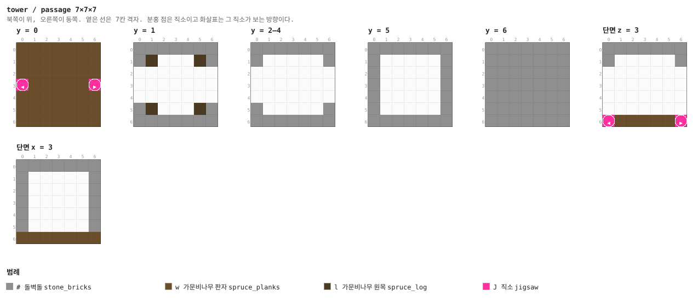

<details><summary>층별 지도 (텍스트)</summary>

```
y = 0   x →동, z ↓남
  wwwwwww
  wwwwwww
  wwwwwww
  JwwwwwJ
  wwwwwww
  wwwwwww
  wwwwwww
y = 1   x →동, z ↓남
  #######
  #l...l#
  .......
  .......
  .......
  #l...l#
  #######
y = 2–4   x →동, z ↓남
  #######
  #.....#
  .......
  .......
  .......
  #.....#
  #######
y = 5   x →동, z ↓남
  #######
  #.....#
  #.....#
  #.....#
  #.....#
  #.....#
  #######
y = 6   x →동, z ↓남
  #######
  #######
  #######
  #######
  #######
  #######
  #######
```

</details>


### `corner` — 7×7×7 — 1×1×1 셀

서-남 모퉁이. 가중치 9.

**어느 풀에 있나** — `passages` (가중치 9)

| 직소 위치 | 향 | name | target | pool |
|---|---|---|---|---|
| (0, 0, 3) | ◀ 서 | `tow_door` | `tow_door` | `tower/passages` |
| (3, 0, 6) | ▼ 남 | `tow_door` | `tow_door` | `tower/passages` |

**뚫린 면** — 서: z 2–4, y 1–4 (12칸) / 남: x 2–4, y 1–4 (12칸)

**블록** — 돌벽돌 145, 가문비나무 판자 47, 직소 2

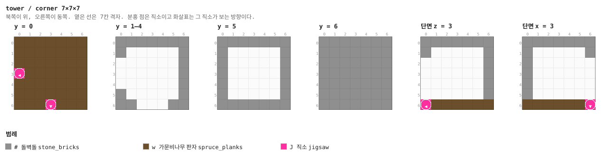

<details><summary>층별 지도 (텍스트)</summary>

```
y = 0   x →동, z ↓남
  wwwwwww
  wwwwwww
  wwwwwww
  Jwwwwww
  wwwwwww
  wwwwwww
  wwwJwww
y = 1–4   x →동, z ↓남
  #######
  #.....#
  ......#
  ......#
  ......#
  #.....#
  ##...##
y = 5   x →동, z ↓남
  #######
  #.....#
  #.....#
  #.....#
  #.....#
  #.....#
  #######
y = 6   x →동, z ↓남
  #######
  #######
  #######
  #######
  #######
  #######
  #######
```

</details>


### `cross` — 7×7×7 — 1×1×1 셀

십자 교차로.

**어느 풀에 있나** — `passages` (가중치 8)

| 직소 위치 | 향 | name | target | pool |
|---|---|---|---|---|
| (3, 0, 0) | ▲ 북 | `tow_door` | `tow_door` | `tower/passages` |
| (0, 0, 3) | ◀ 서 | `tow_door` | `tow_door` | `tower/passages` |
| (6, 0, 3) | ▶ 동 | `tow_door` | `tow_door` | `tower/passages` |
| (3, 0, 6) | ▼ 남 | `tow_door` | `tow_door` | `tower/passages` |

**뚫린 면** — 서: z 2–4, y 1–4 (12칸) / 동: z 2–4, y 1–4 (12칸) / 북: x 2–4, y 1–4 (12칸) / 남: x 2–4, y 1–4 (12칸)

**블록** — 돌벽돌 121, 가문비나무 판자 45, 직소 4


<details><summary>층별 지도 (텍스트)</summary>

```
y = 0   x →동, z ↓남
  wwwJwww
  wwwwwww
  wwwwwww
  JwwwwwJ
  wwwwwww
  wwwwwww
  wwwJwww
y = 1–4   x →동, z ↓남
  ##...##
  #.....#
  .......
  .......
  .......
  #.....#
  ##...##
y = 5   x →동, z ↓남
  #######
  #.....#
  #.....#
  #.....#
  #.....#
  #.....#
  #######
y = 6   x →동, z ↓남
  #######
  #######
  #######
  #######
  #######
  #######
  #######
```

</details>


### `study` — 7×7×7 — 1×1×1 셀

막다른 서재. 독서대·책장 스물·상자. 도서관의 축소판처럼 보이지만 마법 부여대가 없다 —
**진짜 도서관은 3층 문 뒤**다.

**어느 풀에 있나** — `passages` (가중치 8)

| 직소 위치 | 향 | name | target | pool |
|---|---|---|---|---|
| (0, 0, 3) | ◀ 서 | `tow_door` | `tow_door` | `tower/passages` |

**뚫린 면** — 서: z 2–4, y 1–4 (12칸)

**블록** — 돌벽돌 157, 가문비나무 판자 48, 책장 20, 직소 1, 독서대 1, 랜턴 1, 상자 1

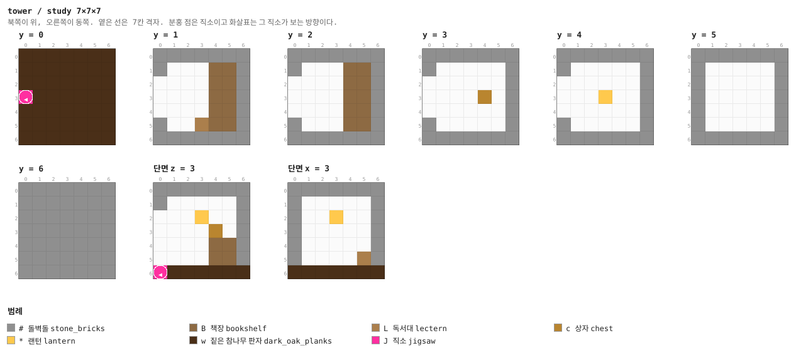

<details><summary>층별 지도 (텍스트)</summary>

```
y = 0   x →동, z ↓남
  wwwwwww
  wwwwwww
  wwwwwww
  Jwwwwww
  wwwwwww
  wwwwwww
  wwwwwww
y = 1   x →동, z ↓남
  #######
  #...BB#
  ....BB#
  ....BB#
  ....BB#
  #..LBB#
  #######
y = 2   x →동, z ↓남
  #######
  #...BB#
  ....BB#
  ....BB#
  ....BB#
  #...BB#
  #######
y = 3   x →동, z ↓남
  #######
  #.....#
  ......#
  ....c.#
  ......#
  #.....#
  #######
y = 4   x →동, z ↓남
  #######
  #.....#
  ......#
  ...*..#
  ......#
  #.....#
  #######
y = 5   x →동, z ↓남
  #######
  #.....#
  #.....#
  #.....#
  #.....#
  #.....#
  #######
y = 6   x →동, z ↓남
  #######
  #######
  #######
  #######
  #######
  #######
  #######
```

</details>


### `lab` — 7×7×7 — 1×1×1 셀

실험실. 가마솥 둘과 좀비 주민 스포너. 통로형이라 지나가다 걸린다.

**어느 풀에 있나** — `passages` (가중치 6)

| 직소 위치 | 향 | name | target | pool |
|---|---|---|---|---|
| (0, 0, 3) | ◀ 서 | `tow_door` | `tow_door` | `tower/passages` |
| (6, 0, 3) | ▶ 동 | `tow_door` | `tow_door` | `tower/passages` |

**뚫린 면** — 서: z 2–4, y 1–4 (12칸) / 동: z 2–4, y 1–4 (12칸)

**블록** — 돌벽돌 145, 가문비나무 판자 47, 직소 2, 가마솥 2, 몬스터 스포너 1, 영혼 랜턴 1

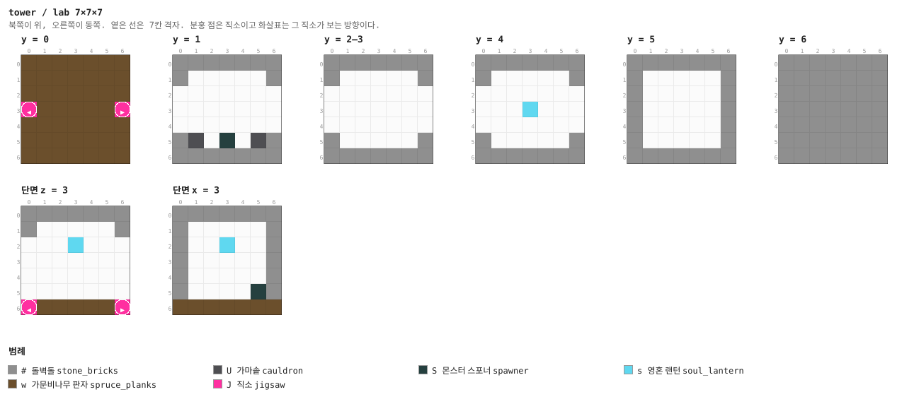

<details><summary>층별 지도 (텍스트)</summary>

```
y = 0   x →동, z ↓남
  wwwwwww
  wwwwwww
  wwwwwww
  JwwwwwJ
  wwwwwww
  wwwwwww
  wwwwwww
y = 1   x →동, z ↓남
  #######
  #.....#
  .......
  .......
  .......
  #U.S.U#
  #######
y = 2–3   x →동, z ↓남
  #######
  #.....#
  .......
  .......
  .......
  #.....#
  #######
y = 4   x →동, z ↓남
  #######
  #.....#
  .......
  ...s...
  .......
  #.....#
  #######
y = 5   x →동, z ↓남
  #######
  #.....#
  #.....#
  #.....#
  #.....#
  #.....#
  #######
y = 6   x →동, z ↓남
  #######
  #######
  #######
  #######
  #######
  #######
  #######
```

</details>


### `vex_cage` — 7×7×7 — 1×1×1 셀

벡스 우리. **바닥에 선 철창 상자**다 — 성에서는 허공에 뜬 철창 한 장이어서 스크린샷에서
바로 지적받았다.

**어느 풀에 있나** — `passages` (가중치 6)

| 직소 위치 | 향 | name | target | pool |
|---|---|---|---|---|
| (0, 0, 3) | ◀ 서 | `tow_door` | `tow_door` | `tower/passages` |
| (6, 0, 3) | ▶ 동 | `tow_door` | `tow_door` | `tower/passages` |

**뚫린 면** — 서: z 2–4, y 1–4 (12칸) / 동: z 2–4, y 1–4 (12칸)

**블록** — 돌벽돌 133, 가문비나무 판자 47, 철창 33, 직소 2, 몬스터 스포너 1

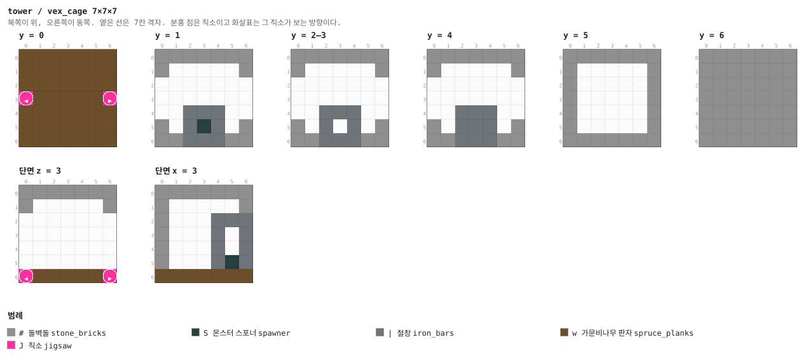

<details><summary>층별 지도 (텍스트)</summary>

```
y = 0   x →동, z ↓남
  wwwwwww
  wwwwwww
  wwwwwww
  JwwwwwJ
  wwwwwww
  wwwwwww
  wwwwwww
y = 1   x →동, z ↓남
  #######
  #.....#
  .......
  .......
  ..|||..
  #.|S|.#
  ##|||##
y = 2–3   x →동, z ↓남
  #######
  #.....#
  .......
  .......
  ..|||..
  #.|.|.#
  ##|||##
y = 4   x →동, z ↓남
  #######
  #.....#
  .......
  .......
  ..|||..
  #.|||.#
  ##|||##
y = 5   x →동, z ↓남
  #######
  #.....#
  #.....#
  #.....#
  #.....#
  #.....#
  #######
y = 6   x →동, z ↓남
  #######
  #######
  #######
  #######
  #######
  #######
  #######
```

</details>


### `stair_maze` — 7×14×7 — 1×2×1 셀

**미로에 섞인 계단.** 지하감옥의 `stair`와 같은 생각이다 — 정해진 등반 경로 말고도 층을
건너는 길이 매번 다르게 나야 탑이 미로처럼 느껴진다. 7×14×7이라 칸 두 개 높이를 쓰고,
몸통 꼭대기에서는 상자 밖으로 나가 거부되며 마개가 대신 들어간다.

**어느 풀에 있나** — `passages` (가중치 5)

| 직소 위치 | 향 | name | target | pool |
|---|---|---|---|---|
| (0, 0, 3) | ◀ 서 | `tow_door` | `tow_door` | `tower/passages` |
| (0, 7, 3) | ◀ 서 | `tow_door` | `tow_door` | `tower/passages` |

**뚫린 면** — 서: z 2–4, y 1–11 (24칸)

**블록** — 돌벽돌 289, 가문비나무 판자 87, 돌벽돌 계단 7, 직소 2, 랜턴 1

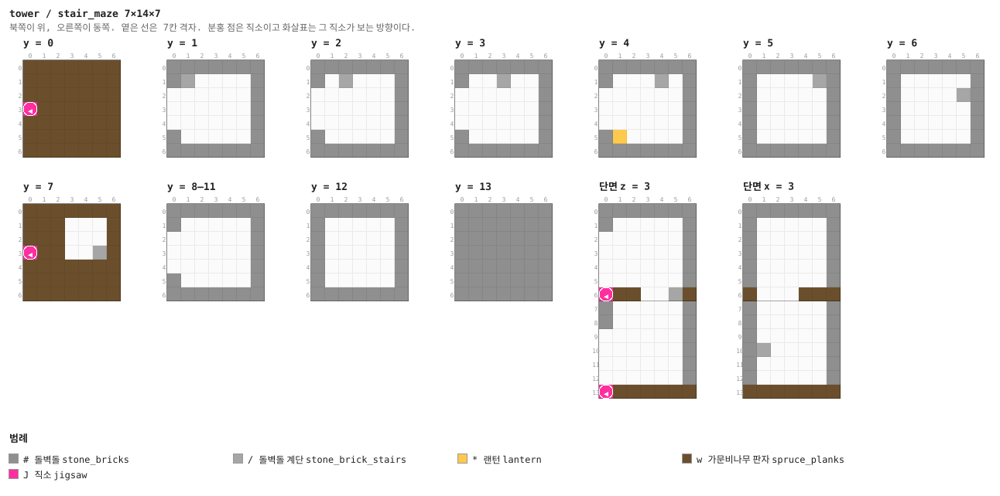

<details><summary>층별 지도 (텍스트)</summary>

```
y = 0   x →동, z ↓남
  wwwwwww
  wwwwwww
  wwwwwww
  Jwwwwww
  wwwwwww
  wwwwwww
  wwwwwww
y = 1   x →동, z ↓남
  #######
  #/....#
  ......#
  ......#
  ......#
  #.....#
  #######
y = 2   x →동, z ↓남
  #######
  #./...#
  ......#
  ......#
  ......#
  #.....#
  #######
y = 3   x →동, z ↓남
  #######
  #../..#
  ......#
  ......#
  ......#
  #.....#
  #######
y = 4   x →동, z ↓남
  #######
  #.../.#
  ......#
  ......#
  ......#
  #*....#
  #######
y = 5   x →동, z ↓남
  #######
  #..../#
  #.....#
  #.....#
  #.....#
  #.....#
  #######
y = 6   x →동, z ↓남
  #######
  #.....#
  #..../#
  #.....#
  #.....#
  #.....#
  #######
y = 7   x →동, z ↓남
  wwwwwww
  www...w
  www...w
  Jww../w
  wwwwwww
  wwwwwww
  wwwwwww
y = 8–11   x →동, z ↓남
  #######
  #.....#
  ......#
  ......#
  ......#
  #.....#
  #######
y = 12   x →동, z ↓남
  #######
  #.....#
  #.....#
  #.....#
  #.....#
  #.....#
  #######
y = 13   x →동, z ↓남
  #######
  #######
  #######
  #######
  #######
  #######
  #######
```

</details>

<details><summary>세로 단면 (텍스트)</summary>

```
단면 z = 3   x →동, y ↑하늘
  #######
  #.....#
  ......#
  ......#
  ......#
  ......#
  Jww../w
  #.....#
  #.....#
  ......#
  ......#
  ......#
  ......#
  Jwwwwww
단면 x = 3   z →남, y ↑하늘
  #######
  #.....#
  #.....#
  #.....#
  #.....#
  #.....#
  w...www
  #.....#
  #.....#
  #.....#
  #/....#
  #.....#
  #.....#
  wwwwwww
```

</details>


### `cap` — 1×7×7

두께 1의 돌벽돌 벽. 모든 풀의 fallback.

**어느 풀에 있나** — `caps` (가중치 1)

| 직소 위치 | 향 | name | target | pool |
|---|---|---|---|---|
| (0, 0, 3) | ◀ 서 | `tow_door` | `tow_door` | `tower/caps` |

**블록** — 돌벽돌 48, 직소 1

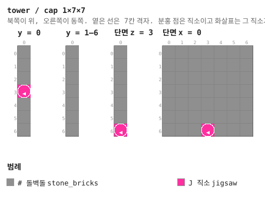

<details><summary>층별 지도 (텍스트)</summary>

```
y = 0   x →동, z ↓남
  #
  #
  #
  J
  #
  #
  #
y = 1–6   x →동, z ↓남
  #
  #
  #
  #
  #
  #
  #
```

</details>


### `shaft_floor` — 25×7×25

**어느 풀에 있나** — 없음 (풀에 안 들어 있다)

**블록** — 돌벽돌 3875, 조각한 돌벽돌 112, 이끼 낀 조약돌 112, 이끼 낀 돌벽돌 112, 깎은 산화 구리 92, 유리판 72

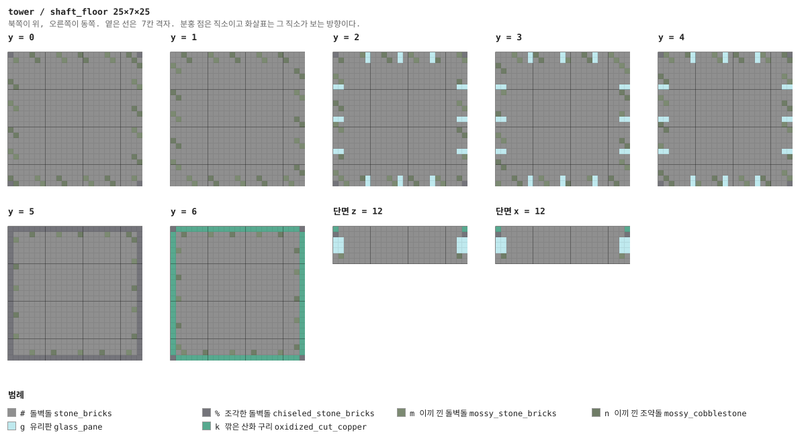

<details><summary>세로 단면 (텍스트)</summary>

```
단면 z = 12   x →동, y ↑하늘
  k#######################k
  %#######################%
  gg#####################gg
  gg#####################gg
  gg#####################gg
  #m#####################n#
  #########################
단면 x = 12   z →남, y ↑하늘
  k#######################k
  %#######################%
  gg#####################gg
  gg#####################gg
  gg#####################gg
  #n#####################m#
  #########################
```

</details>


## 다듬을 곳

0.3.0의 탑은 39×39가 56칸까지 그대로 올라가는 직육면체였고, 사다리 하나로 곧장 올라갔다.
0.4.0에서 실루엣과 등반을 다시 지었다. 그래도 남은 것들이 있다.

- **정해진 등반 경로는 모든 탑이 똑같다.** 층마다 칸이 바뀌기는 해도 그 순서가 고정이다.
  무작위로 만들려면 고정 좌표에 매달린 도서관·성소를 포기해야 하는데, 그건 성에서 한 번
  실패한 길이다. 대신 `stair_maze`가 매번 다른 지름길을 낸다.
- **몸통 바깥에 덩굴이 없다.** 레퍼런스의 담쟁이 느낌을 내려면 벽을 한 칸 파고 그 안에
  덩굴을 넣어야 한다 — 조각의 바깥 면에는 블록을 붙일 자리가 없다.
- **창문이 층마다 같은 자리다.** 세 칸씩 네 면, 전부 같은 높이다.
- **옥상 회랑이 비어 있다.** 난간과 기둥, 랜턴 넷, 상자 하나가 전부다. 망원경이나 천체도,
  화단 같은 것이 들어갈 자리가 넓게 남아 있다.
- **지붕 안은 비어 있다.** 껍데기만 있고 다락이 없다. 21칸 높이가 통째로 놀고 있다.
