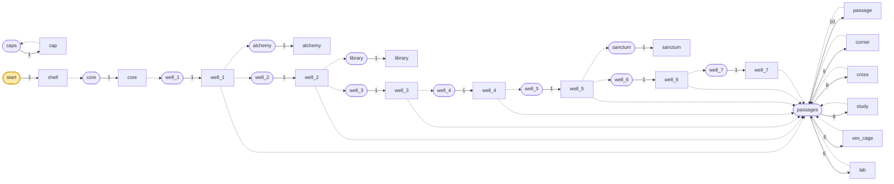
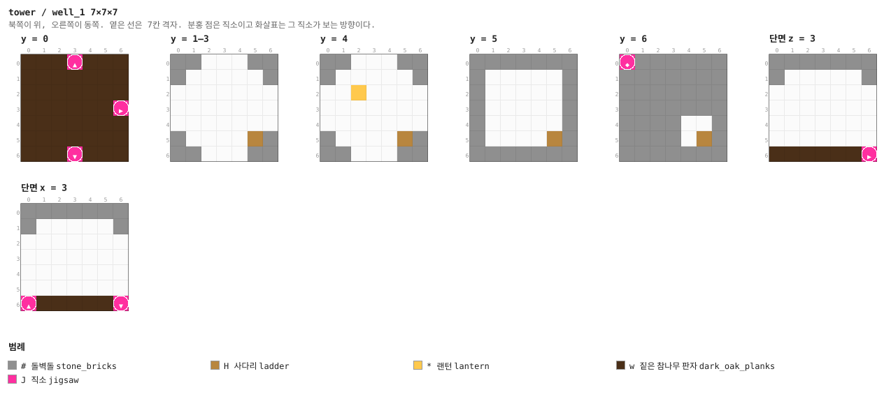
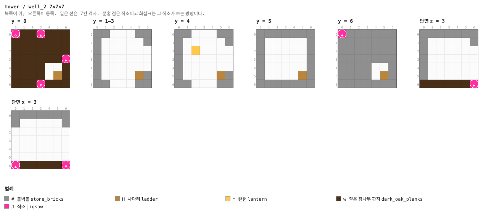
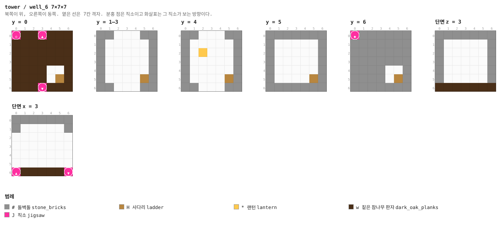
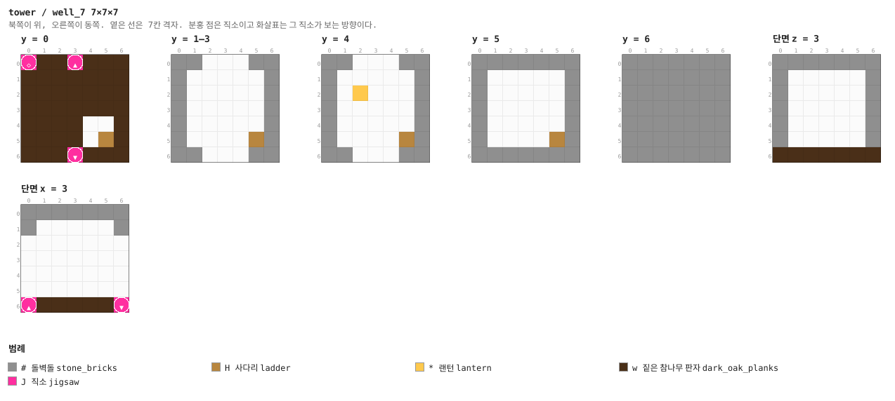

# 레벨 설계 — 마법사의 탑

> 이 문서는 `python tools/gen_level_doc.py tower`가 만든다. 조각을 고치면 다시 돌린다. 그림과 표는 게임이 읽는 파일(`structure/tower/*.nbt`, `worldgen/**`)에서 그대로 읽어 온 것이라 모드와 어긋날 수 없다. 설명 문장만 사람이 쓴다 (`tools/gen_level_doc.py`의 `INTRO`·`NOTES`).

## 1. 한눈에

타이가에 밑변 39칸, 높이 56칸의 돌벽돌·심층암 탑이 서 있다. 서쪽 문으로 들어가면 바로
**계단실**이고, 사다리가 1층 바닥부터 7층까지 끊기지 않고 올라간다. 한 층은 7×7 방
**5×5 = 스물다섯 칸**이고, 계단실에서 남북으로 미로가 퍼진다.

다만 **스물다섯 칸이 다 미로인 층은 1층뿐이다.** 2~4층은 가운데 3×3 칸을 도서관이,
5~7층은 성소가 통째로 차지한다 — 21×21×21짜리 방이 세 층을 관통하기 때문이다. 그 층의
미로는 방을 둘러싼 **열여섯 칸의 회랑**이 된다. 4번 그림에서 노란색(도서관)과
분홍색(성소)이 가운데를 먹고 있는 것이 그것이다.

계단실의 **동쪽 문**이 이 탑의 뼈대다. 1층 동문은 연금실, 2층 동문은 **도서관**,
5층 동문은 **성소**로 열린다. 셋 다 원소가 하나뿐인 풀이라 반드시, 정확히 한 번 놓이고,
**언제나 계단실에서 바로 들어간다.**

**한 판:** 서쪽 문 → 1층 연금실 → 사다리 → 2층 도서관(마법 부여대 30레벨) → 층마다 미로 →
5층 성소에서 대마법사 → 엔더의 눈 넷 + 불사의 토템 + 불 붙이지 않은 흑요석 포탈 틀.

| 항목 | 값 |
|---|---|
| 생성 단계 | `surface_structures` |
| 바이옴 | `#sydungeon:has_structure/tower` |
| 간격 / 최소거리 | spacing 40 / separation 14 |
| 직소 깊이 | 16 ~ 22 (`sydungeon:ranged_jigsaw`) |
| 시작 풀 | `start` |
| 조각 / 풀 | 19개 / 14개 |

## 2. 조립 원리

### 피라미드와 같은 울타리, 다른 모양

탑도 겉모양을 지켜야 한다. 그래서 피라미드와 **같은 기법**을 쓴다 — 부모의 바운딩 박스로
자식을 가두는 것(§10). 다른 점은 상자를 **쌓지 않는다**는 것이다.

```
피라미드   skin_base → core (63×7×63)      층마다 껍데기가 따로, core는 1층 한 층만
탑         shell     → core (35×49×35)     탑 전체가 상자 하나
```

**`core`가 층마다가 아니라 탑 전체에 하나짜리 상자인 이유**는 21칸 높이의 방 때문이다.
도서관과 성소는 세 층을 관통한다. core를 층마다 잘라 놓았으면 그 방들이 상자 경계를 넘어서
못 놓였을 것이다. 하나로 두니까 **21칸 방이 가운데 서고 미로가 그 둘레로 흐른다.**

### 계단실 사슬이 전부를 잇는다

```
core → well_1 → well_2 → … → well_7          (위로 쌓는 사슬)
         │         │                 │
         │         └─동→ 도서관       └─(well_5)─동→ 성소
         └─동→ 연금실
```

`well_N`은 서쪽 가운데 칸에 층마다 하나씩, **아래 층이 위 층을 놓는다.** 전부 원소 하나짜리
풀이라 일곱 층이 반드시 다 생기고 사다리가 통한다. **중요한 것은 미로에 맡기지 않는다** —
마법사의 성에서 도서관을 "미로 어딘가"에 뒀다가 플레이어가 못 찾았다.

### §13 — 결정적으로 놓이는 조각은 부모가 찾는 이름의 직소를 **하나만** 가진다

**이게 마법사의 성을 버린 이유다.** 바닐라는 자식의 **아무 직소나** 이름이 맞으면 입구로 쓰고
회전 넷을 다 시도한다. 성에서는 한 조각에 같은 이름(`WAY`) 직소를 여럿 달았고, 그래서 절반은
뒤집혀 붙었다. 결과가 **보스방과 관측소에 들어가는 길이 아예 없는 것**이었다 — 플레이어가
벽을 파야 했다. 연금실이 복도 한가운데 나온 것도 같은 원인이다.

탑에서는 이름을 역할로 나눈다.

| 이름 | 쓰임 | 조각당 개수 |
|---|---|---|
| `tow_door` | 미로 커넥터 | 여럿 |
| `tow_riser` | 계단실 조각의 **입구** | **정확히 하나** |
| `tow_anchor` | 이름 있는 방의 **입구** | **정확히 하나** |
| `tow_placer` | 고정 조각을 **놓는 쪽** 직소. 문이 아니라서 면 검사 대상이 아니다 | 여럿 |

`generate_tower.py`의 `verify()`가 조각마다 `tow_riser`·`tow_anchor` 개수를 세고 둘 이상이면
빌드를 실패시킨다. **수직 연결은 원래 안전하다** — 회전은 Y축이므로 위를 보는 직소가 아래를
볼 수 없다. 지하감옥과 피라미드의 보스 가지는 처음부터 이름이 하나씩이라 같은 버그가 없었다.

## 3. 풀 배선

풀이 어떤 조각을 내놓는지(실선, 숫자는 가중치)와 그 조각의 직소가 다시 어떤 풀을 부르는지(점선)다. 직소 생성은 이 그래프를 깊이만큼 따라간다.



| 풀 | fallback | 원소 (가중치) |
|---|---|---|
| `alchemy` | `minecraft:empty` | `alchemy` 1 |
| `caps` | `minecraft:empty` | `cap` 1 |
| `core` | `minecraft:empty` | `core` 1 |
| `library` | `minecraft:empty` | `library` 1 |
| `passages` | `caps` | `passage` 10, `corner` 9, `cross` 8, `study` 8, `vex_cage` 6, `lab` 6 |
| `sanctum` | `minecraft:empty` | `sanctum` 1 |
| `start` | `minecraft:empty` | `shell` 1 |
| `well_1` | `minecraft:empty` | `well_1` 1 |
| `well_2` | `minecraft:empty` | `well_2` 1 |
| `well_3` | `minecraft:empty` | `well_3` 1 |
| `well_4` | `minecraft:empty` | `well_4` 1 |
| `well_5` | `minecraft:empty` | `well_5` 1 |
| `well_6` | `minecraft:empty` | `well_6` 1 |
| `well_7` | `minecraft:empty` | `well_7` 1 |

## 4. 뼈대 — 반드시 이렇게 놓이는 부분

껍데기 안에 core 하나, 그 안에 계단실 일곱과 방 셋. **탑의 이 부분은 매번 똑같다.**
층마다 계단실에서 남북으로 나가는 미로만 무작위다. 단면에서 왼쪽(서쪽) 아래 구멍이 정문이고,
그 안쪽이 바로 `well_1`이다.

| 조각 | 놓이는 자리 (시작 조각 기준) | 누가 놓나 |
|---|---|---|
| `shell` | (0, 0, 0) | 시작 풀 |
| `core` | (2, 0, 2) | shell의 동 tow_placer 직소 |
| `well_1` | (2, 0, 16) | core의 남 tow_placer 직소 |
| `well_2` | (2, 7, 16) | well_1의 위 tow_placer 직소 |
| `alchemy` | (9, 0, 16) | well_1의 동 tow_placer 직소 |
| `well_3` | (2, 14, 16) | well_2의 위 tow_placer 직소 |
| `library` | (9, 7, 9) | well_2의 동 tow_placer 직소 |
| `well_4` | (2, 21, 16) | well_3의 위 tow_placer 직소 |
| `well_5` | (2, 28, 16) | well_4의 위 tow_placer 직소 |
| `well_6` | (2, 35, 16) | well_5의 위 tow_placer 직소 |
| `sanctum` | (9, 28, 9) | well_5의 동 tow_placer 직소 |
| `well_7` | (2, 42, 16) | well_6의 위 tow_placer 직소 |


## 5. 조각


그림은 조각 하나를 **층마다 한 장씩** 블록 단위로 그린 것이다. 같은 층이 이어지면 `y = 2–5`처럼 묶었고, 마지막 두 장은 가운데를 자른 세로 단면이다. 분홍 점이 직소, 화살표가 그 직소가 보는 방향이다 — **마주 본 직소끼리만 붙는다.**

### `shell` — 39×56×39

탑의 외벽 전체. 두께 2(x 0–1)이고 속은 통짜 돌벽돌이다 — `core`가 그 자리를 다시 쓰고,
계단실과 방이 파낸다. 7칸마다 심층암 띠가 한 줄씩 들어가 층을 밖에서도 셀 수 있다.

직소가 **하나뿐**이다 — 서쪽 아래의 `tow_placer`가 `core`를 자기 박스 안에 매단다.
여기서부터 탑의 모든 것이 core의 자손이 되고, 그래서 아무것도 외벽을 뚫지 못한다.

**창문은 벽 두 켜를 관통해 뚫고 양쪽에 유리판을 넣는다.** 성에서는 한 켜에만 넣어서 벽에
박힌 유리처럼 보였다.

**어느 풀에 있나** — `start` (가중치 1)

| 직소 위치 | 향 | name | target | pool |
|---|---|---|---|---|
| (1, 0, 19) | ▶ 동 | `tow_placer` | `tow_anchor` | `tower/core` |

**뚫린 면** — 서: z 0–38, y 1–55 (168칸) / 동: z 0–38, y 52–55 (156칸) / 북: x 0–38, y 52–55 (156칸) / 남: x 0–38, y 52–55 (156칸) / 위: x 0–38, z 0–38 (1521칸)

**블록** — 돌벽돌 64067, 심층암 벽돌 5472, 윤나는 심층암 5327, 유리판 448, 조각한 돌벽돌 78, 직소 1


<details><summary>세로 단면 (텍스트)</summary>

```
단면 z = 19   x →동, y ↑하늘
  .......................................
  .......................................
  .......................................
  .......................................
  ##...................................##
  ##...................................##
  D#...................................#D
  DdDdDdDdDdDdDdDdDdDdDdDdDdDdDdDdDdDdDdD
  #######################################
  #######################################
  #######################################
  #######################################
  #######################################
  #######################################
  DdDdDdDdDdDdDdDdDdDdDdDdDdDdDdDdDdDdDdD
  #######################################
  #######################################
  #######################################
  #######################################
  #######################################
  #######################################
  DdDdDdDdDdDdDdDdDdDdDdDdDdDdDdDdDdDdDdD
  #######################################
  #######################################
  #######################################
  #######################################
  #######################################
  #######################################
  DdDdDdDdDdDdDdDdDdDdDdDdDdDdDdDdDdDdDdD
  #######################################
  #######################################
  #######################################
  #######################################
  #######################################
  #######################################
  DdDdDdDdDdDdDdDdDdDdDdDdDdDdDdDdDdDdDdD
  #######################################
  #######################################
  #######################################
  #######################################
  #######################################
  #######################################
  DdDdDdDdDdDdDdDdDdDdDdDdDdDdDdDdDdDdDdD
  #######################################
  #######################################
  #######################################
  #######################################
  #######################################
  #######################################
  DdDdDdDdDdDdDdDdDdDdDdDdDdDdDdDdDdDdDdD
  #######################################
  ..#####################################
  ..#####################################
  ..#####################################
  ..#####################################
  #J#####################################
단면 x = 19   z →남, y ↑하늘
  .......................................
  .......................................
  .......................................
  .......................................
  ##...................................##
  ##...................................##
  D#...................................#D
  DdDdDdDdDdDdDdDdDdDdDdDdDdDdDdDdDdDdDdD
  #######################################
  #######################################
  #######################################
  #######################################
  #######################################
  #######################################
  DdDdDdDdDdDdDdDdDdDdDdDdDdDdDdDdDdDdDdD
  #######################################
  #######################################
  #######################################
  #######################################
  #######################################
  #######################################
  DdDdDdDdDdDdDdDdDdDdDdDdDdDdDdDdDdDdDdD
  #######################################
  #######################################
  #######################################
  #######################################
  #######################################
  #######################################
  DdDdDdDdDdDdDdDdDdDdDdDdDdDdDdDdDdDdDdD
  #######################################
  #######################################
  #######################################
  #######################################
  #######################################
  #######################################
  DdDdDdDdDdDdDdDdDdDdDdDdDdDdDdDdDdDdDdD
  #######################################
  #######################################
  #######################################
  #######################################
  #######################################
  #######################################
  DdDdDdDdDdDdDdDdDdDdDdDdDdDdDdDdDdDdDdD
  #######################################
  #######################################
  #######################################
  #######################################
  #######################################
  #######################################
  DdDdDdDdDdDdDdDdDdDdDdDdDdDdDdDdDdDdDdD
  #######################################
  #######################################
  #######################################
  #######################################
  #######################################
  #######################################
```

</details>


### `core` — 35×49×35 — 5×7×5 셀

**35×49×35의 통짜 돌벽돌.** 탑 내부 전체가 이 한 덩어리이고, 계단실·방·미로가 파낸다.

피라미드와 가장 다른 점이 이것이다. 피라미드는 층마다 껍데기를 따로 두고 core는 1층
한 층만 덮는다. 탑은 **전체가 상자 하나**다. 21칸 높이의 도서관과 성소가 층 경계를 넘나들기
때문이다.

직소 둘: 서쪽 `tow_anchor`가 shell에서 들어오는 입구(하나뿐), 남쪽 `tow_placer`가
`well_1`을 놓는다.

**어느 풀에 있나** — `core` (가중치 1)

| 직소 위치 | 향 | name | target | pool |
|---|---|---|---|---|
| (3, 0, 13) | ▼ 남 | `tow_placer` | `tow_riser` | `tower/well_1` |
| (0, 0, 17) | ◀ 서 | `tow_anchor` | `tow_anchor` | `—` |

**블록** — 돌벽돌 60023, 직소 2


<details><summary>세로 단면 (텍스트)</summary>

```
단면 z = 17   x →동, y ↑하늘
  ###################################
  ###################################
  ###################################
  ###################################
  ###################################
  ###################################
  ###################################
  ###################################
  ###################################
  ###################################
  ###################################
  ###################################
  ###################################
  ###################################
  ###################################
  ###################################
  ###################################
  ###################################
  ###################################
  ###################################
  ###################################
  ###################################
  ###################################
  ###################################
  ###################################
  ###################################
  ###################################
  ###################################
  ###################################
  ###################################
  ###################################
  ###################################
  ###################################
  ###################################
  ###################################
  ###################################
  ###################################
  ###################################
  ###################################
  ###################################
  ###################################
  ###################################
  ###################################
  ###################################
  ###################################
  ###################################
  ###################################
  ###################################
  J##################################
단면 x = 17   z →남, y ↑하늘
  ###################################
  ###################################
  ###################################
  ###################################
  ###################################
  ###################################
  ###################################
  ###################################
  ###################################
  ###################################
  ###################################
  ###################################
  ###################################
  ###################################
  ###################################
  ###################################
  ###################################
  ###################################
  ###################################
  ###################################
  ###################################
  ###################################
  ###################################
  ###################################
  ###################################
  ###################################
  ###################################
  ###################################
  ###################################
  ###################################
  ###################################
  ###################################
  ###################################
  ###################################
  ###################################
  ###################################
  ###################################
  ###################################
  ###################################
  ###################################
  ###################################
  ###################################
  ###################################
  ###################################
  ###################################
  ###################################
  ###################################
  ###################################
  ###################################
```

</details>


### `well_1` — 7×7×7 — 1×1×1 셀

1층 계단실이자 **탑의 현관**. 서쪽 면이 뚫려 있는데 **직소가 없다** — 그 너머는 core의 벽과
shell의 정문이고, 셋이 모두 결정적으로 놓이므로 좌표가 그냥 맞는다(피라미드의 입구 터널과
같은 수법).

북쪽 `tow_riser`가 core에서 오는 입구, 동쪽 `tow_placer`가 연금실, 남쪽이 미로, 위쪽이
`well_2`다. 1층에는 북쪽 미로 문이 없다 — 그 자리가 입구 방향이다.

**어느 풀에 있나** — `well_1` (가중치 1)

| 직소 위치 | 향 | name | target | pool |
|---|---|---|---|---|
| (3, 0, 0) | ▲ 북 | `tow_riser` | `tow_riser` | `—` |
| (6, 0, 3) | ▶ 동 | `tow_placer` | `tow_anchor` | `tower/alchemy` |
| (3, 0, 6) | ▼ 남 | `tow_door` | `tow_door` | `tower/passages` |
| (0, 6, 0) | ◆ 위 | `tow_placer` | `tow_riser` | `tower/well_2` |

**뚫린 면** — 서: z 2–4, y 1–4 (12칸) / 동: z 2–4, y 1–4 (12칸) / 북: x 2–4, y 1–4 (12칸) / 남: x 2–4, y 1–4 (12칸) / 위: x 4–5, z 4–5 (3칸)

**블록** — 돌벽돌 116, 짙은 참나무 판자 46, 사다리 6, 직소 4, 랜턴 1



<details><summary>층별 지도 (텍스트)</summary>

```
y = 0   x →동, z ↓남
  wwwJwww
  wwwwwww
  wwwwwww
  wwwwwwJ
  wwwwwww
  wwwwwww
  wwwJwww
y = 1–3   x →동, z ↓남
  ##...##
  #.....#
  .......
  .......
  .......
  #....H#
  ##...##
y = 4   x →동, z ↓남
  ##...##
  #.....#
  ..*....
  .......
  .......
  #....H#
  ##...##
y = 5   x →동, z ↓남
  #######
  #.....#
  #.....#
  #.....#
  #.....#
  #....H#
  #######
y = 6   x →동, z ↓남
  J######
  #######
  #######
  #######
  ####..#
  ####.H#
  #######
```

</details>


### `well_2` — 7×7×7 — 1×1×1 셀

2층 계단실. 위 아래 연결에 더해 **동쪽 `tow_placer`가 도서관을 놓는다.** 도서관은 여기서
세 층(2~4층)을 쓰며 올라가므로, 3·4층 계단실의 동쪽에는 문이 없다 — 그 자리가 도서관이다.

**어느 풀에 있나** — `well_2` (가중치 1)

| 직소 위치 | 향 | name | target | pool |
|---|---|---|---|---|
| (0, 0, 0) | ◇ 아래 | `tow_riser` | `tow_riser` | `—` |
| (3, 0, 0) | ▲ 북 | `tow_door` | `tow_door` | `tower/passages` |
| (6, 0, 3) | ▶ 동 | `tow_placer` | `tow_anchor` | `tower/library` |
| (3, 0, 6) | ▼ 남 | `tow_door` | `tow_door` | `tower/passages` |
| (0, 6, 0) | ◆ 위 | `tow_placer` | `tow_riser` | `tower/well_3` |

**뚫린 면** — 동: z 2–4, y 1–4 (12칸) / 북: x 2–4, y 1–4 (12칸) / 남: x 2–4, y 1–4 (12칸) / 아래: x 4–5, z 4–5 (3칸) / 위: x 4–5, z 4–5 (3칸)

**블록** — 돌벽돌 128, 짙은 참나무 판자 41, 사다리 7, 직소 5, 랜턴 1



<details><summary>층별 지도 (텍스트)</summary>

```
y = 0   x →동, z ↓남
  JwwJwww
  wwwwwww
  wwwwwww
  wwwwwwJ
  wwww..w
  wwww.Hw
  wwwJwww
y = 1–3   x →동, z ↓남
  ##...##
  #.....#
  #......
  #......
  #......
  #....H#
  ##...##
y = 4   x →동, z ↓남
  ##...##
  #.....#
  #.*....
  #......
  #......
  #....H#
  ##...##
y = 5   x →동, z ↓남
  #######
  #.....#
  #.....#
  #.....#
  #.....#
  #....H#
  #######
y = 6   x →동, z ↓남
  J######
  #######
  #######
  #######
  ####..#
  ####.H#
  #######
```

</details>


### `well_3` — 7×7×7 — 1×1×1 셀

3층 계단실. 아래 `well_2`가 **위쪽 `tow_placer`로 이 조각을 놓는다.** 바닥의 `tow_riser`가
그 입구이고, 조각에 하나뿐이라 뒤집혀 붙을 수 없다(§13). 사다리가 바닥 구멍에서 천장 구멍까지
이어져 아래층과 만난다. 북·남문이 그 층의 미로를 시작한다.

**어느 풀에 있나** — `well_3` (가중치 1)

| 직소 위치 | 향 | name | target | pool |
|---|---|---|---|---|
| (0, 0, 0) | ◇ 아래 | `tow_riser` | `tow_riser` | `—` |
| (3, 0, 0) | ▲ 북 | `tow_door` | `tow_door` | `tower/passages` |
| (3, 0, 6) | ▼ 남 | `tow_door` | `tow_door` | `tower/passages` |
| (0, 6, 0) | ◆ 위 | `tow_placer` | `tow_riser` | `tower/well_4` |

**뚫린 면** — 북: x 2–4, y 1–4 (12칸) / 남: x 2–4, y 1–4 (12칸) / 아래: x 4–5, z 4–5 (3칸) / 위: x 4–5, z 4–5 (3칸)

**블록** — 돌벽돌 140, 짙은 참나무 판자 42, 사다리 7, 직소 4, 랜턴 1


<details><summary>층별 지도 (텍스트)</summary>

```
y = 0   x →동, z ↓남
  JwwJwww
  wwwwwww
  wwwwwww
  wwwwwww
  wwww..w
  wwww.Hw
  wwwJwww
y = 1–3   x →동, z ↓남
  ##...##
  #.....#
  #.....#
  #.....#
  #.....#
  #....H#
  ##...##
y = 4   x →동, z ↓남
  ##...##
  #.....#
  #.*...#
  #.....#
  #.....#
  #....H#
  ##...##
y = 5   x →동, z ↓남
  #######
  #.....#
  #.....#
  #.....#
  #.....#
  #....H#
  #######
y = 6   x →동, z ↓남
  J######
  #######
  #######
  #######
  ####..#
  ####.H#
  #######
```

</details>


### `well_4` — 7×7×7 — 1×1×1 셀

4층 계단실. 아래 `well_3`가 **위쪽 `tow_placer`로 이 조각을 놓는다.** 바닥의 `tow_riser`가
그 입구이고, 조각에 하나뿐이라 뒤집혀 붙을 수 없다(§13). 사다리가 바닥 구멍에서 천장 구멍까지
이어져 아래층과 만난다. 북·남문이 그 층의 미로를 시작한다.

**어느 풀에 있나** — `well_4` (가중치 1)

| 직소 위치 | 향 | name | target | pool |
|---|---|---|---|---|
| (0, 0, 0) | ◇ 아래 | `tow_riser` | `tow_riser` | `—` |
| (3, 0, 0) | ▲ 북 | `tow_door` | `tow_door` | `tower/passages` |
| (3, 0, 6) | ▼ 남 | `tow_door` | `tow_door` | `tower/passages` |
| (0, 6, 0) | ◆ 위 | `tow_placer` | `tow_riser` | `tower/well_5` |

**뚫린 면** — 북: x 2–4, y 1–4 (12칸) / 남: x 2–4, y 1–4 (12칸) / 아래: x 4–5, z 4–5 (3칸) / 위: x 4–5, z 4–5 (3칸)

**블록** — 돌벽돌 140, 짙은 참나무 판자 42, 사다리 7, 직소 4, 랜턴 1


<details><summary>층별 지도 (텍스트)</summary>

```
y = 0   x →동, z ↓남
  JwwJwww
  wwwwwww
  wwwwwww
  wwwwwww
  wwww..w
  wwww.Hw
  wwwJwww
y = 1–3   x →동, z ↓남
  ##...##
  #.....#
  #.....#
  #.....#
  #.....#
  #....H#
  ##...##
y = 4   x →동, z ↓남
  ##...##
  #.....#
  #.*...#
  #.....#
  #.....#
  #....H#
  ##...##
y = 5   x →동, z ↓남
  #######
  #.....#
  #.....#
  #.....#
  #.....#
  #....H#
  #######
y = 6   x →동, z ↓남
  J######
  #######
  #######
  #######
  ####..#
  ####.H#
  #######
```

</details>


### `well_5` — 7×7×7 — 1×1×1 셀

5층 계단실. **동쪽 `tow_placer`가 성소를 놓는다.** 성소도 세 층(5~7층)을 쓰므로 6·7층
계단실의 동쪽에는 문이 없다. 탑의 보스방으로 가는 길은 이 문 하나뿐이고, 계단실에서 바로
들어간다.

**어느 풀에 있나** — `well_5` (가중치 1)

| 직소 위치 | 향 | name | target | pool |
|---|---|---|---|---|
| (0, 0, 0) | ◇ 아래 | `tow_riser` | `tow_riser` | `—` |
| (3, 0, 0) | ▲ 북 | `tow_door` | `tow_door` | `tower/passages` |
| (6, 0, 3) | ▶ 동 | `tow_placer` | `tow_anchor` | `tower/sanctum` |
| (3, 0, 6) | ▼ 남 | `tow_door` | `tow_door` | `tower/passages` |
| (0, 6, 0) | ◆ 위 | `tow_placer` | `tow_riser` | `tower/well_6` |

**뚫린 면** — 동: z 2–4, y 1–4 (12칸) / 북: x 2–4, y 1–4 (12칸) / 남: x 2–4, y 1–4 (12칸) / 아래: x 4–5, z 4–5 (3칸) / 위: x 4–5, z 4–5 (3칸)

**블록** — 돌벽돌 128, 짙은 참나무 판자 41, 사다리 7, 직소 5, 랜턴 1


<details><summary>층별 지도 (텍스트)</summary>

```
y = 0   x →동, z ↓남
  JwwJwww
  wwwwwww
  wwwwwww
  wwwwwwJ
  wwww..w
  wwww.Hw
  wwwJwww
y = 1–3   x →동, z ↓남
  ##...##
  #.....#
  #......
  #......
  #......
  #....H#
  ##...##
y = 4   x →동, z ↓남
  ##...##
  #.....#
  #.*....
  #......
  #......
  #....H#
  ##...##
y = 5   x →동, z ↓남
  #######
  #.....#
  #.....#
  #.....#
  #.....#
  #....H#
  #######
y = 6   x →동, z ↓남
  J######
  #######
  #######
  #######
  ####..#
  ####.H#
  #######
```

</details>


### `well_6` — 7×7×7 — 1×1×1 셀

6층 계단실. 아래 `well_5`가 **위쪽 `tow_placer`로 이 조각을 놓는다.** 바닥의 `tow_riser`가
그 입구이고, 조각에 하나뿐이라 뒤집혀 붙을 수 없다(§13). 사다리가 바닥 구멍에서 천장 구멍까지
이어져 아래층과 만난다. 북·남문이 그 층의 미로를 시작한다.

**어느 풀에 있나** — `well_6` (가중치 1)

| 직소 위치 | 향 | name | target | pool |
|---|---|---|---|---|
| (0, 0, 0) | ◇ 아래 | `tow_riser` | `tow_riser` | `—` |
| (3, 0, 0) | ▲ 북 | `tow_door` | `tow_door` | `tower/passages` |
| (3, 0, 6) | ▼ 남 | `tow_door` | `tow_door` | `tower/passages` |
| (0, 6, 0) | ◆ 위 | `tow_placer` | `tow_riser` | `tower/well_7` |

**뚫린 면** — 북: x 2–4, y 1–4 (12칸) / 남: x 2–4, y 1–4 (12칸) / 아래: x 4–5, z 4–5 (3칸) / 위: x 4–5, z 4–5 (3칸)

**블록** — 돌벽돌 140, 짙은 참나무 판자 42, 사다리 7, 직소 4, 랜턴 1



<details><summary>층별 지도 (텍스트)</summary>

```
y = 0   x →동, z ↓남
  JwwJwww
  wwwwwww
  wwwwwww
  wwwwwww
  wwww..w
  wwww.Hw
  wwwJwww
y = 1–3   x →동, z ↓남
  ##...##
  #.....#
  #.....#
  #.....#
  #.....#
  #....H#
  ##...##
y = 4   x →동, z ↓남
  ##...##
  #.....#
  #.*...#
  #.....#
  #.....#
  #....H#
  ##...##
y = 5   x →동, z ↓남
  #######
  #.....#
  #.....#
  #.....#
  #.....#
  #....H#
  #######
y = 6   x →동, z ↓남
  J######
  #######
  #######
  #######
  ####..#
  ####.H#
  #######
```

</details>


### `well_7` — 7×7×7 — 1×1×1 셀

꼭대기 계단실. 위로 더 놓지 않으므로 `tow_placer`가 없다. 사다리는 여기서 끝난다.

**어느 풀에 있나** — `well_7` (가중치 1)

| 직소 위치 | 향 | name | target | pool |
|---|---|---|---|---|
| (0, 0, 0) | ◇ 아래 | `tow_riser` | `tow_riser` | `—` |
| (3, 0, 0) | ▲ 북 | `tow_door` | `tow_door` | `tower/passages` |
| (3, 0, 6) | ▼ 남 | `tow_door` | `tow_door` | `tower/passages` |

**뚫린 면** — 북: x 2–4, y 1–4 (12칸) / 남: x 2–4, y 1–4 (12칸) / 아래: x 4–5, z 4–5 (3칸)

**블록** — 돌벽돌 145, 짙은 참나무 판자 42, 사다리 6, 직소 3, 랜턴 1



<details><summary>층별 지도 (텍스트)</summary>

```
y = 0   x →동, z ↓남
  JwwJwww
  wwwwwww
  wwwwwww
  wwwwwww
  wwww..w
  wwww.Hw
  wwwJwww
y = 1–3   x →동, z ↓남
  ##...##
  #.....#
  #.....#
  #.....#
  #.....#
  #....H#
  ##...##
y = 4   x →동, z ↓남
  ##...##
  #.....#
  #.*...#
  #.....#
  #.....#
  #....H#
  ##...##
y = 5   x →동, z ↓남
  #######
  #.....#
  #.....#
  #.....#
  #.....#
  #....H#
  #######
y = 6   x →동, z ↓남
  #######
  #######
  #######
  #######
  #######
  #######
  #######
```

</details>


### `alchemy` — 7×7×7 — 1×1×1 셀

1층 계단실 동쪽. 양조기·가마솥 둘·상자. **들어가자마자 만나는 방**이고, 양조를 이 모드에서
처음 보여 주는 자리다. 앵커가 하나뿐이라 항상 계단실에 붙는다 — 성에서는 이 방이 복도
한가운데 떨어져 있었다.

**어느 풀에 있나** — `alchemy` (가중치 1)

| 직소 위치 | 향 | name | target | pool |
|---|---|---|---|---|
| (0, 0, 3) | ◀ 서 | `tow_anchor` | `tow_anchor` | `—` |

**뚫린 면** — 서: z 2–4, y 1–4 (12칸)

**블록** — 돌벽돌 157, 짙은 참나무 판자 48, 윤나는 심층암 5, 가마솥 2, 직소 1, 상자 1, 양조기 1, 영혼 랜턴 1


<details><summary>층별 지도 (텍스트)</summary>

```
y = 0   x →동, z ↓남
  wwwwwww
  wwwwwww
  wwwwwww
  Jwwwwww
  wwwwwww
  wwwwwww
  wwwwwww
y = 1   x →동, z ↓남
  #######
  #U...U#
  ......#
  ......#
  ......#
  #ddddd#
  #######
y = 2   x →동, z ↓남
  #######
  #.....#
  ......#
  ......#
  ......#
  #c.Y..#
  #######
y = 3   x →동, z ↓남
  #######
  #.....#
  ......#
  ......#
  ......#
  #.....#
  #######
y = 4   x →동, z ↓남
  #######
  #.....#
  ......#
  ...s..#
  ......#
  #.....#
  #######
y = 5   x →동, z ↓남
  #######
  #.....#
  #.....#
  #.....#
  #.....#
  #.....#
  #######
y = 6   x →동, z ↓남
  #######
  #######
  #######
  #######
  #######
  #######
  #######
```

</details>


### `library` — 21×21×21 — 3×3×3 셀

21×21×21, **3층 높이 아트리움**. 벽면 전체가 책장이고, 판자와 울타리로 만든 회랑이 둘,
사다리로 오른다. 바닥 단상의 **마법 부여대 둘레에 유효 책장이 정확히 15개** — 30레벨이 바로
나온다. 상자 둘.

파밍 없이 마법 부여를 열어 주는 것이 이 방의 존재 이유다. 독서대가 있는 작은 방(`study`)과
헷갈리지 않도록 스케일을 이만큼 키웠다.

**어느 풀에 있나** — `library` (가중치 1)

| 직소 위치 | 향 | name | target | pool |
|---|---|---|---|---|
| (0, 0, 10) | ◀ 서 | `tow_anchor` | `tow_anchor` | `—` |

**뚫린 면** — 서: z 9–11, y 1–4 (12칸)

**블록** — 돌벽돌 1949, 짙은 참나무 판자 988, 책장 645, 짙은 참나무 울타리 80, 윤나는 심층암 49, 사다리 19, 상자 2, 직소 1


<details><summary>층별 지도 (텍스트)</summary>

```
y = 0   x →동, z ↓남
  wwwwwwwwwwwwwwwwwwwww
  wwwwwwwwwwwwwwwwwwwww
  wwwwwwwwwwwwwwwwwwwww
  wwwwwwwwwwwwwwwwwwwww
  wwwwwwwwwwwwwwwwwwwww
  wwwwwwwwwwwwwwwwwwwww
  wwwwwwwwwwwwwwwwwwwww
  wwwwwwwwwwwwwwwwwwwww
  wwwwwwwwwwwwwwwwwwwww
  wwwwwwwwwwwwwwwwwwwww
  Jwwwwwwwwwwwwwwwwwwww
  wwwwwwwwwwwwwwwwwwwww
  wwwwwwwwwwwwwwwwwwwww
  wwwwwwwwwwwwwwwwwwwww
  wwwwwwwwwwwwwwwwwwwww
  wwwwwwwwwwwwwwwwwwwww
  wwwwwwwwwwwwwwwwwwwww
  wwwwwwwwwwwwwwwwwwwww
  wwwwwwwwwwwwwwwwwwwww
  wwwwwwwwwwwwwwwwwwwww
  wwwwwwwwwwwwwwwwwwwww
y = 1   x →동, z ↓남
  #####################
  #BBBBBBBBBBBBBBBBBBB#
  #B.H...............B#
  #B.................B#
  #B.................B#
  #B.................B#
  #B........L........B#
  #B.....ddddddd.....B#
  #B.....ddddddd.....B#
  .B.....ddddddd.....B#
  .B.....ddddddd.....B#
  .B.....ddddddd.....B#
  #B.....ddddddd.....B#
  #B.....ddddddd.....B#
  #B.................B#
  #B.................B#
  #B.................B#
  #B.................B#
  #B.................B#
  #BBBBBBBBBBBBBBBBBBB#
  #####################
y = 2   x →동, z ↓남
  #####################
  #BBBBBBBBBBBBBBBBBBB#
  #B.H...............B#
  #B.................B#
  #B.................B#
  #B.................B#
  #B.................B#
  #B.................B#
  #B......BB.BB......B#
  .B......B...B......B#
  .B.....cB.E.Bc.....B#
  .B......B...B......B#
  #B......BBBBB......B#
  #B.................B#
  #B.................B#
  #B.................B#
  #B.................B#
  #B.................B#
  #B.................B#
  #BBBBBBBBBBBBBBBBBBB#
  #####################
y = 3   x →동, z ↓남
  #####################
  #BBBBBBBBBBBBBBBBBBB#
  #B.H...............B#
  #B.................B#
  #B.................B#
  #B.................B#
  #B.................B#
  #B.................B#
  #B.................B#
  .B.................B#
  .B.................B#
  .B.................B#
  #B.................B#
  #B.................B#
  #B.................B#
  #B.................B#
  #B.................B#
  #B.................B#
  #B.................B#
  #BBBBBBBBBBBBBBBBBBB#
  #####################
y = 4   x →동, z ↓남
  #####################
  #...................#
  #..H................#
  #...................#
  #...................#
  #...................#
  #...................#
  #...................#
  #...................#
  ....................#
  ....................#
  ....................#
  #...................#
  #...................#
  #...................#
  #...................#
  #...................#
  #...................#
  #...................#
  #...................#
  #####################
y = 5   x →동, z ↓남
  #####################
  #...................#
  #..H................#
  #...................#
  #...................#
  #...................#
  #...................#
  #...................#
  #...................#
  #...................#
  #...................#
  #...................#
  #...................#
  #...................#
  #...................#
  #...................#
  #...................#
  #...................#
  #...................#
  #...................#
  #####################
y = 6   x →동, z ↓남
  #####################
  #...................#
  #..H................#
  #...................#
  #...................#
  #...................#
  #...................#
  #...................#
  #...................#
  #...................#
  #.........*.........#
  #...................#
  #...................#
  #...................#
  #...................#
  #...................#
  #...................#
  #...................#
  #...................#
  #...................#
  #####################
y = 7   x →동, z ↓남
  #####################
  #wwwwwwwwwwwwwwwwwww#
  #w.H.wwwwwwwwwwwwwww#
  #w...wwwwwwwwwwwwwww#
  #wwwwwwwwwwwwwwwwwww#
  #wwwwwwwwwwwwwwwwwww#
  #wwwww.........wwwww#
  #wwwww.........wwwww#
  #wwwww.........wwwww#
  #wwwww.........wwwww#
  #wwwww.........wwwww#
  #wwwww.........wwwww#
  #wwwww.........wwwww#
  #wwwww.........wwwww#
  #wwwww.........wwwww#
  #wwwwwwwwwwwwwwwwwww#
  #wwwwwwwwwwwwwwwwwww#
  #wwwwwwwwwwwwwwwwwww#
  #wwwwwwwwwwwwwwwwwww#
  #wwwwwwwwwwwwwwwwwww#
  #####################
y = 8   x →동, z ↓남
  #####################
  #B...BBBBBBBBBBBBBBB#
  #B.H...............B#
  #B.................B#
  #B.................B#
  #B...fffffffffff...B#
  #B...f.........f...B#
  #B...f.........f...B#
  #B...f.........f...B#
  #B...f.........f...B#
  #B...f.........f...B#
  #B...f.........f...B#
  #B...f.........f...B#
  #B...f.........f...B#
  #B...f.........f...B#
  #B...fffffffffff...B#
  #B.................B#
  #B.................B#
  #B.................B#
  #BBBBBBBBBBBBBBBBBBB#
  #####################
y = 9–10   x →동, z ↓남
  #####################
  #B...BBBBBBBBBBBBBBB#
  #B.H...............B#
  #B.................B#
  #B.................B#
  #B.................B#
  #B.................B#
  #B.................B#
  #B.................B#
  #B.................B#
  #B.................B#
  #B.................B#
  #B.................B#
  #B.................B#
  #B.................B#
  #B.................B#
  #B.................B#
  #B.................B#
  #B.................B#
  #BBBBBBBBBBBBBBBBBBB#
  #####################
y = 11–13   x →동, z ↓남
  #####################
  #...................#
  #..H................#
  #...................#
  #...................#
  #...................#
  #...................#
  #...................#
  #...................#
  #...................#
  #...................#
  #...................#
  #...................#
  #...................#
  #...................#
  #...................#
  #...................#
  #...................#
  #...................#
  #...................#
  #####################
y = 14   x →동, z ↓남
  #####################
  #wwwwwwwwwwwwwwwwwww#
  #w.H.wwwwwwwwwwwwwww#
  #w...wwwwwwwwwwwwwww#
  #wwwwwwwwwwwwwwwwwww#
  #wwwwwwwwwwwwwwwwwww#
  #wwwww.........wwwww#
  #wwwww.........wwwww#
  #wwwww.........wwwww#
  #wwwww.........wwwww#
  #wwwww.........wwwww#
  #wwwww.........wwwww#
  #wwwww.........wwwww#
  #wwwww.........wwwww#
  #wwwww.........wwwww#
  #wwwwwwwwwwwwwwwwwww#
  #wwwwwwwwwwwwwwwwwww#
  #wwwwwwwwwwwwwwwwwww#
  #wwwwwwwwwwwwwwwwwww#
  #wwwwwwwwwwwwwwwwwww#
  #####################
y = 15   x →동, z ↓남
  #####################
  #B...BBBBBBBBBBBBBBB#
  #B.H...............B#
  #B.................B#
  #B.................B#
  #B...fffffffffff...B#
  #B...f.........f...B#
  #B...f.........f...B#
  #B...f.........f...B#
  #B...f.........f...B#
  #B...f.........f...B#
  #B...f.........f...B#
  #B...f.........f...B#
  #B...f.........f...B#
  #B...f.........f...B#
  #B...fffffffffff...B#
  #B.................B#
  #B.................B#
  #B.................B#
  #BBBBBBBBBBBBBBBBBBB#
  #####################
y = 16–17   x →동, z ↓남
  #####################
  #B...BBBBBBBBBBBBBBB#
  #B.H...............B#
  #B.................B#
  #B.................B#
  #B.................B#
  #B.................B#
  #B.................B#
  #B.................B#
  #B.................B#
  #B.................B#
  #B.................B#
  #B.................B#
  #B.................B#
  #B.................B#
  #B.................B#
  #B.................B#
  #B.................B#
  #B.................B#
  #BBBBBBBBBBBBBBBBBBB#
  #####################
y = 18–19   x →동, z ↓남
  #####################
  #...................#
  #..H................#
  #...................#
  #...................#
  #...................#
  #...................#
  #...................#
  #...................#
  #...................#
  #...................#
  #...................#
  #...................#
  #...................#
  #...................#
  #...................#
  #...................#
  #...................#
  #...................#
  #...................#
  #####################
y = 20   x →동, z ↓남
  #####################
  #####################
  #####################
  #####################
  #####################
  #####################
  #####################
  #####################
  #####################
  #####################
  #####################
  #####################
  #####################
  #####################
  #####################
  #####################
  #####################
  #####################
  #####################
  #####################
  #####################
```

</details>

<details><summary>세로 단면 (텍스트)</summary>

```
단면 z = 10   x →동, y ↑하늘
  #####################
  #...................#
  #...................#
  #B.................B#
  #B.................B#
  #B...f.........f...B#
  #wwwww.........wwwww#
  #...................#
  #...................#
  #...................#
  #B.................B#
  #B.................B#
  #B...f.........f...B#
  #wwwww.........wwwww#
  #.........*.........#
  #...................#
  ....................#
  .B.................B#
  .B.....cB.E.Bc.....B#
  .B.....ddddddd.....B#
  Jwwwwwwwwwwwwwwwwwwww
단면 x = 10   z →남, y ↑하늘
  #####################
  #...................#
  #...................#
  #B.................B#
  #B.................B#
  #B...f.........f...B#
  #wwwww.........wwwww#
  #...................#
  #...................#
  #...................#
  #B.................B#
  #B.................B#
  #B...f.........f...B#
  #wwwww.........wwwww#
  #.........*.........#
  #...................#
  #...................#
  #B.................B#
  #B........E.B......B#
  #B....Lddddddd.....B#
  wwwwwwwwwwwwwwwwwwwww
```

</details>


### `sanctum` — 21×21×21 — 3×3×3 셀

21×21×21 보스방. 심층암으로 지어 미로와 확실히 구별된다. 단상의 대마법사(이보커, 체력 100)
트라이얼 스포너 하나와 사분면 경비 넷, **불 붙이지 않은 흑요석 포탈 틀**과 화염과 강철이
든 상자.

보상 확정: **엔더의 눈 4 + 불사의 토템 + 마법 부여(25~30) 다이아 장비 1.**
엔드로 가는 길을 여는 방이다.

**어느 풀에 있나** — `sanctum` (가중치 1)

| 직소 위치 | 향 | name | target | pool |
|---|---|---|---|---|
| (0, 0, 10) | ◀ 서 | `tow_anchor` | `tow_anchor` | `—` |

**뚫린 면** — 서: z 9–11, y 1–4 (12칸)

**블록** — 심층암 벽돌 1789, 윤나는 심층암 939, 흑요석 10, 조각한 돌벽돌 9, 트라이얼 스포너 5, 영혼 랜턴 4, 직소 1, 상자 1


<details><summary>층별 지도 (텍스트)</summary>

```
y = 0   x →동, z ↓남
  ddddddddddddddddddddd
  ddddddddddddddddddddd
  ddddddddddddddddddddd
  ddddddddddddddddddddd
  ddddddddddddddddddddd
  ddddddddddddddddddddd
  ddddddddddddddddddddd
  ddddddddddddddddddddd
  ddddddddddddddddddddd
  ddddddddddddddddddddd
  Jdddddddddddddddddddd
  ddddddddddddddddddddd
  ddddddddddddddddddddd
  ddddddddddddddddddddd
  ddddddddddddddddddddd
  ddddddddddddddddddddd
  ddddddddddddddddddddd
  ddddddddddddddddddddd
  ddddddddddddddddddddd
  ddddddddddddddddddddd
  ddddddddddddddddddddd
y = 1   x →동, z ↓남
  DDDDDDDDDDDDDDDDDDDDD
  D...................D
  D.dd.............dd.D
  D.dd...ddddddd...dd.D
  D......ddddddd......D
  D....T.ddddddd.T....D
  D......ddddddd......D
  D......ddddddd......D
  D...................D
  ....................D
  ....................D
  ....................D
  D...................D
  D...................D
  D...................D
  D....T.........T....D
  D...................D
  D.dd.............dd.D
  D.dd..c..OO......dd.D
  D...................D
  DDDDDDDDDDDDDDDDDDDDD
y = 2   x →동, z ↓남
  DDDDDDDDDDDDDDDDDDDDD
  D...................D
  D.dd.............dd.D
  D.dd.............dd.D
  D........%%%........D
  D........%%%........D
  D........%%%........D
  D...................D
  D...................D
  ....................D
  ....................D
  ....................D
  D...................D
  D...................D
  D...................D
  D...................D
  D...................D
  D.dd.............dd.D
  D.dd....O..O.....dd.D
  D...................D
  DDDDDDDDDDDDDDDDDDDDD
y = 3   x →동, z ↓남
  DDDDDDDDDDDDDDDDDDDDD
  D...................D
  D.dd.............dd.D
  D.dd.............dd.D
  D...................D
  D.........T.........D
  D...................D
  D...................D
  D...................D
  ....................D
  ....................D
  ....................D
  D...................D
  D...................D
  D...................D
  D...................D
  D...................D
  D.dd.............dd.D
  D.dd....O..O.....dd.D
  D...................D
  DDDDDDDDDDDDDDDDDDDDD
y = 4   x →동, z ↓남
  DDDDDDDDDDDDDDDDDDDDD
  D...................D
  D.dd.............dd.D
  D.dd.............dd.D
  D...................D
  D...................D
  D...................D
  D...................D
  D...................D
  ....................D
  ....................D
  ....................D
  D...................D
  D...................D
  D...................D
  D...................D
  D...................D
  D.dd.............dd.D
  D.dd....O..O.....dd.D
  D...................D
  DDDDDDDDDDDDDDDDDDDDD
y = 5   x →동, z ↓남
  DDDDDDDDDDDDDDDDDDDDD
  D...................D
  D.dd.............dd.D
  D.dd.............dd.D
  D...................D
  D...................D
  D...................D
  D...................D
  D...................D
  D...................D
  D...................D
  D...................D
  D...................D
  D...................D
  D...................D
  D...................D
  D...................D
  D.dd.............dd.D
  D.dd.....OO......dd.D
  D...................D
  DDDDDDDDDDDDDDDDDDDDD
y = 6   x →동, z ↓남
  DDDDDDDDDDDDDDDDDDDDD
  D...................D
  D.dd.............dd.D
  D.dd.............dd.D
  D...................D
  D...................D
  D...................D
  D...................D
  D...................D
  D...................D
  D...................D
  D...................D
  D...................D
  D...................D
  D...................D
  D...................D
  D...................D
  D.dd.............dd.D
  D.dd.............dd.D
  D...................D
  DDDDDDDDDDDDDDDDDDDDD
y = 7   x →동, z ↓남
  ddddddddddddddddddddd
  d...................d
  d.dd.............dd.d
  d.dd.............dd.d
  d...................d
  d...................d
  d...................d
  d...................d
  d...................d
  d...................d
  d...................d
  d...................d
  d...................d
  d...................d
  d...................d
  d...................d
  d...................d
  d.dd.............dd.d
  d.dd.............dd.d
  d...................d
  ddddddddddddddddddddd
y = 8–13   x →동, z ↓남
  DDDDDDDDDDDDDDDDDDDDD
  D...................D
  D.dd.............dd.D
  D.dd.............dd.D
  D...................D
  D...................D
  D...................D
  D...................D
  D...................D
  D...................D
  D...................D
  D...................D
  D...................D
  D...................D
  D...................D
  D...................D
  D...................D
  D.dd.............dd.D
  D.dd.............dd.D
  D...................D
  DDDDDDDDDDDDDDDDDDDDD
y = 14   x →동, z ↓남
  ddddddddddddddddddddd
  d...................d
  d.dd.............dd.d
  d.dd.............dd.d
  d...................d
  d...................d
  d...................d
  d...................d
  d...................d
  d...................d
  d...................d
  d...................d
  d...................d
  d...................d
  d...................d
  d...................d
  d...................d
  d.dd.............dd.d
  d.dd.............dd.d
  d...................d
  ddddddddddddddddddddd
y = 15   x →동, z ↓남
  DDDDDDDDDDDDDDDDDDDDD
  D...................D
  D.dd.............dd.D
  D.dd.............dd.D
  D...................D
  D...................D
  D...................D
  D...................D
  D...................D
  D...................D
  D...................D
  D...................D
  D...................D
  D...................D
  D...................D
  D...................D
  D...................D
  D.dd.............dd.D
  D.dd.............dd.D
  D...................D
  DDDDDDDDDDDDDDDDDDDDD
y = 16   x →동, z ↓남
  DDDDDDDDDDDDDDDDDDDDD
  D...................D
  D.dd.............dd.D
  D.dd.............dd.D
  D.........s.........D
  D...................D
  D...................D
  D...................D
  D...................D
  D...................D
  D...s...........s...D
  D...................D
  D...................D
  D...................D
  D...................D
  D...................D
  D.........s.........D
  D.dd.............dd.D
  D.dd.............dd.D
  D...................D
  DDDDDDDDDDDDDDDDDDDDD
y = 17–19   x →동, z ↓남
  DDDDDDDDDDDDDDDDDDDDD
  D...................D
  D.dd.............dd.D
  D.dd.............dd.D
  D...................D
  D...................D
  D...................D
  D...................D
  D...................D
  D...................D
  D...................D
  D...................D
  D...................D
  D...................D
  D...................D
  D...................D
  D...................D
  D.dd.............dd.D
  D.dd.............dd.D
  D...................D
  DDDDDDDDDDDDDDDDDDDDD
y = 20   x →동, z ↓남
  DDDDDDDDDDDDDDDDDDDDD
  DDDDDDDDDDDDDDDDDDDDD
  DDDDDDDDDDDDDDDDDDDDD
  DDDDDDDDDDDDDDDDDDDDD
  DDDDDDDDDDDDDDDDDDDDD
  DDDDDDDDDDDDDDDDDDDDD
  DDDDDDDDDDDDDDDDDDDDD
  DDDDDDDDDDDDDDDDDDDDD
  DDDDDDDDDDDDDDDDDDDDD
  DDDDDDDDDDDDDDDDDDDDD
  DDDDDDDDDDDDDDDDDDDDD
  DDDDDDDDDDDDDDDDDDDDD
  DDDDDDDDDDDDDDDDDDDDD
  DDDDDDDDDDDDDDDDDDDDD
  DDDDDDDDDDDDDDDDDDDDD
  DDDDDDDDDDDDDDDDDDDDD
  DDDDDDDDDDDDDDDDDDDDD
  DDDDDDDDDDDDDDDDDDDDD
  DDDDDDDDDDDDDDDDDDDDD
  DDDDDDDDDDDDDDDDDDDDD
  DDDDDDDDDDDDDDDDDDDDD
```

</details>

<details><summary>세로 단면 (텍스트)</summary>

```
단면 z = 10   x →동, y ↑하늘
  DDDDDDDDDDDDDDDDDDDDD
  D...................D
  D...................D
  D...................D
  D...s...........s...D
  D...................D
  d...................d
  D...................D
  D...................D
  D...................D
  D...................D
  D...................D
  D...................D
  d...................d
  D...................D
  D...................D
  ....................D
  ....................D
  ....................D
  ....................D
  Jdddddddddddddddddddd
단면 x = 10   z →남, y ↑하늘
  DDDDDDDDDDDDDDDDDDDDD
  D...................D
  D...................D
  D...................D
  D...s...........s...D
  D...................D
  d...................d
  D...................D
  D...................D
  D...................D
  D...................D
  D...................D
  D...................D
  d...................d
  D...................D
  D.................O.D
  D...................D
  D....T..............D
  D...%%%.............D
  D..ddddd..........O.D
  ddddddddddddddddddddd
```

</details>


### `passage` — 7×7×7 — 1×1×1 셀

미로의 기본 단위. 서-동 직선, 가중치 10.

**어느 풀에 있나** — `passages` (가중치 10)

| 직소 위치 | 향 | name | target | pool |
|---|---|---|---|---|
| (0, 0, 3) | ◀ 서 | `tow_door` | `tow_door` | `tower/passages` |
| (6, 0, 3) | ▶ 동 | `tow_door` | `tow_door` | `tower/passages` |

**뚫린 면** — 서: z 2–4, y 1–4 (12칸) / 동: z 2–4, y 1–4 (12칸)

**블록** — 돌벽돌 145, 짙은 참나무 판자 47, 직소 2


<details><summary>층별 지도 (텍스트)</summary>

```
y = 0   x →동, z ↓남
  wwwwwww
  wwwwwww
  wwwwwww
  JwwwwwJ
  wwwwwww
  wwwwwww
  wwwwwww
y = 1–4   x →동, z ↓남
  #######
  #.....#
  .......
  .......
  .......
  #.....#
  #######
y = 5   x →동, z ↓남
  #######
  #.....#
  #.....#
  #.....#
  #.....#
  #.....#
  #######
y = 6   x →동, z ↓남
  #######
  #######
  #######
  #######
  #######
  #######
  #######
```

</details>


### `corner` — 7×7×7 — 1×1×1 셀

서-남 모퉁이. 가중치 9 — 층마다 5×5 격자라 모퉁이가 많이 필요하다.

**어느 풀에 있나** — `passages` (가중치 9)

| 직소 위치 | 향 | name | target | pool |
|---|---|---|---|---|
| (0, 0, 3) | ◀ 서 | `tow_door` | `tow_door` | `tower/passages` |
| (3, 0, 6) | ▼ 남 | `tow_door` | `tow_door` | `tower/passages` |

**뚫린 면** — 서: z 2–4, y 1–4 (12칸) / 남: x 2–4, y 1–4 (12칸)

**블록** — 돌벽돌 145, 짙은 참나무 판자 47, 직소 2


<details><summary>층별 지도 (텍스트)</summary>

```
y = 0   x →동, z ↓남
  wwwwwww
  wwwwwww
  wwwwwww
  Jwwwwww
  wwwwwww
  wwwwwww
  wwwJwww
y = 1–4   x →동, z ↓남
  #######
  #.....#
  ......#
  ......#
  ......#
  #.....#
  ##...##
y = 5   x →동, z ↓남
  #######
  #.....#
  #.....#
  #.....#
  #.....#
  #.....#
  #######
y = 6   x →동, z ↓남
  #######
  #######
  #######
  #######
  #######
  #######
  #######
```

</details>


### `cross` — 7×7×7 — 1×1×1 셀

십자 교차로.

**어느 풀에 있나** — `passages` (가중치 8)

| 직소 위치 | 향 | name | target | pool |
|---|---|---|---|---|
| (3, 0, 0) | ▲ 북 | `tow_door` | `tow_door` | `tower/passages` |
| (0, 0, 3) | ◀ 서 | `tow_door` | `tow_door` | `tower/passages` |
| (6, 0, 3) | ▶ 동 | `tow_door` | `tow_door` | `tower/passages` |
| (3, 0, 6) | ▼ 남 | `tow_door` | `tow_door` | `tower/passages` |

**뚫린 면** — 서: z 2–4, y 1–4 (12칸) / 동: z 2–4, y 1–4 (12칸) / 북: x 2–4, y 1–4 (12칸) / 남: x 2–4, y 1–4 (12칸)

**블록** — 돌벽돌 121, 짙은 참나무 판자 45, 직소 4


<details><summary>층별 지도 (텍스트)</summary>

```
y = 0   x →동, z ↓남
  wwwJwww
  wwwwwww
  wwwwwww
  JwwwwwJ
  wwwwwww
  wwwwwww
  wwwJwww
y = 1–4   x →동, z ↓남
  ##...##
  #.....#
  .......
  .......
  .......
  #.....#
  ##...##
y = 5   x →동, z ↓남
  #######
  #.....#
  #.....#
  #.....#
  #.....#
  #.....#
  #######
y = 6   x →동, z ↓남
  #######
  #######
  #######
  #######
  #######
  #######
  #######
```

</details>


### `study` — 7×7×7 — 1×1×1 셀

막다른 서재. 독서대·책장 스물·상자·랜턴. 도서관의 축소판처럼 보이지만 마법 부여대가 없다 —
**진짜 도서관은 2층 동문 뒤**다.

**어느 풀에 있나** — `passages` (가중치 8)

| 직소 위치 | 향 | name | target | pool |
|---|---|---|---|---|
| (0, 0, 3) | ◀ 서 | `tow_door` | `tow_door` | `tower/passages` |

**뚫린 면** — 서: z 2–4, y 1–4 (12칸)

**블록** — 돌벽돌 157, 짙은 참나무 판자 48, 책장 20, 직소 1, 독서대 1, 랜턴 1, 상자 1


<details><summary>층별 지도 (텍스트)</summary>

```
y = 0   x →동, z ↓남
  wwwwwww
  wwwwwww
  wwwwwww
  Jwwwwww
  wwwwwww
  wwwwwww
  wwwwwww
y = 1   x →동, z ↓남
  #######
  #...BB#
  ....BB#
  ....BB#
  ....BB#
  #..LBB#
  #######
y = 2   x →동, z ↓남
  #######
  #...BB#
  ....BB#
  ....BB#
  ....BB#
  #...BB#
  #######
y = 3   x →동, z ↓남
  #######
  #.....#
  ......#
  ....c.#
  ......#
  #.....#
  #######
y = 4   x →동, z ↓남
  #######
  #.....#
  ......#
  ...*..#
  ......#
  #.....#
  #######
y = 5   x →동, z ↓남
  #######
  #.....#
  #.....#
  #.....#
  #.....#
  #.....#
  #######
y = 6   x →동, z ↓남
  #######
  #######
  #######
  #######
  #######
  #######
  #######
```

</details>


### `lab` — 7×7×7 — 1×1×1 셀

실험실. 가마솥 둘과 몬스터 스포너, 영혼 랜턴. 통로형이라 지나가다 걸린다.

**어느 풀에 있나** — `passages` (가중치 6)

| 직소 위치 | 향 | name | target | pool |
|---|---|---|---|---|
| (0, 0, 3) | ◀ 서 | `tow_door` | `tow_door` | `tower/passages` |
| (6, 0, 3) | ▶ 동 | `tow_door` | `tow_door` | `tower/passages` |

**뚫린 면** — 서: z 2–4, y 1–4 (12칸) / 동: z 2–4, y 1–4 (12칸)

**블록** — 돌벽돌 145, 짙은 참나무 판자 47, 직소 2, 가마솥 2, 몬스터 스포너 1, 영혼 랜턴 1


<details><summary>층별 지도 (텍스트)</summary>

```
y = 0   x →동, z ↓남
  wwwwwww
  wwwwwww
  wwwwwww
  JwwwwwJ
  wwwwwww
  wwwwwww
  wwwwwww
y = 1   x →동, z ↓남
  #######
  #.....#
  .......
  .......
  .......
  #U.S.U#
  #######
y = 2–3   x →동, z ↓남
  #######
  #.....#
  .......
  .......
  .......
  #.....#
  #######
y = 4   x →동, z ↓남
  #######
  #.....#
  .......
  ...s...
  .......
  #.....#
  #######
y = 5   x →동, z ↓남
  #######
  #.....#
  #.....#
  #.....#
  #.....#
  #.....#
  #######
y = 6   x →동, z ↓남
  #######
  #######
  #######
  #######
  #######
  #######
  #######
```

</details>


### `vex_cage` — 7×7×7 — 1×1×1 셀

벡스 우리. **바닥에 선 철창 상자**다 — 성에서는 허공에 뜬 철창 한 장이어서 스크린샷에서
바로 지적받았다.

**어느 풀에 있나** — `passages` (가중치 6)

| 직소 위치 | 향 | name | target | pool |
|---|---|---|---|---|
| (0, 0, 3) | ◀ 서 | `tow_door` | `tow_door` | `tower/passages` |
| (6, 0, 3) | ▶ 동 | `tow_door` | `tow_door` | `tower/passages` |

**뚫린 면** — 서: z 2–4, y 1–4 (12칸) / 동: z 2–4, y 1–4 (12칸)

**블록** — 돌벽돌 133, 짙은 참나무 판자 47, 철창 33, 직소 2, 몬스터 스포너 1


<details><summary>층별 지도 (텍스트)</summary>

```
y = 0   x →동, z ↓남
  wwwwwww
  wwwwwww
  wwwwwww
  JwwwwwJ
  wwwwwww
  wwwwwww
  wwwwwww
y = 1   x →동, z ↓남
  #######
  #.....#
  .......
  .......
  ..|||..
  #.|S|.#
  ##|||##
y = 2–3   x →동, z ↓남
  #######
  #.....#
  .......
  .......
  ..|||..
  #.|.|.#
  ##|||##
y = 4   x →동, z ↓남
  #######
  #.....#
  .......
  .......
  ..|||..
  #.|||.#
  ##|||##
y = 5   x →동, z ↓남
  #######
  #.....#
  #.....#
  #.....#
  #.....#
  #.....#
  #######
y = 6   x →동, z ↓남
  #######
  #######
  #######
  #######
  #######
  #######
  #######
```

</details>


### `cap` — 1×7×7

두께 1의 돌벽돌 벽. 모든 풀의 fallback.

**어느 풀에 있나** — `caps` (가중치 1)

| 직소 위치 | 향 | name | target | pool |
|---|---|---|---|---|
| (0, 0, 3) | ◀ 서 | `tow_door` | `tow_door` | `tower/caps` |

**블록** — 돌벽돌 48, 직소 1


<details><summary>층별 지도 (텍스트)</summary>

```
y = 0   x →동, z ↓남
  #
  #
  #
  J
  #
  #
  #
y = 1–6   x →동, z ↓남
  #
  #
  #
  #
  #
  #
  #
```

</details>


## 다듬을 곳

플레이 테스트에서 "외형과 인테리어가 아쉽다"는 평이 나왔다. 그림을 놓고 보면 근거가 분명하다.

### 외형

- **탑이 그냥 직육면체다.** 39×39가 56칸까지 그대로 올라가고, 7칸마다 심층암 띠 한 줄과
  유리창이 있을 뿐이다. 좁아지지도, 넓어지지도 않는다.
- **지붕이 없다.** 꼭대기(y 49–55)는 네 모서리에 2×2 탑머리만 있는 열린 옥상이다. 첨탑도,
  경사 지붕도, 깃발도 없다. 마법사의 탑이라기보다 굴뚝에 가깝다.
- **정문이 벽에 뚫린 3×4 구멍 하나뿐이다.** 계단도 현관도 없다.
- **바닥이 지형에 그냥 얹힌다.** 기단이나 버팀벽이 없어서 경사지에서는 한쪽이 떠 보인다.

### 인테리어

- **성소(21×21×21)가 거의 비어 있다.** 심층암 상자 안에 단상 하나, 포탈 틀, 스포너 다섯,
  영혼 랜턴 넷. **19칸 높이의 빈 공간**이 그대로 남아 있다. 마법진·기둥·부유하는 블록 같은
  것이 필요하다.
- **도서관 아트리움도 가운데가 비었다.** 회랑 둘과 벽면 책장은 좋은데, 21칸 높이의 한가운데에
  랜턴 하나뿐이다. 샹들리에, 쇠사슬, 공중 통로가 들어갈 자리다.
- **미로 조각(`passage`/`corner`/`cross`)이 돌벽돌과 판자 바닥뿐이다.** 탑의 대부분이 이
  세 조각인데 마법사와 관련된 것이 하나도 없다.
- **층이 구별되지 않는다.** 1층부터 7층까지 같은 조각 풀을 쓰므로 어느 층인지 알 수 없다.
  층마다 색이나 소재가 달라지면 "올라가고 있다"는 감각이 생긴다.
- **도서관·성소가 항상 동쪽 문 뒤다.** 5×5 격자에서 같은 칸을 쓰니 두 번째 판부터는 위치를
  외우게 된다.
