# 레벨 설계 — 마법사의 탑

> 이 문서는 `python tools/gen_level_doc.py tower`가 만든다. 조각을 고치면 다시 돌린다. 그림과 표는 게임이 읽는 파일(`structure/tower/*.nbt`, `worldgen/**`)에서 그대로 읽어 온 것이라 모드와 어긋날 수 없다. 설명 문장만 사람이 쓴다 (`tools/gen_level_doc.py`의 `INTRO`·`NOTES`).

## 1. 한눈에

타이가에 밑변 29칸, 높이 56칸의 **둥근** 탑이 선다. 21×21 방 덩어리의 네 꼭짓점이 지름 29
원 위에 놓이고, 그 사이를 4칸 두께 테두리가 메운다 — 동서남북은 두껍고 대각선은 없다.

**한 층은 7×7 방 3×3 = 아홉 칸, 여덟 층이니 일흔두 칸.** 서쪽 현관으로 들어가면 1층이고,
층마다 **계단방이 다른 칸에** 있어서 매 층 걸어서 찾아야 한다. 4층 문 너머가 도서관,
8층이 성소다.

**한 판:** 서쪽 현관 → 1층을 가로질러 계단 → 2·3층 → 4층 **도서관**(마법 부여대 30레벨) →
5~7층 → 8층 **성소**에서 대마법사 → 엔더의 눈과 불사의 토템.

이 탑은 **손으로 지은 것**이다. 조각은 개발 클라이언트에서 층 배치도로 그려진 뒤
`tools/grab_cells.py`가 잘라낸 것이고, 코드가 한 일은 배선과 테두리 쌓기뿐이다.

| 항목 | 값 |
|---|---|
| 생성 단계 | `surface_structures` |
| 바이옴 | `#sydungeon:has_structure/tower` |
| 간격 / 최소거리 | spacing 40 / separation 14 |
| 직소 깊이 | 4 ~ 4 (`sydungeon:ranged_jigsaw`) |
| 시작 풀 | `start` |
| 조각 / 풀 | 14개 / 10개 |

## 2. 조립 원리

### 미로를 자라게 두지 않는다

직소 생성은 문에서 문으로 자란다. 그래서 **어떤 칸이 생긴다는 보장이 없다** — 이웃이
그쪽으로 문을 내야만 생기고, 모서리가 잘 남는다. 지하감옥과 피라미드는 남은 칸이 그냥 돌이라
문제가 안 됐지만, 이 탑은 칸 하나하나가 방이라 빈 칸이 곧 구멍이다.

그래서 **`core`가 일흔두 칸을 전부 직접 놓는다.** 칸마다 직소가 하나씩 박혀 있다. 무작위인
것은 **어느 조각이 들어오느냐**지 **칸이 생기느냐**가 아니다.

### 그러면 이어지는 것을 따로 보장해야 한다

칸이 다 생겨도 문이 안 맞으면 못 지나간다. 그래서 층마다 **경로**가 있다 — 도착한 칸에서
다음 계단 칸까지의 길. 경로 칸은 **그 방향으로 문이 있는 것이 보장된 풀**에서 뽑으므로
등반이 끊길 수 없다.

조각에는 직소가 **하나뿐**이고 그것은 서쪽 면에 있다. 바닐라가 붙는 쪽에 맞춰 돌려 주니까
**`core`가 어느 면에서 놓느냐가 곧 회전**이고, 그래서 풀은 방향이 아니라 **들어온 문 기준
나머지 문이 어디 있나**로 나뉜다.

| 풀 | 들어온 문 말고 | 들어갈 조각 |
|---|---|---|
| `link_through` | 맞은편 | straight, cross, cross_guard |
| `link_left` / `link_right` | 좌 / 우 | corner, tee, tee_guard, cross |
| `link_cross` | 전부 | cross, cross_guard |
| `leaf` | 없음 | dead_end, **sealed** |

### 경로를 일부러 짧게 잡는다

경로를 최대로 뽑으면 한 층이 통째로 복도가 된다 — **통로는 방이 될 수 없기** 때문이다
(문이 최소 둘이어야 하니까). 그러면 보상 방도 비밀방도 설 자리가 없다.

그래서 경로는 **한 층의 60% 정도**만 덮고, 나머지는 곁방이다. 대신 **곁방은 반드시 경로에
닿아 있어야 한다**는 조건이 걸려 있어서, 이웃 경로 칸이 그쪽으로 문을 연다.
일흔두 칸이 경로 33 + 곁방 17 + 계단 14(7개×2층) + 큰 방 8로 나뉜다.

### 비밀방

**문이 하나도 없는 조각은 직소가 놓을 수 없다** — 붙을 자리가 없으니까. 그래서 `sealed`는
직소를 **벽 속에** 박아 둔다. 이웃의 문이 그 벽에 붙고, 플레이어 눈에는 **돌로 막힌 문**이
보인다. 층이 한 칸 모자란다는 것을 눈치채고 파야 상자가 나온다.

곁방을 전부 `sealed`로 바꿔도 꼭대기까지 갈 수 있는지를 `verify()`가 따로 확인한다.

### 층 사슬은 계단이 만든다

계단은 위아래가 **둘 다 서쪽으로 열린다.** 올라가면 들어간 칸 바로 위로 나온다는 뜻이고,
그래서 한 층의 경로 끝이 다음 층의 시작이 된다. 층마다 (도착 칸, 아래 계단) 둘만 이어지므로
배치 전체가 여덟 층 × 아홉 칸 × 아홉 칸짜리 작은 동적 계획이 된다.

**계단과 2×2 방은 같은 칸을 못 쓴다.** 처음 짠 배치가 4층 계단을 도서관 안에 넣었다.

### 검사는 조립해서 걸어 본다

`verify()`가 **게임이 하는 대로** 조립한다 — 자식 직소가 부모 직소에 맞닿고 서로 마주 볼
때까지 돌린다. 그게 바닐라 배치의 전부라, 그 결과를 현관에서 flood-fill하면 진짜로 다
이어지는지 알 수 있다. 일흔두 칸 전부 도달 가능해야 통과한다.

## 3. 풀 배선

풀이 어떤 조각을 내놓는지(실선, 숫자는 가중치)와 그 조각의 직소가 다시 어떤 풀을 부르는지(점선)다. 직소 생성은 이 그래프를 깊이만큼 따라간다.

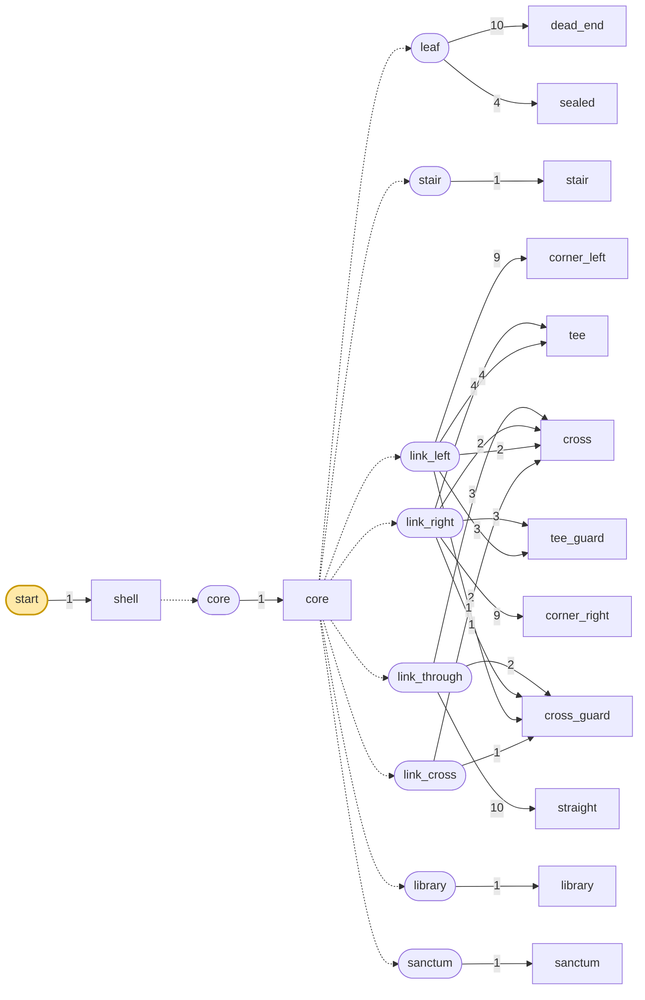

| 풀 | fallback | 원소 (가중치) |
|---|---|---|
| `core` | `minecraft:empty` | `core` 1 |
| `leaf` | `minecraft:empty` | `dead_end` 10, `sealed` 4 |
| `library` | `minecraft:empty` | `library` 1 |
| `link_cross` | `minecraft:empty` | `cross` 2, `cross_guard` 1 |
| `link_left` | `minecraft:empty` | `corner_left` 9, `tee` 4, `tee_guard` 3, `cross` 2, `cross_guard` 1 |
| `link_right` | `minecraft:empty` | `corner_right` 9, `tee` 4, `tee_guard` 3, `cross` 2, `cross_guard` 1 |
| `link_through` | `minecraft:empty` | `straight` 10, `cross` 3, `cross_guard` 2 |
| `sanctum` | `minecraft:empty` | `sanctum` 1 |
| `stair` | `minecraft:empty` | `stair` 1 |
| `start` | `minecraft:empty` | `shell` 1 |

## 4. 뼈대 — 반드시 이렇게 놓이는 부분

껍데기 하나, core 하나, 계단 일곱, 큰 방 둘. **원소가 하나뿐인 풀로 놓이는 것만** 그렸다.
일반 칸은 풀에서 뽑히므로 판마다 달라서 여기 없지만, **자리는 일흔두 칸 전부 정해져 있다.**

| 조각 | 놓이는 자리 (시작 조각 기준) | 누가 놓나 |
|---|---|---|
| `shell` | (0, 0, 0) | 시작 풀 |
| `core` | (4, 0, 4) | shell의 동 tow_placer 직소 |
| `stair` | (4, 7, 11) | core의 북 tow_placer 직소 |
| `stair` | (4, 21, 18) | core의 남 tow_placer 직소 |
| `stair` | (4, 35, 18) | core의 남 tow_placer 직소 |
| `library` | (11, 21, 11) | core의 동 tow_placer 직소 |
| `sanctum` | (11, 49, 4) | core의 동 tow_placer 직소 |
| `stair` | (4, 0, 4) | core의 서 tow_placer 직소 |
| `stair` | (18, 14, 4) | core의 동 tow_placer 직소 |
| `stair` | (18, 42, 18) | core의 동 tow_placer 직소 |
| `stair` | (11, 28, 4) | core의 서 tow_placer 직소 |

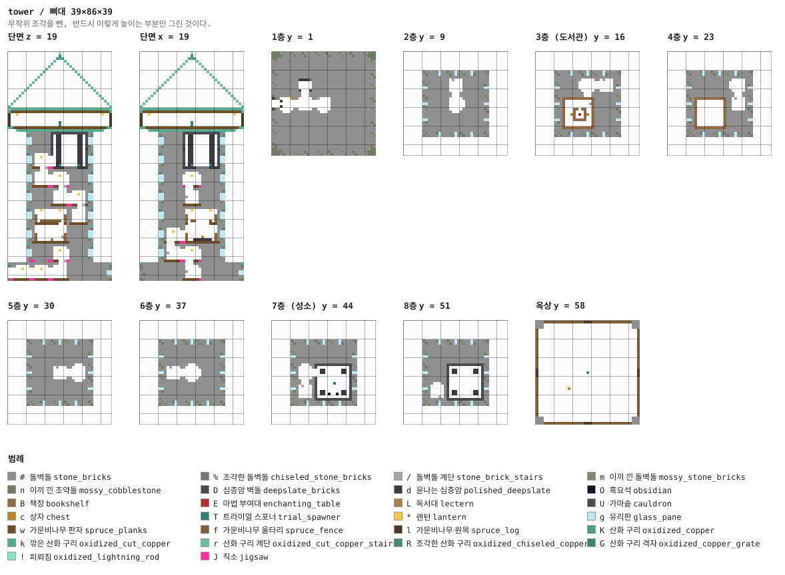

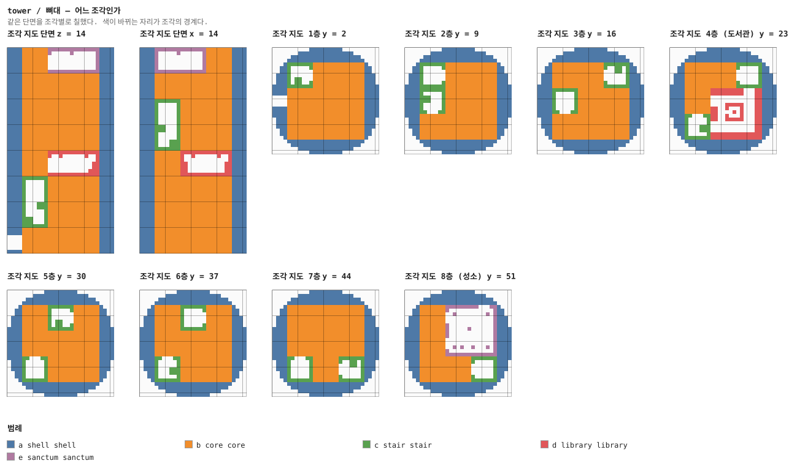

## 5. 조각


그림은 조각 하나를 **층마다 한 장씩** 블록 단위로 그린 것이다. 같은 층이 이어지면 `y = 2–5`처럼 묶었고, 마지막 두 장은 가운데를 자른 세로 단면이다. 분홍 점이 직소, 화살표가 그 직소가 보는 방향이다 — **마주 본 직소끼리만 붙는다.**

### `shell` — 29×56×29

테두리를 여덟 층으로 쌓은 것. 안쪽 21×21은 비워 두고 `core`가 가져간다.

평면이 **진짜 원**이다 — 21×21 정사각형의 네 꼭짓점이 지름 29 원 위에 놓이고 테두리가
그 사이를 메운다. 그래서 동서남북에서 4칸 두껍고 **대각선에서는 0**이다.
현관은 서쪽 가운데 하나뿐이고, 그 안쪽이 1층의 도착 칸이다.

한 층분(`ring_floor`, 29×7×29)은 `tools/handmade/tower/`에 따로 있다. 구조물 블록으로
저장할 수 있는 크기라, 손으로 더 예쁘게 지으면 생성기가 제 것 대신 그걸 쌓는다.

**어느 풀에 있나** — `start` (가중치 1)

| 직소 위치 | 향 | name | target | pool |
|---|---|---|---|---|
| (3, 0, 14) | ▶ 동 | `tow_placer` | `tow_anchor` | `tower/core` |

**뚫린 면** — 서: z 0–28, y 0–55 (1132칸) / 동: z 0–28, y 0–55 (1120칸) / 북: x 0–28, y 0–55 (1120칸) / 남: x 0–28, y 0–55 (1120칸) / 아래: x 0–28, z 0–28 (585칸) / 위: x 0–28, z 0–28 (585칸)

**블록** — 돌벽돌 10909, 조각한 돌벽돌 2020, 이끼 낀 돌벽돌 1358, 직소 1

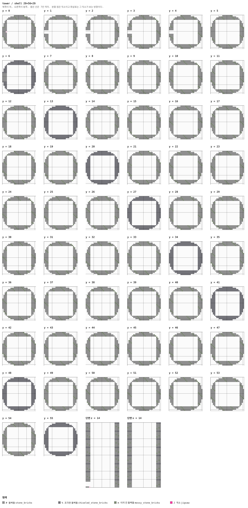

<details><summary>세로 단면 (텍스트)</summary>

```
단면 z = 14   x →동, y ↑하늘
  %%%%.....................%%%%
  ####.....................####
  ####.....................####
  ####.....................#m##
  #m##.....................###m
  ###m.....................####
  ####.....................####
  %%%%.....................%%%%
  ####.....................####
  ####.....................####
  ####.....................#m##
  #m##.....................###m
  ###m.....................####
  ####.....................####
  %%%%.....................%%%%
  ####.....................####
  ####.....................####
  ####.....................#m##
  #m##.....................###m
  ###m.....................####
  ####.....................####
  %%%%.....................%%%%
  ####.....................####
  ####.....................####
  ####.....................#m##
  #m##.....................###m
  ###m.....................####
  ####.....................####
  %%%%.....................%%%%
  ####.....................####
  ####.....................####
  ####.....................#m##
  #m##.....................###m
  ###m.....................####
  ####.....................####
  %%%%.....................%%%%
  ####.....................####
  ####.....................####
  ####.....................#m##
  #m##.....................###m
  ###m.....................####
  ####.....................####
  %%%%.....................%%%%
  ####.....................####
  ####.....................####
  ####.....................#m##
  #m##.....................###m
  ###m.....................####
  ####.....................####
  ####.....................%%%%
  ####.....................####
  .........................####
  .........................#m##
  .........................###m
  .........................####
  ###J.....................####
단면 x = 14   z →남, y ↑하늘
  %%%%.....................%%%%
  ####.....................####
  ####.....................####
  ##m#.....................####
  m###.....................##m#
  ####.....................m###
  ####.....................####
  %%%%.....................%%%%
  ####.....................####
  ####.....................####
  ##m#.....................####
  m###.....................##m#
  ####.....................m###
  ####.....................####
  %%%%.....................%%%%
  ####.....................####
  ####.....................####
  ##m#.....................####
  m###.....................##m#
  ####.....................m###
  ####.....................####
  %%%%.....................%%%%
  ####.....................####
  ####.....................####
  ##m#.....................####
  m###.....................##m#
  ####.....................m###
  ####.....................####
  %%%%.....................%%%%
  ####.....................####
  ####.....................####
  ##m#.....................####
  m###.....................##m#
  ####.....................m###
  ####.....................####
  %%%%.....................%%%%
  ####.....................####
  ####.....................####
  ##m#.....................####
  m###.....................##m#
  ####.....................m###
  ####.....................####
  %%%%.....................%%%%
  ####.....................####
  ####.....................####
  ##m#.....................####
  m###.....................##m#
  ####.....................m###
  ####.....................####
  %%%%.....................%%%%
  ####.....................####
  ####.....................####
  ##m#.....................####
  m###.....................##m#
  ####.....................m###
  ####.....................####
```

</details>


### `core` — 21×56×21 — 3×8×3 셀

21×56×21 통짜 돌. **직소가 예순 개 가까이 박혀 있다** — 칸 하나에 하나씩.

이 조각이 이 탑의 전부다. 여기서 놓이지 않은 칸은 없고, 여기 없는 배치도 없다.
직소가 자기 상자 안쪽을 가리키므로 그 자손은 전부 이 상자 안에서만 판정된다 (§10) —
아무것도 테두리를 뚫지 못한다.

**어느 풀에 있나** — `core` (가중치 1)

| 직소 위치 | 향 | name | target | pool |
|---|---|---|---|---|
| (7, 0, 3) | ◀ 서 | `tow_placer` | `tow_anchor` | `tower/stair` |
| (14, 0, 3) | ◀ 서 | `tow_placer` | `tow_anchor` | `tower/link_through` |
| (3, 0, 6) | ▼ 남 | `tow_placer` | `tow_anchor` | `tower/link_cross` |
| (17, 0, 7) | ▲ 북 | `tow_placer` | `tow_anchor` | `tower/link_left` |
| (0, 0, 10) | ◀ 서 | `tow_anchor` | `tow_anchor` | `—` |
| (6, 0, 10) | ▶ 동 | `tow_placer` | `tow_anchor` | `tower/link_cross` |
| (13, 0, 10) | ▶ 동 | `tow_placer` | `tow_anchor` | `tower/link_cross` |
| (3, 0, 13) | ▼ 남 | `tow_placer` | `tow_anchor` | `tower/leaf` |
| (10, 0, 13) | ▼ 남 | `tow_placer` | `tow_anchor` | `tower/leaf` |
| (17, 0, 13) | ▼ 남 | `tow_placer` | `tow_anchor` | `tower/leaf` |
| (6, 7, 3) | ▶ 동 | `tow_placer` | `tow_anchor` | `tower/link_cross` |
| (13, 7, 3) | ▶ 동 | `tow_placer` | `tow_anchor` | `tower/leaf` |
| (10, 7, 6) | ▼ 남 | `tow_placer` | `tow_anchor` | `tower/link_cross` |
| (13, 7, 10) | ▶ 동 | `tow_placer` | `tow_anchor` | `tower/leaf` |
| (10, 7, 13) | ▼ 남 | `tow_placer` | `tow_anchor` | `tower/link_cross` |
| (3, 7, 14) | ▲ 북 | `tow_placer` | `tow_anchor` | `tower/stair` |
| (7, 7, 17) | ◀ 서 | `tow_placer` | `tow_anchor` | `tower/link_right` |
| (13, 7, 17) | ▶ 동 | `tow_placer` | `tow_anchor` | `tower/leaf` |
| (7, 14, 3) | ◀ 서 | `tow_placer` | `tow_anchor` | `tower/leaf` |
| (13, 14, 3) | ▶ 동 | `tow_placer` | `tow_anchor` | `tower/stair` |
| (10, 14, 7) | ▲ 북 | `tow_placer` | `tow_anchor` | `tower/link_cross` |
| (13, 14, 10) | ▶ 동 | `tow_placer` | `tow_anchor` | `tower/leaf` |
| (3, 14, 13) | ▼ 남 | `tow_placer` | `tow_anchor` | `tower/link_left` |
| (10, 14, 14) | ▲ 북 | `tow_placer` | `tow_anchor` | `tower/link_cross` |
| (6, 14, 17) | ▶ 동 | `tow_placer` | `tow_anchor` | `tower/link_cross` |
| (13, 14, 17) | ▶ 동 | `tow_placer` | `tow_anchor` | `tower/leaf` |
| (7, 21, 3) | ◀ 서 | `tow_placer` | `tow_anchor` | `tower/link_left` |
| (14, 21, 3) | ◀ 서 | `tow_placer` | `tow_anchor` | `tower/link_through` |
| (3, 21, 6) | ▼ 남 | `tow_placer` | `tow_anchor` | `tower/link_cross` |
| (6, 21, 10) | ▶ 동 | `tow_placer` | `tow_anchor` | `tower/library` |
| (3, 21, 13) | ▼ 남 | `tow_placer` | `tow_anchor` | `tower/stair` |
| (14, 28, 3) | ◀ 서 | `tow_placer` | `tow_anchor` | `tower/stair` |
| (3, 28, 7) | ▲ 북 | `tow_placer` | `tow_anchor` | `tower/leaf` |
| (17, 28, 7) | ▲ 북 | `tow_placer` | `tow_anchor` | `tower/link_left` |
| (6, 28, 10) | ▶ 동 | `tow_placer` | `tow_anchor` | `tower/link_cross` |
| (13, 28, 10) | ▶ 동 | `tow_placer` | `tow_anchor` | `tower/link_cross` |
| (10, 28, 13) | ▼ 남 | `tow_placer` | `tow_anchor` | `tower/leaf` |
| (17, 28, 13) | ▼ 남 | `tow_placer` | `tow_anchor` | `tower/leaf` |
| (3, 28, 14) | ▲ 북 | `tow_placer` | `tow_anchor` | `tower/link_cross` |
| (13, 35, 3) | ▶ 동 | `tow_placer` | `tow_anchor` | `tower/link_right` |
| (17, 35, 6) | ▼ 남 | `tow_placer` | `tow_anchor` | `tower/link_cross` |
| (3, 35, 7) | ▲ 북 | `tow_placer` | `tow_anchor` | `tower/leaf` |
| (7, 35, 10) | ◀ 서 | `tow_placer` | `tow_anchor` | `tower/link_cross` |
| (14, 35, 10) | ◀ 서 | `tow_placer` | `tow_anchor` | `tower/link_cross` |
| (3, 35, 13) | ▼ 남 | `tow_placer` | `tow_anchor` | `tower/stair` |
| (10, 35, 13) | ▼ 남 | `tow_placer` | `tow_anchor` | `tower/leaf` |
| (17, 35, 13) | ▼ 남 | `tow_placer` | `tow_anchor` | `tower/leaf` |
| (6, 42, 3) | ▶ 동 | `tow_placer` | `tow_anchor` | `tower/link_cross` |
| (13, 42, 3) | ▶ 동 | `tow_placer` | `tow_anchor` | `tower/leaf` |
| (10, 42, 6) | ▼ 남 | `tow_placer` | `tow_anchor` | `tower/link_cross` |
| (3, 42, 7) | ▲ 북 | `tow_placer` | `tow_anchor` | `tower/link_right` |
| (13, 42, 10) | ▶ 동 | `tow_placer` | `tow_anchor` | `tower/leaf` |
| (10, 42, 13) | ▼ 남 | `tow_placer` | `tow_anchor` | `tower/link_left` |
| (3, 42, 14) | ▲ 북 | `tow_placer` | `tow_anchor` | `tower/link_through` |
| (13, 42, 17) | ▶ 동 | `tow_placer` | `tow_anchor` | `tower/stair` |
| (6, 49, 3) | ▶ 동 | `tow_placer` | `tow_anchor` | `tower/sanctum` |
| (3, 49, 7) | ▲ 북 | `tow_placer` | `tow_anchor` | `tower/link_right` |
| (3, 49, 14) | ▲ 북 | `tow_placer` | `tow_anchor` | `tower/link_through` |
| (7, 49, 17) | ◀ 서 | `tow_placer` | `tow_anchor` | `tower/link_right` |
| (14, 49, 17) | ◀ 서 | `tow_placer` | `tow_anchor` | `tower/link_through` |

**블록** — 돌벽돌 24636, 직소 60

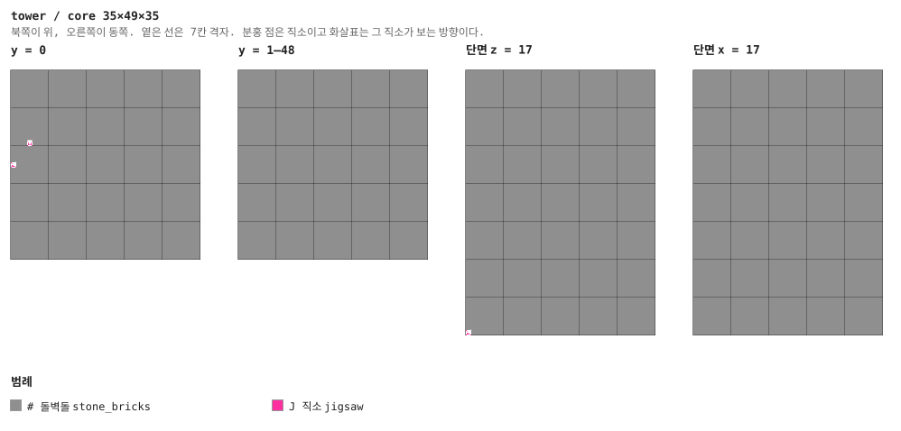

<details><summary>층별 지도 (텍스트)</summary>

```
y = 0   x →동, z ↓남
  #####################
  #####################
  #####################
  #######J######J######
  #####################
  #####################
  ###J#################
  #################J###
  #####################
  #####################
  J#####J######J#######
  #####################
  #####################
  ###J######J######J###
  #####################
  #####################
  #####################
  #####################
  #####################
  #####################
  #####################
y = 1–6   x →동, z ↓남
  #####################
  #####################
  #####################
  #####################
  #####################
  #####################
  #####################
  #####################
  #####################
  #####################
  #####################
  #####################
  #####################
  #####################
  #####################
  #####################
  #####################
  #####################
  #####################
  #####################
  #####################
y = 7   x →동, z ↓남
  #####################
  #####################
  #####################
  ######J######J#######
  #####################
  #####################
  ##########J##########
  #####################
  #####################
  #####################
  #############J#######
  #####################
  #####################
  ##########J##########
  ###J#################
  #####################
  #####################
  #######J#####J#######
  #####################
  #####################
  #####################
y = 8–13   x →동, z ↓남
  #####################
  #####################
  #####################
  #####################
  #####################
  #####################
  #####################
  #####################
  #####################
  #####################
  #####################
  #####################
  #####################
  #####################
  #####################
  #####################
  #####################
  #####################
  #####################
  #####################
  #####################
y = 14   x →동, z ↓남
  #####################
  #####################
  #####################
  #######J#####J#######
  #####################
  #####################
  #####################
  ##########J##########
  #####################
  #####################
  #############J#######
  #####################
  #####################
  ###J#################
  ##########J##########
  #####################
  #####################
  ######J######J#######
  #####################
  #####################
  #####################
y = 15–20   x →동, z ↓남
  #####################
  #####################
  #####################
  #####################
  #####################
  #####################
  #####################
  #####################
  #####################
  #####################
  #####################
  #####################
  #####################
  #####################
  #####################
  #####################
  #####################
  #####################
  #####################
  #####################
  #####################
y = 21   x →동, z ↓남
  #####################
  #####################
  #####################
  #######J######J######
  #####################
  #####################
  ###J#################
  #####################
  #####################
  #####################
  ######J##############
  #####################
  #####################
  ###J#################
  #####################
  #####################
  #####################
  #####################
  #####################
  #####################
  #####################
y = 22–27   x →동, z ↓남
  #####################
  #####################
  #####################
  #####################
  #####################
  #####################
  #####################
  #####################
  #####################
  #####################
  #####################
  #####################
  #####################
  #####################
  #####################
  #####################
  #####################
  #####################
  #####################
  #####################
  #####################
y = 28   x →동, z ↓남
  #####################
  #####################
  #####################
  ##############J######
  #####################
  #####################
  #####################
  ###J#############J###
  #####################
  #####################
  ######J######J#######
  #####################
  #####################
  ##########J######J###
  ###J#################
  #####################
  #####################
  #####################
  #####################
  #####################
  #####################
y = 29–34   x →동, z ↓남
  #####################
  #####################
  #####################
  #####################
  #####################
  #####################
  #####################
  #####################
  #####################
  #####################
  #####################
  #####################
  #####################
  #####################
  #####################
  #####################
  #####################
  #####################
  #####################
  #####################
  #####################
y = 35   x →동, z ↓남
  #####################
  #####################
  #####################
  #############J#######
  #####################
  #####################
  #################J###
  ###J#################
  #####################
  #####################
  #######J######J######
  #####################
  #####################
  ###J######J######J###
  #####################
  #####################
  #####################
  #####################
  #####################
  #####################
  #####################
y = 36–41   x →동, z ↓남
  #####################
  #####################
  #####################
  #####################
  #####################
  #####################
  #####################
  #####################
  #####################
  #####################
  #####################
  #####################
  #####################
  #####################
  #####################
  #####################
  #####################
  #####################
  #####################
  #####################
  #####################
y = 42   x →동, z ↓남
  #####################
  #####################
  #####################
  ######J######J#######
  #####################
  #####################
  ##########J##########
  ###J#################
  #####################
  #####################
  #############J#######
  #####################
  #####################
  ##########J##########
  ###J#################
  #####################
  #####################
  #############J#######
  #####################
  #####################
  #####################
y = 43–48   x →동, z ↓남
  #####################
  #####################
  #####################
  #####################
  #####################
  #####################
  #####################
  #####################
  #####################
  #####################
  #####################
  #####################
  #####################
  #####################
  #####################
  #####################
  #####################
  #####################
  #####################
  #####################
  #####################
y = 49   x →동, z ↓남
  #####################
  #####################
  #####################
  ######J##############
  #####################
  #####################
  #####################
  ###J#################
  #####################
  #####################
  #####################
  #####################
  #####################
  #####################
  ###J#################
  #####################
  #####################
  #######J######J######
  #####################
  #####################
  #####################
y = 50–55   x →동, z ↓남
  #####################
  #####################
  #####################
  #####################
  #####################
  #####################
  #####################
  #####################
  #####################
  #####################
  #####################
  #####################
  #####################
  #####################
  #####################
  #####################
  #####################
  #####################
  #####################
  #####################
  #####################
```

</details>

<details><summary>세로 단면 (텍스트)</summary>

```
단면 z = 10   x →동, y ↑하늘
  #####################
  #####################
  #####################
  #####################
  #####################
  #####################
  #####################
  #####################
  #####################
  #####################
  #####################
  #####################
  #####################
  #############J#######
  #####################
  #####################
  #####################
  #####################
  #####################
  #####################
  #######J######J######
  #####################
  #####################
  #####################
  #####################
  #####################
  #####################
  ######J######J#######
  #####################
  #####################
  #####################
  #####################
  #####################
  #####################
  ######J##############
  #####################
  #####################
  #####################
  #####################
  #####################
  #####################
  #############J#######
  #####################
  #####################
  #####################
  #####################
  #####################
  #####################
  #############J#######
  #####################
  #####################
  #####################
  #####################
  #####################
  #####################
  J#####J######J#######
단면 x = 10   z →남, y ↑하늘
  #####################
  #####################
  #####################
  #####################
  #####################
  #####################
  #####################
  #####################
  #####################
  #####################
  #####################
  #####################
  #####################
  ######J######J#######
  #####################
  #####################
  #####################
  #####################
  #####################
  #####################
  #############J#######
  #####################
  #####################
  #####################
  #####################
  #####################
  #####################
  #############J#######
  #####################
  #####################
  #####################
  #####################
  #####################
  #####################
  #####################
  #####################
  #####################
  #####################
  #####################
  #####################
  #####################
  #######J######J######
  #####################
  #####################
  #####################
  #####################
  #####################
  #####################
  ######J######J#######
  #####################
  #####################
  #####################
  #####################
  #####################
  #####################
  #############J#######
```

</details>


### `stair` — 7×14×7 — 1×2×1 셀

7×14×7, **두 층을 쓴다.** 손으로 지은 나선이고, 위아래가 둘 다 서쪽으로 열린다.
올라가면 들어간 칸 **바로 위**로 나오고, 그게 층 사슬을 만든다.

한 번 실수로 이 조각의 계단 블록 방향이 전부 북쪽이 된 적이 있다. 월드에서 블록을 읽을 때
이름만 가져오고 블록 상태를 버렸기 때문이다 — 나선이 계단 더미가 됐다.

**어느 풀에 있나** — `stair` (가중치 1)

| 직소 위치 | 향 | name | target | pool |
|---|---|---|---|---|
| (0, 0, 3) | ◀ 서 | `tow_anchor` | `tow_anchor` | `—` |

**뚫린 면** — 서: z 2–4, y 1–10 (21칸)

**블록** — 돌벽돌 383, 돌벽돌 계단 24, 직소 1

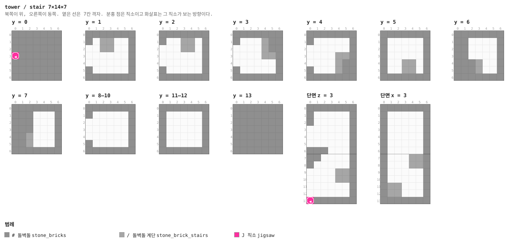

<details><summary>층별 지도 (텍스트)</summary>

```
y = 0   x →동, z ↓남
  #######
  #######
  #######
  J######
  #######
  #######
  #######
y = 1   x →동, z ↓남
  #######
  #.//..#
  ..//..#
  ......#
  ......#
  #.....#
  #######
y = 2   x →동, z ↓남
  #######
  #..//.#
  ...//.#
  ......#
  ......#
  #.....#
  #######
y = 3   x →동, z ↓남
  #######
  #.../##
  ..../##
  ....//#
  ......#
  #.....#
  #######
y = 4   x →동, z ↓남
  #######
  #.....#
  ......#
  ....//#
  ..../##
  #.../##
  #######
y = 5   x →동, z ↓남
  #######
  #.....#
  #.....#
  #.....#
  #..//.#
  #..//.#
  #######
y = 6   x →동, z ↓남
  #######
  ##....#
  ##....#
  ##....#
  ###/..#
  ###/..#
  #######
y = 7   x →동, z ↓남
  #######
  ###...#
  ###...#
  ###...#
  ##/...#
  ##/...#
  #######
y = 8–10   x →동, z ↓남
  #######
  #.....#
  ......#
  ......#
  ......#
  #.....#
  #######
y = 11–12   x →동, z ↓남
  #######
  #.....#
  #.....#
  #.....#
  #.....#
  #.....#
  #######
y = 13   x →동, z ↓남
  #######
  #######
  #######
  #######
  #######
  #######
  #######
```

</details>

<details><summary>세로 단면 (텍스트)</summary>

```
단면 z = 3   x →동, y ↑하늘
  #######
  #.....#
  #.....#
  ......#
  ......#
  ......#
  ###...#
  ##....#
  #.....#
  ....//#
  ....//#
  ......#
  ......#
  J######
단면 x = 3   z →남, y ↑하늘
  #######
  #.....#
  #.....#
  #.....#
  #.....#
  #.....#
  #.....#
  #...//#
  #...//#
  #.....#
  #.....#
  #//...#
  #//...#
  #######
```

</details>


### `library` — 14×7×14 — 2×1×2 셀

14×7×14, 2×2칸을 쓰는 4층 도서관. 벽 세 켜가 전부 책장이고, 단상 위 마법 부여대를
**유효 책장 열다섯 개**가 둘러싼다.

테이블과 **같은 높이**에 사이가 비어 있어야 게임이 센다. 서쪽 한 자리를 비워 걸어 들어갈
길을 냈고, 그래서 열여섯이 아니라 정확히 열다섯이다 — 생성기가 `assert`로 센다.

**문 앞 칸은 비워 둔다.** 어느 면에 문이 있는지는 적어 두지 않고 벽이 뚫린 자리로 역산하므로,
문을 옮겨도 가구가 막지 않는다.

**어느 풀에 있나** — `library` (가중치 1)

| 직소 위치 | 향 | name | target | pool |
|---|---|---|---|---|
| (0, 0, 3) | ◀ 서 | `tow_anchor` | `tow_anchor` | `—` |

**뚫린 면** — 서: z 2–11, y 1–4 (24칸) / 북: x 9–11, y 1–4 (12칸)

**블록** — 돌벽돌 615, 책장 120, 조각한 돌벽돌 25, 랜턴 4, 독서대 2, 상자 2, 직소 1, 마법 부여대 1

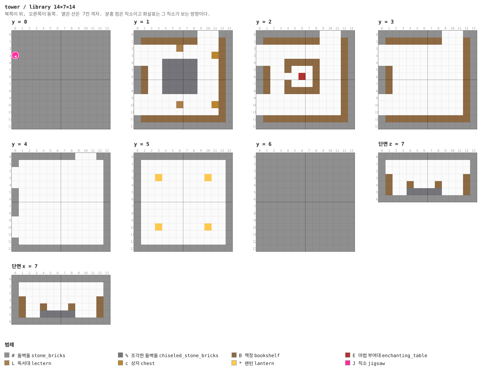

<details><summary>층별 지도 (텍스트)</summary>

```
y = 0   x →동, z ↓남
  ##############
  ##############
  ##############
  J#############
  ##############
  ##############
  ##############
  ##############
  ##############
  ##############
  ##############
  ##############
  ##############
  ##############
y = 1   x →동, z ↓남
  #########...##
  #BBBBBBBB...B#
  ......L.....B#
  ...........cB#
  ....%%%%%...B#
  #B..%%%%%...B#
  #B..%%%%%...B#
  #B..%%%%%...B#
  #B..%%%%%...B#
  ............B#
  ......L....cB#
  ............B#
  #BBBBBBBBBBBB#
  ##############
y = 2   x →동, z ↓남
  #########...##
  #BBBBBBBB...B#
  ............B#
  ............B#
  ....BBBBB...B#
  #B..B...B...B#
  #B....E.B...B#
  #B..B...B...B#
  #B..BBBBB...B#
  ............B#
  ............B#
  ............B#
  #BBBBBBBBBBBB#
  ##############
y = 3   x →동, z ↓남
  #########...##
  #BBBBBBBB...B#
  ............B#
  ............B#
  ............B#
  #B..........B#
  #B..........B#
  #B..........B#
  #B..........B#
  ............B#
  ............B#
  ............B#
  #BBBBBBBBBBBB#
  ##############
y = 4   x →동, z ↓남
  #########...##
  #............#
  .............#
  .............#
  .............#
  #............#
  #............#
  #............#
  #............#
  .............#
  .............#
  .............#
  #............#
  ##############
y = 5   x →동, z ↓남
  ##############
  #............#
  #............#
  #..*......*..#
  #............#
  #............#
  #............#
  #............#
  #............#
  #............#
  #..*......*..#
  #............#
  #............#
  ##############
y = 6   x →동, z ↓남
  ##############
  ##############
  ##############
  ##############
  ##############
  ##############
  ##############
  ##############
  ##############
  ##############
  ##############
  ##############
  ##############
  ##############
```

</details>


### `sanctum` — 14×7×14 — 2×1×2 셀

도서관과 **같은 벽을 심층암으로 갈아입힌** 8층 보스방. 문이 열리는 순간 다른 데라는 것이
보인다. 단상의 대마법사 트라이얼 스포너 하나와 사분면 경비 넷, 먼 벽에 **불 붙이지 않은
흑요석 포탈 틀**과 화염과 강철이 든 상자.

클리어 판정과 보상은 트라이얼 스포너가 한다 — 상자는 싸우지 않고 열 수 있다 (§7).
확정 보상: **엔더의 눈 4 + 불사의 토템 + 마법 부여(25~30) 다이아 장비 1.**

**어느 풀에 있나** — `sanctum` (가중치 1)

| 직소 위치 | 향 | name | target | pool |
|---|---|---|---|---|
| (0, 0, 3) | ◀ 서 | `tow_anchor` | `tow_anchor` | `—` |

**뚫린 면** — 서: z 2–11, y 1–4 (24칸) / 북: x 9–11, y 1–4 (12칸)

**블록** — 심층암 벽돌 615, 윤나는 심층암 20, 흑요석 10, 조각한 돌벽돌 9, 트라이얼 스포너 5, 영혼 랜턴 4, 직소 1, 상자 1

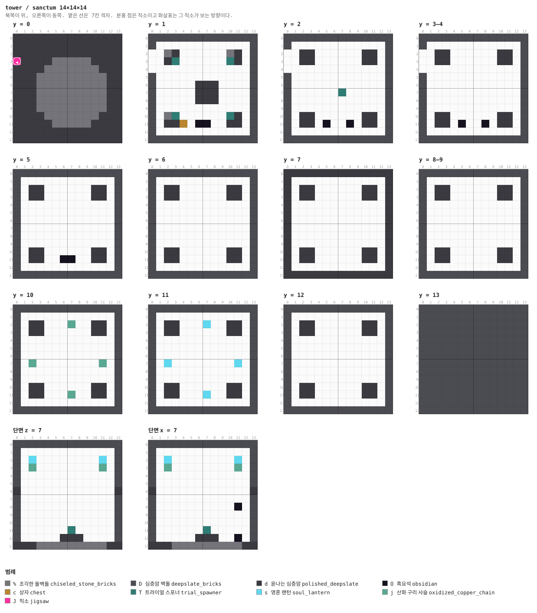

<details><summary>층별 지도 (텍스트)</summary>

```
y = 0   x →동, z ↓남
  DDDDDDDDDDDDDD
  DDDDDDDDDDDDDD
  DDDDDDDDDDDDDD
  JDDDDDDDDDDDDD
  DDDDDDDDDDDDDD
  DDDDDDDDDDDDDD
  DDDDDDDDDDDDDD
  DDDDDDDDDDDDDD
  DDDDDDDDDDDDDD
  DDDDDDDDDDDDDD
  DDDDDDDDDDDDDD
  DDDDDDDDDDDDDD
  DDDDDDDDDDDDDD
  DDDDDDDDDDDDDD
y = 1   x →동, z ↓남
  DDDDDDDDD...DD
  D............D
  ..d........d.D
  .............D
  ....T....T...D
  D....%%%.....D
  D....%%%.....D
  D....%%%.....D
  D............D
  ....T....T...D
  .............D
  ..d..OO..c.d.D
  D............D
  DDDDDDDDDDDDDD
y = 2   x →동, z ↓남
  DDDDDDDDD...DD
  D............D
  ..d........d.D
  .............D
  .............D
  D............D
  D.....T......D
  D............D
  D............D
  .............D
  .............D
  ..d.O..O...d.D
  D............D
  DDDDDDDDDDDDDD
y = 3–4   x →동, z ↓남
  DDDDDDDDD...DD
  D............D
  ..d........d.D
  .............D
  .............D
  D............D
  D............D
  D............D
  D............D
  .............D
  .............D
  ..d.O..O...d.D
  D............D
  DDDDDDDDDDDDDD
y = 5   x →동, z ↓남
  DDDDDDDDDDDDDD
  D............D
  D.d........d.D
  D.....*......D
  D............D
  D............D
  D..*......*..D
  D............D
  D............D
  D............D
  D.....*......D
  D.d..OO....d.D
  D............D
  DDDDDDDDDDDDDD
y = 6   x →동, z ↓남
  DDDDDDDDDDDDDD
  DDDDDDDDDDDDDD
  DDDDDDDDDDDDDD
  DDDDDDDDDDDDDD
  DDDDDDDDDDDDDD
  DDDDDDDDDDDDDD
  DDDDDDDDDDDDDD
  DDDDDDDDDDDDDD
  DDDDDDDDDDDDDD
  DDDDDDDDDDDDDD
  DDDDDDDDDDDDDD
  DDDDDDDDDDDDDD
  DDDDDDDDDDDDDD
  DDDDDDDDDDDDDD
```

</details>


### `cross` — 7×7×7 — 1×1×1 셀

사거리. 네 면이 다 열린다.

**어느 풀에 있나** — `link_cross` (가중치 2), `link_left` (가중치 2), `link_right` (가중치 2), `link_through` (가중치 3)

| 직소 위치 | 향 | name | target | pool |
|---|---|---|---|---|
| (0, 0, 3) | ◀ 서 | `tow_anchor` | `tow_anchor` | `—` |

**뚫린 면** — 서: z 2–4, y 1–4 (12칸) / 동: z 2–4, y 1–4 (12칸) / 북: x 2–4, y 1–4 (12칸) / 남: x 2–4, y 1–4 (12칸)

**블록** — 돌벽돌 169, 직소 1

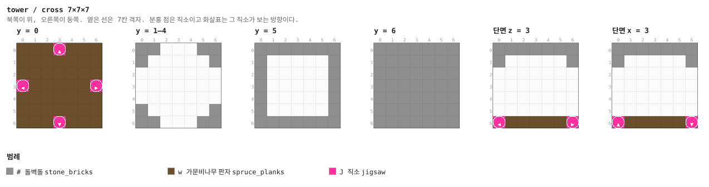

<details><summary>층별 지도 (텍스트)</summary>

```
y = 0   x →동, z ↓남
  #######
  #######
  #######
  J######
  #######
  #######
  #######
y = 1–4   x →동, z ↓남
  ##...##
  #.....#
  .......
  .......
  .......
  #.....#
  ##...##
y = 5   x →동, z ↓남
  #######
  #.....#
  #.....#
  #.....#
  #.....#
  #.....#
  #######
y = 6   x →동, z ↓남
  #######
  #######
  #######
  #######
  #######
  #######
  #######
```

</details>


### `cross_guard` — 7×7×7 — 1×1×1 셀

사거리 한가운데 벡스 스포너. 평범한 `cross`와 **같은 풀에 나란히** 들어가서 섞여 나온다.
스포너에는 `custom_spawn_rules.block_light_limit 0..15`가 걸려 있다 — 없으면 몹 자신의
규칙을 따라서 밝은 통로에서는 장식이 된다 (§6).

**어느 풀에 있나** — `link_cross` (가중치 1), `link_left` (가중치 1), `link_right` (가중치 1), `link_through` (가중치 2)

| 직소 위치 | 향 | name | target | pool |
|---|---|---|---|---|
| (0, 0, 3) | ◀ 서 | `tow_anchor` | `tow_anchor` | `—` |

**뚫린 면** — 서: z 2–4, y 1–4 (12칸) / 동: z 2–4, y 1–4 (12칸) / 북: x 2–4, y 1–4 (12칸) / 남: x 2–4, y 1–4 (12칸)

**블록** — 돌벽돌 169, 직소 1, 몬스터 스포너 1

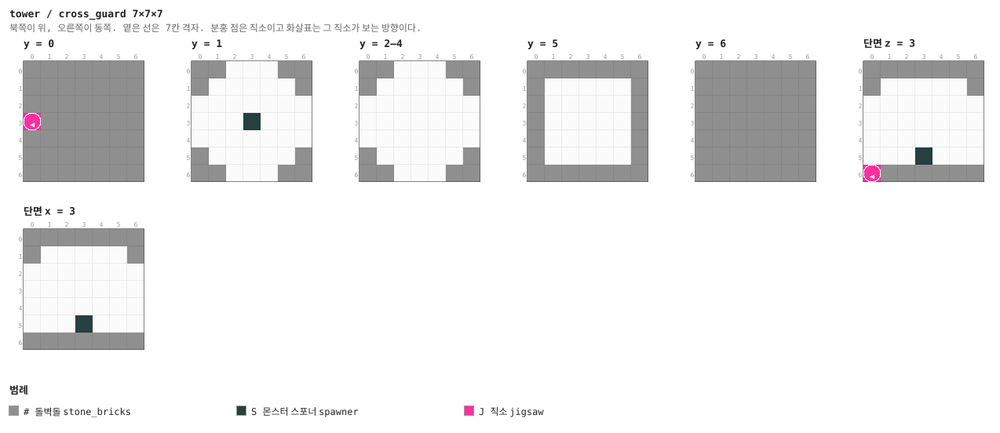

<details><summary>층별 지도 (텍스트)</summary>

```
y = 0   x →동, z ↓남
  #######
  #######
  #######
  J######
  #######
  #######
  #######
y = 1   x →동, z ↓남
  ##...##
  #.....#
  .......
  ...S...
  .......
  #.....#
  ##...##
y = 2–4   x →동, z ↓남
  ##...##
  #.....#
  .......
  .......
  .......
  #.....#
  ##...##
y = 5   x →동, z ↓남
  #######
  #.....#
  #.....#
  #.....#
  #.....#
  #.....#
  #######
y = 6   x →동, z ↓남
  #######
  #######
  #######
  #######
  #######
  #######
  #######
```

</details>


### `tee` — 7×7×7 — 1×1×1 셀

삼거리. 들어온 문과 좌우.

**어느 풀에 있나** — `link_left` (가중치 4), `link_right` (가중치 4)

| 직소 위치 | 향 | name | target | pool |
|---|---|---|---|---|
| (0, 0, 3) | ◀ 서 | `tow_anchor` | `tow_anchor` | `—` |

**뚫린 면** — 서: z 2–4, y 1–4 (12칸) / 북: x 2–4, y 1–4 (12칸) / 남: x 2–4, y 1–4 (12칸)

**블록** — 돌벽돌 181, 직소 1

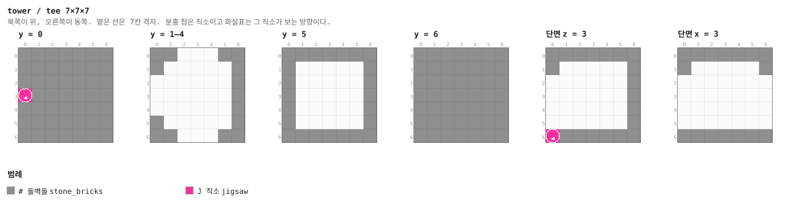

<details><summary>층별 지도 (텍스트)</summary>

```
y = 0   x →동, z ↓남
  #######
  #######
  #######
  J######
  #######
  #######
  #######
y = 1–4   x →동, z ↓남
  ##...##
  #.....#
  ......#
  ......#
  ......#
  #.....#
  ##...##
y = 5   x →동, z ↓남
  #######
  #.....#
  #.....#
  #.....#
  #.....#
  #.....#
  #######
y = 6   x →동, z ↓남
  #######
  #######
  #######
  #######
  #######
  #######
  #######
```

</details>


### `tee_guard` — 7×7×7 — 1×1×1 셀

삼거리 한가운데 좀비 주민 스포너.

**어느 풀에 있나** — `link_left` (가중치 3), `link_right` (가중치 3)

| 직소 위치 | 향 | name | target | pool |
|---|---|---|---|---|
| (0, 0, 3) | ◀ 서 | `tow_anchor` | `tow_anchor` | `—` |

**뚫린 면** — 서: z 2–4, y 1–4 (12칸) / 북: x 2–4, y 1–4 (12칸) / 남: x 2–4, y 1–4 (12칸)

**블록** — 돌벽돌 181, 직소 1, 몬스터 스포너 1

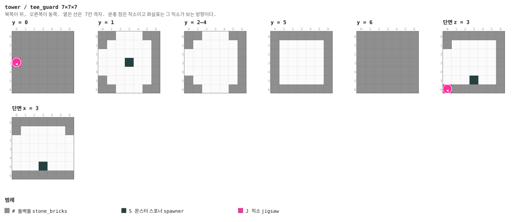

<details><summary>층별 지도 (텍스트)</summary>

```
y = 0   x →동, z ↓남
  #######
  #######
  #######
  J######
  #######
  #######
  #######
y = 1   x →동, z ↓남
  ##...##
  #.....#
  ......#
  ...S..#
  ......#
  #.....#
  ##...##
y = 2–4   x →동, z ↓남
  ##...##
  #.....#
  ......#
  ......#
  ......#
  #.....#
  ##...##
y = 5   x →동, z ↓남
  #######
  #.....#
  #.....#
  #.....#
  #.....#
  #.....#
  #######
y = 6   x →동, z ↓남
  #######
  #######
  #######
  #######
  #######
  #######
  #######
```

</details>


### `straight` — 7×7×7 — 1×1×1 셀

직선 통로.

**어느 풀에 있나** — `link_through` (가중치 10)

| 직소 위치 | 향 | name | target | pool |
|---|---|---|---|---|
| (0, 0, 3) | ◀ 서 | `tow_anchor` | `tow_anchor` | `—` |

**뚫린 면** — 서: z 2–4, y 1–4 (12칸) / 동: z 2–4, y 1–4 (12칸)

**블록** — 돌벽돌 193, 직소 1

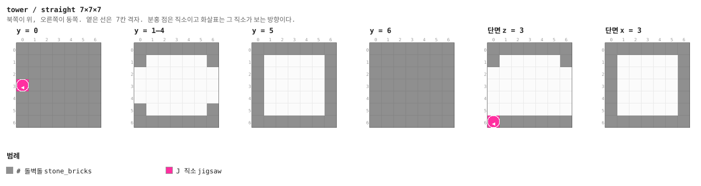

<details><summary>층별 지도 (텍스트)</summary>

```
y = 0   x →동, z ↓남
  #######
  #######
  #######
  J######
  #######
  #######
  #######
y = 1–4   x →동, z ↓남
  #######
  #.....#
  .......
  .......
  .......
  #.....#
  #######
y = 5   x →동, z ↓남
  #######
  #.....#
  #.....#
  #.....#
  #.....#
  #.....#
  #######
y = 6   x →동, z ↓남
  #######
  #######
  #######
  #######
  #######
  #######
  #######
```

</details>


### `corner_left` — 7×7×7 — 1×1×1 셀

왼쪽으로 꺾는 길. 손으로 지은 것.

**어느 풀에 있나** — `link_left` (가중치 9)

| 직소 위치 | 향 | name | target | pool |
|---|---|---|---|---|
| (0, 0, 3) | ◀ 서 | `tow_anchor` | `tow_anchor` | `—` |

**뚫린 면** — 서: z 2–4, y 1–4 (12칸) / 북: x 2–4, y 1–4 (12칸)

**블록** — 돌벽돌 193, 직소 1

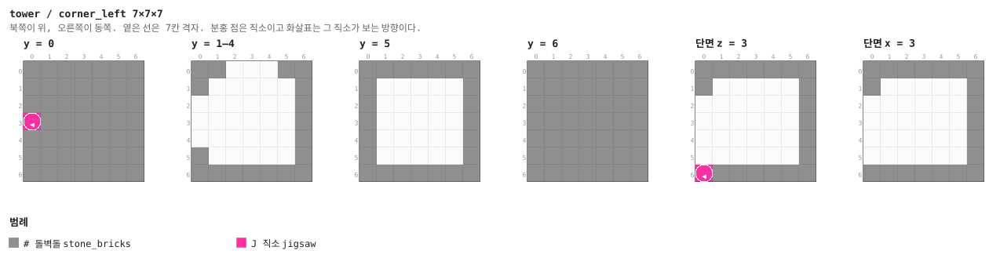

<details><summary>층별 지도 (텍스트)</summary>

```
y = 0   x →동, z ↓남
  #######
  #######
  #######
  J######
  #######
  #######
  #######
y = 1–4   x →동, z ↓남
  ##...##
  #.....#
  ......#
  ......#
  ......#
  #.....#
  #######
y = 5   x →동, z ↓남
  #######
  #.....#
  #.....#
  #.....#
  #.....#
  #.....#
  #######
y = 6   x →동, z ↓남
  #######
  #######
  #######
  #######
  #######
  #######
  #######
```

</details>


### `corner_right` — 7×7×7 — 1×1×1 셀

오른쪽으로 꺾는 길. 목업에는 한 방향밖에 없어서 **거울로 뒤집어** 만들었다.
(회전은 바닐라가 해 주지만 좌우 반전은 안 해 준다.)

**어느 풀에 있나** — `link_right` (가중치 9)

| 직소 위치 | 향 | name | target | pool |
|---|---|---|---|---|
| (0, 0, 3) | ◀ 서 | `tow_anchor` | `tow_anchor` | `—` |

**뚫린 면** — 서: z 2–4, y 1–4 (12칸) / 남: x 2–4, y 1–4 (12칸)

**블록** — 돌벽돌 193, 직소 1

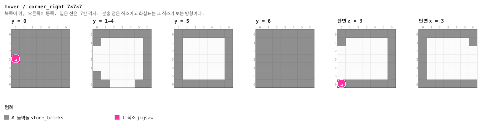

<details><summary>층별 지도 (텍스트)</summary>

```
y = 0   x →동, z ↓남
  #######
  #######
  #######
  J######
  #######
  #######
  #######
y = 1–4   x →동, z ↓남
  #######
  #.....#
  ......#
  ......#
  ......#
  #.....#
  ##...##
y = 5   x →동, z ↓남
  #######
  #.....#
  #.....#
  #.....#
  #.....#
  #.....#
  #######
y = 6   x →동, z ↓남
  #######
  #######
  #######
  #######
  #######
  #######
  #######
```

</details>


### `dead_end` — 7×7×7 — 1×1×1 셀

보상 방. 문이 하나뿐이고 그 **맞은편 벽에 상자**, 양옆에 책장, 천장에 랜턴이 있다.
통로는 어두운 채로 두었으므로 불이 켜진 칸은 들어가 볼 만하다는 신호다.

**어느 풀에 있나** — `leaf` (가중치 10)

| 직소 위치 | 향 | name | target | pool |
|---|---|---|---|---|
| (0, 0, 3) | ◀ 서 | `tow_anchor` | `tow_anchor` | `—` |

**뚫린 면** — 서: z 2–4, y 1–4 (12칸)

**블록** — 돌벽돌 205, 책장 2, 직소 1, 랜턴 1, 상자 1

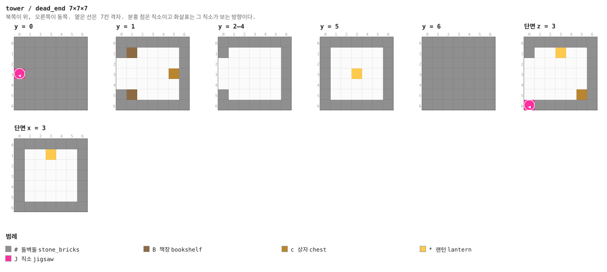

<details><summary>층별 지도 (텍스트)</summary>

```
y = 0   x →동, z ↓남
  #######
  #######
  #######
  J######
  #######
  #######
  #######
y = 1   x →동, z ↓남
  #######
  #B....#
  ......#
  .....c#
  ......#
  #B....#
  #######
y = 2–4   x →동, z ↓남
  #######
  #.....#
  ......#
  ......#
  ......#
  #.....#
  #######
y = 5   x →동, z ↓남
  #######
  #.....#
  #.....#
  #..*..#
  #.....#
  #.....#
  #######
y = 6   x →동, z ↓남
  #######
  #######
  #######
  #######
  #######
  #######
  #######
```

</details>


### `sealed` — 7×7×7 — 1×1×1 셀

**비밀방.** 문이 하나도 없고 상자 하나가 있다.

문이 없는 조각은 직소가 놓을 수 없으므로, 직소를 **벽 속에** 박았다. 이웃의 문이 그 벽에
붙어서 플레이어에게는 **돌로 막힌 문**으로 보인다. 층이 한 칸 모자란 것을 눈치채고 파야
한다. 탑에서 제일 찾기 어려운 것이라 상자도 제일 좋은 것을 넣었다.

**어느 풀에 있나** — `leaf` (가중치 4)

| 직소 위치 | 향 | name | target | pool |
|---|---|---|---|---|
| (0, 0, 3) | ◀ 서 | `tow_anchor` | `tow_anchor` | `—` |

**블록** — 돌벽돌 217, 직소 1, 상자 1

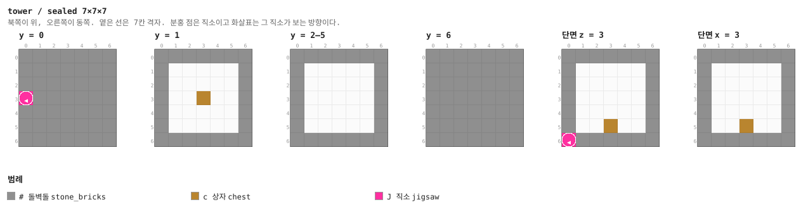

<details><summary>층별 지도 (텍스트)</summary>

```
y = 0   x →동, z ↓남
  #######
  #######
  #######
  J######
  #######
  #######
  #######
y = 1   x →동, z ↓남
  #######
  #.....#
  #.....#
  #..c..#
  #.....#
  #.....#
  #######
y = 2–5   x →동, z ↓남
  #######
  #.....#
  #.....#
  #.....#
  #.....#
  #.....#
  #######
y = 6   x →동, z ↓남
  #######
  #######
  #######
  #######
  #######
  #######
  #######
```

</details>


## 다음 버전에서

0.5.0은 **자연 생성이 붙은 첫 판**이다. 모양을 더 만드는 일은 다음으로 미뤘다.

- **지붕이 없다.** 8층 천장이 곧 탑의 끝이다. 기능은 없고 모양만 있으면 되는데, 그래서
  더욱 손으로 지을 일이다
- **테두리가 밋밋하다.** `ring_floor`(29×7×29)는 코드가 민 평평한 벽이고, 층마다 조각한
  돌벽돌 띠 한 줄이 전부다. 구조물 블록 한계(48) 안이라 **손으로 지어 넣으면 그걸 쌓는다**
- **조각 종류가 적다.** 보상 방이 `dead_end` 하나뿐이라 전부 같이 생겼다. 통로도 직선·모퉁이·
  삼거리·사거리에 경비 변형 둘이 전부다. 같은 문 배치의 조각을 여러 개 만들어 풀에 넣으면
  그만큼 다양해진다 — 배선은 안 건드려도 된다
- **곁방이 한 층에 두세 칸뿐이다.** 경로 비율(`ROUTE_SHARE`)을 낮추면 방이 늘고 복도가 준다
